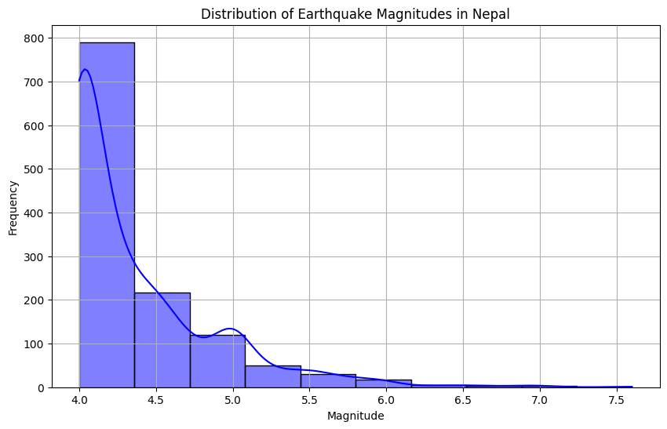
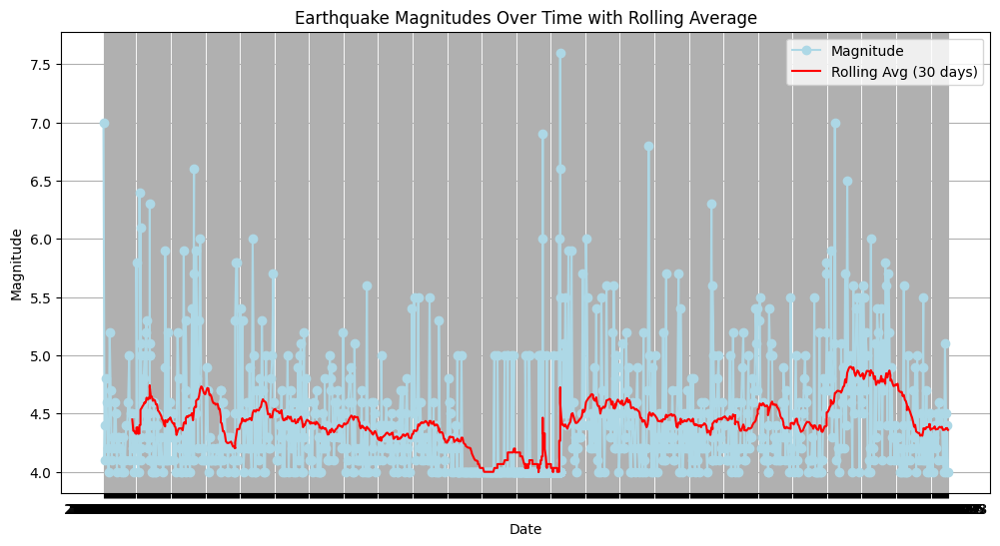
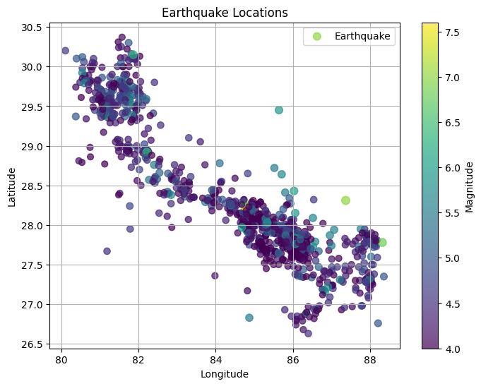
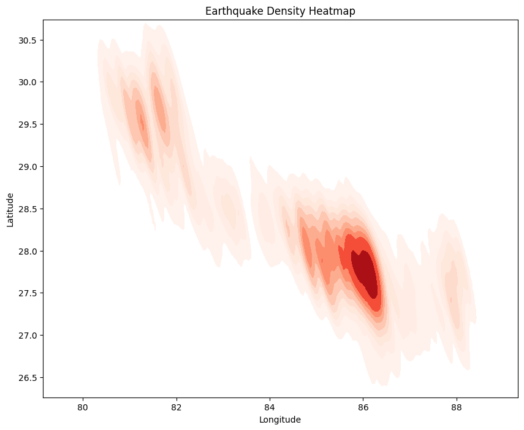

**Disclaimer:** Scraping data is often considered illegal and unethical if done without proper permissions. This project and its content are intended **solely for educational purposes** to demonstrate technical concepts. Data is scraped from https://seismonepal.gov.np/earthquakes


```python
#scraping data

import requests
from bs4 import BeautifulSoup
import pandas as pd

# Scrape data from the website
base_url = "https://seismonepal.gov.np/earthquakes/index"

max_pages = 62  # Update as needed
# max_pages = 5  # to test

# Function to scrape data from a single page
def scrape_page(page_url):
    response = requests.get(page_url)
    soup = BeautifulSoup(response.text, 'html.parser')

    # Locate the table
    table = soup.find('table', {'class': 'table table-striped table-bordered'})
    rows = table.find('tbody').find_all('tr')

    data = []
    for row in rows:
        cols = row.find_all('td')
        cols = [col.text.strip() for col in cols]
        if cols:  # Check for non-empty rows
            data.append({
                'Date': cols[1],
                'Time': cols[2],
                'Latitude': str(cols[3]),
                'Longitude': str(cols[4]),
                'Magnitude': cols[5],
                'Epicenter': cols[6]
            })
    return data

# Main function to scrape multiple pages
def scrape_all_pages(base_url, max_pages):
    all_data = []
    for page in range(1, max_pages + 1):
        url = f"{base_url}?page={page}"
        page_data = scrape_page(url)
        all_data.extend(page_data)
        # print(f"Scraped page {page}") #this step can take some time, to see the progress of scraping data, uncomment this line
    return all_data

data = scrape_all_pages(base_url, max_pages)
# print(data)
print('data scraped successfully')
```

    data scraped successfully


```python
#cleaning data

# Function to clean date field
def clean_date(date_str):
    # Extract the A.D. date part
    if 'A.D.:' in date_str:
        return date_str.split('A.D.:')[1].strip()
    return None

# Function to clean time field
def clean_time(time_str):
    # Extract the Local time part
    if 'Local:' in time_str:
        return time_str.split('Local:')[1].split('UTC:')[0].strip()
    return None

# Function to clean numeric fields
def clean_numeric(value):
    try:
        return float(value)
    except ValueError:
        return None

# Clean and process the data
cleaned_data = []
for entry in data:
    cleaned_entry = {
        'Date': clean_date(entry['Date']),
        'Time': clean_time(entry['Time']),
        'Latitude': clean_numeric(entry['Latitude']),
        'Longitude': clean_numeric(entry['Longitude']),
        'Magnitude': clean_numeric(entry['Magnitude']),
        'Epicenter': entry['Epicenter']
    }
    cleaned_data.append(cleaned_entry)

# Convert to DataFrame
df = pd.DataFrame(cleaned_data)

#remove null value from latitude and longitude
df = df.dropna(subset=['Latitude', 'Longitude'], how='any')

# Ensure the Latitude and Longitude columns are treated as strings before replacing
df.loc[:, 'Latitude'] = df['Latitude'].astype(str).str.replace(':', '.').astype(float)
df.loc[:, 'Longitude'] = df['Longitude'].astype(str).str.replace(':', '.').astype(float)

# Convert 'Date' to date-only
df['Date'] = pd.to_datetime(df['Date']).dt.date

# Combine 'Date' and 'Time' when needed
df['Datetime'] = pd.to_datetime(df['Date'].astype(str) + ' ' + df['Time'].astype(str))

# Save to CSV
df.to_csv('earthquake_data_nepal.csv', index=False)
print("Data saved to earthquake_data_nepal.csv")
```

    Data saved to earthquake_data_nepal.csv


```python
import pandas as pd
# Load data
df = pd.read_csv('earthquake_data_nepal.csv')
```


```python
print(df.info())
```

    <class 'pandas.core.frame.DataFrame'>
    RangeIndex: 1234 entries, 0 to 1233
    Data columns (total 7 columns):
     #   Column     Non-Null Count  Dtype  
    ---  ------     --------------  -----  
     0   Date       1234 non-null   object 
     1   Time       1234 non-null   object 
     2   Latitude   1234 non-null   float64
     3   Longitude  1234 non-null   float64
     4   Magnitude  1234 non-null   float64
     5   Epicenter  1234 non-null   object 
     6   Datetime   1234 non-null   object 
    dtypes: float64(3), object(4)
    memory usage: 67.6+ KB
    None


```python
# Display DataFrame
print(df)
```

                Date   Time  Latitude  Longitude  Magnitude        Epicenter  \
    0     2025-01-07  06:50     28.31      87.37        7.0  Dinggye, China*   
    1     2025-01-03  08:03     29.57      82.19        4.4             Mugu   
    2     2025-01-03  08:29     28.54      84.13        4.1           Manang   
    3     2025-01-02  13:02     27.77      85.57        4.8    Sindhupalchok   
    4     2024-12-31  07:54     29.45      80.86        4.6          Baitadi   
    ...          ...    ...       ...        ...        ...              ...   
    1232  1994-06-25  14:17     27.82      86.19        5.1          Dolakha   
    1233  1994-05-25  19:10     29.80      82.41        4.5             Mugu   
    1234  1994-05-25  12:00     29.81      81.77        4.0           Bajura   
    1235  1994-05-03  00:30     28.52      83.03        4.4          Baglung   
    1236  1994-03-08  07:50     29.33      81.83        4.0          Kalikot   
    
                    Datetime  
    0    2025-01-07 06:50:00  
    1    2025-01-03 08:03:00  
    2    2025-01-03 08:29:00  
    3    2025-01-02 13:02:00  
    4    2024-12-31 07:54:00  
    ...                  ...  
    1232 1994-06-25 14:17:00  
    1233 1994-05-25 19:10:00  
    1234 1994-05-25 12:00:00  
    1235 1994-05-03 00:30:00  
    1236 1994-03-08 07:50:00  
    
    [1234 rows x 7 columns]


```python
print(df.describe())
```

              Latitude    Longitude    Magnitude
    count  1234.000000  1234.000000  1234.000000
    mean     28.285024    84.664668     4.371556
    std       1.892666     2.140369     0.502864
    min      23.710000    69.850000     4.000000
    25%      27.720000    82.550000     4.000000
    50%      27.940000    85.340000     4.200000
    75%      28.617500    86.100000     4.500000
    max      87.840000    89.880000     7.600000


```python
import matplotlib.pyplot as plt
import seaborn as sns

# Visualization: Histogram of Magnitudes
plt.figure(figsize=(10, 6))  # Adjust figure size if needed
sns.histplot(df['Magnitude'], bins=10, kde=True, color='blue')
plt.title('Distribution of Earthquake Magnitudes in Nepal')
plt.xlabel('Magnitude')
plt.ylabel('Frequency')
plt.grid(True)
plt.show()
```


    

    


```python
# Calculate Time Series Analysis with Rolling Averages
df['Rolling_Magnitude_Avg'] = df['Magnitude'].rolling(window=30).mean()

# Plot time series with rolling average
plt.figure(figsize=(12, 6))
plt.plot(df['Date'], df['Magnitude'], marker='o', linestyle='-', color='lightblue', label='Magnitude')
plt.plot(df['Date'], df['Rolling_Magnitude_Avg'], color='red', label='Rolling Avg (30 days)')
plt.title('Earthquake Magnitudes Over Time with Rolling Average')
plt.xlabel('Date')
plt.ylabel('Magnitude')
plt.grid(True)
plt.legend()
plt.show()
```


    

    


```python
# Visualization: Scatter Plot of Earthquake Locations

# Define the bounding box for Nepal (approximate values)
min_latitude = 26.3
max_latitude = 30.5
min_longitude = 80.0
max_longitude = 88.5

# Filter the DataFrame
filtered_df = df[
    (df['Latitude'] >= min_latitude) & (df['Latitude'] <= max_latitude) &
    (df['Longitude'] >= min_longitude) & (df['Longitude'] <= max_longitude)
]
plt.figure(figsize=(8, 6))

cmap = 'viridis' # Using built-in colormap

plt.scatter(filtered_df['Longitude'], filtered_df['Latitude'],
            s=filtered_df['Magnitude']*10, alpha=0.7,
            c=filtered_df['Magnitude'], cmap=cmap, label='Earthquake')
plt.colorbar(label='Magnitude')
plt.title('Earthquake Locations')
plt.xlabel('Longitude')
plt.ylabel('Latitude')
plt.legend()
plt.grid(True)
plt.show()
```


    

    


```python
# Create a heatmap
plt.figure(figsize=(10, 8))
sns.kdeplot(x=filtered_df['Longitude'], y=filtered_df['Latitude'], cmap="Reds", fill=True, bw_adjust=.5)
plt.title('Earthquake Density Heatmap')
plt.xlabel('Longitude')
plt.ylabel('Latitude')
plt.show()
```


    

    


```python
# Code for Heatmap on Nepal Map
import folium
from folium.plugins import HeatMap
from folium.plugins import MarkerCluster

# Initialize a map centered around Nepal
nepal_map = folium.Map(location=[28.3949, 84.1240], zoom_start=7)

# Prepare data for HeatMap
heat_data = df[['Latitude', 'Longitude', 'Magnitude']].values.tolist()

# Add HeatMap layer
HeatMap(heat_data, radius=15).add_to(nepal_map)

# Add a custom legend
legend_html = """
<div style="
    position: fixed; 
    bottom: 50px; left: 50px; width: 200px; height: 90px; 
    background-color: white; 
    border:2px solid grey; z-index:9999; font-size:14px;
    padding: 10px;
">
    <strong>Earthquake Magnitude</strong><br>
    <i style="background: rgba(255, 0, 0, 0.7); width: 20px; height: 10px; display: inline-block;"></i> High Magnitude<br>
    <i style="background: rgba(255, 165, 0, 0.7); width: 20px; height: 10px; display: inline-block;"></i> Medium Magnitude<br>
    <i style="background: rgba(0, 255, 0, 0.7); width: 20px; height: 10px; display: inline-block;"></i> Low Magnitude
</div>
"""

# Add legend to the map
nepal_map.get_root().html.add_child(folium.Element(legend_html))

# Initialize a MarkerCluster
marker_cluster = MarkerCluster().add_to(nepal_map)

# Add markers to the cluster
for _, row in df.iterrows():
    folium.Marker(
        location=[row['Latitude'], row['Longitude']],
        popup=f"""
            <strong>Earthquake Details</strong><br>
            Magnitude: {row['Magnitude']}<br>
            Latitude: {row['Latitude']}<br>
            Longitude: {row['Longitude']}
        """
    ).add_to(marker_cluster)


# Save the map as an HTML file
nepal_map.save("nepal_earthquake_heatmap_with_legend.html")

print("Map saved to nepal_earthquake_heatmap_with_legend.html")
# Display the map (if running in a Jupyter Notebook or interactive environment)
nepal_map

```

    Map saved to nepal_earthquake_heatmap_with_legend.html


<div style="width:100%;"><div style="position:relative;width:100%;height:0;padding-bottom:60%;"><span style="color:#565656">Make this Notebook Trusted to load map: File -> Trust Notebook</span><iframe srcdoc="&lt;!DOCTYPE html&gt;
&lt;html&gt;
&lt;head&gt;

    &lt;meta http-equiv=&quot;content-type&quot; content=&quot;text/html; charset=UTF-8&quot; /&gt;

        &lt;script&gt;
            L_NO_TOUCH = false;
            L_DISABLE_3D = false;
        &lt;/script&gt;

    &lt;style&gt;html, body {width: 100%;height: 100%;margin: 0;padding: 0;}&lt;/style&gt;
    &lt;style&gt;#map {position:absolute;top:0;bottom:0;right:0;left:0;}&lt;/style&gt;
    &lt;script src=&quot;https://cdn.jsdelivr.net/npm/leaflet@1.9.3/dist/leaflet.js&quot;&gt;&lt;/script&gt;
    &lt;script src=&quot;https://code.jquery.com/jquery-3.7.1.min.js&quot;&gt;&lt;/script&gt;
    &lt;script src=&quot;https://cdn.jsdelivr.net/npm/bootstrap@5.2.2/dist/js/bootstrap.bundle.min.js&quot;&gt;&lt;/script&gt;
    &lt;script src=&quot;https://cdnjs.cloudflare.com/ajax/libs/Leaflet.awesome-markers/2.0.2/leaflet.awesome-markers.js&quot;&gt;&lt;/script&gt;
    &lt;link rel=&quot;stylesheet&quot; href=&quot;https://cdn.jsdelivr.net/npm/leaflet@1.9.3/dist/leaflet.css&quot;/&gt;
    &lt;link rel=&quot;stylesheet&quot; href=&quot;https://cdn.jsdelivr.net/npm/bootstrap@5.2.2/dist/css/bootstrap.min.css&quot;/&gt;
    &lt;link rel=&quot;stylesheet&quot; href=&quot;https://netdna.bootstrapcdn.com/bootstrap/3.0.0/css/bootstrap-glyphicons.css&quot;/&gt;
    &lt;link rel=&quot;stylesheet&quot; href=&quot;https://cdn.jsdelivr.net/npm/@fortawesome/fontawesome-free@6.2.0/css/all.min.css&quot;/&gt;
    &lt;link rel=&quot;stylesheet&quot; href=&quot;https://cdnjs.cloudflare.com/ajax/libs/Leaflet.awesome-markers/2.0.2/leaflet.awesome-markers.css&quot;/&gt;
    &lt;link rel=&quot;stylesheet&quot; href=&quot;https://cdn.jsdelivr.net/gh/python-visualization/folium/folium/templates/leaflet.awesome.rotate.min.css&quot;/&gt;

            &lt;meta name=&quot;viewport&quot; content=&quot;width=device-width,
                initial-scale=1.0, maximum-scale=1.0, user-scalable=no&quot; /&gt;
            &lt;style&gt;
                #map_39fb0d61cbddef1bd27e4f2ff85484e3 {
                    position: relative;
                    width: 100.0%;
                    height: 100.0%;
                    left: 0.0%;
                    top: 0.0%;
                }
                .leaflet-container { font-size: 1rem; }
            &lt;/style&gt;

    &lt;script src=&quot;https://cdn.jsdelivr.net/gh/python-visualization/folium@main/folium/templates/leaflet_heat.min.js&quot;&gt;&lt;/script&gt;
    &lt;script src=&quot;https://cdnjs.cloudflare.com/ajax/libs/leaflet.markercluster/1.1.0/leaflet.markercluster.js&quot;&gt;&lt;/script&gt;
    &lt;link rel=&quot;stylesheet&quot; href=&quot;https://cdnjs.cloudflare.com/ajax/libs/leaflet.markercluster/1.1.0/MarkerCluster.css&quot;/&gt;
    &lt;link rel=&quot;stylesheet&quot; href=&quot;https://cdnjs.cloudflare.com/ajax/libs/leaflet.markercluster/1.1.0/MarkerCluster.Default.css&quot;/&gt;
&lt;/head&gt;
&lt;body&gt;


&lt;div style=&quot;
    position: fixed; 
    bottom: 50px; left: 50px; width: 200px; height: 90px; 
    background-color: white; 
    border:2px solid grey; z-index:9999; font-size:14px;
    padding: 10px;
&quot;&gt;
    &lt;strong&gt;Earthquake Magnitude&lt;/strong&gt;&lt;br&gt;
    &lt;i style=&quot;background: rgba(255, 0, 0, 0.7); width: 20px; height: 10px; display: inline-block;&quot;&gt;&lt;/i&gt; High Magnitude&lt;br&gt;
    &lt;i style=&quot;background: rgba(255, 165, 0, 0.7); width: 20px; height: 10px; display: inline-block;&quot;&gt;&lt;/i&gt; Medium Magnitude&lt;br&gt;
    &lt;i style=&quot;background: rgba(0, 255, 0, 0.7); width: 20px; height: 10px; display: inline-block;&quot;&gt;&lt;/i&gt; Low Magnitude
&lt;/div&gt;

            &lt;div class=&quot;folium-map&quot; id=&quot;map_39fb0d61cbddef1bd27e4f2ff85484e3&quot; &gt;&lt;/div&gt;

&lt;/body&gt;
&lt;script&gt;


            var map_39fb0d61cbddef1bd27e4f2ff85484e3 = L.map(
                &quot;map_39fb0d61cbddef1bd27e4f2ff85484e3&quot;,
                {
                    center: [28.3949, 84.124],
                    crs: L.CRS.EPSG3857,
                    ...{
  &quot;zoom&quot;: 7,
  &quot;zoomControl&quot;: true,
  &quot;preferCanvas&quot;: false,
}

                }
            );


            var tile_layer_9b4ebf845be98f0043cfa9bbb9552590 = L.tileLayer(
                &quot;https://tile.openstreetmap.org/{z}/{x}/{y}.png&quot;,
                {
  &quot;minZoom&quot;: 0,
  &quot;maxZoom&quot;: 19,
  &quot;maxNativeZoom&quot;: 19,
  &quot;noWrap&quot;: false,
  &quot;attribution&quot;: &quot;\u0026copy; \u003ca href=\&quot;https://www.openstreetmap.org/copyright\&quot;\u003eOpenStreetMap\u003c/a\u003e contributors&quot;,
  &quot;subdomains&quot;: &quot;abc&quot;,
  &quot;detectRetina&quot;: false,
  &quot;tms&quot;: false,
  &quot;opacity&quot;: 1,
}

            );


            tile_layer_9b4ebf845be98f0043cfa9bbb9552590.addTo(map_39fb0d61cbddef1bd27e4f2ff85484e3);


            var heat_map_6dfa216e0e51a03f4bceeeff20f5f466 = L.heatLayer(
                [[28.31, 87.37, 7.0], [29.57, 82.19, 4.4], [28.54, 84.13, 4.1], [27.77, 85.57, 4.8], [29.45, 80.86, 4.6], [29.07, 82.32, 4.2], [30.04, 80.85, 4.0], [29.37, 81.64, 5.2], [28.55, 84.15, 4.7], [29.7, 81.3, 4.1], [29.71, 81.3, 4.3], [28.53, 84.13, 4.2], [27.85, 86.15, 4.6], [27.74, 86.15, 4.5], [29.49, 80.82, 4.0], [29.43, 81.07, 4.3], [29.54, 81.3, 4.3], [28.07, 85.55, 4.2], [28.86, 81.55, 4.1], [28.05, 85.26, 4.0], [29.51, 81.45, 4.3], [28.44, 84.08, 4.0], [27.66, 86.23, 4.1], [29.45, 81.01, 4.4], [29.55, 81.09, 4.4], [28.1, 85.75, 4.6], [27.94, 85.84, 5.0], [29.63, 81.15, 4.1], [27.67, 81.18, 4.5], [29.61, 81.27, 4.5], [28.6, 82.87, 4.2], [28.58, 82.85, 4.3], [28.91, 82.11, 4.0], [28.94, 82.13, 4.2], [28.93, 82.16, 4.5], [28.94, 82.21, 5.8], [28.91, 82.2, 4.1], [28.88, 82.2, 4.0], [28.94, 82.24, 4.2], [28.96, 82.17, 4.2], [28.95, 82.19, 4.5], [28.92, 82.26, 4.5], [28.88, 82.2, 4.3], [28.92, 82.21, 6.4], [27.95, 84.79, 4.1], [27.95, 84.79, 5.1], [28.0, 84.8, 4.3], [27.99, 84.81, 4.2], [27.96, 84.79, 5.0], [28.03, 84.83, 4.4], [27.94, 84.79, 6.1], [29.6, 81.28, 4.4], [29.62, 81.19, 4.6], [30.06, 80.58, 4.8], [29.49, 81.25, 5.0], [28.48, 83.21, 4.4], [29.61, 81.19, 5.2], [29.58, 81.26, 5.3], [29.61, 81.24, 4.3], [29.77, 81.24, 4.2], [29.6, 81.23, 4.5], [29.6, 81.23, 4.5], [29.62, 81.27, 4.1], [29.59, 81.28, 4.1], [29.55, 81.18, 5.1], [29.56, 81.16, 5.0], [29.52, 81.18, 4.4], [29.63, 81.2, 4.3], [29.65, 81.27, 5.0], [29.41, 81.26, 4.3], [29.59, 81.19, 6.3], [29.53, 81.14, 4.3], [29.58, 81.1, 4.1], [26.97, 87.54, 4.1], [27.37, 87.06, 4.0], [28.43, 83.99, 4.0], [27.95, 81.78, 4.6], [28.15, 84.54, 4.0], [29.78, 80.92, 4.0], [29.72, 81.61, 4.4], [29.66, 81.61, 4.5], [29.68, 81.61, 4.1], [28.62, 82.84, 4.1], [29.73, 81.62, 4.3], [29.78, 81.58, 4.1], [29.89, 81.93, 4.0], [29.74, 81.63, 4.1], [29.75, 81.56, 4.9], [29.78, 81.61, 5.9], [29.38, 81.34, 4.1], [28.17, 84.74, 4.1], [27.76, 86.19, 5.2], [28.12, 84.9, 4.1], [27.86, 87.89, 4.6], [29.42, 81.66, 4.3], [29.64, 81.89, 4.5], [28.95, 81.68, 4.1], [29.29, 81.4, 4.4], [27.57, 85.59, 4.3], [27.82, 88.02, 4.0], [27.08, 87.96, 4.3], [29.68, 81.67, 5.2], [27.83, 87.95, 4.8], [28.8, 82.53, 4.2], [29.71, 81.62, 4.0], [27.42, 87.47, 4.0], [29.64, 81.68, 4.1], [29.75, 81.7, 5.9], [27.8, 85.81, 4.2], [28.45, 83.09, 4.0], [28.45, 83.14, 4.7], [28.36, 83.19, 5.3], [29.1, 83.3, 4.6], [30.0, 80.74, 4.1], [28.26, 85.06, 4.5], [26.93, 87.26, 4.0], [29.35, 81.21, 4.2], [29.45, 81.19, 5.4], [29.35, 81.29, 4.1], [29.38, 81.13, 6.6], [29.38, 81.11, 4.1], [29.38, 81.11, 5.7], [29.6, 81.04, 4.6], [28.07, 86.02, 4.5], [28.15, 86.06, 5.9], [28.24, 81.77, 4.8], [27.97, 85.54, 4.2], [27.83, 85.15, 5.3], [27.16, 86.83, 6.0], [27.94, 85.52, 4.7], [29.41, 81.34, 4.1], [29.82, 80.76, 4.2], [27.66, 86.2, 4.1], [28.1, 84.81, 4.1], [28.33, 83.86, 4.9], [27.7, 85.41, 4.7], [29.61, 80.51, 4.0], [27.3, 87.73, 4.3], [27.31, 87.94, 4.1], [29.35, 82.04, 4.1], [29.58, 81.0, 4.1], [27.9, 87.86, 4.2], [29.7, 80.71, 4.1], [27.9, 84.57, 4.1], [27.98, 85.58, 4.1], [28.68, 82.97, 4.2], [27.67, 86.32, 4.2], [27.87, 85.92, 4.1], [28.29, 84.36, 4.1], [27.92, 85.81, 4.7], [27.86, 85.82, 4.0], [27.92, 85.8, 4.7], [27.85, 85.81, 4.1], [28.18, 84.93, 4.3], [27.91, 85.81, 4.1], [27.92, 85.81, 4.6], [27.71, 85.92, 4.2], [27.91, 85.8, 4.5], [29.89, 80.59, 4.2], [27.64, 86.1, 4.3], [29.61, 81.01, 4.0], [26.98, 86.69, 4.3], [27.28, 86.9, 4.2], [28.98, 81.47, 4.3], [28.13, 84.56, 4.2], [29.79, 81.59, 4.1], [27.3, 87.26, 4.0], [28.26, 84.35, 4.0], [28.27, 84.42, 4.0], [28.24, 84.41, 4.5], [28.26, 84.36, 4.1], [28.27, 84.4, 5.3], [28.28, 84.39, 5.8], [26.75, 89.09, 5.8], [27.5, 85.63, 4.1], [27.79, 86.35, 4.2], [27.89, 87.91, 5.4], [27.78, 88.15, 4.5], [28.78, 84.1, 5.3], [27.66, 86.18, 4.0], [29.89, 80.7, 4.2], [27.66, 87.62, 4.4], [27.66, 86.34, 4.6], [27.77, 87.86, 4.2], [27.75, 85.87, 4.2], [27.73, 87.87, 4.9], [29.58, 80.81, 4.2], [27.62, 86.24, 4.0], [27.77, 85.88, 6.0], [26.76, 88.21, 5.0], [27.92, 84.94, 4.0], [27.58, 87.19, 4.0], [29.59, 80.89, 4.7], [27.8, 87.62, 4.2], [27.88, 86.2, 4.1], [27.85, 84.93, 4.8], [29.73, 82.01, 4.2], [27.65, 86.15, 5.3], [27.55, 86.59, 4.7], [29.58, 80.96, 4.0], [28.01, 84.97, 4.0], [28.34, 83.8, 5.0], [27.79, 86.18, 4.3], [29.71, 81.96, 4.3], [29.61, 81.71, 4.2], [29.59, 81.73, 4.2], [29.58, 81.71, 4.5], [27.95, 85.59, 4.8], [27.79, 85.79, 5.0], [29.42, 81.1, 5.7], [30.2, 80.1, 4.6], [28.45, 83.23, 4.5], [29.66, 82.04, 4.1], [26.88, 86.59, 4.1], [27.82, 87.98, 4.2], [28.66, 83.06, 4.4], [30.0, 81.45, 4.3], [28.28, 84.65, 4.7], [27.71, 86.32, 4.0], [28.25, 84.49, 4.4], [28.15, 84.61, 4.0], [28.21, 84.49, 4.5], [29.8, 80.48, 4.4], [30.3, 81.74, 5.0], [27.52, 86.39, 4.0], [27.69, 86.26, 4.3], [28.5, 83.22, 4.7], [27.8, 86.15, 4.2], [27.67, 85.42, 4.6], [27.95, 84.8, 4.0], [28.95, 81.98, 4.5], [29.52, 81.05, 4.0], [29.62, 82.11, 4.6], [29.5, 81.28, 4.3], [27.7, 86.47, 4.9], [28.21, 84.37, 4.1], [27.85, 84.87, 5.0], [28.98, 81.78, 5.1], [27.94, 85.72, 4.0], [27.93, 85.94, 4.0], [27.69, 85.17, 5.2], [27.7, 85.14, 4.3], [28.0, 84.76, 4.5], [29.49, 81.24, 4.8], [28.03, 85.38, 4.6], [27.76, 86.27, 4.2], [28.98, 81.69, 4.1], [27.63, 85.16, 4.1], [27.66, 86.0, 4.4], [27.84, 85.95, 4.1], [27.68, 85.27, 4.0], [27.81, 88.18, 4.6], [27.09, 86.96, 4.5], [27.6, 86.31, 4.5], [27.85, 85.76, 4.7], [27.72, 86.02, 4.0], [28.94, 81.72, 4.3], [28.93, 81.7, 4.0], [28.94, 81.74, 4.0], [28.57, 82.88, 4.0], [27.79, 87.41, 4.2], [27.5, 88.04, 4.5], [27.66, 86.1, 4.2], [27.94, 85.51, 4.3], [27.75, 84.87, 4.8], [29.02, 81.51, 4.2], [27.82, 84.81, 4.4], [29.57, 81.56, 4.1], [28.11, 85.04, 4.1], [27.87, 84.91, 5.0], [27.31, 87.9, 4.7], [27.36, 88.01, 4.8], [29.68, 81.65, 4.9], [27.68, 86.11, 4.3], [28.9, 81.77, 4.3], [28.17, 84.89, 4.1], [29.98, 80.54, 4.6], [27.74, 88.13, 4.4], [27.7, 86.33, 4.6], [27.7, 86.33, 4.7], [28.07, 85.96, 4.3], [27.72, 86.01, 4.3], [29.82, 80.76, 4.5], [27.96, 85.68, 4.2], [27.63, 86.19, 5.2], [29.78, 81.28, 4.5], [29.08, 81.45, 4.0], [28.5, 83.32, 4.2], [28.83, 82.55, 4.1], [27.62, 86.25, 4.6], [28.06, 85.94, 4.8], [29.41, 81.1, 4.9], [27.66, 86.27, 4.6], [27.56, 85.96, 4.0], [28.94, 81.75, 4.0], [27.34, 86.49, 5.1], [27.66, 86.41, 4.2], [27.88, 88.13, 4.1], [27.62, 86.1, 4.1], [29.64, 80.97, 4.1], [29.75, 81.31, 4.1], [27.86, 85.77, 4.2], [30.37, 81.57, 4.1], [27.38, 86.13, 4.7], [27.36, 86.12, 4.6], [27.79, 84.8, 4.0], [29.88, 80.61, 4.1], [27.73, 86.08, 4.4], [29.71, 81.57, 4.0], [27.79, 86.58, 5.6], [29.69, 81.05, 4.0], [27.87, 85.3, 4.0], [28.04, 85.17, 4.1], [27.66, 85.95, 4.1], [27.67, 85.95, 4.6], [27.65, 86.13, 4.2], [27.91, 85.77, 4.6], [27.78, 86.35, 4.5], [27.82, 86.14, 4.1], [29.81, 81.56, 4.0], [27.99, 84.71, 4.1], [27.84, 86.16, 4.1], [27.92, 85.66, 4.4], [28.31, 84.35, 4.3], [29.64, 81.28, 4.4], [29.63, 81.24, 4.2], [29.63, 81.28, 5.0], [27.76, 86.34, 4.1], [27.93, 85.21, 4.4], [28.03, 84.64, 4.3], [27.96, 85.62, 4.4], [27.94, 85.5, 4.6], [27.73, 85.16, 4.2], [27.93, 85.5, 4.4], [27.97, 85.55, 4.3], [27.69, 86.24, 4.1], [28.01, 84.68, 4.5], [28.01, 84.94, 4.4], [28.24, 84.99, 4.1], [29.38, 81.88, 4.0], [29.54, 81.1, 4.2], [28.05, 85.38, 4.3], [28.08, 85.13, 4.2], [27.72, 86.29, 4.0], [27.79, 85.85, 4.0], [27.56, 86.17, 4.4], [27.65, 85.31, 4.5], [27.72, 86.09, 4.7], [29.81, 81.51, 4.3], [27.93, 85.59, 4.1], [27.89, 85.73, 4.7], [27.75, 88.04, 4.1], [27.34, 86.27, 4.0], [27.84, 85.73, 4.5], [27.83, 84.9, 4.8], [27.9, 85.87, 4.2], [30.22, 81.7, 4.0], [27.69, 85.93, 4.0], [27.79, 85.73, 4.3], [27.8, 85.74, 5.4], [27.47, 87.15, 4.5], [28.08, 84.76, 5.5], [27.86, 85.29, 4.1], [27.81, 85.72, 4.3], [27.84, 85.71, 4.6], [27.95, 85.52, 5.5], [26.68, 86.27, 4.2], [27.83, 85.83, 4.4], [28.06, 85.09, 4.6], [27.65, 86.23, 4.3], [27.63, 86.25, 4.1], [27.48, 86.01, 4.4], [27.75, 86.12, 4.1], [28.01, 85.8, 4.2], [27.86, 85.72, 4.3], [27.7, 86.12, 4.2], [29.35, 81.29, 4.1], [27.79, 86.08, 4.1], [29.44, 81.69, 5.5], [28.04, 85.02, 4.1], [27.86, 86.19, 4.0], [27.78, 85.39, 4.1], [27.11, 87.95, 4.6], [27.63, 85.53, 4.1], [27.87, 85.77, 4.1], [28.15, 84.81, 4.4], [27.87, 85.29, 4.0], [28.43, 83.3, 4.1], [28.35, 83.36, 4.0], [27.77, 85.88, 4.0], [27.89, 85.75, 5.3], [28.02, 85.28, 4.3], [27.99, 85.65, 4.2], [28.03, 85.23, 4.3], [27.8, 86.3, 4.2], [27.71, 86.16, 4.2], [27.96, 85.54, 4.1], [27.57, 85.31, 4.0], [27.68, 86.08, 4.2], [27.69, 86.09, 4.2], [27.71, 86.15, 4.8], [27.71, 86.1, 4.2], [29.83, 80.6, 4.6], [27.77, 85.87, 4.6], [27.74, 85.07, 4.5], [27.76, 86.37, 4.0], [27.6, 86.19, 4.2], [27.82, 86.24, 4.0], [27.75, 86.01, 4.3], [27.64, 86.19, 4.4], [27.92, 85.69, 4.2], [27.66, 86.23, 4.0], [27.72, 85.75, 5.0], [27.92, 84.94, 4.0], [28.12, 84.89, 4.0], [27.85, 85.74, 4.0], [30.11, 81.53, 4.0], [27.68, 86.22, 4.0], [27.87, 86.17, 5.0], [27.96, 85.48, 4.0], [28.0, 85.29, 4.0], [27.93, 86.14, 4.0], [27.71, 86.05, 4.0], [27.87, 86.08, 4.0], [27.59, 85.97, 4.0], [27.72, 85.2, 4.0], [27.7, 85.29, 4.0], [28.14, 84.72, 4.0], [30.1, 81.85, 4.0], [27.94, 85.52, 4.0], [27.77, 85.7, 4.0], [27.69, 86.26, 4.0], [27.5, 85.5, 4.0], [27.86, 85.76, 4.0], [27.63, 86.07, 4.0], [27.64, 86.07, 4.0], [27.81, 85.71, 4.0], [27.66, 86.09, 4.0], [27.8, 85.75, 4.0], [27.68, 86.04, 4.0], [27.59, 86.17, 4.0], [27.94, 85.48, 4.0], [27.85, 85.75, 4.0], [27.68, 86.22, 4.0], [27.66, 86.0, 4.0], [27.61, 86.28, 4.0], [27.7, 85.32, 4.0], [27.86, 86.39, 4.0], [28.18, 84.74, 4.0], [29.8, 80.73, 4.0], [27.63, 86.09, 4.0], [28.06, 85.34, 4.0], [27.8, 86.23, 4.0], [27.89, 85.73, 4.0], [27.6, 86.23, 4.0], [27.92, 85.68, 4.0], [28.48, 83.13, 4.0], [29.69, 81.74, 4.0], [27.69, 86.2, 4.0], [27.96, 85.75, 4.0], [27.67, 86.2, 4.0], [27.86, 85.87, 4.0], [27.73, 85.0, 4.0], [27.97, 85.62, 5.0], [27.67, 85.54, 4.0], [27.71, 86.12, 4.0], [27.8, 85.74, 4.0], [28.06, 85.14, 4.0], [27.55, 85.79, 4.0], [27.93, 85.64, 4.0], [27.92, 85.68, 4.0], [27.35, 86.2, 5.0], [27.92, 85.66, 4.0], [27.74, 86.28, 4.0], [27.58, 85.39, 4.0], [27.66, 86.21, 4.0], [27.78, 85.17, 4.0], [27.94, 85.49, 4.0], [27.85, 85.75, 4.0], [27.67, 86.17, 4.0], [27.8, 86.0, 4.0], [28.65, 82.76, 5.0], [28.17, 84.94, 4.0], [28.26, 84.92, 4.0], [28.14, 85.11, 4.0], [27.9, 85.58, 4.0], [28.27, 85.94, 5.0], [27.91, 85.59, 5.0], [27.68, 85.28, 4.0], [27.7, 86.16, 4.0], [27.87, 85.72, 4.0], [27.74, 86.26, 4.0], [27.8, 85.15, 4.0], [27.73, 86.16, 5.0], [28.21, 84.81, 4.0], [27.67, 86.09, 4.0], [27.96, 85.73, 5.0], [27.8, 85.78, 4.0], [27.67, 86.07, 4.0], [27.87, 85.81, 4.0], [27.8, 85.61, 4.0], [27.62, 86.1, 4.0], [27.9, 85.64, 4.0], [27.87, 86.13, 4.0], [28.26, 85.86, 4.0], [27.58, 86.18, 4.0], [27.7, 85.22, 4.0], [27.79, 85.78, 4.0], [27.76, 86.2, 4.0], [27.84, 85.78, 4.0], [27.79, 85.87, 4.0], [27.76, 86.07, 4.0], [27.7, 86.26, 4.0], [30.0, 81.75, 4.0], [27.78, 86.2, 4.0], [27.98, 85.51, 4.0], [28.29, 84.46, 4.0], [27.79, 85.17, 4.0], [28.01, 85.19, 4.0], [27.75, 85.21, 4.0], [27.82, 86.34, 4.0], [28.07, 84.94, 4.0], [28.17, 84.72, 4.0], [28.01, 84.84, 4.0], [28.0, 84.98, 5.0], [27.99, 84.79, 4.0], [27.95, 84.8, 4.0], [27.64, 85.31, 4.0], [27.77, 86.25, 4.0], [27.59, 86.19, 4.0], [27.59, 86.16, 4.0], [27.94, 85.54, 4.0], [28.04, 85.13, 4.0], [27.89, 85.53, 4.0], [27.91, 85.53, 4.0], [27.59, 86.2, 4.0], [27.84, 86.24, 4.0], [27.63, 86.3, 4.0], [27.71, 86.05, 4.0], [27.54, 85.43, 4.0], [28.02, 85.26, 5.0], [27.74, 86.19, 4.0], [27.71, 86.07, 4.0], [28.01, 84.68, 5.0], [27.67, 86.18, 4.0], [27.76, 86.28, 4.0], [27.84, 86.0, 4.0], [27.8, 86.29, 4.0], [27.76, 86.26, 4.0], [27.9, 85.51, 4.0], [27.74, 86.2, 4.0], [27.79, 85.14, 4.0], [28.05, 85.08, 4.0], [27.63, 86.25, 4.0], [27.78, 85.93, 4.0], [27.69, 86.16, 4.0], [30.31, 81.47, 4.0], [27.85, 86.32, 4.0], [27.93, 85.46, 4.0], [28.02, 84.98, 4.0], [27.52, 85.26, 4.0], [27.84, 86.33, 4.0], [27.92, 86.04, 4.0], [27.9, 85.99, 4.0], [27.66, 86.03, 4.0], [27.71, 86.07, 4.0], [28.11, 84.88, 4.0], [27.69, 86.26, 4.0], [27.84, 86.24, 4.0], [27.48, 85.87, 4.0], [27.73, 86.06, 4.0], [28.07, 84.7, 4.0], [27.65, 86.12, 4.0], [27.66, 86.09, 4.0], [27.97, 85.48, 4.0], [28.13, 84.89, 4.0], [27.7, 85.85, 4.0], [27.45, 85.31, 4.0], [27.6, 86.26, 5.0], [27.64, 86.14, 4.0], [27.63, 86.25, 4.0], [27.69, 86.08, 4.0], [27.93, 84.84, 5.0], [27.92, 84.84, 4.0], [27.61, 86.2, 4.0], [27.74, 86.17, 4.0], [27.92, 86.31, 4.0], [27.66, 86.07, 4.0], [27.67, 86.08, 5.0], [27.8, 85.82, 4.0], [27.83, 86.15, 4.0], [27.62, 86.09, 4.0], [27.75, 86.14, 4.0], [28.06, 85.35, 4.0], [27.71, 86.04, 4.0], [27.84, 85.84, 4.0], [27.79, 86.19, 4.0], [27.75, 86.25, 4.0], [27.65, 86.18, 4.0], [27.85, 85.92, 4.0], [27.82, 86.47, 4.0], [27.91, 84.82, 5.0], [27.68, 85.3, 4.0], [27.69, 86.11, 4.0], [27.79, 86.07, 4.0], [27.84, 86.25, 4.0], [27.7, 86.15, 4.0], [27.64, 85.7, 4.0], [27.63, 86.17, 4.0], [27.85, 86.29, 4.0], [27.6, 86.16, 4.0], [27.68, 86.17, 5.0], [27.8, 85.94, 5.0], [27.66, 86.17, 5.0], [27.79, 86.11, 5.0], [27.88, 85.94, 4.0], [27.68, 86.23, 4.0], [27.69, 86.21, 4.0], [27.8, 86.12, 4.0], [27.68, 86.04, 4.0], [27.63, 86.17, 4.0], [27.69, 86.24, 5.0], [27.84, 86.17, 5.0], [27.76, 86.31, 5.0], [27.8, 85.83, 5.0], [27.73, 86.21, 6.0], [27.82, 86.12, 6.9], [28.16, 84.9, 4.0], [28.1, 84.91, 4.0], [27.7, 86.01, 4.0], [27.8, 85.95, 4.0], [27.58, 86.41, 4.0], [27.68, 86.04, 4.0], [27.89, 85.88, 4.0], [27.97, 86.45, 4.0], [28.03, 86.36, 4.0], [27.84, 86.23, 4.0], [27.78, 85.85, 4.0], [27.72, 85.97, 4.0], [27.7, 86.04, 4.0], [27.71, 86.0, 4.0], [27.72, 86.2, 4.0], [27.62, 86.16, 4.0], [27.76, 86.24, 4.0], [27.73, 86.11, 5.0], [27.69, 86.05, 4.0], [27.57, 86.29, 4.0], [27.68, 86.03, 4.0], [27.99, 85.86, 4.0], [27.91, 85.75, 4.0], [27.65, 85.56, 4.0], [28.02, 85.25, 4.0], [26.94, 86.67, 4.0], [27.88, 86.0, 4.0], [28.04, 85.96, 4.0], [28.04, 85.2, 4.0], [27.94, 85.58, 4.0], [27.69, 86.04, 5.0], [27.75, 85.91, 4.0], [27.77, 85.88, 4.0], [28.01, 85.41, 4.0], [27.92, 85.46, 4.0], [27.79, 85.16, 4.0], [27.75, 85.19, 4.0], [28.04, 85.26, 4.0], [28.01, 84.68, 4.0], [28.06, 85.05, 4.0], [27.74, 86.03, 4.0], [27.96, 86.0, 4.0], [27.75, 85.87, 4.0], [27.69, 85.99, 4.0], [27.97, 85.21, 4.0], [27.79, 85.16, 4.0], [27.8, 85.16, 4.0], [27.79, 86.23, 4.0], [27.95, 85.86, 4.0], [28.12, 84.8, 4.0], [27.74, 86.0, 4.0], [27.69, 85.93, 4.0], [28.05, 84.94, 4.0], [28.08, 85.04, 4.0], [27.98, 84.87, 4.0], [27.94, 84.83, 4.0], [27.8, 85.11, 4.0], [27.89, 85.73, 4.0], [28.09, 85.72, 4.0], [27.95, 85.73, 4.0], [27.74, 86.28, 4.0], [27.93, 85.5, 4.0], [27.72, 85.74, 4.0], [28.24, 84.76, 5.0], [27.66, 86.01, 4.0], [27.7, 85.98, 4.0], [27.68, 85.3, 4.0], [27.75, 85.95, 4.0], [28.04, 85.33, 4.0], [27.74, 85.99, 4.0], [27.88, 85.87, 4.0], [28.04, 85.32, 4.0], [27.93, 84.83, 4.0], [28.05, 85.34, 4.0], [27.65, 86.09, 4.0], [27.92, 85.87, 4.0], [27.93, 85.63, 4.0], [27.79, 85.14, 4.0], [28.04, 85.37, 4.0], [27.86, 84.89, 4.0], [27.95, 85.52, 4.0], [28.19, 84.8, 4.0], [28.29, 84.93, 4.0], [27.92, 85.51, 4.0], [27.89, 85.76, 4.0], [28.1, 84.65, 4.0], [28.1, 85.49, 4.0], [27.81, 86.09, 4.0], [27.76, 85.8, 4.0], [27.96, 85.55, 4.0], [27.83, 85.83, 4.0], [27.78, 85.17, 4.0], [27.88, 85.88, 4.0], [28.2, 84.78, 4.0], [27.82, 85.76, 4.0], [27.57, 85.74, 4.0], [27.56, 85.73, 4.0], [27.75, 85.2, 4.0], [28.26, 85.1, 4.0], [27.77, 85.12, 4.0], [27.67, 85.55, 4.0], [28.24, 85.23, 4.0], [28.19, 85.03, 4.0], [27.82, 85.89, 4.0], [27.67, 85.29, 4.0], [27.8, 85.12, 4.0], [27.93, 85.86, 4.0], [27.82, 85.8, 4.0], [27.99, 85.02, 5.0], [27.69, 85.25, 4.0], [27.67, 86.07, 4.0], [28.05, 85.34, 4.0], [27.67, 85.28, 4.0], [27.84, 85.12, 4.0], [28.32, 84.73, 4.0], [27.98, 84.99, 4.0], [27.6, 85.96, 4.0], [27.94, 85.55, 4.0], [27.71, 85.43, 4.0], [27.93, 85.56, 4.0], [28.05, 85.35, 4.0], [28.14, 84.71, 4.0], [27.93, 85.56, 4.0], [28.25, 85.83, 4.0], [28.24, 84.82, 4.0], [27.8, 85.16, 5.0], [27.64, 85.63, 5.0], [27.79, 85.15, 4.0], [27.72, 85.97, 4.0], [28.31, 84.97, 4.0], [27.65, 85.97, 4.0], [27.67, 85.3, 4.0], [27.95, 85.87, 5.0], [27.83, 86.06, 4.0], [27.91, 85.55, 4.0], [27.68, 85.95, 4.0], [27.89, 85.6, 5.0], [28.04, 85.5, 4.0], [28.26, 85.02, 4.0], [27.84, 86.05, 6.0], [27.75, 85.94, 5.0], [27.94, 86.05, 5.0], [27.79, 86.0, 4.0], [27.97, 85.81, 4.0], [27.77, 85.91, 4.0], [28.29, 85.16, 4.0], [27.87, 85.8, 4.0], [27.86, 85.85, 4.0], [27.91, 85.5, 4.0], [28.14, 85.28, 4.0], [28.0, 85.4, 4.0], [28.16, 84.71, 5.0], [28.1, 85.2, 4.0], [28.0, 85.6, 5.0], [27.91, 85.33, 5.0], [28.24, 84.75, 7.6], [28.28, 84.72, 6.6], [28.13, 85.65, 5.0], [28.2, 85.75, 5.0], [27.78, 85.84, 5.0], [27.9, 84.86, 5.0], [28.18, 84.95, 5.0], [27.65, 85.63, 5.0], [27.79, 85.16, 4.0], [27.68, 85.32, 4.0], [28.1, 85.27, 4.0], [27.78, 85.98, 4.0], [28.41, 85.8, 5.5], [27.99, 85.71, 5.0], [28.34, 85.91, 5.0], [27.82, 86.05, 4.0], [27.69, 86.02, 4.0], [27.6, 86.09, 4.0], [27.78, 85.17, 4.0], [27.9, 85.53, 4.0], [27.73, 85.9, 4.0], [28.05, 85.25, 4.0], [27.73, 85.9, 5.0], [28.14, 85.16, 4.0], [27.95, 85.56, 4.0], [27.92, 85.64, 5.0], [27.8, 85.29, 4.0], [27.77, 85.83, 4.0], [27.87, 85.8, 4.0], [28.29, 85.16, 4.0], [28.4, 83.99, 4.1], [28.8, 81.92, 4.5], [28.85, 82.18, 5.1], [27.42, 87.01, 4.5], [28.29, 83.73, 5.5], [29.36, 81.03, 4.4], [29.07, 81.51, 4.5], [27.73, 86.52, 5.9], [28.25, 84.94, 4.5], [27.76, 88.05, 4.5], [29.45, 85.64, 5.9], [29.73, 80.93, 4.2], [27.83, 87.91, 4.6], [28.23, 84.09, 4.1], [28.32, 84.73, 4.3], [27.3, 87.62, 4.0], [29.29, 81.26, 4.2], [30.11, 81.93, 4.4], [29.56, 81.68, 4.3], [27.36, 87.37, 4.3], [30.08, 81.74, 4.5], [27.14, 88.51, 5.7], [30.25, 81.55, 4.4], [26.96, 87.34, 4.5], [28.43, 86.03, 6.0], [28.76, 82.4, 5.5], [30.05, 80.8, 4.4], [26.85, 85.96, 4.4], [27.31, 86.7, 4.2], [29.74, 81.6, 4.5], [27.72, 85.91, 4.2], [29.56, 82.0, 4.3], [29.68, 82.0, 4.4], [29.65, 81.98, 4.5], [29.87, 81.26, 4.9], [26.74, 86.08, 4.2], [28.57, 82.27, 5.4], [28.39, 83.18, 4.1], [29.42, 81.05, 4.0], [29.48, 81.26, 4.5], [26.84, 86.22, 4.0], [29.82, 81.7, 5.5], [29.41, 81.0, 4.7], [28.27, 82.84, 4.5], [28.88, 82.34, 4.0], [29.55, 81.31, 4.5], [29.51, 81.13, 5.6], [27.95, 87.86, 4.5], [28.59, 82.41, 4.4], [28.61, 82.43, 4.5], [28.4, 82.79, 4.3], [28.73, 81.81, 4.4], [28.42, 82.75, 5.2], [28.38, 82.66, 4.4], [28.39, 82.73, 4.4], [28.38, 82.84, 5.6], [27.77, 88.13, 4.2], [28.58, 82.48, 5.0], [28.53, 82.42, 4.8], [28.55, 82.37, 4.2], [30.12, 80.54, 5.0], [29.43, 81.03, 4.9], [27.27, 88.05, 4.0], [28.99, 81.58, 4.2], [27.25, 88.0, 4.5], [28.32, 84.17, 5.1], [27.31, 87.88, 4.2], [28.5, 82.06, 4.2], [29.55, 81.24, 4.3], [26.12, 87.87, 5.2], [28.7, 82.02, 4.7], [29.71, 81.02, 4.4], [29.86, 81.05, 4.9], [27.38, 88.11, 4.5], [27.33, 88.03, 4.4], [27.25, 88.07, 4.0], [26.84, 86.43, 4.0], [29.73, 81.91, 4.6], [26.63, 86.4, 4.5], [28.89, 81.89, 4.2], [29.62, 81.53, 4.0], [27.73, 88.16, 4.6], [27.72, 88.09, 4.9], [27.83, 88.13, 4.2], [27.97, 82.86, 4.0], [28.05, 85.34, 4.2], [28.91, 81.68, 4.2], [27.7, 86.1, 4.0], [28.2, 84.93, 5.2], [27.94, 85.55, 4.1], [28.34, 83.66, 4.0], [29.55, 81.68, 4.2], [30.16, 81.81, 4.7], [27.78, 88.32, 6.8], [26.94, 86.6, 5.0], [28.15, 82.53, 4.4], [28.29, 83.96, 4.0], [29.7, 81.34, 4.9], [28.21, 84.31, 4.0], [27.44, 86.27, 5.0], [29.9, 81.31, 4.3], [27.35, 86.35, 4.0], [27.19, 86.76, 4.2], [27.28, 87.3, 4.5], [27.83, 87.35, 4.3], [30.24, 81.48, 4.2], [28.4, 82.55, 4.1], [28.41, 82.66, 4.2], [27.6, 88.03, 5.2], [27.93, 85.61, 4.1], [29.74, 80.37, 4.1], [29.92, 80.54, 5.7], [30.0, 80.81, 4.3], [28.11, 82.74, 4.2], [28.31, 83.78, 4.4], [28.31, 83.8, 4.3], [28.02, 85.24, 4.3], [27.57, 87.01, 4.2], [27.47, 87.01, 4.7], [27.8, 85.94, 4.3], [30.03, 81.97, 4.1], [28.18, 84.79, 4.1], [29.57, 81.7, 4.2], [26.93, 85.79, 4.4], [28.44, 83.17, 4.7], [28.64, 85.71, 5.7], [28.23, 84.37, 4.0], [29.4, 81.38, 4.5], [29.6, 81.65, 5.4], [28.3, 84.51, 4.4], [27.75, 86.36, 4.0], [28.31, 83.09, 4.2], [29.37, 81.34, 4.5], [29.76, 81.55, 4.3], [28.4, 81.51, 4.2], [29.78, 81.51, 4.7], [26.79, 86.08, 4.2], [28.37, 83.97, 4.0], [29.6, 81.51, 4.8], [28.28, 84.4, 4.1], [29.02, 82.15, 4.8], [30.11, 81.91, 4.3], [27.87, 87.94, 4.0], [30.1, 81.81, 4.5], [28.73, 83.11, 4.1], [29.81, 82.05, 4.3], [28.12, 85.18, 4.0], [27.71, 86.36, 4.5], [27.43, 87.35, 4.2], [27.48, 87.36, 4.6], [28.25, 84.54, 4.3], [28.43, 84.42, 4.2], [27.41, 87.8, 4.6], [29.05, 81.4, 4.2], [27.9, 88.04, 4.2], [30.13, 82.03, 4.0], [30.09, 81.9, 4.5], [28.18, 84.38, 4.4], [30.1, 81.91, 4.4], [30.15, 81.86, 6.3], [27.33, 87.92, 4.1], [27.29, 87.92, 4.3], [27.3, 87.99, 4.1], [27.3, 88.03, 4.1], [27.32, 87.99, 5.6], [28.18, 85.29, 5.0], [27.47, 87.71, 4.6], [28.4, 83.03, 4.1], [28.18, 85.29, 4.4], [27.98, 85.73, 4.8], [29.73, 80.96, 5.0], [27.8, 85.91, 4.1], [28.33, 83.33, 4.3], [27.5, 87.52, 4.2], [29.76, 81.53, 4.6], [29.69, 81.76, 4.4], [26.79, 86.25, 4.2], [27.8, 88.15, 4.1], [27.37, 86.53, 4.1], [28.05, 85.28, 4.1], [28.2, 84.45, 4.5], [27.9, 85.45, 5.0], [27.75, 86.12, 4.0], [27.72, 86.26, 4.1], [28.05, 85.33, 4.2], [27.28, 87.9, 5.2], [27.84, 85.69, 4.1], [27.2, 87.04, 4.5], [27.24, 87.03, 4.5], [27.24, 87.02, 4.0], [27.21, 87.97, 4.4], [29.49, 81.91, 4.6], [27.24, 87.02, 4.1], [28.08, 85.3, 4.0], [27.83, 84.91, 4.2], [27.36, 83.98, 4.2], [27.5, 88.08, 4.6], [29.5, 81.21, 4.9], [29.83, 81.45, 5.2], [28.35, 83.42, 4.1], [28.35, 83.43, 4.2], [29.99, 81.05, 4.1], [27.21, 87.63, 4.2], [30.1, 80.83, 4.5], [29.62, 81.54, 5.0], [26.98, 87.8, 4.2], [29.05, 83.6, 4.3], [27.89, 85.7, 4.3], [29.43, 81.26, 4.8], [27.91, 85.83, 4.6], [28.24, 83.89, 4.7], [27.18, 86.8, 5.4], [29.61, 82.02, 5.1], [28.65, 84.83, 4.7], [29.59, 82.2, 5.4], [29.45, 81.94, 5.3], [27.31, 87.22, 5.5], [27.98, 85.51, 4.2], [27.42, 86.83, 4.3], [27.28, 87.89, 4.6], [27.69, 87.7, 4.1], [27.92, 85.71, 4.1], [29.35, 81.88, 4.2], [28.54, 83.31, 4.1], [28.56, 83.18, 4.1], [28.54, 83.31, 4.1], [28.11, 84.77, 4.4], [28.04, 84.74, 4.0], [28.14, 84.8, 4.1], [28.15, 84.37, 4.0], [28.25, 84.39, 5.4], [28.27, 84.39, 5.0], [27.76, 86.07, 5.1], [29.68, 81.14, 5.0], [27.76, 86.2, 4.2], [29.9, 81.63, 4.3], [28.26, 84.67, 4.1], [28.76, 82.93, 4.4], [26.82, 86.55, 4.1], [29.5, 81.84, 4.3], [27.87, 85.93, 4.1], [28.03, 85.24, 4.1], [27.96, 85.88, 4.5], [28.32, 84.06, 4.6], [28.59, 82.98, 4.3], [28.55, 82.96, 4.9], [27.18, 87.63, 4.6], [27.67, 87.82, 4.1], [27.61, 87.8, 4.7], [29.67, 80.88, 4.3], [29.32, 81.53, 4.1], [28.07, 85.0, 4.0], [27.77, 86.05, 4.1], [27.76, 86.07, 5.5], [27.6, 87.67, 4.2], [29.85, 80.54, 4.1], [28.4, 83.93, 4.0], [28.45, 83.94, 4.5], [28.44, 83.9, 5.0], [27.78, 86.16, 4.1], [27.26, 86.69, 4.0], [27.52, 87.85, 4.6], [29.0, 81.95, 4.3], [27.99, 86.03, 4.2], [29.51, 82.1, 4.4], [28.75, 82.52, 4.5], [27.79, 87.97, 4.8], [30.1, 80.39, 5.0], [28.32, 86.54, 4.6], [29.64, 81.52, 4.7], [28.28, 83.94, 4.0], [28.18, 83.9, 4.1], [28.98, 80.74, 4.1], [26.97, 86.4, 4.1], [27.75, 87.36, 4.3], [27.17, 84.82, 4.1], [25.63, 88.38, 5.5], [28.23, 84.86, 4.0], [28.77, 81.12, 4.0], [28.86, 80.75, 4.0], [28.79, 80.53, 4.0], [27.67, 86.67, 5.2], [26.87, 86.31, 4.0], [27.46, 86.14, 4.0], [27.72, 86.37, 4.1], [23.83, 89.88, 4.8], [29.58, 81.77, 4.7], [29.59, 81.77, 4.5], [29.52, 81.99, 5.2], [29.53, 81.81, 5.8], [29.63, 81.79, 5.7], [29.56, 81.46, 4.7], [26.98, 87.78, 4.8], [29.82, 80.64, 5.0], [28.27, 84.25, 4.8], [27.97, 84.68, 5.9], [29.51, 81.39, 4.3], [29.41, 81.58, 4.5], [27.88, 86.21, 5.1], [24.17, 69.85, 7.0], [27.84, 87.71, 4.1], [28.07, 85.33, 4.5], [28.07, 83.29, 4.2], [27.68, 86.93, 4.0], [27.76, 87.55, 4.2], [29.77, 81.41, 4.2], [27.73, 87.71, 5.1], [27.38, 86.06, 4.6], [27.44, 87.85, 4.9], [27.46, 86.44, 4.2], [28.09, 86.52, 5.7], [29.6, 81.23, 4.4], [30.5, 79.26, 6.5], [27.93, 85.83, 4.8], [28.61, 83.35, 4.7], [27.35, 88.36, 5.0], [87.84, 87.0, 4.6], [27.78, 86.96, 4.0], [27.87, 86.96, 5.6], [27.77, 87.85, 4.5], [29.37, 81.34, 4.8], [27.87, 85.81, 5.4], [26.83, 84.87, 5.5], [29.41, 82.38, 4.7], [27.12, 86.77, 4.0], [28.72, 85.52, 5.5], [27.59, 88.19, 4.6], [27.02, 86.92, 4.5], [27.94, 87.07, 5.6], [27.74, 87.0, 5.5], [27.88, 86.34, 4.7], [28.66, 82.54, 5.2], [27.7, 86.46, 5.0], [28.38, 81.48, 4.0], [28.93, 81.48, 4.1], [27.42, 86.8, 4.2], [27.34, 86.78, 4.0], [23.71, 80.47, 6.0], [27.7, 87.78, 4.2], [29.34, 80.64, 4.2], [27.63, 86.58, 4.1], [27.47, 86.67, 5.1], [27.97, 85.26, 4.3], [28.08, 85.29, 5.4], [26.89, 86.35, 5.2], [29.52, 81.33, 4.4], [28.04, 85.31, 5.0], [27.96, 85.32, 5.4], [27.96, 85.32, 4.1], [28.09, 85.32, 5.1], [28.01, 85.34, 4.7], [28.01, 85.32, 5.0], [28.0, 85.29, 4.9], [28.03, 85.34, 5.8], [29.79, 80.59, 5.6], [26.94, 86.54, 4.4], [27.22, 86.91, 5.7], [29.75, 81.83, 5.2], [29.01, 81.73, 4.4], [28.56, 81.96, 4.1], [29.67, 81.7, 4.9], [29.51, 81.95, 4.3], [29.32, 81.95, 4.3], [29.17, 81.09, 4.1], [30.11, 81.64, 4.4], [29.9, 81.69, 4.1], [29.58, 81.65, 4.3], [27.19, 88.01, 4.2], [29.45, 81.94, 4.0], [29.55, 81.04, 4.0], [29.15, 82.15, 4.2], [27.4, 86.95, 4.0], [27.38, 86.9, 4.4], [27.95, 87.76, 5.6], [26.9, 86.36, 4.0], [29.83, 80.93, 4.0], [29.74, 81.36, 4.1], [29.79, 81.36, 4.0], [29.37, 80.37, 5.0], [28.06, 84.26, 4.4], [27.55, 86.27, 4.1], [28.14, 85.34, 4.2], [28.76, 83.72, 4.2], [28.26, 84.39, 4.7], [30.0, 81.58, 4.3], [29.88, 81.62, 4.9], [30.0, 81.6, 4.0], [30.04, 81.54, 5.0], [28.81, 80.45, 4.2], [28.02, 86.78, 4.1], [27.4, 87.96, 4.2], [29.43, 81.71, 4.5], [28.59, 84.5, 4.1], [29.39, 81.83, 5.5], [29.52, 81.65, 4.9], [29.3, 81.8, 4.1], [29.96, 80.78, 4.1], [27.81, 85.89, 4.7], [29.46, 81.07, 4.0], [27.14, 87.74, 4.1], [29.26, 82.57, 4.5], [29.22, 82.25, 4.4], [29.38, 82.3, 4.0], [26.85, 86.11, 4.5], [29.08, 81.73, 4.3], [27.9, 87.8, 4.0], [28.35, 83.44, 4.3], [29.82, 80.95, 4.4], [27.9, 84.99, 4.2], [28.47, 82.98, 4.5], [27.79, 85.82, 4.1], [29.73, 81.65, 4.6], [29.77, 80.7, 4.4], [28.82, 81.97, 4.5], [28.82, 82.22, 4.5], [26.81, 86.09, 4.1], [26.92, 86.62, 4.0], [27.82, 86.19, 5.1], [29.8, 82.41, 4.5], [29.81, 81.77, 4.0], [28.52, 83.03, 4.4], [29.33, 81.83, 4.0]],
                {
  &quot;minOpacity&quot;: 0.5,
  &quot;maxZoom&quot;: 18,
  &quot;radius&quot;: 15,
  &quot;blur&quot;: 15,
}
            );


            heat_map_6dfa216e0e51a03f4bceeeff20f5f466.addTo(map_39fb0d61cbddef1bd27e4f2ff85484e3);


            var marker_cluster_2c26266c0a4451fe6a4133f7fa3a0144 = L.markerClusterGroup(
                {
}
            );


            var marker_3a6021134e9a3680e8fbbb9bc1a5c440 = L.marker(
                [28.31, 87.37],
                {
}
            ).addTo(marker_cluster_2c26266c0a4451fe6a4133f7fa3a0144);


        var popup_682569e760795cbdc9bbaf408e2b967b = L.popup({
  &quot;maxWidth&quot;: &quot;100%&quot;,
});


                var html_2605f873bc79830dcc2461979202962b = $(`&lt;div id=&quot;html_2605f873bc79830dcc2461979202962b&quot; style=&quot;width: 100.0%; height: 100.0%;&quot;&gt;             &lt;strong&gt;Earthquake Details&lt;/strong&gt;&lt;br&gt;             Magnitude: 7.0&lt;br&gt;             Latitude: 28.31&lt;br&gt;             Longitude: 87.37         &lt;/div&gt;`)[0];
                popup_682569e760795cbdc9bbaf408e2b967b.setContent(html_2605f873bc79830dcc2461979202962b);


        marker_3a6021134e9a3680e8fbbb9bc1a5c440.bindPopup(popup_682569e760795cbdc9bbaf408e2b967b)
        ;


            var marker_7af047660154c9341d9b0e03250c72cb = L.marker(
                [29.57, 82.19],
                {
}
            ).addTo(marker_cluster_2c26266c0a4451fe6a4133f7fa3a0144);


        var popup_fffae70d47dc12459921ed28feaffd7a = L.popup({
  &quot;maxWidth&quot;: &quot;100%&quot;,
});


                var html_f76c1112e4fe2d84f211f6bbfc55cf77 = $(`&lt;div id=&quot;html_f76c1112e4fe2d84f211f6bbfc55cf77&quot; style=&quot;width: 100.0%; height: 100.0%;&quot;&gt;             &lt;strong&gt;Earthquake Details&lt;/strong&gt;&lt;br&gt;             Magnitude: 4.4&lt;br&gt;             Latitude: 29.57&lt;br&gt;             Longitude: 82.19         &lt;/div&gt;`)[0];
                popup_fffae70d47dc12459921ed28feaffd7a.setContent(html_f76c1112e4fe2d84f211f6bbfc55cf77);


        marker_7af047660154c9341d9b0e03250c72cb.bindPopup(popup_fffae70d47dc12459921ed28feaffd7a)
        ;


            var marker_8ec0a007d785c5bdb0f8b08a2b01e0e5 = L.marker(
                [28.54, 84.13],
                {
}
            ).addTo(marker_cluster_2c26266c0a4451fe6a4133f7fa3a0144);


        var popup_c28ea9c9083cf12be3f1ee3618ba2245 = L.popup({
  &quot;maxWidth&quot;: &quot;100%&quot;,
});


                var html_b0617d3bcfece6f252277fc3952cdd55 = $(`&lt;div id=&quot;html_b0617d3bcfece6f252277fc3952cdd55&quot; style=&quot;width: 100.0%; height: 100.0%;&quot;&gt;             &lt;strong&gt;Earthquake Details&lt;/strong&gt;&lt;br&gt;             Magnitude: 4.1&lt;br&gt;             Latitude: 28.54&lt;br&gt;             Longitude: 84.13         &lt;/div&gt;`)[0];
                popup_c28ea9c9083cf12be3f1ee3618ba2245.setContent(html_b0617d3bcfece6f252277fc3952cdd55);


        marker_8ec0a007d785c5bdb0f8b08a2b01e0e5.bindPopup(popup_c28ea9c9083cf12be3f1ee3618ba2245)
        ;


            var marker_4249b546d0a5d9048787420d6e17238e = L.marker(
                [27.77, 85.57],
                {
}
            ).addTo(marker_cluster_2c26266c0a4451fe6a4133f7fa3a0144);


        var popup_ff5f11ebf8e60ef93d05dab865b11ad7 = L.popup({
  &quot;maxWidth&quot;: &quot;100%&quot;,
});


                var html_098bcc0f7c7e92387160bb6bb75b7934 = $(`&lt;div id=&quot;html_098bcc0f7c7e92387160bb6bb75b7934&quot; style=&quot;width: 100.0%; height: 100.0%;&quot;&gt;             &lt;strong&gt;Earthquake Details&lt;/strong&gt;&lt;br&gt;             Magnitude: 4.8&lt;br&gt;             Latitude: 27.77&lt;br&gt;             Longitude: 85.57         &lt;/div&gt;`)[0];
                popup_ff5f11ebf8e60ef93d05dab865b11ad7.setContent(html_098bcc0f7c7e92387160bb6bb75b7934);


        marker_4249b546d0a5d9048787420d6e17238e.bindPopup(popup_ff5f11ebf8e60ef93d05dab865b11ad7)
        ;


            var marker_cd1b58dd30328b3acf23c6281057b3aa = L.marker(
                [29.45, 80.86],
                {
}
            ).addTo(marker_cluster_2c26266c0a4451fe6a4133f7fa3a0144);


        var popup_ea47a71fbf0d805c6b3b86b51be49043 = L.popup({
  &quot;maxWidth&quot;: &quot;100%&quot;,
});


                var html_f6693bac12bd41cffe89a93493d2e8f5 = $(`&lt;div id=&quot;html_f6693bac12bd41cffe89a93493d2e8f5&quot; style=&quot;width: 100.0%; height: 100.0%;&quot;&gt;             &lt;strong&gt;Earthquake Details&lt;/strong&gt;&lt;br&gt;             Magnitude: 4.6&lt;br&gt;             Latitude: 29.45&lt;br&gt;             Longitude: 80.86         &lt;/div&gt;`)[0];
                popup_ea47a71fbf0d805c6b3b86b51be49043.setContent(html_f6693bac12bd41cffe89a93493d2e8f5);


        marker_cd1b58dd30328b3acf23c6281057b3aa.bindPopup(popup_ea47a71fbf0d805c6b3b86b51be49043)
        ;


            var marker_9e909a233803f6f08f936cd1b5c4433d = L.marker(
                [29.07, 82.32],
                {
}
            ).addTo(marker_cluster_2c26266c0a4451fe6a4133f7fa3a0144);


        var popup_1cb0670441152830ca0f6d359c7ecab3 = L.popup({
  &quot;maxWidth&quot;: &quot;100%&quot;,
});


                var html_3ad5be625d6504e651e4153ee5d02fca = $(`&lt;div id=&quot;html_3ad5be625d6504e651e4153ee5d02fca&quot; style=&quot;width: 100.0%; height: 100.0%;&quot;&gt;             &lt;strong&gt;Earthquake Details&lt;/strong&gt;&lt;br&gt;             Magnitude: 4.2&lt;br&gt;             Latitude: 29.07&lt;br&gt;             Longitude: 82.32         &lt;/div&gt;`)[0];
                popup_1cb0670441152830ca0f6d359c7ecab3.setContent(html_3ad5be625d6504e651e4153ee5d02fca);


        marker_9e909a233803f6f08f936cd1b5c4433d.bindPopup(popup_1cb0670441152830ca0f6d359c7ecab3)
        ;


            var marker_1dd6af78422ec83f7a865d7f14717f7b = L.marker(
                [30.04, 80.85],
                {
}
            ).addTo(marker_cluster_2c26266c0a4451fe6a4133f7fa3a0144);


        var popup_848b8b0dffbb097ecc58aacc4d2a1116 = L.popup({
  &quot;maxWidth&quot;: &quot;100%&quot;,
});


                var html_31ba9d03e1bbbf255911d879730839a8 = $(`&lt;div id=&quot;html_31ba9d03e1bbbf255911d879730839a8&quot; style=&quot;width: 100.0%; height: 100.0%;&quot;&gt;             &lt;strong&gt;Earthquake Details&lt;/strong&gt;&lt;br&gt;             Magnitude: 4.0&lt;br&gt;             Latitude: 30.04&lt;br&gt;             Longitude: 80.85         &lt;/div&gt;`)[0];
                popup_848b8b0dffbb097ecc58aacc4d2a1116.setContent(html_31ba9d03e1bbbf255911d879730839a8);


        marker_1dd6af78422ec83f7a865d7f14717f7b.bindPopup(popup_848b8b0dffbb097ecc58aacc4d2a1116)
        ;


            var marker_f659e171fbc47465e3b063b6702cb7f1 = L.marker(
                [29.37, 81.64],
                {
}
            ).addTo(marker_cluster_2c26266c0a4451fe6a4133f7fa3a0144);


        var popup_efd84b91b9d3ca369714a6ea5627cf95 = L.popup({
  &quot;maxWidth&quot;: &quot;100%&quot;,
});


                var html_60b5a16fea2ffd06000f8ef252c1e2c0 = $(`&lt;div id=&quot;html_60b5a16fea2ffd06000f8ef252c1e2c0&quot; style=&quot;width: 100.0%; height: 100.0%;&quot;&gt;             &lt;strong&gt;Earthquake Details&lt;/strong&gt;&lt;br&gt;             Magnitude: 5.2&lt;br&gt;             Latitude: 29.37&lt;br&gt;             Longitude: 81.64         &lt;/div&gt;`)[0];
                popup_efd84b91b9d3ca369714a6ea5627cf95.setContent(html_60b5a16fea2ffd06000f8ef252c1e2c0);


        marker_f659e171fbc47465e3b063b6702cb7f1.bindPopup(popup_efd84b91b9d3ca369714a6ea5627cf95)
        ;


            var marker_8ae52fd65294e1622cadc0a0e2571b65 = L.marker(
                [28.55, 84.15],
                {
}
            ).addTo(marker_cluster_2c26266c0a4451fe6a4133f7fa3a0144);


        var popup_19f70339be9e7ec609bb80bf966671e8 = L.popup({
  &quot;maxWidth&quot;: &quot;100%&quot;,
});


                var html_5db209f91198ab817d7ef9dd45872467 = $(`&lt;div id=&quot;html_5db209f91198ab817d7ef9dd45872467&quot; style=&quot;width: 100.0%; height: 100.0%;&quot;&gt;             &lt;strong&gt;Earthquake Details&lt;/strong&gt;&lt;br&gt;             Magnitude: 4.7&lt;br&gt;             Latitude: 28.55&lt;br&gt;             Longitude: 84.15         &lt;/div&gt;`)[0];
                popup_19f70339be9e7ec609bb80bf966671e8.setContent(html_5db209f91198ab817d7ef9dd45872467);


        marker_8ae52fd65294e1622cadc0a0e2571b65.bindPopup(popup_19f70339be9e7ec609bb80bf966671e8)
        ;


            var marker_8651110931cb20230fbfea7ae96d16a5 = L.marker(
                [29.7, 81.3],
                {
}
            ).addTo(marker_cluster_2c26266c0a4451fe6a4133f7fa3a0144);


        var popup_e50c206bc5ce442598e18eff904b3dcf = L.popup({
  &quot;maxWidth&quot;: &quot;100%&quot;,
});


                var html_7d696bac5a83373f18847ea77fc3e4f6 = $(`&lt;div id=&quot;html_7d696bac5a83373f18847ea77fc3e4f6&quot; style=&quot;width: 100.0%; height: 100.0%;&quot;&gt;             &lt;strong&gt;Earthquake Details&lt;/strong&gt;&lt;br&gt;             Magnitude: 4.1&lt;br&gt;             Latitude: 29.7&lt;br&gt;             Longitude: 81.3         &lt;/div&gt;`)[0];
                popup_e50c206bc5ce442598e18eff904b3dcf.setContent(html_7d696bac5a83373f18847ea77fc3e4f6);


        marker_8651110931cb20230fbfea7ae96d16a5.bindPopup(popup_e50c206bc5ce442598e18eff904b3dcf)
        ;


            var marker_69e42a33875663ddb3515740b4a60b41 = L.marker(
                [29.71, 81.3],
                {
}
            ).addTo(marker_cluster_2c26266c0a4451fe6a4133f7fa3a0144);


        var popup_f91e722a075879bf20369ba313c3c6f8 = L.popup({
  &quot;maxWidth&quot;: &quot;100%&quot;,
});


                var html_4e7fa92f4fabe40f17d2260222bda2be = $(`&lt;div id=&quot;html_4e7fa92f4fabe40f17d2260222bda2be&quot; style=&quot;width: 100.0%; height: 100.0%;&quot;&gt;             &lt;strong&gt;Earthquake Details&lt;/strong&gt;&lt;br&gt;             Magnitude: 4.3&lt;br&gt;             Latitude: 29.71&lt;br&gt;             Longitude: 81.3         &lt;/div&gt;`)[0];
                popup_f91e722a075879bf20369ba313c3c6f8.setContent(html_4e7fa92f4fabe40f17d2260222bda2be);


        marker_69e42a33875663ddb3515740b4a60b41.bindPopup(popup_f91e722a075879bf20369ba313c3c6f8)
        ;


            var marker_2ab4eac5e6da83cd12d6f0e23316cd21 = L.marker(
                [28.53, 84.13],
                {
}
            ).addTo(marker_cluster_2c26266c0a4451fe6a4133f7fa3a0144);


        var popup_fb994b729c613e0c1510af51f4d06702 = L.popup({
  &quot;maxWidth&quot;: &quot;100%&quot;,
});


                var html_7359c8f4f875d5562a183bbd2fc7fa17 = $(`&lt;div id=&quot;html_7359c8f4f875d5562a183bbd2fc7fa17&quot; style=&quot;width: 100.0%; height: 100.0%;&quot;&gt;             &lt;strong&gt;Earthquake Details&lt;/strong&gt;&lt;br&gt;             Magnitude: 4.2&lt;br&gt;             Latitude: 28.53&lt;br&gt;             Longitude: 84.13         &lt;/div&gt;`)[0];
                popup_fb994b729c613e0c1510af51f4d06702.setContent(html_7359c8f4f875d5562a183bbd2fc7fa17);


        marker_2ab4eac5e6da83cd12d6f0e23316cd21.bindPopup(popup_fb994b729c613e0c1510af51f4d06702)
        ;


            var marker_f9ec4da57d7f5438cbd8fe87251e2de9 = L.marker(
                [27.85, 86.15],
                {
}
            ).addTo(marker_cluster_2c26266c0a4451fe6a4133f7fa3a0144);


        var popup_4a834229661c65ff8fcdfab68ca0bd50 = L.popup({
  &quot;maxWidth&quot;: &quot;100%&quot;,
});


                var html_3e62c5d4faf61910e3ea0f14348cf17f = $(`&lt;div id=&quot;html_3e62c5d4faf61910e3ea0f14348cf17f&quot; style=&quot;width: 100.0%; height: 100.0%;&quot;&gt;             &lt;strong&gt;Earthquake Details&lt;/strong&gt;&lt;br&gt;             Magnitude: 4.6&lt;br&gt;             Latitude: 27.85&lt;br&gt;             Longitude: 86.15         &lt;/div&gt;`)[0];
                popup_4a834229661c65ff8fcdfab68ca0bd50.setContent(html_3e62c5d4faf61910e3ea0f14348cf17f);


        marker_f9ec4da57d7f5438cbd8fe87251e2de9.bindPopup(popup_4a834229661c65ff8fcdfab68ca0bd50)
        ;


            var marker_74841a560c8e42ecb74a047e07780faf = L.marker(
                [27.74, 86.15],
                {
}
            ).addTo(marker_cluster_2c26266c0a4451fe6a4133f7fa3a0144);


        var popup_9d94c116990fc0b5141ec9c71ee8e950 = L.popup({
  &quot;maxWidth&quot;: &quot;100%&quot;,
});


                var html_54b71b1ea80edb9f0bb94aa499a5e663 = $(`&lt;div id=&quot;html_54b71b1ea80edb9f0bb94aa499a5e663&quot; style=&quot;width: 100.0%; height: 100.0%;&quot;&gt;             &lt;strong&gt;Earthquake Details&lt;/strong&gt;&lt;br&gt;             Magnitude: 4.5&lt;br&gt;             Latitude: 27.74&lt;br&gt;             Longitude: 86.15         &lt;/div&gt;`)[0];
                popup_9d94c116990fc0b5141ec9c71ee8e950.setContent(html_54b71b1ea80edb9f0bb94aa499a5e663);


        marker_74841a560c8e42ecb74a047e07780faf.bindPopup(popup_9d94c116990fc0b5141ec9c71ee8e950)
        ;


            var marker_9ecfd7a4d7e1f45af53d5c2667557330 = L.marker(
                [29.49, 80.82],
                {
}
            ).addTo(marker_cluster_2c26266c0a4451fe6a4133f7fa3a0144);


        var popup_29a94957c26ccf82d8d63fa592934459 = L.popup({
  &quot;maxWidth&quot;: &quot;100%&quot;,
});


                var html_ee909e2d6fbc43d80853904e6efaac25 = $(`&lt;div id=&quot;html_ee909e2d6fbc43d80853904e6efaac25&quot; style=&quot;width: 100.0%; height: 100.0%;&quot;&gt;             &lt;strong&gt;Earthquake Details&lt;/strong&gt;&lt;br&gt;             Magnitude: 4.0&lt;br&gt;             Latitude: 29.49&lt;br&gt;             Longitude: 80.82         &lt;/div&gt;`)[0];
                popup_29a94957c26ccf82d8d63fa592934459.setContent(html_ee909e2d6fbc43d80853904e6efaac25);


        marker_9ecfd7a4d7e1f45af53d5c2667557330.bindPopup(popup_29a94957c26ccf82d8d63fa592934459)
        ;


            var marker_37e4a59a320c5d5ba23e1bba67e1e7e1 = L.marker(
                [29.43, 81.07],
                {
}
            ).addTo(marker_cluster_2c26266c0a4451fe6a4133f7fa3a0144);


        var popup_2f5d9bafecffdd0a8653d7c56790afe2 = L.popup({
  &quot;maxWidth&quot;: &quot;100%&quot;,
});


                var html_4e35d3d3bd30c959d9acf3be3c68e31b = $(`&lt;div id=&quot;html_4e35d3d3bd30c959d9acf3be3c68e31b&quot; style=&quot;width: 100.0%; height: 100.0%;&quot;&gt;             &lt;strong&gt;Earthquake Details&lt;/strong&gt;&lt;br&gt;             Magnitude: 4.3&lt;br&gt;             Latitude: 29.43&lt;br&gt;             Longitude: 81.07         &lt;/div&gt;`)[0];
                popup_2f5d9bafecffdd0a8653d7c56790afe2.setContent(html_4e35d3d3bd30c959d9acf3be3c68e31b);


        marker_37e4a59a320c5d5ba23e1bba67e1e7e1.bindPopup(popup_2f5d9bafecffdd0a8653d7c56790afe2)
        ;


            var marker_4473caf1b4648d0bff5349941c40a55a = L.marker(
                [29.54, 81.3],
                {
}
            ).addTo(marker_cluster_2c26266c0a4451fe6a4133f7fa3a0144);


        var popup_fbccf608c66d7ce94561c7e40581db1a = L.popup({
  &quot;maxWidth&quot;: &quot;100%&quot;,
});


                var html_bf138a8951e0052cd2020d9b7351ca72 = $(`&lt;div id=&quot;html_bf138a8951e0052cd2020d9b7351ca72&quot; style=&quot;width: 100.0%; height: 100.0%;&quot;&gt;             &lt;strong&gt;Earthquake Details&lt;/strong&gt;&lt;br&gt;             Magnitude: 4.3&lt;br&gt;             Latitude: 29.54&lt;br&gt;             Longitude: 81.3         &lt;/div&gt;`)[0];
                popup_fbccf608c66d7ce94561c7e40581db1a.setContent(html_bf138a8951e0052cd2020d9b7351ca72);


        marker_4473caf1b4648d0bff5349941c40a55a.bindPopup(popup_fbccf608c66d7ce94561c7e40581db1a)
        ;


            var marker_556d4b3dabaf4536583a694b31a36011 = L.marker(
                [28.07, 85.55],
                {
}
            ).addTo(marker_cluster_2c26266c0a4451fe6a4133f7fa3a0144);


        var popup_35f4bbaf70ea0ce7b0632ec86a419dc2 = L.popup({
  &quot;maxWidth&quot;: &quot;100%&quot;,
});


                var html_987f33ac906b7b31af06f9ab68f65582 = $(`&lt;div id=&quot;html_987f33ac906b7b31af06f9ab68f65582&quot; style=&quot;width: 100.0%; height: 100.0%;&quot;&gt;             &lt;strong&gt;Earthquake Details&lt;/strong&gt;&lt;br&gt;             Magnitude: 4.2&lt;br&gt;             Latitude: 28.07&lt;br&gt;             Longitude: 85.55         &lt;/div&gt;`)[0];
                popup_35f4bbaf70ea0ce7b0632ec86a419dc2.setContent(html_987f33ac906b7b31af06f9ab68f65582);


        marker_556d4b3dabaf4536583a694b31a36011.bindPopup(popup_35f4bbaf70ea0ce7b0632ec86a419dc2)
        ;


            var marker_4edc343db2aaebeea972750f9698b2e8 = L.marker(
                [28.86, 81.55],
                {
}
            ).addTo(marker_cluster_2c26266c0a4451fe6a4133f7fa3a0144);


        var popup_4bd02e7e6c73868c776258f8d4760c55 = L.popup({
  &quot;maxWidth&quot;: &quot;100%&quot;,
});


                var html_ea05ff9f25d52d8e497fcc47a647f015 = $(`&lt;div id=&quot;html_ea05ff9f25d52d8e497fcc47a647f015&quot; style=&quot;width: 100.0%; height: 100.0%;&quot;&gt;             &lt;strong&gt;Earthquake Details&lt;/strong&gt;&lt;br&gt;             Magnitude: 4.1&lt;br&gt;             Latitude: 28.86&lt;br&gt;             Longitude: 81.55         &lt;/div&gt;`)[0];
                popup_4bd02e7e6c73868c776258f8d4760c55.setContent(html_ea05ff9f25d52d8e497fcc47a647f015);


        marker_4edc343db2aaebeea972750f9698b2e8.bindPopup(popup_4bd02e7e6c73868c776258f8d4760c55)
        ;


            var marker_f4fc56fdd87ea663d82e2cc76d519c82 = L.marker(
                [28.05, 85.26],
                {
}
            ).addTo(marker_cluster_2c26266c0a4451fe6a4133f7fa3a0144);


        var popup_8730f42e2c532827c00d6e27472ad31a = L.popup({
  &quot;maxWidth&quot;: &quot;100%&quot;,
});


                var html_f9e0b9669765e726709dcff9716f005e = $(`&lt;div id=&quot;html_f9e0b9669765e726709dcff9716f005e&quot; style=&quot;width: 100.0%; height: 100.0%;&quot;&gt;             &lt;strong&gt;Earthquake Details&lt;/strong&gt;&lt;br&gt;             Magnitude: 4.0&lt;br&gt;             Latitude: 28.05&lt;br&gt;             Longitude: 85.26         &lt;/div&gt;`)[0];
                popup_8730f42e2c532827c00d6e27472ad31a.setContent(html_f9e0b9669765e726709dcff9716f005e);


        marker_f4fc56fdd87ea663d82e2cc76d519c82.bindPopup(popup_8730f42e2c532827c00d6e27472ad31a)
        ;


            var marker_bf032da8589dc8cc6a59434986bc77be = L.marker(
                [29.51, 81.45],
                {
}
            ).addTo(marker_cluster_2c26266c0a4451fe6a4133f7fa3a0144);


        var popup_b81e0e75690271a5997320f38baab83d = L.popup({
  &quot;maxWidth&quot;: &quot;100%&quot;,
});


                var html_949dec6ebd8d7b34bb0767533e19afa0 = $(`&lt;div id=&quot;html_949dec6ebd8d7b34bb0767533e19afa0&quot; style=&quot;width: 100.0%; height: 100.0%;&quot;&gt;             &lt;strong&gt;Earthquake Details&lt;/strong&gt;&lt;br&gt;             Magnitude: 4.3&lt;br&gt;             Latitude: 29.51&lt;br&gt;             Longitude: 81.45         &lt;/div&gt;`)[0];
                popup_b81e0e75690271a5997320f38baab83d.setContent(html_949dec6ebd8d7b34bb0767533e19afa0);


        marker_bf032da8589dc8cc6a59434986bc77be.bindPopup(popup_b81e0e75690271a5997320f38baab83d)
        ;


            var marker_b48106133dd222fcfc9500dc3a00c719 = L.marker(
                [28.44, 84.08],
                {
}
            ).addTo(marker_cluster_2c26266c0a4451fe6a4133f7fa3a0144);


        var popup_da10a1bf5338fa63ca6c1280b81f48b7 = L.popup({
  &quot;maxWidth&quot;: &quot;100%&quot;,
});


                var html_64a23c006c3050245dfad3d12f70b983 = $(`&lt;div id=&quot;html_64a23c006c3050245dfad3d12f70b983&quot; style=&quot;width: 100.0%; height: 100.0%;&quot;&gt;             &lt;strong&gt;Earthquake Details&lt;/strong&gt;&lt;br&gt;             Magnitude: 4.0&lt;br&gt;             Latitude: 28.44&lt;br&gt;             Longitude: 84.08         &lt;/div&gt;`)[0];
                popup_da10a1bf5338fa63ca6c1280b81f48b7.setContent(html_64a23c006c3050245dfad3d12f70b983);


        marker_b48106133dd222fcfc9500dc3a00c719.bindPopup(popup_da10a1bf5338fa63ca6c1280b81f48b7)
        ;


            var marker_1eb42a2401bf5a63b58b38d0fbf53154 = L.marker(
                [27.66, 86.23],
                {
}
            ).addTo(marker_cluster_2c26266c0a4451fe6a4133f7fa3a0144);


        var popup_170e45d91e739cfa3f2db4bd8c6b60b2 = L.popup({
  &quot;maxWidth&quot;: &quot;100%&quot;,
});


                var html_ab5462dbb46495aa56a6dfb4849cef3d = $(`&lt;div id=&quot;html_ab5462dbb46495aa56a6dfb4849cef3d&quot; style=&quot;width: 100.0%; height: 100.0%;&quot;&gt;             &lt;strong&gt;Earthquake Details&lt;/strong&gt;&lt;br&gt;             Magnitude: 4.1&lt;br&gt;             Latitude: 27.66&lt;br&gt;             Longitude: 86.23         &lt;/div&gt;`)[0];
                popup_170e45d91e739cfa3f2db4bd8c6b60b2.setContent(html_ab5462dbb46495aa56a6dfb4849cef3d);


        marker_1eb42a2401bf5a63b58b38d0fbf53154.bindPopup(popup_170e45d91e739cfa3f2db4bd8c6b60b2)
        ;


            var marker_f361ffaa7676b4d72888d5137503cf8c = L.marker(
                [29.45, 81.01],
                {
}
            ).addTo(marker_cluster_2c26266c0a4451fe6a4133f7fa3a0144);


        var popup_20d50762dea0c856eeb262c84a385128 = L.popup({
  &quot;maxWidth&quot;: &quot;100%&quot;,
});


                var html_3a2c51a3b95ac3ce8efe4ac2f29be6f8 = $(`&lt;div id=&quot;html_3a2c51a3b95ac3ce8efe4ac2f29be6f8&quot; style=&quot;width: 100.0%; height: 100.0%;&quot;&gt;             &lt;strong&gt;Earthquake Details&lt;/strong&gt;&lt;br&gt;             Magnitude: 4.4&lt;br&gt;             Latitude: 29.45&lt;br&gt;             Longitude: 81.01         &lt;/div&gt;`)[0];
                popup_20d50762dea0c856eeb262c84a385128.setContent(html_3a2c51a3b95ac3ce8efe4ac2f29be6f8);


        marker_f361ffaa7676b4d72888d5137503cf8c.bindPopup(popup_20d50762dea0c856eeb262c84a385128)
        ;


            var marker_63c2e7fc6f79f2aed57077f1b5c8be06 = L.marker(
                [29.55, 81.09],
                {
}
            ).addTo(marker_cluster_2c26266c0a4451fe6a4133f7fa3a0144);


        var popup_5efcddf543e39f0bc08458b8521fcdf9 = L.popup({
  &quot;maxWidth&quot;: &quot;100%&quot;,
});


                var html_e7e84109715bc6646282ac00aafecb93 = $(`&lt;div id=&quot;html_e7e84109715bc6646282ac00aafecb93&quot; style=&quot;width: 100.0%; height: 100.0%;&quot;&gt;             &lt;strong&gt;Earthquake Details&lt;/strong&gt;&lt;br&gt;             Magnitude: 4.4&lt;br&gt;             Latitude: 29.55&lt;br&gt;             Longitude: 81.09         &lt;/div&gt;`)[0];
                popup_5efcddf543e39f0bc08458b8521fcdf9.setContent(html_e7e84109715bc6646282ac00aafecb93);


        marker_63c2e7fc6f79f2aed57077f1b5c8be06.bindPopup(popup_5efcddf543e39f0bc08458b8521fcdf9)
        ;


            var marker_ba3b0fae19679c5782cfd3fc4f5ec233 = L.marker(
                [28.1, 85.75],
                {
}
            ).addTo(marker_cluster_2c26266c0a4451fe6a4133f7fa3a0144);


        var popup_74d2e58e7641e86fe541cd07eae7065a = L.popup({
  &quot;maxWidth&quot;: &quot;100%&quot;,
});


                var html_5d1896ec1896c8056d1e119b7e9bc427 = $(`&lt;div id=&quot;html_5d1896ec1896c8056d1e119b7e9bc427&quot; style=&quot;width: 100.0%; height: 100.0%;&quot;&gt;             &lt;strong&gt;Earthquake Details&lt;/strong&gt;&lt;br&gt;             Magnitude: 4.6&lt;br&gt;             Latitude: 28.1&lt;br&gt;             Longitude: 85.75         &lt;/div&gt;`)[0];
                popup_74d2e58e7641e86fe541cd07eae7065a.setContent(html_5d1896ec1896c8056d1e119b7e9bc427);


        marker_ba3b0fae19679c5782cfd3fc4f5ec233.bindPopup(popup_74d2e58e7641e86fe541cd07eae7065a)
        ;


            var marker_2dc707cae6b2dc3c599c3091df3f707c = L.marker(
                [27.94, 85.84],
                {
}
            ).addTo(marker_cluster_2c26266c0a4451fe6a4133f7fa3a0144);


        var popup_325eb22b1905bd9e0d888a88366dc128 = L.popup({
  &quot;maxWidth&quot;: &quot;100%&quot;,
});


                var html_f19e3f1f9804858f0802faf9ae7cd11e = $(`&lt;div id=&quot;html_f19e3f1f9804858f0802faf9ae7cd11e&quot; style=&quot;width: 100.0%; height: 100.0%;&quot;&gt;             &lt;strong&gt;Earthquake Details&lt;/strong&gt;&lt;br&gt;             Magnitude: 5.0&lt;br&gt;             Latitude: 27.94&lt;br&gt;             Longitude: 85.84         &lt;/div&gt;`)[0];
                popup_325eb22b1905bd9e0d888a88366dc128.setContent(html_f19e3f1f9804858f0802faf9ae7cd11e);


        marker_2dc707cae6b2dc3c599c3091df3f707c.bindPopup(popup_325eb22b1905bd9e0d888a88366dc128)
        ;


            var marker_bfc0f66474772a7f449eec7b326708c7 = L.marker(
                [29.63, 81.15],
                {
}
            ).addTo(marker_cluster_2c26266c0a4451fe6a4133f7fa3a0144);


        var popup_b4b25609a842320da5f22a6689a6613f = L.popup({
  &quot;maxWidth&quot;: &quot;100%&quot;,
});


                var html_c0b6cb5f69e389518e2fe73c1db7cce6 = $(`&lt;div id=&quot;html_c0b6cb5f69e389518e2fe73c1db7cce6&quot; style=&quot;width: 100.0%; height: 100.0%;&quot;&gt;             &lt;strong&gt;Earthquake Details&lt;/strong&gt;&lt;br&gt;             Magnitude: 4.1&lt;br&gt;             Latitude: 29.63&lt;br&gt;             Longitude: 81.15         &lt;/div&gt;`)[0];
                popup_b4b25609a842320da5f22a6689a6613f.setContent(html_c0b6cb5f69e389518e2fe73c1db7cce6);


        marker_bfc0f66474772a7f449eec7b326708c7.bindPopup(popup_b4b25609a842320da5f22a6689a6613f)
        ;


            var marker_78168f04b8b5817fb29cd59868a4269a = L.marker(
                [27.67, 81.18],
                {
}
            ).addTo(marker_cluster_2c26266c0a4451fe6a4133f7fa3a0144);


        var popup_4a5e670e49bcedc865c461cbb55a1093 = L.popup({
  &quot;maxWidth&quot;: &quot;100%&quot;,
});


                var html_bb2d43b73ac878b3c292535b4694cac8 = $(`&lt;div id=&quot;html_bb2d43b73ac878b3c292535b4694cac8&quot; style=&quot;width: 100.0%; height: 100.0%;&quot;&gt;             &lt;strong&gt;Earthquake Details&lt;/strong&gt;&lt;br&gt;             Magnitude: 4.5&lt;br&gt;             Latitude: 27.67&lt;br&gt;             Longitude: 81.18         &lt;/div&gt;`)[0];
                popup_4a5e670e49bcedc865c461cbb55a1093.setContent(html_bb2d43b73ac878b3c292535b4694cac8);


        marker_78168f04b8b5817fb29cd59868a4269a.bindPopup(popup_4a5e670e49bcedc865c461cbb55a1093)
        ;


            var marker_0cb104cc4174d7528a5c6d1b994eefd5 = L.marker(
                [29.61, 81.27],
                {
}
            ).addTo(marker_cluster_2c26266c0a4451fe6a4133f7fa3a0144);


        var popup_e929a8fae1a30f5f82295e17d6e6bf85 = L.popup({
  &quot;maxWidth&quot;: &quot;100%&quot;,
});


                var html_88bb6baf6a9460f6c58f1f029acde780 = $(`&lt;div id=&quot;html_88bb6baf6a9460f6c58f1f029acde780&quot; style=&quot;width: 100.0%; height: 100.0%;&quot;&gt;             &lt;strong&gt;Earthquake Details&lt;/strong&gt;&lt;br&gt;             Magnitude: 4.5&lt;br&gt;             Latitude: 29.61&lt;br&gt;             Longitude: 81.27         &lt;/div&gt;`)[0];
                popup_e929a8fae1a30f5f82295e17d6e6bf85.setContent(html_88bb6baf6a9460f6c58f1f029acde780);


        marker_0cb104cc4174d7528a5c6d1b994eefd5.bindPopup(popup_e929a8fae1a30f5f82295e17d6e6bf85)
        ;


            var marker_d069aee06e491fd9aaa22ea67df10572 = L.marker(
                [28.6, 82.87],
                {
}
            ).addTo(marker_cluster_2c26266c0a4451fe6a4133f7fa3a0144);


        var popup_e5b78ff7bd702ad43956c8902ef36c82 = L.popup({
  &quot;maxWidth&quot;: &quot;100%&quot;,
});


                var html_ba20f582ba56ab99599b8c7b96b86aaa = $(`&lt;div id=&quot;html_ba20f582ba56ab99599b8c7b96b86aaa&quot; style=&quot;width: 100.0%; height: 100.0%;&quot;&gt;             &lt;strong&gt;Earthquake Details&lt;/strong&gt;&lt;br&gt;             Magnitude: 4.2&lt;br&gt;             Latitude: 28.6&lt;br&gt;             Longitude: 82.87         &lt;/div&gt;`)[0];
                popup_e5b78ff7bd702ad43956c8902ef36c82.setContent(html_ba20f582ba56ab99599b8c7b96b86aaa);


        marker_d069aee06e491fd9aaa22ea67df10572.bindPopup(popup_e5b78ff7bd702ad43956c8902ef36c82)
        ;


            var marker_4feca0e2aac5d5960ffbd2b7f1674b50 = L.marker(
                [28.58, 82.85],
                {
}
            ).addTo(marker_cluster_2c26266c0a4451fe6a4133f7fa3a0144);


        var popup_bd2418628bf51fd3cdc54e00cb5078bf = L.popup({
  &quot;maxWidth&quot;: &quot;100%&quot;,
});


                var html_a37f58659ac46af4dae7299c54e35d32 = $(`&lt;div id=&quot;html_a37f58659ac46af4dae7299c54e35d32&quot; style=&quot;width: 100.0%; height: 100.0%;&quot;&gt;             &lt;strong&gt;Earthquake Details&lt;/strong&gt;&lt;br&gt;             Magnitude: 4.3&lt;br&gt;             Latitude: 28.58&lt;br&gt;             Longitude: 82.85         &lt;/div&gt;`)[0];
                popup_bd2418628bf51fd3cdc54e00cb5078bf.setContent(html_a37f58659ac46af4dae7299c54e35d32);


        marker_4feca0e2aac5d5960ffbd2b7f1674b50.bindPopup(popup_bd2418628bf51fd3cdc54e00cb5078bf)
        ;


            var marker_dd4446c0c0a399da4cbeaf1a117bd5e1 = L.marker(
                [28.91, 82.11],
                {
}
            ).addTo(marker_cluster_2c26266c0a4451fe6a4133f7fa3a0144);


        var popup_10c37a70bdf5d24bfe36103da4487dc8 = L.popup({
  &quot;maxWidth&quot;: &quot;100%&quot;,
});


                var html_fe02ee73cf77cab9107543ebe5f90d7a = $(`&lt;div id=&quot;html_fe02ee73cf77cab9107543ebe5f90d7a&quot; style=&quot;width: 100.0%; height: 100.0%;&quot;&gt;             &lt;strong&gt;Earthquake Details&lt;/strong&gt;&lt;br&gt;             Magnitude: 4.0&lt;br&gt;             Latitude: 28.91&lt;br&gt;             Longitude: 82.11         &lt;/div&gt;`)[0];
                popup_10c37a70bdf5d24bfe36103da4487dc8.setContent(html_fe02ee73cf77cab9107543ebe5f90d7a);


        marker_dd4446c0c0a399da4cbeaf1a117bd5e1.bindPopup(popup_10c37a70bdf5d24bfe36103da4487dc8)
        ;


            var marker_eac1895fef03b78fcea1cce9c6378a8e = L.marker(
                [28.94, 82.13],
                {
}
            ).addTo(marker_cluster_2c26266c0a4451fe6a4133f7fa3a0144);


        var popup_b4b2a0fa2f4c32aa2b94122f11b34008 = L.popup({
  &quot;maxWidth&quot;: &quot;100%&quot;,
});


                var html_dead41f7a52c016f9289696e7f2f6179 = $(`&lt;div id=&quot;html_dead41f7a52c016f9289696e7f2f6179&quot; style=&quot;width: 100.0%; height: 100.0%;&quot;&gt;             &lt;strong&gt;Earthquake Details&lt;/strong&gt;&lt;br&gt;             Magnitude: 4.2&lt;br&gt;             Latitude: 28.94&lt;br&gt;             Longitude: 82.13         &lt;/div&gt;`)[0];
                popup_b4b2a0fa2f4c32aa2b94122f11b34008.setContent(html_dead41f7a52c016f9289696e7f2f6179);


        marker_eac1895fef03b78fcea1cce9c6378a8e.bindPopup(popup_b4b2a0fa2f4c32aa2b94122f11b34008)
        ;


            var marker_ff9b1f6767f8f9b29dbf35e5a8b03a65 = L.marker(
                [28.93, 82.16],
                {
}
            ).addTo(marker_cluster_2c26266c0a4451fe6a4133f7fa3a0144);


        var popup_1666b5c356be2187afdd23aec086a0aa = L.popup({
  &quot;maxWidth&quot;: &quot;100%&quot;,
});


                var html_50f5789b19dd3041fac034deb1bd08f5 = $(`&lt;div id=&quot;html_50f5789b19dd3041fac034deb1bd08f5&quot; style=&quot;width: 100.0%; height: 100.0%;&quot;&gt;             &lt;strong&gt;Earthquake Details&lt;/strong&gt;&lt;br&gt;             Magnitude: 4.5&lt;br&gt;             Latitude: 28.93&lt;br&gt;             Longitude: 82.16         &lt;/div&gt;`)[0];
                popup_1666b5c356be2187afdd23aec086a0aa.setContent(html_50f5789b19dd3041fac034deb1bd08f5);


        marker_ff9b1f6767f8f9b29dbf35e5a8b03a65.bindPopup(popup_1666b5c356be2187afdd23aec086a0aa)
        ;


            var marker_611a2a1dd04e5f66238569d5d77e29c7 = L.marker(
                [28.94, 82.21],
                {
}
            ).addTo(marker_cluster_2c26266c0a4451fe6a4133f7fa3a0144);


        var popup_35d1dcd1a668033e1377fd1fdab8a421 = L.popup({
  &quot;maxWidth&quot;: &quot;100%&quot;,
});


                var html_6fbd383b966ceb026e32c21156332efb = $(`&lt;div id=&quot;html_6fbd383b966ceb026e32c21156332efb&quot; style=&quot;width: 100.0%; height: 100.0%;&quot;&gt;             &lt;strong&gt;Earthquake Details&lt;/strong&gt;&lt;br&gt;             Magnitude: 5.8&lt;br&gt;             Latitude: 28.94&lt;br&gt;             Longitude: 82.21         &lt;/div&gt;`)[0];
                popup_35d1dcd1a668033e1377fd1fdab8a421.setContent(html_6fbd383b966ceb026e32c21156332efb);


        marker_611a2a1dd04e5f66238569d5d77e29c7.bindPopup(popup_35d1dcd1a668033e1377fd1fdab8a421)
        ;


            var marker_e5f00a25b016b6add415eff31ba4877b = L.marker(
                [28.91, 82.2],
                {
}
            ).addTo(marker_cluster_2c26266c0a4451fe6a4133f7fa3a0144);


        var popup_04d3a30502561c524a7c9018ff006261 = L.popup({
  &quot;maxWidth&quot;: &quot;100%&quot;,
});


                var html_131a0eaf35c3096b9bc7ef0c2f40826a = $(`&lt;div id=&quot;html_131a0eaf35c3096b9bc7ef0c2f40826a&quot; style=&quot;width: 100.0%; height: 100.0%;&quot;&gt;             &lt;strong&gt;Earthquake Details&lt;/strong&gt;&lt;br&gt;             Magnitude: 4.1&lt;br&gt;             Latitude: 28.91&lt;br&gt;             Longitude: 82.2         &lt;/div&gt;`)[0];
                popup_04d3a30502561c524a7c9018ff006261.setContent(html_131a0eaf35c3096b9bc7ef0c2f40826a);


        marker_e5f00a25b016b6add415eff31ba4877b.bindPopup(popup_04d3a30502561c524a7c9018ff006261)
        ;


            var marker_df109543e388fd85514326008bdfaa14 = L.marker(
                [28.88, 82.2],
                {
}
            ).addTo(marker_cluster_2c26266c0a4451fe6a4133f7fa3a0144);


        var popup_9f0cd4745d31ffce8e64779676f237e6 = L.popup({
  &quot;maxWidth&quot;: &quot;100%&quot;,
});


                var html_ef93e4a39884d5add2698d16ec0316f8 = $(`&lt;div id=&quot;html_ef93e4a39884d5add2698d16ec0316f8&quot; style=&quot;width: 100.0%; height: 100.0%;&quot;&gt;             &lt;strong&gt;Earthquake Details&lt;/strong&gt;&lt;br&gt;             Magnitude: 4.0&lt;br&gt;             Latitude: 28.88&lt;br&gt;             Longitude: 82.2         &lt;/div&gt;`)[0];
                popup_9f0cd4745d31ffce8e64779676f237e6.setContent(html_ef93e4a39884d5add2698d16ec0316f8);


        marker_df109543e388fd85514326008bdfaa14.bindPopup(popup_9f0cd4745d31ffce8e64779676f237e6)
        ;


            var marker_fc0fa54d645c43236f0d4e410cea8a2f = L.marker(
                [28.94, 82.24],
                {
}
            ).addTo(marker_cluster_2c26266c0a4451fe6a4133f7fa3a0144);


        var popup_4e2a25cbbd7ce546746d0c7feb220cbe = L.popup({
  &quot;maxWidth&quot;: &quot;100%&quot;,
});


                var html_cba0d7aaf8ecba2eb5c09aef26124ad7 = $(`&lt;div id=&quot;html_cba0d7aaf8ecba2eb5c09aef26124ad7&quot; style=&quot;width: 100.0%; height: 100.0%;&quot;&gt;             &lt;strong&gt;Earthquake Details&lt;/strong&gt;&lt;br&gt;             Magnitude: 4.2&lt;br&gt;             Latitude: 28.94&lt;br&gt;             Longitude: 82.24         &lt;/div&gt;`)[0];
                popup_4e2a25cbbd7ce546746d0c7feb220cbe.setContent(html_cba0d7aaf8ecba2eb5c09aef26124ad7);


        marker_fc0fa54d645c43236f0d4e410cea8a2f.bindPopup(popup_4e2a25cbbd7ce546746d0c7feb220cbe)
        ;


            var marker_c65c645c0419684ba8777764711353e7 = L.marker(
                [28.96, 82.17],
                {
}
            ).addTo(marker_cluster_2c26266c0a4451fe6a4133f7fa3a0144);


        var popup_8a04a9ab05c1433a08295b44f6bd67e1 = L.popup({
  &quot;maxWidth&quot;: &quot;100%&quot;,
});


                var html_239c9da87e526881d6c71bf6bb732034 = $(`&lt;div id=&quot;html_239c9da87e526881d6c71bf6bb732034&quot; style=&quot;width: 100.0%; height: 100.0%;&quot;&gt;             &lt;strong&gt;Earthquake Details&lt;/strong&gt;&lt;br&gt;             Magnitude: 4.2&lt;br&gt;             Latitude: 28.96&lt;br&gt;             Longitude: 82.17         &lt;/div&gt;`)[0];
                popup_8a04a9ab05c1433a08295b44f6bd67e1.setContent(html_239c9da87e526881d6c71bf6bb732034);


        marker_c65c645c0419684ba8777764711353e7.bindPopup(popup_8a04a9ab05c1433a08295b44f6bd67e1)
        ;


            var marker_29f52a874f9fd451d650bfea0df79578 = L.marker(
                [28.95, 82.19],
                {
}
            ).addTo(marker_cluster_2c26266c0a4451fe6a4133f7fa3a0144);


        var popup_4925f6cf14fa49acfd2605e97142f208 = L.popup({
  &quot;maxWidth&quot;: &quot;100%&quot;,
});


                var html_79f32b8fcdd715249f4e1931e415b4df = $(`&lt;div id=&quot;html_79f32b8fcdd715249f4e1931e415b4df&quot; style=&quot;width: 100.0%; height: 100.0%;&quot;&gt;             &lt;strong&gt;Earthquake Details&lt;/strong&gt;&lt;br&gt;             Magnitude: 4.5&lt;br&gt;             Latitude: 28.95&lt;br&gt;             Longitude: 82.19         &lt;/div&gt;`)[0];
                popup_4925f6cf14fa49acfd2605e97142f208.setContent(html_79f32b8fcdd715249f4e1931e415b4df);


        marker_29f52a874f9fd451d650bfea0df79578.bindPopup(popup_4925f6cf14fa49acfd2605e97142f208)
        ;


            var marker_e654adeb85db4239d93bcd8afd2594fa = L.marker(
                [28.92, 82.26],
                {
}
            ).addTo(marker_cluster_2c26266c0a4451fe6a4133f7fa3a0144);


        var popup_4b33cb7b5802db622386562dff64a470 = L.popup({
  &quot;maxWidth&quot;: &quot;100%&quot;,
});


                var html_1af3249878ce07c49d527d645203774f = $(`&lt;div id=&quot;html_1af3249878ce07c49d527d645203774f&quot; style=&quot;width: 100.0%; height: 100.0%;&quot;&gt;             &lt;strong&gt;Earthquake Details&lt;/strong&gt;&lt;br&gt;             Magnitude: 4.5&lt;br&gt;             Latitude: 28.92&lt;br&gt;             Longitude: 82.26         &lt;/div&gt;`)[0];
                popup_4b33cb7b5802db622386562dff64a470.setContent(html_1af3249878ce07c49d527d645203774f);


        marker_e654adeb85db4239d93bcd8afd2594fa.bindPopup(popup_4b33cb7b5802db622386562dff64a470)
        ;


            var marker_4211d4c9ee9a8113d15b55b3615aa182 = L.marker(
                [28.88, 82.2],
                {
}
            ).addTo(marker_cluster_2c26266c0a4451fe6a4133f7fa3a0144);


        var popup_4c2d1554c8e5c0244b8345b12960221f = L.popup({
  &quot;maxWidth&quot;: &quot;100%&quot;,
});


                var html_4b72cfb4c4fb3776c22ee4381ab70054 = $(`&lt;div id=&quot;html_4b72cfb4c4fb3776c22ee4381ab70054&quot; style=&quot;width: 100.0%; height: 100.0%;&quot;&gt;             &lt;strong&gt;Earthquake Details&lt;/strong&gt;&lt;br&gt;             Magnitude: 4.3&lt;br&gt;             Latitude: 28.88&lt;br&gt;             Longitude: 82.2         &lt;/div&gt;`)[0];
                popup_4c2d1554c8e5c0244b8345b12960221f.setContent(html_4b72cfb4c4fb3776c22ee4381ab70054);


        marker_4211d4c9ee9a8113d15b55b3615aa182.bindPopup(popup_4c2d1554c8e5c0244b8345b12960221f)
        ;


            var marker_522ef1106a2055e00bb218321f08e74e = L.marker(
                [28.92, 82.21],
                {
}
            ).addTo(marker_cluster_2c26266c0a4451fe6a4133f7fa3a0144);


        var popup_b0e925bbe82b392b34d9ef85bb2b5786 = L.popup({
  &quot;maxWidth&quot;: &quot;100%&quot;,
});


                var html_92d0b018b6c4eaedb50084d454ac69d2 = $(`&lt;div id=&quot;html_92d0b018b6c4eaedb50084d454ac69d2&quot; style=&quot;width: 100.0%; height: 100.0%;&quot;&gt;             &lt;strong&gt;Earthquake Details&lt;/strong&gt;&lt;br&gt;             Magnitude: 6.4&lt;br&gt;             Latitude: 28.92&lt;br&gt;             Longitude: 82.21         &lt;/div&gt;`)[0];
                popup_b0e925bbe82b392b34d9ef85bb2b5786.setContent(html_92d0b018b6c4eaedb50084d454ac69d2);


        marker_522ef1106a2055e00bb218321f08e74e.bindPopup(popup_b0e925bbe82b392b34d9ef85bb2b5786)
        ;


            var marker_4cd02ceb5d22ce34bc31817b4131409f = L.marker(
                [27.95, 84.79],
                {
}
            ).addTo(marker_cluster_2c26266c0a4451fe6a4133f7fa3a0144);


        var popup_8a73c54dc2f21d8b709cbdb6505fe3b3 = L.popup({
  &quot;maxWidth&quot;: &quot;100%&quot;,
});


                var html_9d6bf4c0ab5d7e234a82f4a989f904a6 = $(`&lt;div id=&quot;html_9d6bf4c0ab5d7e234a82f4a989f904a6&quot; style=&quot;width: 100.0%; height: 100.0%;&quot;&gt;             &lt;strong&gt;Earthquake Details&lt;/strong&gt;&lt;br&gt;             Magnitude: 4.1&lt;br&gt;             Latitude: 27.95&lt;br&gt;             Longitude: 84.79         &lt;/div&gt;`)[0];
                popup_8a73c54dc2f21d8b709cbdb6505fe3b3.setContent(html_9d6bf4c0ab5d7e234a82f4a989f904a6);


        marker_4cd02ceb5d22ce34bc31817b4131409f.bindPopup(popup_8a73c54dc2f21d8b709cbdb6505fe3b3)
        ;


            var marker_be4465154d5c4cfc8da35f13afcb61bb = L.marker(
                [27.95, 84.79],
                {
}
            ).addTo(marker_cluster_2c26266c0a4451fe6a4133f7fa3a0144);


        var popup_2d8ed670e33ec537d6a0e8f7c77caad4 = L.popup({
  &quot;maxWidth&quot;: &quot;100%&quot;,
});


                var html_f695038331c3c85441da893192d47c08 = $(`&lt;div id=&quot;html_f695038331c3c85441da893192d47c08&quot; style=&quot;width: 100.0%; height: 100.0%;&quot;&gt;             &lt;strong&gt;Earthquake Details&lt;/strong&gt;&lt;br&gt;             Magnitude: 5.1&lt;br&gt;             Latitude: 27.95&lt;br&gt;             Longitude: 84.79         &lt;/div&gt;`)[0];
                popup_2d8ed670e33ec537d6a0e8f7c77caad4.setContent(html_f695038331c3c85441da893192d47c08);


        marker_be4465154d5c4cfc8da35f13afcb61bb.bindPopup(popup_2d8ed670e33ec537d6a0e8f7c77caad4)
        ;


            var marker_a58f5fdbae73e81688a7c9092e22c9a7 = L.marker(
                [28.0, 84.8],
                {
}
            ).addTo(marker_cluster_2c26266c0a4451fe6a4133f7fa3a0144);


        var popup_f1547b3335005e49180d5b9102093465 = L.popup({
  &quot;maxWidth&quot;: &quot;100%&quot;,
});


                var html_0a7522c787a634a1dae46ab0bd2be623 = $(`&lt;div id=&quot;html_0a7522c787a634a1dae46ab0bd2be623&quot; style=&quot;width: 100.0%; height: 100.0%;&quot;&gt;             &lt;strong&gt;Earthquake Details&lt;/strong&gt;&lt;br&gt;             Magnitude: 4.3&lt;br&gt;             Latitude: 28.0&lt;br&gt;             Longitude: 84.8         &lt;/div&gt;`)[0];
                popup_f1547b3335005e49180d5b9102093465.setContent(html_0a7522c787a634a1dae46ab0bd2be623);


        marker_a58f5fdbae73e81688a7c9092e22c9a7.bindPopup(popup_f1547b3335005e49180d5b9102093465)
        ;


            var marker_ece0b23d235d1f94b768572e4379909e = L.marker(
                [27.99, 84.81],
                {
}
            ).addTo(marker_cluster_2c26266c0a4451fe6a4133f7fa3a0144);


        var popup_e7c17df3626a497f1bb44e7841d4a996 = L.popup({
  &quot;maxWidth&quot;: &quot;100%&quot;,
});


                var html_7548bc76f9f340bfa5805e8e55cedd89 = $(`&lt;div id=&quot;html_7548bc76f9f340bfa5805e8e55cedd89&quot; style=&quot;width: 100.0%; height: 100.0%;&quot;&gt;             &lt;strong&gt;Earthquake Details&lt;/strong&gt;&lt;br&gt;             Magnitude: 4.2&lt;br&gt;             Latitude: 27.99&lt;br&gt;             Longitude: 84.81         &lt;/div&gt;`)[0];
                popup_e7c17df3626a497f1bb44e7841d4a996.setContent(html_7548bc76f9f340bfa5805e8e55cedd89);


        marker_ece0b23d235d1f94b768572e4379909e.bindPopup(popup_e7c17df3626a497f1bb44e7841d4a996)
        ;


            var marker_e7ebbaeeed6f304322cd489f4c94703b = L.marker(
                [27.96, 84.79],
                {
}
            ).addTo(marker_cluster_2c26266c0a4451fe6a4133f7fa3a0144);


        var popup_0e9a03e1cad93aba422fbe1d0878c152 = L.popup({
  &quot;maxWidth&quot;: &quot;100%&quot;,
});


                var html_02163cb289c3db3d9c334e59a48af9f9 = $(`&lt;div id=&quot;html_02163cb289c3db3d9c334e59a48af9f9&quot; style=&quot;width: 100.0%; height: 100.0%;&quot;&gt;             &lt;strong&gt;Earthquake Details&lt;/strong&gt;&lt;br&gt;             Magnitude: 5.0&lt;br&gt;             Latitude: 27.96&lt;br&gt;             Longitude: 84.79         &lt;/div&gt;`)[0];
                popup_0e9a03e1cad93aba422fbe1d0878c152.setContent(html_02163cb289c3db3d9c334e59a48af9f9);


        marker_e7ebbaeeed6f304322cd489f4c94703b.bindPopup(popup_0e9a03e1cad93aba422fbe1d0878c152)
        ;


            var marker_12080d51a97fe348ef1d6991071c93ff = L.marker(
                [28.03, 84.83],
                {
}
            ).addTo(marker_cluster_2c26266c0a4451fe6a4133f7fa3a0144);


        var popup_a4c9cf3754d131d82116c37488d477b3 = L.popup({
  &quot;maxWidth&quot;: &quot;100%&quot;,
});


                var html_d7205c8496f0e4e546b3b69dab4c7192 = $(`&lt;div id=&quot;html_d7205c8496f0e4e546b3b69dab4c7192&quot; style=&quot;width: 100.0%; height: 100.0%;&quot;&gt;             &lt;strong&gt;Earthquake Details&lt;/strong&gt;&lt;br&gt;             Magnitude: 4.4&lt;br&gt;             Latitude: 28.03&lt;br&gt;             Longitude: 84.83         &lt;/div&gt;`)[0];
                popup_a4c9cf3754d131d82116c37488d477b3.setContent(html_d7205c8496f0e4e546b3b69dab4c7192);


        marker_12080d51a97fe348ef1d6991071c93ff.bindPopup(popup_a4c9cf3754d131d82116c37488d477b3)
        ;


            var marker_ef1d7a0d6497c35bcb78df22768f04dc = L.marker(
                [27.94, 84.79],
                {
}
            ).addTo(marker_cluster_2c26266c0a4451fe6a4133f7fa3a0144);


        var popup_a4d6f59e50d134bc3f80d1781a9951ee = L.popup({
  &quot;maxWidth&quot;: &quot;100%&quot;,
});


                var html_65729967931f908004370494f20c01e6 = $(`&lt;div id=&quot;html_65729967931f908004370494f20c01e6&quot; style=&quot;width: 100.0%; height: 100.0%;&quot;&gt;             &lt;strong&gt;Earthquake Details&lt;/strong&gt;&lt;br&gt;             Magnitude: 6.1&lt;br&gt;             Latitude: 27.94&lt;br&gt;             Longitude: 84.79         &lt;/div&gt;`)[0];
                popup_a4d6f59e50d134bc3f80d1781a9951ee.setContent(html_65729967931f908004370494f20c01e6);


        marker_ef1d7a0d6497c35bcb78df22768f04dc.bindPopup(popup_a4d6f59e50d134bc3f80d1781a9951ee)
        ;


            var marker_78011f53fa8ae28ad2e97fc58ab59839 = L.marker(
                [29.6, 81.28],
                {
}
            ).addTo(marker_cluster_2c26266c0a4451fe6a4133f7fa3a0144);


        var popup_7c9faecddea6ee2e3422af258c9defee = L.popup({
  &quot;maxWidth&quot;: &quot;100%&quot;,
});


                var html_abfaefe4f48c1731adcad527d3f578a3 = $(`&lt;div id=&quot;html_abfaefe4f48c1731adcad527d3f578a3&quot; style=&quot;width: 100.0%; height: 100.0%;&quot;&gt;             &lt;strong&gt;Earthquake Details&lt;/strong&gt;&lt;br&gt;             Magnitude: 4.4&lt;br&gt;             Latitude: 29.6&lt;br&gt;             Longitude: 81.28         &lt;/div&gt;`)[0];
                popup_7c9faecddea6ee2e3422af258c9defee.setContent(html_abfaefe4f48c1731adcad527d3f578a3);


        marker_78011f53fa8ae28ad2e97fc58ab59839.bindPopup(popup_7c9faecddea6ee2e3422af258c9defee)
        ;


            var marker_c6f22797d3f0dfc8a5c0e2843168d2c8 = L.marker(
                [29.62, 81.19],
                {
}
            ).addTo(marker_cluster_2c26266c0a4451fe6a4133f7fa3a0144);


        var popup_53463c2aa1ce4acc901a1406615fb44c = L.popup({
  &quot;maxWidth&quot;: &quot;100%&quot;,
});


                var html_4449aa72b07c87e47ddb39ab48210c68 = $(`&lt;div id=&quot;html_4449aa72b07c87e47ddb39ab48210c68&quot; style=&quot;width: 100.0%; height: 100.0%;&quot;&gt;             &lt;strong&gt;Earthquake Details&lt;/strong&gt;&lt;br&gt;             Magnitude: 4.6&lt;br&gt;             Latitude: 29.62&lt;br&gt;             Longitude: 81.19         &lt;/div&gt;`)[0];
                popup_53463c2aa1ce4acc901a1406615fb44c.setContent(html_4449aa72b07c87e47ddb39ab48210c68);


        marker_c6f22797d3f0dfc8a5c0e2843168d2c8.bindPopup(popup_53463c2aa1ce4acc901a1406615fb44c)
        ;


            var marker_6a3103e92fa878f4431c5fda7db9a772 = L.marker(
                [30.06, 80.58],
                {
}
            ).addTo(marker_cluster_2c26266c0a4451fe6a4133f7fa3a0144);


        var popup_8251f0fc4a7d6e52812847ae42645e9e = L.popup({
  &quot;maxWidth&quot;: &quot;100%&quot;,
});


                var html_16805428955e5cba15381d2af10d79d6 = $(`&lt;div id=&quot;html_16805428955e5cba15381d2af10d79d6&quot; style=&quot;width: 100.0%; height: 100.0%;&quot;&gt;             &lt;strong&gt;Earthquake Details&lt;/strong&gt;&lt;br&gt;             Magnitude: 4.8&lt;br&gt;             Latitude: 30.06&lt;br&gt;             Longitude: 80.58         &lt;/div&gt;`)[0];
                popup_8251f0fc4a7d6e52812847ae42645e9e.setContent(html_16805428955e5cba15381d2af10d79d6);


        marker_6a3103e92fa878f4431c5fda7db9a772.bindPopup(popup_8251f0fc4a7d6e52812847ae42645e9e)
        ;


            var marker_c15cdd26fc41e0245139b748445ad987 = L.marker(
                [29.49, 81.25],
                {
}
            ).addTo(marker_cluster_2c26266c0a4451fe6a4133f7fa3a0144);


        var popup_d8f310521b7c88048495435277ae2144 = L.popup({
  &quot;maxWidth&quot;: &quot;100%&quot;,
});


                var html_3a92ea6dde9d99cf839e51c9604b2cdc = $(`&lt;div id=&quot;html_3a92ea6dde9d99cf839e51c9604b2cdc&quot; style=&quot;width: 100.0%; height: 100.0%;&quot;&gt;             &lt;strong&gt;Earthquake Details&lt;/strong&gt;&lt;br&gt;             Magnitude: 5.0&lt;br&gt;             Latitude: 29.49&lt;br&gt;             Longitude: 81.25         &lt;/div&gt;`)[0];
                popup_d8f310521b7c88048495435277ae2144.setContent(html_3a92ea6dde9d99cf839e51c9604b2cdc);


        marker_c15cdd26fc41e0245139b748445ad987.bindPopup(popup_d8f310521b7c88048495435277ae2144)
        ;


            var marker_1608ac8e1b36dcaf617aa654feaed4fd = L.marker(
                [28.48, 83.21],
                {
}
            ).addTo(marker_cluster_2c26266c0a4451fe6a4133f7fa3a0144);


        var popup_24b8f4e93ce5fdadbd62cfb5d8cd19d9 = L.popup({
  &quot;maxWidth&quot;: &quot;100%&quot;,
});


                var html_890651ecf5da145baea4fefacaa7127f = $(`&lt;div id=&quot;html_890651ecf5da145baea4fefacaa7127f&quot; style=&quot;width: 100.0%; height: 100.0%;&quot;&gt;             &lt;strong&gt;Earthquake Details&lt;/strong&gt;&lt;br&gt;             Magnitude: 4.4&lt;br&gt;             Latitude: 28.48&lt;br&gt;             Longitude: 83.21         &lt;/div&gt;`)[0];
                popup_24b8f4e93ce5fdadbd62cfb5d8cd19d9.setContent(html_890651ecf5da145baea4fefacaa7127f);


        marker_1608ac8e1b36dcaf617aa654feaed4fd.bindPopup(popup_24b8f4e93ce5fdadbd62cfb5d8cd19d9)
        ;


            var marker_9a5299bae39f546ebd9295b684521563 = L.marker(
                [29.61, 81.19],
                {
}
            ).addTo(marker_cluster_2c26266c0a4451fe6a4133f7fa3a0144);


        var popup_a697eeb82bd23e92239fbef96b242d8a = L.popup({
  &quot;maxWidth&quot;: &quot;100%&quot;,
});


                var html_18d71dcc482d67d2b966cf7a96e0ddc5 = $(`&lt;div id=&quot;html_18d71dcc482d67d2b966cf7a96e0ddc5&quot; style=&quot;width: 100.0%; height: 100.0%;&quot;&gt;             &lt;strong&gt;Earthquake Details&lt;/strong&gt;&lt;br&gt;             Magnitude: 5.2&lt;br&gt;             Latitude: 29.61&lt;br&gt;             Longitude: 81.19         &lt;/div&gt;`)[0];
                popup_a697eeb82bd23e92239fbef96b242d8a.setContent(html_18d71dcc482d67d2b966cf7a96e0ddc5);


        marker_9a5299bae39f546ebd9295b684521563.bindPopup(popup_a697eeb82bd23e92239fbef96b242d8a)
        ;


            var marker_382b2715ea292a1c2152cee349f57ecd = L.marker(
                [29.58, 81.26],
                {
}
            ).addTo(marker_cluster_2c26266c0a4451fe6a4133f7fa3a0144);


        var popup_4694111f80fb4eb8f6d42ed672817d8b = L.popup({
  &quot;maxWidth&quot;: &quot;100%&quot;,
});


                var html_31638982043a8dfc4fcce937fd564055 = $(`&lt;div id=&quot;html_31638982043a8dfc4fcce937fd564055&quot; style=&quot;width: 100.0%; height: 100.0%;&quot;&gt;             &lt;strong&gt;Earthquake Details&lt;/strong&gt;&lt;br&gt;             Magnitude: 5.3&lt;br&gt;             Latitude: 29.58&lt;br&gt;             Longitude: 81.26         &lt;/div&gt;`)[0];
                popup_4694111f80fb4eb8f6d42ed672817d8b.setContent(html_31638982043a8dfc4fcce937fd564055);


        marker_382b2715ea292a1c2152cee349f57ecd.bindPopup(popup_4694111f80fb4eb8f6d42ed672817d8b)
        ;


            var marker_d58944aadf9f77788a2def2cc7841e1b = L.marker(
                [29.61, 81.24],
                {
}
            ).addTo(marker_cluster_2c26266c0a4451fe6a4133f7fa3a0144);


        var popup_00a7a8b9c5d2725036427eb124bb1470 = L.popup({
  &quot;maxWidth&quot;: &quot;100%&quot;,
});


                var html_ad7610067675150a01a208fd907e7ca8 = $(`&lt;div id=&quot;html_ad7610067675150a01a208fd907e7ca8&quot; style=&quot;width: 100.0%; height: 100.0%;&quot;&gt;             &lt;strong&gt;Earthquake Details&lt;/strong&gt;&lt;br&gt;             Magnitude: 4.3&lt;br&gt;             Latitude: 29.61&lt;br&gt;             Longitude: 81.24         &lt;/div&gt;`)[0];
                popup_00a7a8b9c5d2725036427eb124bb1470.setContent(html_ad7610067675150a01a208fd907e7ca8);


        marker_d58944aadf9f77788a2def2cc7841e1b.bindPopup(popup_00a7a8b9c5d2725036427eb124bb1470)
        ;


            var marker_3de484fa791610f020106dd94c462e09 = L.marker(
                [29.77, 81.24],
                {
}
            ).addTo(marker_cluster_2c26266c0a4451fe6a4133f7fa3a0144);


        var popup_b818ed47cf84e8644f33fce3decd7f97 = L.popup({
  &quot;maxWidth&quot;: &quot;100%&quot;,
});


                var html_1a597d1079aec7f34c63e91e8ee03085 = $(`&lt;div id=&quot;html_1a597d1079aec7f34c63e91e8ee03085&quot; style=&quot;width: 100.0%; height: 100.0%;&quot;&gt;             &lt;strong&gt;Earthquake Details&lt;/strong&gt;&lt;br&gt;             Magnitude: 4.2&lt;br&gt;             Latitude: 29.77&lt;br&gt;             Longitude: 81.24         &lt;/div&gt;`)[0];
                popup_b818ed47cf84e8644f33fce3decd7f97.setContent(html_1a597d1079aec7f34c63e91e8ee03085);


        marker_3de484fa791610f020106dd94c462e09.bindPopup(popup_b818ed47cf84e8644f33fce3decd7f97)
        ;


            var marker_92ee1db6155a7ef44763fdda8dc2a240 = L.marker(
                [29.6, 81.23],
                {
}
            ).addTo(marker_cluster_2c26266c0a4451fe6a4133f7fa3a0144);


        var popup_2288997ba3bbdcd6af102ad64de6ca01 = L.popup({
  &quot;maxWidth&quot;: &quot;100%&quot;,
});


                var html_17e59e0a12ff687efb4f6423df0117e1 = $(`&lt;div id=&quot;html_17e59e0a12ff687efb4f6423df0117e1&quot; style=&quot;width: 100.0%; height: 100.0%;&quot;&gt;             &lt;strong&gt;Earthquake Details&lt;/strong&gt;&lt;br&gt;             Magnitude: 4.5&lt;br&gt;             Latitude: 29.6&lt;br&gt;             Longitude: 81.23         &lt;/div&gt;`)[0];
                popup_2288997ba3bbdcd6af102ad64de6ca01.setContent(html_17e59e0a12ff687efb4f6423df0117e1);


        marker_92ee1db6155a7ef44763fdda8dc2a240.bindPopup(popup_2288997ba3bbdcd6af102ad64de6ca01)
        ;


            var marker_9c146e0b3734a38e1bf54fa6445ffeab = L.marker(
                [29.6, 81.23],
                {
}
            ).addTo(marker_cluster_2c26266c0a4451fe6a4133f7fa3a0144);


        var popup_a8c7a7213d379f84baf861ea535ceda0 = L.popup({
  &quot;maxWidth&quot;: &quot;100%&quot;,
});


                var html_aa35461aca83035c6763294f3d7978b2 = $(`&lt;div id=&quot;html_aa35461aca83035c6763294f3d7978b2&quot; style=&quot;width: 100.0%; height: 100.0%;&quot;&gt;             &lt;strong&gt;Earthquake Details&lt;/strong&gt;&lt;br&gt;             Magnitude: 4.5&lt;br&gt;             Latitude: 29.6&lt;br&gt;             Longitude: 81.23         &lt;/div&gt;`)[0];
                popup_a8c7a7213d379f84baf861ea535ceda0.setContent(html_aa35461aca83035c6763294f3d7978b2);


        marker_9c146e0b3734a38e1bf54fa6445ffeab.bindPopup(popup_a8c7a7213d379f84baf861ea535ceda0)
        ;


            var marker_7136adb0ae59dadf61e8813797bd02ce = L.marker(
                [29.62, 81.27],
                {
}
            ).addTo(marker_cluster_2c26266c0a4451fe6a4133f7fa3a0144);


        var popup_850ea7b368248401091f766d08b48f98 = L.popup({
  &quot;maxWidth&quot;: &quot;100%&quot;,
});


                var html_0cbc5fde1ee7d570517243695725e691 = $(`&lt;div id=&quot;html_0cbc5fde1ee7d570517243695725e691&quot; style=&quot;width: 100.0%; height: 100.0%;&quot;&gt;             &lt;strong&gt;Earthquake Details&lt;/strong&gt;&lt;br&gt;             Magnitude: 4.1&lt;br&gt;             Latitude: 29.62&lt;br&gt;             Longitude: 81.27         &lt;/div&gt;`)[0];
                popup_850ea7b368248401091f766d08b48f98.setContent(html_0cbc5fde1ee7d570517243695725e691);


        marker_7136adb0ae59dadf61e8813797bd02ce.bindPopup(popup_850ea7b368248401091f766d08b48f98)
        ;


            var marker_54e3e8bc9fcc334a5fe9f41fbbb30907 = L.marker(
                [29.59, 81.28],
                {
}
            ).addTo(marker_cluster_2c26266c0a4451fe6a4133f7fa3a0144);


        var popup_7b7fee45808752d115137376034cd9f9 = L.popup({
  &quot;maxWidth&quot;: &quot;100%&quot;,
});


                var html_a54f64c99889758972e7c7b789d5730e = $(`&lt;div id=&quot;html_a54f64c99889758972e7c7b789d5730e&quot; style=&quot;width: 100.0%; height: 100.0%;&quot;&gt;             &lt;strong&gt;Earthquake Details&lt;/strong&gt;&lt;br&gt;             Magnitude: 4.1&lt;br&gt;             Latitude: 29.59&lt;br&gt;             Longitude: 81.28         &lt;/div&gt;`)[0];
                popup_7b7fee45808752d115137376034cd9f9.setContent(html_a54f64c99889758972e7c7b789d5730e);


        marker_54e3e8bc9fcc334a5fe9f41fbbb30907.bindPopup(popup_7b7fee45808752d115137376034cd9f9)
        ;


            var marker_bfcf72676ca6f6f03fb9d4fbd7f575f4 = L.marker(
                [29.55, 81.18],
                {
}
            ).addTo(marker_cluster_2c26266c0a4451fe6a4133f7fa3a0144);


        var popup_0b903e80ea386ee73839840e4dca1122 = L.popup({
  &quot;maxWidth&quot;: &quot;100%&quot;,
});


                var html_0ceb685b580d53a3de5241a960905d8b = $(`&lt;div id=&quot;html_0ceb685b580d53a3de5241a960905d8b&quot; style=&quot;width: 100.0%; height: 100.0%;&quot;&gt;             &lt;strong&gt;Earthquake Details&lt;/strong&gt;&lt;br&gt;             Magnitude: 5.1&lt;br&gt;             Latitude: 29.55&lt;br&gt;             Longitude: 81.18         &lt;/div&gt;`)[0];
                popup_0b903e80ea386ee73839840e4dca1122.setContent(html_0ceb685b580d53a3de5241a960905d8b);


        marker_bfcf72676ca6f6f03fb9d4fbd7f575f4.bindPopup(popup_0b903e80ea386ee73839840e4dca1122)
        ;


            var marker_91eacffc2fd1d3f4b8406d407f0e51e5 = L.marker(
                [29.56, 81.16],
                {
}
            ).addTo(marker_cluster_2c26266c0a4451fe6a4133f7fa3a0144);


        var popup_f6a4f505efea3b4fad296e7fec219558 = L.popup({
  &quot;maxWidth&quot;: &quot;100%&quot;,
});


                var html_ae3049af54db8a759d7a1bc3e5bcc6f9 = $(`&lt;div id=&quot;html_ae3049af54db8a759d7a1bc3e5bcc6f9&quot; style=&quot;width: 100.0%; height: 100.0%;&quot;&gt;             &lt;strong&gt;Earthquake Details&lt;/strong&gt;&lt;br&gt;             Magnitude: 5.0&lt;br&gt;             Latitude: 29.56&lt;br&gt;             Longitude: 81.16         &lt;/div&gt;`)[0];
                popup_f6a4f505efea3b4fad296e7fec219558.setContent(html_ae3049af54db8a759d7a1bc3e5bcc6f9);


        marker_91eacffc2fd1d3f4b8406d407f0e51e5.bindPopup(popup_f6a4f505efea3b4fad296e7fec219558)
        ;


            var marker_75bd86a2f597c6b890ac57ebe2f3c8c6 = L.marker(
                [29.52, 81.18],
                {
}
            ).addTo(marker_cluster_2c26266c0a4451fe6a4133f7fa3a0144);


        var popup_049bc017aa18bcce3484393ae9b4b0e9 = L.popup({
  &quot;maxWidth&quot;: &quot;100%&quot;,
});


                var html_a3a450002d4608de25b11be76cf217e7 = $(`&lt;div id=&quot;html_a3a450002d4608de25b11be76cf217e7&quot; style=&quot;width: 100.0%; height: 100.0%;&quot;&gt;             &lt;strong&gt;Earthquake Details&lt;/strong&gt;&lt;br&gt;             Magnitude: 4.4&lt;br&gt;             Latitude: 29.52&lt;br&gt;             Longitude: 81.18         &lt;/div&gt;`)[0];
                popup_049bc017aa18bcce3484393ae9b4b0e9.setContent(html_a3a450002d4608de25b11be76cf217e7);


        marker_75bd86a2f597c6b890ac57ebe2f3c8c6.bindPopup(popup_049bc017aa18bcce3484393ae9b4b0e9)
        ;


            var marker_500c46b87d8b1ea7b0182051680c17ad = L.marker(
                [29.63, 81.2],
                {
}
            ).addTo(marker_cluster_2c26266c0a4451fe6a4133f7fa3a0144);


        var popup_6207f5d6593c57541cc1864a600b9a68 = L.popup({
  &quot;maxWidth&quot;: &quot;100%&quot;,
});


                var html_42d62c89f1704d60279f0a8a0f4b0c97 = $(`&lt;div id=&quot;html_42d62c89f1704d60279f0a8a0f4b0c97&quot; style=&quot;width: 100.0%; height: 100.0%;&quot;&gt;             &lt;strong&gt;Earthquake Details&lt;/strong&gt;&lt;br&gt;             Magnitude: 4.3&lt;br&gt;             Latitude: 29.63&lt;br&gt;             Longitude: 81.2         &lt;/div&gt;`)[0];
                popup_6207f5d6593c57541cc1864a600b9a68.setContent(html_42d62c89f1704d60279f0a8a0f4b0c97);


        marker_500c46b87d8b1ea7b0182051680c17ad.bindPopup(popup_6207f5d6593c57541cc1864a600b9a68)
        ;


            var marker_bcfb5d3e369c2c46074fe9e8092bb22c = L.marker(
                [29.65, 81.27],
                {
}
            ).addTo(marker_cluster_2c26266c0a4451fe6a4133f7fa3a0144);


        var popup_21635203f51096b1d1267ffaf52e861b = L.popup({
  &quot;maxWidth&quot;: &quot;100%&quot;,
});


                var html_5fa8cf6d9f6110f37a4da9963621dcb1 = $(`&lt;div id=&quot;html_5fa8cf6d9f6110f37a4da9963621dcb1&quot; style=&quot;width: 100.0%; height: 100.0%;&quot;&gt;             &lt;strong&gt;Earthquake Details&lt;/strong&gt;&lt;br&gt;             Magnitude: 5.0&lt;br&gt;             Latitude: 29.65&lt;br&gt;             Longitude: 81.27         &lt;/div&gt;`)[0];
                popup_21635203f51096b1d1267ffaf52e861b.setContent(html_5fa8cf6d9f6110f37a4da9963621dcb1);


        marker_bcfb5d3e369c2c46074fe9e8092bb22c.bindPopup(popup_21635203f51096b1d1267ffaf52e861b)
        ;


            var marker_4921dde60aa562175e5a9a276dfead60 = L.marker(
                [29.41, 81.26],
                {
}
            ).addTo(marker_cluster_2c26266c0a4451fe6a4133f7fa3a0144);


        var popup_197f6101faada5f0e40ab157c532e71a = L.popup({
  &quot;maxWidth&quot;: &quot;100%&quot;,
});


                var html_e2423ff477507a4c0258ae9d4c36435d = $(`&lt;div id=&quot;html_e2423ff477507a4c0258ae9d4c36435d&quot; style=&quot;width: 100.0%; height: 100.0%;&quot;&gt;             &lt;strong&gt;Earthquake Details&lt;/strong&gt;&lt;br&gt;             Magnitude: 4.3&lt;br&gt;             Latitude: 29.41&lt;br&gt;             Longitude: 81.26         &lt;/div&gt;`)[0];
                popup_197f6101faada5f0e40ab157c532e71a.setContent(html_e2423ff477507a4c0258ae9d4c36435d);


        marker_4921dde60aa562175e5a9a276dfead60.bindPopup(popup_197f6101faada5f0e40ab157c532e71a)
        ;


            var marker_2ea717639d774c061cb2131527633398 = L.marker(
                [29.59, 81.19],
                {
}
            ).addTo(marker_cluster_2c26266c0a4451fe6a4133f7fa3a0144);


        var popup_ae8bd37fc85cbfa23854676e9ba932e8 = L.popup({
  &quot;maxWidth&quot;: &quot;100%&quot;,
});


                var html_6789880257de56862f5e58b9cae4331b = $(`&lt;div id=&quot;html_6789880257de56862f5e58b9cae4331b&quot; style=&quot;width: 100.0%; height: 100.0%;&quot;&gt;             &lt;strong&gt;Earthquake Details&lt;/strong&gt;&lt;br&gt;             Magnitude: 6.3&lt;br&gt;             Latitude: 29.59&lt;br&gt;             Longitude: 81.19         &lt;/div&gt;`)[0];
                popup_ae8bd37fc85cbfa23854676e9ba932e8.setContent(html_6789880257de56862f5e58b9cae4331b);


        marker_2ea717639d774c061cb2131527633398.bindPopup(popup_ae8bd37fc85cbfa23854676e9ba932e8)
        ;


            var marker_01020fc1f125aa07c9f717a355b411b3 = L.marker(
                [29.53, 81.14],
                {
}
            ).addTo(marker_cluster_2c26266c0a4451fe6a4133f7fa3a0144);


        var popup_ee4f0acfc4efea2826c69db26f13ca54 = L.popup({
  &quot;maxWidth&quot;: &quot;100%&quot;,
});


                var html_7ed2c75d78a71d2930fc82dddcf67377 = $(`&lt;div id=&quot;html_7ed2c75d78a71d2930fc82dddcf67377&quot; style=&quot;width: 100.0%; height: 100.0%;&quot;&gt;             &lt;strong&gt;Earthquake Details&lt;/strong&gt;&lt;br&gt;             Magnitude: 4.3&lt;br&gt;             Latitude: 29.53&lt;br&gt;             Longitude: 81.14         &lt;/div&gt;`)[0];
                popup_ee4f0acfc4efea2826c69db26f13ca54.setContent(html_7ed2c75d78a71d2930fc82dddcf67377);


        marker_01020fc1f125aa07c9f717a355b411b3.bindPopup(popup_ee4f0acfc4efea2826c69db26f13ca54)
        ;


            var marker_c23fc220d8c04c796f82ec3cb507626b = L.marker(
                [29.58, 81.1],
                {
}
            ).addTo(marker_cluster_2c26266c0a4451fe6a4133f7fa3a0144);


        var popup_b01b131c6e5408e225aefd831fe6827c = L.popup({
  &quot;maxWidth&quot;: &quot;100%&quot;,
});


                var html_fca2dc3437f90790fa4631ac683bc58c = $(`&lt;div id=&quot;html_fca2dc3437f90790fa4631ac683bc58c&quot; style=&quot;width: 100.0%; height: 100.0%;&quot;&gt;             &lt;strong&gt;Earthquake Details&lt;/strong&gt;&lt;br&gt;             Magnitude: 4.1&lt;br&gt;             Latitude: 29.58&lt;br&gt;             Longitude: 81.1         &lt;/div&gt;`)[0];
                popup_b01b131c6e5408e225aefd831fe6827c.setContent(html_fca2dc3437f90790fa4631ac683bc58c);


        marker_c23fc220d8c04c796f82ec3cb507626b.bindPopup(popup_b01b131c6e5408e225aefd831fe6827c)
        ;


            var marker_1b259392bea3323f06ec482a4a60d612 = L.marker(
                [26.97, 87.54],
                {
}
            ).addTo(marker_cluster_2c26266c0a4451fe6a4133f7fa3a0144);


        var popup_d0743ce794ad0a88bffd10c692a182d5 = L.popup({
  &quot;maxWidth&quot;: &quot;100%&quot;,
});


                var html_185130afe2a0b6f149db7af0aeca6f7e = $(`&lt;div id=&quot;html_185130afe2a0b6f149db7af0aeca6f7e&quot; style=&quot;width: 100.0%; height: 100.0%;&quot;&gt;             &lt;strong&gt;Earthquake Details&lt;/strong&gt;&lt;br&gt;             Magnitude: 4.1&lt;br&gt;             Latitude: 26.97&lt;br&gt;             Longitude: 87.54         &lt;/div&gt;`)[0];
                popup_d0743ce794ad0a88bffd10c692a182d5.setContent(html_185130afe2a0b6f149db7af0aeca6f7e);


        marker_1b259392bea3323f06ec482a4a60d612.bindPopup(popup_d0743ce794ad0a88bffd10c692a182d5)
        ;


            var marker_bd62af7ed4f085c68dcdc9d25c3ef2ba = L.marker(
                [27.37, 87.06],
                {
}
            ).addTo(marker_cluster_2c26266c0a4451fe6a4133f7fa3a0144);


        var popup_14312872393435dd2029ac02e19c71dd = L.popup({
  &quot;maxWidth&quot;: &quot;100%&quot;,
});


                var html_3b3f56b4083611748279284027b80df8 = $(`&lt;div id=&quot;html_3b3f56b4083611748279284027b80df8&quot; style=&quot;width: 100.0%; height: 100.0%;&quot;&gt;             &lt;strong&gt;Earthquake Details&lt;/strong&gt;&lt;br&gt;             Magnitude: 4.0&lt;br&gt;             Latitude: 27.37&lt;br&gt;             Longitude: 87.06         &lt;/div&gt;`)[0];
                popup_14312872393435dd2029ac02e19c71dd.setContent(html_3b3f56b4083611748279284027b80df8);


        marker_bd62af7ed4f085c68dcdc9d25c3ef2ba.bindPopup(popup_14312872393435dd2029ac02e19c71dd)
        ;


            var marker_a1b453259c17bccacb99811b4e5e7172 = L.marker(
                [28.43, 83.99],
                {
}
            ).addTo(marker_cluster_2c26266c0a4451fe6a4133f7fa3a0144);


        var popup_8608e1b13bf059f2680c39aa026994b6 = L.popup({
  &quot;maxWidth&quot;: &quot;100%&quot;,
});


                var html_fb7cf14be973f20a70e9a636fa4729e4 = $(`&lt;div id=&quot;html_fb7cf14be973f20a70e9a636fa4729e4&quot; style=&quot;width: 100.0%; height: 100.0%;&quot;&gt;             &lt;strong&gt;Earthquake Details&lt;/strong&gt;&lt;br&gt;             Magnitude: 4.0&lt;br&gt;             Latitude: 28.43&lt;br&gt;             Longitude: 83.99         &lt;/div&gt;`)[0];
                popup_8608e1b13bf059f2680c39aa026994b6.setContent(html_fb7cf14be973f20a70e9a636fa4729e4);


        marker_a1b453259c17bccacb99811b4e5e7172.bindPopup(popup_8608e1b13bf059f2680c39aa026994b6)
        ;


            var marker_13ae0e1bd9e267d566ae84b0a6353822 = L.marker(
                [27.95, 81.78],
                {
}
            ).addTo(marker_cluster_2c26266c0a4451fe6a4133f7fa3a0144);


        var popup_136e31fa8960d853b2d9e9eb61910ab5 = L.popup({
  &quot;maxWidth&quot;: &quot;100%&quot;,
});


                var html_e0c9fe98be55f9fd0f6017ec7395bf26 = $(`&lt;div id=&quot;html_e0c9fe98be55f9fd0f6017ec7395bf26&quot; style=&quot;width: 100.0%; height: 100.0%;&quot;&gt;             &lt;strong&gt;Earthquake Details&lt;/strong&gt;&lt;br&gt;             Magnitude: 4.6&lt;br&gt;             Latitude: 27.95&lt;br&gt;             Longitude: 81.78         &lt;/div&gt;`)[0];
                popup_136e31fa8960d853b2d9e9eb61910ab5.setContent(html_e0c9fe98be55f9fd0f6017ec7395bf26);


        marker_13ae0e1bd9e267d566ae84b0a6353822.bindPopup(popup_136e31fa8960d853b2d9e9eb61910ab5)
        ;


            var marker_21d92158b16e07fa6461baec54d8c7be = L.marker(
                [28.15, 84.54],
                {
}
            ).addTo(marker_cluster_2c26266c0a4451fe6a4133f7fa3a0144);


        var popup_d5cd30ff5adba3ec9d79eca7f06f221c = L.popup({
  &quot;maxWidth&quot;: &quot;100%&quot;,
});


                var html_4a3030d73160469341e43c2fd188fa1e = $(`&lt;div id=&quot;html_4a3030d73160469341e43c2fd188fa1e&quot; style=&quot;width: 100.0%; height: 100.0%;&quot;&gt;             &lt;strong&gt;Earthquake Details&lt;/strong&gt;&lt;br&gt;             Magnitude: 4.0&lt;br&gt;             Latitude: 28.15&lt;br&gt;             Longitude: 84.54         &lt;/div&gt;`)[0];
                popup_d5cd30ff5adba3ec9d79eca7f06f221c.setContent(html_4a3030d73160469341e43c2fd188fa1e);


        marker_21d92158b16e07fa6461baec54d8c7be.bindPopup(popup_d5cd30ff5adba3ec9d79eca7f06f221c)
        ;


            var marker_cf6f0116052ab189152afb406ab6d3e1 = L.marker(
                [29.78, 80.92],
                {
}
            ).addTo(marker_cluster_2c26266c0a4451fe6a4133f7fa3a0144);


        var popup_d5123b8f083fd915d775d1e6a7e455b0 = L.popup({
  &quot;maxWidth&quot;: &quot;100%&quot;,
});


                var html_6c59db6dc3a2e4662d6aa6e4cb7a0fb9 = $(`&lt;div id=&quot;html_6c59db6dc3a2e4662d6aa6e4cb7a0fb9&quot; style=&quot;width: 100.0%; height: 100.0%;&quot;&gt;             &lt;strong&gt;Earthquake Details&lt;/strong&gt;&lt;br&gt;             Magnitude: 4.0&lt;br&gt;             Latitude: 29.78&lt;br&gt;             Longitude: 80.92         &lt;/div&gt;`)[0];
                popup_d5123b8f083fd915d775d1e6a7e455b0.setContent(html_6c59db6dc3a2e4662d6aa6e4cb7a0fb9);


        marker_cf6f0116052ab189152afb406ab6d3e1.bindPopup(popup_d5123b8f083fd915d775d1e6a7e455b0)
        ;


            var marker_63c6e7276aed2b8a5214484965517b98 = L.marker(
                [29.72, 81.61],
                {
}
            ).addTo(marker_cluster_2c26266c0a4451fe6a4133f7fa3a0144);


        var popup_1d8eaabf6eca80c7dfa3342d0a4e4cdb = L.popup({
  &quot;maxWidth&quot;: &quot;100%&quot;,
});


                var html_ada1c806d98fa1edba55a37700e75d29 = $(`&lt;div id=&quot;html_ada1c806d98fa1edba55a37700e75d29&quot; style=&quot;width: 100.0%; height: 100.0%;&quot;&gt;             &lt;strong&gt;Earthquake Details&lt;/strong&gt;&lt;br&gt;             Magnitude: 4.4&lt;br&gt;             Latitude: 29.72&lt;br&gt;             Longitude: 81.61         &lt;/div&gt;`)[0];
                popup_1d8eaabf6eca80c7dfa3342d0a4e4cdb.setContent(html_ada1c806d98fa1edba55a37700e75d29);


        marker_63c6e7276aed2b8a5214484965517b98.bindPopup(popup_1d8eaabf6eca80c7dfa3342d0a4e4cdb)
        ;


            var marker_a2367d95f4fff721ccf026a0b3c3ec8a = L.marker(
                [29.66, 81.61],
                {
}
            ).addTo(marker_cluster_2c26266c0a4451fe6a4133f7fa3a0144);


        var popup_50e373ed5ce742567ed8a9050ec6370b = L.popup({
  &quot;maxWidth&quot;: &quot;100%&quot;,
});


                var html_08623b818c2c129f40d9366a31ff34f4 = $(`&lt;div id=&quot;html_08623b818c2c129f40d9366a31ff34f4&quot; style=&quot;width: 100.0%; height: 100.0%;&quot;&gt;             &lt;strong&gt;Earthquake Details&lt;/strong&gt;&lt;br&gt;             Magnitude: 4.5&lt;br&gt;             Latitude: 29.66&lt;br&gt;             Longitude: 81.61         &lt;/div&gt;`)[0];
                popup_50e373ed5ce742567ed8a9050ec6370b.setContent(html_08623b818c2c129f40d9366a31ff34f4);


        marker_a2367d95f4fff721ccf026a0b3c3ec8a.bindPopup(popup_50e373ed5ce742567ed8a9050ec6370b)
        ;


            var marker_4aec5426985f5dce1153802c64eda4f4 = L.marker(
                [29.68, 81.61],
                {
}
            ).addTo(marker_cluster_2c26266c0a4451fe6a4133f7fa3a0144);


        var popup_88129ac548b4dc29c3de6273caa5ef3c = L.popup({
  &quot;maxWidth&quot;: &quot;100%&quot;,
});


                var html_d91a49930e457a45742afa434d26d660 = $(`&lt;div id=&quot;html_d91a49930e457a45742afa434d26d660&quot; style=&quot;width: 100.0%; height: 100.0%;&quot;&gt;             &lt;strong&gt;Earthquake Details&lt;/strong&gt;&lt;br&gt;             Magnitude: 4.1&lt;br&gt;             Latitude: 29.68&lt;br&gt;             Longitude: 81.61         &lt;/div&gt;`)[0];
                popup_88129ac548b4dc29c3de6273caa5ef3c.setContent(html_d91a49930e457a45742afa434d26d660);


        marker_4aec5426985f5dce1153802c64eda4f4.bindPopup(popup_88129ac548b4dc29c3de6273caa5ef3c)
        ;


            var marker_110f7938644e46650f70c301164905c6 = L.marker(
                [28.62, 82.84],
                {
}
            ).addTo(marker_cluster_2c26266c0a4451fe6a4133f7fa3a0144);


        var popup_0f2d2c5276009a10852241a4ad8a9c52 = L.popup({
  &quot;maxWidth&quot;: &quot;100%&quot;,
});


                var html_9f44beb0cc5441ce08eb90669e1ca8de = $(`&lt;div id=&quot;html_9f44beb0cc5441ce08eb90669e1ca8de&quot; style=&quot;width: 100.0%; height: 100.0%;&quot;&gt;             &lt;strong&gt;Earthquake Details&lt;/strong&gt;&lt;br&gt;             Magnitude: 4.1&lt;br&gt;             Latitude: 28.62&lt;br&gt;             Longitude: 82.84         &lt;/div&gt;`)[0];
                popup_0f2d2c5276009a10852241a4ad8a9c52.setContent(html_9f44beb0cc5441ce08eb90669e1ca8de);


        marker_110f7938644e46650f70c301164905c6.bindPopup(popup_0f2d2c5276009a10852241a4ad8a9c52)
        ;


            var marker_1f3d1029f82b86a65f90e31464bb39dc = L.marker(
                [29.73, 81.62],
                {
}
            ).addTo(marker_cluster_2c26266c0a4451fe6a4133f7fa3a0144);


        var popup_420cbab1b64cd4a93a5f943fe0f78af1 = L.popup({
  &quot;maxWidth&quot;: &quot;100%&quot;,
});


                var html_871025490875c8bfa3f24f30d36670af = $(`&lt;div id=&quot;html_871025490875c8bfa3f24f30d36670af&quot; style=&quot;width: 100.0%; height: 100.0%;&quot;&gt;             &lt;strong&gt;Earthquake Details&lt;/strong&gt;&lt;br&gt;             Magnitude: 4.3&lt;br&gt;             Latitude: 29.73&lt;br&gt;             Longitude: 81.62         &lt;/div&gt;`)[0];
                popup_420cbab1b64cd4a93a5f943fe0f78af1.setContent(html_871025490875c8bfa3f24f30d36670af);


        marker_1f3d1029f82b86a65f90e31464bb39dc.bindPopup(popup_420cbab1b64cd4a93a5f943fe0f78af1)
        ;


            var marker_41cc74916c7a505be803f5db72f88263 = L.marker(
                [29.78, 81.58],
                {
}
            ).addTo(marker_cluster_2c26266c0a4451fe6a4133f7fa3a0144);


        var popup_da0e3552bf4a975325e336ffb99af28d = L.popup({
  &quot;maxWidth&quot;: &quot;100%&quot;,
});


                var html_10698dca1405c0588ffa6c3d90f30bcd = $(`&lt;div id=&quot;html_10698dca1405c0588ffa6c3d90f30bcd&quot; style=&quot;width: 100.0%; height: 100.0%;&quot;&gt;             &lt;strong&gt;Earthquake Details&lt;/strong&gt;&lt;br&gt;             Magnitude: 4.1&lt;br&gt;             Latitude: 29.78&lt;br&gt;             Longitude: 81.58         &lt;/div&gt;`)[0];
                popup_da0e3552bf4a975325e336ffb99af28d.setContent(html_10698dca1405c0588ffa6c3d90f30bcd);


        marker_41cc74916c7a505be803f5db72f88263.bindPopup(popup_da0e3552bf4a975325e336ffb99af28d)
        ;


            var marker_c19357bb416d896914cf86a6e5b6a4b4 = L.marker(
                [29.89, 81.93],
                {
}
            ).addTo(marker_cluster_2c26266c0a4451fe6a4133f7fa3a0144);


        var popup_2e51967750a38ef84af6565034e02573 = L.popup({
  &quot;maxWidth&quot;: &quot;100%&quot;,
});


                var html_33f3a3d10f7ceb49b0e9fe6981bb2ee0 = $(`&lt;div id=&quot;html_33f3a3d10f7ceb49b0e9fe6981bb2ee0&quot; style=&quot;width: 100.0%; height: 100.0%;&quot;&gt;             &lt;strong&gt;Earthquake Details&lt;/strong&gt;&lt;br&gt;             Magnitude: 4.0&lt;br&gt;             Latitude: 29.89&lt;br&gt;             Longitude: 81.93         &lt;/div&gt;`)[0];
                popup_2e51967750a38ef84af6565034e02573.setContent(html_33f3a3d10f7ceb49b0e9fe6981bb2ee0);


        marker_c19357bb416d896914cf86a6e5b6a4b4.bindPopup(popup_2e51967750a38ef84af6565034e02573)
        ;


            var marker_af5a1044c1ecd73142f3fe18ad71ff79 = L.marker(
                [29.74, 81.63],
                {
}
            ).addTo(marker_cluster_2c26266c0a4451fe6a4133f7fa3a0144);


        var popup_81b13dab25e3895774cbbfbc97736e1b = L.popup({
  &quot;maxWidth&quot;: &quot;100%&quot;,
});


                var html_95a6b19733705ab585264f16524caf32 = $(`&lt;div id=&quot;html_95a6b19733705ab585264f16524caf32&quot; style=&quot;width: 100.0%; height: 100.0%;&quot;&gt;             &lt;strong&gt;Earthquake Details&lt;/strong&gt;&lt;br&gt;             Magnitude: 4.1&lt;br&gt;             Latitude: 29.74&lt;br&gt;             Longitude: 81.63         &lt;/div&gt;`)[0];
                popup_81b13dab25e3895774cbbfbc97736e1b.setContent(html_95a6b19733705ab585264f16524caf32);


        marker_af5a1044c1ecd73142f3fe18ad71ff79.bindPopup(popup_81b13dab25e3895774cbbfbc97736e1b)
        ;


            var marker_6aae8c875965aadb6dde24536d44b803 = L.marker(
                [29.75, 81.56],
                {
}
            ).addTo(marker_cluster_2c26266c0a4451fe6a4133f7fa3a0144);


        var popup_eeb8ddb9fcc45129dc3c8ad962bbd94f = L.popup({
  &quot;maxWidth&quot;: &quot;100%&quot;,
});


                var html_8340a13899edcd039127d46be853e1b9 = $(`&lt;div id=&quot;html_8340a13899edcd039127d46be853e1b9&quot; style=&quot;width: 100.0%; height: 100.0%;&quot;&gt;             &lt;strong&gt;Earthquake Details&lt;/strong&gt;&lt;br&gt;             Magnitude: 4.9&lt;br&gt;             Latitude: 29.75&lt;br&gt;             Longitude: 81.56         &lt;/div&gt;`)[0];
                popup_eeb8ddb9fcc45129dc3c8ad962bbd94f.setContent(html_8340a13899edcd039127d46be853e1b9);


        marker_6aae8c875965aadb6dde24536d44b803.bindPopup(popup_eeb8ddb9fcc45129dc3c8ad962bbd94f)
        ;


            var marker_153a89880a6427b7eb1375fec9de30a5 = L.marker(
                [29.78, 81.61],
                {
}
            ).addTo(marker_cluster_2c26266c0a4451fe6a4133f7fa3a0144);


        var popup_83fc2441061600232e942a523583d417 = L.popup({
  &quot;maxWidth&quot;: &quot;100%&quot;,
});


                var html_bbbecf294d44c380cc07076a4af9a74e = $(`&lt;div id=&quot;html_bbbecf294d44c380cc07076a4af9a74e&quot; style=&quot;width: 100.0%; height: 100.0%;&quot;&gt;             &lt;strong&gt;Earthquake Details&lt;/strong&gt;&lt;br&gt;             Magnitude: 5.9&lt;br&gt;             Latitude: 29.78&lt;br&gt;             Longitude: 81.61         &lt;/div&gt;`)[0];
                popup_83fc2441061600232e942a523583d417.setContent(html_bbbecf294d44c380cc07076a4af9a74e);


        marker_153a89880a6427b7eb1375fec9de30a5.bindPopup(popup_83fc2441061600232e942a523583d417)
        ;


            var marker_a9a5ed2c30f4241413f8c084d9e9090d = L.marker(
                [29.38, 81.34],
                {
}
            ).addTo(marker_cluster_2c26266c0a4451fe6a4133f7fa3a0144);


        var popup_ba5f7882cf34f8f31b0f85c69bfaaede = L.popup({
  &quot;maxWidth&quot;: &quot;100%&quot;,
});


                var html_96acaab3fe8976853d913c9d309743d8 = $(`&lt;div id=&quot;html_96acaab3fe8976853d913c9d309743d8&quot; style=&quot;width: 100.0%; height: 100.0%;&quot;&gt;             &lt;strong&gt;Earthquake Details&lt;/strong&gt;&lt;br&gt;             Magnitude: 4.1&lt;br&gt;             Latitude: 29.38&lt;br&gt;             Longitude: 81.34         &lt;/div&gt;`)[0];
                popup_ba5f7882cf34f8f31b0f85c69bfaaede.setContent(html_96acaab3fe8976853d913c9d309743d8);


        marker_a9a5ed2c30f4241413f8c084d9e9090d.bindPopup(popup_ba5f7882cf34f8f31b0f85c69bfaaede)
        ;


            var marker_848441d79c3fc52787b79dcd556652e3 = L.marker(
                [28.17, 84.74],
                {
}
            ).addTo(marker_cluster_2c26266c0a4451fe6a4133f7fa3a0144);


        var popup_2ad011bd95fce10d828eb05daf114d4b = L.popup({
  &quot;maxWidth&quot;: &quot;100%&quot;,
});


                var html_2cc4c0e4c4a722fc1e47b7b53d3eac0b = $(`&lt;div id=&quot;html_2cc4c0e4c4a722fc1e47b7b53d3eac0b&quot; style=&quot;width: 100.0%; height: 100.0%;&quot;&gt;             &lt;strong&gt;Earthquake Details&lt;/strong&gt;&lt;br&gt;             Magnitude: 4.1&lt;br&gt;             Latitude: 28.17&lt;br&gt;             Longitude: 84.74         &lt;/div&gt;`)[0];
                popup_2ad011bd95fce10d828eb05daf114d4b.setContent(html_2cc4c0e4c4a722fc1e47b7b53d3eac0b);


        marker_848441d79c3fc52787b79dcd556652e3.bindPopup(popup_2ad011bd95fce10d828eb05daf114d4b)
        ;


            var marker_07dc418efb7b00da706073971c3f319b = L.marker(
                [27.76, 86.19],
                {
}
            ).addTo(marker_cluster_2c26266c0a4451fe6a4133f7fa3a0144);


        var popup_9de93ca63118abce4f8be208b832d506 = L.popup({
  &quot;maxWidth&quot;: &quot;100%&quot;,
});


                var html_c929979db9e682259ebb4b483fb002c5 = $(`&lt;div id=&quot;html_c929979db9e682259ebb4b483fb002c5&quot; style=&quot;width: 100.0%; height: 100.0%;&quot;&gt;             &lt;strong&gt;Earthquake Details&lt;/strong&gt;&lt;br&gt;             Magnitude: 5.2&lt;br&gt;             Latitude: 27.76&lt;br&gt;             Longitude: 86.19         &lt;/div&gt;`)[0];
                popup_9de93ca63118abce4f8be208b832d506.setContent(html_c929979db9e682259ebb4b483fb002c5);


        marker_07dc418efb7b00da706073971c3f319b.bindPopup(popup_9de93ca63118abce4f8be208b832d506)
        ;


            var marker_f805f28853c0db4d2e6eb66ffed1cb1a = L.marker(
                [28.12, 84.9],
                {
}
            ).addTo(marker_cluster_2c26266c0a4451fe6a4133f7fa3a0144);


        var popup_a9352d0d24a4ae7ed1ee2c290525f4c4 = L.popup({
  &quot;maxWidth&quot;: &quot;100%&quot;,
});


                var html_804bcaf9aa893a665a2d4e544d065a1a = $(`&lt;div id=&quot;html_804bcaf9aa893a665a2d4e544d065a1a&quot; style=&quot;width: 100.0%; height: 100.0%;&quot;&gt;             &lt;strong&gt;Earthquake Details&lt;/strong&gt;&lt;br&gt;             Magnitude: 4.1&lt;br&gt;             Latitude: 28.12&lt;br&gt;             Longitude: 84.9         &lt;/div&gt;`)[0];
                popup_a9352d0d24a4ae7ed1ee2c290525f4c4.setContent(html_804bcaf9aa893a665a2d4e544d065a1a);


        marker_f805f28853c0db4d2e6eb66ffed1cb1a.bindPopup(popup_a9352d0d24a4ae7ed1ee2c290525f4c4)
        ;


            var marker_e89b93808543801610f38526120f1273 = L.marker(
                [27.86, 87.89],
                {
}
            ).addTo(marker_cluster_2c26266c0a4451fe6a4133f7fa3a0144);


        var popup_19a3e0dee4b35f739f20defdc22c2327 = L.popup({
  &quot;maxWidth&quot;: &quot;100%&quot;,
});


                var html_429ac97c9563ee50d05c127136137911 = $(`&lt;div id=&quot;html_429ac97c9563ee50d05c127136137911&quot; style=&quot;width: 100.0%; height: 100.0%;&quot;&gt;             &lt;strong&gt;Earthquake Details&lt;/strong&gt;&lt;br&gt;             Magnitude: 4.6&lt;br&gt;             Latitude: 27.86&lt;br&gt;             Longitude: 87.89         &lt;/div&gt;`)[0];
                popup_19a3e0dee4b35f739f20defdc22c2327.setContent(html_429ac97c9563ee50d05c127136137911);


        marker_e89b93808543801610f38526120f1273.bindPopup(popup_19a3e0dee4b35f739f20defdc22c2327)
        ;


            var marker_e25b40785a9695ca4d12ef3c4d317c11 = L.marker(
                [29.42, 81.66],
                {
}
            ).addTo(marker_cluster_2c26266c0a4451fe6a4133f7fa3a0144);


        var popup_5b20a57dc3478e6fc6eb8b1a12236de3 = L.popup({
  &quot;maxWidth&quot;: &quot;100%&quot;,
});


                var html_dc0b87538de37096159cf07535bc34ee = $(`&lt;div id=&quot;html_dc0b87538de37096159cf07535bc34ee&quot; style=&quot;width: 100.0%; height: 100.0%;&quot;&gt;             &lt;strong&gt;Earthquake Details&lt;/strong&gt;&lt;br&gt;             Magnitude: 4.3&lt;br&gt;             Latitude: 29.42&lt;br&gt;             Longitude: 81.66         &lt;/div&gt;`)[0];
                popup_5b20a57dc3478e6fc6eb8b1a12236de3.setContent(html_dc0b87538de37096159cf07535bc34ee);


        marker_e25b40785a9695ca4d12ef3c4d317c11.bindPopup(popup_5b20a57dc3478e6fc6eb8b1a12236de3)
        ;


            var marker_d1d55475dc5f9683ba65f22a5918961a = L.marker(
                [29.64, 81.89],
                {
}
            ).addTo(marker_cluster_2c26266c0a4451fe6a4133f7fa3a0144);


        var popup_82a9b4eb4ca5ef58f38f7e3c31fc6434 = L.popup({
  &quot;maxWidth&quot;: &quot;100%&quot;,
});


                var html_b4ae2a741d355f3fb3f99844f3a0d0f9 = $(`&lt;div id=&quot;html_b4ae2a741d355f3fb3f99844f3a0d0f9&quot; style=&quot;width: 100.0%; height: 100.0%;&quot;&gt;             &lt;strong&gt;Earthquake Details&lt;/strong&gt;&lt;br&gt;             Magnitude: 4.5&lt;br&gt;             Latitude: 29.64&lt;br&gt;             Longitude: 81.89         &lt;/div&gt;`)[0];
                popup_82a9b4eb4ca5ef58f38f7e3c31fc6434.setContent(html_b4ae2a741d355f3fb3f99844f3a0d0f9);


        marker_d1d55475dc5f9683ba65f22a5918961a.bindPopup(popup_82a9b4eb4ca5ef58f38f7e3c31fc6434)
        ;


            var marker_97fb474eb6e7d991743e3685daec3c56 = L.marker(
                [28.95, 81.68],
                {
}
            ).addTo(marker_cluster_2c26266c0a4451fe6a4133f7fa3a0144);


        var popup_6bcb0028f2ea6f650be90990ebc89cce = L.popup({
  &quot;maxWidth&quot;: &quot;100%&quot;,
});


                var html_6a2dcf4de9e8b43439ba8ae2ebef72c9 = $(`&lt;div id=&quot;html_6a2dcf4de9e8b43439ba8ae2ebef72c9&quot; style=&quot;width: 100.0%; height: 100.0%;&quot;&gt;             &lt;strong&gt;Earthquake Details&lt;/strong&gt;&lt;br&gt;             Magnitude: 4.1&lt;br&gt;             Latitude: 28.95&lt;br&gt;             Longitude: 81.68         &lt;/div&gt;`)[0];
                popup_6bcb0028f2ea6f650be90990ebc89cce.setContent(html_6a2dcf4de9e8b43439ba8ae2ebef72c9);


        marker_97fb474eb6e7d991743e3685daec3c56.bindPopup(popup_6bcb0028f2ea6f650be90990ebc89cce)
        ;


            var marker_e5e54509751a8fbd8e0d094d4aff190d = L.marker(
                [29.29, 81.4],
                {
}
            ).addTo(marker_cluster_2c26266c0a4451fe6a4133f7fa3a0144);


        var popup_a25d99c4d15d7102cda2b6f4dfdcc5fd = L.popup({
  &quot;maxWidth&quot;: &quot;100%&quot;,
});


                var html_1d87252cd5622f3bc6827779ef8baaef = $(`&lt;div id=&quot;html_1d87252cd5622f3bc6827779ef8baaef&quot; style=&quot;width: 100.0%; height: 100.0%;&quot;&gt;             &lt;strong&gt;Earthquake Details&lt;/strong&gt;&lt;br&gt;             Magnitude: 4.4&lt;br&gt;             Latitude: 29.29&lt;br&gt;             Longitude: 81.4         &lt;/div&gt;`)[0];
                popup_a25d99c4d15d7102cda2b6f4dfdcc5fd.setContent(html_1d87252cd5622f3bc6827779ef8baaef);


        marker_e5e54509751a8fbd8e0d094d4aff190d.bindPopup(popup_a25d99c4d15d7102cda2b6f4dfdcc5fd)
        ;


            var marker_0127005faaae4283c190dfec766cbb1c = L.marker(
                [27.57, 85.59],
                {
}
            ).addTo(marker_cluster_2c26266c0a4451fe6a4133f7fa3a0144);


        var popup_0fe7b7cc1bf2e07df5207f1799f9c7fb = L.popup({
  &quot;maxWidth&quot;: &quot;100%&quot;,
});


                var html_1a0eb2635116c1b3f45f35d881e56996 = $(`&lt;div id=&quot;html_1a0eb2635116c1b3f45f35d881e56996&quot; style=&quot;width: 100.0%; height: 100.0%;&quot;&gt;             &lt;strong&gt;Earthquake Details&lt;/strong&gt;&lt;br&gt;             Magnitude: 4.3&lt;br&gt;             Latitude: 27.57&lt;br&gt;             Longitude: 85.59         &lt;/div&gt;`)[0];
                popup_0fe7b7cc1bf2e07df5207f1799f9c7fb.setContent(html_1a0eb2635116c1b3f45f35d881e56996);


        marker_0127005faaae4283c190dfec766cbb1c.bindPopup(popup_0fe7b7cc1bf2e07df5207f1799f9c7fb)
        ;


            var marker_503da9dc346250308a3a7324193d339f = L.marker(
                [27.82, 88.02],
                {
}
            ).addTo(marker_cluster_2c26266c0a4451fe6a4133f7fa3a0144);


        var popup_913f6c315609d93dd6c6d3d366bbf83c = L.popup({
  &quot;maxWidth&quot;: &quot;100%&quot;,
});


                var html_53a0afd5e1c5ed8c6a4ccae4e538b465 = $(`&lt;div id=&quot;html_53a0afd5e1c5ed8c6a4ccae4e538b465&quot; style=&quot;width: 100.0%; height: 100.0%;&quot;&gt;             &lt;strong&gt;Earthquake Details&lt;/strong&gt;&lt;br&gt;             Magnitude: 4.0&lt;br&gt;             Latitude: 27.82&lt;br&gt;             Longitude: 88.02         &lt;/div&gt;`)[0];
                popup_913f6c315609d93dd6c6d3d366bbf83c.setContent(html_53a0afd5e1c5ed8c6a4ccae4e538b465);


        marker_503da9dc346250308a3a7324193d339f.bindPopup(popup_913f6c315609d93dd6c6d3d366bbf83c)
        ;


            var marker_6d913ce4e96e1b5b0f07618fda40eada = L.marker(
                [27.08, 87.96],
                {
}
            ).addTo(marker_cluster_2c26266c0a4451fe6a4133f7fa3a0144);


        var popup_3917505e25f3b42716097e0fe97773b9 = L.popup({
  &quot;maxWidth&quot;: &quot;100%&quot;,
});


                var html_21ca15a9ca301debf255ac2bf8e54b59 = $(`&lt;div id=&quot;html_21ca15a9ca301debf255ac2bf8e54b59&quot; style=&quot;width: 100.0%; height: 100.0%;&quot;&gt;             &lt;strong&gt;Earthquake Details&lt;/strong&gt;&lt;br&gt;             Magnitude: 4.3&lt;br&gt;             Latitude: 27.08&lt;br&gt;             Longitude: 87.96         &lt;/div&gt;`)[0];
                popup_3917505e25f3b42716097e0fe97773b9.setContent(html_21ca15a9ca301debf255ac2bf8e54b59);


        marker_6d913ce4e96e1b5b0f07618fda40eada.bindPopup(popup_3917505e25f3b42716097e0fe97773b9)
        ;


            var marker_8fac2bd6940a3bafa810b92f26b79417 = L.marker(
                [29.68, 81.67],
                {
}
            ).addTo(marker_cluster_2c26266c0a4451fe6a4133f7fa3a0144);


        var popup_5b7cb4473091175c5ddab602bcbd76d5 = L.popup({
  &quot;maxWidth&quot;: &quot;100%&quot;,
});


                var html_5a966f33348b154e91222b7a671eab21 = $(`&lt;div id=&quot;html_5a966f33348b154e91222b7a671eab21&quot; style=&quot;width: 100.0%; height: 100.0%;&quot;&gt;             &lt;strong&gt;Earthquake Details&lt;/strong&gt;&lt;br&gt;             Magnitude: 5.2&lt;br&gt;             Latitude: 29.68&lt;br&gt;             Longitude: 81.67         &lt;/div&gt;`)[0];
                popup_5b7cb4473091175c5ddab602bcbd76d5.setContent(html_5a966f33348b154e91222b7a671eab21);


        marker_8fac2bd6940a3bafa810b92f26b79417.bindPopup(popup_5b7cb4473091175c5ddab602bcbd76d5)
        ;


            var marker_3fc9fb444cef845b3d1a339fc05d80a2 = L.marker(
                [27.83, 87.95],
                {
}
            ).addTo(marker_cluster_2c26266c0a4451fe6a4133f7fa3a0144);


        var popup_2177f64614018ad034931d85f890ca6c = L.popup({
  &quot;maxWidth&quot;: &quot;100%&quot;,
});


                var html_5ee0df49c22185f7f60a35840a2ad096 = $(`&lt;div id=&quot;html_5ee0df49c22185f7f60a35840a2ad096&quot; style=&quot;width: 100.0%; height: 100.0%;&quot;&gt;             &lt;strong&gt;Earthquake Details&lt;/strong&gt;&lt;br&gt;             Magnitude: 4.8&lt;br&gt;             Latitude: 27.83&lt;br&gt;             Longitude: 87.95         &lt;/div&gt;`)[0];
                popup_2177f64614018ad034931d85f890ca6c.setContent(html_5ee0df49c22185f7f60a35840a2ad096);


        marker_3fc9fb444cef845b3d1a339fc05d80a2.bindPopup(popup_2177f64614018ad034931d85f890ca6c)
        ;


            var marker_3c6c9f4025264d1caa69d05a30513650 = L.marker(
                [28.8, 82.53],
                {
}
            ).addTo(marker_cluster_2c26266c0a4451fe6a4133f7fa3a0144);


        var popup_10c1c4627a2410a6b96c729d167a1bdb = L.popup({
  &quot;maxWidth&quot;: &quot;100%&quot;,
});


                var html_2a0108a39bd6e90bdc51c0a29b91515e = $(`&lt;div id=&quot;html_2a0108a39bd6e90bdc51c0a29b91515e&quot; style=&quot;width: 100.0%; height: 100.0%;&quot;&gt;             &lt;strong&gt;Earthquake Details&lt;/strong&gt;&lt;br&gt;             Magnitude: 4.2&lt;br&gt;             Latitude: 28.8&lt;br&gt;             Longitude: 82.53         &lt;/div&gt;`)[0];
                popup_10c1c4627a2410a6b96c729d167a1bdb.setContent(html_2a0108a39bd6e90bdc51c0a29b91515e);


        marker_3c6c9f4025264d1caa69d05a30513650.bindPopup(popup_10c1c4627a2410a6b96c729d167a1bdb)
        ;


            var marker_f99bcc358db1c9ea8f6cc51e01bc07ff = L.marker(
                [29.71, 81.62],
                {
}
            ).addTo(marker_cluster_2c26266c0a4451fe6a4133f7fa3a0144);


        var popup_d6f508beeeb307bb139979331aceba3f = L.popup({
  &quot;maxWidth&quot;: &quot;100%&quot;,
});


                var html_0ca7d193cf9f7feb927b9422267629d5 = $(`&lt;div id=&quot;html_0ca7d193cf9f7feb927b9422267629d5&quot; style=&quot;width: 100.0%; height: 100.0%;&quot;&gt;             &lt;strong&gt;Earthquake Details&lt;/strong&gt;&lt;br&gt;             Magnitude: 4.0&lt;br&gt;             Latitude: 29.71&lt;br&gt;             Longitude: 81.62         &lt;/div&gt;`)[0];
                popup_d6f508beeeb307bb139979331aceba3f.setContent(html_0ca7d193cf9f7feb927b9422267629d5);


        marker_f99bcc358db1c9ea8f6cc51e01bc07ff.bindPopup(popup_d6f508beeeb307bb139979331aceba3f)
        ;


            var marker_a054a908dd7223c8361e831c926cc25b = L.marker(
                [27.42, 87.47],
                {
}
            ).addTo(marker_cluster_2c26266c0a4451fe6a4133f7fa3a0144);


        var popup_85df5a3c0090f46975d7a928dd02ce45 = L.popup({
  &quot;maxWidth&quot;: &quot;100%&quot;,
});


                var html_e38fc9e82a9062625e5a6d9510fe8139 = $(`&lt;div id=&quot;html_e38fc9e82a9062625e5a6d9510fe8139&quot; style=&quot;width: 100.0%; height: 100.0%;&quot;&gt;             &lt;strong&gt;Earthquake Details&lt;/strong&gt;&lt;br&gt;             Magnitude: 4.0&lt;br&gt;             Latitude: 27.42&lt;br&gt;             Longitude: 87.47         &lt;/div&gt;`)[0];
                popup_85df5a3c0090f46975d7a928dd02ce45.setContent(html_e38fc9e82a9062625e5a6d9510fe8139);


        marker_a054a908dd7223c8361e831c926cc25b.bindPopup(popup_85df5a3c0090f46975d7a928dd02ce45)
        ;


            var marker_584260a48f11ab4d3a342e5f78281304 = L.marker(
                [29.64, 81.68],
                {
}
            ).addTo(marker_cluster_2c26266c0a4451fe6a4133f7fa3a0144);


        var popup_81c0aef40b3f40ff0e0587e5d954c417 = L.popup({
  &quot;maxWidth&quot;: &quot;100%&quot;,
});


                var html_854bb8d6216097de65be47fd1628c50e = $(`&lt;div id=&quot;html_854bb8d6216097de65be47fd1628c50e&quot; style=&quot;width: 100.0%; height: 100.0%;&quot;&gt;             &lt;strong&gt;Earthquake Details&lt;/strong&gt;&lt;br&gt;             Magnitude: 4.1&lt;br&gt;             Latitude: 29.64&lt;br&gt;             Longitude: 81.68         &lt;/div&gt;`)[0];
                popup_81c0aef40b3f40ff0e0587e5d954c417.setContent(html_854bb8d6216097de65be47fd1628c50e);


        marker_584260a48f11ab4d3a342e5f78281304.bindPopup(popup_81c0aef40b3f40ff0e0587e5d954c417)
        ;


            var marker_e61d405358392cee709bc18d9fdd0a28 = L.marker(
                [29.75, 81.7],
                {
}
            ).addTo(marker_cluster_2c26266c0a4451fe6a4133f7fa3a0144);


        var popup_28005ac55c43e9624e75420aa85cf565 = L.popup({
  &quot;maxWidth&quot;: &quot;100%&quot;,
});


                var html_d12c574c7eaddd5a6e512c28ac67d93f = $(`&lt;div id=&quot;html_d12c574c7eaddd5a6e512c28ac67d93f&quot; style=&quot;width: 100.0%; height: 100.0%;&quot;&gt;             &lt;strong&gt;Earthquake Details&lt;/strong&gt;&lt;br&gt;             Magnitude: 5.9&lt;br&gt;             Latitude: 29.75&lt;br&gt;             Longitude: 81.7         &lt;/div&gt;`)[0];
                popup_28005ac55c43e9624e75420aa85cf565.setContent(html_d12c574c7eaddd5a6e512c28ac67d93f);


        marker_e61d405358392cee709bc18d9fdd0a28.bindPopup(popup_28005ac55c43e9624e75420aa85cf565)
        ;


            var marker_7ed38c1e7e42198ed4e2d2ed00028898 = L.marker(
                [27.8, 85.81],
                {
}
            ).addTo(marker_cluster_2c26266c0a4451fe6a4133f7fa3a0144);


        var popup_56a741983d63e634d5cab95d3e59ee6d = L.popup({
  &quot;maxWidth&quot;: &quot;100%&quot;,
});


                var html_41f8a68073b32ed5207beacbb0089bc5 = $(`&lt;div id=&quot;html_41f8a68073b32ed5207beacbb0089bc5&quot; style=&quot;width: 100.0%; height: 100.0%;&quot;&gt;             &lt;strong&gt;Earthquake Details&lt;/strong&gt;&lt;br&gt;             Magnitude: 4.2&lt;br&gt;             Latitude: 27.8&lt;br&gt;             Longitude: 85.81         &lt;/div&gt;`)[0];
                popup_56a741983d63e634d5cab95d3e59ee6d.setContent(html_41f8a68073b32ed5207beacbb0089bc5);


        marker_7ed38c1e7e42198ed4e2d2ed00028898.bindPopup(popup_56a741983d63e634d5cab95d3e59ee6d)
        ;


            var marker_67c19f8a5ab3e731928da919b521e880 = L.marker(
                [28.45, 83.09],
                {
}
            ).addTo(marker_cluster_2c26266c0a4451fe6a4133f7fa3a0144);


        var popup_1eca337cf4d5b7ff0275071de320e920 = L.popup({
  &quot;maxWidth&quot;: &quot;100%&quot;,
});


                var html_99bf3313265ee77feae1fabc9c9a4d2a = $(`&lt;div id=&quot;html_99bf3313265ee77feae1fabc9c9a4d2a&quot; style=&quot;width: 100.0%; height: 100.0%;&quot;&gt;             &lt;strong&gt;Earthquake Details&lt;/strong&gt;&lt;br&gt;             Magnitude: 4.0&lt;br&gt;             Latitude: 28.45&lt;br&gt;             Longitude: 83.09         &lt;/div&gt;`)[0];
                popup_1eca337cf4d5b7ff0275071de320e920.setContent(html_99bf3313265ee77feae1fabc9c9a4d2a);


        marker_67c19f8a5ab3e731928da919b521e880.bindPopup(popup_1eca337cf4d5b7ff0275071de320e920)
        ;


            var marker_9688be23490c4d99733eac39efb6a508 = L.marker(
                [28.45, 83.14],
                {
}
            ).addTo(marker_cluster_2c26266c0a4451fe6a4133f7fa3a0144);


        var popup_8f25f94be52c1a93e6bd5b9a747a0495 = L.popup({
  &quot;maxWidth&quot;: &quot;100%&quot;,
});


                var html_0e493bc7981c884bd207bf3c5158a49f = $(`&lt;div id=&quot;html_0e493bc7981c884bd207bf3c5158a49f&quot; style=&quot;width: 100.0%; height: 100.0%;&quot;&gt;             &lt;strong&gt;Earthquake Details&lt;/strong&gt;&lt;br&gt;             Magnitude: 4.7&lt;br&gt;             Latitude: 28.45&lt;br&gt;             Longitude: 83.14         &lt;/div&gt;`)[0];
                popup_8f25f94be52c1a93e6bd5b9a747a0495.setContent(html_0e493bc7981c884bd207bf3c5158a49f);


        marker_9688be23490c4d99733eac39efb6a508.bindPopup(popup_8f25f94be52c1a93e6bd5b9a747a0495)
        ;


            var marker_51c3c55582c4bbc379c3142817b66b70 = L.marker(
                [28.36, 83.19],
                {
}
            ).addTo(marker_cluster_2c26266c0a4451fe6a4133f7fa3a0144);


        var popup_7af7e8d269dcf6a81499a909d7128c47 = L.popup({
  &quot;maxWidth&quot;: &quot;100%&quot;,
});


                var html_2efe20812971c0978d7bf6ed3523f84d = $(`&lt;div id=&quot;html_2efe20812971c0978d7bf6ed3523f84d&quot; style=&quot;width: 100.0%; height: 100.0%;&quot;&gt;             &lt;strong&gt;Earthquake Details&lt;/strong&gt;&lt;br&gt;             Magnitude: 5.3&lt;br&gt;             Latitude: 28.36&lt;br&gt;             Longitude: 83.19         &lt;/div&gt;`)[0];
                popup_7af7e8d269dcf6a81499a909d7128c47.setContent(html_2efe20812971c0978d7bf6ed3523f84d);


        marker_51c3c55582c4bbc379c3142817b66b70.bindPopup(popup_7af7e8d269dcf6a81499a909d7128c47)
        ;


            var marker_12d2e9656dfc5442a76a83733baed6b6 = L.marker(
                [29.1, 83.3],
                {
}
            ).addTo(marker_cluster_2c26266c0a4451fe6a4133f7fa3a0144);


        var popup_c1be8d07da86739d897b8e74b488ff1a = L.popup({
  &quot;maxWidth&quot;: &quot;100%&quot;,
});


                var html_7f8595b64ce4ea6584e82e27d7cb013d = $(`&lt;div id=&quot;html_7f8595b64ce4ea6584e82e27d7cb013d&quot; style=&quot;width: 100.0%; height: 100.0%;&quot;&gt;             &lt;strong&gt;Earthquake Details&lt;/strong&gt;&lt;br&gt;             Magnitude: 4.6&lt;br&gt;             Latitude: 29.1&lt;br&gt;             Longitude: 83.3         &lt;/div&gt;`)[0];
                popup_c1be8d07da86739d897b8e74b488ff1a.setContent(html_7f8595b64ce4ea6584e82e27d7cb013d);


        marker_12d2e9656dfc5442a76a83733baed6b6.bindPopup(popup_c1be8d07da86739d897b8e74b488ff1a)
        ;


            var marker_b9b7b9c58f541dd6f944479e8ab8a762 = L.marker(
                [30.0, 80.74],
                {
}
            ).addTo(marker_cluster_2c26266c0a4451fe6a4133f7fa3a0144);


        var popup_e2ac0d64dd07d8217a0ccf79d492668a = L.popup({
  &quot;maxWidth&quot;: &quot;100%&quot;,
});


                var html_dc2a0875eeada05c8af1a6e9676fdb0a = $(`&lt;div id=&quot;html_dc2a0875eeada05c8af1a6e9676fdb0a&quot; style=&quot;width: 100.0%; height: 100.0%;&quot;&gt;             &lt;strong&gt;Earthquake Details&lt;/strong&gt;&lt;br&gt;             Magnitude: 4.1&lt;br&gt;             Latitude: 30.0&lt;br&gt;             Longitude: 80.74         &lt;/div&gt;`)[0];
                popup_e2ac0d64dd07d8217a0ccf79d492668a.setContent(html_dc2a0875eeada05c8af1a6e9676fdb0a);


        marker_b9b7b9c58f541dd6f944479e8ab8a762.bindPopup(popup_e2ac0d64dd07d8217a0ccf79d492668a)
        ;


            var marker_904337de125176c8f1629418f2a63658 = L.marker(
                [28.26, 85.06],
                {
}
            ).addTo(marker_cluster_2c26266c0a4451fe6a4133f7fa3a0144);


        var popup_1c5aec05583ca7479efd5a2b81125908 = L.popup({
  &quot;maxWidth&quot;: &quot;100%&quot;,
});


                var html_4c01fe7343ab3aea88379d4b2a170e52 = $(`&lt;div id=&quot;html_4c01fe7343ab3aea88379d4b2a170e52&quot; style=&quot;width: 100.0%; height: 100.0%;&quot;&gt;             &lt;strong&gt;Earthquake Details&lt;/strong&gt;&lt;br&gt;             Magnitude: 4.5&lt;br&gt;             Latitude: 28.26&lt;br&gt;             Longitude: 85.06         &lt;/div&gt;`)[0];
                popup_1c5aec05583ca7479efd5a2b81125908.setContent(html_4c01fe7343ab3aea88379d4b2a170e52);


        marker_904337de125176c8f1629418f2a63658.bindPopup(popup_1c5aec05583ca7479efd5a2b81125908)
        ;


            var marker_daab31423781a048842851b4cff1dc94 = L.marker(
                [26.93, 87.26],
                {
}
            ).addTo(marker_cluster_2c26266c0a4451fe6a4133f7fa3a0144);


        var popup_cf61914af882bf10b5f51e85e3bd36bf = L.popup({
  &quot;maxWidth&quot;: &quot;100%&quot;,
});


                var html_656793d6cba8a0938911491678addbab = $(`&lt;div id=&quot;html_656793d6cba8a0938911491678addbab&quot; style=&quot;width: 100.0%; height: 100.0%;&quot;&gt;             &lt;strong&gt;Earthquake Details&lt;/strong&gt;&lt;br&gt;             Magnitude: 4.0&lt;br&gt;             Latitude: 26.93&lt;br&gt;             Longitude: 87.26         &lt;/div&gt;`)[0];
                popup_cf61914af882bf10b5f51e85e3bd36bf.setContent(html_656793d6cba8a0938911491678addbab);


        marker_daab31423781a048842851b4cff1dc94.bindPopup(popup_cf61914af882bf10b5f51e85e3bd36bf)
        ;


            var marker_fe8865c8324cfb0f68f73ee420b2c70d = L.marker(
                [29.35, 81.21],
                {
}
            ).addTo(marker_cluster_2c26266c0a4451fe6a4133f7fa3a0144);


        var popup_f261178044ef88c46c62813b1e4d1a15 = L.popup({
  &quot;maxWidth&quot;: &quot;100%&quot;,
});


                var html_75a0e8aae3c7556adb15a5d994e584fe = $(`&lt;div id=&quot;html_75a0e8aae3c7556adb15a5d994e584fe&quot; style=&quot;width: 100.0%; height: 100.0%;&quot;&gt;             &lt;strong&gt;Earthquake Details&lt;/strong&gt;&lt;br&gt;             Magnitude: 4.2&lt;br&gt;             Latitude: 29.35&lt;br&gt;             Longitude: 81.21         &lt;/div&gt;`)[0];
                popup_f261178044ef88c46c62813b1e4d1a15.setContent(html_75a0e8aae3c7556adb15a5d994e584fe);


        marker_fe8865c8324cfb0f68f73ee420b2c70d.bindPopup(popup_f261178044ef88c46c62813b1e4d1a15)
        ;


            var marker_b5d9cc4e6e2898a45ea48027f2c3f3b1 = L.marker(
                [29.45, 81.19],
                {
}
            ).addTo(marker_cluster_2c26266c0a4451fe6a4133f7fa3a0144);


        var popup_3884a4f30a7cfec20f0a74ad219f2607 = L.popup({
  &quot;maxWidth&quot;: &quot;100%&quot;,
});


                var html_5a1e6f1b8db82fb33ebd05afe3d1a265 = $(`&lt;div id=&quot;html_5a1e6f1b8db82fb33ebd05afe3d1a265&quot; style=&quot;width: 100.0%; height: 100.0%;&quot;&gt;             &lt;strong&gt;Earthquake Details&lt;/strong&gt;&lt;br&gt;             Magnitude: 5.4&lt;br&gt;             Latitude: 29.45&lt;br&gt;             Longitude: 81.19         &lt;/div&gt;`)[0];
                popup_3884a4f30a7cfec20f0a74ad219f2607.setContent(html_5a1e6f1b8db82fb33ebd05afe3d1a265);


        marker_b5d9cc4e6e2898a45ea48027f2c3f3b1.bindPopup(popup_3884a4f30a7cfec20f0a74ad219f2607)
        ;


            var marker_33381d195db820989b77fab6ac3245c0 = L.marker(
                [29.35, 81.29],
                {
}
            ).addTo(marker_cluster_2c26266c0a4451fe6a4133f7fa3a0144);


        var popup_950d014a04b2435efd92647ab1862e6d = L.popup({
  &quot;maxWidth&quot;: &quot;100%&quot;,
});


                var html_593e0d47f958fcba6a026697f3ad52b0 = $(`&lt;div id=&quot;html_593e0d47f958fcba6a026697f3ad52b0&quot; style=&quot;width: 100.0%; height: 100.0%;&quot;&gt;             &lt;strong&gt;Earthquake Details&lt;/strong&gt;&lt;br&gt;             Magnitude: 4.1&lt;br&gt;             Latitude: 29.35&lt;br&gt;             Longitude: 81.29         &lt;/div&gt;`)[0];
                popup_950d014a04b2435efd92647ab1862e6d.setContent(html_593e0d47f958fcba6a026697f3ad52b0);


        marker_33381d195db820989b77fab6ac3245c0.bindPopup(popup_950d014a04b2435efd92647ab1862e6d)
        ;


            var marker_8ef2c2d4dd82c5daab1365dc8df56e85 = L.marker(
                [29.38, 81.13],
                {
}
            ).addTo(marker_cluster_2c26266c0a4451fe6a4133f7fa3a0144);


        var popup_2a36cb2465c413e2b4233496b78121c8 = L.popup({
  &quot;maxWidth&quot;: &quot;100%&quot;,
});


                var html_83eb4921ae98c3554d3e1d0153ec05c5 = $(`&lt;div id=&quot;html_83eb4921ae98c3554d3e1d0153ec05c5&quot; style=&quot;width: 100.0%; height: 100.0%;&quot;&gt;             &lt;strong&gt;Earthquake Details&lt;/strong&gt;&lt;br&gt;             Magnitude: 6.6&lt;br&gt;             Latitude: 29.38&lt;br&gt;             Longitude: 81.13         &lt;/div&gt;`)[0];
                popup_2a36cb2465c413e2b4233496b78121c8.setContent(html_83eb4921ae98c3554d3e1d0153ec05c5);


        marker_8ef2c2d4dd82c5daab1365dc8df56e85.bindPopup(popup_2a36cb2465c413e2b4233496b78121c8)
        ;


            var marker_b0aaada038dc6033e9ce8591dc13356c = L.marker(
                [29.38, 81.11],
                {
}
            ).addTo(marker_cluster_2c26266c0a4451fe6a4133f7fa3a0144);


        var popup_3005e4b850d9c36f421d47e15ba89861 = L.popup({
  &quot;maxWidth&quot;: &quot;100%&quot;,
});


                var html_0e2f4ddcdffb80aae64b9be69f052830 = $(`&lt;div id=&quot;html_0e2f4ddcdffb80aae64b9be69f052830&quot; style=&quot;width: 100.0%; height: 100.0%;&quot;&gt;             &lt;strong&gt;Earthquake Details&lt;/strong&gt;&lt;br&gt;             Magnitude: 4.1&lt;br&gt;             Latitude: 29.38&lt;br&gt;             Longitude: 81.11         &lt;/div&gt;`)[0];
                popup_3005e4b850d9c36f421d47e15ba89861.setContent(html_0e2f4ddcdffb80aae64b9be69f052830);


        marker_b0aaada038dc6033e9ce8591dc13356c.bindPopup(popup_3005e4b850d9c36f421d47e15ba89861)
        ;


            var marker_34f000480c5270b30b09ad9d7eed9edc = L.marker(
                [29.38, 81.11],
                {
}
            ).addTo(marker_cluster_2c26266c0a4451fe6a4133f7fa3a0144);


        var popup_bfcec209e4d5faedcc7ced412418d4e1 = L.popup({
  &quot;maxWidth&quot;: &quot;100%&quot;,
});


                var html_1c432a4344e76ad38cfcfe3fd6a00c8c = $(`&lt;div id=&quot;html_1c432a4344e76ad38cfcfe3fd6a00c8c&quot; style=&quot;width: 100.0%; height: 100.0%;&quot;&gt;             &lt;strong&gt;Earthquake Details&lt;/strong&gt;&lt;br&gt;             Magnitude: 5.7&lt;br&gt;             Latitude: 29.38&lt;br&gt;             Longitude: 81.11         &lt;/div&gt;`)[0];
                popup_bfcec209e4d5faedcc7ced412418d4e1.setContent(html_1c432a4344e76ad38cfcfe3fd6a00c8c);


        marker_34f000480c5270b30b09ad9d7eed9edc.bindPopup(popup_bfcec209e4d5faedcc7ced412418d4e1)
        ;


            var marker_de3888e3aa3124bf6bf82742359940c4 = L.marker(
                [29.6, 81.04],
                {
}
            ).addTo(marker_cluster_2c26266c0a4451fe6a4133f7fa3a0144);


        var popup_02628b4e0ab814736b2046a3f67964a2 = L.popup({
  &quot;maxWidth&quot;: &quot;100%&quot;,
});


                var html_df290070975057bbfd04d448269d5d8d = $(`&lt;div id=&quot;html_df290070975057bbfd04d448269d5d8d&quot; style=&quot;width: 100.0%; height: 100.0%;&quot;&gt;             &lt;strong&gt;Earthquake Details&lt;/strong&gt;&lt;br&gt;             Magnitude: 4.6&lt;br&gt;             Latitude: 29.6&lt;br&gt;             Longitude: 81.04         &lt;/div&gt;`)[0];
                popup_02628b4e0ab814736b2046a3f67964a2.setContent(html_df290070975057bbfd04d448269d5d8d);


        marker_de3888e3aa3124bf6bf82742359940c4.bindPopup(popup_02628b4e0ab814736b2046a3f67964a2)
        ;


            var marker_7c61af0cb42ddb8ba2b53fa2a3054cf1 = L.marker(
                [28.07, 86.02],
                {
}
            ).addTo(marker_cluster_2c26266c0a4451fe6a4133f7fa3a0144);


        var popup_3789999097df67e2312a069688890cad = L.popup({
  &quot;maxWidth&quot;: &quot;100%&quot;,
});


                var html_ba59e5b67e6a7864e74afb3f054b17f6 = $(`&lt;div id=&quot;html_ba59e5b67e6a7864e74afb3f054b17f6&quot; style=&quot;width: 100.0%; height: 100.0%;&quot;&gt;             &lt;strong&gt;Earthquake Details&lt;/strong&gt;&lt;br&gt;             Magnitude: 4.5&lt;br&gt;             Latitude: 28.07&lt;br&gt;             Longitude: 86.02         &lt;/div&gt;`)[0];
                popup_3789999097df67e2312a069688890cad.setContent(html_ba59e5b67e6a7864e74afb3f054b17f6);


        marker_7c61af0cb42ddb8ba2b53fa2a3054cf1.bindPopup(popup_3789999097df67e2312a069688890cad)
        ;


            var marker_143a7adca0e8057b0fb1c985a326eb23 = L.marker(
                [28.15, 86.06],
                {
}
            ).addTo(marker_cluster_2c26266c0a4451fe6a4133f7fa3a0144);


        var popup_b3ea73613a73c20c81d6571fd6b2b9c9 = L.popup({
  &quot;maxWidth&quot;: &quot;100%&quot;,
});


                var html_3e1ab216a7c9287ab4d8f3f4c4a1a2b7 = $(`&lt;div id=&quot;html_3e1ab216a7c9287ab4d8f3f4c4a1a2b7&quot; style=&quot;width: 100.0%; height: 100.0%;&quot;&gt;             &lt;strong&gt;Earthquake Details&lt;/strong&gt;&lt;br&gt;             Magnitude: 5.9&lt;br&gt;             Latitude: 28.15&lt;br&gt;             Longitude: 86.06         &lt;/div&gt;`)[0];
                popup_b3ea73613a73c20c81d6571fd6b2b9c9.setContent(html_3e1ab216a7c9287ab4d8f3f4c4a1a2b7);


        marker_143a7adca0e8057b0fb1c985a326eb23.bindPopup(popup_b3ea73613a73c20c81d6571fd6b2b9c9)
        ;


            var marker_123651d046365fdf22773ee1c0c96bf0 = L.marker(
                [28.24, 81.77],
                {
}
            ).addTo(marker_cluster_2c26266c0a4451fe6a4133f7fa3a0144);


        var popup_cf681eb610120e0eddd2a540a5fc935a = L.popup({
  &quot;maxWidth&quot;: &quot;100%&quot;,
});


                var html_26dd26a24008062c47ffd539dd9f8ae1 = $(`&lt;div id=&quot;html_26dd26a24008062c47ffd539dd9f8ae1&quot; style=&quot;width: 100.0%; height: 100.0%;&quot;&gt;             &lt;strong&gt;Earthquake Details&lt;/strong&gt;&lt;br&gt;             Magnitude: 4.8&lt;br&gt;             Latitude: 28.24&lt;br&gt;             Longitude: 81.77         &lt;/div&gt;`)[0];
                popup_cf681eb610120e0eddd2a540a5fc935a.setContent(html_26dd26a24008062c47ffd539dd9f8ae1);


        marker_123651d046365fdf22773ee1c0c96bf0.bindPopup(popup_cf681eb610120e0eddd2a540a5fc935a)
        ;


            var marker_3afdeb8f2d5f671f1d274e3f0ebce7b2 = L.marker(
                [27.97, 85.54],
                {
}
            ).addTo(marker_cluster_2c26266c0a4451fe6a4133f7fa3a0144);


        var popup_02c12f469f204e539504d567b8d00644 = L.popup({
  &quot;maxWidth&quot;: &quot;100%&quot;,
});


                var html_f7eb41e91ff0dcb592b2f144c0af4c9d = $(`&lt;div id=&quot;html_f7eb41e91ff0dcb592b2f144c0af4c9d&quot; style=&quot;width: 100.0%; height: 100.0%;&quot;&gt;             &lt;strong&gt;Earthquake Details&lt;/strong&gt;&lt;br&gt;             Magnitude: 4.2&lt;br&gt;             Latitude: 27.97&lt;br&gt;             Longitude: 85.54         &lt;/div&gt;`)[0];
                popup_02c12f469f204e539504d567b8d00644.setContent(html_f7eb41e91ff0dcb592b2f144c0af4c9d);


        marker_3afdeb8f2d5f671f1d274e3f0ebce7b2.bindPopup(popup_02c12f469f204e539504d567b8d00644)
        ;


            var marker_3e38ae5c9fe706cf9889999e50dcfb2d = L.marker(
                [27.83, 85.15],
                {
}
            ).addTo(marker_cluster_2c26266c0a4451fe6a4133f7fa3a0144);


        var popup_0774e0e8295b83e0ae9e63c973ce9a42 = L.popup({
  &quot;maxWidth&quot;: &quot;100%&quot;,
});


                var html_1a1f1a7b8a5db1bd3c2336eb98831c6b = $(`&lt;div id=&quot;html_1a1f1a7b8a5db1bd3c2336eb98831c6b&quot; style=&quot;width: 100.0%; height: 100.0%;&quot;&gt;             &lt;strong&gt;Earthquake Details&lt;/strong&gt;&lt;br&gt;             Magnitude: 5.3&lt;br&gt;             Latitude: 27.83&lt;br&gt;             Longitude: 85.15         &lt;/div&gt;`)[0];
                popup_0774e0e8295b83e0ae9e63c973ce9a42.setContent(html_1a1f1a7b8a5db1bd3c2336eb98831c6b);


        marker_3e38ae5c9fe706cf9889999e50dcfb2d.bindPopup(popup_0774e0e8295b83e0ae9e63c973ce9a42)
        ;


            var marker_3230dd85aa188ab163f74e5f31d6ef0d = L.marker(
                [27.16, 86.83],
                {
}
            ).addTo(marker_cluster_2c26266c0a4451fe6a4133f7fa3a0144);


        var popup_e8d64ff7951b4852a9190eae0ece3cf3 = L.popup({
  &quot;maxWidth&quot;: &quot;100%&quot;,
});


                var html_45fdf1f2abb89ca2440f4ea4c0b4440c = $(`&lt;div id=&quot;html_45fdf1f2abb89ca2440f4ea4c0b4440c&quot; style=&quot;width: 100.0%; height: 100.0%;&quot;&gt;             &lt;strong&gt;Earthquake Details&lt;/strong&gt;&lt;br&gt;             Magnitude: 6.0&lt;br&gt;             Latitude: 27.16&lt;br&gt;             Longitude: 86.83         &lt;/div&gt;`)[0];
                popup_e8d64ff7951b4852a9190eae0ece3cf3.setContent(html_45fdf1f2abb89ca2440f4ea4c0b4440c);


        marker_3230dd85aa188ab163f74e5f31d6ef0d.bindPopup(popup_e8d64ff7951b4852a9190eae0ece3cf3)
        ;


            var marker_e4840b8d575333c88e2d98fdbb4e6a6d = L.marker(
                [27.94, 85.52],
                {
}
            ).addTo(marker_cluster_2c26266c0a4451fe6a4133f7fa3a0144);


        var popup_ba924ccaf2ad1443cd5843091ce34647 = L.popup({
  &quot;maxWidth&quot;: &quot;100%&quot;,
});


                var html_895bf3711909db9fc9e9c3268facca8e = $(`&lt;div id=&quot;html_895bf3711909db9fc9e9c3268facca8e&quot; style=&quot;width: 100.0%; height: 100.0%;&quot;&gt;             &lt;strong&gt;Earthquake Details&lt;/strong&gt;&lt;br&gt;             Magnitude: 4.7&lt;br&gt;             Latitude: 27.94&lt;br&gt;             Longitude: 85.52         &lt;/div&gt;`)[0];
                popup_ba924ccaf2ad1443cd5843091ce34647.setContent(html_895bf3711909db9fc9e9c3268facca8e);


        marker_e4840b8d575333c88e2d98fdbb4e6a6d.bindPopup(popup_ba924ccaf2ad1443cd5843091ce34647)
        ;


            var marker_61fb696470cad619743216cdadb3e623 = L.marker(
                [29.41, 81.34],
                {
}
            ).addTo(marker_cluster_2c26266c0a4451fe6a4133f7fa3a0144);


        var popup_96660202b5ede1c9fffe184e78d2ca81 = L.popup({
  &quot;maxWidth&quot;: &quot;100%&quot;,
});


                var html_e857cde357112d59a58f5ae5cbcacb87 = $(`&lt;div id=&quot;html_e857cde357112d59a58f5ae5cbcacb87&quot; style=&quot;width: 100.0%; height: 100.0%;&quot;&gt;             &lt;strong&gt;Earthquake Details&lt;/strong&gt;&lt;br&gt;             Magnitude: 4.1&lt;br&gt;             Latitude: 29.41&lt;br&gt;             Longitude: 81.34         &lt;/div&gt;`)[0];
                popup_96660202b5ede1c9fffe184e78d2ca81.setContent(html_e857cde357112d59a58f5ae5cbcacb87);


        marker_61fb696470cad619743216cdadb3e623.bindPopup(popup_96660202b5ede1c9fffe184e78d2ca81)
        ;


            var marker_8ed62aa9c2607680cb640bb6afc5e526 = L.marker(
                [29.82, 80.76],
                {
}
            ).addTo(marker_cluster_2c26266c0a4451fe6a4133f7fa3a0144);


        var popup_3f4d2ebd9c9566fa03f4e1d82d2d4244 = L.popup({
  &quot;maxWidth&quot;: &quot;100%&quot;,
});


                var html_d703a4590dd0242e746fb49d6716d65f = $(`&lt;div id=&quot;html_d703a4590dd0242e746fb49d6716d65f&quot; style=&quot;width: 100.0%; height: 100.0%;&quot;&gt;             &lt;strong&gt;Earthquake Details&lt;/strong&gt;&lt;br&gt;             Magnitude: 4.2&lt;br&gt;             Latitude: 29.82&lt;br&gt;             Longitude: 80.76         &lt;/div&gt;`)[0];
                popup_3f4d2ebd9c9566fa03f4e1d82d2d4244.setContent(html_d703a4590dd0242e746fb49d6716d65f);


        marker_8ed62aa9c2607680cb640bb6afc5e526.bindPopup(popup_3f4d2ebd9c9566fa03f4e1d82d2d4244)
        ;


            var marker_2befe00211cc3007a6688b09e5453324 = L.marker(
                [27.66, 86.2],
                {
}
            ).addTo(marker_cluster_2c26266c0a4451fe6a4133f7fa3a0144);


        var popup_f84200aff8e78d442105f637400f79f5 = L.popup({
  &quot;maxWidth&quot;: &quot;100%&quot;,
});


                var html_42d1a8e2a47ce9866f90b92867af7bd7 = $(`&lt;div id=&quot;html_42d1a8e2a47ce9866f90b92867af7bd7&quot; style=&quot;width: 100.0%; height: 100.0%;&quot;&gt;             &lt;strong&gt;Earthquake Details&lt;/strong&gt;&lt;br&gt;             Magnitude: 4.1&lt;br&gt;             Latitude: 27.66&lt;br&gt;             Longitude: 86.2         &lt;/div&gt;`)[0];
                popup_f84200aff8e78d442105f637400f79f5.setContent(html_42d1a8e2a47ce9866f90b92867af7bd7);


        marker_2befe00211cc3007a6688b09e5453324.bindPopup(popup_f84200aff8e78d442105f637400f79f5)
        ;


            var marker_adb0799a475ad367992d182628b4c96c = L.marker(
                [28.1, 84.81],
                {
}
            ).addTo(marker_cluster_2c26266c0a4451fe6a4133f7fa3a0144);


        var popup_443277c29b542309b1456e20dd599466 = L.popup({
  &quot;maxWidth&quot;: &quot;100%&quot;,
});


                var html_40845022eb91cf42bbf1b7ff022dcf5c = $(`&lt;div id=&quot;html_40845022eb91cf42bbf1b7ff022dcf5c&quot; style=&quot;width: 100.0%; height: 100.0%;&quot;&gt;             &lt;strong&gt;Earthquake Details&lt;/strong&gt;&lt;br&gt;             Magnitude: 4.1&lt;br&gt;             Latitude: 28.1&lt;br&gt;             Longitude: 84.81         &lt;/div&gt;`)[0];
                popup_443277c29b542309b1456e20dd599466.setContent(html_40845022eb91cf42bbf1b7ff022dcf5c);


        marker_adb0799a475ad367992d182628b4c96c.bindPopup(popup_443277c29b542309b1456e20dd599466)
        ;


            var marker_04ecc486b4bc59b7a5d74212e158f419 = L.marker(
                [28.33, 83.86],
                {
}
            ).addTo(marker_cluster_2c26266c0a4451fe6a4133f7fa3a0144);


        var popup_44913ce545ede488dd19a38ac81f3c14 = L.popup({
  &quot;maxWidth&quot;: &quot;100%&quot;,
});


                var html_833309ad5447dca9c80b30469d69c4ea = $(`&lt;div id=&quot;html_833309ad5447dca9c80b30469d69c4ea&quot; style=&quot;width: 100.0%; height: 100.0%;&quot;&gt;             &lt;strong&gt;Earthquake Details&lt;/strong&gt;&lt;br&gt;             Magnitude: 4.9&lt;br&gt;             Latitude: 28.33&lt;br&gt;             Longitude: 83.86         &lt;/div&gt;`)[0];
                popup_44913ce545ede488dd19a38ac81f3c14.setContent(html_833309ad5447dca9c80b30469d69c4ea);


        marker_04ecc486b4bc59b7a5d74212e158f419.bindPopup(popup_44913ce545ede488dd19a38ac81f3c14)
        ;


            var marker_6e5b67fbb59bbf9bf7aed8d5600267ef = L.marker(
                [27.7, 85.41],
                {
}
            ).addTo(marker_cluster_2c26266c0a4451fe6a4133f7fa3a0144);


        var popup_db9bd08551a3d708d819816eca58e39e = L.popup({
  &quot;maxWidth&quot;: &quot;100%&quot;,
});


                var html_3985993c1c04d0d8ff300543621f4051 = $(`&lt;div id=&quot;html_3985993c1c04d0d8ff300543621f4051&quot; style=&quot;width: 100.0%; height: 100.0%;&quot;&gt;             &lt;strong&gt;Earthquake Details&lt;/strong&gt;&lt;br&gt;             Magnitude: 4.7&lt;br&gt;             Latitude: 27.7&lt;br&gt;             Longitude: 85.41         &lt;/div&gt;`)[0];
                popup_db9bd08551a3d708d819816eca58e39e.setContent(html_3985993c1c04d0d8ff300543621f4051);


        marker_6e5b67fbb59bbf9bf7aed8d5600267ef.bindPopup(popup_db9bd08551a3d708d819816eca58e39e)
        ;


            var marker_17a66612f6f7ebb29514b97819b07399 = L.marker(
                [29.61, 80.51],
                {
}
            ).addTo(marker_cluster_2c26266c0a4451fe6a4133f7fa3a0144);


        var popup_3678dceb9cc53960b7a1034981593a4f = L.popup({
  &quot;maxWidth&quot;: &quot;100%&quot;,
});


                var html_a301b73318873ebd9ef18a2da82e070b = $(`&lt;div id=&quot;html_a301b73318873ebd9ef18a2da82e070b&quot; style=&quot;width: 100.0%; height: 100.0%;&quot;&gt;             &lt;strong&gt;Earthquake Details&lt;/strong&gt;&lt;br&gt;             Magnitude: 4.0&lt;br&gt;             Latitude: 29.61&lt;br&gt;             Longitude: 80.51         &lt;/div&gt;`)[0];
                popup_3678dceb9cc53960b7a1034981593a4f.setContent(html_a301b73318873ebd9ef18a2da82e070b);


        marker_17a66612f6f7ebb29514b97819b07399.bindPopup(popup_3678dceb9cc53960b7a1034981593a4f)
        ;


            var marker_a295b44e5b1c2dac6db79815f3d86137 = L.marker(
                [27.3, 87.73],
                {
}
            ).addTo(marker_cluster_2c26266c0a4451fe6a4133f7fa3a0144);


        var popup_8ac557b3d7c848ddc1020a2e4eaaaad9 = L.popup({
  &quot;maxWidth&quot;: &quot;100%&quot;,
});


                var html_409cb605d8513254623e0815fb5a406d = $(`&lt;div id=&quot;html_409cb605d8513254623e0815fb5a406d&quot; style=&quot;width: 100.0%; height: 100.0%;&quot;&gt;             &lt;strong&gt;Earthquake Details&lt;/strong&gt;&lt;br&gt;             Magnitude: 4.3&lt;br&gt;             Latitude: 27.3&lt;br&gt;             Longitude: 87.73         &lt;/div&gt;`)[0];
                popup_8ac557b3d7c848ddc1020a2e4eaaaad9.setContent(html_409cb605d8513254623e0815fb5a406d);


        marker_a295b44e5b1c2dac6db79815f3d86137.bindPopup(popup_8ac557b3d7c848ddc1020a2e4eaaaad9)
        ;


            var marker_d94587727c4702811d1bf35351a70b55 = L.marker(
                [27.31, 87.94],
                {
}
            ).addTo(marker_cluster_2c26266c0a4451fe6a4133f7fa3a0144);


        var popup_2291bf55b7183d9f44276e5e10f695c9 = L.popup({
  &quot;maxWidth&quot;: &quot;100%&quot;,
});


                var html_811dfe17d519e54dc7f8d03df2d17966 = $(`&lt;div id=&quot;html_811dfe17d519e54dc7f8d03df2d17966&quot; style=&quot;width: 100.0%; height: 100.0%;&quot;&gt;             &lt;strong&gt;Earthquake Details&lt;/strong&gt;&lt;br&gt;             Magnitude: 4.1&lt;br&gt;             Latitude: 27.31&lt;br&gt;             Longitude: 87.94         &lt;/div&gt;`)[0];
                popup_2291bf55b7183d9f44276e5e10f695c9.setContent(html_811dfe17d519e54dc7f8d03df2d17966);


        marker_d94587727c4702811d1bf35351a70b55.bindPopup(popup_2291bf55b7183d9f44276e5e10f695c9)
        ;


            var marker_518f160962110fbb765c796eee18aecc = L.marker(
                [29.35, 82.04],
                {
}
            ).addTo(marker_cluster_2c26266c0a4451fe6a4133f7fa3a0144);


        var popup_26ebaa9acc0cf67ec02bff499a6c808f = L.popup({
  &quot;maxWidth&quot;: &quot;100%&quot;,
});


                var html_3eb910d2eddde546c3ca85f6a62c2baa = $(`&lt;div id=&quot;html_3eb910d2eddde546c3ca85f6a62c2baa&quot; style=&quot;width: 100.0%; height: 100.0%;&quot;&gt;             &lt;strong&gt;Earthquake Details&lt;/strong&gt;&lt;br&gt;             Magnitude: 4.1&lt;br&gt;             Latitude: 29.35&lt;br&gt;             Longitude: 82.04         &lt;/div&gt;`)[0];
                popup_26ebaa9acc0cf67ec02bff499a6c808f.setContent(html_3eb910d2eddde546c3ca85f6a62c2baa);


        marker_518f160962110fbb765c796eee18aecc.bindPopup(popup_26ebaa9acc0cf67ec02bff499a6c808f)
        ;


            var marker_ebac5de2011b00f97355be1a70d7f3e6 = L.marker(
                [29.58, 81.0],
                {
}
            ).addTo(marker_cluster_2c26266c0a4451fe6a4133f7fa3a0144);


        var popup_ff5726d29cfd54d9f28ee9af42f47c66 = L.popup({
  &quot;maxWidth&quot;: &quot;100%&quot;,
});


                var html_6fd837561ea3a3b4661e6db2ced51762 = $(`&lt;div id=&quot;html_6fd837561ea3a3b4661e6db2ced51762&quot; style=&quot;width: 100.0%; height: 100.0%;&quot;&gt;             &lt;strong&gt;Earthquake Details&lt;/strong&gt;&lt;br&gt;             Magnitude: 4.1&lt;br&gt;             Latitude: 29.58&lt;br&gt;             Longitude: 81.0         &lt;/div&gt;`)[0];
                popup_ff5726d29cfd54d9f28ee9af42f47c66.setContent(html_6fd837561ea3a3b4661e6db2ced51762);


        marker_ebac5de2011b00f97355be1a70d7f3e6.bindPopup(popup_ff5726d29cfd54d9f28ee9af42f47c66)
        ;


            var marker_80a8fdf09b714ddc1ba2de1175a0beda = L.marker(
                [27.9, 87.86],
                {
}
            ).addTo(marker_cluster_2c26266c0a4451fe6a4133f7fa3a0144);


        var popup_376380ce4023f4fdebefc369983cf0d7 = L.popup({
  &quot;maxWidth&quot;: &quot;100%&quot;,
});


                var html_232782b628faabe7ba76f897610403cc = $(`&lt;div id=&quot;html_232782b628faabe7ba76f897610403cc&quot; style=&quot;width: 100.0%; height: 100.0%;&quot;&gt;             &lt;strong&gt;Earthquake Details&lt;/strong&gt;&lt;br&gt;             Magnitude: 4.2&lt;br&gt;             Latitude: 27.9&lt;br&gt;             Longitude: 87.86         &lt;/div&gt;`)[0];
                popup_376380ce4023f4fdebefc369983cf0d7.setContent(html_232782b628faabe7ba76f897610403cc);


        marker_80a8fdf09b714ddc1ba2de1175a0beda.bindPopup(popup_376380ce4023f4fdebefc369983cf0d7)
        ;


            var marker_86130cf529ac5c6efbe8adba72ed7a04 = L.marker(
                [29.7, 80.71],
                {
}
            ).addTo(marker_cluster_2c26266c0a4451fe6a4133f7fa3a0144);


        var popup_b8bdeca72c286c0bb377bc68731d6d13 = L.popup({
  &quot;maxWidth&quot;: &quot;100%&quot;,
});


                var html_284b89c494f9a6b87e07521421028ce3 = $(`&lt;div id=&quot;html_284b89c494f9a6b87e07521421028ce3&quot; style=&quot;width: 100.0%; height: 100.0%;&quot;&gt;             &lt;strong&gt;Earthquake Details&lt;/strong&gt;&lt;br&gt;             Magnitude: 4.1&lt;br&gt;             Latitude: 29.7&lt;br&gt;             Longitude: 80.71         &lt;/div&gt;`)[0];
                popup_b8bdeca72c286c0bb377bc68731d6d13.setContent(html_284b89c494f9a6b87e07521421028ce3);


        marker_86130cf529ac5c6efbe8adba72ed7a04.bindPopup(popup_b8bdeca72c286c0bb377bc68731d6d13)
        ;


            var marker_e6c2645c40c68fb2bd2e1339db6ce7e7 = L.marker(
                [27.9, 84.57],
                {
}
            ).addTo(marker_cluster_2c26266c0a4451fe6a4133f7fa3a0144);


        var popup_be1b5f7d10ac3b35fb236910a771f8e2 = L.popup({
  &quot;maxWidth&quot;: &quot;100%&quot;,
});


                var html_4ee8cba5d73c0e1c58a8f82cf9096d05 = $(`&lt;div id=&quot;html_4ee8cba5d73c0e1c58a8f82cf9096d05&quot; style=&quot;width: 100.0%; height: 100.0%;&quot;&gt;             &lt;strong&gt;Earthquake Details&lt;/strong&gt;&lt;br&gt;             Magnitude: 4.1&lt;br&gt;             Latitude: 27.9&lt;br&gt;             Longitude: 84.57         &lt;/div&gt;`)[0];
                popup_be1b5f7d10ac3b35fb236910a771f8e2.setContent(html_4ee8cba5d73c0e1c58a8f82cf9096d05);


        marker_e6c2645c40c68fb2bd2e1339db6ce7e7.bindPopup(popup_be1b5f7d10ac3b35fb236910a771f8e2)
        ;


            var marker_2608528c4ddf60bab554f97db6684a50 = L.marker(
                [27.98, 85.58],
                {
}
            ).addTo(marker_cluster_2c26266c0a4451fe6a4133f7fa3a0144);


        var popup_994b21cb59f2fd61b04435a1ea5889c5 = L.popup({
  &quot;maxWidth&quot;: &quot;100%&quot;,
});


                var html_72167133d8b783b93f6680944ca8c8ff = $(`&lt;div id=&quot;html_72167133d8b783b93f6680944ca8c8ff&quot; style=&quot;width: 100.0%; height: 100.0%;&quot;&gt;             &lt;strong&gt;Earthquake Details&lt;/strong&gt;&lt;br&gt;             Magnitude: 4.1&lt;br&gt;             Latitude: 27.98&lt;br&gt;             Longitude: 85.58         &lt;/div&gt;`)[0];
                popup_994b21cb59f2fd61b04435a1ea5889c5.setContent(html_72167133d8b783b93f6680944ca8c8ff);


        marker_2608528c4ddf60bab554f97db6684a50.bindPopup(popup_994b21cb59f2fd61b04435a1ea5889c5)
        ;


            var marker_47f1e5d4c6ec7ad207304e04d9bea54f = L.marker(
                [28.68, 82.97],
                {
}
            ).addTo(marker_cluster_2c26266c0a4451fe6a4133f7fa3a0144);


        var popup_b12118fb471f5a4ea39ec872bbf6167c = L.popup({
  &quot;maxWidth&quot;: &quot;100%&quot;,
});


                var html_9c84b42341530e8132ac1465b8e0e258 = $(`&lt;div id=&quot;html_9c84b42341530e8132ac1465b8e0e258&quot; style=&quot;width: 100.0%; height: 100.0%;&quot;&gt;             &lt;strong&gt;Earthquake Details&lt;/strong&gt;&lt;br&gt;             Magnitude: 4.2&lt;br&gt;             Latitude: 28.68&lt;br&gt;             Longitude: 82.97         &lt;/div&gt;`)[0];
                popup_b12118fb471f5a4ea39ec872bbf6167c.setContent(html_9c84b42341530e8132ac1465b8e0e258);


        marker_47f1e5d4c6ec7ad207304e04d9bea54f.bindPopup(popup_b12118fb471f5a4ea39ec872bbf6167c)
        ;


            var marker_c84b1b525ea0fa1d281610bc5ab52968 = L.marker(
                [27.67, 86.32],
                {
}
            ).addTo(marker_cluster_2c26266c0a4451fe6a4133f7fa3a0144);


        var popup_5a8e41241785cbdf83bab8cf5bbf2049 = L.popup({
  &quot;maxWidth&quot;: &quot;100%&quot;,
});


                var html_b34c6960dcda0fc606583b52399e2011 = $(`&lt;div id=&quot;html_b34c6960dcda0fc606583b52399e2011&quot; style=&quot;width: 100.0%; height: 100.0%;&quot;&gt;             &lt;strong&gt;Earthquake Details&lt;/strong&gt;&lt;br&gt;             Magnitude: 4.2&lt;br&gt;             Latitude: 27.67&lt;br&gt;             Longitude: 86.32         &lt;/div&gt;`)[0];
                popup_5a8e41241785cbdf83bab8cf5bbf2049.setContent(html_b34c6960dcda0fc606583b52399e2011);


        marker_c84b1b525ea0fa1d281610bc5ab52968.bindPopup(popup_5a8e41241785cbdf83bab8cf5bbf2049)
        ;


            var marker_b28eae598d3f65730cd856681c844dd8 = L.marker(
                [27.87, 85.92],
                {
}
            ).addTo(marker_cluster_2c26266c0a4451fe6a4133f7fa3a0144);


        var popup_515eb02121fd42a3d601a98ab093aeaa = L.popup({
  &quot;maxWidth&quot;: &quot;100%&quot;,
});


                var html_d17fe7fe2704f1d2805a0d08fd708052 = $(`&lt;div id=&quot;html_d17fe7fe2704f1d2805a0d08fd708052&quot; style=&quot;width: 100.0%; height: 100.0%;&quot;&gt;             &lt;strong&gt;Earthquake Details&lt;/strong&gt;&lt;br&gt;             Magnitude: 4.1&lt;br&gt;             Latitude: 27.87&lt;br&gt;             Longitude: 85.92         &lt;/div&gt;`)[0];
                popup_515eb02121fd42a3d601a98ab093aeaa.setContent(html_d17fe7fe2704f1d2805a0d08fd708052);


        marker_b28eae598d3f65730cd856681c844dd8.bindPopup(popup_515eb02121fd42a3d601a98ab093aeaa)
        ;


            var marker_58991e19c2f24c16b118b4ae1bfb2820 = L.marker(
                [28.29, 84.36],
                {
}
            ).addTo(marker_cluster_2c26266c0a4451fe6a4133f7fa3a0144);


        var popup_1cdac441e665c3dba563ce1ee6827ad5 = L.popup({
  &quot;maxWidth&quot;: &quot;100%&quot;,
});


                var html_339d7a7217a8392436772d4b3f8c6b26 = $(`&lt;div id=&quot;html_339d7a7217a8392436772d4b3f8c6b26&quot; style=&quot;width: 100.0%; height: 100.0%;&quot;&gt;             &lt;strong&gt;Earthquake Details&lt;/strong&gt;&lt;br&gt;             Magnitude: 4.1&lt;br&gt;             Latitude: 28.29&lt;br&gt;             Longitude: 84.36         &lt;/div&gt;`)[0];
                popup_1cdac441e665c3dba563ce1ee6827ad5.setContent(html_339d7a7217a8392436772d4b3f8c6b26);


        marker_58991e19c2f24c16b118b4ae1bfb2820.bindPopup(popup_1cdac441e665c3dba563ce1ee6827ad5)
        ;


            var marker_48253aba437b0e89994e3aadc10d5552 = L.marker(
                [27.92, 85.81],
                {
}
            ).addTo(marker_cluster_2c26266c0a4451fe6a4133f7fa3a0144);


        var popup_5c36d8cafa972f008b53e319ec49005d = L.popup({
  &quot;maxWidth&quot;: &quot;100%&quot;,
});


                var html_e0f2af40d80d874b8aebd9c8c617014d = $(`&lt;div id=&quot;html_e0f2af40d80d874b8aebd9c8c617014d&quot; style=&quot;width: 100.0%; height: 100.0%;&quot;&gt;             &lt;strong&gt;Earthquake Details&lt;/strong&gt;&lt;br&gt;             Magnitude: 4.7&lt;br&gt;             Latitude: 27.92&lt;br&gt;             Longitude: 85.81         &lt;/div&gt;`)[0];
                popup_5c36d8cafa972f008b53e319ec49005d.setContent(html_e0f2af40d80d874b8aebd9c8c617014d);


        marker_48253aba437b0e89994e3aadc10d5552.bindPopup(popup_5c36d8cafa972f008b53e319ec49005d)
        ;


            var marker_6dde66ebc51654620606458af6bd8927 = L.marker(
                [27.86, 85.82],
                {
}
            ).addTo(marker_cluster_2c26266c0a4451fe6a4133f7fa3a0144);


        var popup_2707c81e9fd61f739483af0fd68ff40f = L.popup({
  &quot;maxWidth&quot;: &quot;100%&quot;,
});


                var html_42557f1dd01faf2af2ec20e92a3af94b = $(`&lt;div id=&quot;html_42557f1dd01faf2af2ec20e92a3af94b&quot; style=&quot;width: 100.0%; height: 100.0%;&quot;&gt;             &lt;strong&gt;Earthquake Details&lt;/strong&gt;&lt;br&gt;             Magnitude: 4.0&lt;br&gt;             Latitude: 27.86&lt;br&gt;             Longitude: 85.82         &lt;/div&gt;`)[0];
                popup_2707c81e9fd61f739483af0fd68ff40f.setContent(html_42557f1dd01faf2af2ec20e92a3af94b);


        marker_6dde66ebc51654620606458af6bd8927.bindPopup(popup_2707c81e9fd61f739483af0fd68ff40f)
        ;


            var marker_b37754c8e8474738d8bd166833f6a946 = L.marker(
                [27.92, 85.8],
                {
}
            ).addTo(marker_cluster_2c26266c0a4451fe6a4133f7fa3a0144);


        var popup_3f28d5c536b723fda928a906ce8a44a5 = L.popup({
  &quot;maxWidth&quot;: &quot;100%&quot;,
});


                var html_719011c68b8a1c697d5562d64c0fcab0 = $(`&lt;div id=&quot;html_719011c68b8a1c697d5562d64c0fcab0&quot; style=&quot;width: 100.0%; height: 100.0%;&quot;&gt;             &lt;strong&gt;Earthquake Details&lt;/strong&gt;&lt;br&gt;             Magnitude: 4.7&lt;br&gt;             Latitude: 27.92&lt;br&gt;             Longitude: 85.8         &lt;/div&gt;`)[0];
                popup_3f28d5c536b723fda928a906ce8a44a5.setContent(html_719011c68b8a1c697d5562d64c0fcab0);


        marker_b37754c8e8474738d8bd166833f6a946.bindPopup(popup_3f28d5c536b723fda928a906ce8a44a5)
        ;


            var marker_6ff1805a1607238c90b5bdf91a850066 = L.marker(
                [27.85, 85.81],
                {
}
            ).addTo(marker_cluster_2c26266c0a4451fe6a4133f7fa3a0144);


        var popup_c5c0dd0e5bd9eef1a6bbbc1152c9e74d = L.popup({
  &quot;maxWidth&quot;: &quot;100%&quot;,
});


                var html_e5001da28d8babd4c49bfc6c9ef4c912 = $(`&lt;div id=&quot;html_e5001da28d8babd4c49bfc6c9ef4c912&quot; style=&quot;width: 100.0%; height: 100.0%;&quot;&gt;             &lt;strong&gt;Earthquake Details&lt;/strong&gt;&lt;br&gt;             Magnitude: 4.1&lt;br&gt;             Latitude: 27.85&lt;br&gt;             Longitude: 85.81         &lt;/div&gt;`)[0];
                popup_c5c0dd0e5bd9eef1a6bbbc1152c9e74d.setContent(html_e5001da28d8babd4c49bfc6c9ef4c912);


        marker_6ff1805a1607238c90b5bdf91a850066.bindPopup(popup_c5c0dd0e5bd9eef1a6bbbc1152c9e74d)
        ;


            var marker_f227a69bc86666c35ff0da9d4cdd5d4f = L.marker(
                [28.18, 84.93],
                {
}
            ).addTo(marker_cluster_2c26266c0a4451fe6a4133f7fa3a0144);


        var popup_15033b77e695ac7262492837150dea0a = L.popup({
  &quot;maxWidth&quot;: &quot;100%&quot;,
});


                var html_0e7fb3c8b8f0683ea42844e4739bac18 = $(`&lt;div id=&quot;html_0e7fb3c8b8f0683ea42844e4739bac18&quot; style=&quot;width: 100.0%; height: 100.0%;&quot;&gt;             &lt;strong&gt;Earthquake Details&lt;/strong&gt;&lt;br&gt;             Magnitude: 4.3&lt;br&gt;             Latitude: 28.18&lt;br&gt;             Longitude: 84.93         &lt;/div&gt;`)[0];
                popup_15033b77e695ac7262492837150dea0a.setContent(html_0e7fb3c8b8f0683ea42844e4739bac18);


        marker_f227a69bc86666c35ff0da9d4cdd5d4f.bindPopup(popup_15033b77e695ac7262492837150dea0a)
        ;


            var marker_b03431820ff9da2ac0fed754178c0914 = L.marker(
                [27.91, 85.81],
                {
}
            ).addTo(marker_cluster_2c26266c0a4451fe6a4133f7fa3a0144);


        var popup_ccc04a015c806812541203b84043c580 = L.popup({
  &quot;maxWidth&quot;: &quot;100%&quot;,
});


                var html_dd6911b65d0f7820cf39d4bf8cebdf08 = $(`&lt;div id=&quot;html_dd6911b65d0f7820cf39d4bf8cebdf08&quot; style=&quot;width: 100.0%; height: 100.0%;&quot;&gt;             &lt;strong&gt;Earthquake Details&lt;/strong&gt;&lt;br&gt;             Magnitude: 4.1&lt;br&gt;             Latitude: 27.91&lt;br&gt;             Longitude: 85.81         &lt;/div&gt;`)[0];
                popup_ccc04a015c806812541203b84043c580.setContent(html_dd6911b65d0f7820cf39d4bf8cebdf08);


        marker_b03431820ff9da2ac0fed754178c0914.bindPopup(popup_ccc04a015c806812541203b84043c580)
        ;


            var marker_0d0a8411e33b81025ff613a0b191e209 = L.marker(
                [27.92, 85.81],
                {
}
            ).addTo(marker_cluster_2c26266c0a4451fe6a4133f7fa3a0144);


        var popup_c6025dc7515ad087caccf5c79611fdcc = L.popup({
  &quot;maxWidth&quot;: &quot;100%&quot;,
});


                var html_4aeee195bc8e80c0c77758cae6cf5139 = $(`&lt;div id=&quot;html_4aeee195bc8e80c0c77758cae6cf5139&quot; style=&quot;width: 100.0%; height: 100.0%;&quot;&gt;             &lt;strong&gt;Earthquake Details&lt;/strong&gt;&lt;br&gt;             Magnitude: 4.6&lt;br&gt;             Latitude: 27.92&lt;br&gt;             Longitude: 85.81         &lt;/div&gt;`)[0];
                popup_c6025dc7515ad087caccf5c79611fdcc.setContent(html_4aeee195bc8e80c0c77758cae6cf5139);


        marker_0d0a8411e33b81025ff613a0b191e209.bindPopup(popup_c6025dc7515ad087caccf5c79611fdcc)
        ;


            var marker_3ff55ab778c0440d764ad2233ed1264e = L.marker(
                [27.71, 85.92],
                {
}
            ).addTo(marker_cluster_2c26266c0a4451fe6a4133f7fa3a0144);


        var popup_41aca0e228bcf87fc4a238568ccbdb42 = L.popup({
  &quot;maxWidth&quot;: &quot;100%&quot;,
});


                var html_daeed3f7a29dfe61a3c224057e4599d6 = $(`&lt;div id=&quot;html_daeed3f7a29dfe61a3c224057e4599d6&quot; style=&quot;width: 100.0%; height: 100.0%;&quot;&gt;             &lt;strong&gt;Earthquake Details&lt;/strong&gt;&lt;br&gt;             Magnitude: 4.2&lt;br&gt;             Latitude: 27.71&lt;br&gt;             Longitude: 85.92         &lt;/div&gt;`)[0];
                popup_41aca0e228bcf87fc4a238568ccbdb42.setContent(html_daeed3f7a29dfe61a3c224057e4599d6);


        marker_3ff55ab778c0440d764ad2233ed1264e.bindPopup(popup_41aca0e228bcf87fc4a238568ccbdb42)
        ;


            var marker_409a3bee5af272151173f220ee152022 = L.marker(
                [27.91, 85.8],
                {
}
            ).addTo(marker_cluster_2c26266c0a4451fe6a4133f7fa3a0144);


        var popup_656db30401559f6cc3fe127190bdb53b = L.popup({
  &quot;maxWidth&quot;: &quot;100%&quot;,
});


                var html_596495d8249661771eaf085fb1f4b6c4 = $(`&lt;div id=&quot;html_596495d8249661771eaf085fb1f4b6c4&quot; style=&quot;width: 100.0%; height: 100.0%;&quot;&gt;             &lt;strong&gt;Earthquake Details&lt;/strong&gt;&lt;br&gt;             Magnitude: 4.5&lt;br&gt;             Latitude: 27.91&lt;br&gt;             Longitude: 85.8         &lt;/div&gt;`)[0];
                popup_656db30401559f6cc3fe127190bdb53b.setContent(html_596495d8249661771eaf085fb1f4b6c4);


        marker_409a3bee5af272151173f220ee152022.bindPopup(popup_656db30401559f6cc3fe127190bdb53b)
        ;


            var marker_b51e5e3cd5c0682cf776dac4fee23ae4 = L.marker(
                [29.89, 80.59],
                {
}
            ).addTo(marker_cluster_2c26266c0a4451fe6a4133f7fa3a0144);


        var popup_f2b8384c62183a284425fc09e790126b = L.popup({
  &quot;maxWidth&quot;: &quot;100%&quot;,
});


                var html_b176d2113ffa76f1e62e355c7daf9900 = $(`&lt;div id=&quot;html_b176d2113ffa76f1e62e355c7daf9900&quot; style=&quot;width: 100.0%; height: 100.0%;&quot;&gt;             &lt;strong&gt;Earthquake Details&lt;/strong&gt;&lt;br&gt;             Magnitude: 4.2&lt;br&gt;             Latitude: 29.89&lt;br&gt;             Longitude: 80.59         &lt;/div&gt;`)[0];
                popup_f2b8384c62183a284425fc09e790126b.setContent(html_b176d2113ffa76f1e62e355c7daf9900);


        marker_b51e5e3cd5c0682cf776dac4fee23ae4.bindPopup(popup_f2b8384c62183a284425fc09e790126b)
        ;


            var marker_55dcf1d8d68fd59d6e80973a07da9f09 = L.marker(
                [27.64, 86.1],
                {
}
            ).addTo(marker_cluster_2c26266c0a4451fe6a4133f7fa3a0144);


        var popup_80cf7decb908f6060f8c65e2e9c51901 = L.popup({
  &quot;maxWidth&quot;: &quot;100%&quot;,
});


                var html_5a407fa4e339e37465a8084b2f382782 = $(`&lt;div id=&quot;html_5a407fa4e339e37465a8084b2f382782&quot; style=&quot;width: 100.0%; height: 100.0%;&quot;&gt;             &lt;strong&gt;Earthquake Details&lt;/strong&gt;&lt;br&gt;             Magnitude: 4.3&lt;br&gt;             Latitude: 27.64&lt;br&gt;             Longitude: 86.1         &lt;/div&gt;`)[0];
                popup_80cf7decb908f6060f8c65e2e9c51901.setContent(html_5a407fa4e339e37465a8084b2f382782);


        marker_55dcf1d8d68fd59d6e80973a07da9f09.bindPopup(popup_80cf7decb908f6060f8c65e2e9c51901)
        ;


            var marker_a6d6e1a9df0e363ea2729786732f7092 = L.marker(
                [29.61, 81.01],
                {
}
            ).addTo(marker_cluster_2c26266c0a4451fe6a4133f7fa3a0144);


        var popup_da862e7ee851c655dd909e2784a848a1 = L.popup({
  &quot;maxWidth&quot;: &quot;100%&quot;,
});


                var html_e78cf7e80006a48756bcf1f4a5db353f = $(`&lt;div id=&quot;html_e78cf7e80006a48756bcf1f4a5db353f&quot; style=&quot;width: 100.0%; height: 100.0%;&quot;&gt;             &lt;strong&gt;Earthquake Details&lt;/strong&gt;&lt;br&gt;             Magnitude: 4.0&lt;br&gt;             Latitude: 29.61&lt;br&gt;             Longitude: 81.01         &lt;/div&gt;`)[0];
                popup_da862e7ee851c655dd909e2784a848a1.setContent(html_e78cf7e80006a48756bcf1f4a5db353f);


        marker_a6d6e1a9df0e363ea2729786732f7092.bindPopup(popup_da862e7ee851c655dd909e2784a848a1)
        ;


            var marker_8f22d53d39a01e032a72610a3fe788fc = L.marker(
                [26.98, 86.69],
                {
}
            ).addTo(marker_cluster_2c26266c0a4451fe6a4133f7fa3a0144);


        var popup_c32583567ef6c5723f3669ac6b017a15 = L.popup({
  &quot;maxWidth&quot;: &quot;100%&quot;,
});


                var html_9fe280d34f8e0edbed5b3201c402b8de = $(`&lt;div id=&quot;html_9fe280d34f8e0edbed5b3201c402b8de&quot; style=&quot;width: 100.0%; height: 100.0%;&quot;&gt;             &lt;strong&gt;Earthquake Details&lt;/strong&gt;&lt;br&gt;             Magnitude: 4.3&lt;br&gt;             Latitude: 26.98&lt;br&gt;             Longitude: 86.69         &lt;/div&gt;`)[0];
                popup_c32583567ef6c5723f3669ac6b017a15.setContent(html_9fe280d34f8e0edbed5b3201c402b8de);


        marker_8f22d53d39a01e032a72610a3fe788fc.bindPopup(popup_c32583567ef6c5723f3669ac6b017a15)
        ;


            var marker_f6b391cb2a8bb78a283ba26e2a60c5a5 = L.marker(
                [27.28, 86.9],
                {
}
            ).addTo(marker_cluster_2c26266c0a4451fe6a4133f7fa3a0144);


        var popup_d65db2eaf405f092eee2ddf85ed4da8d = L.popup({
  &quot;maxWidth&quot;: &quot;100%&quot;,
});


                var html_bdb20154a6a285b0ec4ad5da88d8882a = $(`&lt;div id=&quot;html_bdb20154a6a285b0ec4ad5da88d8882a&quot; style=&quot;width: 100.0%; height: 100.0%;&quot;&gt;             &lt;strong&gt;Earthquake Details&lt;/strong&gt;&lt;br&gt;             Magnitude: 4.2&lt;br&gt;             Latitude: 27.28&lt;br&gt;             Longitude: 86.9         &lt;/div&gt;`)[0];
                popup_d65db2eaf405f092eee2ddf85ed4da8d.setContent(html_bdb20154a6a285b0ec4ad5da88d8882a);


        marker_f6b391cb2a8bb78a283ba26e2a60c5a5.bindPopup(popup_d65db2eaf405f092eee2ddf85ed4da8d)
        ;


            var marker_13c455c93207686e23c052af17c2c6bf = L.marker(
                [28.98, 81.47],
                {
}
            ).addTo(marker_cluster_2c26266c0a4451fe6a4133f7fa3a0144);


        var popup_4d676e4345a9e71a4cedcaabfb6116b2 = L.popup({
  &quot;maxWidth&quot;: &quot;100%&quot;,
});


                var html_5c79adbdb62248c4ff01b937b291d354 = $(`&lt;div id=&quot;html_5c79adbdb62248c4ff01b937b291d354&quot; style=&quot;width: 100.0%; height: 100.0%;&quot;&gt;             &lt;strong&gt;Earthquake Details&lt;/strong&gt;&lt;br&gt;             Magnitude: 4.3&lt;br&gt;             Latitude: 28.98&lt;br&gt;             Longitude: 81.47         &lt;/div&gt;`)[0];
                popup_4d676e4345a9e71a4cedcaabfb6116b2.setContent(html_5c79adbdb62248c4ff01b937b291d354);


        marker_13c455c93207686e23c052af17c2c6bf.bindPopup(popup_4d676e4345a9e71a4cedcaabfb6116b2)
        ;


            var marker_8f20d77dd8c020f3b3ac0ec871f1d9de = L.marker(
                [28.13, 84.56],
                {
}
            ).addTo(marker_cluster_2c26266c0a4451fe6a4133f7fa3a0144);


        var popup_e91c33d531e844f378a42ae9df4a7536 = L.popup({
  &quot;maxWidth&quot;: &quot;100%&quot;,
});


                var html_4aac4046949d8b45090eed791e5b2cef = $(`&lt;div id=&quot;html_4aac4046949d8b45090eed791e5b2cef&quot; style=&quot;width: 100.0%; height: 100.0%;&quot;&gt;             &lt;strong&gt;Earthquake Details&lt;/strong&gt;&lt;br&gt;             Magnitude: 4.2&lt;br&gt;             Latitude: 28.13&lt;br&gt;             Longitude: 84.56         &lt;/div&gt;`)[0];
                popup_e91c33d531e844f378a42ae9df4a7536.setContent(html_4aac4046949d8b45090eed791e5b2cef);


        marker_8f20d77dd8c020f3b3ac0ec871f1d9de.bindPopup(popup_e91c33d531e844f378a42ae9df4a7536)
        ;


            var marker_b639429ce72a522ecf03a6fd8c360d86 = L.marker(
                [29.79, 81.59],
                {
}
            ).addTo(marker_cluster_2c26266c0a4451fe6a4133f7fa3a0144);


        var popup_007360efcf29975f379f9fcb296319f1 = L.popup({
  &quot;maxWidth&quot;: &quot;100%&quot;,
});


                var html_13386069fd38e17d23274255ce546ef8 = $(`&lt;div id=&quot;html_13386069fd38e17d23274255ce546ef8&quot; style=&quot;width: 100.0%; height: 100.0%;&quot;&gt;             &lt;strong&gt;Earthquake Details&lt;/strong&gt;&lt;br&gt;             Magnitude: 4.1&lt;br&gt;             Latitude: 29.79&lt;br&gt;             Longitude: 81.59         &lt;/div&gt;`)[0];
                popup_007360efcf29975f379f9fcb296319f1.setContent(html_13386069fd38e17d23274255ce546ef8);


        marker_b639429ce72a522ecf03a6fd8c360d86.bindPopup(popup_007360efcf29975f379f9fcb296319f1)
        ;


            var marker_86d61ac6c6c145bd35e7a5abef83e227 = L.marker(
                [27.3, 87.26],
                {
}
            ).addTo(marker_cluster_2c26266c0a4451fe6a4133f7fa3a0144);


        var popup_3e45cdb57b7923a1c43aac12641da95c = L.popup({
  &quot;maxWidth&quot;: &quot;100%&quot;,
});


                var html_8ac5b6278192ae21ba083e1bb7c929c5 = $(`&lt;div id=&quot;html_8ac5b6278192ae21ba083e1bb7c929c5&quot; style=&quot;width: 100.0%; height: 100.0%;&quot;&gt;             &lt;strong&gt;Earthquake Details&lt;/strong&gt;&lt;br&gt;             Magnitude: 4.0&lt;br&gt;             Latitude: 27.3&lt;br&gt;             Longitude: 87.26         &lt;/div&gt;`)[0];
                popup_3e45cdb57b7923a1c43aac12641da95c.setContent(html_8ac5b6278192ae21ba083e1bb7c929c5);


        marker_86d61ac6c6c145bd35e7a5abef83e227.bindPopup(popup_3e45cdb57b7923a1c43aac12641da95c)
        ;


            var marker_0f452498c8452010dd9b6cb494fd5541 = L.marker(
                [28.26, 84.35],
                {
}
            ).addTo(marker_cluster_2c26266c0a4451fe6a4133f7fa3a0144);


        var popup_fbed05a48572232fec55e5ae6690bdeb = L.popup({
  &quot;maxWidth&quot;: &quot;100%&quot;,
});


                var html_0fa60517e0be29a82f0f97a12b909155 = $(`&lt;div id=&quot;html_0fa60517e0be29a82f0f97a12b909155&quot; style=&quot;width: 100.0%; height: 100.0%;&quot;&gt;             &lt;strong&gt;Earthquake Details&lt;/strong&gt;&lt;br&gt;             Magnitude: 4.0&lt;br&gt;             Latitude: 28.26&lt;br&gt;             Longitude: 84.35         &lt;/div&gt;`)[0];
                popup_fbed05a48572232fec55e5ae6690bdeb.setContent(html_0fa60517e0be29a82f0f97a12b909155);


        marker_0f452498c8452010dd9b6cb494fd5541.bindPopup(popup_fbed05a48572232fec55e5ae6690bdeb)
        ;


            var marker_01c21de5bf5d401bcfb02e1503f904b0 = L.marker(
                [28.27, 84.42],
                {
}
            ).addTo(marker_cluster_2c26266c0a4451fe6a4133f7fa3a0144);


        var popup_46574d89dbda8c16ee2492329d9fdf3f = L.popup({
  &quot;maxWidth&quot;: &quot;100%&quot;,
});


                var html_9c71e5089bd4f07129d7067546558a93 = $(`&lt;div id=&quot;html_9c71e5089bd4f07129d7067546558a93&quot; style=&quot;width: 100.0%; height: 100.0%;&quot;&gt;             &lt;strong&gt;Earthquake Details&lt;/strong&gt;&lt;br&gt;             Magnitude: 4.0&lt;br&gt;             Latitude: 28.27&lt;br&gt;             Longitude: 84.42         &lt;/div&gt;`)[0];
                popup_46574d89dbda8c16ee2492329d9fdf3f.setContent(html_9c71e5089bd4f07129d7067546558a93);


        marker_01c21de5bf5d401bcfb02e1503f904b0.bindPopup(popup_46574d89dbda8c16ee2492329d9fdf3f)
        ;


            var marker_4c8f0ce9838104f5c85c4f9a4bd31389 = L.marker(
                [28.24, 84.41],
                {
}
            ).addTo(marker_cluster_2c26266c0a4451fe6a4133f7fa3a0144);


        var popup_dba75cd3cb62d5918191eca09c85c72e = L.popup({
  &quot;maxWidth&quot;: &quot;100%&quot;,
});


                var html_83dadd47defc8e97b3a15ea085128ca5 = $(`&lt;div id=&quot;html_83dadd47defc8e97b3a15ea085128ca5&quot; style=&quot;width: 100.0%; height: 100.0%;&quot;&gt;             &lt;strong&gt;Earthquake Details&lt;/strong&gt;&lt;br&gt;             Magnitude: 4.5&lt;br&gt;             Latitude: 28.24&lt;br&gt;             Longitude: 84.41         &lt;/div&gt;`)[0];
                popup_dba75cd3cb62d5918191eca09c85c72e.setContent(html_83dadd47defc8e97b3a15ea085128ca5);


        marker_4c8f0ce9838104f5c85c4f9a4bd31389.bindPopup(popup_dba75cd3cb62d5918191eca09c85c72e)
        ;


            var marker_22e220f0f2ab1cdb05ad109143163683 = L.marker(
                [28.26, 84.36],
                {
}
            ).addTo(marker_cluster_2c26266c0a4451fe6a4133f7fa3a0144);


        var popup_e89369a6727f024be6a2fe441c3b8fb9 = L.popup({
  &quot;maxWidth&quot;: &quot;100%&quot;,
});


                var html_03662191ee5872b6017630b3fcbb9f1c = $(`&lt;div id=&quot;html_03662191ee5872b6017630b3fcbb9f1c&quot; style=&quot;width: 100.0%; height: 100.0%;&quot;&gt;             &lt;strong&gt;Earthquake Details&lt;/strong&gt;&lt;br&gt;             Magnitude: 4.1&lt;br&gt;             Latitude: 28.26&lt;br&gt;             Longitude: 84.36         &lt;/div&gt;`)[0];
                popup_e89369a6727f024be6a2fe441c3b8fb9.setContent(html_03662191ee5872b6017630b3fcbb9f1c);


        marker_22e220f0f2ab1cdb05ad109143163683.bindPopup(popup_e89369a6727f024be6a2fe441c3b8fb9)
        ;


            var marker_456e4eabe1b32f6bed80df704f08fbc7 = L.marker(
                [28.27, 84.4],
                {
}
            ).addTo(marker_cluster_2c26266c0a4451fe6a4133f7fa3a0144);


        var popup_6fdcdd295aa18bebbf14c999e6c8210d = L.popup({
  &quot;maxWidth&quot;: &quot;100%&quot;,
});


                var html_4cd3a8d7d9b4884b515534b8a27158ab = $(`&lt;div id=&quot;html_4cd3a8d7d9b4884b515534b8a27158ab&quot; style=&quot;width: 100.0%; height: 100.0%;&quot;&gt;             &lt;strong&gt;Earthquake Details&lt;/strong&gt;&lt;br&gt;             Magnitude: 5.3&lt;br&gt;             Latitude: 28.27&lt;br&gt;             Longitude: 84.4         &lt;/div&gt;`)[0];
                popup_6fdcdd295aa18bebbf14c999e6c8210d.setContent(html_4cd3a8d7d9b4884b515534b8a27158ab);


        marker_456e4eabe1b32f6bed80df704f08fbc7.bindPopup(popup_6fdcdd295aa18bebbf14c999e6c8210d)
        ;


            var marker_1b55d47ecaecc6d86aa16844a946c4f4 = L.marker(
                [28.28, 84.39],
                {
}
            ).addTo(marker_cluster_2c26266c0a4451fe6a4133f7fa3a0144);


        var popup_316eef0681d3785321da9e102e0ada15 = L.popup({
  &quot;maxWidth&quot;: &quot;100%&quot;,
});


                var html_c661f0456344b797447616a4a9290d0c = $(`&lt;div id=&quot;html_c661f0456344b797447616a4a9290d0c&quot; style=&quot;width: 100.0%; height: 100.0%;&quot;&gt;             &lt;strong&gt;Earthquake Details&lt;/strong&gt;&lt;br&gt;             Magnitude: 5.8&lt;br&gt;             Latitude: 28.28&lt;br&gt;             Longitude: 84.39         &lt;/div&gt;`)[0];
                popup_316eef0681d3785321da9e102e0ada15.setContent(html_c661f0456344b797447616a4a9290d0c);


        marker_1b55d47ecaecc6d86aa16844a946c4f4.bindPopup(popup_316eef0681d3785321da9e102e0ada15)
        ;


            var marker_2dfcc66a65cbbc4b5e5711b0b168a692 = L.marker(
                [26.75, 89.09],
                {
}
            ).addTo(marker_cluster_2c26266c0a4451fe6a4133f7fa3a0144);


        var popup_9a5c906c7b0514ffc8c02b212a17598a = L.popup({
  &quot;maxWidth&quot;: &quot;100%&quot;,
});


                var html_b18581b37dfc0ef0396cb4f0a911639f = $(`&lt;div id=&quot;html_b18581b37dfc0ef0396cb4f0a911639f&quot; style=&quot;width: 100.0%; height: 100.0%;&quot;&gt;             &lt;strong&gt;Earthquake Details&lt;/strong&gt;&lt;br&gt;             Magnitude: 5.8&lt;br&gt;             Latitude: 26.75&lt;br&gt;             Longitude: 89.09         &lt;/div&gt;`)[0];
                popup_9a5c906c7b0514ffc8c02b212a17598a.setContent(html_b18581b37dfc0ef0396cb4f0a911639f);


        marker_2dfcc66a65cbbc4b5e5711b0b168a692.bindPopup(popup_9a5c906c7b0514ffc8c02b212a17598a)
        ;


            var marker_5124e2601ada366a053bc64e4e3fff4d = L.marker(
                [27.5, 85.63],
                {
}
            ).addTo(marker_cluster_2c26266c0a4451fe6a4133f7fa3a0144);


        var popup_c0d8fb73ddcb29dbae60511a7170fbd1 = L.popup({
  &quot;maxWidth&quot;: &quot;100%&quot;,
});


                var html_b6ffab2768c2828d9264e786810c5533 = $(`&lt;div id=&quot;html_b6ffab2768c2828d9264e786810c5533&quot; style=&quot;width: 100.0%; height: 100.0%;&quot;&gt;             &lt;strong&gt;Earthquake Details&lt;/strong&gt;&lt;br&gt;             Magnitude: 4.1&lt;br&gt;             Latitude: 27.5&lt;br&gt;             Longitude: 85.63         &lt;/div&gt;`)[0];
                popup_c0d8fb73ddcb29dbae60511a7170fbd1.setContent(html_b6ffab2768c2828d9264e786810c5533);


        marker_5124e2601ada366a053bc64e4e3fff4d.bindPopup(popup_c0d8fb73ddcb29dbae60511a7170fbd1)
        ;


            var marker_54c3ab527f825acf2773b600517c1a2c = L.marker(
                [27.79, 86.35],
                {
}
            ).addTo(marker_cluster_2c26266c0a4451fe6a4133f7fa3a0144);


        var popup_6e79cb2d25e74f88e02c22214472c16a = L.popup({
  &quot;maxWidth&quot;: &quot;100%&quot;,
});


                var html_8060205b05f916cfa6d6b907e4898e1d = $(`&lt;div id=&quot;html_8060205b05f916cfa6d6b907e4898e1d&quot; style=&quot;width: 100.0%; height: 100.0%;&quot;&gt;             &lt;strong&gt;Earthquake Details&lt;/strong&gt;&lt;br&gt;             Magnitude: 4.2&lt;br&gt;             Latitude: 27.79&lt;br&gt;             Longitude: 86.35         &lt;/div&gt;`)[0];
                popup_6e79cb2d25e74f88e02c22214472c16a.setContent(html_8060205b05f916cfa6d6b907e4898e1d);


        marker_54c3ab527f825acf2773b600517c1a2c.bindPopup(popup_6e79cb2d25e74f88e02c22214472c16a)
        ;


            var marker_67144263cf32e01fbcf73a2638042473 = L.marker(
                [27.89, 87.91],
                {
}
            ).addTo(marker_cluster_2c26266c0a4451fe6a4133f7fa3a0144);


        var popup_b58b1d641d425f0bf8aa0c02fe06b060 = L.popup({
  &quot;maxWidth&quot;: &quot;100%&quot;,
});


                var html_5f668fd9ced3c41a9b4e867b3d169452 = $(`&lt;div id=&quot;html_5f668fd9ced3c41a9b4e867b3d169452&quot; style=&quot;width: 100.0%; height: 100.0%;&quot;&gt;             &lt;strong&gt;Earthquake Details&lt;/strong&gt;&lt;br&gt;             Magnitude: 5.4&lt;br&gt;             Latitude: 27.89&lt;br&gt;             Longitude: 87.91         &lt;/div&gt;`)[0];
                popup_b58b1d641d425f0bf8aa0c02fe06b060.setContent(html_5f668fd9ced3c41a9b4e867b3d169452);


        marker_67144263cf32e01fbcf73a2638042473.bindPopup(popup_b58b1d641d425f0bf8aa0c02fe06b060)
        ;


            var marker_bcbd9974d94e7f838aa65e71b680411d = L.marker(
                [27.78, 88.15],
                {
}
            ).addTo(marker_cluster_2c26266c0a4451fe6a4133f7fa3a0144);


        var popup_86521f3347eebb105af79cab7248b3ab = L.popup({
  &quot;maxWidth&quot;: &quot;100%&quot;,
});


                var html_fb7570c7ee69c7bcf048d068bd689181 = $(`&lt;div id=&quot;html_fb7570c7ee69c7bcf048d068bd689181&quot; style=&quot;width: 100.0%; height: 100.0%;&quot;&gt;             &lt;strong&gt;Earthquake Details&lt;/strong&gt;&lt;br&gt;             Magnitude: 4.5&lt;br&gt;             Latitude: 27.78&lt;br&gt;             Longitude: 88.15         &lt;/div&gt;`)[0];
                popup_86521f3347eebb105af79cab7248b3ab.setContent(html_fb7570c7ee69c7bcf048d068bd689181);


        marker_bcbd9974d94e7f838aa65e71b680411d.bindPopup(popup_86521f3347eebb105af79cab7248b3ab)
        ;


            var marker_dff77da8bdf0f81d0d6a3873882d5bf1 = L.marker(
                [28.78, 84.1],
                {
}
            ).addTo(marker_cluster_2c26266c0a4451fe6a4133f7fa3a0144);


        var popup_85ef1beeed55e2e7636ab0e45d7c1d2a = L.popup({
  &quot;maxWidth&quot;: &quot;100%&quot;,
});


                var html_b1f6c66b2a2bffe0eea814ca76983bbc = $(`&lt;div id=&quot;html_b1f6c66b2a2bffe0eea814ca76983bbc&quot; style=&quot;width: 100.0%; height: 100.0%;&quot;&gt;             &lt;strong&gt;Earthquake Details&lt;/strong&gt;&lt;br&gt;             Magnitude: 5.3&lt;br&gt;             Latitude: 28.78&lt;br&gt;             Longitude: 84.1         &lt;/div&gt;`)[0];
                popup_85ef1beeed55e2e7636ab0e45d7c1d2a.setContent(html_b1f6c66b2a2bffe0eea814ca76983bbc);


        marker_dff77da8bdf0f81d0d6a3873882d5bf1.bindPopup(popup_85ef1beeed55e2e7636ab0e45d7c1d2a)
        ;


            var marker_7ce7b495d2e5cc00591cf0f6e544536c = L.marker(
                [27.66, 86.18],
                {
}
            ).addTo(marker_cluster_2c26266c0a4451fe6a4133f7fa3a0144);


        var popup_9dac56d9fff450b8696154415f65fa84 = L.popup({
  &quot;maxWidth&quot;: &quot;100%&quot;,
});


                var html_cb7c79baa718e292c363fef756d584bb = $(`&lt;div id=&quot;html_cb7c79baa718e292c363fef756d584bb&quot; style=&quot;width: 100.0%; height: 100.0%;&quot;&gt;             &lt;strong&gt;Earthquake Details&lt;/strong&gt;&lt;br&gt;             Magnitude: 4.0&lt;br&gt;             Latitude: 27.66&lt;br&gt;             Longitude: 86.18         &lt;/div&gt;`)[0];
                popup_9dac56d9fff450b8696154415f65fa84.setContent(html_cb7c79baa718e292c363fef756d584bb);


        marker_7ce7b495d2e5cc00591cf0f6e544536c.bindPopup(popup_9dac56d9fff450b8696154415f65fa84)
        ;


            var marker_4f5b1f2ca078424a9635d3e7c48c389f = L.marker(
                [29.89, 80.7],
                {
}
            ).addTo(marker_cluster_2c26266c0a4451fe6a4133f7fa3a0144);


        var popup_9630ae32329d6137a321672d04df0ccb = L.popup({
  &quot;maxWidth&quot;: &quot;100%&quot;,
});


                var html_132a4fadda5842a9aad39a424c3de54c = $(`&lt;div id=&quot;html_132a4fadda5842a9aad39a424c3de54c&quot; style=&quot;width: 100.0%; height: 100.0%;&quot;&gt;             &lt;strong&gt;Earthquake Details&lt;/strong&gt;&lt;br&gt;             Magnitude: 4.2&lt;br&gt;             Latitude: 29.89&lt;br&gt;             Longitude: 80.7         &lt;/div&gt;`)[0];
                popup_9630ae32329d6137a321672d04df0ccb.setContent(html_132a4fadda5842a9aad39a424c3de54c);


        marker_4f5b1f2ca078424a9635d3e7c48c389f.bindPopup(popup_9630ae32329d6137a321672d04df0ccb)
        ;


            var marker_350bbf67b310d534f6b032fb649e3c2c = L.marker(
                [27.66, 87.62],
                {
}
            ).addTo(marker_cluster_2c26266c0a4451fe6a4133f7fa3a0144);


        var popup_0995eb70ed8508571b5e4a942d5593c9 = L.popup({
  &quot;maxWidth&quot;: &quot;100%&quot;,
});


                var html_062ad2d3e67a82356ae54070d3c6f3eb = $(`&lt;div id=&quot;html_062ad2d3e67a82356ae54070d3c6f3eb&quot; style=&quot;width: 100.0%; height: 100.0%;&quot;&gt;             &lt;strong&gt;Earthquake Details&lt;/strong&gt;&lt;br&gt;             Magnitude: 4.4&lt;br&gt;             Latitude: 27.66&lt;br&gt;             Longitude: 87.62         &lt;/div&gt;`)[0];
                popup_0995eb70ed8508571b5e4a942d5593c9.setContent(html_062ad2d3e67a82356ae54070d3c6f3eb);


        marker_350bbf67b310d534f6b032fb649e3c2c.bindPopup(popup_0995eb70ed8508571b5e4a942d5593c9)
        ;


            var marker_2901031b0988a820e92e4d60b4a4fa13 = L.marker(
                [27.66, 86.34],
                {
}
            ).addTo(marker_cluster_2c26266c0a4451fe6a4133f7fa3a0144);


        var popup_cc9463afcc29e736b5ea2a74948bc8da = L.popup({
  &quot;maxWidth&quot;: &quot;100%&quot;,
});


                var html_94d9379b18ef1335ce908a4b359b901f = $(`&lt;div id=&quot;html_94d9379b18ef1335ce908a4b359b901f&quot; style=&quot;width: 100.0%; height: 100.0%;&quot;&gt;             &lt;strong&gt;Earthquake Details&lt;/strong&gt;&lt;br&gt;             Magnitude: 4.6&lt;br&gt;             Latitude: 27.66&lt;br&gt;             Longitude: 86.34         &lt;/div&gt;`)[0];
                popup_cc9463afcc29e736b5ea2a74948bc8da.setContent(html_94d9379b18ef1335ce908a4b359b901f);


        marker_2901031b0988a820e92e4d60b4a4fa13.bindPopup(popup_cc9463afcc29e736b5ea2a74948bc8da)
        ;


            var marker_44560931e78cd87576790b04b2b95e7f = L.marker(
                [27.77, 87.86],
                {
}
            ).addTo(marker_cluster_2c26266c0a4451fe6a4133f7fa3a0144);


        var popup_1424ef943ef736f5bbf0277c6aa98081 = L.popup({
  &quot;maxWidth&quot;: &quot;100%&quot;,
});


                var html_ed5ec7368cace81f7c9741d1a467b874 = $(`&lt;div id=&quot;html_ed5ec7368cace81f7c9741d1a467b874&quot; style=&quot;width: 100.0%; height: 100.0%;&quot;&gt;             &lt;strong&gt;Earthquake Details&lt;/strong&gt;&lt;br&gt;             Magnitude: 4.2&lt;br&gt;             Latitude: 27.77&lt;br&gt;             Longitude: 87.86         &lt;/div&gt;`)[0];
                popup_1424ef943ef736f5bbf0277c6aa98081.setContent(html_ed5ec7368cace81f7c9741d1a467b874);


        marker_44560931e78cd87576790b04b2b95e7f.bindPopup(popup_1424ef943ef736f5bbf0277c6aa98081)
        ;


            var marker_f064063f412b55bd2260e6092319a340 = L.marker(
                [27.75, 85.87],
                {
}
            ).addTo(marker_cluster_2c26266c0a4451fe6a4133f7fa3a0144);


        var popup_3e0a730cd8f7729ba7d58d3326979c45 = L.popup({
  &quot;maxWidth&quot;: &quot;100%&quot;,
});


                var html_b9537592ef71995887106ba379a3cc7b = $(`&lt;div id=&quot;html_b9537592ef71995887106ba379a3cc7b&quot; style=&quot;width: 100.0%; height: 100.0%;&quot;&gt;             &lt;strong&gt;Earthquake Details&lt;/strong&gt;&lt;br&gt;             Magnitude: 4.2&lt;br&gt;             Latitude: 27.75&lt;br&gt;             Longitude: 85.87         &lt;/div&gt;`)[0];
                popup_3e0a730cd8f7729ba7d58d3326979c45.setContent(html_b9537592ef71995887106ba379a3cc7b);


        marker_f064063f412b55bd2260e6092319a340.bindPopup(popup_3e0a730cd8f7729ba7d58d3326979c45)
        ;


            var marker_58d0bdf5529f684ac0c49ea3d325c3ac = L.marker(
                [27.73, 87.87],
                {
}
            ).addTo(marker_cluster_2c26266c0a4451fe6a4133f7fa3a0144);


        var popup_1f18482a458dd37e349ec05587613b08 = L.popup({
  &quot;maxWidth&quot;: &quot;100%&quot;,
});


                var html_0c1f60c51f37fa185792b795808f97a4 = $(`&lt;div id=&quot;html_0c1f60c51f37fa185792b795808f97a4&quot; style=&quot;width: 100.0%; height: 100.0%;&quot;&gt;             &lt;strong&gt;Earthquake Details&lt;/strong&gt;&lt;br&gt;             Magnitude: 4.9&lt;br&gt;             Latitude: 27.73&lt;br&gt;             Longitude: 87.87         &lt;/div&gt;`)[0];
                popup_1f18482a458dd37e349ec05587613b08.setContent(html_0c1f60c51f37fa185792b795808f97a4);


        marker_58d0bdf5529f684ac0c49ea3d325c3ac.bindPopup(popup_1f18482a458dd37e349ec05587613b08)
        ;


            var marker_a173ab148d3dc158ed211b7cd9e919f1 = L.marker(
                [29.58, 80.81],
                {
}
            ).addTo(marker_cluster_2c26266c0a4451fe6a4133f7fa3a0144);


        var popup_a70f46e27c7c7c6fc3b087e20fb44303 = L.popup({
  &quot;maxWidth&quot;: &quot;100%&quot;,
});


                var html_fba04b48f1d476cc324f84bef47e3feb = $(`&lt;div id=&quot;html_fba04b48f1d476cc324f84bef47e3feb&quot; style=&quot;width: 100.0%; height: 100.0%;&quot;&gt;             &lt;strong&gt;Earthquake Details&lt;/strong&gt;&lt;br&gt;             Magnitude: 4.2&lt;br&gt;             Latitude: 29.58&lt;br&gt;             Longitude: 80.81         &lt;/div&gt;`)[0];
                popup_a70f46e27c7c7c6fc3b087e20fb44303.setContent(html_fba04b48f1d476cc324f84bef47e3feb);


        marker_a173ab148d3dc158ed211b7cd9e919f1.bindPopup(popup_a70f46e27c7c7c6fc3b087e20fb44303)
        ;


            var marker_42d2067c72ec466ebac10d23a0cdb224 = L.marker(
                [27.62, 86.24],
                {
}
            ).addTo(marker_cluster_2c26266c0a4451fe6a4133f7fa3a0144);


        var popup_4266f60993fecfa15da818155bddaaf9 = L.popup({
  &quot;maxWidth&quot;: &quot;100%&quot;,
});


                var html_1dfc4bf7b531a023f1e00241c01f6379 = $(`&lt;div id=&quot;html_1dfc4bf7b531a023f1e00241c01f6379&quot; style=&quot;width: 100.0%; height: 100.0%;&quot;&gt;             &lt;strong&gt;Earthquake Details&lt;/strong&gt;&lt;br&gt;             Magnitude: 4.0&lt;br&gt;             Latitude: 27.62&lt;br&gt;             Longitude: 86.24         &lt;/div&gt;`)[0];
                popup_4266f60993fecfa15da818155bddaaf9.setContent(html_1dfc4bf7b531a023f1e00241c01f6379);


        marker_42d2067c72ec466ebac10d23a0cdb224.bindPopup(popup_4266f60993fecfa15da818155bddaaf9)
        ;


            var marker_f8e7bb3464c9958fefbb08d5e1b99372 = L.marker(
                [27.77, 85.88],
                {
}
            ).addTo(marker_cluster_2c26266c0a4451fe6a4133f7fa3a0144);


        var popup_b19a1b8f7fe067c8feaf6262a6bbb182 = L.popup({
  &quot;maxWidth&quot;: &quot;100%&quot;,
});


                var html_666fc3a4480263f608a6b765be0df365 = $(`&lt;div id=&quot;html_666fc3a4480263f608a6b765be0df365&quot; style=&quot;width: 100.0%; height: 100.0%;&quot;&gt;             &lt;strong&gt;Earthquake Details&lt;/strong&gt;&lt;br&gt;             Magnitude: 6.0&lt;br&gt;             Latitude: 27.77&lt;br&gt;             Longitude: 85.88         &lt;/div&gt;`)[0];
                popup_b19a1b8f7fe067c8feaf6262a6bbb182.setContent(html_666fc3a4480263f608a6b765be0df365);


        marker_f8e7bb3464c9958fefbb08d5e1b99372.bindPopup(popup_b19a1b8f7fe067c8feaf6262a6bbb182)
        ;


            var marker_89038d521bdbaeaf28238441fe524a1c = L.marker(
                [26.76, 88.21],
                {
}
            ).addTo(marker_cluster_2c26266c0a4451fe6a4133f7fa3a0144);


        var popup_aefe7c9ea88b5ce1575dd1883f001f87 = L.popup({
  &quot;maxWidth&quot;: &quot;100%&quot;,
});


                var html_0cf9a7fb4e6444eda1e6fe10fe49f288 = $(`&lt;div id=&quot;html_0cf9a7fb4e6444eda1e6fe10fe49f288&quot; style=&quot;width: 100.0%; height: 100.0%;&quot;&gt;             &lt;strong&gt;Earthquake Details&lt;/strong&gt;&lt;br&gt;             Magnitude: 5.0&lt;br&gt;             Latitude: 26.76&lt;br&gt;             Longitude: 88.21         &lt;/div&gt;`)[0];
                popup_aefe7c9ea88b5ce1575dd1883f001f87.setContent(html_0cf9a7fb4e6444eda1e6fe10fe49f288);


        marker_89038d521bdbaeaf28238441fe524a1c.bindPopup(popup_aefe7c9ea88b5ce1575dd1883f001f87)
        ;


            var marker_687fc48ff4febb2925a7418ea4595859 = L.marker(
                [27.92, 84.94],
                {
}
            ).addTo(marker_cluster_2c26266c0a4451fe6a4133f7fa3a0144);


        var popup_408c9448b17ad74e88fa950371577fb8 = L.popup({
  &quot;maxWidth&quot;: &quot;100%&quot;,
});


                var html_73888fe2737c0e44919444b602065e0c = $(`&lt;div id=&quot;html_73888fe2737c0e44919444b602065e0c&quot; style=&quot;width: 100.0%; height: 100.0%;&quot;&gt;             &lt;strong&gt;Earthquake Details&lt;/strong&gt;&lt;br&gt;             Magnitude: 4.0&lt;br&gt;             Latitude: 27.92&lt;br&gt;             Longitude: 84.94         &lt;/div&gt;`)[0];
                popup_408c9448b17ad74e88fa950371577fb8.setContent(html_73888fe2737c0e44919444b602065e0c);


        marker_687fc48ff4febb2925a7418ea4595859.bindPopup(popup_408c9448b17ad74e88fa950371577fb8)
        ;


            var marker_ca5442a46e2ab54da2807019cd015e46 = L.marker(
                [27.58, 87.19],
                {
}
            ).addTo(marker_cluster_2c26266c0a4451fe6a4133f7fa3a0144);


        var popup_0e136875da3619b74dc2d4b921358b7c = L.popup({
  &quot;maxWidth&quot;: &quot;100%&quot;,
});


                var html_fc2b4b8a50475213f93ce6982b48ddc7 = $(`&lt;div id=&quot;html_fc2b4b8a50475213f93ce6982b48ddc7&quot; style=&quot;width: 100.0%; height: 100.0%;&quot;&gt;             &lt;strong&gt;Earthquake Details&lt;/strong&gt;&lt;br&gt;             Magnitude: 4.0&lt;br&gt;             Latitude: 27.58&lt;br&gt;             Longitude: 87.19         &lt;/div&gt;`)[0];
                popup_0e136875da3619b74dc2d4b921358b7c.setContent(html_fc2b4b8a50475213f93ce6982b48ddc7);


        marker_ca5442a46e2ab54da2807019cd015e46.bindPopup(popup_0e136875da3619b74dc2d4b921358b7c)
        ;


            var marker_13ab575c649c44b3af478fbfb2a6e25c = L.marker(
                [29.59, 80.89],
                {
}
            ).addTo(marker_cluster_2c26266c0a4451fe6a4133f7fa3a0144);


        var popup_82bc27c53f42c2d8fc639e749c9219de = L.popup({
  &quot;maxWidth&quot;: &quot;100%&quot;,
});


                var html_1fe96bcd9111ffbcca51fc252f62836a = $(`&lt;div id=&quot;html_1fe96bcd9111ffbcca51fc252f62836a&quot; style=&quot;width: 100.0%; height: 100.0%;&quot;&gt;             &lt;strong&gt;Earthquake Details&lt;/strong&gt;&lt;br&gt;             Magnitude: 4.7&lt;br&gt;             Latitude: 29.59&lt;br&gt;             Longitude: 80.89         &lt;/div&gt;`)[0];
                popup_82bc27c53f42c2d8fc639e749c9219de.setContent(html_1fe96bcd9111ffbcca51fc252f62836a);


        marker_13ab575c649c44b3af478fbfb2a6e25c.bindPopup(popup_82bc27c53f42c2d8fc639e749c9219de)
        ;


            var marker_46a85e87c511858f1a64a92ffa1a18c0 = L.marker(
                [27.8, 87.62],
                {
}
            ).addTo(marker_cluster_2c26266c0a4451fe6a4133f7fa3a0144);


        var popup_f72f8dae0a4dbffba3e6b9048bc0caf0 = L.popup({
  &quot;maxWidth&quot;: &quot;100%&quot;,
});


                var html_3f3877388579ac6d3b3b452e579a4280 = $(`&lt;div id=&quot;html_3f3877388579ac6d3b3b452e579a4280&quot; style=&quot;width: 100.0%; height: 100.0%;&quot;&gt;             &lt;strong&gt;Earthquake Details&lt;/strong&gt;&lt;br&gt;             Magnitude: 4.2&lt;br&gt;             Latitude: 27.8&lt;br&gt;             Longitude: 87.62         &lt;/div&gt;`)[0];
                popup_f72f8dae0a4dbffba3e6b9048bc0caf0.setContent(html_3f3877388579ac6d3b3b452e579a4280);


        marker_46a85e87c511858f1a64a92ffa1a18c0.bindPopup(popup_f72f8dae0a4dbffba3e6b9048bc0caf0)
        ;


            var marker_9c86dbd1e14b9053b43773eb3cfe89a7 = L.marker(
                [27.88, 86.2],
                {
}
            ).addTo(marker_cluster_2c26266c0a4451fe6a4133f7fa3a0144);


        var popup_ad36904d3ec6fddb9eab957760b9305d = L.popup({
  &quot;maxWidth&quot;: &quot;100%&quot;,
});


                var html_9f562ae31a3de7fa9d551d864446c209 = $(`&lt;div id=&quot;html_9f562ae31a3de7fa9d551d864446c209&quot; style=&quot;width: 100.0%; height: 100.0%;&quot;&gt;             &lt;strong&gt;Earthquake Details&lt;/strong&gt;&lt;br&gt;             Magnitude: 4.1&lt;br&gt;             Latitude: 27.88&lt;br&gt;             Longitude: 86.2         &lt;/div&gt;`)[0];
                popup_ad36904d3ec6fddb9eab957760b9305d.setContent(html_9f562ae31a3de7fa9d551d864446c209);


        marker_9c86dbd1e14b9053b43773eb3cfe89a7.bindPopup(popup_ad36904d3ec6fddb9eab957760b9305d)
        ;


            var marker_fc2a39116c4309466ad84370fbdb4b0d = L.marker(
                [27.85, 84.93],
                {
}
            ).addTo(marker_cluster_2c26266c0a4451fe6a4133f7fa3a0144);


        var popup_03a68eef168a55e61af960f8a361cb2f = L.popup({
  &quot;maxWidth&quot;: &quot;100%&quot;,
});


                var html_8bed4eff3456b4375d144d2693fca049 = $(`&lt;div id=&quot;html_8bed4eff3456b4375d144d2693fca049&quot; style=&quot;width: 100.0%; height: 100.0%;&quot;&gt;             &lt;strong&gt;Earthquake Details&lt;/strong&gt;&lt;br&gt;             Magnitude: 4.8&lt;br&gt;             Latitude: 27.85&lt;br&gt;             Longitude: 84.93         &lt;/div&gt;`)[0];
                popup_03a68eef168a55e61af960f8a361cb2f.setContent(html_8bed4eff3456b4375d144d2693fca049);


        marker_fc2a39116c4309466ad84370fbdb4b0d.bindPopup(popup_03a68eef168a55e61af960f8a361cb2f)
        ;


            var marker_ac763f371c312f54e9a0421d09754222 = L.marker(
                [29.73, 82.01],
                {
}
            ).addTo(marker_cluster_2c26266c0a4451fe6a4133f7fa3a0144);


        var popup_e8fce8519d03f253deb80ce6b104307a = L.popup({
  &quot;maxWidth&quot;: &quot;100%&quot;,
});


                var html_9fd32059548e6a7b856ac172074494ce = $(`&lt;div id=&quot;html_9fd32059548e6a7b856ac172074494ce&quot; style=&quot;width: 100.0%; height: 100.0%;&quot;&gt;             &lt;strong&gt;Earthquake Details&lt;/strong&gt;&lt;br&gt;             Magnitude: 4.2&lt;br&gt;             Latitude: 29.73&lt;br&gt;             Longitude: 82.01         &lt;/div&gt;`)[0];
                popup_e8fce8519d03f253deb80ce6b104307a.setContent(html_9fd32059548e6a7b856ac172074494ce);


        marker_ac763f371c312f54e9a0421d09754222.bindPopup(popup_e8fce8519d03f253deb80ce6b104307a)
        ;


            var marker_b64d4b1ba7c671a39ed4ecbc2e314d2d = L.marker(
                [27.65, 86.15],
                {
}
            ).addTo(marker_cluster_2c26266c0a4451fe6a4133f7fa3a0144);


        var popup_f8b9acd8a2c8bb48638368ef169d5472 = L.popup({
  &quot;maxWidth&quot;: &quot;100%&quot;,
});


                var html_0bcdee44e937bed31e0de475b949c668 = $(`&lt;div id=&quot;html_0bcdee44e937bed31e0de475b949c668&quot; style=&quot;width: 100.0%; height: 100.0%;&quot;&gt;             &lt;strong&gt;Earthquake Details&lt;/strong&gt;&lt;br&gt;             Magnitude: 5.3&lt;br&gt;             Latitude: 27.65&lt;br&gt;             Longitude: 86.15         &lt;/div&gt;`)[0];
                popup_f8b9acd8a2c8bb48638368ef169d5472.setContent(html_0bcdee44e937bed31e0de475b949c668);


        marker_b64d4b1ba7c671a39ed4ecbc2e314d2d.bindPopup(popup_f8b9acd8a2c8bb48638368ef169d5472)
        ;


            var marker_9cc99d86d64b88244c0ccf002e03f5d3 = L.marker(
                [27.55, 86.59],
                {
}
            ).addTo(marker_cluster_2c26266c0a4451fe6a4133f7fa3a0144);


        var popup_a6ce3117f0c547b2a885a92cfc104066 = L.popup({
  &quot;maxWidth&quot;: &quot;100%&quot;,
});


                var html_105f74f80a7837c6660f5d7cc9cb9666 = $(`&lt;div id=&quot;html_105f74f80a7837c6660f5d7cc9cb9666&quot; style=&quot;width: 100.0%; height: 100.0%;&quot;&gt;             &lt;strong&gt;Earthquake Details&lt;/strong&gt;&lt;br&gt;             Magnitude: 4.7&lt;br&gt;             Latitude: 27.55&lt;br&gt;             Longitude: 86.59         &lt;/div&gt;`)[0];
                popup_a6ce3117f0c547b2a885a92cfc104066.setContent(html_105f74f80a7837c6660f5d7cc9cb9666);


        marker_9cc99d86d64b88244c0ccf002e03f5d3.bindPopup(popup_a6ce3117f0c547b2a885a92cfc104066)
        ;


            var marker_e8f693ace29ee4f7b78e7e3aeac06172 = L.marker(
                [29.58, 80.96],
                {
}
            ).addTo(marker_cluster_2c26266c0a4451fe6a4133f7fa3a0144);


        var popup_a22f524d5353ad563e1ff113ee002849 = L.popup({
  &quot;maxWidth&quot;: &quot;100%&quot;,
});


                var html_e78cf71fe3d18793d490b740108db550 = $(`&lt;div id=&quot;html_e78cf71fe3d18793d490b740108db550&quot; style=&quot;width: 100.0%; height: 100.0%;&quot;&gt;             &lt;strong&gt;Earthquake Details&lt;/strong&gt;&lt;br&gt;             Magnitude: 4.0&lt;br&gt;             Latitude: 29.58&lt;br&gt;             Longitude: 80.96         &lt;/div&gt;`)[0];
                popup_a22f524d5353ad563e1ff113ee002849.setContent(html_e78cf71fe3d18793d490b740108db550);


        marker_e8f693ace29ee4f7b78e7e3aeac06172.bindPopup(popup_a22f524d5353ad563e1ff113ee002849)
        ;


            var marker_51a6f293e0ce19e3266f9e1e4f8bd9bd = L.marker(
                [28.01, 84.97],
                {
}
            ).addTo(marker_cluster_2c26266c0a4451fe6a4133f7fa3a0144);


        var popup_56592df34a615d8af0975a3ef7af440f = L.popup({
  &quot;maxWidth&quot;: &quot;100%&quot;,
});


                var html_7854013b97852ea2c6d44b95eb6dd6c9 = $(`&lt;div id=&quot;html_7854013b97852ea2c6d44b95eb6dd6c9&quot; style=&quot;width: 100.0%; height: 100.0%;&quot;&gt;             &lt;strong&gt;Earthquake Details&lt;/strong&gt;&lt;br&gt;             Magnitude: 4.0&lt;br&gt;             Latitude: 28.01&lt;br&gt;             Longitude: 84.97         &lt;/div&gt;`)[0];
                popup_56592df34a615d8af0975a3ef7af440f.setContent(html_7854013b97852ea2c6d44b95eb6dd6c9);


        marker_51a6f293e0ce19e3266f9e1e4f8bd9bd.bindPopup(popup_56592df34a615d8af0975a3ef7af440f)
        ;


            var marker_b0fce037f84aa6062c7d338a9514d4e8 = L.marker(
                [28.34, 83.8],
                {
}
            ).addTo(marker_cluster_2c26266c0a4451fe6a4133f7fa3a0144);


        var popup_c20f3dfb23142ab6a2a2c872a44940d6 = L.popup({
  &quot;maxWidth&quot;: &quot;100%&quot;,
});


                var html_a71398d4d1336dd48d8cca4c74269aac = $(`&lt;div id=&quot;html_a71398d4d1336dd48d8cca4c74269aac&quot; style=&quot;width: 100.0%; height: 100.0%;&quot;&gt;             &lt;strong&gt;Earthquake Details&lt;/strong&gt;&lt;br&gt;             Magnitude: 5.0&lt;br&gt;             Latitude: 28.34&lt;br&gt;             Longitude: 83.8         &lt;/div&gt;`)[0];
                popup_c20f3dfb23142ab6a2a2c872a44940d6.setContent(html_a71398d4d1336dd48d8cca4c74269aac);


        marker_b0fce037f84aa6062c7d338a9514d4e8.bindPopup(popup_c20f3dfb23142ab6a2a2c872a44940d6)
        ;


            var marker_ed9daa192f81842dde77916a745feef2 = L.marker(
                [27.79, 86.18],
                {
}
            ).addTo(marker_cluster_2c26266c0a4451fe6a4133f7fa3a0144);


        var popup_66f11477a6bbf401ee7f24a6c9e37089 = L.popup({
  &quot;maxWidth&quot;: &quot;100%&quot;,
});


                var html_875610e8156b0861d460c212986a044e = $(`&lt;div id=&quot;html_875610e8156b0861d460c212986a044e&quot; style=&quot;width: 100.0%; height: 100.0%;&quot;&gt;             &lt;strong&gt;Earthquake Details&lt;/strong&gt;&lt;br&gt;             Magnitude: 4.3&lt;br&gt;             Latitude: 27.79&lt;br&gt;             Longitude: 86.18         &lt;/div&gt;`)[0];
                popup_66f11477a6bbf401ee7f24a6c9e37089.setContent(html_875610e8156b0861d460c212986a044e);


        marker_ed9daa192f81842dde77916a745feef2.bindPopup(popup_66f11477a6bbf401ee7f24a6c9e37089)
        ;


            var marker_b2075f74157832a578086851c5ea9f7d = L.marker(
                [29.71, 81.96],
                {
}
            ).addTo(marker_cluster_2c26266c0a4451fe6a4133f7fa3a0144);


        var popup_9c691e4d9bf53d31520c53ea57d26c0e = L.popup({
  &quot;maxWidth&quot;: &quot;100%&quot;,
});


                var html_83e405e5931718cf2cbec58d26f4a9ee = $(`&lt;div id=&quot;html_83e405e5931718cf2cbec58d26f4a9ee&quot; style=&quot;width: 100.0%; height: 100.0%;&quot;&gt;             &lt;strong&gt;Earthquake Details&lt;/strong&gt;&lt;br&gt;             Magnitude: 4.3&lt;br&gt;             Latitude: 29.71&lt;br&gt;             Longitude: 81.96         &lt;/div&gt;`)[0];
                popup_9c691e4d9bf53d31520c53ea57d26c0e.setContent(html_83e405e5931718cf2cbec58d26f4a9ee);


        marker_b2075f74157832a578086851c5ea9f7d.bindPopup(popup_9c691e4d9bf53d31520c53ea57d26c0e)
        ;


            var marker_101817256e3ae6e90f1c20c1c58f843a = L.marker(
                [29.61, 81.71],
                {
}
            ).addTo(marker_cluster_2c26266c0a4451fe6a4133f7fa3a0144);


        var popup_c408c6c9384994c61a1d668dd80adf41 = L.popup({
  &quot;maxWidth&quot;: &quot;100%&quot;,
});


                var html_3475f75d4e1f5e880b80fdaabcfe0397 = $(`&lt;div id=&quot;html_3475f75d4e1f5e880b80fdaabcfe0397&quot; style=&quot;width: 100.0%; height: 100.0%;&quot;&gt;             &lt;strong&gt;Earthquake Details&lt;/strong&gt;&lt;br&gt;             Magnitude: 4.2&lt;br&gt;             Latitude: 29.61&lt;br&gt;             Longitude: 81.71         &lt;/div&gt;`)[0];
                popup_c408c6c9384994c61a1d668dd80adf41.setContent(html_3475f75d4e1f5e880b80fdaabcfe0397);


        marker_101817256e3ae6e90f1c20c1c58f843a.bindPopup(popup_c408c6c9384994c61a1d668dd80adf41)
        ;


            var marker_360b4ddbf5220a0c57c6731daabdfc80 = L.marker(
                [29.59, 81.73],
                {
}
            ).addTo(marker_cluster_2c26266c0a4451fe6a4133f7fa3a0144);


        var popup_2dc2e9fc49f94ec5dc66ac56b6916b54 = L.popup({
  &quot;maxWidth&quot;: &quot;100%&quot;,
});


                var html_f1c42be7d03a05099df63fe4778514fb = $(`&lt;div id=&quot;html_f1c42be7d03a05099df63fe4778514fb&quot; style=&quot;width: 100.0%; height: 100.0%;&quot;&gt;             &lt;strong&gt;Earthquake Details&lt;/strong&gt;&lt;br&gt;             Magnitude: 4.2&lt;br&gt;             Latitude: 29.59&lt;br&gt;             Longitude: 81.73         &lt;/div&gt;`)[0];
                popup_2dc2e9fc49f94ec5dc66ac56b6916b54.setContent(html_f1c42be7d03a05099df63fe4778514fb);


        marker_360b4ddbf5220a0c57c6731daabdfc80.bindPopup(popup_2dc2e9fc49f94ec5dc66ac56b6916b54)
        ;


            var marker_0a556affd9d3f1bfd635b56e8397073f = L.marker(
                [29.58, 81.71],
                {
}
            ).addTo(marker_cluster_2c26266c0a4451fe6a4133f7fa3a0144);


        var popup_c47e42f67823ca15b460f542ef00248c = L.popup({
  &quot;maxWidth&quot;: &quot;100%&quot;,
});


                var html_0d307928f1c0771f25abb9c9b7b661e0 = $(`&lt;div id=&quot;html_0d307928f1c0771f25abb9c9b7b661e0&quot; style=&quot;width: 100.0%; height: 100.0%;&quot;&gt;             &lt;strong&gt;Earthquake Details&lt;/strong&gt;&lt;br&gt;             Magnitude: 4.5&lt;br&gt;             Latitude: 29.58&lt;br&gt;             Longitude: 81.71         &lt;/div&gt;`)[0];
                popup_c47e42f67823ca15b460f542ef00248c.setContent(html_0d307928f1c0771f25abb9c9b7b661e0);


        marker_0a556affd9d3f1bfd635b56e8397073f.bindPopup(popup_c47e42f67823ca15b460f542ef00248c)
        ;


            var marker_64130b8d449b2e507e899e77f83b8d50 = L.marker(
                [27.95, 85.59],
                {
}
            ).addTo(marker_cluster_2c26266c0a4451fe6a4133f7fa3a0144);


        var popup_8e524cc06e871fc6456932a6fb1593e8 = L.popup({
  &quot;maxWidth&quot;: &quot;100%&quot;,
});


                var html_2b03b789289e5cc593b598b11b2788b4 = $(`&lt;div id=&quot;html_2b03b789289e5cc593b598b11b2788b4&quot; style=&quot;width: 100.0%; height: 100.0%;&quot;&gt;             &lt;strong&gt;Earthquake Details&lt;/strong&gt;&lt;br&gt;             Magnitude: 4.8&lt;br&gt;             Latitude: 27.95&lt;br&gt;             Longitude: 85.59         &lt;/div&gt;`)[0];
                popup_8e524cc06e871fc6456932a6fb1593e8.setContent(html_2b03b789289e5cc593b598b11b2788b4);


        marker_64130b8d449b2e507e899e77f83b8d50.bindPopup(popup_8e524cc06e871fc6456932a6fb1593e8)
        ;


            var marker_e0caa0f2af65e4068cf13949385356c9 = L.marker(
                [27.79, 85.79],
                {
}
            ).addTo(marker_cluster_2c26266c0a4451fe6a4133f7fa3a0144);


        var popup_5a3bd33a36d9580c8094e3c9c15ba52a = L.popup({
  &quot;maxWidth&quot;: &quot;100%&quot;,
});


                var html_8c31f3f95f1c41a677d86f8dc401ffa9 = $(`&lt;div id=&quot;html_8c31f3f95f1c41a677d86f8dc401ffa9&quot; style=&quot;width: 100.0%; height: 100.0%;&quot;&gt;             &lt;strong&gt;Earthquake Details&lt;/strong&gt;&lt;br&gt;             Magnitude: 5.0&lt;br&gt;             Latitude: 27.79&lt;br&gt;             Longitude: 85.79         &lt;/div&gt;`)[0];
                popup_5a3bd33a36d9580c8094e3c9c15ba52a.setContent(html_8c31f3f95f1c41a677d86f8dc401ffa9);


        marker_e0caa0f2af65e4068cf13949385356c9.bindPopup(popup_5a3bd33a36d9580c8094e3c9c15ba52a)
        ;


            var marker_5a8a7c4ea7dec97e037d877500feaacb = L.marker(
                [29.42, 81.1],
                {
}
            ).addTo(marker_cluster_2c26266c0a4451fe6a4133f7fa3a0144);


        var popup_fdc24c94170b70ca1713315385528585 = L.popup({
  &quot;maxWidth&quot;: &quot;100%&quot;,
});


                var html_62e4c651224052794ad2ccde99945d23 = $(`&lt;div id=&quot;html_62e4c651224052794ad2ccde99945d23&quot; style=&quot;width: 100.0%; height: 100.0%;&quot;&gt;             &lt;strong&gt;Earthquake Details&lt;/strong&gt;&lt;br&gt;             Magnitude: 5.7&lt;br&gt;             Latitude: 29.42&lt;br&gt;             Longitude: 81.1         &lt;/div&gt;`)[0];
                popup_fdc24c94170b70ca1713315385528585.setContent(html_62e4c651224052794ad2ccde99945d23);


        marker_5a8a7c4ea7dec97e037d877500feaacb.bindPopup(popup_fdc24c94170b70ca1713315385528585)
        ;


            var marker_d83809a97f485031ca48b1e539ea7fac = L.marker(
                [30.2, 80.1],
                {
}
            ).addTo(marker_cluster_2c26266c0a4451fe6a4133f7fa3a0144);


        var popup_201bb7abc129c546bdd512f0367a57f9 = L.popup({
  &quot;maxWidth&quot;: &quot;100%&quot;,
});


                var html_aec7009a35c612ea93f74d8716e5e654 = $(`&lt;div id=&quot;html_aec7009a35c612ea93f74d8716e5e654&quot; style=&quot;width: 100.0%; height: 100.0%;&quot;&gt;             &lt;strong&gt;Earthquake Details&lt;/strong&gt;&lt;br&gt;             Magnitude: 4.6&lt;br&gt;             Latitude: 30.2&lt;br&gt;             Longitude: 80.1         &lt;/div&gt;`)[0];
                popup_201bb7abc129c546bdd512f0367a57f9.setContent(html_aec7009a35c612ea93f74d8716e5e654);


        marker_d83809a97f485031ca48b1e539ea7fac.bindPopup(popup_201bb7abc129c546bdd512f0367a57f9)
        ;


            var marker_466e76ede10c4f7e0ab53e2a5dbd21e5 = L.marker(
                [28.45, 83.23],
                {
}
            ).addTo(marker_cluster_2c26266c0a4451fe6a4133f7fa3a0144);


        var popup_ec5bc6e5090b35e3d45ae87a7f62a4cd = L.popup({
  &quot;maxWidth&quot;: &quot;100%&quot;,
});


                var html_55f5aaa4e07a1273a8050cb299888be1 = $(`&lt;div id=&quot;html_55f5aaa4e07a1273a8050cb299888be1&quot; style=&quot;width: 100.0%; height: 100.0%;&quot;&gt;             &lt;strong&gt;Earthquake Details&lt;/strong&gt;&lt;br&gt;             Magnitude: 4.5&lt;br&gt;             Latitude: 28.45&lt;br&gt;             Longitude: 83.23         &lt;/div&gt;`)[0];
                popup_ec5bc6e5090b35e3d45ae87a7f62a4cd.setContent(html_55f5aaa4e07a1273a8050cb299888be1);


        marker_466e76ede10c4f7e0ab53e2a5dbd21e5.bindPopup(popup_ec5bc6e5090b35e3d45ae87a7f62a4cd)
        ;


            var marker_2ff8d023f64a80acd0368aa87cc7e3b1 = L.marker(
                [29.66, 82.04],
                {
}
            ).addTo(marker_cluster_2c26266c0a4451fe6a4133f7fa3a0144);


        var popup_500fcdc3228436c0cc7ecb59d3903589 = L.popup({
  &quot;maxWidth&quot;: &quot;100%&quot;,
});


                var html_544be4c27b4e7863f35e91ff7ecbb400 = $(`&lt;div id=&quot;html_544be4c27b4e7863f35e91ff7ecbb400&quot; style=&quot;width: 100.0%; height: 100.0%;&quot;&gt;             &lt;strong&gt;Earthquake Details&lt;/strong&gt;&lt;br&gt;             Magnitude: 4.1&lt;br&gt;             Latitude: 29.66&lt;br&gt;             Longitude: 82.04         &lt;/div&gt;`)[0];
                popup_500fcdc3228436c0cc7ecb59d3903589.setContent(html_544be4c27b4e7863f35e91ff7ecbb400);


        marker_2ff8d023f64a80acd0368aa87cc7e3b1.bindPopup(popup_500fcdc3228436c0cc7ecb59d3903589)
        ;


            var marker_252ec9913b336fb664a1b50660314447 = L.marker(
                [26.88, 86.59],
                {
}
            ).addTo(marker_cluster_2c26266c0a4451fe6a4133f7fa3a0144);


        var popup_675bd2ff6051590325180b23e5995584 = L.popup({
  &quot;maxWidth&quot;: &quot;100%&quot;,
});


                var html_73c35a915d9287479828d138fe6d911c = $(`&lt;div id=&quot;html_73c35a915d9287479828d138fe6d911c&quot; style=&quot;width: 100.0%; height: 100.0%;&quot;&gt;             &lt;strong&gt;Earthquake Details&lt;/strong&gt;&lt;br&gt;             Magnitude: 4.1&lt;br&gt;             Latitude: 26.88&lt;br&gt;             Longitude: 86.59         &lt;/div&gt;`)[0];
                popup_675bd2ff6051590325180b23e5995584.setContent(html_73c35a915d9287479828d138fe6d911c);


        marker_252ec9913b336fb664a1b50660314447.bindPopup(popup_675bd2ff6051590325180b23e5995584)
        ;


            var marker_f8059beb8880e74220ca08a9b2c40b44 = L.marker(
                [27.82, 87.98],
                {
}
            ).addTo(marker_cluster_2c26266c0a4451fe6a4133f7fa3a0144);


        var popup_d02ddf2773741777a6bfa5945707388f = L.popup({
  &quot;maxWidth&quot;: &quot;100%&quot;,
});


                var html_b3d247f97edae59d58cbb46591b2b89c = $(`&lt;div id=&quot;html_b3d247f97edae59d58cbb46591b2b89c&quot; style=&quot;width: 100.0%; height: 100.0%;&quot;&gt;             &lt;strong&gt;Earthquake Details&lt;/strong&gt;&lt;br&gt;             Magnitude: 4.2&lt;br&gt;             Latitude: 27.82&lt;br&gt;             Longitude: 87.98         &lt;/div&gt;`)[0];
                popup_d02ddf2773741777a6bfa5945707388f.setContent(html_b3d247f97edae59d58cbb46591b2b89c);


        marker_f8059beb8880e74220ca08a9b2c40b44.bindPopup(popup_d02ddf2773741777a6bfa5945707388f)
        ;


            var marker_2722ebdfe751f3594506ed8e905e6c2c = L.marker(
                [28.66, 83.06],
                {
}
            ).addTo(marker_cluster_2c26266c0a4451fe6a4133f7fa3a0144);


        var popup_2431e9829d2423cfc8c0566af8f0c7ed = L.popup({
  &quot;maxWidth&quot;: &quot;100%&quot;,
});


                var html_729d2518a081ebeba3fa64bca035fb7b = $(`&lt;div id=&quot;html_729d2518a081ebeba3fa64bca035fb7b&quot; style=&quot;width: 100.0%; height: 100.0%;&quot;&gt;             &lt;strong&gt;Earthquake Details&lt;/strong&gt;&lt;br&gt;             Magnitude: 4.4&lt;br&gt;             Latitude: 28.66&lt;br&gt;             Longitude: 83.06         &lt;/div&gt;`)[0];
                popup_2431e9829d2423cfc8c0566af8f0c7ed.setContent(html_729d2518a081ebeba3fa64bca035fb7b);


        marker_2722ebdfe751f3594506ed8e905e6c2c.bindPopup(popup_2431e9829d2423cfc8c0566af8f0c7ed)
        ;


            var marker_e651f50b7f599477c73726373f33b159 = L.marker(
                [30.0, 81.45],
                {
}
            ).addTo(marker_cluster_2c26266c0a4451fe6a4133f7fa3a0144);


        var popup_19eaf1f791e98fbfa224dfcfc74b5a9b = L.popup({
  &quot;maxWidth&quot;: &quot;100%&quot;,
});


                var html_c97792717940c7c9fd2664f000212e12 = $(`&lt;div id=&quot;html_c97792717940c7c9fd2664f000212e12&quot; style=&quot;width: 100.0%; height: 100.0%;&quot;&gt;             &lt;strong&gt;Earthquake Details&lt;/strong&gt;&lt;br&gt;             Magnitude: 4.3&lt;br&gt;             Latitude: 30.0&lt;br&gt;             Longitude: 81.45         &lt;/div&gt;`)[0];
                popup_19eaf1f791e98fbfa224dfcfc74b5a9b.setContent(html_c97792717940c7c9fd2664f000212e12);


        marker_e651f50b7f599477c73726373f33b159.bindPopup(popup_19eaf1f791e98fbfa224dfcfc74b5a9b)
        ;


            var marker_edcb58d871aedc9d95c31c9370d104c0 = L.marker(
                [28.28, 84.65],
                {
}
            ).addTo(marker_cluster_2c26266c0a4451fe6a4133f7fa3a0144);


        var popup_763d89af0725738c66db5acaf3ea3276 = L.popup({
  &quot;maxWidth&quot;: &quot;100%&quot;,
});


                var html_117467ab81b4729118a347f2b48d40f4 = $(`&lt;div id=&quot;html_117467ab81b4729118a347f2b48d40f4&quot; style=&quot;width: 100.0%; height: 100.0%;&quot;&gt;             &lt;strong&gt;Earthquake Details&lt;/strong&gt;&lt;br&gt;             Magnitude: 4.7&lt;br&gt;             Latitude: 28.28&lt;br&gt;             Longitude: 84.65         &lt;/div&gt;`)[0];
                popup_763d89af0725738c66db5acaf3ea3276.setContent(html_117467ab81b4729118a347f2b48d40f4);


        marker_edcb58d871aedc9d95c31c9370d104c0.bindPopup(popup_763d89af0725738c66db5acaf3ea3276)
        ;


            var marker_31e356a4dfcb536d0398999cc7e2d73c = L.marker(
                [27.71, 86.32],
                {
}
            ).addTo(marker_cluster_2c26266c0a4451fe6a4133f7fa3a0144);


        var popup_937dd5ed78a0264d783a74d18fd5fd93 = L.popup({
  &quot;maxWidth&quot;: &quot;100%&quot;,
});


                var html_81c96a972e0ef53957c3b343dc2126ad = $(`&lt;div id=&quot;html_81c96a972e0ef53957c3b343dc2126ad&quot; style=&quot;width: 100.0%; height: 100.0%;&quot;&gt;             &lt;strong&gt;Earthquake Details&lt;/strong&gt;&lt;br&gt;             Magnitude: 4.0&lt;br&gt;             Latitude: 27.71&lt;br&gt;             Longitude: 86.32         &lt;/div&gt;`)[0];
                popup_937dd5ed78a0264d783a74d18fd5fd93.setContent(html_81c96a972e0ef53957c3b343dc2126ad);


        marker_31e356a4dfcb536d0398999cc7e2d73c.bindPopup(popup_937dd5ed78a0264d783a74d18fd5fd93)
        ;


            var marker_e6e34dd6532966877b80a9a94773813e = L.marker(
                [28.25, 84.49],
                {
}
            ).addTo(marker_cluster_2c26266c0a4451fe6a4133f7fa3a0144);


        var popup_978643e3a2f3499b29d25dcb85c27120 = L.popup({
  &quot;maxWidth&quot;: &quot;100%&quot;,
});


                var html_5e5e80c02f8493834cb62a9733eb18d2 = $(`&lt;div id=&quot;html_5e5e80c02f8493834cb62a9733eb18d2&quot; style=&quot;width: 100.0%; height: 100.0%;&quot;&gt;             &lt;strong&gt;Earthquake Details&lt;/strong&gt;&lt;br&gt;             Magnitude: 4.4&lt;br&gt;             Latitude: 28.25&lt;br&gt;             Longitude: 84.49         &lt;/div&gt;`)[0];
                popup_978643e3a2f3499b29d25dcb85c27120.setContent(html_5e5e80c02f8493834cb62a9733eb18d2);


        marker_e6e34dd6532966877b80a9a94773813e.bindPopup(popup_978643e3a2f3499b29d25dcb85c27120)
        ;


            var marker_0846488d42da708523658465f384d12a = L.marker(
                [28.15, 84.61],
                {
}
            ).addTo(marker_cluster_2c26266c0a4451fe6a4133f7fa3a0144);


        var popup_7d09ffec8a40716d83fef9a3ad784fe8 = L.popup({
  &quot;maxWidth&quot;: &quot;100%&quot;,
});


                var html_2400654ec684ab133fa5d03ec7366d5b = $(`&lt;div id=&quot;html_2400654ec684ab133fa5d03ec7366d5b&quot; style=&quot;width: 100.0%; height: 100.0%;&quot;&gt;             &lt;strong&gt;Earthquake Details&lt;/strong&gt;&lt;br&gt;             Magnitude: 4.0&lt;br&gt;             Latitude: 28.15&lt;br&gt;             Longitude: 84.61         &lt;/div&gt;`)[0];
                popup_7d09ffec8a40716d83fef9a3ad784fe8.setContent(html_2400654ec684ab133fa5d03ec7366d5b);


        marker_0846488d42da708523658465f384d12a.bindPopup(popup_7d09ffec8a40716d83fef9a3ad784fe8)
        ;


            var marker_6b06fc54b07f79032a4d20cb689e9600 = L.marker(
                [28.21, 84.49],
                {
}
            ).addTo(marker_cluster_2c26266c0a4451fe6a4133f7fa3a0144);


        var popup_838c0fabca3bb8723b2e4c100de9380e = L.popup({
  &quot;maxWidth&quot;: &quot;100%&quot;,
});


                var html_378fac85744ad6bdaa6436980131c94e = $(`&lt;div id=&quot;html_378fac85744ad6bdaa6436980131c94e&quot; style=&quot;width: 100.0%; height: 100.0%;&quot;&gt;             &lt;strong&gt;Earthquake Details&lt;/strong&gt;&lt;br&gt;             Magnitude: 4.5&lt;br&gt;             Latitude: 28.21&lt;br&gt;             Longitude: 84.49         &lt;/div&gt;`)[0];
                popup_838c0fabca3bb8723b2e4c100de9380e.setContent(html_378fac85744ad6bdaa6436980131c94e);


        marker_6b06fc54b07f79032a4d20cb689e9600.bindPopup(popup_838c0fabca3bb8723b2e4c100de9380e)
        ;


            var marker_d58a13ce6ecd4d904de3732bb93814f8 = L.marker(
                [29.8, 80.48],
                {
}
            ).addTo(marker_cluster_2c26266c0a4451fe6a4133f7fa3a0144);


        var popup_cf10ce96d11b5dfc5f46e7b9769913b4 = L.popup({
  &quot;maxWidth&quot;: &quot;100%&quot;,
});


                var html_7b893fda54ad1b584d44989fb15b4ef1 = $(`&lt;div id=&quot;html_7b893fda54ad1b584d44989fb15b4ef1&quot; style=&quot;width: 100.0%; height: 100.0%;&quot;&gt;             &lt;strong&gt;Earthquake Details&lt;/strong&gt;&lt;br&gt;             Magnitude: 4.4&lt;br&gt;             Latitude: 29.8&lt;br&gt;             Longitude: 80.48         &lt;/div&gt;`)[0];
                popup_cf10ce96d11b5dfc5f46e7b9769913b4.setContent(html_7b893fda54ad1b584d44989fb15b4ef1);


        marker_d58a13ce6ecd4d904de3732bb93814f8.bindPopup(popup_cf10ce96d11b5dfc5f46e7b9769913b4)
        ;


            var marker_4b4dc143287dbc42f9045f8ce4ede561 = L.marker(
                [30.3, 81.74],
                {
}
            ).addTo(marker_cluster_2c26266c0a4451fe6a4133f7fa3a0144);


        var popup_e319499ebb19ec40aafca06c406e73e9 = L.popup({
  &quot;maxWidth&quot;: &quot;100%&quot;,
});


                var html_a8941962e62df3d2ce0a071d329e6ce0 = $(`&lt;div id=&quot;html_a8941962e62df3d2ce0a071d329e6ce0&quot; style=&quot;width: 100.0%; height: 100.0%;&quot;&gt;             &lt;strong&gt;Earthquake Details&lt;/strong&gt;&lt;br&gt;             Magnitude: 5.0&lt;br&gt;             Latitude: 30.3&lt;br&gt;             Longitude: 81.74         &lt;/div&gt;`)[0];
                popup_e319499ebb19ec40aafca06c406e73e9.setContent(html_a8941962e62df3d2ce0a071d329e6ce0);


        marker_4b4dc143287dbc42f9045f8ce4ede561.bindPopup(popup_e319499ebb19ec40aafca06c406e73e9)
        ;


            var marker_d490492945bb86b50cac972d5f72fdda = L.marker(
                [27.52, 86.39],
                {
}
            ).addTo(marker_cluster_2c26266c0a4451fe6a4133f7fa3a0144);


        var popup_b4b477fa841cad913981c152a9ec1a5d = L.popup({
  &quot;maxWidth&quot;: &quot;100%&quot;,
});


                var html_bbc4bfe7a864cdaaebb5fcde4356b48d = $(`&lt;div id=&quot;html_bbc4bfe7a864cdaaebb5fcde4356b48d&quot; style=&quot;width: 100.0%; height: 100.0%;&quot;&gt;             &lt;strong&gt;Earthquake Details&lt;/strong&gt;&lt;br&gt;             Magnitude: 4.0&lt;br&gt;             Latitude: 27.52&lt;br&gt;             Longitude: 86.39         &lt;/div&gt;`)[0];
                popup_b4b477fa841cad913981c152a9ec1a5d.setContent(html_bbc4bfe7a864cdaaebb5fcde4356b48d);


        marker_d490492945bb86b50cac972d5f72fdda.bindPopup(popup_b4b477fa841cad913981c152a9ec1a5d)
        ;


            var marker_182e3ed6d21e0956590fa44488c64e02 = L.marker(
                [27.69, 86.26],
                {
}
            ).addTo(marker_cluster_2c26266c0a4451fe6a4133f7fa3a0144);


        var popup_e3557df22bda580907d0634fcf6def91 = L.popup({
  &quot;maxWidth&quot;: &quot;100%&quot;,
});


                var html_72bf1a2231cb0071e366152bfba42dc2 = $(`&lt;div id=&quot;html_72bf1a2231cb0071e366152bfba42dc2&quot; style=&quot;width: 100.0%; height: 100.0%;&quot;&gt;             &lt;strong&gt;Earthquake Details&lt;/strong&gt;&lt;br&gt;             Magnitude: 4.3&lt;br&gt;             Latitude: 27.69&lt;br&gt;             Longitude: 86.26         &lt;/div&gt;`)[0];
                popup_e3557df22bda580907d0634fcf6def91.setContent(html_72bf1a2231cb0071e366152bfba42dc2);


        marker_182e3ed6d21e0956590fa44488c64e02.bindPopup(popup_e3557df22bda580907d0634fcf6def91)
        ;


            var marker_42e2fc313859a403d4cae512f1e837a7 = L.marker(
                [28.5, 83.22],
                {
}
            ).addTo(marker_cluster_2c26266c0a4451fe6a4133f7fa3a0144);


        var popup_c960b4877e7cbf972e8a4eea44e992bf = L.popup({
  &quot;maxWidth&quot;: &quot;100%&quot;,
});


                var html_0f98424ffe6fceafcf9b8eef38612661 = $(`&lt;div id=&quot;html_0f98424ffe6fceafcf9b8eef38612661&quot; style=&quot;width: 100.0%; height: 100.0%;&quot;&gt;             &lt;strong&gt;Earthquake Details&lt;/strong&gt;&lt;br&gt;             Magnitude: 4.7&lt;br&gt;             Latitude: 28.5&lt;br&gt;             Longitude: 83.22         &lt;/div&gt;`)[0];
                popup_c960b4877e7cbf972e8a4eea44e992bf.setContent(html_0f98424ffe6fceafcf9b8eef38612661);


        marker_42e2fc313859a403d4cae512f1e837a7.bindPopup(popup_c960b4877e7cbf972e8a4eea44e992bf)
        ;


            var marker_48c865411160473a04df2898f759fd6f = L.marker(
                [27.8, 86.15],
                {
}
            ).addTo(marker_cluster_2c26266c0a4451fe6a4133f7fa3a0144);


        var popup_e86e05ae6376d5304a378570cbba1c8c = L.popup({
  &quot;maxWidth&quot;: &quot;100%&quot;,
});


                var html_9c20fbdf86fa616bb51aa8b97664d6e6 = $(`&lt;div id=&quot;html_9c20fbdf86fa616bb51aa8b97664d6e6&quot; style=&quot;width: 100.0%; height: 100.0%;&quot;&gt;             &lt;strong&gt;Earthquake Details&lt;/strong&gt;&lt;br&gt;             Magnitude: 4.2&lt;br&gt;             Latitude: 27.8&lt;br&gt;             Longitude: 86.15         &lt;/div&gt;`)[0];
                popup_e86e05ae6376d5304a378570cbba1c8c.setContent(html_9c20fbdf86fa616bb51aa8b97664d6e6);


        marker_48c865411160473a04df2898f759fd6f.bindPopup(popup_e86e05ae6376d5304a378570cbba1c8c)
        ;


            var marker_9f61ac0451681c1dbca8ebea47e9812b = L.marker(
                [27.67, 85.42],
                {
}
            ).addTo(marker_cluster_2c26266c0a4451fe6a4133f7fa3a0144);


        var popup_8fa9bff1f578054c67daee38e2ac7971 = L.popup({
  &quot;maxWidth&quot;: &quot;100%&quot;,
});


                var html_751108a7ce379126973493f0e745c444 = $(`&lt;div id=&quot;html_751108a7ce379126973493f0e745c444&quot; style=&quot;width: 100.0%; height: 100.0%;&quot;&gt;             &lt;strong&gt;Earthquake Details&lt;/strong&gt;&lt;br&gt;             Magnitude: 4.6&lt;br&gt;             Latitude: 27.67&lt;br&gt;             Longitude: 85.42         &lt;/div&gt;`)[0];
                popup_8fa9bff1f578054c67daee38e2ac7971.setContent(html_751108a7ce379126973493f0e745c444);


        marker_9f61ac0451681c1dbca8ebea47e9812b.bindPopup(popup_8fa9bff1f578054c67daee38e2ac7971)
        ;


            var marker_abf135f0acee7dc697e9e324b601fe94 = L.marker(
                [27.95, 84.8],
                {
}
            ).addTo(marker_cluster_2c26266c0a4451fe6a4133f7fa3a0144);


        var popup_6487805350c85175ae538a426c2064ff = L.popup({
  &quot;maxWidth&quot;: &quot;100%&quot;,
});


                var html_81d63cf2102055738c13952f800ae1b7 = $(`&lt;div id=&quot;html_81d63cf2102055738c13952f800ae1b7&quot; style=&quot;width: 100.0%; height: 100.0%;&quot;&gt;             &lt;strong&gt;Earthquake Details&lt;/strong&gt;&lt;br&gt;             Magnitude: 4.0&lt;br&gt;             Latitude: 27.95&lt;br&gt;             Longitude: 84.8         &lt;/div&gt;`)[0];
                popup_6487805350c85175ae538a426c2064ff.setContent(html_81d63cf2102055738c13952f800ae1b7);


        marker_abf135f0acee7dc697e9e324b601fe94.bindPopup(popup_6487805350c85175ae538a426c2064ff)
        ;


            var marker_34105bbcddda8764b1dcb6977f1ad891 = L.marker(
                [28.95, 81.98],
                {
}
            ).addTo(marker_cluster_2c26266c0a4451fe6a4133f7fa3a0144);


        var popup_278a5020209a1d55315ecdc6cca62deb = L.popup({
  &quot;maxWidth&quot;: &quot;100%&quot;,
});


                var html_d75f6679d4790098e915769819008186 = $(`&lt;div id=&quot;html_d75f6679d4790098e915769819008186&quot; style=&quot;width: 100.0%; height: 100.0%;&quot;&gt;             &lt;strong&gt;Earthquake Details&lt;/strong&gt;&lt;br&gt;             Magnitude: 4.5&lt;br&gt;             Latitude: 28.95&lt;br&gt;             Longitude: 81.98         &lt;/div&gt;`)[0];
                popup_278a5020209a1d55315ecdc6cca62deb.setContent(html_d75f6679d4790098e915769819008186);


        marker_34105bbcddda8764b1dcb6977f1ad891.bindPopup(popup_278a5020209a1d55315ecdc6cca62deb)
        ;


            var marker_b9ba49ebf98f2e432298738c45522d2d = L.marker(
                [29.52, 81.05],
                {
}
            ).addTo(marker_cluster_2c26266c0a4451fe6a4133f7fa3a0144);


        var popup_49cfddfdeb57ef70300d6221d01f20d6 = L.popup({
  &quot;maxWidth&quot;: &quot;100%&quot;,
});


                var html_dd9be449735f1a0698bcb79e7e00d059 = $(`&lt;div id=&quot;html_dd9be449735f1a0698bcb79e7e00d059&quot; style=&quot;width: 100.0%; height: 100.0%;&quot;&gt;             &lt;strong&gt;Earthquake Details&lt;/strong&gt;&lt;br&gt;             Magnitude: 4.0&lt;br&gt;             Latitude: 29.52&lt;br&gt;             Longitude: 81.05         &lt;/div&gt;`)[0];
                popup_49cfddfdeb57ef70300d6221d01f20d6.setContent(html_dd9be449735f1a0698bcb79e7e00d059);


        marker_b9ba49ebf98f2e432298738c45522d2d.bindPopup(popup_49cfddfdeb57ef70300d6221d01f20d6)
        ;


            var marker_c62649eea6f2853b1dab91dcb6921c24 = L.marker(
                [29.62, 82.11],
                {
}
            ).addTo(marker_cluster_2c26266c0a4451fe6a4133f7fa3a0144);


        var popup_f61bfda03e4244bc2bbbfa89d68e8c53 = L.popup({
  &quot;maxWidth&quot;: &quot;100%&quot;,
});


                var html_1f9fbd282f7a306a9b932ab604fcec3d = $(`&lt;div id=&quot;html_1f9fbd282f7a306a9b932ab604fcec3d&quot; style=&quot;width: 100.0%; height: 100.0%;&quot;&gt;             &lt;strong&gt;Earthquake Details&lt;/strong&gt;&lt;br&gt;             Magnitude: 4.6&lt;br&gt;             Latitude: 29.62&lt;br&gt;             Longitude: 82.11         &lt;/div&gt;`)[0];
                popup_f61bfda03e4244bc2bbbfa89d68e8c53.setContent(html_1f9fbd282f7a306a9b932ab604fcec3d);


        marker_c62649eea6f2853b1dab91dcb6921c24.bindPopup(popup_f61bfda03e4244bc2bbbfa89d68e8c53)
        ;


            var marker_f93c874bd3d3aa2d212f4c8154ecfbeb = L.marker(
                [29.5, 81.28],
                {
}
            ).addTo(marker_cluster_2c26266c0a4451fe6a4133f7fa3a0144);


        var popup_b27c3fecc05b451c9a677d616dbb0347 = L.popup({
  &quot;maxWidth&quot;: &quot;100%&quot;,
});


                var html_fddd901f4324919eca704da9796edd55 = $(`&lt;div id=&quot;html_fddd901f4324919eca704da9796edd55&quot; style=&quot;width: 100.0%; height: 100.0%;&quot;&gt;             &lt;strong&gt;Earthquake Details&lt;/strong&gt;&lt;br&gt;             Magnitude: 4.3&lt;br&gt;             Latitude: 29.5&lt;br&gt;             Longitude: 81.28         &lt;/div&gt;`)[0];
                popup_b27c3fecc05b451c9a677d616dbb0347.setContent(html_fddd901f4324919eca704da9796edd55);


        marker_f93c874bd3d3aa2d212f4c8154ecfbeb.bindPopup(popup_b27c3fecc05b451c9a677d616dbb0347)
        ;


            var marker_8787892109ed7c072e2dc91ac867bd3b = L.marker(
                [27.7, 86.47],
                {
}
            ).addTo(marker_cluster_2c26266c0a4451fe6a4133f7fa3a0144);


        var popup_2e327ee7d078e0b813a7d2f729e3fc22 = L.popup({
  &quot;maxWidth&quot;: &quot;100%&quot;,
});


                var html_56782bc7a028a0b872a9c58019b43c84 = $(`&lt;div id=&quot;html_56782bc7a028a0b872a9c58019b43c84&quot; style=&quot;width: 100.0%; height: 100.0%;&quot;&gt;             &lt;strong&gt;Earthquake Details&lt;/strong&gt;&lt;br&gt;             Magnitude: 4.9&lt;br&gt;             Latitude: 27.7&lt;br&gt;             Longitude: 86.47         &lt;/div&gt;`)[0];
                popup_2e327ee7d078e0b813a7d2f729e3fc22.setContent(html_56782bc7a028a0b872a9c58019b43c84);


        marker_8787892109ed7c072e2dc91ac867bd3b.bindPopup(popup_2e327ee7d078e0b813a7d2f729e3fc22)
        ;


            var marker_76b77cbed67e33393a6e3b8d77eece81 = L.marker(
                [28.21, 84.37],
                {
}
            ).addTo(marker_cluster_2c26266c0a4451fe6a4133f7fa3a0144);


        var popup_ea7c65b1a2e964763c1f86c33c476b7b = L.popup({
  &quot;maxWidth&quot;: &quot;100%&quot;,
});


                var html_8672882b57fc6b5fdb639ce5d657cb1a = $(`&lt;div id=&quot;html_8672882b57fc6b5fdb639ce5d657cb1a&quot; style=&quot;width: 100.0%; height: 100.0%;&quot;&gt;             &lt;strong&gt;Earthquake Details&lt;/strong&gt;&lt;br&gt;             Magnitude: 4.1&lt;br&gt;             Latitude: 28.21&lt;br&gt;             Longitude: 84.37         &lt;/div&gt;`)[0];
                popup_ea7c65b1a2e964763c1f86c33c476b7b.setContent(html_8672882b57fc6b5fdb639ce5d657cb1a);


        marker_76b77cbed67e33393a6e3b8d77eece81.bindPopup(popup_ea7c65b1a2e964763c1f86c33c476b7b)
        ;


            var marker_151840c8532475d21bc7093546001930 = L.marker(
                [27.85, 84.87],
                {
}
            ).addTo(marker_cluster_2c26266c0a4451fe6a4133f7fa3a0144);


        var popup_bf0259b7e6f42565fa1ee15918987ee4 = L.popup({
  &quot;maxWidth&quot;: &quot;100%&quot;,
});


                var html_7c036361ac1caea3b9c79c4ba83a124f = $(`&lt;div id=&quot;html_7c036361ac1caea3b9c79c4ba83a124f&quot; style=&quot;width: 100.0%; height: 100.0%;&quot;&gt;             &lt;strong&gt;Earthquake Details&lt;/strong&gt;&lt;br&gt;             Magnitude: 5.0&lt;br&gt;             Latitude: 27.85&lt;br&gt;             Longitude: 84.87         &lt;/div&gt;`)[0];
                popup_bf0259b7e6f42565fa1ee15918987ee4.setContent(html_7c036361ac1caea3b9c79c4ba83a124f);


        marker_151840c8532475d21bc7093546001930.bindPopup(popup_bf0259b7e6f42565fa1ee15918987ee4)
        ;


            var marker_c49ad443dd801ec445183a4455cbdada = L.marker(
                [28.98, 81.78],
                {
}
            ).addTo(marker_cluster_2c26266c0a4451fe6a4133f7fa3a0144);


        var popup_d0c93e0ad97405e273fb65d04557f3c0 = L.popup({
  &quot;maxWidth&quot;: &quot;100%&quot;,
});


                var html_1f19bb700ef48589afb139195e7468f4 = $(`&lt;div id=&quot;html_1f19bb700ef48589afb139195e7468f4&quot; style=&quot;width: 100.0%; height: 100.0%;&quot;&gt;             &lt;strong&gt;Earthquake Details&lt;/strong&gt;&lt;br&gt;             Magnitude: 5.1&lt;br&gt;             Latitude: 28.98&lt;br&gt;             Longitude: 81.78         &lt;/div&gt;`)[0];
                popup_d0c93e0ad97405e273fb65d04557f3c0.setContent(html_1f19bb700ef48589afb139195e7468f4);


        marker_c49ad443dd801ec445183a4455cbdada.bindPopup(popup_d0c93e0ad97405e273fb65d04557f3c0)
        ;


            var marker_bf4870c1e394cb494c65f0a58e38e28f = L.marker(
                [27.94, 85.72],
                {
}
            ).addTo(marker_cluster_2c26266c0a4451fe6a4133f7fa3a0144);


        var popup_dd0e44d46d6d22dc5270988906a8ef88 = L.popup({
  &quot;maxWidth&quot;: &quot;100%&quot;,
});


                var html_e4fd5e1d5feced642b6dd3dacffe17d3 = $(`&lt;div id=&quot;html_e4fd5e1d5feced642b6dd3dacffe17d3&quot; style=&quot;width: 100.0%; height: 100.0%;&quot;&gt;             &lt;strong&gt;Earthquake Details&lt;/strong&gt;&lt;br&gt;             Magnitude: 4.0&lt;br&gt;             Latitude: 27.94&lt;br&gt;             Longitude: 85.72         &lt;/div&gt;`)[0];
                popup_dd0e44d46d6d22dc5270988906a8ef88.setContent(html_e4fd5e1d5feced642b6dd3dacffe17d3);


        marker_bf4870c1e394cb494c65f0a58e38e28f.bindPopup(popup_dd0e44d46d6d22dc5270988906a8ef88)
        ;


            var marker_a985c19cc9d820c4b572aa46171e393f = L.marker(
                [27.93, 85.94],
                {
}
            ).addTo(marker_cluster_2c26266c0a4451fe6a4133f7fa3a0144);


        var popup_68dfe5cbf2bdafddf5f5a492d3b6576d = L.popup({
  &quot;maxWidth&quot;: &quot;100%&quot;,
});


                var html_dbda0654ca5b1b13c91a42da2b082891 = $(`&lt;div id=&quot;html_dbda0654ca5b1b13c91a42da2b082891&quot; style=&quot;width: 100.0%; height: 100.0%;&quot;&gt;             &lt;strong&gt;Earthquake Details&lt;/strong&gt;&lt;br&gt;             Magnitude: 4.0&lt;br&gt;             Latitude: 27.93&lt;br&gt;             Longitude: 85.94         &lt;/div&gt;`)[0];
                popup_68dfe5cbf2bdafddf5f5a492d3b6576d.setContent(html_dbda0654ca5b1b13c91a42da2b082891);


        marker_a985c19cc9d820c4b572aa46171e393f.bindPopup(popup_68dfe5cbf2bdafddf5f5a492d3b6576d)
        ;


            var marker_a67bcb1dc6b46b59693d68476b868c93 = L.marker(
                [27.69, 85.17],
                {
}
            ).addTo(marker_cluster_2c26266c0a4451fe6a4133f7fa3a0144);


        var popup_0e6e4cbe8ee4a796e9ab2096915d158f = L.popup({
  &quot;maxWidth&quot;: &quot;100%&quot;,
});


                var html_ad18e3bc65944c635aca370c3233bb7b = $(`&lt;div id=&quot;html_ad18e3bc65944c635aca370c3233bb7b&quot; style=&quot;width: 100.0%; height: 100.0%;&quot;&gt;             &lt;strong&gt;Earthquake Details&lt;/strong&gt;&lt;br&gt;             Magnitude: 5.2&lt;br&gt;             Latitude: 27.69&lt;br&gt;             Longitude: 85.17         &lt;/div&gt;`)[0];
                popup_0e6e4cbe8ee4a796e9ab2096915d158f.setContent(html_ad18e3bc65944c635aca370c3233bb7b);


        marker_a67bcb1dc6b46b59693d68476b868c93.bindPopup(popup_0e6e4cbe8ee4a796e9ab2096915d158f)
        ;


            var marker_ce855b5cf1dcf6d2f19e6c2ec630a6d6 = L.marker(
                [27.7, 85.14],
                {
}
            ).addTo(marker_cluster_2c26266c0a4451fe6a4133f7fa3a0144);


        var popup_053c422a9af8bb98a60909b45b51169e = L.popup({
  &quot;maxWidth&quot;: &quot;100%&quot;,
});


                var html_ffd45e23fa613199b7ce55ea854c5a70 = $(`&lt;div id=&quot;html_ffd45e23fa613199b7ce55ea854c5a70&quot; style=&quot;width: 100.0%; height: 100.0%;&quot;&gt;             &lt;strong&gt;Earthquake Details&lt;/strong&gt;&lt;br&gt;             Magnitude: 4.3&lt;br&gt;             Latitude: 27.7&lt;br&gt;             Longitude: 85.14         &lt;/div&gt;`)[0];
                popup_053c422a9af8bb98a60909b45b51169e.setContent(html_ffd45e23fa613199b7ce55ea854c5a70);


        marker_ce855b5cf1dcf6d2f19e6c2ec630a6d6.bindPopup(popup_053c422a9af8bb98a60909b45b51169e)
        ;


            var marker_c0352658ddbdc5eb00e2d7bef388ed5b = L.marker(
                [28.0, 84.76],
                {
}
            ).addTo(marker_cluster_2c26266c0a4451fe6a4133f7fa3a0144);


        var popup_d5a00017dc5204ab94ce2094103806f5 = L.popup({
  &quot;maxWidth&quot;: &quot;100%&quot;,
});


                var html_fde437722ff72f2ecb5790d4df13820a = $(`&lt;div id=&quot;html_fde437722ff72f2ecb5790d4df13820a&quot; style=&quot;width: 100.0%; height: 100.0%;&quot;&gt;             &lt;strong&gt;Earthquake Details&lt;/strong&gt;&lt;br&gt;             Magnitude: 4.5&lt;br&gt;             Latitude: 28.0&lt;br&gt;             Longitude: 84.76         &lt;/div&gt;`)[0];
                popup_d5a00017dc5204ab94ce2094103806f5.setContent(html_fde437722ff72f2ecb5790d4df13820a);


        marker_c0352658ddbdc5eb00e2d7bef388ed5b.bindPopup(popup_d5a00017dc5204ab94ce2094103806f5)
        ;


            var marker_c3e21d454c36201a2f0d06ad653b8a2a = L.marker(
                [29.49, 81.24],
                {
}
            ).addTo(marker_cluster_2c26266c0a4451fe6a4133f7fa3a0144);


        var popup_c8c238450d751ef49e75fd2ca11388df = L.popup({
  &quot;maxWidth&quot;: &quot;100%&quot;,
});


                var html_d92a594c6926a2002d3ad94ee5aaf92a = $(`&lt;div id=&quot;html_d92a594c6926a2002d3ad94ee5aaf92a&quot; style=&quot;width: 100.0%; height: 100.0%;&quot;&gt;             &lt;strong&gt;Earthquake Details&lt;/strong&gt;&lt;br&gt;             Magnitude: 4.8&lt;br&gt;             Latitude: 29.49&lt;br&gt;             Longitude: 81.24         &lt;/div&gt;`)[0];
                popup_c8c238450d751ef49e75fd2ca11388df.setContent(html_d92a594c6926a2002d3ad94ee5aaf92a);


        marker_c3e21d454c36201a2f0d06ad653b8a2a.bindPopup(popup_c8c238450d751ef49e75fd2ca11388df)
        ;


            var marker_66d8c87a9a24d09a775043dc7fa0742e = L.marker(
                [28.03, 85.38],
                {
}
            ).addTo(marker_cluster_2c26266c0a4451fe6a4133f7fa3a0144);


        var popup_d77f587ae8ab9b65a9e308e3449748b5 = L.popup({
  &quot;maxWidth&quot;: &quot;100%&quot;,
});


                var html_c05a0ec40e70a07b08cc956c717ad724 = $(`&lt;div id=&quot;html_c05a0ec40e70a07b08cc956c717ad724&quot; style=&quot;width: 100.0%; height: 100.0%;&quot;&gt;             &lt;strong&gt;Earthquake Details&lt;/strong&gt;&lt;br&gt;             Magnitude: 4.6&lt;br&gt;             Latitude: 28.03&lt;br&gt;             Longitude: 85.38         &lt;/div&gt;`)[0];
                popup_d77f587ae8ab9b65a9e308e3449748b5.setContent(html_c05a0ec40e70a07b08cc956c717ad724);


        marker_66d8c87a9a24d09a775043dc7fa0742e.bindPopup(popup_d77f587ae8ab9b65a9e308e3449748b5)
        ;


            var marker_821721aab01acef8bfda125464d2d3f2 = L.marker(
                [27.76, 86.27],
                {
}
            ).addTo(marker_cluster_2c26266c0a4451fe6a4133f7fa3a0144);


        var popup_1d6e657bd8155246865cf2d6781b8b8e = L.popup({
  &quot;maxWidth&quot;: &quot;100%&quot;,
});


                var html_47f81e94ed4def5bbb9666994cf3c181 = $(`&lt;div id=&quot;html_47f81e94ed4def5bbb9666994cf3c181&quot; style=&quot;width: 100.0%; height: 100.0%;&quot;&gt;             &lt;strong&gt;Earthquake Details&lt;/strong&gt;&lt;br&gt;             Magnitude: 4.2&lt;br&gt;             Latitude: 27.76&lt;br&gt;             Longitude: 86.27         &lt;/div&gt;`)[0];
                popup_1d6e657bd8155246865cf2d6781b8b8e.setContent(html_47f81e94ed4def5bbb9666994cf3c181);


        marker_821721aab01acef8bfda125464d2d3f2.bindPopup(popup_1d6e657bd8155246865cf2d6781b8b8e)
        ;


            var marker_e8665c421796776f140079079ff9042c = L.marker(
                [28.98, 81.69],
                {
}
            ).addTo(marker_cluster_2c26266c0a4451fe6a4133f7fa3a0144);


        var popup_98b04086957bb7d491c408c8737c76bb = L.popup({
  &quot;maxWidth&quot;: &quot;100%&quot;,
});


                var html_872bd5aa31ad1544d36f89ca733725af = $(`&lt;div id=&quot;html_872bd5aa31ad1544d36f89ca733725af&quot; style=&quot;width: 100.0%; height: 100.0%;&quot;&gt;             &lt;strong&gt;Earthquake Details&lt;/strong&gt;&lt;br&gt;             Magnitude: 4.1&lt;br&gt;             Latitude: 28.98&lt;br&gt;             Longitude: 81.69         &lt;/div&gt;`)[0];
                popup_98b04086957bb7d491c408c8737c76bb.setContent(html_872bd5aa31ad1544d36f89ca733725af);


        marker_e8665c421796776f140079079ff9042c.bindPopup(popup_98b04086957bb7d491c408c8737c76bb)
        ;


            var marker_60b9dbf07374a03abf61f23e06722b57 = L.marker(
                [27.63, 85.16],
                {
}
            ).addTo(marker_cluster_2c26266c0a4451fe6a4133f7fa3a0144);


        var popup_02a64d60387b2711e27dc4db40bba585 = L.popup({
  &quot;maxWidth&quot;: &quot;100%&quot;,
});


                var html_5fd273f682c40d7f54000af299867d64 = $(`&lt;div id=&quot;html_5fd273f682c40d7f54000af299867d64&quot; style=&quot;width: 100.0%; height: 100.0%;&quot;&gt;             &lt;strong&gt;Earthquake Details&lt;/strong&gt;&lt;br&gt;             Magnitude: 4.1&lt;br&gt;             Latitude: 27.63&lt;br&gt;             Longitude: 85.16         &lt;/div&gt;`)[0];
                popup_02a64d60387b2711e27dc4db40bba585.setContent(html_5fd273f682c40d7f54000af299867d64);


        marker_60b9dbf07374a03abf61f23e06722b57.bindPopup(popup_02a64d60387b2711e27dc4db40bba585)
        ;


            var marker_75cc366e23780aae6a950142feccae18 = L.marker(
                [27.66, 86.0],
                {
}
            ).addTo(marker_cluster_2c26266c0a4451fe6a4133f7fa3a0144);


        var popup_00b822220ca9c7fd5bd572f0d1c5c70e = L.popup({
  &quot;maxWidth&quot;: &quot;100%&quot;,
});


                var html_71c298d87ed5f4d84b599c45d987c481 = $(`&lt;div id=&quot;html_71c298d87ed5f4d84b599c45d987c481&quot; style=&quot;width: 100.0%; height: 100.0%;&quot;&gt;             &lt;strong&gt;Earthquake Details&lt;/strong&gt;&lt;br&gt;             Magnitude: 4.4&lt;br&gt;             Latitude: 27.66&lt;br&gt;             Longitude: 86.0         &lt;/div&gt;`)[0];
                popup_00b822220ca9c7fd5bd572f0d1c5c70e.setContent(html_71c298d87ed5f4d84b599c45d987c481);


        marker_75cc366e23780aae6a950142feccae18.bindPopup(popup_00b822220ca9c7fd5bd572f0d1c5c70e)
        ;


            var marker_5c5f41585be13df4ae53bae10f89af85 = L.marker(
                [27.84, 85.95],
                {
}
            ).addTo(marker_cluster_2c26266c0a4451fe6a4133f7fa3a0144);


        var popup_cd8365479ce4ce70ff06683c9ab3284f = L.popup({
  &quot;maxWidth&quot;: &quot;100%&quot;,
});


                var html_deaea08c08afe12b80e9f51a3e7e1b6c = $(`&lt;div id=&quot;html_deaea08c08afe12b80e9f51a3e7e1b6c&quot; style=&quot;width: 100.0%; height: 100.0%;&quot;&gt;             &lt;strong&gt;Earthquake Details&lt;/strong&gt;&lt;br&gt;             Magnitude: 4.1&lt;br&gt;             Latitude: 27.84&lt;br&gt;             Longitude: 85.95         &lt;/div&gt;`)[0];
                popup_cd8365479ce4ce70ff06683c9ab3284f.setContent(html_deaea08c08afe12b80e9f51a3e7e1b6c);


        marker_5c5f41585be13df4ae53bae10f89af85.bindPopup(popup_cd8365479ce4ce70ff06683c9ab3284f)
        ;


            var marker_70d79a03c4afdcacf608b657656d545e = L.marker(
                [27.68, 85.27],
                {
}
            ).addTo(marker_cluster_2c26266c0a4451fe6a4133f7fa3a0144);


        var popup_da350d8c50965a5063ae1ee1b56bec26 = L.popup({
  &quot;maxWidth&quot;: &quot;100%&quot;,
});


                var html_df5ad12b20d020a4ee09cd319f412f00 = $(`&lt;div id=&quot;html_df5ad12b20d020a4ee09cd319f412f00&quot; style=&quot;width: 100.0%; height: 100.0%;&quot;&gt;             &lt;strong&gt;Earthquake Details&lt;/strong&gt;&lt;br&gt;             Magnitude: 4.0&lt;br&gt;             Latitude: 27.68&lt;br&gt;             Longitude: 85.27         &lt;/div&gt;`)[0];
                popup_da350d8c50965a5063ae1ee1b56bec26.setContent(html_df5ad12b20d020a4ee09cd319f412f00);


        marker_70d79a03c4afdcacf608b657656d545e.bindPopup(popup_da350d8c50965a5063ae1ee1b56bec26)
        ;


            var marker_a00c1a89afe086fc92881c757fd874a7 = L.marker(
                [27.81, 88.18],
                {
}
            ).addTo(marker_cluster_2c26266c0a4451fe6a4133f7fa3a0144);


        var popup_f182c712fe34c27ef1d908cf560a4943 = L.popup({
  &quot;maxWidth&quot;: &quot;100%&quot;,
});


                var html_77133a2e8dcf21a398b0c28dad5d1528 = $(`&lt;div id=&quot;html_77133a2e8dcf21a398b0c28dad5d1528&quot; style=&quot;width: 100.0%; height: 100.0%;&quot;&gt;             &lt;strong&gt;Earthquake Details&lt;/strong&gt;&lt;br&gt;             Magnitude: 4.6&lt;br&gt;             Latitude: 27.81&lt;br&gt;             Longitude: 88.18         &lt;/div&gt;`)[0];
                popup_f182c712fe34c27ef1d908cf560a4943.setContent(html_77133a2e8dcf21a398b0c28dad5d1528);


        marker_a00c1a89afe086fc92881c757fd874a7.bindPopup(popup_f182c712fe34c27ef1d908cf560a4943)
        ;


            var marker_223fce2b88d826d7c1c33312ea7a78ef = L.marker(
                [27.09, 86.96],
                {
}
            ).addTo(marker_cluster_2c26266c0a4451fe6a4133f7fa3a0144);


        var popup_2531fbd870b55186e2ccfdebbd08144f = L.popup({
  &quot;maxWidth&quot;: &quot;100%&quot;,
});


                var html_6cc4c9c4631ad99c081143dba06abb31 = $(`&lt;div id=&quot;html_6cc4c9c4631ad99c081143dba06abb31&quot; style=&quot;width: 100.0%; height: 100.0%;&quot;&gt;             &lt;strong&gt;Earthquake Details&lt;/strong&gt;&lt;br&gt;             Magnitude: 4.5&lt;br&gt;             Latitude: 27.09&lt;br&gt;             Longitude: 86.96         &lt;/div&gt;`)[0];
                popup_2531fbd870b55186e2ccfdebbd08144f.setContent(html_6cc4c9c4631ad99c081143dba06abb31);


        marker_223fce2b88d826d7c1c33312ea7a78ef.bindPopup(popup_2531fbd870b55186e2ccfdebbd08144f)
        ;


            var marker_7c5f301a05b749b24d20d2a2bd503174 = L.marker(
                [27.6, 86.31],
                {
}
            ).addTo(marker_cluster_2c26266c0a4451fe6a4133f7fa3a0144);


        var popup_605bce9a7585134ab58b485670787e92 = L.popup({
  &quot;maxWidth&quot;: &quot;100%&quot;,
});


                var html_e65f8466e1fac091854cb194d19bef5e = $(`&lt;div id=&quot;html_e65f8466e1fac091854cb194d19bef5e&quot; style=&quot;width: 100.0%; height: 100.0%;&quot;&gt;             &lt;strong&gt;Earthquake Details&lt;/strong&gt;&lt;br&gt;             Magnitude: 4.5&lt;br&gt;             Latitude: 27.6&lt;br&gt;             Longitude: 86.31         &lt;/div&gt;`)[0];
                popup_605bce9a7585134ab58b485670787e92.setContent(html_e65f8466e1fac091854cb194d19bef5e);


        marker_7c5f301a05b749b24d20d2a2bd503174.bindPopup(popup_605bce9a7585134ab58b485670787e92)
        ;


            var marker_b1ab88158b6227036c3970047a93619a = L.marker(
                [27.85, 85.76],
                {
}
            ).addTo(marker_cluster_2c26266c0a4451fe6a4133f7fa3a0144);


        var popup_269135b1070047cadfefd198c20d03e0 = L.popup({
  &quot;maxWidth&quot;: &quot;100%&quot;,
});


                var html_68c993bf11cf25e0a7d111281d88e3bd = $(`&lt;div id=&quot;html_68c993bf11cf25e0a7d111281d88e3bd&quot; style=&quot;width: 100.0%; height: 100.0%;&quot;&gt;             &lt;strong&gt;Earthquake Details&lt;/strong&gt;&lt;br&gt;             Magnitude: 4.7&lt;br&gt;             Latitude: 27.85&lt;br&gt;             Longitude: 85.76         &lt;/div&gt;`)[0];
                popup_269135b1070047cadfefd198c20d03e0.setContent(html_68c993bf11cf25e0a7d111281d88e3bd);


        marker_b1ab88158b6227036c3970047a93619a.bindPopup(popup_269135b1070047cadfefd198c20d03e0)
        ;


            var marker_8063d6830b924fc31c6982532e560e61 = L.marker(
                [27.72, 86.02],
                {
}
            ).addTo(marker_cluster_2c26266c0a4451fe6a4133f7fa3a0144);


        var popup_ec4b4cd31471a35c9db6a3abf80db258 = L.popup({
  &quot;maxWidth&quot;: &quot;100%&quot;,
});


                var html_b82a0b3f959bb816ec2ef5ce02895161 = $(`&lt;div id=&quot;html_b82a0b3f959bb816ec2ef5ce02895161&quot; style=&quot;width: 100.0%; height: 100.0%;&quot;&gt;             &lt;strong&gt;Earthquake Details&lt;/strong&gt;&lt;br&gt;             Magnitude: 4.0&lt;br&gt;             Latitude: 27.72&lt;br&gt;             Longitude: 86.02         &lt;/div&gt;`)[0];
                popup_ec4b4cd31471a35c9db6a3abf80db258.setContent(html_b82a0b3f959bb816ec2ef5ce02895161);


        marker_8063d6830b924fc31c6982532e560e61.bindPopup(popup_ec4b4cd31471a35c9db6a3abf80db258)
        ;


            var marker_4b33f3f3424b960495f010d15386790e = L.marker(
                [28.94, 81.72],
                {
}
            ).addTo(marker_cluster_2c26266c0a4451fe6a4133f7fa3a0144);


        var popup_34622351cb76af822af5a7e16387584a = L.popup({
  &quot;maxWidth&quot;: &quot;100%&quot;,
});


                var html_ad20549089ed80796b6182042cb192eb = $(`&lt;div id=&quot;html_ad20549089ed80796b6182042cb192eb&quot; style=&quot;width: 100.0%; height: 100.0%;&quot;&gt;             &lt;strong&gt;Earthquake Details&lt;/strong&gt;&lt;br&gt;             Magnitude: 4.3&lt;br&gt;             Latitude: 28.94&lt;br&gt;             Longitude: 81.72         &lt;/div&gt;`)[0];
                popup_34622351cb76af822af5a7e16387584a.setContent(html_ad20549089ed80796b6182042cb192eb);


        marker_4b33f3f3424b960495f010d15386790e.bindPopup(popup_34622351cb76af822af5a7e16387584a)
        ;


            var marker_067db2bf2ae1b726f711b0520c33f139 = L.marker(
                [28.93, 81.7],
                {
}
            ).addTo(marker_cluster_2c26266c0a4451fe6a4133f7fa3a0144);


        var popup_cf72d6aba5597ef58b06e421af3ef1c7 = L.popup({
  &quot;maxWidth&quot;: &quot;100%&quot;,
});


                var html_ff950c5c890aea70980916e9aec49b89 = $(`&lt;div id=&quot;html_ff950c5c890aea70980916e9aec49b89&quot; style=&quot;width: 100.0%; height: 100.0%;&quot;&gt;             &lt;strong&gt;Earthquake Details&lt;/strong&gt;&lt;br&gt;             Magnitude: 4.0&lt;br&gt;             Latitude: 28.93&lt;br&gt;             Longitude: 81.7         &lt;/div&gt;`)[0];
                popup_cf72d6aba5597ef58b06e421af3ef1c7.setContent(html_ff950c5c890aea70980916e9aec49b89);


        marker_067db2bf2ae1b726f711b0520c33f139.bindPopup(popup_cf72d6aba5597ef58b06e421af3ef1c7)
        ;


            var marker_d45069e1af8e48948fc0d399a393236c = L.marker(
                [28.94, 81.74],
                {
}
            ).addTo(marker_cluster_2c26266c0a4451fe6a4133f7fa3a0144);


        var popup_52d8d571ff2819a10d5b03bcdc07c3bd = L.popup({
  &quot;maxWidth&quot;: &quot;100%&quot;,
});


                var html_ad63a8c7d47f2573ef14c10d11548aac = $(`&lt;div id=&quot;html_ad63a8c7d47f2573ef14c10d11548aac&quot; style=&quot;width: 100.0%; height: 100.0%;&quot;&gt;             &lt;strong&gt;Earthquake Details&lt;/strong&gt;&lt;br&gt;             Magnitude: 4.0&lt;br&gt;             Latitude: 28.94&lt;br&gt;             Longitude: 81.74         &lt;/div&gt;`)[0];
                popup_52d8d571ff2819a10d5b03bcdc07c3bd.setContent(html_ad63a8c7d47f2573ef14c10d11548aac);


        marker_d45069e1af8e48948fc0d399a393236c.bindPopup(popup_52d8d571ff2819a10d5b03bcdc07c3bd)
        ;


            var marker_17892d83a2deac13649c14dbc237e93c = L.marker(
                [28.57, 82.88],
                {
}
            ).addTo(marker_cluster_2c26266c0a4451fe6a4133f7fa3a0144);


        var popup_5fc70adb931735e3d8283d3d76590e96 = L.popup({
  &quot;maxWidth&quot;: &quot;100%&quot;,
});


                var html_0f4e6c21239a2bf5a0236ad0415e1048 = $(`&lt;div id=&quot;html_0f4e6c21239a2bf5a0236ad0415e1048&quot; style=&quot;width: 100.0%; height: 100.0%;&quot;&gt;             &lt;strong&gt;Earthquake Details&lt;/strong&gt;&lt;br&gt;             Magnitude: 4.0&lt;br&gt;             Latitude: 28.57&lt;br&gt;             Longitude: 82.88         &lt;/div&gt;`)[0];
                popup_5fc70adb931735e3d8283d3d76590e96.setContent(html_0f4e6c21239a2bf5a0236ad0415e1048);


        marker_17892d83a2deac13649c14dbc237e93c.bindPopup(popup_5fc70adb931735e3d8283d3d76590e96)
        ;


            var marker_bd6387b8abb3dc317b20696e07b3bad8 = L.marker(
                [27.79, 87.41],
                {
}
            ).addTo(marker_cluster_2c26266c0a4451fe6a4133f7fa3a0144);


        var popup_c72b411544e0b779d8d84dd4defbfefd = L.popup({
  &quot;maxWidth&quot;: &quot;100%&quot;,
});


                var html_efd73329a7d6bc826cac66e11ea654b7 = $(`&lt;div id=&quot;html_efd73329a7d6bc826cac66e11ea654b7&quot; style=&quot;width: 100.0%; height: 100.0%;&quot;&gt;             &lt;strong&gt;Earthquake Details&lt;/strong&gt;&lt;br&gt;             Magnitude: 4.2&lt;br&gt;             Latitude: 27.79&lt;br&gt;             Longitude: 87.41         &lt;/div&gt;`)[0];
                popup_c72b411544e0b779d8d84dd4defbfefd.setContent(html_efd73329a7d6bc826cac66e11ea654b7);


        marker_bd6387b8abb3dc317b20696e07b3bad8.bindPopup(popup_c72b411544e0b779d8d84dd4defbfefd)
        ;


            var marker_a7b15ac21885e7a2a8dc9cd8aa5ae946 = L.marker(
                [27.5, 88.04],
                {
}
            ).addTo(marker_cluster_2c26266c0a4451fe6a4133f7fa3a0144);


        var popup_470d3e7b2f5e4387d345ed4f9d51d92c = L.popup({
  &quot;maxWidth&quot;: &quot;100%&quot;,
});


                var html_f53a601ef5465a57b1322cd9c0640ace = $(`&lt;div id=&quot;html_f53a601ef5465a57b1322cd9c0640ace&quot; style=&quot;width: 100.0%; height: 100.0%;&quot;&gt;             &lt;strong&gt;Earthquake Details&lt;/strong&gt;&lt;br&gt;             Magnitude: 4.5&lt;br&gt;             Latitude: 27.5&lt;br&gt;             Longitude: 88.04         &lt;/div&gt;`)[0];
                popup_470d3e7b2f5e4387d345ed4f9d51d92c.setContent(html_f53a601ef5465a57b1322cd9c0640ace);


        marker_a7b15ac21885e7a2a8dc9cd8aa5ae946.bindPopup(popup_470d3e7b2f5e4387d345ed4f9d51d92c)
        ;


            var marker_4195387c3958920404a60be6be1d50d9 = L.marker(
                [27.66, 86.1],
                {
}
            ).addTo(marker_cluster_2c26266c0a4451fe6a4133f7fa3a0144);


        var popup_ae0575d9c74254e4f67e1302c478e3b3 = L.popup({
  &quot;maxWidth&quot;: &quot;100%&quot;,
});


                var html_d806dfdf2abde2ceb6536ba98334eedb = $(`&lt;div id=&quot;html_d806dfdf2abde2ceb6536ba98334eedb&quot; style=&quot;width: 100.0%; height: 100.0%;&quot;&gt;             &lt;strong&gt;Earthquake Details&lt;/strong&gt;&lt;br&gt;             Magnitude: 4.2&lt;br&gt;             Latitude: 27.66&lt;br&gt;             Longitude: 86.1         &lt;/div&gt;`)[0];
                popup_ae0575d9c74254e4f67e1302c478e3b3.setContent(html_d806dfdf2abde2ceb6536ba98334eedb);


        marker_4195387c3958920404a60be6be1d50d9.bindPopup(popup_ae0575d9c74254e4f67e1302c478e3b3)
        ;


            var marker_154d36ab9ff3b877e266161cadb65ed1 = L.marker(
                [27.94, 85.51],
                {
}
            ).addTo(marker_cluster_2c26266c0a4451fe6a4133f7fa3a0144);


        var popup_657424b27e900a8848434f0bb0be6e6a = L.popup({
  &quot;maxWidth&quot;: &quot;100%&quot;,
});


                var html_8ad7f85e1a0ac5d1489ded6f60662783 = $(`&lt;div id=&quot;html_8ad7f85e1a0ac5d1489ded6f60662783&quot; style=&quot;width: 100.0%; height: 100.0%;&quot;&gt;             &lt;strong&gt;Earthquake Details&lt;/strong&gt;&lt;br&gt;             Magnitude: 4.3&lt;br&gt;             Latitude: 27.94&lt;br&gt;             Longitude: 85.51         &lt;/div&gt;`)[0];
                popup_657424b27e900a8848434f0bb0be6e6a.setContent(html_8ad7f85e1a0ac5d1489ded6f60662783);


        marker_154d36ab9ff3b877e266161cadb65ed1.bindPopup(popup_657424b27e900a8848434f0bb0be6e6a)
        ;


            var marker_b99f13d0d6bf84b3a95f040b7f8e98de = L.marker(
                [27.75, 84.87],
                {
}
            ).addTo(marker_cluster_2c26266c0a4451fe6a4133f7fa3a0144);


        var popup_821372d297f02c3b025e8cfb850d2fc0 = L.popup({
  &quot;maxWidth&quot;: &quot;100%&quot;,
});


                var html_67bcbae5516ec39b067690d9980c2083 = $(`&lt;div id=&quot;html_67bcbae5516ec39b067690d9980c2083&quot; style=&quot;width: 100.0%; height: 100.0%;&quot;&gt;             &lt;strong&gt;Earthquake Details&lt;/strong&gt;&lt;br&gt;             Magnitude: 4.8&lt;br&gt;             Latitude: 27.75&lt;br&gt;             Longitude: 84.87         &lt;/div&gt;`)[0];
                popup_821372d297f02c3b025e8cfb850d2fc0.setContent(html_67bcbae5516ec39b067690d9980c2083);


        marker_b99f13d0d6bf84b3a95f040b7f8e98de.bindPopup(popup_821372d297f02c3b025e8cfb850d2fc0)
        ;


            var marker_e23005a02ffaa53e78c0d2ff7289bdfd = L.marker(
                [29.02, 81.51],
                {
}
            ).addTo(marker_cluster_2c26266c0a4451fe6a4133f7fa3a0144);


        var popup_d5685e4af31aff268c90bfbd9db7ab8a = L.popup({
  &quot;maxWidth&quot;: &quot;100%&quot;,
});


                var html_7fad206d6b3319fb8635741ce734611d = $(`&lt;div id=&quot;html_7fad206d6b3319fb8635741ce734611d&quot; style=&quot;width: 100.0%; height: 100.0%;&quot;&gt;             &lt;strong&gt;Earthquake Details&lt;/strong&gt;&lt;br&gt;             Magnitude: 4.2&lt;br&gt;             Latitude: 29.02&lt;br&gt;             Longitude: 81.51         &lt;/div&gt;`)[0];
                popup_d5685e4af31aff268c90bfbd9db7ab8a.setContent(html_7fad206d6b3319fb8635741ce734611d);


        marker_e23005a02ffaa53e78c0d2ff7289bdfd.bindPopup(popup_d5685e4af31aff268c90bfbd9db7ab8a)
        ;


            var marker_d266da0449072c1a632831a2a06894f7 = L.marker(
                [27.82, 84.81],
                {
}
            ).addTo(marker_cluster_2c26266c0a4451fe6a4133f7fa3a0144);


        var popup_00f59adb7dee2ce744fe6dbe94956628 = L.popup({
  &quot;maxWidth&quot;: &quot;100%&quot;,
});


                var html_747e922da9201d32d58059d1f43b1cb9 = $(`&lt;div id=&quot;html_747e922da9201d32d58059d1f43b1cb9&quot; style=&quot;width: 100.0%; height: 100.0%;&quot;&gt;             &lt;strong&gt;Earthquake Details&lt;/strong&gt;&lt;br&gt;             Magnitude: 4.4&lt;br&gt;             Latitude: 27.82&lt;br&gt;             Longitude: 84.81         &lt;/div&gt;`)[0];
                popup_00f59adb7dee2ce744fe6dbe94956628.setContent(html_747e922da9201d32d58059d1f43b1cb9);


        marker_d266da0449072c1a632831a2a06894f7.bindPopup(popup_00f59adb7dee2ce744fe6dbe94956628)
        ;


            var marker_81ff8d58867da04c29ed7c32b3b02092 = L.marker(
                [29.57, 81.56],
                {
}
            ).addTo(marker_cluster_2c26266c0a4451fe6a4133f7fa3a0144);


        var popup_e0e1c032627a87323adcceca9b538837 = L.popup({
  &quot;maxWidth&quot;: &quot;100%&quot;,
});


                var html_8a869e7a1107646dbaa3ca48b307bd26 = $(`&lt;div id=&quot;html_8a869e7a1107646dbaa3ca48b307bd26&quot; style=&quot;width: 100.0%; height: 100.0%;&quot;&gt;             &lt;strong&gt;Earthquake Details&lt;/strong&gt;&lt;br&gt;             Magnitude: 4.1&lt;br&gt;             Latitude: 29.57&lt;br&gt;             Longitude: 81.56         &lt;/div&gt;`)[0];
                popup_e0e1c032627a87323adcceca9b538837.setContent(html_8a869e7a1107646dbaa3ca48b307bd26);


        marker_81ff8d58867da04c29ed7c32b3b02092.bindPopup(popup_e0e1c032627a87323adcceca9b538837)
        ;


            var marker_3674b62ecebcf93a0be31541981ce86b = L.marker(
                [28.11, 85.04],
                {
}
            ).addTo(marker_cluster_2c26266c0a4451fe6a4133f7fa3a0144);


        var popup_591aca6c92f96359a54b203029a54130 = L.popup({
  &quot;maxWidth&quot;: &quot;100%&quot;,
});


                var html_91d2f38af985d8ed1b51a73cdb2dd829 = $(`&lt;div id=&quot;html_91d2f38af985d8ed1b51a73cdb2dd829&quot; style=&quot;width: 100.0%; height: 100.0%;&quot;&gt;             &lt;strong&gt;Earthquake Details&lt;/strong&gt;&lt;br&gt;             Magnitude: 4.1&lt;br&gt;             Latitude: 28.11&lt;br&gt;             Longitude: 85.04         &lt;/div&gt;`)[0];
                popup_591aca6c92f96359a54b203029a54130.setContent(html_91d2f38af985d8ed1b51a73cdb2dd829);


        marker_3674b62ecebcf93a0be31541981ce86b.bindPopup(popup_591aca6c92f96359a54b203029a54130)
        ;


            var marker_b62afbda79c6c0f35cb264dd3808cb39 = L.marker(
                [27.87, 84.91],
                {
}
            ).addTo(marker_cluster_2c26266c0a4451fe6a4133f7fa3a0144);


        var popup_bb9eccde887e51e5f8f97f21a825170f = L.popup({
  &quot;maxWidth&quot;: &quot;100%&quot;,
});


                var html_a326feb632e8abc702cd7dcee747578e = $(`&lt;div id=&quot;html_a326feb632e8abc702cd7dcee747578e&quot; style=&quot;width: 100.0%; height: 100.0%;&quot;&gt;             &lt;strong&gt;Earthquake Details&lt;/strong&gt;&lt;br&gt;             Magnitude: 5.0&lt;br&gt;             Latitude: 27.87&lt;br&gt;             Longitude: 84.91         &lt;/div&gt;`)[0];
                popup_bb9eccde887e51e5f8f97f21a825170f.setContent(html_a326feb632e8abc702cd7dcee747578e);


        marker_b62afbda79c6c0f35cb264dd3808cb39.bindPopup(popup_bb9eccde887e51e5f8f97f21a825170f)
        ;


            var marker_3be6944ca5c905ba55db5a1944bf1546 = L.marker(
                [27.31, 87.9],
                {
}
            ).addTo(marker_cluster_2c26266c0a4451fe6a4133f7fa3a0144);


        var popup_2c66c8ed41427a48ac0ed934c15de656 = L.popup({
  &quot;maxWidth&quot;: &quot;100%&quot;,
});


                var html_a0c0f59d88c0e116eee48b80bb32934a = $(`&lt;div id=&quot;html_a0c0f59d88c0e116eee48b80bb32934a&quot; style=&quot;width: 100.0%; height: 100.0%;&quot;&gt;             &lt;strong&gt;Earthquake Details&lt;/strong&gt;&lt;br&gt;             Magnitude: 4.7&lt;br&gt;             Latitude: 27.31&lt;br&gt;             Longitude: 87.9         &lt;/div&gt;`)[0];
                popup_2c66c8ed41427a48ac0ed934c15de656.setContent(html_a0c0f59d88c0e116eee48b80bb32934a);


        marker_3be6944ca5c905ba55db5a1944bf1546.bindPopup(popup_2c66c8ed41427a48ac0ed934c15de656)
        ;


            var marker_398824f095f531258f19639d606b1597 = L.marker(
                [27.36, 88.01],
                {
}
            ).addTo(marker_cluster_2c26266c0a4451fe6a4133f7fa3a0144);


        var popup_9d684f4d1a1912db5e9fdfd42e4ab607 = L.popup({
  &quot;maxWidth&quot;: &quot;100%&quot;,
});


                var html_dcade67de77399f1c301278d37b6c0af = $(`&lt;div id=&quot;html_dcade67de77399f1c301278d37b6c0af&quot; style=&quot;width: 100.0%; height: 100.0%;&quot;&gt;             &lt;strong&gt;Earthquake Details&lt;/strong&gt;&lt;br&gt;             Magnitude: 4.8&lt;br&gt;             Latitude: 27.36&lt;br&gt;             Longitude: 88.01         &lt;/div&gt;`)[0];
                popup_9d684f4d1a1912db5e9fdfd42e4ab607.setContent(html_dcade67de77399f1c301278d37b6c0af);


        marker_398824f095f531258f19639d606b1597.bindPopup(popup_9d684f4d1a1912db5e9fdfd42e4ab607)
        ;


            var marker_06a6457d45f36bb91ec1800abc8ecad9 = L.marker(
                [29.68, 81.65],
                {
}
            ).addTo(marker_cluster_2c26266c0a4451fe6a4133f7fa3a0144);


        var popup_320916254be68aaee9f77c3113dda0da = L.popup({
  &quot;maxWidth&quot;: &quot;100%&quot;,
});


                var html_1174c849933245f9c63b6585ea61eb03 = $(`&lt;div id=&quot;html_1174c849933245f9c63b6585ea61eb03&quot; style=&quot;width: 100.0%; height: 100.0%;&quot;&gt;             &lt;strong&gt;Earthquake Details&lt;/strong&gt;&lt;br&gt;             Magnitude: 4.9&lt;br&gt;             Latitude: 29.68&lt;br&gt;             Longitude: 81.65         &lt;/div&gt;`)[0];
                popup_320916254be68aaee9f77c3113dda0da.setContent(html_1174c849933245f9c63b6585ea61eb03);


        marker_06a6457d45f36bb91ec1800abc8ecad9.bindPopup(popup_320916254be68aaee9f77c3113dda0da)
        ;


            var marker_aeed896a5513cd6f4a4c87e73f2b1445 = L.marker(
                [27.68, 86.11],
                {
}
            ).addTo(marker_cluster_2c26266c0a4451fe6a4133f7fa3a0144);


        var popup_9f53dc5700e274927df48ccbb4d673b8 = L.popup({
  &quot;maxWidth&quot;: &quot;100%&quot;,
});


                var html_d4c2d710266a23e8357f8d8c5fa7045b = $(`&lt;div id=&quot;html_d4c2d710266a23e8357f8d8c5fa7045b&quot; style=&quot;width: 100.0%; height: 100.0%;&quot;&gt;             &lt;strong&gt;Earthquake Details&lt;/strong&gt;&lt;br&gt;             Magnitude: 4.3&lt;br&gt;             Latitude: 27.68&lt;br&gt;             Longitude: 86.11         &lt;/div&gt;`)[0];
                popup_9f53dc5700e274927df48ccbb4d673b8.setContent(html_d4c2d710266a23e8357f8d8c5fa7045b);


        marker_aeed896a5513cd6f4a4c87e73f2b1445.bindPopup(popup_9f53dc5700e274927df48ccbb4d673b8)
        ;


            var marker_7401e541e2a4056731e87241fe87fd61 = L.marker(
                [28.9, 81.77],
                {
}
            ).addTo(marker_cluster_2c26266c0a4451fe6a4133f7fa3a0144);


        var popup_b187033db574f31afbc95339d06c1a59 = L.popup({
  &quot;maxWidth&quot;: &quot;100%&quot;,
});


                var html_a619b3779092be2c3be3266dcc20b805 = $(`&lt;div id=&quot;html_a619b3779092be2c3be3266dcc20b805&quot; style=&quot;width: 100.0%; height: 100.0%;&quot;&gt;             &lt;strong&gt;Earthquake Details&lt;/strong&gt;&lt;br&gt;             Magnitude: 4.3&lt;br&gt;             Latitude: 28.9&lt;br&gt;             Longitude: 81.77         &lt;/div&gt;`)[0];
                popup_b187033db574f31afbc95339d06c1a59.setContent(html_a619b3779092be2c3be3266dcc20b805);


        marker_7401e541e2a4056731e87241fe87fd61.bindPopup(popup_b187033db574f31afbc95339d06c1a59)
        ;


            var marker_6f1ea6430081e618a4d046d46d896609 = L.marker(
                [28.17, 84.89],
                {
}
            ).addTo(marker_cluster_2c26266c0a4451fe6a4133f7fa3a0144);


        var popup_bdefc961d14718d3196ec2284105f651 = L.popup({
  &quot;maxWidth&quot;: &quot;100%&quot;,
});


                var html_1997d3594ad7f15f883c03891d6d1d38 = $(`&lt;div id=&quot;html_1997d3594ad7f15f883c03891d6d1d38&quot; style=&quot;width: 100.0%; height: 100.0%;&quot;&gt;             &lt;strong&gt;Earthquake Details&lt;/strong&gt;&lt;br&gt;             Magnitude: 4.1&lt;br&gt;             Latitude: 28.17&lt;br&gt;             Longitude: 84.89         &lt;/div&gt;`)[0];
                popup_bdefc961d14718d3196ec2284105f651.setContent(html_1997d3594ad7f15f883c03891d6d1d38);


        marker_6f1ea6430081e618a4d046d46d896609.bindPopup(popup_bdefc961d14718d3196ec2284105f651)
        ;


            var marker_e58bf4249d7a3aafc6d96385dd73b722 = L.marker(
                [29.98, 80.54],
                {
}
            ).addTo(marker_cluster_2c26266c0a4451fe6a4133f7fa3a0144);


        var popup_17e6038d8a866134932ba48795086191 = L.popup({
  &quot;maxWidth&quot;: &quot;100%&quot;,
});


                var html_c104f9580200bd88559ff4f622f8407b = $(`&lt;div id=&quot;html_c104f9580200bd88559ff4f622f8407b&quot; style=&quot;width: 100.0%; height: 100.0%;&quot;&gt;             &lt;strong&gt;Earthquake Details&lt;/strong&gt;&lt;br&gt;             Magnitude: 4.6&lt;br&gt;             Latitude: 29.98&lt;br&gt;             Longitude: 80.54         &lt;/div&gt;`)[0];
                popup_17e6038d8a866134932ba48795086191.setContent(html_c104f9580200bd88559ff4f622f8407b);


        marker_e58bf4249d7a3aafc6d96385dd73b722.bindPopup(popup_17e6038d8a866134932ba48795086191)
        ;


            var marker_ac117843961c56e3fcc8834686422b12 = L.marker(
                [27.74, 88.13],
                {
}
            ).addTo(marker_cluster_2c26266c0a4451fe6a4133f7fa3a0144);


        var popup_5e4e7115175adc4cc8fc8be46d880d78 = L.popup({
  &quot;maxWidth&quot;: &quot;100%&quot;,
});


                var html_cd795ca8597cd0b3e6314ae009cba080 = $(`&lt;div id=&quot;html_cd795ca8597cd0b3e6314ae009cba080&quot; style=&quot;width: 100.0%; height: 100.0%;&quot;&gt;             &lt;strong&gt;Earthquake Details&lt;/strong&gt;&lt;br&gt;             Magnitude: 4.4&lt;br&gt;             Latitude: 27.74&lt;br&gt;             Longitude: 88.13         &lt;/div&gt;`)[0];
                popup_5e4e7115175adc4cc8fc8be46d880d78.setContent(html_cd795ca8597cd0b3e6314ae009cba080);


        marker_ac117843961c56e3fcc8834686422b12.bindPopup(popup_5e4e7115175adc4cc8fc8be46d880d78)
        ;


            var marker_1f1127da962b9bb409bb3d2b65ca748d = L.marker(
                [27.7, 86.33],
                {
}
            ).addTo(marker_cluster_2c26266c0a4451fe6a4133f7fa3a0144);


        var popup_19bde526f43a2edada0e719596f48584 = L.popup({
  &quot;maxWidth&quot;: &quot;100%&quot;,
});


                var html_b2b3003a054a9b4851923813c4a43692 = $(`&lt;div id=&quot;html_b2b3003a054a9b4851923813c4a43692&quot; style=&quot;width: 100.0%; height: 100.0%;&quot;&gt;             &lt;strong&gt;Earthquake Details&lt;/strong&gt;&lt;br&gt;             Magnitude: 4.6&lt;br&gt;             Latitude: 27.7&lt;br&gt;             Longitude: 86.33         &lt;/div&gt;`)[0];
                popup_19bde526f43a2edada0e719596f48584.setContent(html_b2b3003a054a9b4851923813c4a43692);


        marker_1f1127da962b9bb409bb3d2b65ca748d.bindPopup(popup_19bde526f43a2edada0e719596f48584)
        ;


            var marker_c972b7b71134b4d4a41479be17c69c54 = L.marker(
                [27.7, 86.33],
                {
}
            ).addTo(marker_cluster_2c26266c0a4451fe6a4133f7fa3a0144);


        var popup_f810c59b9472f421830507c600e462e0 = L.popup({
  &quot;maxWidth&quot;: &quot;100%&quot;,
});


                var html_fb0e57b401ccc1f95766304fcc170611 = $(`&lt;div id=&quot;html_fb0e57b401ccc1f95766304fcc170611&quot; style=&quot;width: 100.0%; height: 100.0%;&quot;&gt;             &lt;strong&gt;Earthquake Details&lt;/strong&gt;&lt;br&gt;             Magnitude: 4.7&lt;br&gt;             Latitude: 27.7&lt;br&gt;             Longitude: 86.33         &lt;/div&gt;`)[0];
                popup_f810c59b9472f421830507c600e462e0.setContent(html_fb0e57b401ccc1f95766304fcc170611);


        marker_c972b7b71134b4d4a41479be17c69c54.bindPopup(popup_f810c59b9472f421830507c600e462e0)
        ;


            var marker_d16e8544d3a01a175f7a63ac2185fec1 = L.marker(
                [28.07, 85.96],
                {
}
            ).addTo(marker_cluster_2c26266c0a4451fe6a4133f7fa3a0144);


        var popup_ad3f1a44ff15e83dd3ae0df34529ac5b = L.popup({
  &quot;maxWidth&quot;: &quot;100%&quot;,
});


                var html_98baf7a1dee19ef0c950ba835ef3c863 = $(`&lt;div id=&quot;html_98baf7a1dee19ef0c950ba835ef3c863&quot; style=&quot;width: 100.0%; height: 100.0%;&quot;&gt;             &lt;strong&gt;Earthquake Details&lt;/strong&gt;&lt;br&gt;             Magnitude: 4.3&lt;br&gt;             Latitude: 28.07&lt;br&gt;             Longitude: 85.96         &lt;/div&gt;`)[0];
                popup_ad3f1a44ff15e83dd3ae0df34529ac5b.setContent(html_98baf7a1dee19ef0c950ba835ef3c863);


        marker_d16e8544d3a01a175f7a63ac2185fec1.bindPopup(popup_ad3f1a44ff15e83dd3ae0df34529ac5b)
        ;


            var marker_6c0318b373992cd8b222a324a85910b9 = L.marker(
                [27.72, 86.01],
                {
}
            ).addTo(marker_cluster_2c26266c0a4451fe6a4133f7fa3a0144);


        var popup_d81f34847fe73cec779c8788d11131a4 = L.popup({
  &quot;maxWidth&quot;: &quot;100%&quot;,
});


                var html_1da393fe03d907abfbd585b35d18b3bd = $(`&lt;div id=&quot;html_1da393fe03d907abfbd585b35d18b3bd&quot; style=&quot;width: 100.0%; height: 100.0%;&quot;&gt;             &lt;strong&gt;Earthquake Details&lt;/strong&gt;&lt;br&gt;             Magnitude: 4.3&lt;br&gt;             Latitude: 27.72&lt;br&gt;             Longitude: 86.01         &lt;/div&gt;`)[0];
                popup_d81f34847fe73cec779c8788d11131a4.setContent(html_1da393fe03d907abfbd585b35d18b3bd);


        marker_6c0318b373992cd8b222a324a85910b9.bindPopup(popup_d81f34847fe73cec779c8788d11131a4)
        ;


            var marker_d42924e00583e6cbdfb0a460879032de = L.marker(
                [29.82, 80.76],
                {
}
            ).addTo(marker_cluster_2c26266c0a4451fe6a4133f7fa3a0144);


        var popup_834d62fd3b0c1d4270e6febdd01e53cb = L.popup({
  &quot;maxWidth&quot;: &quot;100%&quot;,
});


                var html_36f96d2d31b478e80f1aa833d98ad532 = $(`&lt;div id=&quot;html_36f96d2d31b478e80f1aa833d98ad532&quot; style=&quot;width: 100.0%; height: 100.0%;&quot;&gt;             &lt;strong&gt;Earthquake Details&lt;/strong&gt;&lt;br&gt;             Magnitude: 4.5&lt;br&gt;             Latitude: 29.82&lt;br&gt;             Longitude: 80.76         &lt;/div&gt;`)[0];
                popup_834d62fd3b0c1d4270e6febdd01e53cb.setContent(html_36f96d2d31b478e80f1aa833d98ad532);


        marker_d42924e00583e6cbdfb0a460879032de.bindPopup(popup_834d62fd3b0c1d4270e6febdd01e53cb)
        ;


            var marker_16f9cb36f7c2512aa3a41d685a045a9e = L.marker(
                [27.96, 85.68],
                {
}
            ).addTo(marker_cluster_2c26266c0a4451fe6a4133f7fa3a0144);


        var popup_89859fdabb86a91888a3ea6ae85b5112 = L.popup({
  &quot;maxWidth&quot;: &quot;100%&quot;,
});


                var html_aff35a6c4c0e26ed41d47917f604dbaa = $(`&lt;div id=&quot;html_aff35a6c4c0e26ed41d47917f604dbaa&quot; style=&quot;width: 100.0%; height: 100.0%;&quot;&gt;             &lt;strong&gt;Earthquake Details&lt;/strong&gt;&lt;br&gt;             Magnitude: 4.2&lt;br&gt;             Latitude: 27.96&lt;br&gt;             Longitude: 85.68         &lt;/div&gt;`)[0];
                popup_89859fdabb86a91888a3ea6ae85b5112.setContent(html_aff35a6c4c0e26ed41d47917f604dbaa);


        marker_16f9cb36f7c2512aa3a41d685a045a9e.bindPopup(popup_89859fdabb86a91888a3ea6ae85b5112)
        ;


            var marker_21838d7e960a4c4e883b8b9fef0c5023 = L.marker(
                [27.63, 86.19],
                {
}
            ).addTo(marker_cluster_2c26266c0a4451fe6a4133f7fa3a0144);


        var popup_8682eaa3360d15d0028c6a699accc94e = L.popup({
  &quot;maxWidth&quot;: &quot;100%&quot;,
});


                var html_fb72ece17d739e4ace07ccdd86c51597 = $(`&lt;div id=&quot;html_fb72ece17d739e4ace07ccdd86c51597&quot; style=&quot;width: 100.0%; height: 100.0%;&quot;&gt;             &lt;strong&gt;Earthquake Details&lt;/strong&gt;&lt;br&gt;             Magnitude: 5.2&lt;br&gt;             Latitude: 27.63&lt;br&gt;             Longitude: 86.19         &lt;/div&gt;`)[0];
                popup_8682eaa3360d15d0028c6a699accc94e.setContent(html_fb72ece17d739e4ace07ccdd86c51597);


        marker_21838d7e960a4c4e883b8b9fef0c5023.bindPopup(popup_8682eaa3360d15d0028c6a699accc94e)
        ;


            var marker_cb65e77858caedeb5b8ee3db06e1e8a0 = L.marker(
                [29.78, 81.28],
                {
}
            ).addTo(marker_cluster_2c26266c0a4451fe6a4133f7fa3a0144);


        var popup_8bf0bd56b546f223ee08402df33a2e39 = L.popup({
  &quot;maxWidth&quot;: &quot;100%&quot;,
});


                var html_9f82d764a498e4339b16393bd5484e0a = $(`&lt;div id=&quot;html_9f82d764a498e4339b16393bd5484e0a&quot; style=&quot;width: 100.0%; height: 100.0%;&quot;&gt;             &lt;strong&gt;Earthquake Details&lt;/strong&gt;&lt;br&gt;             Magnitude: 4.5&lt;br&gt;             Latitude: 29.78&lt;br&gt;             Longitude: 81.28         &lt;/div&gt;`)[0];
                popup_8bf0bd56b546f223ee08402df33a2e39.setContent(html_9f82d764a498e4339b16393bd5484e0a);


        marker_cb65e77858caedeb5b8ee3db06e1e8a0.bindPopup(popup_8bf0bd56b546f223ee08402df33a2e39)
        ;


            var marker_777cc2011c4f47c8b0fd7d85585ad897 = L.marker(
                [29.08, 81.45],
                {
}
            ).addTo(marker_cluster_2c26266c0a4451fe6a4133f7fa3a0144);


        var popup_c3a9a232182b6940bd22b10d02aa3e39 = L.popup({
  &quot;maxWidth&quot;: &quot;100%&quot;,
});


                var html_a3aadbbed284863f0b74aa5908f7e63f = $(`&lt;div id=&quot;html_a3aadbbed284863f0b74aa5908f7e63f&quot; style=&quot;width: 100.0%; height: 100.0%;&quot;&gt;             &lt;strong&gt;Earthquake Details&lt;/strong&gt;&lt;br&gt;             Magnitude: 4.0&lt;br&gt;             Latitude: 29.08&lt;br&gt;             Longitude: 81.45         &lt;/div&gt;`)[0];
                popup_c3a9a232182b6940bd22b10d02aa3e39.setContent(html_a3aadbbed284863f0b74aa5908f7e63f);


        marker_777cc2011c4f47c8b0fd7d85585ad897.bindPopup(popup_c3a9a232182b6940bd22b10d02aa3e39)
        ;


            var marker_ae59190847d83769657e40fe0a7380d8 = L.marker(
                [28.5, 83.32],
                {
}
            ).addTo(marker_cluster_2c26266c0a4451fe6a4133f7fa3a0144);


        var popup_8ebbdbcf331c8f3a2b521e354b63a140 = L.popup({
  &quot;maxWidth&quot;: &quot;100%&quot;,
});


                var html_19cf58c77dbcae51b7ee59d600536841 = $(`&lt;div id=&quot;html_19cf58c77dbcae51b7ee59d600536841&quot; style=&quot;width: 100.0%; height: 100.0%;&quot;&gt;             &lt;strong&gt;Earthquake Details&lt;/strong&gt;&lt;br&gt;             Magnitude: 4.2&lt;br&gt;             Latitude: 28.5&lt;br&gt;             Longitude: 83.32         &lt;/div&gt;`)[0];
                popup_8ebbdbcf331c8f3a2b521e354b63a140.setContent(html_19cf58c77dbcae51b7ee59d600536841);


        marker_ae59190847d83769657e40fe0a7380d8.bindPopup(popup_8ebbdbcf331c8f3a2b521e354b63a140)
        ;


            var marker_841335475ebca860e5b5fdddf4cb6142 = L.marker(
                [28.83, 82.55],
                {
}
            ).addTo(marker_cluster_2c26266c0a4451fe6a4133f7fa3a0144);


        var popup_eb740dc5f194e8e8b5844afc9f4f69f6 = L.popup({
  &quot;maxWidth&quot;: &quot;100%&quot;,
});


                var html_3c6ccaa5acc27b3882072d6bbb1a0f2a = $(`&lt;div id=&quot;html_3c6ccaa5acc27b3882072d6bbb1a0f2a&quot; style=&quot;width: 100.0%; height: 100.0%;&quot;&gt;             &lt;strong&gt;Earthquake Details&lt;/strong&gt;&lt;br&gt;             Magnitude: 4.1&lt;br&gt;             Latitude: 28.83&lt;br&gt;             Longitude: 82.55         &lt;/div&gt;`)[0];
                popup_eb740dc5f194e8e8b5844afc9f4f69f6.setContent(html_3c6ccaa5acc27b3882072d6bbb1a0f2a);


        marker_841335475ebca860e5b5fdddf4cb6142.bindPopup(popup_eb740dc5f194e8e8b5844afc9f4f69f6)
        ;


            var marker_a08d6c2b7b07f8056a2dba29c991fd1e = L.marker(
                [27.62, 86.25],
                {
}
            ).addTo(marker_cluster_2c26266c0a4451fe6a4133f7fa3a0144);


        var popup_b063fd0c86cf05c5058c02d32d273923 = L.popup({
  &quot;maxWidth&quot;: &quot;100%&quot;,
});


                var html_bd5efe2ca3078ec6709d555365e9ddfa = $(`&lt;div id=&quot;html_bd5efe2ca3078ec6709d555365e9ddfa&quot; style=&quot;width: 100.0%; height: 100.0%;&quot;&gt;             &lt;strong&gt;Earthquake Details&lt;/strong&gt;&lt;br&gt;             Magnitude: 4.6&lt;br&gt;             Latitude: 27.62&lt;br&gt;             Longitude: 86.25         &lt;/div&gt;`)[0];
                popup_b063fd0c86cf05c5058c02d32d273923.setContent(html_bd5efe2ca3078ec6709d555365e9ddfa);


        marker_a08d6c2b7b07f8056a2dba29c991fd1e.bindPopup(popup_b063fd0c86cf05c5058c02d32d273923)
        ;


            var marker_799746aaaec7edf6ca7991fcd192ea54 = L.marker(
                [28.06, 85.94],
                {
}
            ).addTo(marker_cluster_2c26266c0a4451fe6a4133f7fa3a0144);


        var popup_6609c5ab210f12172c33bc2c2f7c93c1 = L.popup({
  &quot;maxWidth&quot;: &quot;100%&quot;,
});


                var html_caa18377cb076dbe9a2b53fe816e5e74 = $(`&lt;div id=&quot;html_caa18377cb076dbe9a2b53fe816e5e74&quot; style=&quot;width: 100.0%; height: 100.0%;&quot;&gt;             &lt;strong&gt;Earthquake Details&lt;/strong&gt;&lt;br&gt;             Magnitude: 4.8&lt;br&gt;             Latitude: 28.06&lt;br&gt;             Longitude: 85.94         &lt;/div&gt;`)[0];
                popup_6609c5ab210f12172c33bc2c2f7c93c1.setContent(html_caa18377cb076dbe9a2b53fe816e5e74);


        marker_799746aaaec7edf6ca7991fcd192ea54.bindPopup(popup_6609c5ab210f12172c33bc2c2f7c93c1)
        ;


            var marker_2ef72127fe9ead6bb2911a56a7224827 = L.marker(
                [29.41, 81.1],
                {
}
            ).addTo(marker_cluster_2c26266c0a4451fe6a4133f7fa3a0144);


        var popup_26b91ab7c368a8bf1ab67dce36b330e2 = L.popup({
  &quot;maxWidth&quot;: &quot;100%&quot;,
});


                var html_60e1fee0ab7ec4414aacbf7218f5e493 = $(`&lt;div id=&quot;html_60e1fee0ab7ec4414aacbf7218f5e493&quot; style=&quot;width: 100.0%; height: 100.0%;&quot;&gt;             &lt;strong&gt;Earthquake Details&lt;/strong&gt;&lt;br&gt;             Magnitude: 4.9&lt;br&gt;             Latitude: 29.41&lt;br&gt;             Longitude: 81.1         &lt;/div&gt;`)[0];
                popup_26b91ab7c368a8bf1ab67dce36b330e2.setContent(html_60e1fee0ab7ec4414aacbf7218f5e493);


        marker_2ef72127fe9ead6bb2911a56a7224827.bindPopup(popup_26b91ab7c368a8bf1ab67dce36b330e2)
        ;


            var marker_a82d75e394031f28eaffbb02c9943c15 = L.marker(
                [27.66, 86.27],
                {
}
            ).addTo(marker_cluster_2c26266c0a4451fe6a4133f7fa3a0144);


        var popup_7ea413bab9fe4f37b6864e20cbe19bb5 = L.popup({
  &quot;maxWidth&quot;: &quot;100%&quot;,
});


                var html_906be649a62af6e944a9cc1b2b191f96 = $(`&lt;div id=&quot;html_906be649a62af6e944a9cc1b2b191f96&quot; style=&quot;width: 100.0%; height: 100.0%;&quot;&gt;             &lt;strong&gt;Earthquake Details&lt;/strong&gt;&lt;br&gt;             Magnitude: 4.6&lt;br&gt;             Latitude: 27.66&lt;br&gt;             Longitude: 86.27         &lt;/div&gt;`)[0];
                popup_7ea413bab9fe4f37b6864e20cbe19bb5.setContent(html_906be649a62af6e944a9cc1b2b191f96);


        marker_a82d75e394031f28eaffbb02c9943c15.bindPopup(popup_7ea413bab9fe4f37b6864e20cbe19bb5)
        ;


            var marker_6a9e39b69f932ee88fc884c9d2cba850 = L.marker(
                [27.56, 85.96],
                {
}
            ).addTo(marker_cluster_2c26266c0a4451fe6a4133f7fa3a0144);


        var popup_8db38c2719f68938fcab8525b5562e0e = L.popup({
  &quot;maxWidth&quot;: &quot;100%&quot;,
});


                var html_1003e0897caf54177275039e524ca4b8 = $(`&lt;div id=&quot;html_1003e0897caf54177275039e524ca4b8&quot; style=&quot;width: 100.0%; height: 100.0%;&quot;&gt;             &lt;strong&gt;Earthquake Details&lt;/strong&gt;&lt;br&gt;             Magnitude: 4.0&lt;br&gt;             Latitude: 27.56&lt;br&gt;             Longitude: 85.96         &lt;/div&gt;`)[0];
                popup_8db38c2719f68938fcab8525b5562e0e.setContent(html_1003e0897caf54177275039e524ca4b8);


        marker_6a9e39b69f932ee88fc884c9d2cba850.bindPopup(popup_8db38c2719f68938fcab8525b5562e0e)
        ;


            var marker_3e119287c4aab9571a993cc8e080a3c0 = L.marker(
                [28.94, 81.75],
                {
}
            ).addTo(marker_cluster_2c26266c0a4451fe6a4133f7fa3a0144);


        var popup_3a21eb4f2197e371c5dffc6fdc803523 = L.popup({
  &quot;maxWidth&quot;: &quot;100%&quot;,
});


                var html_ac2ebaa6e82f39c3c3649d6eae6d2c2c = $(`&lt;div id=&quot;html_ac2ebaa6e82f39c3c3649d6eae6d2c2c&quot; style=&quot;width: 100.0%; height: 100.0%;&quot;&gt;             &lt;strong&gt;Earthquake Details&lt;/strong&gt;&lt;br&gt;             Magnitude: 4.0&lt;br&gt;             Latitude: 28.94&lt;br&gt;             Longitude: 81.75         &lt;/div&gt;`)[0];
                popup_3a21eb4f2197e371c5dffc6fdc803523.setContent(html_ac2ebaa6e82f39c3c3649d6eae6d2c2c);


        marker_3e119287c4aab9571a993cc8e080a3c0.bindPopup(popup_3a21eb4f2197e371c5dffc6fdc803523)
        ;


            var marker_9bb99299e24de0e4b7f1261080ae5510 = L.marker(
                [27.34, 86.49],
                {
}
            ).addTo(marker_cluster_2c26266c0a4451fe6a4133f7fa3a0144);


        var popup_97ef323e2c71d99743a6caa76072a10a = L.popup({
  &quot;maxWidth&quot;: &quot;100%&quot;,
});


                var html_33d305edb43b043195751565e516026d = $(`&lt;div id=&quot;html_33d305edb43b043195751565e516026d&quot; style=&quot;width: 100.0%; height: 100.0%;&quot;&gt;             &lt;strong&gt;Earthquake Details&lt;/strong&gt;&lt;br&gt;             Magnitude: 5.1&lt;br&gt;             Latitude: 27.34&lt;br&gt;             Longitude: 86.49         &lt;/div&gt;`)[0];
                popup_97ef323e2c71d99743a6caa76072a10a.setContent(html_33d305edb43b043195751565e516026d);


        marker_9bb99299e24de0e4b7f1261080ae5510.bindPopup(popup_97ef323e2c71d99743a6caa76072a10a)
        ;


            var marker_c6fed6d5712f14cbe93618e75c299c31 = L.marker(
                [27.66, 86.41],
                {
}
            ).addTo(marker_cluster_2c26266c0a4451fe6a4133f7fa3a0144);


        var popup_bf9bacc25c484892eeb47e1239ac8dc2 = L.popup({
  &quot;maxWidth&quot;: &quot;100%&quot;,
});


                var html_77e9d3ce761d603ff7047744aa18f2d4 = $(`&lt;div id=&quot;html_77e9d3ce761d603ff7047744aa18f2d4&quot; style=&quot;width: 100.0%; height: 100.0%;&quot;&gt;             &lt;strong&gt;Earthquake Details&lt;/strong&gt;&lt;br&gt;             Magnitude: 4.2&lt;br&gt;             Latitude: 27.66&lt;br&gt;             Longitude: 86.41         &lt;/div&gt;`)[0];
                popup_bf9bacc25c484892eeb47e1239ac8dc2.setContent(html_77e9d3ce761d603ff7047744aa18f2d4);


        marker_c6fed6d5712f14cbe93618e75c299c31.bindPopup(popup_bf9bacc25c484892eeb47e1239ac8dc2)
        ;


            var marker_7c19a15a7c059ed22a4c811317e04aa0 = L.marker(
                [27.88, 88.13],
                {
}
            ).addTo(marker_cluster_2c26266c0a4451fe6a4133f7fa3a0144);


        var popup_b61d99e4a6764791c142c390d82aed13 = L.popup({
  &quot;maxWidth&quot;: &quot;100%&quot;,
});


                var html_da866d1f975cd657f6d33ca8b59b56d7 = $(`&lt;div id=&quot;html_da866d1f975cd657f6d33ca8b59b56d7&quot; style=&quot;width: 100.0%; height: 100.0%;&quot;&gt;             &lt;strong&gt;Earthquake Details&lt;/strong&gt;&lt;br&gt;             Magnitude: 4.1&lt;br&gt;             Latitude: 27.88&lt;br&gt;             Longitude: 88.13         &lt;/div&gt;`)[0];
                popup_b61d99e4a6764791c142c390d82aed13.setContent(html_da866d1f975cd657f6d33ca8b59b56d7);


        marker_7c19a15a7c059ed22a4c811317e04aa0.bindPopup(popup_b61d99e4a6764791c142c390d82aed13)
        ;


            var marker_7e6b4f973aa136d1a45b0774265abfe3 = L.marker(
                [27.62, 86.1],
                {
}
            ).addTo(marker_cluster_2c26266c0a4451fe6a4133f7fa3a0144);


        var popup_be881795c9d9be0f794e44bb5806ccf1 = L.popup({
  &quot;maxWidth&quot;: &quot;100%&quot;,
});


                var html_2220eb1dd6b80355b581339d9e81661f = $(`&lt;div id=&quot;html_2220eb1dd6b80355b581339d9e81661f&quot; style=&quot;width: 100.0%; height: 100.0%;&quot;&gt;             &lt;strong&gt;Earthquake Details&lt;/strong&gt;&lt;br&gt;             Magnitude: 4.1&lt;br&gt;             Latitude: 27.62&lt;br&gt;             Longitude: 86.1         &lt;/div&gt;`)[0];
                popup_be881795c9d9be0f794e44bb5806ccf1.setContent(html_2220eb1dd6b80355b581339d9e81661f);


        marker_7e6b4f973aa136d1a45b0774265abfe3.bindPopup(popup_be881795c9d9be0f794e44bb5806ccf1)
        ;


            var marker_718b051121a282f6ea971bfb76c82976 = L.marker(
                [29.64, 80.97],
                {
}
            ).addTo(marker_cluster_2c26266c0a4451fe6a4133f7fa3a0144);


        var popup_32f11d9e84b37de9e36042951e63d922 = L.popup({
  &quot;maxWidth&quot;: &quot;100%&quot;,
});


                var html_01d691fb56afdbf91edb138f0fe1a5a8 = $(`&lt;div id=&quot;html_01d691fb56afdbf91edb138f0fe1a5a8&quot; style=&quot;width: 100.0%; height: 100.0%;&quot;&gt;             &lt;strong&gt;Earthquake Details&lt;/strong&gt;&lt;br&gt;             Magnitude: 4.1&lt;br&gt;             Latitude: 29.64&lt;br&gt;             Longitude: 80.97         &lt;/div&gt;`)[0];
                popup_32f11d9e84b37de9e36042951e63d922.setContent(html_01d691fb56afdbf91edb138f0fe1a5a8);


        marker_718b051121a282f6ea971bfb76c82976.bindPopup(popup_32f11d9e84b37de9e36042951e63d922)
        ;


            var marker_78614e68c50afdf7c7063b4aa4fe4523 = L.marker(
                [29.75, 81.31],
                {
}
            ).addTo(marker_cluster_2c26266c0a4451fe6a4133f7fa3a0144);


        var popup_f817f98aa273dd81aa28a676603dbf8b = L.popup({
  &quot;maxWidth&quot;: &quot;100%&quot;,
});


                var html_ce297b0403e8eb2582b8df33b2805c8e = $(`&lt;div id=&quot;html_ce297b0403e8eb2582b8df33b2805c8e&quot; style=&quot;width: 100.0%; height: 100.0%;&quot;&gt;             &lt;strong&gt;Earthquake Details&lt;/strong&gt;&lt;br&gt;             Magnitude: 4.1&lt;br&gt;             Latitude: 29.75&lt;br&gt;             Longitude: 81.31         &lt;/div&gt;`)[0];
                popup_f817f98aa273dd81aa28a676603dbf8b.setContent(html_ce297b0403e8eb2582b8df33b2805c8e);


        marker_78614e68c50afdf7c7063b4aa4fe4523.bindPopup(popup_f817f98aa273dd81aa28a676603dbf8b)
        ;


            var marker_8fdb5d0b5f346c8cb1bff8b3b8605b0b = L.marker(
                [27.86, 85.77],
                {
}
            ).addTo(marker_cluster_2c26266c0a4451fe6a4133f7fa3a0144);


        var popup_bc2f3d289360c6f61808032f1c99811b = L.popup({
  &quot;maxWidth&quot;: &quot;100%&quot;,
});


                var html_38f258a8b721b7cbab9f49712825875b = $(`&lt;div id=&quot;html_38f258a8b721b7cbab9f49712825875b&quot; style=&quot;width: 100.0%; height: 100.0%;&quot;&gt;             &lt;strong&gt;Earthquake Details&lt;/strong&gt;&lt;br&gt;             Magnitude: 4.2&lt;br&gt;             Latitude: 27.86&lt;br&gt;             Longitude: 85.77         &lt;/div&gt;`)[0];
                popup_bc2f3d289360c6f61808032f1c99811b.setContent(html_38f258a8b721b7cbab9f49712825875b);


        marker_8fdb5d0b5f346c8cb1bff8b3b8605b0b.bindPopup(popup_bc2f3d289360c6f61808032f1c99811b)
        ;


            var marker_854615b61a5d157e49e8103046400acb = L.marker(
                [30.37, 81.57],
                {
}
            ).addTo(marker_cluster_2c26266c0a4451fe6a4133f7fa3a0144);


        var popup_5ccf7d599fe6f1c485e4c76cc593a173 = L.popup({
  &quot;maxWidth&quot;: &quot;100%&quot;,
});


                var html_a405b5b4a8871e790175c60dfe4e810d = $(`&lt;div id=&quot;html_a405b5b4a8871e790175c60dfe4e810d&quot; style=&quot;width: 100.0%; height: 100.0%;&quot;&gt;             &lt;strong&gt;Earthquake Details&lt;/strong&gt;&lt;br&gt;             Magnitude: 4.1&lt;br&gt;             Latitude: 30.37&lt;br&gt;             Longitude: 81.57         &lt;/div&gt;`)[0];
                popup_5ccf7d599fe6f1c485e4c76cc593a173.setContent(html_a405b5b4a8871e790175c60dfe4e810d);


        marker_854615b61a5d157e49e8103046400acb.bindPopup(popup_5ccf7d599fe6f1c485e4c76cc593a173)
        ;


            var marker_4df3c31229993c5ff9f4bedb10c56835 = L.marker(
                [27.38, 86.13],
                {
}
            ).addTo(marker_cluster_2c26266c0a4451fe6a4133f7fa3a0144);


        var popup_a213bfcbdaed37e12811aae04af10d98 = L.popup({
  &quot;maxWidth&quot;: &quot;100%&quot;,
});


                var html_9334c233e02187328f4d972820852f99 = $(`&lt;div id=&quot;html_9334c233e02187328f4d972820852f99&quot; style=&quot;width: 100.0%; height: 100.0%;&quot;&gt;             &lt;strong&gt;Earthquake Details&lt;/strong&gt;&lt;br&gt;             Magnitude: 4.7&lt;br&gt;             Latitude: 27.38&lt;br&gt;             Longitude: 86.13         &lt;/div&gt;`)[0];
                popup_a213bfcbdaed37e12811aae04af10d98.setContent(html_9334c233e02187328f4d972820852f99);


        marker_4df3c31229993c5ff9f4bedb10c56835.bindPopup(popup_a213bfcbdaed37e12811aae04af10d98)
        ;


            var marker_2e41fbf97e41a5ffa15b4823e74fb2e3 = L.marker(
                [27.36, 86.12],
                {
}
            ).addTo(marker_cluster_2c26266c0a4451fe6a4133f7fa3a0144);


        var popup_e72de7db19793a922e48907771d47971 = L.popup({
  &quot;maxWidth&quot;: &quot;100%&quot;,
});


                var html_bbb6dd9f79d5a8637ab24d5b150fddf9 = $(`&lt;div id=&quot;html_bbb6dd9f79d5a8637ab24d5b150fddf9&quot; style=&quot;width: 100.0%; height: 100.0%;&quot;&gt;             &lt;strong&gt;Earthquake Details&lt;/strong&gt;&lt;br&gt;             Magnitude: 4.6&lt;br&gt;             Latitude: 27.36&lt;br&gt;             Longitude: 86.12         &lt;/div&gt;`)[0];
                popup_e72de7db19793a922e48907771d47971.setContent(html_bbb6dd9f79d5a8637ab24d5b150fddf9);


        marker_2e41fbf97e41a5ffa15b4823e74fb2e3.bindPopup(popup_e72de7db19793a922e48907771d47971)
        ;


            var marker_3c3d1b4e6b0965bf3a4de8345aa81193 = L.marker(
                [27.79, 84.8],
                {
}
            ).addTo(marker_cluster_2c26266c0a4451fe6a4133f7fa3a0144);


        var popup_a5c3290271e0e947f8c3785729578b2d = L.popup({
  &quot;maxWidth&quot;: &quot;100%&quot;,
});


                var html_8d537f697549c8afdfdcbe486d96e02e = $(`&lt;div id=&quot;html_8d537f697549c8afdfdcbe486d96e02e&quot; style=&quot;width: 100.0%; height: 100.0%;&quot;&gt;             &lt;strong&gt;Earthquake Details&lt;/strong&gt;&lt;br&gt;             Magnitude: 4.0&lt;br&gt;             Latitude: 27.79&lt;br&gt;             Longitude: 84.8         &lt;/div&gt;`)[0];
                popup_a5c3290271e0e947f8c3785729578b2d.setContent(html_8d537f697549c8afdfdcbe486d96e02e);


        marker_3c3d1b4e6b0965bf3a4de8345aa81193.bindPopup(popup_a5c3290271e0e947f8c3785729578b2d)
        ;


            var marker_968027e77f9d7967e0c0043bbacc5d22 = L.marker(
                [29.88, 80.61],
                {
}
            ).addTo(marker_cluster_2c26266c0a4451fe6a4133f7fa3a0144);


        var popup_fcf176d9933c5512474982e55ad2a047 = L.popup({
  &quot;maxWidth&quot;: &quot;100%&quot;,
});


                var html_da1078978dee34b0020f44ce8515317e = $(`&lt;div id=&quot;html_da1078978dee34b0020f44ce8515317e&quot; style=&quot;width: 100.0%; height: 100.0%;&quot;&gt;             &lt;strong&gt;Earthquake Details&lt;/strong&gt;&lt;br&gt;             Magnitude: 4.1&lt;br&gt;             Latitude: 29.88&lt;br&gt;             Longitude: 80.61         &lt;/div&gt;`)[0];
                popup_fcf176d9933c5512474982e55ad2a047.setContent(html_da1078978dee34b0020f44ce8515317e);


        marker_968027e77f9d7967e0c0043bbacc5d22.bindPopup(popup_fcf176d9933c5512474982e55ad2a047)
        ;


            var marker_2ecda54d22aa7aefd497933cd42cd0f6 = L.marker(
                [27.73, 86.08],
                {
}
            ).addTo(marker_cluster_2c26266c0a4451fe6a4133f7fa3a0144);


        var popup_432497a3bbbebff1c5d2c2aacb5a7f98 = L.popup({
  &quot;maxWidth&quot;: &quot;100%&quot;,
});


                var html_5d615ef43b0ceb9c33a76b5c3ba0efd9 = $(`&lt;div id=&quot;html_5d615ef43b0ceb9c33a76b5c3ba0efd9&quot; style=&quot;width: 100.0%; height: 100.0%;&quot;&gt;             &lt;strong&gt;Earthquake Details&lt;/strong&gt;&lt;br&gt;             Magnitude: 4.4&lt;br&gt;             Latitude: 27.73&lt;br&gt;             Longitude: 86.08         &lt;/div&gt;`)[0];
                popup_432497a3bbbebff1c5d2c2aacb5a7f98.setContent(html_5d615ef43b0ceb9c33a76b5c3ba0efd9);


        marker_2ecda54d22aa7aefd497933cd42cd0f6.bindPopup(popup_432497a3bbbebff1c5d2c2aacb5a7f98)
        ;


            var marker_d0f1d12a299474b7b478d15f423f8d6c = L.marker(
                [29.71, 81.57],
                {
}
            ).addTo(marker_cluster_2c26266c0a4451fe6a4133f7fa3a0144);


        var popup_96e52236677cfc2ddce52a9552c2005a = L.popup({
  &quot;maxWidth&quot;: &quot;100%&quot;,
});


                var html_14b9ed1f43dddf66cd67f38dd70a0561 = $(`&lt;div id=&quot;html_14b9ed1f43dddf66cd67f38dd70a0561&quot; style=&quot;width: 100.0%; height: 100.0%;&quot;&gt;             &lt;strong&gt;Earthquake Details&lt;/strong&gt;&lt;br&gt;             Magnitude: 4.0&lt;br&gt;             Latitude: 29.71&lt;br&gt;             Longitude: 81.57         &lt;/div&gt;`)[0];
                popup_96e52236677cfc2ddce52a9552c2005a.setContent(html_14b9ed1f43dddf66cd67f38dd70a0561);


        marker_d0f1d12a299474b7b478d15f423f8d6c.bindPopup(popup_96e52236677cfc2ddce52a9552c2005a)
        ;


            var marker_f1362690422d9a56d2e48f51f4b4cca6 = L.marker(
                [27.79, 86.58],
                {
}
            ).addTo(marker_cluster_2c26266c0a4451fe6a4133f7fa3a0144);


        var popup_7bbf13837dd9429ea8c0c92b1e9b3ecf = L.popup({
  &quot;maxWidth&quot;: &quot;100%&quot;,
});


                var html_6a34fff58b6e642cecfcc84261a970c3 = $(`&lt;div id=&quot;html_6a34fff58b6e642cecfcc84261a970c3&quot; style=&quot;width: 100.0%; height: 100.0%;&quot;&gt;             &lt;strong&gt;Earthquake Details&lt;/strong&gt;&lt;br&gt;             Magnitude: 5.6&lt;br&gt;             Latitude: 27.79&lt;br&gt;             Longitude: 86.58         &lt;/div&gt;`)[0];
                popup_7bbf13837dd9429ea8c0c92b1e9b3ecf.setContent(html_6a34fff58b6e642cecfcc84261a970c3);


        marker_f1362690422d9a56d2e48f51f4b4cca6.bindPopup(popup_7bbf13837dd9429ea8c0c92b1e9b3ecf)
        ;


            var marker_893258df5fd22eeb2dc2b1a6ceebf6b1 = L.marker(
                [29.69, 81.05],
                {
}
            ).addTo(marker_cluster_2c26266c0a4451fe6a4133f7fa3a0144);


        var popup_35f095149f98e0a87c150faad45c19e5 = L.popup({
  &quot;maxWidth&quot;: &quot;100%&quot;,
});


                var html_753a262636932e0d472fbd9f04de89a7 = $(`&lt;div id=&quot;html_753a262636932e0d472fbd9f04de89a7&quot; style=&quot;width: 100.0%; height: 100.0%;&quot;&gt;             &lt;strong&gt;Earthquake Details&lt;/strong&gt;&lt;br&gt;             Magnitude: 4.0&lt;br&gt;             Latitude: 29.69&lt;br&gt;             Longitude: 81.05         &lt;/div&gt;`)[0];
                popup_35f095149f98e0a87c150faad45c19e5.setContent(html_753a262636932e0d472fbd9f04de89a7);


        marker_893258df5fd22eeb2dc2b1a6ceebf6b1.bindPopup(popup_35f095149f98e0a87c150faad45c19e5)
        ;


            var marker_cbb05b894293f538714ee70a532fa837 = L.marker(
                [27.87, 85.3],
                {
}
            ).addTo(marker_cluster_2c26266c0a4451fe6a4133f7fa3a0144);


        var popup_cb423c2e58cb7e63a415b633c444da3b = L.popup({
  &quot;maxWidth&quot;: &quot;100%&quot;,
});


                var html_3219f5ef74b254b7931be2fa0a41e074 = $(`&lt;div id=&quot;html_3219f5ef74b254b7931be2fa0a41e074&quot; style=&quot;width: 100.0%; height: 100.0%;&quot;&gt;             &lt;strong&gt;Earthquake Details&lt;/strong&gt;&lt;br&gt;             Magnitude: 4.0&lt;br&gt;             Latitude: 27.87&lt;br&gt;             Longitude: 85.3         &lt;/div&gt;`)[0];
                popup_cb423c2e58cb7e63a415b633c444da3b.setContent(html_3219f5ef74b254b7931be2fa0a41e074);


        marker_cbb05b894293f538714ee70a532fa837.bindPopup(popup_cb423c2e58cb7e63a415b633c444da3b)
        ;


            var marker_c3e7117c1cbe7d132356b799fab091ec = L.marker(
                [28.04, 85.17],
                {
}
            ).addTo(marker_cluster_2c26266c0a4451fe6a4133f7fa3a0144);


        var popup_1bbe40e90c17f72207cae93fc6c6e28d = L.popup({
  &quot;maxWidth&quot;: &quot;100%&quot;,
});


                var html_f3fcb1a19032890fa760740cb20049c7 = $(`&lt;div id=&quot;html_f3fcb1a19032890fa760740cb20049c7&quot; style=&quot;width: 100.0%; height: 100.0%;&quot;&gt;             &lt;strong&gt;Earthquake Details&lt;/strong&gt;&lt;br&gt;             Magnitude: 4.1&lt;br&gt;             Latitude: 28.04&lt;br&gt;             Longitude: 85.17         &lt;/div&gt;`)[0];
                popup_1bbe40e90c17f72207cae93fc6c6e28d.setContent(html_f3fcb1a19032890fa760740cb20049c7);


        marker_c3e7117c1cbe7d132356b799fab091ec.bindPopup(popup_1bbe40e90c17f72207cae93fc6c6e28d)
        ;


            var marker_217ad6253d855e29bf71e9b22cefa04f = L.marker(
                [27.66, 85.95],
                {
}
            ).addTo(marker_cluster_2c26266c0a4451fe6a4133f7fa3a0144);


        var popup_12b9fbd2f458292a4288839f8304e74b = L.popup({
  &quot;maxWidth&quot;: &quot;100%&quot;,
});


                var html_ceb772b4832e7e3bfc4041123664fffe = $(`&lt;div id=&quot;html_ceb772b4832e7e3bfc4041123664fffe&quot; style=&quot;width: 100.0%; height: 100.0%;&quot;&gt;             &lt;strong&gt;Earthquake Details&lt;/strong&gt;&lt;br&gt;             Magnitude: 4.1&lt;br&gt;             Latitude: 27.66&lt;br&gt;             Longitude: 85.95         &lt;/div&gt;`)[0];
                popup_12b9fbd2f458292a4288839f8304e74b.setContent(html_ceb772b4832e7e3bfc4041123664fffe);


        marker_217ad6253d855e29bf71e9b22cefa04f.bindPopup(popup_12b9fbd2f458292a4288839f8304e74b)
        ;


            var marker_993865e83e436b072a82beeb5ce60611 = L.marker(
                [27.67, 85.95],
                {
}
            ).addTo(marker_cluster_2c26266c0a4451fe6a4133f7fa3a0144);


        var popup_b4c61202d6baaace2b06f48466197bc4 = L.popup({
  &quot;maxWidth&quot;: &quot;100%&quot;,
});


                var html_f4f2a996ae7bf27dc570aa432caee3b0 = $(`&lt;div id=&quot;html_f4f2a996ae7bf27dc570aa432caee3b0&quot; style=&quot;width: 100.0%; height: 100.0%;&quot;&gt;             &lt;strong&gt;Earthquake Details&lt;/strong&gt;&lt;br&gt;             Magnitude: 4.6&lt;br&gt;             Latitude: 27.67&lt;br&gt;             Longitude: 85.95         &lt;/div&gt;`)[0];
                popup_b4c61202d6baaace2b06f48466197bc4.setContent(html_f4f2a996ae7bf27dc570aa432caee3b0);


        marker_993865e83e436b072a82beeb5ce60611.bindPopup(popup_b4c61202d6baaace2b06f48466197bc4)
        ;


            var marker_eb12e1ce5f083bcd63052220ec95e2e4 = L.marker(
                [27.65, 86.13],
                {
}
            ).addTo(marker_cluster_2c26266c0a4451fe6a4133f7fa3a0144);


        var popup_ef77f4d15aa9cd8742f78b3d6914fdad = L.popup({
  &quot;maxWidth&quot;: &quot;100%&quot;,
});


                var html_1f1e02a055279570b3ed14b3e50f6a7e = $(`&lt;div id=&quot;html_1f1e02a055279570b3ed14b3e50f6a7e&quot; style=&quot;width: 100.0%; height: 100.0%;&quot;&gt;             &lt;strong&gt;Earthquake Details&lt;/strong&gt;&lt;br&gt;             Magnitude: 4.2&lt;br&gt;             Latitude: 27.65&lt;br&gt;             Longitude: 86.13         &lt;/div&gt;`)[0];
                popup_ef77f4d15aa9cd8742f78b3d6914fdad.setContent(html_1f1e02a055279570b3ed14b3e50f6a7e);


        marker_eb12e1ce5f083bcd63052220ec95e2e4.bindPopup(popup_ef77f4d15aa9cd8742f78b3d6914fdad)
        ;


            var marker_f1c999f42d4f89dff894d40771bff13f = L.marker(
                [27.91, 85.77],
                {
}
            ).addTo(marker_cluster_2c26266c0a4451fe6a4133f7fa3a0144);


        var popup_895f5b2a237a91152775ccfe5ebef22b = L.popup({
  &quot;maxWidth&quot;: &quot;100%&quot;,
});


                var html_848ad09d94538be63ad203cc9832b242 = $(`&lt;div id=&quot;html_848ad09d94538be63ad203cc9832b242&quot; style=&quot;width: 100.0%; height: 100.0%;&quot;&gt;             &lt;strong&gt;Earthquake Details&lt;/strong&gt;&lt;br&gt;             Magnitude: 4.6&lt;br&gt;             Latitude: 27.91&lt;br&gt;             Longitude: 85.77         &lt;/div&gt;`)[0];
                popup_895f5b2a237a91152775ccfe5ebef22b.setContent(html_848ad09d94538be63ad203cc9832b242);


        marker_f1c999f42d4f89dff894d40771bff13f.bindPopup(popup_895f5b2a237a91152775ccfe5ebef22b)
        ;


            var marker_4707a08869b09ff72250acd89d967dbc = L.marker(
                [27.78, 86.35],
                {
}
            ).addTo(marker_cluster_2c26266c0a4451fe6a4133f7fa3a0144);


        var popup_1715c78a2b52e74998196d12ac0c1f22 = L.popup({
  &quot;maxWidth&quot;: &quot;100%&quot;,
});


                var html_2dcf9878c89a811fdf26c99dc8af3eda = $(`&lt;div id=&quot;html_2dcf9878c89a811fdf26c99dc8af3eda&quot; style=&quot;width: 100.0%; height: 100.0%;&quot;&gt;             &lt;strong&gt;Earthquake Details&lt;/strong&gt;&lt;br&gt;             Magnitude: 4.5&lt;br&gt;             Latitude: 27.78&lt;br&gt;             Longitude: 86.35         &lt;/div&gt;`)[0];
                popup_1715c78a2b52e74998196d12ac0c1f22.setContent(html_2dcf9878c89a811fdf26c99dc8af3eda);


        marker_4707a08869b09ff72250acd89d967dbc.bindPopup(popup_1715c78a2b52e74998196d12ac0c1f22)
        ;


            var marker_bd537fe54602ccf33e8facfb4f6d40da = L.marker(
                [27.82, 86.14],
                {
}
            ).addTo(marker_cluster_2c26266c0a4451fe6a4133f7fa3a0144);


        var popup_d3fb3a9822672516fb8c1fd9deaee674 = L.popup({
  &quot;maxWidth&quot;: &quot;100%&quot;,
});


                var html_f3ef7cdd79546de5f97f22b2b127c9f5 = $(`&lt;div id=&quot;html_f3ef7cdd79546de5f97f22b2b127c9f5&quot; style=&quot;width: 100.0%; height: 100.0%;&quot;&gt;             &lt;strong&gt;Earthquake Details&lt;/strong&gt;&lt;br&gt;             Magnitude: 4.1&lt;br&gt;             Latitude: 27.82&lt;br&gt;             Longitude: 86.14         &lt;/div&gt;`)[0];
                popup_d3fb3a9822672516fb8c1fd9deaee674.setContent(html_f3ef7cdd79546de5f97f22b2b127c9f5);


        marker_bd537fe54602ccf33e8facfb4f6d40da.bindPopup(popup_d3fb3a9822672516fb8c1fd9deaee674)
        ;


            var marker_1644bedcf651b9f97f0d497800019e7f = L.marker(
                [29.81, 81.56],
                {
}
            ).addTo(marker_cluster_2c26266c0a4451fe6a4133f7fa3a0144);


        var popup_900e67a652c7b9794179e0e7cd986c52 = L.popup({
  &quot;maxWidth&quot;: &quot;100%&quot;,
});


                var html_375c683f9e32b6cea671b83524464b56 = $(`&lt;div id=&quot;html_375c683f9e32b6cea671b83524464b56&quot; style=&quot;width: 100.0%; height: 100.0%;&quot;&gt;             &lt;strong&gt;Earthquake Details&lt;/strong&gt;&lt;br&gt;             Magnitude: 4.0&lt;br&gt;             Latitude: 29.81&lt;br&gt;             Longitude: 81.56         &lt;/div&gt;`)[0];
                popup_900e67a652c7b9794179e0e7cd986c52.setContent(html_375c683f9e32b6cea671b83524464b56);


        marker_1644bedcf651b9f97f0d497800019e7f.bindPopup(popup_900e67a652c7b9794179e0e7cd986c52)
        ;


            var marker_95c89aaa2af57114df46b915c283a979 = L.marker(
                [27.99, 84.71],
                {
}
            ).addTo(marker_cluster_2c26266c0a4451fe6a4133f7fa3a0144);


        var popup_bd83333d1101ca9b8b884b9e00118276 = L.popup({
  &quot;maxWidth&quot;: &quot;100%&quot;,
});


                var html_725195ea6d7f328e9a40f3687f90a2c8 = $(`&lt;div id=&quot;html_725195ea6d7f328e9a40f3687f90a2c8&quot; style=&quot;width: 100.0%; height: 100.0%;&quot;&gt;             &lt;strong&gt;Earthquake Details&lt;/strong&gt;&lt;br&gt;             Magnitude: 4.1&lt;br&gt;             Latitude: 27.99&lt;br&gt;             Longitude: 84.71         &lt;/div&gt;`)[0];
                popup_bd83333d1101ca9b8b884b9e00118276.setContent(html_725195ea6d7f328e9a40f3687f90a2c8);


        marker_95c89aaa2af57114df46b915c283a979.bindPopup(popup_bd83333d1101ca9b8b884b9e00118276)
        ;


            var marker_68ed95d939d75e45a1119304827263fb = L.marker(
                [27.84, 86.16],
                {
}
            ).addTo(marker_cluster_2c26266c0a4451fe6a4133f7fa3a0144);


        var popup_2857161226e193aa196e44e0b0af48ed = L.popup({
  &quot;maxWidth&quot;: &quot;100%&quot;,
});


                var html_beffaa4e89e706b52bbbc054dbc51878 = $(`&lt;div id=&quot;html_beffaa4e89e706b52bbbc054dbc51878&quot; style=&quot;width: 100.0%; height: 100.0%;&quot;&gt;             &lt;strong&gt;Earthquake Details&lt;/strong&gt;&lt;br&gt;             Magnitude: 4.1&lt;br&gt;             Latitude: 27.84&lt;br&gt;             Longitude: 86.16         &lt;/div&gt;`)[0];
                popup_2857161226e193aa196e44e0b0af48ed.setContent(html_beffaa4e89e706b52bbbc054dbc51878);


        marker_68ed95d939d75e45a1119304827263fb.bindPopup(popup_2857161226e193aa196e44e0b0af48ed)
        ;


            var marker_e1489ccee1dd77031c920e9f6bd0ec9e = L.marker(
                [27.92, 85.66],
                {
}
            ).addTo(marker_cluster_2c26266c0a4451fe6a4133f7fa3a0144);


        var popup_1f31b4d0208136bdb2508b874ab171f8 = L.popup({
  &quot;maxWidth&quot;: &quot;100%&quot;,
});


                var html_18c6b9206d5245ef5f8099b9a8752918 = $(`&lt;div id=&quot;html_18c6b9206d5245ef5f8099b9a8752918&quot; style=&quot;width: 100.0%; height: 100.0%;&quot;&gt;             &lt;strong&gt;Earthquake Details&lt;/strong&gt;&lt;br&gt;             Magnitude: 4.4&lt;br&gt;             Latitude: 27.92&lt;br&gt;             Longitude: 85.66         &lt;/div&gt;`)[0];
                popup_1f31b4d0208136bdb2508b874ab171f8.setContent(html_18c6b9206d5245ef5f8099b9a8752918);


        marker_e1489ccee1dd77031c920e9f6bd0ec9e.bindPopup(popup_1f31b4d0208136bdb2508b874ab171f8)
        ;


            var marker_35c52c42d4339f06856752581248fbf2 = L.marker(
                [28.31, 84.35],
                {
}
            ).addTo(marker_cluster_2c26266c0a4451fe6a4133f7fa3a0144);


        var popup_3a47a707e4768d476557cf21083c31ab = L.popup({
  &quot;maxWidth&quot;: &quot;100%&quot;,
});


                var html_85ec9e549ddfe79cd01e495390f85a36 = $(`&lt;div id=&quot;html_85ec9e549ddfe79cd01e495390f85a36&quot; style=&quot;width: 100.0%; height: 100.0%;&quot;&gt;             &lt;strong&gt;Earthquake Details&lt;/strong&gt;&lt;br&gt;             Magnitude: 4.3&lt;br&gt;             Latitude: 28.31&lt;br&gt;             Longitude: 84.35         &lt;/div&gt;`)[0];
                popup_3a47a707e4768d476557cf21083c31ab.setContent(html_85ec9e549ddfe79cd01e495390f85a36);


        marker_35c52c42d4339f06856752581248fbf2.bindPopup(popup_3a47a707e4768d476557cf21083c31ab)
        ;


            var marker_bc8c27b3ff6d2f196ae30f2cc7bf8b3e = L.marker(
                [29.64, 81.28],
                {
}
            ).addTo(marker_cluster_2c26266c0a4451fe6a4133f7fa3a0144);


        var popup_79fdc8247a8fd587924392d135fd4b7d = L.popup({
  &quot;maxWidth&quot;: &quot;100%&quot;,
});


                var html_9a513a56e7fa976acf14130f4df9b4bb = $(`&lt;div id=&quot;html_9a513a56e7fa976acf14130f4df9b4bb&quot; style=&quot;width: 100.0%; height: 100.0%;&quot;&gt;             &lt;strong&gt;Earthquake Details&lt;/strong&gt;&lt;br&gt;             Magnitude: 4.4&lt;br&gt;             Latitude: 29.64&lt;br&gt;             Longitude: 81.28         &lt;/div&gt;`)[0];
                popup_79fdc8247a8fd587924392d135fd4b7d.setContent(html_9a513a56e7fa976acf14130f4df9b4bb);


        marker_bc8c27b3ff6d2f196ae30f2cc7bf8b3e.bindPopup(popup_79fdc8247a8fd587924392d135fd4b7d)
        ;


            var marker_99c72ecd74a636c66cfac119066fc0f9 = L.marker(
                [29.63, 81.24],
                {
}
            ).addTo(marker_cluster_2c26266c0a4451fe6a4133f7fa3a0144);


        var popup_5f8c202fe0e4f63c651883b0e1519ee6 = L.popup({
  &quot;maxWidth&quot;: &quot;100%&quot;,
});


                var html_d9d41619e0d96bc4d8a55af071aac5f9 = $(`&lt;div id=&quot;html_d9d41619e0d96bc4d8a55af071aac5f9&quot; style=&quot;width: 100.0%; height: 100.0%;&quot;&gt;             &lt;strong&gt;Earthquake Details&lt;/strong&gt;&lt;br&gt;             Magnitude: 4.2&lt;br&gt;             Latitude: 29.63&lt;br&gt;             Longitude: 81.24         &lt;/div&gt;`)[0];
                popup_5f8c202fe0e4f63c651883b0e1519ee6.setContent(html_d9d41619e0d96bc4d8a55af071aac5f9);


        marker_99c72ecd74a636c66cfac119066fc0f9.bindPopup(popup_5f8c202fe0e4f63c651883b0e1519ee6)
        ;


            var marker_ba35f66adf058d6b6bb1100477f4879b = L.marker(
                [29.63, 81.28],
                {
}
            ).addTo(marker_cluster_2c26266c0a4451fe6a4133f7fa3a0144);


        var popup_dd3a25c799992728e35c7a8b3a95943e = L.popup({
  &quot;maxWidth&quot;: &quot;100%&quot;,
});


                var html_476181b55c0d96827f75b88a1f01f1f1 = $(`&lt;div id=&quot;html_476181b55c0d96827f75b88a1f01f1f1&quot; style=&quot;width: 100.0%; height: 100.0%;&quot;&gt;             &lt;strong&gt;Earthquake Details&lt;/strong&gt;&lt;br&gt;             Magnitude: 5.0&lt;br&gt;             Latitude: 29.63&lt;br&gt;             Longitude: 81.28         &lt;/div&gt;`)[0];
                popup_dd3a25c799992728e35c7a8b3a95943e.setContent(html_476181b55c0d96827f75b88a1f01f1f1);


        marker_ba35f66adf058d6b6bb1100477f4879b.bindPopup(popup_dd3a25c799992728e35c7a8b3a95943e)
        ;


            var marker_be71a7f8d41729d3616486bd4178381f = L.marker(
                [27.76, 86.34],
                {
}
            ).addTo(marker_cluster_2c26266c0a4451fe6a4133f7fa3a0144);


        var popup_7b7f6c3ca5d7bc5e6bc450d0368f9593 = L.popup({
  &quot;maxWidth&quot;: &quot;100%&quot;,
});


                var html_52cf58ac0951e8ba24789a4a95c1d311 = $(`&lt;div id=&quot;html_52cf58ac0951e8ba24789a4a95c1d311&quot; style=&quot;width: 100.0%; height: 100.0%;&quot;&gt;             &lt;strong&gt;Earthquake Details&lt;/strong&gt;&lt;br&gt;             Magnitude: 4.1&lt;br&gt;             Latitude: 27.76&lt;br&gt;             Longitude: 86.34         &lt;/div&gt;`)[0];
                popup_7b7f6c3ca5d7bc5e6bc450d0368f9593.setContent(html_52cf58ac0951e8ba24789a4a95c1d311);


        marker_be71a7f8d41729d3616486bd4178381f.bindPopup(popup_7b7f6c3ca5d7bc5e6bc450d0368f9593)
        ;


            var marker_1a39f7e8133e178c54bfe51164ca9d7b = L.marker(
                [27.93, 85.21],
                {
}
            ).addTo(marker_cluster_2c26266c0a4451fe6a4133f7fa3a0144);


        var popup_7370e148e95c00ad243a871958510aba = L.popup({
  &quot;maxWidth&quot;: &quot;100%&quot;,
});


                var html_0bf75cd72b9aab35a1d9e91e0b372c81 = $(`&lt;div id=&quot;html_0bf75cd72b9aab35a1d9e91e0b372c81&quot; style=&quot;width: 100.0%; height: 100.0%;&quot;&gt;             &lt;strong&gt;Earthquake Details&lt;/strong&gt;&lt;br&gt;             Magnitude: 4.4&lt;br&gt;             Latitude: 27.93&lt;br&gt;             Longitude: 85.21         &lt;/div&gt;`)[0];
                popup_7370e148e95c00ad243a871958510aba.setContent(html_0bf75cd72b9aab35a1d9e91e0b372c81);


        marker_1a39f7e8133e178c54bfe51164ca9d7b.bindPopup(popup_7370e148e95c00ad243a871958510aba)
        ;


            var marker_7aacc798add85998a1d6977bb84b363e = L.marker(
                [28.03, 84.64],
                {
}
            ).addTo(marker_cluster_2c26266c0a4451fe6a4133f7fa3a0144);


        var popup_542af6185320c44415409e5616b597e5 = L.popup({
  &quot;maxWidth&quot;: &quot;100%&quot;,
});


                var html_17e5c2d93d5c3f4038f71a6a920a9de7 = $(`&lt;div id=&quot;html_17e5c2d93d5c3f4038f71a6a920a9de7&quot; style=&quot;width: 100.0%; height: 100.0%;&quot;&gt;             &lt;strong&gt;Earthquake Details&lt;/strong&gt;&lt;br&gt;             Magnitude: 4.3&lt;br&gt;             Latitude: 28.03&lt;br&gt;             Longitude: 84.64         &lt;/div&gt;`)[0];
                popup_542af6185320c44415409e5616b597e5.setContent(html_17e5c2d93d5c3f4038f71a6a920a9de7);


        marker_7aacc798add85998a1d6977bb84b363e.bindPopup(popup_542af6185320c44415409e5616b597e5)
        ;


            var marker_1f544d403253343fd596c9bebf84a49b = L.marker(
                [27.96, 85.62],
                {
}
            ).addTo(marker_cluster_2c26266c0a4451fe6a4133f7fa3a0144);


        var popup_268d2e120e0e3e8712fb6ac6736b0412 = L.popup({
  &quot;maxWidth&quot;: &quot;100%&quot;,
});


                var html_a8be07ed858072544f750945bef62122 = $(`&lt;div id=&quot;html_a8be07ed858072544f750945bef62122&quot; style=&quot;width: 100.0%; height: 100.0%;&quot;&gt;             &lt;strong&gt;Earthquake Details&lt;/strong&gt;&lt;br&gt;             Magnitude: 4.4&lt;br&gt;             Latitude: 27.96&lt;br&gt;             Longitude: 85.62         &lt;/div&gt;`)[0];
                popup_268d2e120e0e3e8712fb6ac6736b0412.setContent(html_a8be07ed858072544f750945bef62122);


        marker_1f544d403253343fd596c9bebf84a49b.bindPopup(popup_268d2e120e0e3e8712fb6ac6736b0412)
        ;


            var marker_10bb16445acee1b7bc45cabdb9bb3cbc = L.marker(
                [27.94, 85.5],
                {
}
            ).addTo(marker_cluster_2c26266c0a4451fe6a4133f7fa3a0144);


        var popup_91a54633906b44b8cf9e2ae49690c1d1 = L.popup({
  &quot;maxWidth&quot;: &quot;100%&quot;,
});


                var html_7daffbc8aaad03656b79130b7369d5e9 = $(`&lt;div id=&quot;html_7daffbc8aaad03656b79130b7369d5e9&quot; style=&quot;width: 100.0%; height: 100.0%;&quot;&gt;             &lt;strong&gt;Earthquake Details&lt;/strong&gt;&lt;br&gt;             Magnitude: 4.6&lt;br&gt;             Latitude: 27.94&lt;br&gt;             Longitude: 85.5         &lt;/div&gt;`)[0];
                popup_91a54633906b44b8cf9e2ae49690c1d1.setContent(html_7daffbc8aaad03656b79130b7369d5e9);


        marker_10bb16445acee1b7bc45cabdb9bb3cbc.bindPopup(popup_91a54633906b44b8cf9e2ae49690c1d1)
        ;


            var marker_b1d984d7213ae01d27483694fc8a434a = L.marker(
                [27.73, 85.16],
                {
}
            ).addTo(marker_cluster_2c26266c0a4451fe6a4133f7fa3a0144);


        var popup_9b6f0e9a314157c76c3cc8efb520e456 = L.popup({
  &quot;maxWidth&quot;: &quot;100%&quot;,
});


                var html_7ed94f118c217409a02b1ef29cd8eee2 = $(`&lt;div id=&quot;html_7ed94f118c217409a02b1ef29cd8eee2&quot; style=&quot;width: 100.0%; height: 100.0%;&quot;&gt;             &lt;strong&gt;Earthquake Details&lt;/strong&gt;&lt;br&gt;             Magnitude: 4.2&lt;br&gt;             Latitude: 27.73&lt;br&gt;             Longitude: 85.16         &lt;/div&gt;`)[0];
                popup_9b6f0e9a314157c76c3cc8efb520e456.setContent(html_7ed94f118c217409a02b1ef29cd8eee2);


        marker_b1d984d7213ae01d27483694fc8a434a.bindPopup(popup_9b6f0e9a314157c76c3cc8efb520e456)
        ;


            var marker_9833156cb92f8ede99e1a5d9add956b4 = L.marker(
                [27.93, 85.5],
                {
}
            ).addTo(marker_cluster_2c26266c0a4451fe6a4133f7fa3a0144);


        var popup_84e651343e247a1b4956205e0a99ab8f = L.popup({
  &quot;maxWidth&quot;: &quot;100%&quot;,
});


                var html_80a44e4026c6078c1c792c84c45b8ef8 = $(`&lt;div id=&quot;html_80a44e4026c6078c1c792c84c45b8ef8&quot; style=&quot;width: 100.0%; height: 100.0%;&quot;&gt;             &lt;strong&gt;Earthquake Details&lt;/strong&gt;&lt;br&gt;             Magnitude: 4.4&lt;br&gt;             Latitude: 27.93&lt;br&gt;             Longitude: 85.5         &lt;/div&gt;`)[0];
                popup_84e651343e247a1b4956205e0a99ab8f.setContent(html_80a44e4026c6078c1c792c84c45b8ef8);


        marker_9833156cb92f8ede99e1a5d9add956b4.bindPopup(popup_84e651343e247a1b4956205e0a99ab8f)
        ;


            var marker_6f9a38156f9a431d139eb7d8dbe8f72d = L.marker(
                [27.97, 85.55],
                {
}
            ).addTo(marker_cluster_2c26266c0a4451fe6a4133f7fa3a0144);


        var popup_5fdd0ab37863776bedaa8baad65b15a2 = L.popup({
  &quot;maxWidth&quot;: &quot;100%&quot;,
});


                var html_bbb96e2e896731c05295f6448f3bd50e = $(`&lt;div id=&quot;html_bbb96e2e896731c05295f6448f3bd50e&quot; style=&quot;width: 100.0%; height: 100.0%;&quot;&gt;             &lt;strong&gt;Earthquake Details&lt;/strong&gt;&lt;br&gt;             Magnitude: 4.3&lt;br&gt;             Latitude: 27.97&lt;br&gt;             Longitude: 85.55         &lt;/div&gt;`)[0];
                popup_5fdd0ab37863776bedaa8baad65b15a2.setContent(html_bbb96e2e896731c05295f6448f3bd50e);


        marker_6f9a38156f9a431d139eb7d8dbe8f72d.bindPopup(popup_5fdd0ab37863776bedaa8baad65b15a2)
        ;


            var marker_e12f03efa91570ea637ce7c4c6948ca7 = L.marker(
                [27.69, 86.24],
                {
}
            ).addTo(marker_cluster_2c26266c0a4451fe6a4133f7fa3a0144);


        var popup_619df95b0d1b338938ce3ead43aa4f16 = L.popup({
  &quot;maxWidth&quot;: &quot;100%&quot;,
});


                var html_69f5cf6523d3ceb8986a895ea94cf5d1 = $(`&lt;div id=&quot;html_69f5cf6523d3ceb8986a895ea94cf5d1&quot; style=&quot;width: 100.0%; height: 100.0%;&quot;&gt;             &lt;strong&gt;Earthquake Details&lt;/strong&gt;&lt;br&gt;             Magnitude: 4.1&lt;br&gt;             Latitude: 27.69&lt;br&gt;             Longitude: 86.24         &lt;/div&gt;`)[0];
                popup_619df95b0d1b338938ce3ead43aa4f16.setContent(html_69f5cf6523d3ceb8986a895ea94cf5d1);


        marker_e12f03efa91570ea637ce7c4c6948ca7.bindPopup(popup_619df95b0d1b338938ce3ead43aa4f16)
        ;


            var marker_6b9ef8a7ed25fb1baec6743328d7c98f = L.marker(
                [28.01, 84.68],
                {
}
            ).addTo(marker_cluster_2c26266c0a4451fe6a4133f7fa3a0144);


        var popup_8aeb0c3e106749c0cab6e9f0b058faa3 = L.popup({
  &quot;maxWidth&quot;: &quot;100%&quot;,
});


                var html_a69c5fe45619bcb0405ea7f3315fd963 = $(`&lt;div id=&quot;html_a69c5fe45619bcb0405ea7f3315fd963&quot; style=&quot;width: 100.0%; height: 100.0%;&quot;&gt;             &lt;strong&gt;Earthquake Details&lt;/strong&gt;&lt;br&gt;             Magnitude: 4.5&lt;br&gt;             Latitude: 28.01&lt;br&gt;             Longitude: 84.68         &lt;/div&gt;`)[0];
                popup_8aeb0c3e106749c0cab6e9f0b058faa3.setContent(html_a69c5fe45619bcb0405ea7f3315fd963);


        marker_6b9ef8a7ed25fb1baec6743328d7c98f.bindPopup(popup_8aeb0c3e106749c0cab6e9f0b058faa3)
        ;


            var marker_935470c3c34461001b2c9bb1fdf18f6f = L.marker(
                [28.01, 84.94],
                {
}
            ).addTo(marker_cluster_2c26266c0a4451fe6a4133f7fa3a0144);


        var popup_29f602003a60fc904a5479f642f669f8 = L.popup({
  &quot;maxWidth&quot;: &quot;100%&quot;,
});


                var html_d08beb15919c503e51ed86a97af95088 = $(`&lt;div id=&quot;html_d08beb15919c503e51ed86a97af95088&quot; style=&quot;width: 100.0%; height: 100.0%;&quot;&gt;             &lt;strong&gt;Earthquake Details&lt;/strong&gt;&lt;br&gt;             Magnitude: 4.4&lt;br&gt;             Latitude: 28.01&lt;br&gt;             Longitude: 84.94         &lt;/div&gt;`)[0];
                popup_29f602003a60fc904a5479f642f669f8.setContent(html_d08beb15919c503e51ed86a97af95088);


        marker_935470c3c34461001b2c9bb1fdf18f6f.bindPopup(popup_29f602003a60fc904a5479f642f669f8)
        ;


            var marker_082a99ce205cb32e4d81727ac1585dc0 = L.marker(
                [28.24, 84.99],
                {
}
            ).addTo(marker_cluster_2c26266c0a4451fe6a4133f7fa3a0144);


        var popup_001390136bfd4d885e27d507afb2318f = L.popup({
  &quot;maxWidth&quot;: &quot;100%&quot;,
});


                var html_d2b5bdc82906fef02f1cda44bb50e238 = $(`&lt;div id=&quot;html_d2b5bdc82906fef02f1cda44bb50e238&quot; style=&quot;width: 100.0%; height: 100.0%;&quot;&gt;             &lt;strong&gt;Earthquake Details&lt;/strong&gt;&lt;br&gt;             Magnitude: 4.1&lt;br&gt;             Latitude: 28.24&lt;br&gt;             Longitude: 84.99         &lt;/div&gt;`)[0];
                popup_001390136bfd4d885e27d507afb2318f.setContent(html_d2b5bdc82906fef02f1cda44bb50e238);


        marker_082a99ce205cb32e4d81727ac1585dc0.bindPopup(popup_001390136bfd4d885e27d507afb2318f)
        ;


            var marker_a1fb08c08d566250e0ac93adcf316662 = L.marker(
                [29.38, 81.88],
                {
}
            ).addTo(marker_cluster_2c26266c0a4451fe6a4133f7fa3a0144);


        var popup_d7caf80719581950e9132ebf679431f8 = L.popup({
  &quot;maxWidth&quot;: &quot;100%&quot;,
});


                var html_be3bde20e3c9864f3d0a6ecb0de88c32 = $(`&lt;div id=&quot;html_be3bde20e3c9864f3d0a6ecb0de88c32&quot; style=&quot;width: 100.0%; height: 100.0%;&quot;&gt;             &lt;strong&gt;Earthquake Details&lt;/strong&gt;&lt;br&gt;             Magnitude: 4.0&lt;br&gt;             Latitude: 29.38&lt;br&gt;             Longitude: 81.88         &lt;/div&gt;`)[0];
                popup_d7caf80719581950e9132ebf679431f8.setContent(html_be3bde20e3c9864f3d0a6ecb0de88c32);


        marker_a1fb08c08d566250e0ac93adcf316662.bindPopup(popup_d7caf80719581950e9132ebf679431f8)
        ;


            var marker_ea8a171ef4e7ea59ae265964d0ec616c = L.marker(
                [29.54, 81.1],
                {
}
            ).addTo(marker_cluster_2c26266c0a4451fe6a4133f7fa3a0144);


        var popup_dac655194880e75cccb0004a6ec20a5f = L.popup({
  &quot;maxWidth&quot;: &quot;100%&quot;,
});


                var html_007842ef1fd7865ed320c1428f50d025 = $(`&lt;div id=&quot;html_007842ef1fd7865ed320c1428f50d025&quot; style=&quot;width: 100.0%; height: 100.0%;&quot;&gt;             &lt;strong&gt;Earthquake Details&lt;/strong&gt;&lt;br&gt;             Magnitude: 4.2&lt;br&gt;             Latitude: 29.54&lt;br&gt;             Longitude: 81.1         &lt;/div&gt;`)[0];
                popup_dac655194880e75cccb0004a6ec20a5f.setContent(html_007842ef1fd7865ed320c1428f50d025);


        marker_ea8a171ef4e7ea59ae265964d0ec616c.bindPopup(popup_dac655194880e75cccb0004a6ec20a5f)
        ;


            var marker_67827d829e617692791f7b7fa7c9809c = L.marker(
                [28.05, 85.38],
                {
}
            ).addTo(marker_cluster_2c26266c0a4451fe6a4133f7fa3a0144);


        var popup_811428a5bfd842604e5e348e16cfaf36 = L.popup({
  &quot;maxWidth&quot;: &quot;100%&quot;,
});


                var html_7b740deecd9ba8c286973f9ed8f6b06d = $(`&lt;div id=&quot;html_7b740deecd9ba8c286973f9ed8f6b06d&quot; style=&quot;width: 100.0%; height: 100.0%;&quot;&gt;             &lt;strong&gt;Earthquake Details&lt;/strong&gt;&lt;br&gt;             Magnitude: 4.3&lt;br&gt;             Latitude: 28.05&lt;br&gt;             Longitude: 85.38         &lt;/div&gt;`)[0];
                popup_811428a5bfd842604e5e348e16cfaf36.setContent(html_7b740deecd9ba8c286973f9ed8f6b06d);


        marker_67827d829e617692791f7b7fa7c9809c.bindPopup(popup_811428a5bfd842604e5e348e16cfaf36)
        ;


            var marker_fddbbd5be012846420b9ca64d1d3b979 = L.marker(
                [28.08, 85.13],
                {
}
            ).addTo(marker_cluster_2c26266c0a4451fe6a4133f7fa3a0144);


        var popup_0e998d6854b61bee8c44abfa3087b5cb = L.popup({
  &quot;maxWidth&quot;: &quot;100%&quot;,
});


                var html_4fd4f3d13142fc6724b7c8f76a9a04a7 = $(`&lt;div id=&quot;html_4fd4f3d13142fc6724b7c8f76a9a04a7&quot; style=&quot;width: 100.0%; height: 100.0%;&quot;&gt;             &lt;strong&gt;Earthquake Details&lt;/strong&gt;&lt;br&gt;             Magnitude: 4.2&lt;br&gt;             Latitude: 28.08&lt;br&gt;             Longitude: 85.13         &lt;/div&gt;`)[0];
                popup_0e998d6854b61bee8c44abfa3087b5cb.setContent(html_4fd4f3d13142fc6724b7c8f76a9a04a7);


        marker_fddbbd5be012846420b9ca64d1d3b979.bindPopup(popup_0e998d6854b61bee8c44abfa3087b5cb)
        ;


            var marker_72561eea0608c60292bba1d4cbaa71ac = L.marker(
                [27.72, 86.29],
                {
}
            ).addTo(marker_cluster_2c26266c0a4451fe6a4133f7fa3a0144);


        var popup_24967a961efb0003598a9e93e5a11d4a = L.popup({
  &quot;maxWidth&quot;: &quot;100%&quot;,
});


                var html_a8cc4f08d0f038211a1155f2b44d5322 = $(`&lt;div id=&quot;html_a8cc4f08d0f038211a1155f2b44d5322&quot; style=&quot;width: 100.0%; height: 100.0%;&quot;&gt;             &lt;strong&gt;Earthquake Details&lt;/strong&gt;&lt;br&gt;             Magnitude: 4.0&lt;br&gt;             Latitude: 27.72&lt;br&gt;             Longitude: 86.29         &lt;/div&gt;`)[0];
                popup_24967a961efb0003598a9e93e5a11d4a.setContent(html_a8cc4f08d0f038211a1155f2b44d5322);


        marker_72561eea0608c60292bba1d4cbaa71ac.bindPopup(popup_24967a961efb0003598a9e93e5a11d4a)
        ;


            var marker_c165c16b2b73797e5789a854da365f60 = L.marker(
                [27.79, 85.85],
                {
}
            ).addTo(marker_cluster_2c26266c0a4451fe6a4133f7fa3a0144);


        var popup_97b7f911d74f80b18e204697be7ae15c = L.popup({
  &quot;maxWidth&quot;: &quot;100%&quot;,
});


                var html_66f7ea77d76fa4eb8bab12862eadf59b = $(`&lt;div id=&quot;html_66f7ea77d76fa4eb8bab12862eadf59b&quot; style=&quot;width: 100.0%; height: 100.0%;&quot;&gt;             &lt;strong&gt;Earthquake Details&lt;/strong&gt;&lt;br&gt;             Magnitude: 4.0&lt;br&gt;             Latitude: 27.79&lt;br&gt;             Longitude: 85.85         &lt;/div&gt;`)[0];
                popup_97b7f911d74f80b18e204697be7ae15c.setContent(html_66f7ea77d76fa4eb8bab12862eadf59b);


        marker_c165c16b2b73797e5789a854da365f60.bindPopup(popup_97b7f911d74f80b18e204697be7ae15c)
        ;


            var marker_798707d61072e67ab3c85228aa8c5056 = L.marker(
                [27.56, 86.17],
                {
}
            ).addTo(marker_cluster_2c26266c0a4451fe6a4133f7fa3a0144);


        var popup_fdcf779f63f4fe65ae711971efb12c9d = L.popup({
  &quot;maxWidth&quot;: &quot;100%&quot;,
});


                var html_3ec7945618b6ca3309e55096b3532512 = $(`&lt;div id=&quot;html_3ec7945618b6ca3309e55096b3532512&quot; style=&quot;width: 100.0%; height: 100.0%;&quot;&gt;             &lt;strong&gt;Earthquake Details&lt;/strong&gt;&lt;br&gt;             Magnitude: 4.4&lt;br&gt;             Latitude: 27.56&lt;br&gt;             Longitude: 86.17         &lt;/div&gt;`)[0];
                popup_fdcf779f63f4fe65ae711971efb12c9d.setContent(html_3ec7945618b6ca3309e55096b3532512);


        marker_798707d61072e67ab3c85228aa8c5056.bindPopup(popup_fdcf779f63f4fe65ae711971efb12c9d)
        ;


            var marker_498c9762025b38dd7e85db5d93abf387 = L.marker(
                [27.65, 85.31],
                {
}
            ).addTo(marker_cluster_2c26266c0a4451fe6a4133f7fa3a0144);


        var popup_1237e0590df949cdf42a36ffdf13c36f = L.popup({
  &quot;maxWidth&quot;: &quot;100%&quot;,
});


                var html_d79064ba34a8d9850d0ee195ded8a6ea = $(`&lt;div id=&quot;html_d79064ba34a8d9850d0ee195ded8a6ea&quot; style=&quot;width: 100.0%; height: 100.0%;&quot;&gt;             &lt;strong&gt;Earthquake Details&lt;/strong&gt;&lt;br&gt;             Magnitude: 4.5&lt;br&gt;             Latitude: 27.65&lt;br&gt;             Longitude: 85.31         &lt;/div&gt;`)[0];
                popup_1237e0590df949cdf42a36ffdf13c36f.setContent(html_d79064ba34a8d9850d0ee195ded8a6ea);


        marker_498c9762025b38dd7e85db5d93abf387.bindPopup(popup_1237e0590df949cdf42a36ffdf13c36f)
        ;


            var marker_6b35fc01fbc203d0bba6ad5051fffda1 = L.marker(
                [27.72, 86.09],
                {
}
            ).addTo(marker_cluster_2c26266c0a4451fe6a4133f7fa3a0144);


        var popup_077a24618e80f4a090e57fda41379008 = L.popup({
  &quot;maxWidth&quot;: &quot;100%&quot;,
});


                var html_33359b3c864ca7c75991ca6d4fb03f80 = $(`&lt;div id=&quot;html_33359b3c864ca7c75991ca6d4fb03f80&quot; style=&quot;width: 100.0%; height: 100.0%;&quot;&gt;             &lt;strong&gt;Earthquake Details&lt;/strong&gt;&lt;br&gt;             Magnitude: 4.7&lt;br&gt;             Latitude: 27.72&lt;br&gt;             Longitude: 86.09         &lt;/div&gt;`)[0];
                popup_077a24618e80f4a090e57fda41379008.setContent(html_33359b3c864ca7c75991ca6d4fb03f80);


        marker_6b35fc01fbc203d0bba6ad5051fffda1.bindPopup(popup_077a24618e80f4a090e57fda41379008)
        ;


            var marker_223396c2c14e9b806e54028ec2fbe6a5 = L.marker(
                [29.81, 81.51],
                {
}
            ).addTo(marker_cluster_2c26266c0a4451fe6a4133f7fa3a0144);


        var popup_140270ea2069eb0780879aee7f250bd3 = L.popup({
  &quot;maxWidth&quot;: &quot;100%&quot;,
});


                var html_7fdf30dcc1bff990a147c9472c14b713 = $(`&lt;div id=&quot;html_7fdf30dcc1bff990a147c9472c14b713&quot; style=&quot;width: 100.0%; height: 100.0%;&quot;&gt;             &lt;strong&gt;Earthquake Details&lt;/strong&gt;&lt;br&gt;             Magnitude: 4.3&lt;br&gt;             Latitude: 29.81&lt;br&gt;             Longitude: 81.51         &lt;/div&gt;`)[0];
                popup_140270ea2069eb0780879aee7f250bd3.setContent(html_7fdf30dcc1bff990a147c9472c14b713);


        marker_223396c2c14e9b806e54028ec2fbe6a5.bindPopup(popup_140270ea2069eb0780879aee7f250bd3)
        ;


            var marker_a328c2d9628ffc16e345c0d63550f9d4 = L.marker(
                [27.93, 85.59],
                {
}
            ).addTo(marker_cluster_2c26266c0a4451fe6a4133f7fa3a0144);


        var popup_c4fc4eaf43ce850a41dab43982bc5147 = L.popup({
  &quot;maxWidth&quot;: &quot;100%&quot;,
});


                var html_8f9616067890a1fc5c3993047a259e80 = $(`&lt;div id=&quot;html_8f9616067890a1fc5c3993047a259e80&quot; style=&quot;width: 100.0%; height: 100.0%;&quot;&gt;             &lt;strong&gt;Earthquake Details&lt;/strong&gt;&lt;br&gt;             Magnitude: 4.1&lt;br&gt;             Latitude: 27.93&lt;br&gt;             Longitude: 85.59         &lt;/div&gt;`)[0];
                popup_c4fc4eaf43ce850a41dab43982bc5147.setContent(html_8f9616067890a1fc5c3993047a259e80);


        marker_a328c2d9628ffc16e345c0d63550f9d4.bindPopup(popup_c4fc4eaf43ce850a41dab43982bc5147)
        ;


            var marker_a94ba8c7cf9d61b4971cbd83556b6761 = L.marker(
                [27.89, 85.73],
                {
}
            ).addTo(marker_cluster_2c26266c0a4451fe6a4133f7fa3a0144);


        var popup_0f2928ea7a634a34f31a49290583e9ad = L.popup({
  &quot;maxWidth&quot;: &quot;100%&quot;,
});


                var html_643bed7612519e1ea92d4ef42c6e9726 = $(`&lt;div id=&quot;html_643bed7612519e1ea92d4ef42c6e9726&quot; style=&quot;width: 100.0%; height: 100.0%;&quot;&gt;             &lt;strong&gt;Earthquake Details&lt;/strong&gt;&lt;br&gt;             Magnitude: 4.7&lt;br&gt;             Latitude: 27.89&lt;br&gt;             Longitude: 85.73         &lt;/div&gt;`)[0];
                popup_0f2928ea7a634a34f31a49290583e9ad.setContent(html_643bed7612519e1ea92d4ef42c6e9726);


        marker_a94ba8c7cf9d61b4971cbd83556b6761.bindPopup(popup_0f2928ea7a634a34f31a49290583e9ad)
        ;


            var marker_690d31e0f3c0ac35b4b02c794b080198 = L.marker(
                [27.75, 88.04],
                {
}
            ).addTo(marker_cluster_2c26266c0a4451fe6a4133f7fa3a0144);


        var popup_140e56ec2342c1d760357b304188cd17 = L.popup({
  &quot;maxWidth&quot;: &quot;100%&quot;,
});


                var html_96d741cea604110f42d0b1ac3c038e4c = $(`&lt;div id=&quot;html_96d741cea604110f42d0b1ac3c038e4c&quot; style=&quot;width: 100.0%; height: 100.0%;&quot;&gt;             &lt;strong&gt;Earthquake Details&lt;/strong&gt;&lt;br&gt;             Magnitude: 4.1&lt;br&gt;             Latitude: 27.75&lt;br&gt;             Longitude: 88.04         &lt;/div&gt;`)[0];
                popup_140e56ec2342c1d760357b304188cd17.setContent(html_96d741cea604110f42d0b1ac3c038e4c);


        marker_690d31e0f3c0ac35b4b02c794b080198.bindPopup(popup_140e56ec2342c1d760357b304188cd17)
        ;


            var marker_410d986eab59c241b446cf32421eabe2 = L.marker(
                [27.34, 86.27],
                {
}
            ).addTo(marker_cluster_2c26266c0a4451fe6a4133f7fa3a0144);


        var popup_458b4ad9f6da8f75ae0d5fc544961424 = L.popup({
  &quot;maxWidth&quot;: &quot;100%&quot;,
});


                var html_3b88b6f6ea3091f0bec675dee8fafd51 = $(`&lt;div id=&quot;html_3b88b6f6ea3091f0bec675dee8fafd51&quot; style=&quot;width: 100.0%; height: 100.0%;&quot;&gt;             &lt;strong&gt;Earthquake Details&lt;/strong&gt;&lt;br&gt;             Magnitude: 4.0&lt;br&gt;             Latitude: 27.34&lt;br&gt;             Longitude: 86.27         &lt;/div&gt;`)[0];
                popup_458b4ad9f6da8f75ae0d5fc544961424.setContent(html_3b88b6f6ea3091f0bec675dee8fafd51);


        marker_410d986eab59c241b446cf32421eabe2.bindPopup(popup_458b4ad9f6da8f75ae0d5fc544961424)
        ;


            var marker_53b4cff9fbfacb259485759ebade1b45 = L.marker(
                [27.84, 85.73],
                {
}
            ).addTo(marker_cluster_2c26266c0a4451fe6a4133f7fa3a0144);


        var popup_c7511aad8a8a8acb8d37524fcfa048f2 = L.popup({
  &quot;maxWidth&quot;: &quot;100%&quot;,
});


                var html_d6dd03fe2039545d7a643d7a78ae6135 = $(`&lt;div id=&quot;html_d6dd03fe2039545d7a643d7a78ae6135&quot; style=&quot;width: 100.0%; height: 100.0%;&quot;&gt;             &lt;strong&gt;Earthquake Details&lt;/strong&gt;&lt;br&gt;             Magnitude: 4.5&lt;br&gt;             Latitude: 27.84&lt;br&gt;             Longitude: 85.73         &lt;/div&gt;`)[0];
                popup_c7511aad8a8a8acb8d37524fcfa048f2.setContent(html_d6dd03fe2039545d7a643d7a78ae6135);


        marker_53b4cff9fbfacb259485759ebade1b45.bindPopup(popup_c7511aad8a8a8acb8d37524fcfa048f2)
        ;


            var marker_4b7c48fbd7a7c587738d3f47197341cd = L.marker(
                [27.83, 84.9],
                {
}
            ).addTo(marker_cluster_2c26266c0a4451fe6a4133f7fa3a0144);


        var popup_ce1171d640ca668be4f953574ffe07d9 = L.popup({
  &quot;maxWidth&quot;: &quot;100%&quot;,
});


                var html_16a8a2ca1775a0d49c5ec80864e9782d = $(`&lt;div id=&quot;html_16a8a2ca1775a0d49c5ec80864e9782d&quot; style=&quot;width: 100.0%; height: 100.0%;&quot;&gt;             &lt;strong&gt;Earthquake Details&lt;/strong&gt;&lt;br&gt;             Magnitude: 4.8&lt;br&gt;             Latitude: 27.83&lt;br&gt;             Longitude: 84.9         &lt;/div&gt;`)[0];
                popup_ce1171d640ca668be4f953574ffe07d9.setContent(html_16a8a2ca1775a0d49c5ec80864e9782d);


        marker_4b7c48fbd7a7c587738d3f47197341cd.bindPopup(popup_ce1171d640ca668be4f953574ffe07d9)
        ;


            var marker_e58bcff986254848168148d30a2a9eb3 = L.marker(
                [27.9, 85.87],
                {
}
            ).addTo(marker_cluster_2c26266c0a4451fe6a4133f7fa3a0144);


        var popup_1d98c6d163c20e007e5439b1b0a1fd8d = L.popup({
  &quot;maxWidth&quot;: &quot;100%&quot;,
});


                var html_95119bb3145538f29c50faa7251753de = $(`&lt;div id=&quot;html_95119bb3145538f29c50faa7251753de&quot; style=&quot;width: 100.0%; height: 100.0%;&quot;&gt;             &lt;strong&gt;Earthquake Details&lt;/strong&gt;&lt;br&gt;             Magnitude: 4.2&lt;br&gt;             Latitude: 27.9&lt;br&gt;             Longitude: 85.87         &lt;/div&gt;`)[0];
                popup_1d98c6d163c20e007e5439b1b0a1fd8d.setContent(html_95119bb3145538f29c50faa7251753de);


        marker_e58bcff986254848168148d30a2a9eb3.bindPopup(popup_1d98c6d163c20e007e5439b1b0a1fd8d)
        ;


            var marker_91437ec95e28b1366459362bc4f8dd33 = L.marker(
                [30.22, 81.7],
                {
}
            ).addTo(marker_cluster_2c26266c0a4451fe6a4133f7fa3a0144);


        var popup_8c151fb03e3c8529abb268fb7a751a16 = L.popup({
  &quot;maxWidth&quot;: &quot;100%&quot;,
});


                var html_facf3577956c986ea771640783837a37 = $(`&lt;div id=&quot;html_facf3577956c986ea771640783837a37&quot; style=&quot;width: 100.0%; height: 100.0%;&quot;&gt;             &lt;strong&gt;Earthquake Details&lt;/strong&gt;&lt;br&gt;             Magnitude: 4.0&lt;br&gt;             Latitude: 30.22&lt;br&gt;             Longitude: 81.7         &lt;/div&gt;`)[0];
                popup_8c151fb03e3c8529abb268fb7a751a16.setContent(html_facf3577956c986ea771640783837a37);


        marker_91437ec95e28b1366459362bc4f8dd33.bindPopup(popup_8c151fb03e3c8529abb268fb7a751a16)
        ;


            var marker_5aebc1eca7417f8273a5c63f27bc8865 = L.marker(
                [27.69, 85.93],
                {
}
            ).addTo(marker_cluster_2c26266c0a4451fe6a4133f7fa3a0144);


        var popup_8ef6158d8bf5c38ea68aa992ad7e7f22 = L.popup({
  &quot;maxWidth&quot;: &quot;100%&quot;,
});


                var html_c1cf8cd644fe568df1bd65e531fed2fe = $(`&lt;div id=&quot;html_c1cf8cd644fe568df1bd65e531fed2fe&quot; style=&quot;width: 100.0%; height: 100.0%;&quot;&gt;             &lt;strong&gt;Earthquake Details&lt;/strong&gt;&lt;br&gt;             Magnitude: 4.0&lt;br&gt;             Latitude: 27.69&lt;br&gt;             Longitude: 85.93         &lt;/div&gt;`)[0];
                popup_8ef6158d8bf5c38ea68aa992ad7e7f22.setContent(html_c1cf8cd644fe568df1bd65e531fed2fe);


        marker_5aebc1eca7417f8273a5c63f27bc8865.bindPopup(popup_8ef6158d8bf5c38ea68aa992ad7e7f22)
        ;


            var marker_e198a72637d9c3116009ad6ee83ccc16 = L.marker(
                [27.79, 85.73],
                {
}
            ).addTo(marker_cluster_2c26266c0a4451fe6a4133f7fa3a0144);


        var popup_896a18f562f2e482d9595a74d3700f38 = L.popup({
  &quot;maxWidth&quot;: &quot;100%&quot;,
});


                var html_897ec8420cd738f6a56bb0db11d5ce59 = $(`&lt;div id=&quot;html_897ec8420cd738f6a56bb0db11d5ce59&quot; style=&quot;width: 100.0%; height: 100.0%;&quot;&gt;             &lt;strong&gt;Earthquake Details&lt;/strong&gt;&lt;br&gt;             Magnitude: 4.3&lt;br&gt;             Latitude: 27.79&lt;br&gt;             Longitude: 85.73         &lt;/div&gt;`)[0];
                popup_896a18f562f2e482d9595a74d3700f38.setContent(html_897ec8420cd738f6a56bb0db11d5ce59);


        marker_e198a72637d9c3116009ad6ee83ccc16.bindPopup(popup_896a18f562f2e482d9595a74d3700f38)
        ;


            var marker_4a8d29251afa5d1d507eaac04c5c710b = L.marker(
                [27.8, 85.74],
                {
}
            ).addTo(marker_cluster_2c26266c0a4451fe6a4133f7fa3a0144);


        var popup_21c74b438f52f7e90d5a2e878f548dd9 = L.popup({
  &quot;maxWidth&quot;: &quot;100%&quot;,
});


                var html_bd9cb49e72dff15ff072989ea450b05c = $(`&lt;div id=&quot;html_bd9cb49e72dff15ff072989ea450b05c&quot; style=&quot;width: 100.0%; height: 100.0%;&quot;&gt;             &lt;strong&gt;Earthquake Details&lt;/strong&gt;&lt;br&gt;             Magnitude: 5.4&lt;br&gt;             Latitude: 27.8&lt;br&gt;             Longitude: 85.74         &lt;/div&gt;`)[0];
                popup_21c74b438f52f7e90d5a2e878f548dd9.setContent(html_bd9cb49e72dff15ff072989ea450b05c);


        marker_4a8d29251afa5d1d507eaac04c5c710b.bindPopup(popup_21c74b438f52f7e90d5a2e878f548dd9)
        ;


            var marker_cb86444ea1d5d870ca30022e7a0a23f2 = L.marker(
                [27.47, 87.15],
                {
}
            ).addTo(marker_cluster_2c26266c0a4451fe6a4133f7fa3a0144);


        var popup_50ca88503e37ed9ec46766f509487a10 = L.popup({
  &quot;maxWidth&quot;: &quot;100%&quot;,
});


                var html_d10a22f6bb5292144f337bc69384d46b = $(`&lt;div id=&quot;html_d10a22f6bb5292144f337bc69384d46b&quot; style=&quot;width: 100.0%; height: 100.0%;&quot;&gt;             &lt;strong&gt;Earthquake Details&lt;/strong&gt;&lt;br&gt;             Magnitude: 4.5&lt;br&gt;             Latitude: 27.47&lt;br&gt;             Longitude: 87.15         &lt;/div&gt;`)[0];
                popup_50ca88503e37ed9ec46766f509487a10.setContent(html_d10a22f6bb5292144f337bc69384d46b);


        marker_cb86444ea1d5d870ca30022e7a0a23f2.bindPopup(popup_50ca88503e37ed9ec46766f509487a10)
        ;


            var marker_b9786e6ae9b5e9f9bf972efbe2410976 = L.marker(
                [28.08, 84.76],
                {
}
            ).addTo(marker_cluster_2c26266c0a4451fe6a4133f7fa3a0144);


        var popup_2a60e7547de252abb914dc1caa835a72 = L.popup({
  &quot;maxWidth&quot;: &quot;100%&quot;,
});


                var html_03615cc08da55f030331362a43eac83d = $(`&lt;div id=&quot;html_03615cc08da55f030331362a43eac83d&quot; style=&quot;width: 100.0%; height: 100.0%;&quot;&gt;             &lt;strong&gt;Earthquake Details&lt;/strong&gt;&lt;br&gt;             Magnitude: 5.5&lt;br&gt;             Latitude: 28.08&lt;br&gt;             Longitude: 84.76         &lt;/div&gt;`)[0];
                popup_2a60e7547de252abb914dc1caa835a72.setContent(html_03615cc08da55f030331362a43eac83d);


        marker_b9786e6ae9b5e9f9bf972efbe2410976.bindPopup(popup_2a60e7547de252abb914dc1caa835a72)
        ;


            var marker_ca58ba193bafd9b6abc8df986e644481 = L.marker(
                [27.86, 85.29],
                {
}
            ).addTo(marker_cluster_2c26266c0a4451fe6a4133f7fa3a0144);


        var popup_f76c71cef40c2cdd65a5c0011aad1011 = L.popup({
  &quot;maxWidth&quot;: &quot;100%&quot;,
});


                var html_327522299afafe3112c098ec6685e18e = $(`&lt;div id=&quot;html_327522299afafe3112c098ec6685e18e&quot; style=&quot;width: 100.0%; height: 100.0%;&quot;&gt;             &lt;strong&gt;Earthquake Details&lt;/strong&gt;&lt;br&gt;             Magnitude: 4.1&lt;br&gt;             Latitude: 27.86&lt;br&gt;             Longitude: 85.29         &lt;/div&gt;`)[0];
                popup_f76c71cef40c2cdd65a5c0011aad1011.setContent(html_327522299afafe3112c098ec6685e18e);


        marker_ca58ba193bafd9b6abc8df986e644481.bindPopup(popup_f76c71cef40c2cdd65a5c0011aad1011)
        ;


            var marker_254aec171a5bb1b41df8e713b0b58f4d = L.marker(
                [27.81, 85.72],
                {
}
            ).addTo(marker_cluster_2c26266c0a4451fe6a4133f7fa3a0144);


        var popup_18cc05ade18bd8451c4374ac9e157b20 = L.popup({
  &quot;maxWidth&quot;: &quot;100%&quot;,
});


                var html_cbdf48f9fb89708e4f7da443e60b49e0 = $(`&lt;div id=&quot;html_cbdf48f9fb89708e4f7da443e60b49e0&quot; style=&quot;width: 100.0%; height: 100.0%;&quot;&gt;             &lt;strong&gt;Earthquake Details&lt;/strong&gt;&lt;br&gt;             Magnitude: 4.3&lt;br&gt;             Latitude: 27.81&lt;br&gt;             Longitude: 85.72         &lt;/div&gt;`)[0];
                popup_18cc05ade18bd8451c4374ac9e157b20.setContent(html_cbdf48f9fb89708e4f7da443e60b49e0);


        marker_254aec171a5bb1b41df8e713b0b58f4d.bindPopup(popup_18cc05ade18bd8451c4374ac9e157b20)
        ;


            var marker_43789e211aeaa30973556813909c33ab = L.marker(
                [27.84, 85.71],
                {
}
            ).addTo(marker_cluster_2c26266c0a4451fe6a4133f7fa3a0144);


        var popup_f531055b6a493263ca416e91a4a9efd5 = L.popup({
  &quot;maxWidth&quot;: &quot;100%&quot;,
});


                var html_80a079657a281c2a6657c4f2a12782c9 = $(`&lt;div id=&quot;html_80a079657a281c2a6657c4f2a12782c9&quot; style=&quot;width: 100.0%; height: 100.0%;&quot;&gt;             &lt;strong&gt;Earthquake Details&lt;/strong&gt;&lt;br&gt;             Magnitude: 4.6&lt;br&gt;             Latitude: 27.84&lt;br&gt;             Longitude: 85.71         &lt;/div&gt;`)[0];
                popup_f531055b6a493263ca416e91a4a9efd5.setContent(html_80a079657a281c2a6657c4f2a12782c9);


        marker_43789e211aeaa30973556813909c33ab.bindPopup(popup_f531055b6a493263ca416e91a4a9efd5)
        ;


            var marker_d0d1cebe5f0f631c7a30648574c0d2e4 = L.marker(
                [27.95, 85.52],
                {
}
            ).addTo(marker_cluster_2c26266c0a4451fe6a4133f7fa3a0144);


        var popup_1b3c3319ef1eb0b23de1fad7795d778d = L.popup({
  &quot;maxWidth&quot;: &quot;100%&quot;,
});


                var html_3dd663115ca9e61f9576ce1b9442a39e = $(`&lt;div id=&quot;html_3dd663115ca9e61f9576ce1b9442a39e&quot; style=&quot;width: 100.0%; height: 100.0%;&quot;&gt;             &lt;strong&gt;Earthquake Details&lt;/strong&gt;&lt;br&gt;             Magnitude: 5.5&lt;br&gt;             Latitude: 27.95&lt;br&gt;             Longitude: 85.52         &lt;/div&gt;`)[0];
                popup_1b3c3319ef1eb0b23de1fad7795d778d.setContent(html_3dd663115ca9e61f9576ce1b9442a39e);


        marker_d0d1cebe5f0f631c7a30648574c0d2e4.bindPopup(popup_1b3c3319ef1eb0b23de1fad7795d778d)
        ;


            var marker_fcf4f13d66b9335f67f88dc24a8ba0b3 = L.marker(
                [26.68, 86.27],
                {
}
            ).addTo(marker_cluster_2c26266c0a4451fe6a4133f7fa3a0144);


        var popup_3d73c9e2680f006a564e64a5189909d9 = L.popup({
  &quot;maxWidth&quot;: &quot;100%&quot;,
});


                var html_2798e348b82142ae54af0bf2c0b3ba5d = $(`&lt;div id=&quot;html_2798e348b82142ae54af0bf2c0b3ba5d&quot; style=&quot;width: 100.0%; height: 100.0%;&quot;&gt;             &lt;strong&gt;Earthquake Details&lt;/strong&gt;&lt;br&gt;             Magnitude: 4.2&lt;br&gt;             Latitude: 26.68&lt;br&gt;             Longitude: 86.27         &lt;/div&gt;`)[0];
                popup_3d73c9e2680f006a564e64a5189909d9.setContent(html_2798e348b82142ae54af0bf2c0b3ba5d);


        marker_fcf4f13d66b9335f67f88dc24a8ba0b3.bindPopup(popup_3d73c9e2680f006a564e64a5189909d9)
        ;


            var marker_faa46ae5fe3004806a76339c00a3eb87 = L.marker(
                [27.83, 85.83],
                {
}
            ).addTo(marker_cluster_2c26266c0a4451fe6a4133f7fa3a0144);


        var popup_2c92aba94fe46116dd76f1d5d340b96a = L.popup({
  &quot;maxWidth&quot;: &quot;100%&quot;,
});


                var html_bde7b73efaa3f7f3631e90f41e5502f1 = $(`&lt;div id=&quot;html_bde7b73efaa3f7f3631e90f41e5502f1&quot; style=&quot;width: 100.0%; height: 100.0%;&quot;&gt;             &lt;strong&gt;Earthquake Details&lt;/strong&gt;&lt;br&gt;             Magnitude: 4.4&lt;br&gt;             Latitude: 27.83&lt;br&gt;             Longitude: 85.83         &lt;/div&gt;`)[0];
                popup_2c92aba94fe46116dd76f1d5d340b96a.setContent(html_bde7b73efaa3f7f3631e90f41e5502f1);


        marker_faa46ae5fe3004806a76339c00a3eb87.bindPopup(popup_2c92aba94fe46116dd76f1d5d340b96a)
        ;


            var marker_2453a827a7c9202043996c3124854132 = L.marker(
                [28.06, 85.09],
                {
}
            ).addTo(marker_cluster_2c26266c0a4451fe6a4133f7fa3a0144);


        var popup_4af6d434536fa40d75cb0b5b6b8acddc = L.popup({
  &quot;maxWidth&quot;: &quot;100%&quot;,
});


                var html_4f6dce3aef35ca87bab16a7498ae81ff = $(`&lt;div id=&quot;html_4f6dce3aef35ca87bab16a7498ae81ff&quot; style=&quot;width: 100.0%; height: 100.0%;&quot;&gt;             &lt;strong&gt;Earthquake Details&lt;/strong&gt;&lt;br&gt;             Magnitude: 4.6&lt;br&gt;             Latitude: 28.06&lt;br&gt;             Longitude: 85.09         &lt;/div&gt;`)[0];
                popup_4af6d434536fa40d75cb0b5b6b8acddc.setContent(html_4f6dce3aef35ca87bab16a7498ae81ff);


        marker_2453a827a7c9202043996c3124854132.bindPopup(popup_4af6d434536fa40d75cb0b5b6b8acddc)
        ;


            var marker_9946dd0c4d0d86804956e81e5e26ac53 = L.marker(
                [27.65, 86.23],
                {
}
            ).addTo(marker_cluster_2c26266c0a4451fe6a4133f7fa3a0144);


        var popup_cdbe43161dd0e59d4f6acecccc61a9fb = L.popup({
  &quot;maxWidth&quot;: &quot;100%&quot;,
});


                var html_fd3056a7d001353bf79728ee1c1ad936 = $(`&lt;div id=&quot;html_fd3056a7d001353bf79728ee1c1ad936&quot; style=&quot;width: 100.0%; height: 100.0%;&quot;&gt;             &lt;strong&gt;Earthquake Details&lt;/strong&gt;&lt;br&gt;             Magnitude: 4.3&lt;br&gt;             Latitude: 27.65&lt;br&gt;             Longitude: 86.23         &lt;/div&gt;`)[0];
                popup_cdbe43161dd0e59d4f6acecccc61a9fb.setContent(html_fd3056a7d001353bf79728ee1c1ad936);


        marker_9946dd0c4d0d86804956e81e5e26ac53.bindPopup(popup_cdbe43161dd0e59d4f6acecccc61a9fb)
        ;


            var marker_620c7fc97806e0effeadf77bf9f6e5d2 = L.marker(
                [27.63, 86.25],
                {
}
            ).addTo(marker_cluster_2c26266c0a4451fe6a4133f7fa3a0144);


        var popup_07b4582b00b0943089bbd1659f103faa = L.popup({
  &quot;maxWidth&quot;: &quot;100%&quot;,
});


                var html_f0828a6fd211524b1b1249447ad62b03 = $(`&lt;div id=&quot;html_f0828a6fd211524b1b1249447ad62b03&quot; style=&quot;width: 100.0%; height: 100.0%;&quot;&gt;             &lt;strong&gt;Earthquake Details&lt;/strong&gt;&lt;br&gt;             Magnitude: 4.1&lt;br&gt;             Latitude: 27.63&lt;br&gt;             Longitude: 86.25         &lt;/div&gt;`)[0];
                popup_07b4582b00b0943089bbd1659f103faa.setContent(html_f0828a6fd211524b1b1249447ad62b03);


        marker_620c7fc97806e0effeadf77bf9f6e5d2.bindPopup(popup_07b4582b00b0943089bbd1659f103faa)
        ;


            var marker_98d7d882c394e7a5bb31c06820948bcf = L.marker(
                [27.48, 86.01],
                {
}
            ).addTo(marker_cluster_2c26266c0a4451fe6a4133f7fa3a0144);


        var popup_6dd6a87d7889a7c0f3aaa75a7786f720 = L.popup({
  &quot;maxWidth&quot;: &quot;100%&quot;,
});


                var html_a399490903c6403e1ed667c93cc23773 = $(`&lt;div id=&quot;html_a399490903c6403e1ed667c93cc23773&quot; style=&quot;width: 100.0%; height: 100.0%;&quot;&gt;             &lt;strong&gt;Earthquake Details&lt;/strong&gt;&lt;br&gt;             Magnitude: 4.4&lt;br&gt;             Latitude: 27.48&lt;br&gt;             Longitude: 86.01         &lt;/div&gt;`)[0];
                popup_6dd6a87d7889a7c0f3aaa75a7786f720.setContent(html_a399490903c6403e1ed667c93cc23773);


        marker_98d7d882c394e7a5bb31c06820948bcf.bindPopup(popup_6dd6a87d7889a7c0f3aaa75a7786f720)
        ;


            var marker_8a3bc9d7e14d250abfeacc769c05ae57 = L.marker(
                [27.75, 86.12],
                {
}
            ).addTo(marker_cluster_2c26266c0a4451fe6a4133f7fa3a0144);


        var popup_d8ab0724ac53ce2c400a127b6e8c819b = L.popup({
  &quot;maxWidth&quot;: &quot;100%&quot;,
});


                var html_b5f79ceeb4a80ef675543732be764757 = $(`&lt;div id=&quot;html_b5f79ceeb4a80ef675543732be764757&quot; style=&quot;width: 100.0%; height: 100.0%;&quot;&gt;             &lt;strong&gt;Earthquake Details&lt;/strong&gt;&lt;br&gt;             Magnitude: 4.1&lt;br&gt;             Latitude: 27.75&lt;br&gt;             Longitude: 86.12         &lt;/div&gt;`)[0];
                popup_d8ab0724ac53ce2c400a127b6e8c819b.setContent(html_b5f79ceeb4a80ef675543732be764757);


        marker_8a3bc9d7e14d250abfeacc769c05ae57.bindPopup(popup_d8ab0724ac53ce2c400a127b6e8c819b)
        ;


            var marker_84c8d17459aba2e49e4632e553b9f71e = L.marker(
                [28.01, 85.8],
                {
}
            ).addTo(marker_cluster_2c26266c0a4451fe6a4133f7fa3a0144);


        var popup_ccce51dcee6057c9c2847ddc6aa42baf = L.popup({
  &quot;maxWidth&quot;: &quot;100%&quot;,
});


                var html_9aa924cb59377448987be634f4c7f954 = $(`&lt;div id=&quot;html_9aa924cb59377448987be634f4c7f954&quot; style=&quot;width: 100.0%; height: 100.0%;&quot;&gt;             &lt;strong&gt;Earthquake Details&lt;/strong&gt;&lt;br&gt;             Magnitude: 4.2&lt;br&gt;             Latitude: 28.01&lt;br&gt;             Longitude: 85.8         &lt;/div&gt;`)[0];
                popup_ccce51dcee6057c9c2847ddc6aa42baf.setContent(html_9aa924cb59377448987be634f4c7f954);


        marker_84c8d17459aba2e49e4632e553b9f71e.bindPopup(popup_ccce51dcee6057c9c2847ddc6aa42baf)
        ;


            var marker_b49f8b36a67552130d40c402a90ddf48 = L.marker(
                [27.86, 85.72],
                {
}
            ).addTo(marker_cluster_2c26266c0a4451fe6a4133f7fa3a0144);


        var popup_294e93a5334d3b11458fcf9759573668 = L.popup({
  &quot;maxWidth&quot;: &quot;100%&quot;,
});


                var html_6a0d5309acedb3cc91819bfd7d9c951a = $(`&lt;div id=&quot;html_6a0d5309acedb3cc91819bfd7d9c951a&quot; style=&quot;width: 100.0%; height: 100.0%;&quot;&gt;             &lt;strong&gt;Earthquake Details&lt;/strong&gt;&lt;br&gt;             Magnitude: 4.3&lt;br&gt;             Latitude: 27.86&lt;br&gt;             Longitude: 85.72         &lt;/div&gt;`)[0];
                popup_294e93a5334d3b11458fcf9759573668.setContent(html_6a0d5309acedb3cc91819bfd7d9c951a);


        marker_b49f8b36a67552130d40c402a90ddf48.bindPopup(popup_294e93a5334d3b11458fcf9759573668)
        ;


            var marker_f7ba00faac2b7f7e7f54d65b0fc01f0b = L.marker(
                [27.7, 86.12],
                {
}
            ).addTo(marker_cluster_2c26266c0a4451fe6a4133f7fa3a0144);


        var popup_13b194f49cc4f137fc5e83bda8ebab5f = L.popup({
  &quot;maxWidth&quot;: &quot;100%&quot;,
});


                var html_563e0344f673b5d7f1a53929a861b39d = $(`&lt;div id=&quot;html_563e0344f673b5d7f1a53929a861b39d&quot; style=&quot;width: 100.0%; height: 100.0%;&quot;&gt;             &lt;strong&gt;Earthquake Details&lt;/strong&gt;&lt;br&gt;             Magnitude: 4.2&lt;br&gt;             Latitude: 27.7&lt;br&gt;             Longitude: 86.12         &lt;/div&gt;`)[0];
                popup_13b194f49cc4f137fc5e83bda8ebab5f.setContent(html_563e0344f673b5d7f1a53929a861b39d);


        marker_f7ba00faac2b7f7e7f54d65b0fc01f0b.bindPopup(popup_13b194f49cc4f137fc5e83bda8ebab5f)
        ;


            var marker_cea2c07a1a6b08d0987623895d9f378f = L.marker(
                [29.35, 81.29],
                {
}
            ).addTo(marker_cluster_2c26266c0a4451fe6a4133f7fa3a0144);


        var popup_dc1475dd5e07fffb1c3d251108d82788 = L.popup({
  &quot;maxWidth&quot;: &quot;100%&quot;,
});


                var html_54b859170629b5f2fb3062fd5f4bfcce = $(`&lt;div id=&quot;html_54b859170629b5f2fb3062fd5f4bfcce&quot; style=&quot;width: 100.0%; height: 100.0%;&quot;&gt;             &lt;strong&gt;Earthquake Details&lt;/strong&gt;&lt;br&gt;             Magnitude: 4.1&lt;br&gt;             Latitude: 29.35&lt;br&gt;             Longitude: 81.29         &lt;/div&gt;`)[0];
                popup_dc1475dd5e07fffb1c3d251108d82788.setContent(html_54b859170629b5f2fb3062fd5f4bfcce);


        marker_cea2c07a1a6b08d0987623895d9f378f.bindPopup(popup_dc1475dd5e07fffb1c3d251108d82788)
        ;


            var marker_c9aa987258a68fec0abd262a3d3da67f = L.marker(
                [27.79, 86.08],
                {
}
            ).addTo(marker_cluster_2c26266c0a4451fe6a4133f7fa3a0144);


        var popup_fd2cb88728851b41ac808b10e59ec6f1 = L.popup({
  &quot;maxWidth&quot;: &quot;100%&quot;,
});


                var html_91900556136b44e67fb0d8f14b427d13 = $(`&lt;div id=&quot;html_91900556136b44e67fb0d8f14b427d13&quot; style=&quot;width: 100.0%; height: 100.0%;&quot;&gt;             &lt;strong&gt;Earthquake Details&lt;/strong&gt;&lt;br&gt;             Magnitude: 4.1&lt;br&gt;             Latitude: 27.79&lt;br&gt;             Longitude: 86.08         &lt;/div&gt;`)[0];
                popup_fd2cb88728851b41ac808b10e59ec6f1.setContent(html_91900556136b44e67fb0d8f14b427d13);


        marker_c9aa987258a68fec0abd262a3d3da67f.bindPopup(popup_fd2cb88728851b41ac808b10e59ec6f1)
        ;


            var marker_42c49a6b3130bba95cea9b54f45078b4 = L.marker(
                [29.44, 81.69],
                {
}
            ).addTo(marker_cluster_2c26266c0a4451fe6a4133f7fa3a0144);


        var popup_153a8867b5de14fb34581257fd832b41 = L.popup({
  &quot;maxWidth&quot;: &quot;100%&quot;,
});


                var html_0a71b574d057a05478d92516c490c831 = $(`&lt;div id=&quot;html_0a71b574d057a05478d92516c490c831&quot; style=&quot;width: 100.0%; height: 100.0%;&quot;&gt;             &lt;strong&gt;Earthquake Details&lt;/strong&gt;&lt;br&gt;             Magnitude: 5.5&lt;br&gt;             Latitude: 29.44&lt;br&gt;             Longitude: 81.69         &lt;/div&gt;`)[0];
                popup_153a8867b5de14fb34581257fd832b41.setContent(html_0a71b574d057a05478d92516c490c831);


        marker_42c49a6b3130bba95cea9b54f45078b4.bindPopup(popup_153a8867b5de14fb34581257fd832b41)
        ;


            var marker_965462ee77a7551ea1d8b3b91ed57d66 = L.marker(
                [28.04, 85.02],
                {
}
            ).addTo(marker_cluster_2c26266c0a4451fe6a4133f7fa3a0144);


        var popup_2c106681cb7c27ec7d1356718a8cf6c3 = L.popup({
  &quot;maxWidth&quot;: &quot;100%&quot;,
});


                var html_307d0d21f9cafcf4d16929b4fc33fa59 = $(`&lt;div id=&quot;html_307d0d21f9cafcf4d16929b4fc33fa59&quot; style=&quot;width: 100.0%; height: 100.0%;&quot;&gt;             &lt;strong&gt;Earthquake Details&lt;/strong&gt;&lt;br&gt;             Magnitude: 4.1&lt;br&gt;             Latitude: 28.04&lt;br&gt;             Longitude: 85.02         &lt;/div&gt;`)[0];
                popup_2c106681cb7c27ec7d1356718a8cf6c3.setContent(html_307d0d21f9cafcf4d16929b4fc33fa59);


        marker_965462ee77a7551ea1d8b3b91ed57d66.bindPopup(popup_2c106681cb7c27ec7d1356718a8cf6c3)
        ;


            var marker_52fa99e141c1b6f0a3883605373b4f6e = L.marker(
                [27.86, 86.19],
                {
}
            ).addTo(marker_cluster_2c26266c0a4451fe6a4133f7fa3a0144);


        var popup_ecea55607b976df82090e11e8705bf5c = L.popup({
  &quot;maxWidth&quot;: &quot;100%&quot;,
});


                var html_a2df878ff343d763e9b9e5cd656f13c3 = $(`&lt;div id=&quot;html_a2df878ff343d763e9b9e5cd656f13c3&quot; style=&quot;width: 100.0%; height: 100.0%;&quot;&gt;             &lt;strong&gt;Earthquake Details&lt;/strong&gt;&lt;br&gt;             Magnitude: 4.0&lt;br&gt;             Latitude: 27.86&lt;br&gt;             Longitude: 86.19         &lt;/div&gt;`)[0];
                popup_ecea55607b976df82090e11e8705bf5c.setContent(html_a2df878ff343d763e9b9e5cd656f13c3);


        marker_52fa99e141c1b6f0a3883605373b4f6e.bindPopup(popup_ecea55607b976df82090e11e8705bf5c)
        ;


            var marker_35330ada1f7faa1a39cb0ad031d87ac4 = L.marker(
                [27.78, 85.39],
                {
}
            ).addTo(marker_cluster_2c26266c0a4451fe6a4133f7fa3a0144);


        var popup_0ecd71c62ecf72440d5a9138e45a07d1 = L.popup({
  &quot;maxWidth&quot;: &quot;100%&quot;,
});


                var html_c048aefad89f3ce8136dd07ef431b73a = $(`&lt;div id=&quot;html_c048aefad89f3ce8136dd07ef431b73a&quot; style=&quot;width: 100.0%; height: 100.0%;&quot;&gt;             &lt;strong&gt;Earthquake Details&lt;/strong&gt;&lt;br&gt;             Magnitude: 4.1&lt;br&gt;             Latitude: 27.78&lt;br&gt;             Longitude: 85.39         &lt;/div&gt;`)[0];
                popup_0ecd71c62ecf72440d5a9138e45a07d1.setContent(html_c048aefad89f3ce8136dd07ef431b73a);


        marker_35330ada1f7faa1a39cb0ad031d87ac4.bindPopup(popup_0ecd71c62ecf72440d5a9138e45a07d1)
        ;


            var marker_b1428447743c5fd0304220db7dcf65b4 = L.marker(
                [27.11, 87.95],
                {
}
            ).addTo(marker_cluster_2c26266c0a4451fe6a4133f7fa3a0144);


        var popup_8d6cec24c55c9c1d37a154ba7019fc97 = L.popup({
  &quot;maxWidth&quot;: &quot;100%&quot;,
});


                var html_ee0288d707e97c6b760994722af2672b = $(`&lt;div id=&quot;html_ee0288d707e97c6b760994722af2672b&quot; style=&quot;width: 100.0%; height: 100.0%;&quot;&gt;             &lt;strong&gt;Earthquake Details&lt;/strong&gt;&lt;br&gt;             Magnitude: 4.6&lt;br&gt;             Latitude: 27.11&lt;br&gt;             Longitude: 87.95         &lt;/div&gt;`)[0];
                popup_8d6cec24c55c9c1d37a154ba7019fc97.setContent(html_ee0288d707e97c6b760994722af2672b);


        marker_b1428447743c5fd0304220db7dcf65b4.bindPopup(popup_8d6cec24c55c9c1d37a154ba7019fc97)
        ;


            var marker_0b480e8cbcf576b3970d1d5b9f5f98f7 = L.marker(
                [27.63, 85.53],
                {
}
            ).addTo(marker_cluster_2c26266c0a4451fe6a4133f7fa3a0144);


        var popup_6048aafe0d454d1b27a7a001c0d349e1 = L.popup({
  &quot;maxWidth&quot;: &quot;100%&quot;,
});


                var html_532afbb54b2d7e42b98ebeea19a9bafd = $(`&lt;div id=&quot;html_532afbb54b2d7e42b98ebeea19a9bafd&quot; style=&quot;width: 100.0%; height: 100.0%;&quot;&gt;             &lt;strong&gt;Earthquake Details&lt;/strong&gt;&lt;br&gt;             Magnitude: 4.1&lt;br&gt;             Latitude: 27.63&lt;br&gt;             Longitude: 85.53         &lt;/div&gt;`)[0];
                popup_6048aafe0d454d1b27a7a001c0d349e1.setContent(html_532afbb54b2d7e42b98ebeea19a9bafd);


        marker_0b480e8cbcf576b3970d1d5b9f5f98f7.bindPopup(popup_6048aafe0d454d1b27a7a001c0d349e1)
        ;


            var marker_c62b9beaabcafb4b4004a8175f5b0f22 = L.marker(
                [27.87, 85.77],
                {
}
            ).addTo(marker_cluster_2c26266c0a4451fe6a4133f7fa3a0144);


        var popup_c5aa85efc5d7a71a6f1469a768340126 = L.popup({
  &quot;maxWidth&quot;: &quot;100%&quot;,
});


                var html_e869ec71fbe49296d584fe092315711a = $(`&lt;div id=&quot;html_e869ec71fbe49296d584fe092315711a&quot; style=&quot;width: 100.0%; height: 100.0%;&quot;&gt;             &lt;strong&gt;Earthquake Details&lt;/strong&gt;&lt;br&gt;             Magnitude: 4.1&lt;br&gt;             Latitude: 27.87&lt;br&gt;             Longitude: 85.77         &lt;/div&gt;`)[0];
                popup_c5aa85efc5d7a71a6f1469a768340126.setContent(html_e869ec71fbe49296d584fe092315711a);


        marker_c62b9beaabcafb4b4004a8175f5b0f22.bindPopup(popup_c5aa85efc5d7a71a6f1469a768340126)
        ;


            var marker_7f34611d477f3ec75f908b966abcc5a5 = L.marker(
                [28.15, 84.81],
                {
}
            ).addTo(marker_cluster_2c26266c0a4451fe6a4133f7fa3a0144);


        var popup_f03bd3e04116d9619dbd375eb8b58fe4 = L.popup({
  &quot;maxWidth&quot;: &quot;100%&quot;,
});


                var html_d5b3a90f97a04eb6567febe408f0aa96 = $(`&lt;div id=&quot;html_d5b3a90f97a04eb6567febe408f0aa96&quot; style=&quot;width: 100.0%; height: 100.0%;&quot;&gt;             &lt;strong&gt;Earthquake Details&lt;/strong&gt;&lt;br&gt;             Magnitude: 4.4&lt;br&gt;             Latitude: 28.15&lt;br&gt;             Longitude: 84.81         &lt;/div&gt;`)[0];
                popup_f03bd3e04116d9619dbd375eb8b58fe4.setContent(html_d5b3a90f97a04eb6567febe408f0aa96);


        marker_7f34611d477f3ec75f908b966abcc5a5.bindPopup(popup_f03bd3e04116d9619dbd375eb8b58fe4)
        ;


            var marker_187f6045964e34efc38fd795191867ca = L.marker(
                [27.87, 85.29],
                {
}
            ).addTo(marker_cluster_2c26266c0a4451fe6a4133f7fa3a0144);


        var popup_9bf8f365bc585a26641e722318f96191 = L.popup({
  &quot;maxWidth&quot;: &quot;100%&quot;,
});


                var html_e542d90dc3d1e47c03039750e9fa07dd = $(`&lt;div id=&quot;html_e542d90dc3d1e47c03039750e9fa07dd&quot; style=&quot;width: 100.0%; height: 100.0%;&quot;&gt;             &lt;strong&gt;Earthquake Details&lt;/strong&gt;&lt;br&gt;             Magnitude: 4.0&lt;br&gt;             Latitude: 27.87&lt;br&gt;             Longitude: 85.29         &lt;/div&gt;`)[0];
                popup_9bf8f365bc585a26641e722318f96191.setContent(html_e542d90dc3d1e47c03039750e9fa07dd);


        marker_187f6045964e34efc38fd795191867ca.bindPopup(popup_9bf8f365bc585a26641e722318f96191)
        ;


            var marker_a8926d2f7ead0cbdafbecae6347601e7 = L.marker(
                [28.43, 83.3],
                {
}
            ).addTo(marker_cluster_2c26266c0a4451fe6a4133f7fa3a0144);


        var popup_216c6945e61670c70810e6dd5e670358 = L.popup({
  &quot;maxWidth&quot;: &quot;100%&quot;,
});


                var html_e6f0d7f45526dfd954e36c8277125541 = $(`&lt;div id=&quot;html_e6f0d7f45526dfd954e36c8277125541&quot; style=&quot;width: 100.0%; height: 100.0%;&quot;&gt;             &lt;strong&gt;Earthquake Details&lt;/strong&gt;&lt;br&gt;             Magnitude: 4.1&lt;br&gt;             Latitude: 28.43&lt;br&gt;             Longitude: 83.3         &lt;/div&gt;`)[0];
                popup_216c6945e61670c70810e6dd5e670358.setContent(html_e6f0d7f45526dfd954e36c8277125541);


        marker_a8926d2f7ead0cbdafbecae6347601e7.bindPopup(popup_216c6945e61670c70810e6dd5e670358)
        ;


            var marker_a361e637ddbbcb0e94417e6f39282528 = L.marker(
                [28.35, 83.36],
                {
}
            ).addTo(marker_cluster_2c26266c0a4451fe6a4133f7fa3a0144);


        var popup_51c47a5dbd836783770b6bbc7cd14907 = L.popup({
  &quot;maxWidth&quot;: &quot;100%&quot;,
});


                var html_34abdc2ada2add3d0865b02022962e95 = $(`&lt;div id=&quot;html_34abdc2ada2add3d0865b02022962e95&quot; style=&quot;width: 100.0%; height: 100.0%;&quot;&gt;             &lt;strong&gt;Earthquake Details&lt;/strong&gt;&lt;br&gt;             Magnitude: 4.0&lt;br&gt;             Latitude: 28.35&lt;br&gt;             Longitude: 83.36         &lt;/div&gt;`)[0];
                popup_51c47a5dbd836783770b6bbc7cd14907.setContent(html_34abdc2ada2add3d0865b02022962e95);


        marker_a361e637ddbbcb0e94417e6f39282528.bindPopup(popup_51c47a5dbd836783770b6bbc7cd14907)
        ;


            var marker_2583f1a529e6e752f9ecfe316447bab9 = L.marker(
                [27.77, 85.88],
                {
}
            ).addTo(marker_cluster_2c26266c0a4451fe6a4133f7fa3a0144);


        var popup_26029d694345502576f16bf594d894e0 = L.popup({
  &quot;maxWidth&quot;: &quot;100%&quot;,
});


                var html_0173bf3fe471035b92574bdcefd6ce26 = $(`&lt;div id=&quot;html_0173bf3fe471035b92574bdcefd6ce26&quot; style=&quot;width: 100.0%; height: 100.0%;&quot;&gt;             &lt;strong&gt;Earthquake Details&lt;/strong&gt;&lt;br&gt;             Magnitude: 4.0&lt;br&gt;             Latitude: 27.77&lt;br&gt;             Longitude: 85.88         &lt;/div&gt;`)[0];
                popup_26029d694345502576f16bf594d894e0.setContent(html_0173bf3fe471035b92574bdcefd6ce26);


        marker_2583f1a529e6e752f9ecfe316447bab9.bindPopup(popup_26029d694345502576f16bf594d894e0)
        ;


            var marker_f58394fbb527c7763ac550fde0b6712f = L.marker(
                [27.89, 85.75],
                {
}
            ).addTo(marker_cluster_2c26266c0a4451fe6a4133f7fa3a0144);


        var popup_ddfd2c5509f1f5f629e03f87fa4cf777 = L.popup({
  &quot;maxWidth&quot;: &quot;100%&quot;,
});


                var html_773cc5cbd66138b1a9bea38c052e204b = $(`&lt;div id=&quot;html_773cc5cbd66138b1a9bea38c052e204b&quot; style=&quot;width: 100.0%; height: 100.0%;&quot;&gt;             &lt;strong&gt;Earthquake Details&lt;/strong&gt;&lt;br&gt;             Magnitude: 5.3&lt;br&gt;             Latitude: 27.89&lt;br&gt;             Longitude: 85.75         &lt;/div&gt;`)[0];
                popup_ddfd2c5509f1f5f629e03f87fa4cf777.setContent(html_773cc5cbd66138b1a9bea38c052e204b);


        marker_f58394fbb527c7763ac550fde0b6712f.bindPopup(popup_ddfd2c5509f1f5f629e03f87fa4cf777)
        ;


            var marker_fce4fda36b98063e07c539dc255b31e6 = L.marker(
                [28.02, 85.28],
                {
}
            ).addTo(marker_cluster_2c26266c0a4451fe6a4133f7fa3a0144);


        var popup_a00cf49e997ea587e8e473cb39ec55c9 = L.popup({
  &quot;maxWidth&quot;: &quot;100%&quot;,
});


                var html_e0edcd07a2dc1a276ac1f32a72ccf013 = $(`&lt;div id=&quot;html_e0edcd07a2dc1a276ac1f32a72ccf013&quot; style=&quot;width: 100.0%; height: 100.0%;&quot;&gt;             &lt;strong&gt;Earthquake Details&lt;/strong&gt;&lt;br&gt;             Magnitude: 4.3&lt;br&gt;             Latitude: 28.02&lt;br&gt;             Longitude: 85.28         &lt;/div&gt;`)[0];
                popup_a00cf49e997ea587e8e473cb39ec55c9.setContent(html_e0edcd07a2dc1a276ac1f32a72ccf013);


        marker_fce4fda36b98063e07c539dc255b31e6.bindPopup(popup_a00cf49e997ea587e8e473cb39ec55c9)
        ;


            var marker_e0c78d1fd59443229bf7070f57f75f6d = L.marker(
                [27.99, 85.65],
                {
}
            ).addTo(marker_cluster_2c26266c0a4451fe6a4133f7fa3a0144);


        var popup_e3eccb56269eff1176ed1d8ee89059aa = L.popup({
  &quot;maxWidth&quot;: &quot;100%&quot;,
});


                var html_af70012d9b09075e0c8ce099626f3e62 = $(`&lt;div id=&quot;html_af70012d9b09075e0c8ce099626f3e62&quot; style=&quot;width: 100.0%; height: 100.0%;&quot;&gt;             &lt;strong&gt;Earthquake Details&lt;/strong&gt;&lt;br&gt;             Magnitude: 4.2&lt;br&gt;             Latitude: 27.99&lt;br&gt;             Longitude: 85.65         &lt;/div&gt;`)[0];
                popup_e3eccb56269eff1176ed1d8ee89059aa.setContent(html_af70012d9b09075e0c8ce099626f3e62);


        marker_e0c78d1fd59443229bf7070f57f75f6d.bindPopup(popup_e3eccb56269eff1176ed1d8ee89059aa)
        ;


            var marker_354fc7a0f3c50d58edbcf71717716cd7 = L.marker(
                [28.03, 85.23],
                {
}
            ).addTo(marker_cluster_2c26266c0a4451fe6a4133f7fa3a0144);


        var popup_a38b80bb8d17e7055b5f2840a7f92eef = L.popup({
  &quot;maxWidth&quot;: &quot;100%&quot;,
});


                var html_a851ecbb042cb3e1b467e6c42290cece = $(`&lt;div id=&quot;html_a851ecbb042cb3e1b467e6c42290cece&quot; style=&quot;width: 100.0%; height: 100.0%;&quot;&gt;             &lt;strong&gt;Earthquake Details&lt;/strong&gt;&lt;br&gt;             Magnitude: 4.3&lt;br&gt;             Latitude: 28.03&lt;br&gt;             Longitude: 85.23         &lt;/div&gt;`)[0];
                popup_a38b80bb8d17e7055b5f2840a7f92eef.setContent(html_a851ecbb042cb3e1b467e6c42290cece);


        marker_354fc7a0f3c50d58edbcf71717716cd7.bindPopup(popup_a38b80bb8d17e7055b5f2840a7f92eef)
        ;


            var marker_387760874e0b779204a5d51e34cd4fe8 = L.marker(
                [27.8, 86.3],
                {
}
            ).addTo(marker_cluster_2c26266c0a4451fe6a4133f7fa3a0144);


        var popup_5e781ff7d92c9858f56fbc1714d8a4eb = L.popup({
  &quot;maxWidth&quot;: &quot;100%&quot;,
});


                var html_47023c92bee1387364f900c61f88aec2 = $(`&lt;div id=&quot;html_47023c92bee1387364f900c61f88aec2&quot; style=&quot;width: 100.0%; height: 100.0%;&quot;&gt;             &lt;strong&gt;Earthquake Details&lt;/strong&gt;&lt;br&gt;             Magnitude: 4.2&lt;br&gt;             Latitude: 27.8&lt;br&gt;             Longitude: 86.3         &lt;/div&gt;`)[0];
                popup_5e781ff7d92c9858f56fbc1714d8a4eb.setContent(html_47023c92bee1387364f900c61f88aec2);


        marker_387760874e0b779204a5d51e34cd4fe8.bindPopup(popup_5e781ff7d92c9858f56fbc1714d8a4eb)
        ;


            var marker_882ad0108f9e14c8a0ea2477c3840102 = L.marker(
                [27.71, 86.16],
                {
}
            ).addTo(marker_cluster_2c26266c0a4451fe6a4133f7fa3a0144);


        var popup_fc8039e82bd6376d1d9235c7913eb88e = L.popup({
  &quot;maxWidth&quot;: &quot;100%&quot;,
});


                var html_711a68d19844173b2720043ae322cce6 = $(`&lt;div id=&quot;html_711a68d19844173b2720043ae322cce6&quot; style=&quot;width: 100.0%; height: 100.0%;&quot;&gt;             &lt;strong&gt;Earthquake Details&lt;/strong&gt;&lt;br&gt;             Magnitude: 4.2&lt;br&gt;             Latitude: 27.71&lt;br&gt;             Longitude: 86.16         &lt;/div&gt;`)[0];
                popup_fc8039e82bd6376d1d9235c7913eb88e.setContent(html_711a68d19844173b2720043ae322cce6);


        marker_882ad0108f9e14c8a0ea2477c3840102.bindPopup(popup_fc8039e82bd6376d1d9235c7913eb88e)
        ;


            var marker_9ef87bbd9dedbca2743f9a0cced1f8a2 = L.marker(
                [27.96, 85.54],
                {
}
            ).addTo(marker_cluster_2c26266c0a4451fe6a4133f7fa3a0144);


        var popup_6d791df0473600e7758685a1b7fda268 = L.popup({
  &quot;maxWidth&quot;: &quot;100%&quot;,
});


                var html_efd114d47f6eff79ba2fa2b5e4da3444 = $(`&lt;div id=&quot;html_efd114d47f6eff79ba2fa2b5e4da3444&quot; style=&quot;width: 100.0%; height: 100.0%;&quot;&gt;             &lt;strong&gt;Earthquake Details&lt;/strong&gt;&lt;br&gt;             Magnitude: 4.1&lt;br&gt;             Latitude: 27.96&lt;br&gt;             Longitude: 85.54         &lt;/div&gt;`)[0];
                popup_6d791df0473600e7758685a1b7fda268.setContent(html_efd114d47f6eff79ba2fa2b5e4da3444);


        marker_9ef87bbd9dedbca2743f9a0cced1f8a2.bindPopup(popup_6d791df0473600e7758685a1b7fda268)
        ;


            var marker_1b9eb674b05a3ea648d5a4e21f6b82cc = L.marker(
                [27.57, 85.31],
                {
}
            ).addTo(marker_cluster_2c26266c0a4451fe6a4133f7fa3a0144);


        var popup_c07023883dec1f8f821aa935e6537241 = L.popup({
  &quot;maxWidth&quot;: &quot;100%&quot;,
});


                var html_48e7657410e2030c73f5a90d69e8ac46 = $(`&lt;div id=&quot;html_48e7657410e2030c73f5a90d69e8ac46&quot; style=&quot;width: 100.0%; height: 100.0%;&quot;&gt;             &lt;strong&gt;Earthquake Details&lt;/strong&gt;&lt;br&gt;             Magnitude: 4.0&lt;br&gt;             Latitude: 27.57&lt;br&gt;             Longitude: 85.31         &lt;/div&gt;`)[0];
                popup_c07023883dec1f8f821aa935e6537241.setContent(html_48e7657410e2030c73f5a90d69e8ac46);


        marker_1b9eb674b05a3ea648d5a4e21f6b82cc.bindPopup(popup_c07023883dec1f8f821aa935e6537241)
        ;


            var marker_7c103249ba365936dfe1daeecf8c3627 = L.marker(
                [27.68, 86.08],
                {
}
            ).addTo(marker_cluster_2c26266c0a4451fe6a4133f7fa3a0144);


        var popup_8a659439e6f7d4cfe0e72d02dc9acb43 = L.popup({
  &quot;maxWidth&quot;: &quot;100%&quot;,
});


                var html_af4c4c95cb71fb4e286635b88b7e0fbd = $(`&lt;div id=&quot;html_af4c4c95cb71fb4e286635b88b7e0fbd&quot; style=&quot;width: 100.0%; height: 100.0%;&quot;&gt;             &lt;strong&gt;Earthquake Details&lt;/strong&gt;&lt;br&gt;             Magnitude: 4.2&lt;br&gt;             Latitude: 27.68&lt;br&gt;             Longitude: 86.08         &lt;/div&gt;`)[0];
                popup_8a659439e6f7d4cfe0e72d02dc9acb43.setContent(html_af4c4c95cb71fb4e286635b88b7e0fbd);


        marker_7c103249ba365936dfe1daeecf8c3627.bindPopup(popup_8a659439e6f7d4cfe0e72d02dc9acb43)
        ;


            var marker_452c3fd4a49bee4bdc126564914e9b53 = L.marker(
                [27.69, 86.09],
                {
}
            ).addTo(marker_cluster_2c26266c0a4451fe6a4133f7fa3a0144);


        var popup_8e64f1ed667284eaac80f41c74667ddc = L.popup({
  &quot;maxWidth&quot;: &quot;100%&quot;,
});


                var html_ec08a36b0b1789d6ca88d6420fbf5e46 = $(`&lt;div id=&quot;html_ec08a36b0b1789d6ca88d6420fbf5e46&quot; style=&quot;width: 100.0%; height: 100.0%;&quot;&gt;             &lt;strong&gt;Earthquake Details&lt;/strong&gt;&lt;br&gt;             Magnitude: 4.2&lt;br&gt;             Latitude: 27.69&lt;br&gt;             Longitude: 86.09         &lt;/div&gt;`)[0];
                popup_8e64f1ed667284eaac80f41c74667ddc.setContent(html_ec08a36b0b1789d6ca88d6420fbf5e46);


        marker_452c3fd4a49bee4bdc126564914e9b53.bindPopup(popup_8e64f1ed667284eaac80f41c74667ddc)
        ;


            var marker_325e2f106e4ef6476381d1f5caf38be9 = L.marker(
                [27.71, 86.15],
                {
}
            ).addTo(marker_cluster_2c26266c0a4451fe6a4133f7fa3a0144);


        var popup_252b0279e42d82340c42006bf0e9d801 = L.popup({
  &quot;maxWidth&quot;: &quot;100%&quot;,
});


                var html_e05456449d6366be4309afb0b93d042b = $(`&lt;div id=&quot;html_e05456449d6366be4309afb0b93d042b&quot; style=&quot;width: 100.0%; height: 100.0%;&quot;&gt;             &lt;strong&gt;Earthquake Details&lt;/strong&gt;&lt;br&gt;             Magnitude: 4.8&lt;br&gt;             Latitude: 27.71&lt;br&gt;             Longitude: 86.15         &lt;/div&gt;`)[0];
                popup_252b0279e42d82340c42006bf0e9d801.setContent(html_e05456449d6366be4309afb0b93d042b);


        marker_325e2f106e4ef6476381d1f5caf38be9.bindPopup(popup_252b0279e42d82340c42006bf0e9d801)
        ;


            var marker_d35b2c56e267c4513df6d5689bc916e9 = L.marker(
                [27.71, 86.1],
                {
}
            ).addTo(marker_cluster_2c26266c0a4451fe6a4133f7fa3a0144);


        var popup_ef274f20fbf6a5318dbd616dc309b4f2 = L.popup({
  &quot;maxWidth&quot;: &quot;100%&quot;,
});


                var html_27a165b0f21d6225c6ca460f0cfd12c5 = $(`&lt;div id=&quot;html_27a165b0f21d6225c6ca460f0cfd12c5&quot; style=&quot;width: 100.0%; height: 100.0%;&quot;&gt;             &lt;strong&gt;Earthquake Details&lt;/strong&gt;&lt;br&gt;             Magnitude: 4.2&lt;br&gt;             Latitude: 27.71&lt;br&gt;             Longitude: 86.1         &lt;/div&gt;`)[0];
                popup_ef274f20fbf6a5318dbd616dc309b4f2.setContent(html_27a165b0f21d6225c6ca460f0cfd12c5);


        marker_d35b2c56e267c4513df6d5689bc916e9.bindPopup(popup_ef274f20fbf6a5318dbd616dc309b4f2)
        ;


            var marker_b95fbca7a0c60a90ea54a9be6e6d7e43 = L.marker(
                [29.83, 80.6],
                {
}
            ).addTo(marker_cluster_2c26266c0a4451fe6a4133f7fa3a0144);


        var popup_785e8e00f8dfd7b6ce82cc2113897f41 = L.popup({
  &quot;maxWidth&quot;: &quot;100%&quot;,
});


                var html_61eb47ded3c54d980869a7d754ef83bb = $(`&lt;div id=&quot;html_61eb47ded3c54d980869a7d754ef83bb&quot; style=&quot;width: 100.0%; height: 100.0%;&quot;&gt;             &lt;strong&gt;Earthquake Details&lt;/strong&gt;&lt;br&gt;             Magnitude: 4.6&lt;br&gt;             Latitude: 29.83&lt;br&gt;             Longitude: 80.6         &lt;/div&gt;`)[0];
                popup_785e8e00f8dfd7b6ce82cc2113897f41.setContent(html_61eb47ded3c54d980869a7d754ef83bb);


        marker_b95fbca7a0c60a90ea54a9be6e6d7e43.bindPopup(popup_785e8e00f8dfd7b6ce82cc2113897f41)
        ;


            var marker_3b74f6e836c236cdbbd2ab1b43faa9d8 = L.marker(
                [27.77, 85.87],
                {
}
            ).addTo(marker_cluster_2c26266c0a4451fe6a4133f7fa3a0144);


        var popup_9e13faa34e937dc5ea1c53ff89b94440 = L.popup({
  &quot;maxWidth&quot;: &quot;100%&quot;,
});


                var html_fa4ae845c035a2c2f9933f573102b729 = $(`&lt;div id=&quot;html_fa4ae845c035a2c2f9933f573102b729&quot; style=&quot;width: 100.0%; height: 100.0%;&quot;&gt;             &lt;strong&gt;Earthquake Details&lt;/strong&gt;&lt;br&gt;             Magnitude: 4.6&lt;br&gt;             Latitude: 27.77&lt;br&gt;             Longitude: 85.87         &lt;/div&gt;`)[0];
                popup_9e13faa34e937dc5ea1c53ff89b94440.setContent(html_fa4ae845c035a2c2f9933f573102b729);


        marker_3b74f6e836c236cdbbd2ab1b43faa9d8.bindPopup(popup_9e13faa34e937dc5ea1c53ff89b94440)
        ;


            var marker_9922fbee9e90d3179277391e4a41d152 = L.marker(
                [27.74, 85.07],
                {
}
            ).addTo(marker_cluster_2c26266c0a4451fe6a4133f7fa3a0144);


        var popup_f3a7b3e03158a6426b6dd119949aacac = L.popup({
  &quot;maxWidth&quot;: &quot;100%&quot;,
});


                var html_41c165e55ecf7124a5c63b88b4c80555 = $(`&lt;div id=&quot;html_41c165e55ecf7124a5c63b88b4c80555&quot; style=&quot;width: 100.0%; height: 100.0%;&quot;&gt;             &lt;strong&gt;Earthquake Details&lt;/strong&gt;&lt;br&gt;             Magnitude: 4.5&lt;br&gt;             Latitude: 27.74&lt;br&gt;             Longitude: 85.07         &lt;/div&gt;`)[0];
                popup_f3a7b3e03158a6426b6dd119949aacac.setContent(html_41c165e55ecf7124a5c63b88b4c80555);


        marker_9922fbee9e90d3179277391e4a41d152.bindPopup(popup_f3a7b3e03158a6426b6dd119949aacac)
        ;


            var marker_85bb71a5ffe66bd73021bd65807bc600 = L.marker(
                [27.76, 86.37],
                {
}
            ).addTo(marker_cluster_2c26266c0a4451fe6a4133f7fa3a0144);


        var popup_9555a0997c44b96eadb063ecd61a1e5d = L.popup({
  &quot;maxWidth&quot;: &quot;100%&quot;,
});


                var html_5da76776fa1f2d8979c361d8dcb8e201 = $(`&lt;div id=&quot;html_5da76776fa1f2d8979c361d8dcb8e201&quot; style=&quot;width: 100.0%; height: 100.0%;&quot;&gt;             &lt;strong&gt;Earthquake Details&lt;/strong&gt;&lt;br&gt;             Magnitude: 4.0&lt;br&gt;             Latitude: 27.76&lt;br&gt;             Longitude: 86.37         &lt;/div&gt;`)[0];
                popup_9555a0997c44b96eadb063ecd61a1e5d.setContent(html_5da76776fa1f2d8979c361d8dcb8e201);


        marker_85bb71a5ffe66bd73021bd65807bc600.bindPopup(popup_9555a0997c44b96eadb063ecd61a1e5d)
        ;


            var marker_79359cb5aac3f008975fc8543c61eff3 = L.marker(
                [27.6, 86.19],
                {
}
            ).addTo(marker_cluster_2c26266c0a4451fe6a4133f7fa3a0144);


        var popup_77837c7023557593eca70ed18b6f122f = L.popup({
  &quot;maxWidth&quot;: &quot;100%&quot;,
});


                var html_5fd8f97d4ba885955633af54c886ae52 = $(`&lt;div id=&quot;html_5fd8f97d4ba885955633af54c886ae52&quot; style=&quot;width: 100.0%; height: 100.0%;&quot;&gt;             &lt;strong&gt;Earthquake Details&lt;/strong&gt;&lt;br&gt;             Magnitude: 4.2&lt;br&gt;             Latitude: 27.6&lt;br&gt;             Longitude: 86.19         &lt;/div&gt;`)[0];
                popup_77837c7023557593eca70ed18b6f122f.setContent(html_5fd8f97d4ba885955633af54c886ae52);


        marker_79359cb5aac3f008975fc8543c61eff3.bindPopup(popup_77837c7023557593eca70ed18b6f122f)
        ;


            var marker_94a54f5cd2245652e7e5fa44758a4890 = L.marker(
                [27.82, 86.24],
                {
}
            ).addTo(marker_cluster_2c26266c0a4451fe6a4133f7fa3a0144);


        var popup_25100d1d15f476f296e6d11a403625eb = L.popup({
  &quot;maxWidth&quot;: &quot;100%&quot;,
});


                var html_23ffe09e262c0afbe9d62348e10b5fc8 = $(`&lt;div id=&quot;html_23ffe09e262c0afbe9d62348e10b5fc8&quot; style=&quot;width: 100.0%; height: 100.0%;&quot;&gt;             &lt;strong&gt;Earthquake Details&lt;/strong&gt;&lt;br&gt;             Magnitude: 4.0&lt;br&gt;             Latitude: 27.82&lt;br&gt;             Longitude: 86.24         &lt;/div&gt;`)[0];
                popup_25100d1d15f476f296e6d11a403625eb.setContent(html_23ffe09e262c0afbe9d62348e10b5fc8);


        marker_94a54f5cd2245652e7e5fa44758a4890.bindPopup(popup_25100d1d15f476f296e6d11a403625eb)
        ;


            var marker_7e3c38161c7afe101a77672971436008 = L.marker(
                [27.75, 86.01],
                {
}
            ).addTo(marker_cluster_2c26266c0a4451fe6a4133f7fa3a0144);


        var popup_9ff67f12fae6be03bd61e9226c6a5f2f = L.popup({
  &quot;maxWidth&quot;: &quot;100%&quot;,
});


                var html_818d82b62710bbf84fa8e13e5c011fe1 = $(`&lt;div id=&quot;html_818d82b62710bbf84fa8e13e5c011fe1&quot; style=&quot;width: 100.0%; height: 100.0%;&quot;&gt;             &lt;strong&gt;Earthquake Details&lt;/strong&gt;&lt;br&gt;             Magnitude: 4.3&lt;br&gt;             Latitude: 27.75&lt;br&gt;             Longitude: 86.01         &lt;/div&gt;`)[0];
                popup_9ff67f12fae6be03bd61e9226c6a5f2f.setContent(html_818d82b62710bbf84fa8e13e5c011fe1);


        marker_7e3c38161c7afe101a77672971436008.bindPopup(popup_9ff67f12fae6be03bd61e9226c6a5f2f)
        ;


            var marker_fc187070b2737b8893bb6cc356e6f546 = L.marker(
                [27.64, 86.19],
                {
}
            ).addTo(marker_cluster_2c26266c0a4451fe6a4133f7fa3a0144);


        var popup_91e53f1c88fc34e78557d9a99fdaa375 = L.popup({
  &quot;maxWidth&quot;: &quot;100%&quot;,
});


                var html_a79d2d6e2331ae629a31b6364f71e440 = $(`&lt;div id=&quot;html_a79d2d6e2331ae629a31b6364f71e440&quot; style=&quot;width: 100.0%; height: 100.0%;&quot;&gt;             &lt;strong&gt;Earthquake Details&lt;/strong&gt;&lt;br&gt;             Magnitude: 4.4&lt;br&gt;             Latitude: 27.64&lt;br&gt;             Longitude: 86.19         &lt;/div&gt;`)[0];
                popup_91e53f1c88fc34e78557d9a99fdaa375.setContent(html_a79d2d6e2331ae629a31b6364f71e440);


        marker_fc187070b2737b8893bb6cc356e6f546.bindPopup(popup_91e53f1c88fc34e78557d9a99fdaa375)
        ;


            var marker_c32bb1f26e0520b457b03f54bef7c4fb = L.marker(
                [27.92, 85.69],
                {
}
            ).addTo(marker_cluster_2c26266c0a4451fe6a4133f7fa3a0144);


        var popup_4ce3af05e67d3bc114b2be53d8d3483f = L.popup({
  &quot;maxWidth&quot;: &quot;100%&quot;,
});


                var html_1af5212d098e7ebe156d621915824978 = $(`&lt;div id=&quot;html_1af5212d098e7ebe156d621915824978&quot; style=&quot;width: 100.0%; height: 100.0%;&quot;&gt;             &lt;strong&gt;Earthquake Details&lt;/strong&gt;&lt;br&gt;             Magnitude: 4.2&lt;br&gt;             Latitude: 27.92&lt;br&gt;             Longitude: 85.69         &lt;/div&gt;`)[0];
                popup_4ce3af05e67d3bc114b2be53d8d3483f.setContent(html_1af5212d098e7ebe156d621915824978);


        marker_c32bb1f26e0520b457b03f54bef7c4fb.bindPopup(popup_4ce3af05e67d3bc114b2be53d8d3483f)
        ;


            var marker_def2dec143a7f9b8e3c9c7b28ea43920 = L.marker(
                [27.66, 86.23],
                {
}
            ).addTo(marker_cluster_2c26266c0a4451fe6a4133f7fa3a0144);


        var popup_4cfc9b4df65072bac95f25fa9456649c = L.popup({
  &quot;maxWidth&quot;: &quot;100%&quot;,
});


                var html_ee00dc2c4b82af7e2b444017ae94a682 = $(`&lt;div id=&quot;html_ee00dc2c4b82af7e2b444017ae94a682&quot; style=&quot;width: 100.0%; height: 100.0%;&quot;&gt;             &lt;strong&gt;Earthquake Details&lt;/strong&gt;&lt;br&gt;             Magnitude: 4.0&lt;br&gt;             Latitude: 27.66&lt;br&gt;             Longitude: 86.23         &lt;/div&gt;`)[0];
                popup_4cfc9b4df65072bac95f25fa9456649c.setContent(html_ee00dc2c4b82af7e2b444017ae94a682);


        marker_def2dec143a7f9b8e3c9c7b28ea43920.bindPopup(popup_4cfc9b4df65072bac95f25fa9456649c)
        ;


            var marker_9d07f889a0c81a7ca4bf4894359005c9 = L.marker(
                [27.72, 85.75],
                {
}
            ).addTo(marker_cluster_2c26266c0a4451fe6a4133f7fa3a0144);


        var popup_f29e51bb3f8bcddbceff2dd10f59c086 = L.popup({
  &quot;maxWidth&quot;: &quot;100%&quot;,
});


                var html_59fde68ba68e8320bf8b1bd0d2017097 = $(`&lt;div id=&quot;html_59fde68ba68e8320bf8b1bd0d2017097&quot; style=&quot;width: 100.0%; height: 100.0%;&quot;&gt;             &lt;strong&gt;Earthquake Details&lt;/strong&gt;&lt;br&gt;             Magnitude: 5.0&lt;br&gt;             Latitude: 27.72&lt;br&gt;             Longitude: 85.75         &lt;/div&gt;`)[0];
                popup_f29e51bb3f8bcddbceff2dd10f59c086.setContent(html_59fde68ba68e8320bf8b1bd0d2017097);


        marker_9d07f889a0c81a7ca4bf4894359005c9.bindPopup(popup_f29e51bb3f8bcddbceff2dd10f59c086)
        ;


            var marker_211019aefce4ef5aa1c27a80e99c0135 = L.marker(
                [27.92, 84.94],
                {
}
            ).addTo(marker_cluster_2c26266c0a4451fe6a4133f7fa3a0144);


        var popup_58f7e1af7563bc01314c4479cb7bccaf = L.popup({
  &quot;maxWidth&quot;: &quot;100%&quot;,
});


                var html_18a930fd50c7bc99cec404a8b7990087 = $(`&lt;div id=&quot;html_18a930fd50c7bc99cec404a8b7990087&quot; style=&quot;width: 100.0%; height: 100.0%;&quot;&gt;             &lt;strong&gt;Earthquake Details&lt;/strong&gt;&lt;br&gt;             Magnitude: 4.0&lt;br&gt;             Latitude: 27.92&lt;br&gt;             Longitude: 84.94         &lt;/div&gt;`)[0];
                popup_58f7e1af7563bc01314c4479cb7bccaf.setContent(html_18a930fd50c7bc99cec404a8b7990087);


        marker_211019aefce4ef5aa1c27a80e99c0135.bindPopup(popup_58f7e1af7563bc01314c4479cb7bccaf)
        ;


            var marker_19a290b506344ce4b3d5be873f6bed17 = L.marker(
                [28.12, 84.89],
                {
}
            ).addTo(marker_cluster_2c26266c0a4451fe6a4133f7fa3a0144);


        var popup_483dec4fcdd359751bc1915aca4bdeec = L.popup({
  &quot;maxWidth&quot;: &quot;100%&quot;,
});


                var html_dbb7a23eef0ebcc313fb638c2054e6e4 = $(`&lt;div id=&quot;html_dbb7a23eef0ebcc313fb638c2054e6e4&quot; style=&quot;width: 100.0%; height: 100.0%;&quot;&gt;             &lt;strong&gt;Earthquake Details&lt;/strong&gt;&lt;br&gt;             Magnitude: 4.0&lt;br&gt;             Latitude: 28.12&lt;br&gt;             Longitude: 84.89         &lt;/div&gt;`)[0];
                popup_483dec4fcdd359751bc1915aca4bdeec.setContent(html_dbb7a23eef0ebcc313fb638c2054e6e4);


        marker_19a290b506344ce4b3d5be873f6bed17.bindPopup(popup_483dec4fcdd359751bc1915aca4bdeec)
        ;


            var marker_cd4be1b74160583857b17f79366589e4 = L.marker(
                [27.85, 85.74],
                {
}
            ).addTo(marker_cluster_2c26266c0a4451fe6a4133f7fa3a0144);


        var popup_29894d9f09a858abc74874f0ec814e58 = L.popup({
  &quot;maxWidth&quot;: &quot;100%&quot;,
});


                var html_728856dd9429595c317999de3c240d82 = $(`&lt;div id=&quot;html_728856dd9429595c317999de3c240d82&quot; style=&quot;width: 100.0%; height: 100.0%;&quot;&gt;             &lt;strong&gt;Earthquake Details&lt;/strong&gt;&lt;br&gt;             Magnitude: 4.0&lt;br&gt;             Latitude: 27.85&lt;br&gt;             Longitude: 85.74         &lt;/div&gt;`)[0];
                popup_29894d9f09a858abc74874f0ec814e58.setContent(html_728856dd9429595c317999de3c240d82);


        marker_cd4be1b74160583857b17f79366589e4.bindPopup(popup_29894d9f09a858abc74874f0ec814e58)
        ;


            var marker_5a0a8f54814f23669e2a4102b34f1f38 = L.marker(
                [30.11, 81.53],
                {
}
            ).addTo(marker_cluster_2c26266c0a4451fe6a4133f7fa3a0144);


        var popup_f8c8ee54cf352e162f08fc397bd29c23 = L.popup({
  &quot;maxWidth&quot;: &quot;100%&quot;,
});


                var html_118b1f5623ee32f60521c2ffd7624ba8 = $(`&lt;div id=&quot;html_118b1f5623ee32f60521c2ffd7624ba8&quot; style=&quot;width: 100.0%; height: 100.0%;&quot;&gt;             &lt;strong&gt;Earthquake Details&lt;/strong&gt;&lt;br&gt;             Magnitude: 4.0&lt;br&gt;             Latitude: 30.11&lt;br&gt;             Longitude: 81.53         &lt;/div&gt;`)[0];
                popup_f8c8ee54cf352e162f08fc397bd29c23.setContent(html_118b1f5623ee32f60521c2ffd7624ba8);


        marker_5a0a8f54814f23669e2a4102b34f1f38.bindPopup(popup_f8c8ee54cf352e162f08fc397bd29c23)
        ;


            var marker_e3eac8e45315be040684be937ad82b11 = L.marker(
                [27.68, 86.22],
                {
}
            ).addTo(marker_cluster_2c26266c0a4451fe6a4133f7fa3a0144);


        var popup_03349e0568927c7688bfba9cd7a27193 = L.popup({
  &quot;maxWidth&quot;: &quot;100%&quot;,
});


                var html_fc928c243f7dfdb48225e47163f34a6f = $(`&lt;div id=&quot;html_fc928c243f7dfdb48225e47163f34a6f&quot; style=&quot;width: 100.0%; height: 100.0%;&quot;&gt;             &lt;strong&gt;Earthquake Details&lt;/strong&gt;&lt;br&gt;             Magnitude: 4.0&lt;br&gt;             Latitude: 27.68&lt;br&gt;             Longitude: 86.22         &lt;/div&gt;`)[0];
                popup_03349e0568927c7688bfba9cd7a27193.setContent(html_fc928c243f7dfdb48225e47163f34a6f);


        marker_e3eac8e45315be040684be937ad82b11.bindPopup(popup_03349e0568927c7688bfba9cd7a27193)
        ;


            var marker_415adc54de88a41f6a0fc62ad1608b37 = L.marker(
                [27.87, 86.17],
                {
}
            ).addTo(marker_cluster_2c26266c0a4451fe6a4133f7fa3a0144);


        var popup_182b8e3ca8c66bdf443a5c1adeac2864 = L.popup({
  &quot;maxWidth&quot;: &quot;100%&quot;,
});


                var html_6d731e16f11e0e0b899b4e89fcc32b1a = $(`&lt;div id=&quot;html_6d731e16f11e0e0b899b4e89fcc32b1a&quot; style=&quot;width: 100.0%; height: 100.0%;&quot;&gt;             &lt;strong&gt;Earthquake Details&lt;/strong&gt;&lt;br&gt;             Magnitude: 5.0&lt;br&gt;             Latitude: 27.87&lt;br&gt;             Longitude: 86.17         &lt;/div&gt;`)[0];
                popup_182b8e3ca8c66bdf443a5c1adeac2864.setContent(html_6d731e16f11e0e0b899b4e89fcc32b1a);


        marker_415adc54de88a41f6a0fc62ad1608b37.bindPopup(popup_182b8e3ca8c66bdf443a5c1adeac2864)
        ;


            var marker_966da2546a992907d2b05e0952b96a0b = L.marker(
                [27.96, 85.48],
                {
}
            ).addTo(marker_cluster_2c26266c0a4451fe6a4133f7fa3a0144);


        var popup_e592b363af01cba22d7f057bff9679ed = L.popup({
  &quot;maxWidth&quot;: &quot;100%&quot;,
});


                var html_6df2d4b8fb902cd9af1e7d5fde1181cf = $(`&lt;div id=&quot;html_6df2d4b8fb902cd9af1e7d5fde1181cf&quot; style=&quot;width: 100.0%; height: 100.0%;&quot;&gt;             &lt;strong&gt;Earthquake Details&lt;/strong&gt;&lt;br&gt;             Magnitude: 4.0&lt;br&gt;             Latitude: 27.96&lt;br&gt;             Longitude: 85.48         &lt;/div&gt;`)[0];
                popup_e592b363af01cba22d7f057bff9679ed.setContent(html_6df2d4b8fb902cd9af1e7d5fde1181cf);


        marker_966da2546a992907d2b05e0952b96a0b.bindPopup(popup_e592b363af01cba22d7f057bff9679ed)
        ;


            var marker_bd0cefca42e024a768777ee92b20ba46 = L.marker(
                [28.0, 85.29],
                {
}
            ).addTo(marker_cluster_2c26266c0a4451fe6a4133f7fa3a0144);


        var popup_7ff2fa85675450b7bd0d4347ad0408c2 = L.popup({
  &quot;maxWidth&quot;: &quot;100%&quot;,
});


                var html_9d030bbd4bb4fcea62c968960b8f2a46 = $(`&lt;div id=&quot;html_9d030bbd4bb4fcea62c968960b8f2a46&quot; style=&quot;width: 100.0%; height: 100.0%;&quot;&gt;             &lt;strong&gt;Earthquake Details&lt;/strong&gt;&lt;br&gt;             Magnitude: 4.0&lt;br&gt;             Latitude: 28.0&lt;br&gt;             Longitude: 85.29         &lt;/div&gt;`)[0];
                popup_7ff2fa85675450b7bd0d4347ad0408c2.setContent(html_9d030bbd4bb4fcea62c968960b8f2a46);


        marker_bd0cefca42e024a768777ee92b20ba46.bindPopup(popup_7ff2fa85675450b7bd0d4347ad0408c2)
        ;


            var marker_4f660982fc886ac21f01c005b2373cfa = L.marker(
                [27.93, 86.14],
                {
}
            ).addTo(marker_cluster_2c26266c0a4451fe6a4133f7fa3a0144);


        var popup_37297e1907eaf1d3f32b316b88fdfb38 = L.popup({
  &quot;maxWidth&quot;: &quot;100%&quot;,
});


                var html_f09e75774ac56df79879ca691014c412 = $(`&lt;div id=&quot;html_f09e75774ac56df79879ca691014c412&quot; style=&quot;width: 100.0%; height: 100.0%;&quot;&gt;             &lt;strong&gt;Earthquake Details&lt;/strong&gt;&lt;br&gt;             Magnitude: 4.0&lt;br&gt;             Latitude: 27.93&lt;br&gt;             Longitude: 86.14         &lt;/div&gt;`)[0];
                popup_37297e1907eaf1d3f32b316b88fdfb38.setContent(html_f09e75774ac56df79879ca691014c412);


        marker_4f660982fc886ac21f01c005b2373cfa.bindPopup(popup_37297e1907eaf1d3f32b316b88fdfb38)
        ;


            var marker_4d56320664acab29f8ddee5c9d8f7abd = L.marker(
                [27.71, 86.05],
                {
}
            ).addTo(marker_cluster_2c26266c0a4451fe6a4133f7fa3a0144);


        var popup_461b5067cd72acc3766050c9184079ed = L.popup({
  &quot;maxWidth&quot;: &quot;100%&quot;,
});


                var html_fd26c5605f5531b3facd876c2b1fcbf3 = $(`&lt;div id=&quot;html_fd26c5605f5531b3facd876c2b1fcbf3&quot; style=&quot;width: 100.0%; height: 100.0%;&quot;&gt;             &lt;strong&gt;Earthquake Details&lt;/strong&gt;&lt;br&gt;             Magnitude: 4.0&lt;br&gt;             Latitude: 27.71&lt;br&gt;             Longitude: 86.05         &lt;/div&gt;`)[0];
                popup_461b5067cd72acc3766050c9184079ed.setContent(html_fd26c5605f5531b3facd876c2b1fcbf3);


        marker_4d56320664acab29f8ddee5c9d8f7abd.bindPopup(popup_461b5067cd72acc3766050c9184079ed)
        ;


            var marker_c00d08948ba5d9b70973f77dcf5aa1a3 = L.marker(
                [27.87, 86.08],
                {
}
            ).addTo(marker_cluster_2c26266c0a4451fe6a4133f7fa3a0144);


        var popup_eb67403545b6e21b282dbd1b70972510 = L.popup({
  &quot;maxWidth&quot;: &quot;100%&quot;,
});


                var html_3e3c288adbeea4035a46c4d3de2b56d0 = $(`&lt;div id=&quot;html_3e3c288adbeea4035a46c4d3de2b56d0&quot; style=&quot;width: 100.0%; height: 100.0%;&quot;&gt;             &lt;strong&gt;Earthquake Details&lt;/strong&gt;&lt;br&gt;             Magnitude: 4.0&lt;br&gt;             Latitude: 27.87&lt;br&gt;             Longitude: 86.08         &lt;/div&gt;`)[0];
                popup_eb67403545b6e21b282dbd1b70972510.setContent(html_3e3c288adbeea4035a46c4d3de2b56d0);


        marker_c00d08948ba5d9b70973f77dcf5aa1a3.bindPopup(popup_eb67403545b6e21b282dbd1b70972510)
        ;


            var marker_6fbdb970df65d7886d813955b030f31a = L.marker(
                [27.59, 85.97],
                {
}
            ).addTo(marker_cluster_2c26266c0a4451fe6a4133f7fa3a0144);


        var popup_0161c4ab84e18f30ba12d6b390bd65d4 = L.popup({
  &quot;maxWidth&quot;: &quot;100%&quot;,
});


                var html_4675b54221e5cfe10d98a76a5c8bc7cf = $(`&lt;div id=&quot;html_4675b54221e5cfe10d98a76a5c8bc7cf&quot; style=&quot;width: 100.0%; height: 100.0%;&quot;&gt;             &lt;strong&gt;Earthquake Details&lt;/strong&gt;&lt;br&gt;             Magnitude: 4.0&lt;br&gt;             Latitude: 27.59&lt;br&gt;             Longitude: 85.97         &lt;/div&gt;`)[0];
                popup_0161c4ab84e18f30ba12d6b390bd65d4.setContent(html_4675b54221e5cfe10d98a76a5c8bc7cf);


        marker_6fbdb970df65d7886d813955b030f31a.bindPopup(popup_0161c4ab84e18f30ba12d6b390bd65d4)
        ;


            var marker_04f6f0ec6ae706518040f5b8f95a04e9 = L.marker(
                [27.72, 85.2],
                {
}
            ).addTo(marker_cluster_2c26266c0a4451fe6a4133f7fa3a0144);


        var popup_955d6f916773e293608e597ccada952a = L.popup({
  &quot;maxWidth&quot;: &quot;100%&quot;,
});


                var html_6a2529803b9d545639e58f4baa5b4913 = $(`&lt;div id=&quot;html_6a2529803b9d545639e58f4baa5b4913&quot; style=&quot;width: 100.0%; height: 100.0%;&quot;&gt;             &lt;strong&gt;Earthquake Details&lt;/strong&gt;&lt;br&gt;             Magnitude: 4.0&lt;br&gt;             Latitude: 27.72&lt;br&gt;             Longitude: 85.2         &lt;/div&gt;`)[0];
                popup_955d6f916773e293608e597ccada952a.setContent(html_6a2529803b9d545639e58f4baa5b4913);


        marker_04f6f0ec6ae706518040f5b8f95a04e9.bindPopup(popup_955d6f916773e293608e597ccada952a)
        ;


            var marker_7034b38fae96dc5dca99051405954eee = L.marker(
                [27.7, 85.29],
                {
}
            ).addTo(marker_cluster_2c26266c0a4451fe6a4133f7fa3a0144);


        var popup_6cafddb59d263f558034d75d0d123801 = L.popup({
  &quot;maxWidth&quot;: &quot;100%&quot;,
});


                var html_3274bd63c4925d75cba236b8cc8d611a = $(`&lt;div id=&quot;html_3274bd63c4925d75cba236b8cc8d611a&quot; style=&quot;width: 100.0%; height: 100.0%;&quot;&gt;             &lt;strong&gt;Earthquake Details&lt;/strong&gt;&lt;br&gt;             Magnitude: 4.0&lt;br&gt;             Latitude: 27.7&lt;br&gt;             Longitude: 85.29         &lt;/div&gt;`)[0];
                popup_6cafddb59d263f558034d75d0d123801.setContent(html_3274bd63c4925d75cba236b8cc8d611a);


        marker_7034b38fae96dc5dca99051405954eee.bindPopup(popup_6cafddb59d263f558034d75d0d123801)
        ;


            var marker_ac330696ca3640406932fdeef6c728e1 = L.marker(
                [28.14, 84.72],
                {
}
            ).addTo(marker_cluster_2c26266c0a4451fe6a4133f7fa3a0144);


        var popup_23b4b61b1521746bd6acfb865be66943 = L.popup({
  &quot;maxWidth&quot;: &quot;100%&quot;,
});


                var html_0ce564f6ee1385a384e2a2d036be304b = $(`&lt;div id=&quot;html_0ce564f6ee1385a384e2a2d036be304b&quot; style=&quot;width: 100.0%; height: 100.0%;&quot;&gt;             &lt;strong&gt;Earthquake Details&lt;/strong&gt;&lt;br&gt;             Magnitude: 4.0&lt;br&gt;             Latitude: 28.14&lt;br&gt;             Longitude: 84.72         &lt;/div&gt;`)[0];
                popup_23b4b61b1521746bd6acfb865be66943.setContent(html_0ce564f6ee1385a384e2a2d036be304b);


        marker_ac330696ca3640406932fdeef6c728e1.bindPopup(popup_23b4b61b1521746bd6acfb865be66943)
        ;


            var marker_251aad9c731914efc8d767a37a2490cd = L.marker(
                [30.1, 81.85],
                {
}
            ).addTo(marker_cluster_2c26266c0a4451fe6a4133f7fa3a0144);


        var popup_8c890460ace61f766e173e259949928d = L.popup({
  &quot;maxWidth&quot;: &quot;100%&quot;,
});


                var html_85bc73ff0b2aa317aa367a806830e24e = $(`&lt;div id=&quot;html_85bc73ff0b2aa317aa367a806830e24e&quot; style=&quot;width: 100.0%; height: 100.0%;&quot;&gt;             &lt;strong&gt;Earthquake Details&lt;/strong&gt;&lt;br&gt;             Magnitude: 4.0&lt;br&gt;             Latitude: 30.1&lt;br&gt;             Longitude: 81.85         &lt;/div&gt;`)[0];
                popup_8c890460ace61f766e173e259949928d.setContent(html_85bc73ff0b2aa317aa367a806830e24e);


        marker_251aad9c731914efc8d767a37a2490cd.bindPopup(popup_8c890460ace61f766e173e259949928d)
        ;


            var marker_a496e858668950f64fa6cd55b3b35019 = L.marker(
                [27.94, 85.52],
                {
}
            ).addTo(marker_cluster_2c26266c0a4451fe6a4133f7fa3a0144);


        var popup_22a9953b8cba6be9b6466785f688a539 = L.popup({
  &quot;maxWidth&quot;: &quot;100%&quot;,
});


                var html_9db380a65bced733b31a5c3ec14ca45e = $(`&lt;div id=&quot;html_9db380a65bced733b31a5c3ec14ca45e&quot; style=&quot;width: 100.0%; height: 100.0%;&quot;&gt;             &lt;strong&gt;Earthquake Details&lt;/strong&gt;&lt;br&gt;             Magnitude: 4.0&lt;br&gt;             Latitude: 27.94&lt;br&gt;             Longitude: 85.52         &lt;/div&gt;`)[0];
                popup_22a9953b8cba6be9b6466785f688a539.setContent(html_9db380a65bced733b31a5c3ec14ca45e);


        marker_a496e858668950f64fa6cd55b3b35019.bindPopup(popup_22a9953b8cba6be9b6466785f688a539)
        ;


            var marker_4b7b9cd6adb337130b0d758ae79d903a = L.marker(
                [27.77, 85.7],
                {
}
            ).addTo(marker_cluster_2c26266c0a4451fe6a4133f7fa3a0144);


        var popup_67513272bcf07d2aabbd1824b5cb15fa = L.popup({
  &quot;maxWidth&quot;: &quot;100%&quot;,
});


                var html_3632635b0954541adc03c458c8a3afa9 = $(`&lt;div id=&quot;html_3632635b0954541adc03c458c8a3afa9&quot; style=&quot;width: 100.0%; height: 100.0%;&quot;&gt;             &lt;strong&gt;Earthquake Details&lt;/strong&gt;&lt;br&gt;             Magnitude: 4.0&lt;br&gt;             Latitude: 27.77&lt;br&gt;             Longitude: 85.7         &lt;/div&gt;`)[0];
                popup_67513272bcf07d2aabbd1824b5cb15fa.setContent(html_3632635b0954541adc03c458c8a3afa9);


        marker_4b7b9cd6adb337130b0d758ae79d903a.bindPopup(popup_67513272bcf07d2aabbd1824b5cb15fa)
        ;


            var marker_876321f5171d8afa40410df98d0348a0 = L.marker(
                [27.69, 86.26],
                {
}
            ).addTo(marker_cluster_2c26266c0a4451fe6a4133f7fa3a0144);


        var popup_be75cd55b9a91c19d9ad664a412d5914 = L.popup({
  &quot;maxWidth&quot;: &quot;100%&quot;,
});


                var html_5456341486e580c8ebc6c27a53ea27bc = $(`&lt;div id=&quot;html_5456341486e580c8ebc6c27a53ea27bc&quot; style=&quot;width: 100.0%; height: 100.0%;&quot;&gt;             &lt;strong&gt;Earthquake Details&lt;/strong&gt;&lt;br&gt;             Magnitude: 4.0&lt;br&gt;             Latitude: 27.69&lt;br&gt;             Longitude: 86.26         &lt;/div&gt;`)[0];
                popup_be75cd55b9a91c19d9ad664a412d5914.setContent(html_5456341486e580c8ebc6c27a53ea27bc);


        marker_876321f5171d8afa40410df98d0348a0.bindPopup(popup_be75cd55b9a91c19d9ad664a412d5914)
        ;


            var marker_34a1aacc4dee86d218d3313bcecce157 = L.marker(
                [27.5, 85.5],
                {
}
            ).addTo(marker_cluster_2c26266c0a4451fe6a4133f7fa3a0144);


        var popup_1b90ca841e098ec968c95d4cbea9b8b0 = L.popup({
  &quot;maxWidth&quot;: &quot;100%&quot;,
});


                var html_e46ac76c24f3707d522134a1ef1aed35 = $(`&lt;div id=&quot;html_e46ac76c24f3707d522134a1ef1aed35&quot; style=&quot;width: 100.0%; height: 100.0%;&quot;&gt;             &lt;strong&gt;Earthquake Details&lt;/strong&gt;&lt;br&gt;             Magnitude: 4.0&lt;br&gt;             Latitude: 27.5&lt;br&gt;             Longitude: 85.5         &lt;/div&gt;`)[0];
                popup_1b90ca841e098ec968c95d4cbea9b8b0.setContent(html_e46ac76c24f3707d522134a1ef1aed35);


        marker_34a1aacc4dee86d218d3313bcecce157.bindPopup(popup_1b90ca841e098ec968c95d4cbea9b8b0)
        ;


            var marker_d28be7271015ce41e84e408961ae0465 = L.marker(
                [27.86, 85.76],
                {
}
            ).addTo(marker_cluster_2c26266c0a4451fe6a4133f7fa3a0144);


        var popup_fbdeb17b6ea30dc243e953b4d351163e = L.popup({
  &quot;maxWidth&quot;: &quot;100%&quot;,
});


                var html_95d53b49ee5ec810056928a91f29d9e9 = $(`&lt;div id=&quot;html_95d53b49ee5ec810056928a91f29d9e9&quot; style=&quot;width: 100.0%; height: 100.0%;&quot;&gt;             &lt;strong&gt;Earthquake Details&lt;/strong&gt;&lt;br&gt;             Magnitude: 4.0&lt;br&gt;             Latitude: 27.86&lt;br&gt;             Longitude: 85.76         &lt;/div&gt;`)[0];
                popup_fbdeb17b6ea30dc243e953b4d351163e.setContent(html_95d53b49ee5ec810056928a91f29d9e9);


        marker_d28be7271015ce41e84e408961ae0465.bindPopup(popup_fbdeb17b6ea30dc243e953b4d351163e)
        ;


            var marker_edb257f1e9ba892409ed17569beb3dee = L.marker(
                [27.63, 86.07],
                {
}
            ).addTo(marker_cluster_2c26266c0a4451fe6a4133f7fa3a0144);


        var popup_b4d7d1e013d7c847aba9207634378cbc = L.popup({
  &quot;maxWidth&quot;: &quot;100%&quot;,
});


                var html_ddecdc434c74548fbf6e14d2d31b8c60 = $(`&lt;div id=&quot;html_ddecdc434c74548fbf6e14d2d31b8c60&quot; style=&quot;width: 100.0%; height: 100.0%;&quot;&gt;             &lt;strong&gt;Earthquake Details&lt;/strong&gt;&lt;br&gt;             Magnitude: 4.0&lt;br&gt;             Latitude: 27.63&lt;br&gt;             Longitude: 86.07         &lt;/div&gt;`)[0];
                popup_b4d7d1e013d7c847aba9207634378cbc.setContent(html_ddecdc434c74548fbf6e14d2d31b8c60);


        marker_edb257f1e9ba892409ed17569beb3dee.bindPopup(popup_b4d7d1e013d7c847aba9207634378cbc)
        ;


            var marker_08cc453a90896bb74b3c9efc3cf9fc57 = L.marker(
                [27.64, 86.07],
                {
}
            ).addTo(marker_cluster_2c26266c0a4451fe6a4133f7fa3a0144);


        var popup_241ee43f1dc20947e8608a924acb74cc = L.popup({
  &quot;maxWidth&quot;: &quot;100%&quot;,
});


                var html_4b930ca4b1bb27a35f78e1559f4b6450 = $(`&lt;div id=&quot;html_4b930ca4b1bb27a35f78e1559f4b6450&quot; style=&quot;width: 100.0%; height: 100.0%;&quot;&gt;             &lt;strong&gt;Earthquake Details&lt;/strong&gt;&lt;br&gt;             Magnitude: 4.0&lt;br&gt;             Latitude: 27.64&lt;br&gt;             Longitude: 86.07         &lt;/div&gt;`)[0];
                popup_241ee43f1dc20947e8608a924acb74cc.setContent(html_4b930ca4b1bb27a35f78e1559f4b6450);


        marker_08cc453a90896bb74b3c9efc3cf9fc57.bindPopup(popup_241ee43f1dc20947e8608a924acb74cc)
        ;


            var marker_39cb01b936a62926b661e0543a7c0d42 = L.marker(
                [27.81, 85.71],
                {
}
            ).addTo(marker_cluster_2c26266c0a4451fe6a4133f7fa3a0144);


        var popup_227bfe0c2f25cabf3c45a3348e59b6bc = L.popup({
  &quot;maxWidth&quot;: &quot;100%&quot;,
});


                var html_26c661df1124ee3b217163c725c4b0cb = $(`&lt;div id=&quot;html_26c661df1124ee3b217163c725c4b0cb&quot; style=&quot;width: 100.0%; height: 100.0%;&quot;&gt;             &lt;strong&gt;Earthquake Details&lt;/strong&gt;&lt;br&gt;             Magnitude: 4.0&lt;br&gt;             Latitude: 27.81&lt;br&gt;             Longitude: 85.71         &lt;/div&gt;`)[0];
                popup_227bfe0c2f25cabf3c45a3348e59b6bc.setContent(html_26c661df1124ee3b217163c725c4b0cb);


        marker_39cb01b936a62926b661e0543a7c0d42.bindPopup(popup_227bfe0c2f25cabf3c45a3348e59b6bc)
        ;


            var marker_a7cd0d05e55832fb59e5aaf95d9c0aff = L.marker(
                [27.66, 86.09],
                {
}
            ).addTo(marker_cluster_2c26266c0a4451fe6a4133f7fa3a0144);


        var popup_cfbe463f36279541ce48ecda53ad69b2 = L.popup({
  &quot;maxWidth&quot;: &quot;100%&quot;,
});


                var html_54a4dab876104c933f98c298433561c6 = $(`&lt;div id=&quot;html_54a4dab876104c933f98c298433561c6&quot; style=&quot;width: 100.0%; height: 100.0%;&quot;&gt;             &lt;strong&gt;Earthquake Details&lt;/strong&gt;&lt;br&gt;             Magnitude: 4.0&lt;br&gt;             Latitude: 27.66&lt;br&gt;             Longitude: 86.09         &lt;/div&gt;`)[0];
                popup_cfbe463f36279541ce48ecda53ad69b2.setContent(html_54a4dab876104c933f98c298433561c6);


        marker_a7cd0d05e55832fb59e5aaf95d9c0aff.bindPopup(popup_cfbe463f36279541ce48ecda53ad69b2)
        ;


            var marker_72e2d782eca1a01f49caea8c57a77fc5 = L.marker(
                [27.8, 85.75],
                {
}
            ).addTo(marker_cluster_2c26266c0a4451fe6a4133f7fa3a0144);


        var popup_f589e6214efce48de1849d78cb35b4c3 = L.popup({
  &quot;maxWidth&quot;: &quot;100%&quot;,
});


                var html_97257a8f7122e4f427eea7f63fedd80d = $(`&lt;div id=&quot;html_97257a8f7122e4f427eea7f63fedd80d&quot; style=&quot;width: 100.0%; height: 100.0%;&quot;&gt;             &lt;strong&gt;Earthquake Details&lt;/strong&gt;&lt;br&gt;             Magnitude: 4.0&lt;br&gt;             Latitude: 27.8&lt;br&gt;             Longitude: 85.75         &lt;/div&gt;`)[0];
                popup_f589e6214efce48de1849d78cb35b4c3.setContent(html_97257a8f7122e4f427eea7f63fedd80d);


        marker_72e2d782eca1a01f49caea8c57a77fc5.bindPopup(popup_f589e6214efce48de1849d78cb35b4c3)
        ;


            var marker_0979b86136bbf49e78a05171cb7743cd = L.marker(
                [27.68, 86.04],
                {
}
            ).addTo(marker_cluster_2c26266c0a4451fe6a4133f7fa3a0144);


        var popup_1e6f351f62fade3f4227ebf24a5413fd = L.popup({
  &quot;maxWidth&quot;: &quot;100%&quot;,
});


                var html_b8a6c9fe72b81f1cc5acd9ad40e9a01e = $(`&lt;div id=&quot;html_b8a6c9fe72b81f1cc5acd9ad40e9a01e&quot; style=&quot;width: 100.0%; height: 100.0%;&quot;&gt;             &lt;strong&gt;Earthquake Details&lt;/strong&gt;&lt;br&gt;             Magnitude: 4.0&lt;br&gt;             Latitude: 27.68&lt;br&gt;             Longitude: 86.04         &lt;/div&gt;`)[0];
                popup_1e6f351f62fade3f4227ebf24a5413fd.setContent(html_b8a6c9fe72b81f1cc5acd9ad40e9a01e);


        marker_0979b86136bbf49e78a05171cb7743cd.bindPopup(popup_1e6f351f62fade3f4227ebf24a5413fd)
        ;


            var marker_d89a0f2e90d20ce529bb5a096d9d802e = L.marker(
                [27.59, 86.17],
                {
}
            ).addTo(marker_cluster_2c26266c0a4451fe6a4133f7fa3a0144);


        var popup_56c5a77c7a075f9f35ebd46f4f78201d = L.popup({
  &quot;maxWidth&quot;: &quot;100%&quot;,
});


                var html_69b0ee47684f1ec4d57cc8fc5812ac18 = $(`&lt;div id=&quot;html_69b0ee47684f1ec4d57cc8fc5812ac18&quot; style=&quot;width: 100.0%; height: 100.0%;&quot;&gt;             &lt;strong&gt;Earthquake Details&lt;/strong&gt;&lt;br&gt;             Magnitude: 4.0&lt;br&gt;             Latitude: 27.59&lt;br&gt;             Longitude: 86.17         &lt;/div&gt;`)[0];
                popup_56c5a77c7a075f9f35ebd46f4f78201d.setContent(html_69b0ee47684f1ec4d57cc8fc5812ac18);


        marker_d89a0f2e90d20ce529bb5a096d9d802e.bindPopup(popup_56c5a77c7a075f9f35ebd46f4f78201d)
        ;


            var marker_fb9a543fba816f2d0db929027a8bbe33 = L.marker(
                [27.94, 85.48],
                {
}
            ).addTo(marker_cluster_2c26266c0a4451fe6a4133f7fa3a0144);


        var popup_6fbf1f3f343954f15c803867248d6414 = L.popup({
  &quot;maxWidth&quot;: &quot;100%&quot;,
});


                var html_7b211ab1781799d57af006a164f49ca5 = $(`&lt;div id=&quot;html_7b211ab1781799d57af006a164f49ca5&quot; style=&quot;width: 100.0%; height: 100.0%;&quot;&gt;             &lt;strong&gt;Earthquake Details&lt;/strong&gt;&lt;br&gt;             Magnitude: 4.0&lt;br&gt;             Latitude: 27.94&lt;br&gt;             Longitude: 85.48         &lt;/div&gt;`)[0];
                popup_6fbf1f3f343954f15c803867248d6414.setContent(html_7b211ab1781799d57af006a164f49ca5);


        marker_fb9a543fba816f2d0db929027a8bbe33.bindPopup(popup_6fbf1f3f343954f15c803867248d6414)
        ;


            var marker_22e97b570d80f912fbe6d192814f8365 = L.marker(
                [27.85, 85.75],
                {
}
            ).addTo(marker_cluster_2c26266c0a4451fe6a4133f7fa3a0144);


        var popup_f14345283a48c9ad7c2da6bae76e20f3 = L.popup({
  &quot;maxWidth&quot;: &quot;100%&quot;,
});


                var html_94ed48c93807ced8354945d3fa99159f = $(`&lt;div id=&quot;html_94ed48c93807ced8354945d3fa99159f&quot; style=&quot;width: 100.0%; height: 100.0%;&quot;&gt;             &lt;strong&gt;Earthquake Details&lt;/strong&gt;&lt;br&gt;             Magnitude: 4.0&lt;br&gt;             Latitude: 27.85&lt;br&gt;             Longitude: 85.75         &lt;/div&gt;`)[0];
                popup_f14345283a48c9ad7c2da6bae76e20f3.setContent(html_94ed48c93807ced8354945d3fa99159f);


        marker_22e97b570d80f912fbe6d192814f8365.bindPopup(popup_f14345283a48c9ad7c2da6bae76e20f3)
        ;


            var marker_fa0b3346bfc539e6e674d3e8638c4f2a = L.marker(
                [27.68, 86.22],
                {
}
            ).addTo(marker_cluster_2c26266c0a4451fe6a4133f7fa3a0144);


        var popup_5c6b8c33d6366a38e754b39bd63c22d8 = L.popup({
  &quot;maxWidth&quot;: &quot;100%&quot;,
});


                var html_2ecd37191695eabeab2ee02f42fec54f = $(`&lt;div id=&quot;html_2ecd37191695eabeab2ee02f42fec54f&quot; style=&quot;width: 100.0%; height: 100.0%;&quot;&gt;             &lt;strong&gt;Earthquake Details&lt;/strong&gt;&lt;br&gt;             Magnitude: 4.0&lt;br&gt;             Latitude: 27.68&lt;br&gt;             Longitude: 86.22         &lt;/div&gt;`)[0];
                popup_5c6b8c33d6366a38e754b39bd63c22d8.setContent(html_2ecd37191695eabeab2ee02f42fec54f);


        marker_fa0b3346bfc539e6e674d3e8638c4f2a.bindPopup(popup_5c6b8c33d6366a38e754b39bd63c22d8)
        ;


            var marker_0c663f7c797cb49362fc221de56eade7 = L.marker(
                [27.66, 86.0],
                {
}
            ).addTo(marker_cluster_2c26266c0a4451fe6a4133f7fa3a0144);


        var popup_56c3f60186f2dff74d54b28b686a993c = L.popup({
  &quot;maxWidth&quot;: &quot;100%&quot;,
});


                var html_cfbd5491ae7e63ff2b1c42b66926da7b = $(`&lt;div id=&quot;html_cfbd5491ae7e63ff2b1c42b66926da7b&quot; style=&quot;width: 100.0%; height: 100.0%;&quot;&gt;             &lt;strong&gt;Earthquake Details&lt;/strong&gt;&lt;br&gt;             Magnitude: 4.0&lt;br&gt;             Latitude: 27.66&lt;br&gt;             Longitude: 86.0         &lt;/div&gt;`)[0];
                popup_56c3f60186f2dff74d54b28b686a993c.setContent(html_cfbd5491ae7e63ff2b1c42b66926da7b);


        marker_0c663f7c797cb49362fc221de56eade7.bindPopup(popup_56c3f60186f2dff74d54b28b686a993c)
        ;


            var marker_169ded7919acf5062bc011d683a3e3d9 = L.marker(
                [27.61, 86.28],
                {
}
            ).addTo(marker_cluster_2c26266c0a4451fe6a4133f7fa3a0144);


        var popup_03a00cc8ddced314d027fb0f353a6057 = L.popup({
  &quot;maxWidth&quot;: &quot;100%&quot;,
});


                var html_490f1c00b0bba8e13a2af900cd7e5a13 = $(`&lt;div id=&quot;html_490f1c00b0bba8e13a2af900cd7e5a13&quot; style=&quot;width: 100.0%; height: 100.0%;&quot;&gt;             &lt;strong&gt;Earthquake Details&lt;/strong&gt;&lt;br&gt;             Magnitude: 4.0&lt;br&gt;             Latitude: 27.61&lt;br&gt;             Longitude: 86.28         &lt;/div&gt;`)[0];
                popup_03a00cc8ddced314d027fb0f353a6057.setContent(html_490f1c00b0bba8e13a2af900cd7e5a13);


        marker_169ded7919acf5062bc011d683a3e3d9.bindPopup(popup_03a00cc8ddced314d027fb0f353a6057)
        ;


            var marker_755de38678a2bd7f1eb5b8687dc5bd52 = L.marker(
                [27.7, 85.32],
                {
}
            ).addTo(marker_cluster_2c26266c0a4451fe6a4133f7fa3a0144);


        var popup_62c7727d508fc5d37f91851a9a7f3df4 = L.popup({
  &quot;maxWidth&quot;: &quot;100%&quot;,
});


                var html_f8366383b1e11136105c5ffa475ee49c = $(`&lt;div id=&quot;html_f8366383b1e11136105c5ffa475ee49c&quot; style=&quot;width: 100.0%; height: 100.0%;&quot;&gt;             &lt;strong&gt;Earthquake Details&lt;/strong&gt;&lt;br&gt;             Magnitude: 4.0&lt;br&gt;             Latitude: 27.7&lt;br&gt;             Longitude: 85.32         &lt;/div&gt;`)[0];
                popup_62c7727d508fc5d37f91851a9a7f3df4.setContent(html_f8366383b1e11136105c5ffa475ee49c);


        marker_755de38678a2bd7f1eb5b8687dc5bd52.bindPopup(popup_62c7727d508fc5d37f91851a9a7f3df4)
        ;


            var marker_04796e65b8d106032afb28a1ba918c48 = L.marker(
                [27.86, 86.39],
                {
}
            ).addTo(marker_cluster_2c26266c0a4451fe6a4133f7fa3a0144);


        var popup_40518374fb1ea7c9f52fe0bcf2550562 = L.popup({
  &quot;maxWidth&quot;: &quot;100%&quot;,
});


                var html_d7db83de5d32f2b4005bcef87091ee09 = $(`&lt;div id=&quot;html_d7db83de5d32f2b4005bcef87091ee09&quot; style=&quot;width: 100.0%; height: 100.0%;&quot;&gt;             &lt;strong&gt;Earthquake Details&lt;/strong&gt;&lt;br&gt;             Magnitude: 4.0&lt;br&gt;             Latitude: 27.86&lt;br&gt;             Longitude: 86.39         &lt;/div&gt;`)[0];
                popup_40518374fb1ea7c9f52fe0bcf2550562.setContent(html_d7db83de5d32f2b4005bcef87091ee09);


        marker_04796e65b8d106032afb28a1ba918c48.bindPopup(popup_40518374fb1ea7c9f52fe0bcf2550562)
        ;


            var marker_0fe9742b69651c49b9d874382e47431b = L.marker(
                [28.18, 84.74],
                {
}
            ).addTo(marker_cluster_2c26266c0a4451fe6a4133f7fa3a0144);


        var popup_1f8caf6b3894aa6cde1457ccb692ef8e = L.popup({
  &quot;maxWidth&quot;: &quot;100%&quot;,
});


                var html_b260a0270d8cfcad62ddf15937a371ed = $(`&lt;div id=&quot;html_b260a0270d8cfcad62ddf15937a371ed&quot; style=&quot;width: 100.0%; height: 100.0%;&quot;&gt;             &lt;strong&gt;Earthquake Details&lt;/strong&gt;&lt;br&gt;             Magnitude: 4.0&lt;br&gt;             Latitude: 28.18&lt;br&gt;             Longitude: 84.74         &lt;/div&gt;`)[0];
                popup_1f8caf6b3894aa6cde1457ccb692ef8e.setContent(html_b260a0270d8cfcad62ddf15937a371ed);


        marker_0fe9742b69651c49b9d874382e47431b.bindPopup(popup_1f8caf6b3894aa6cde1457ccb692ef8e)
        ;


            var marker_0ffcc3b2189d0e4fffd43682b4534d11 = L.marker(
                [29.8, 80.73],
                {
}
            ).addTo(marker_cluster_2c26266c0a4451fe6a4133f7fa3a0144);


        var popup_77e1eee9879b4b25c3f3234853561a34 = L.popup({
  &quot;maxWidth&quot;: &quot;100%&quot;,
});


                var html_ff651aa398c27192bebd1ac984710a0a = $(`&lt;div id=&quot;html_ff651aa398c27192bebd1ac984710a0a&quot; style=&quot;width: 100.0%; height: 100.0%;&quot;&gt;             &lt;strong&gt;Earthquake Details&lt;/strong&gt;&lt;br&gt;             Magnitude: 4.0&lt;br&gt;             Latitude: 29.8&lt;br&gt;             Longitude: 80.73         &lt;/div&gt;`)[0];
                popup_77e1eee9879b4b25c3f3234853561a34.setContent(html_ff651aa398c27192bebd1ac984710a0a);


        marker_0ffcc3b2189d0e4fffd43682b4534d11.bindPopup(popup_77e1eee9879b4b25c3f3234853561a34)
        ;


            var marker_92909469c95dc37900e9a7d3eb25053a = L.marker(
                [27.63, 86.09],
                {
}
            ).addTo(marker_cluster_2c26266c0a4451fe6a4133f7fa3a0144);


        var popup_dfe2906cdec356bd80dd2eddaa0a536f = L.popup({
  &quot;maxWidth&quot;: &quot;100%&quot;,
});


                var html_29155f6669d016d462f17a6b995229cf = $(`&lt;div id=&quot;html_29155f6669d016d462f17a6b995229cf&quot; style=&quot;width: 100.0%; height: 100.0%;&quot;&gt;             &lt;strong&gt;Earthquake Details&lt;/strong&gt;&lt;br&gt;             Magnitude: 4.0&lt;br&gt;             Latitude: 27.63&lt;br&gt;             Longitude: 86.09         &lt;/div&gt;`)[0];
                popup_dfe2906cdec356bd80dd2eddaa0a536f.setContent(html_29155f6669d016d462f17a6b995229cf);


        marker_92909469c95dc37900e9a7d3eb25053a.bindPopup(popup_dfe2906cdec356bd80dd2eddaa0a536f)
        ;


            var marker_e4bed8749f50fc67ec779464908a8535 = L.marker(
                [28.06, 85.34],
                {
}
            ).addTo(marker_cluster_2c26266c0a4451fe6a4133f7fa3a0144);


        var popup_d80ac1d56407a60ce528599480c3563f = L.popup({
  &quot;maxWidth&quot;: &quot;100%&quot;,
});


                var html_fb9494d9fa300d2fc085739bd0d4d7e8 = $(`&lt;div id=&quot;html_fb9494d9fa300d2fc085739bd0d4d7e8&quot; style=&quot;width: 100.0%; height: 100.0%;&quot;&gt;             &lt;strong&gt;Earthquake Details&lt;/strong&gt;&lt;br&gt;             Magnitude: 4.0&lt;br&gt;             Latitude: 28.06&lt;br&gt;             Longitude: 85.34         &lt;/div&gt;`)[0];
                popup_d80ac1d56407a60ce528599480c3563f.setContent(html_fb9494d9fa300d2fc085739bd0d4d7e8);


        marker_e4bed8749f50fc67ec779464908a8535.bindPopup(popup_d80ac1d56407a60ce528599480c3563f)
        ;


            var marker_59cea28a327d8a5f45fa5dd06a58c4d1 = L.marker(
                [27.8, 86.23],
                {
}
            ).addTo(marker_cluster_2c26266c0a4451fe6a4133f7fa3a0144);


        var popup_42ea4045c87beb220c59e5456e729b21 = L.popup({
  &quot;maxWidth&quot;: &quot;100%&quot;,
});


                var html_94c81d0aaeb732b1079ee7330b52de7c = $(`&lt;div id=&quot;html_94c81d0aaeb732b1079ee7330b52de7c&quot; style=&quot;width: 100.0%; height: 100.0%;&quot;&gt;             &lt;strong&gt;Earthquake Details&lt;/strong&gt;&lt;br&gt;             Magnitude: 4.0&lt;br&gt;             Latitude: 27.8&lt;br&gt;             Longitude: 86.23         &lt;/div&gt;`)[0];
                popup_42ea4045c87beb220c59e5456e729b21.setContent(html_94c81d0aaeb732b1079ee7330b52de7c);


        marker_59cea28a327d8a5f45fa5dd06a58c4d1.bindPopup(popup_42ea4045c87beb220c59e5456e729b21)
        ;


            var marker_e4c35f4de5d3435eab10a9cc6a96e374 = L.marker(
                [27.89, 85.73],
                {
}
            ).addTo(marker_cluster_2c26266c0a4451fe6a4133f7fa3a0144);


        var popup_4b0934f42f88f602bc85f40c1837de29 = L.popup({
  &quot;maxWidth&quot;: &quot;100%&quot;,
});


                var html_18494d3a2833ffb594aea19a17cf2952 = $(`&lt;div id=&quot;html_18494d3a2833ffb594aea19a17cf2952&quot; style=&quot;width: 100.0%; height: 100.0%;&quot;&gt;             &lt;strong&gt;Earthquake Details&lt;/strong&gt;&lt;br&gt;             Magnitude: 4.0&lt;br&gt;             Latitude: 27.89&lt;br&gt;             Longitude: 85.73         &lt;/div&gt;`)[0];
                popup_4b0934f42f88f602bc85f40c1837de29.setContent(html_18494d3a2833ffb594aea19a17cf2952);


        marker_e4c35f4de5d3435eab10a9cc6a96e374.bindPopup(popup_4b0934f42f88f602bc85f40c1837de29)
        ;


            var marker_2b72b52e901ab9a9f1784cc81522bfd0 = L.marker(
                [27.6, 86.23],
                {
}
            ).addTo(marker_cluster_2c26266c0a4451fe6a4133f7fa3a0144);


        var popup_92c450be121d10667659b594b412508c = L.popup({
  &quot;maxWidth&quot;: &quot;100%&quot;,
});


                var html_d01c2a844fe8db5adc64c4ebe9d0bd7e = $(`&lt;div id=&quot;html_d01c2a844fe8db5adc64c4ebe9d0bd7e&quot; style=&quot;width: 100.0%; height: 100.0%;&quot;&gt;             &lt;strong&gt;Earthquake Details&lt;/strong&gt;&lt;br&gt;             Magnitude: 4.0&lt;br&gt;             Latitude: 27.6&lt;br&gt;             Longitude: 86.23         &lt;/div&gt;`)[0];
                popup_92c450be121d10667659b594b412508c.setContent(html_d01c2a844fe8db5adc64c4ebe9d0bd7e);


        marker_2b72b52e901ab9a9f1784cc81522bfd0.bindPopup(popup_92c450be121d10667659b594b412508c)
        ;


            var marker_cc2f1dd54267c6bc2c74be13ef5d5377 = L.marker(
                [27.92, 85.68],
                {
}
            ).addTo(marker_cluster_2c26266c0a4451fe6a4133f7fa3a0144);


        var popup_923e00be3f80eb1b12b43dd935eb78f7 = L.popup({
  &quot;maxWidth&quot;: &quot;100%&quot;,
});


                var html_001faec4c71cc4373003b64b8f8b3939 = $(`&lt;div id=&quot;html_001faec4c71cc4373003b64b8f8b3939&quot; style=&quot;width: 100.0%; height: 100.0%;&quot;&gt;             &lt;strong&gt;Earthquake Details&lt;/strong&gt;&lt;br&gt;             Magnitude: 4.0&lt;br&gt;             Latitude: 27.92&lt;br&gt;             Longitude: 85.68         &lt;/div&gt;`)[0];
                popup_923e00be3f80eb1b12b43dd935eb78f7.setContent(html_001faec4c71cc4373003b64b8f8b3939);


        marker_cc2f1dd54267c6bc2c74be13ef5d5377.bindPopup(popup_923e00be3f80eb1b12b43dd935eb78f7)
        ;


            var marker_4bd405c276d0b219311d146d133247cd = L.marker(
                [28.48, 83.13],
                {
}
            ).addTo(marker_cluster_2c26266c0a4451fe6a4133f7fa3a0144);


        var popup_48f38d72e89ee9ad2e40f6b4edd42c4b = L.popup({
  &quot;maxWidth&quot;: &quot;100%&quot;,
});


                var html_816ac2e7a5706263a617d2f7fcedea7f = $(`&lt;div id=&quot;html_816ac2e7a5706263a617d2f7fcedea7f&quot; style=&quot;width: 100.0%; height: 100.0%;&quot;&gt;             &lt;strong&gt;Earthquake Details&lt;/strong&gt;&lt;br&gt;             Magnitude: 4.0&lt;br&gt;             Latitude: 28.48&lt;br&gt;             Longitude: 83.13         &lt;/div&gt;`)[0];
                popup_48f38d72e89ee9ad2e40f6b4edd42c4b.setContent(html_816ac2e7a5706263a617d2f7fcedea7f);


        marker_4bd405c276d0b219311d146d133247cd.bindPopup(popup_48f38d72e89ee9ad2e40f6b4edd42c4b)
        ;


            var marker_8b9004e8579ea1e282fc55eccdf5d0c3 = L.marker(
                [29.69, 81.74],
                {
}
            ).addTo(marker_cluster_2c26266c0a4451fe6a4133f7fa3a0144);


        var popup_22ffd8619dfcf23cf6d1fc45dec79dff = L.popup({
  &quot;maxWidth&quot;: &quot;100%&quot;,
});


                var html_91e9deb866bfebec4ff6eae2f8455970 = $(`&lt;div id=&quot;html_91e9deb866bfebec4ff6eae2f8455970&quot; style=&quot;width: 100.0%; height: 100.0%;&quot;&gt;             &lt;strong&gt;Earthquake Details&lt;/strong&gt;&lt;br&gt;             Magnitude: 4.0&lt;br&gt;             Latitude: 29.69&lt;br&gt;             Longitude: 81.74         &lt;/div&gt;`)[0];
                popup_22ffd8619dfcf23cf6d1fc45dec79dff.setContent(html_91e9deb866bfebec4ff6eae2f8455970);


        marker_8b9004e8579ea1e282fc55eccdf5d0c3.bindPopup(popup_22ffd8619dfcf23cf6d1fc45dec79dff)
        ;


            var marker_4574ff3899165b16c2ecc69fe5fb6126 = L.marker(
                [27.69, 86.2],
                {
}
            ).addTo(marker_cluster_2c26266c0a4451fe6a4133f7fa3a0144);


        var popup_1ca26ab480e9406ee1f6700d6127afa2 = L.popup({
  &quot;maxWidth&quot;: &quot;100%&quot;,
});


                var html_59aeefd0f9ae9ad783ca7fa53705b3b2 = $(`&lt;div id=&quot;html_59aeefd0f9ae9ad783ca7fa53705b3b2&quot; style=&quot;width: 100.0%; height: 100.0%;&quot;&gt;             &lt;strong&gt;Earthquake Details&lt;/strong&gt;&lt;br&gt;             Magnitude: 4.0&lt;br&gt;             Latitude: 27.69&lt;br&gt;             Longitude: 86.2         &lt;/div&gt;`)[0];
                popup_1ca26ab480e9406ee1f6700d6127afa2.setContent(html_59aeefd0f9ae9ad783ca7fa53705b3b2);


        marker_4574ff3899165b16c2ecc69fe5fb6126.bindPopup(popup_1ca26ab480e9406ee1f6700d6127afa2)
        ;


            var marker_22dcae148dc6ba7be78509ee5555d137 = L.marker(
                [27.96, 85.75],
                {
}
            ).addTo(marker_cluster_2c26266c0a4451fe6a4133f7fa3a0144);


        var popup_058d57f1d4cd793fd7177d17761ed9cb = L.popup({
  &quot;maxWidth&quot;: &quot;100%&quot;,
});


                var html_045b4d42af3c6aa18e14220e2ab97d05 = $(`&lt;div id=&quot;html_045b4d42af3c6aa18e14220e2ab97d05&quot; style=&quot;width: 100.0%; height: 100.0%;&quot;&gt;             &lt;strong&gt;Earthquake Details&lt;/strong&gt;&lt;br&gt;             Magnitude: 4.0&lt;br&gt;             Latitude: 27.96&lt;br&gt;             Longitude: 85.75         &lt;/div&gt;`)[0];
                popup_058d57f1d4cd793fd7177d17761ed9cb.setContent(html_045b4d42af3c6aa18e14220e2ab97d05);


        marker_22dcae148dc6ba7be78509ee5555d137.bindPopup(popup_058d57f1d4cd793fd7177d17761ed9cb)
        ;


            var marker_5cf08c1a2bd91f1cfbddf7835dd866df = L.marker(
                [27.67, 86.2],
                {
}
            ).addTo(marker_cluster_2c26266c0a4451fe6a4133f7fa3a0144);


        var popup_0a8e3d01c549b718a577db5286b48af2 = L.popup({
  &quot;maxWidth&quot;: &quot;100%&quot;,
});


                var html_50ab7340ce19377bfa5c8241ea5c76bc = $(`&lt;div id=&quot;html_50ab7340ce19377bfa5c8241ea5c76bc&quot; style=&quot;width: 100.0%; height: 100.0%;&quot;&gt;             &lt;strong&gt;Earthquake Details&lt;/strong&gt;&lt;br&gt;             Magnitude: 4.0&lt;br&gt;             Latitude: 27.67&lt;br&gt;             Longitude: 86.2         &lt;/div&gt;`)[0];
                popup_0a8e3d01c549b718a577db5286b48af2.setContent(html_50ab7340ce19377bfa5c8241ea5c76bc);


        marker_5cf08c1a2bd91f1cfbddf7835dd866df.bindPopup(popup_0a8e3d01c549b718a577db5286b48af2)
        ;


            var marker_a2fec90eb4e9585b0689ea4bfb6db547 = L.marker(
                [27.86, 85.87],
                {
}
            ).addTo(marker_cluster_2c26266c0a4451fe6a4133f7fa3a0144);


        var popup_3cce5c596f6b24737c8ea6fe2d31ca05 = L.popup({
  &quot;maxWidth&quot;: &quot;100%&quot;,
});


                var html_22156c2f7c15633b6362b80002556df7 = $(`&lt;div id=&quot;html_22156c2f7c15633b6362b80002556df7&quot; style=&quot;width: 100.0%; height: 100.0%;&quot;&gt;             &lt;strong&gt;Earthquake Details&lt;/strong&gt;&lt;br&gt;             Magnitude: 4.0&lt;br&gt;             Latitude: 27.86&lt;br&gt;             Longitude: 85.87         &lt;/div&gt;`)[0];
                popup_3cce5c596f6b24737c8ea6fe2d31ca05.setContent(html_22156c2f7c15633b6362b80002556df7);


        marker_a2fec90eb4e9585b0689ea4bfb6db547.bindPopup(popup_3cce5c596f6b24737c8ea6fe2d31ca05)
        ;


            var marker_f2f1ef2c6d1048c41b49c17bd50d013d = L.marker(
                [27.73, 85.0],
                {
}
            ).addTo(marker_cluster_2c26266c0a4451fe6a4133f7fa3a0144);


        var popup_4e6784aae003f7652c805a2be36b1449 = L.popup({
  &quot;maxWidth&quot;: &quot;100%&quot;,
});


                var html_63c9ab8ffc3509fe0fa4379f5ca9ba38 = $(`&lt;div id=&quot;html_63c9ab8ffc3509fe0fa4379f5ca9ba38&quot; style=&quot;width: 100.0%; height: 100.0%;&quot;&gt;             &lt;strong&gt;Earthquake Details&lt;/strong&gt;&lt;br&gt;             Magnitude: 4.0&lt;br&gt;             Latitude: 27.73&lt;br&gt;             Longitude: 85.0         &lt;/div&gt;`)[0];
                popup_4e6784aae003f7652c805a2be36b1449.setContent(html_63c9ab8ffc3509fe0fa4379f5ca9ba38);


        marker_f2f1ef2c6d1048c41b49c17bd50d013d.bindPopup(popup_4e6784aae003f7652c805a2be36b1449)
        ;


            var marker_d269b2e7b025a7bfc2a42ab5b2deb1ea = L.marker(
                [27.97, 85.62],
                {
}
            ).addTo(marker_cluster_2c26266c0a4451fe6a4133f7fa3a0144);


        var popup_dff52b1d61f56dda5bba596d1599fee6 = L.popup({
  &quot;maxWidth&quot;: &quot;100%&quot;,
});


                var html_f03cbc215648dbcfebf657f8b8b77ce1 = $(`&lt;div id=&quot;html_f03cbc215648dbcfebf657f8b8b77ce1&quot; style=&quot;width: 100.0%; height: 100.0%;&quot;&gt;             &lt;strong&gt;Earthquake Details&lt;/strong&gt;&lt;br&gt;             Magnitude: 5.0&lt;br&gt;             Latitude: 27.97&lt;br&gt;             Longitude: 85.62         &lt;/div&gt;`)[0];
                popup_dff52b1d61f56dda5bba596d1599fee6.setContent(html_f03cbc215648dbcfebf657f8b8b77ce1);


        marker_d269b2e7b025a7bfc2a42ab5b2deb1ea.bindPopup(popup_dff52b1d61f56dda5bba596d1599fee6)
        ;


            var marker_60f6cba4a675bcc080c775bc83adc8e5 = L.marker(
                [27.67, 85.54],
                {
}
            ).addTo(marker_cluster_2c26266c0a4451fe6a4133f7fa3a0144);


        var popup_4a69e6493c7111a6c0f2b255b8bf7f61 = L.popup({
  &quot;maxWidth&quot;: &quot;100%&quot;,
});


                var html_6744a7855db4bdaf6f98756c435d2815 = $(`&lt;div id=&quot;html_6744a7855db4bdaf6f98756c435d2815&quot; style=&quot;width: 100.0%; height: 100.0%;&quot;&gt;             &lt;strong&gt;Earthquake Details&lt;/strong&gt;&lt;br&gt;             Magnitude: 4.0&lt;br&gt;             Latitude: 27.67&lt;br&gt;             Longitude: 85.54         &lt;/div&gt;`)[0];
                popup_4a69e6493c7111a6c0f2b255b8bf7f61.setContent(html_6744a7855db4bdaf6f98756c435d2815);


        marker_60f6cba4a675bcc080c775bc83adc8e5.bindPopup(popup_4a69e6493c7111a6c0f2b255b8bf7f61)
        ;


            var marker_7320c00447912106b1c4b964e5dbdf60 = L.marker(
                [27.71, 86.12],
                {
}
            ).addTo(marker_cluster_2c26266c0a4451fe6a4133f7fa3a0144);


        var popup_dca71e8e8800e66c30101a6b249f3052 = L.popup({
  &quot;maxWidth&quot;: &quot;100%&quot;,
});


                var html_309b4226237b8be604f7178ce57800a4 = $(`&lt;div id=&quot;html_309b4226237b8be604f7178ce57800a4&quot; style=&quot;width: 100.0%; height: 100.0%;&quot;&gt;             &lt;strong&gt;Earthquake Details&lt;/strong&gt;&lt;br&gt;             Magnitude: 4.0&lt;br&gt;             Latitude: 27.71&lt;br&gt;             Longitude: 86.12         &lt;/div&gt;`)[0];
                popup_dca71e8e8800e66c30101a6b249f3052.setContent(html_309b4226237b8be604f7178ce57800a4);


        marker_7320c00447912106b1c4b964e5dbdf60.bindPopup(popup_dca71e8e8800e66c30101a6b249f3052)
        ;


            var marker_e8fcb58768a053c2d378ff6f60bda977 = L.marker(
                [27.8, 85.74],
                {
}
            ).addTo(marker_cluster_2c26266c0a4451fe6a4133f7fa3a0144);


        var popup_1e2e79a6c46b43a21e7c47bd1f9e8d64 = L.popup({
  &quot;maxWidth&quot;: &quot;100%&quot;,
});


                var html_dbc4ed0c9ad2e727d2cd0b3516250894 = $(`&lt;div id=&quot;html_dbc4ed0c9ad2e727d2cd0b3516250894&quot; style=&quot;width: 100.0%; height: 100.0%;&quot;&gt;             &lt;strong&gt;Earthquake Details&lt;/strong&gt;&lt;br&gt;             Magnitude: 4.0&lt;br&gt;             Latitude: 27.8&lt;br&gt;             Longitude: 85.74         &lt;/div&gt;`)[0];
                popup_1e2e79a6c46b43a21e7c47bd1f9e8d64.setContent(html_dbc4ed0c9ad2e727d2cd0b3516250894);


        marker_e8fcb58768a053c2d378ff6f60bda977.bindPopup(popup_1e2e79a6c46b43a21e7c47bd1f9e8d64)
        ;


            var marker_38f7e2a01b5700694fa425786fcb2344 = L.marker(
                [28.06, 85.14],
                {
}
            ).addTo(marker_cluster_2c26266c0a4451fe6a4133f7fa3a0144);


        var popup_9202832151a436f624ec1316ba0a4aa2 = L.popup({
  &quot;maxWidth&quot;: &quot;100%&quot;,
});


                var html_798c4aeba9cc78032b5ae84e05fb474e = $(`&lt;div id=&quot;html_798c4aeba9cc78032b5ae84e05fb474e&quot; style=&quot;width: 100.0%; height: 100.0%;&quot;&gt;             &lt;strong&gt;Earthquake Details&lt;/strong&gt;&lt;br&gt;             Magnitude: 4.0&lt;br&gt;             Latitude: 28.06&lt;br&gt;             Longitude: 85.14         &lt;/div&gt;`)[0];
                popup_9202832151a436f624ec1316ba0a4aa2.setContent(html_798c4aeba9cc78032b5ae84e05fb474e);


        marker_38f7e2a01b5700694fa425786fcb2344.bindPopup(popup_9202832151a436f624ec1316ba0a4aa2)
        ;


            var marker_89429b79e4d51fc5aa97c11d95854a42 = L.marker(
                [27.55, 85.79],
                {
}
            ).addTo(marker_cluster_2c26266c0a4451fe6a4133f7fa3a0144);


        var popup_5a9268329ab449a099a7f97acb6778e3 = L.popup({
  &quot;maxWidth&quot;: &quot;100%&quot;,
});


                var html_322bc55786c57a1b1f3dd6c24caef8bd = $(`&lt;div id=&quot;html_322bc55786c57a1b1f3dd6c24caef8bd&quot; style=&quot;width: 100.0%; height: 100.0%;&quot;&gt;             &lt;strong&gt;Earthquake Details&lt;/strong&gt;&lt;br&gt;             Magnitude: 4.0&lt;br&gt;             Latitude: 27.55&lt;br&gt;             Longitude: 85.79         &lt;/div&gt;`)[0];
                popup_5a9268329ab449a099a7f97acb6778e3.setContent(html_322bc55786c57a1b1f3dd6c24caef8bd);


        marker_89429b79e4d51fc5aa97c11d95854a42.bindPopup(popup_5a9268329ab449a099a7f97acb6778e3)
        ;


            var marker_0500cb7f6909e3b02a335ea216bf2758 = L.marker(
                [27.93, 85.64],
                {
}
            ).addTo(marker_cluster_2c26266c0a4451fe6a4133f7fa3a0144);


        var popup_3894a46f79dcdcbc32678396b5fa3151 = L.popup({
  &quot;maxWidth&quot;: &quot;100%&quot;,
});


                var html_f2fd02a1e1fc2354c78024fe28a4f270 = $(`&lt;div id=&quot;html_f2fd02a1e1fc2354c78024fe28a4f270&quot; style=&quot;width: 100.0%; height: 100.0%;&quot;&gt;             &lt;strong&gt;Earthquake Details&lt;/strong&gt;&lt;br&gt;             Magnitude: 4.0&lt;br&gt;             Latitude: 27.93&lt;br&gt;             Longitude: 85.64         &lt;/div&gt;`)[0];
                popup_3894a46f79dcdcbc32678396b5fa3151.setContent(html_f2fd02a1e1fc2354c78024fe28a4f270);


        marker_0500cb7f6909e3b02a335ea216bf2758.bindPopup(popup_3894a46f79dcdcbc32678396b5fa3151)
        ;


            var marker_be3c503f73683dd61c85701797e12746 = L.marker(
                [27.92, 85.68],
                {
}
            ).addTo(marker_cluster_2c26266c0a4451fe6a4133f7fa3a0144);


        var popup_7fae3e60952650dab1857f4a23cf140b = L.popup({
  &quot;maxWidth&quot;: &quot;100%&quot;,
});


                var html_9e8c98e51228f3740a15cf0b3d4c8a50 = $(`&lt;div id=&quot;html_9e8c98e51228f3740a15cf0b3d4c8a50&quot; style=&quot;width: 100.0%; height: 100.0%;&quot;&gt;             &lt;strong&gt;Earthquake Details&lt;/strong&gt;&lt;br&gt;             Magnitude: 4.0&lt;br&gt;             Latitude: 27.92&lt;br&gt;             Longitude: 85.68         &lt;/div&gt;`)[0];
                popup_7fae3e60952650dab1857f4a23cf140b.setContent(html_9e8c98e51228f3740a15cf0b3d4c8a50);


        marker_be3c503f73683dd61c85701797e12746.bindPopup(popup_7fae3e60952650dab1857f4a23cf140b)
        ;


            var marker_0b2db5dcba66e3af27d30ab77bfd5a38 = L.marker(
                [27.35, 86.2],
                {
}
            ).addTo(marker_cluster_2c26266c0a4451fe6a4133f7fa3a0144);


        var popup_bf950749ebb3c43e61ff153335254e52 = L.popup({
  &quot;maxWidth&quot;: &quot;100%&quot;,
});


                var html_2cdb8f370d018fcc719c4d660ea309a4 = $(`&lt;div id=&quot;html_2cdb8f370d018fcc719c4d660ea309a4&quot; style=&quot;width: 100.0%; height: 100.0%;&quot;&gt;             &lt;strong&gt;Earthquake Details&lt;/strong&gt;&lt;br&gt;             Magnitude: 5.0&lt;br&gt;             Latitude: 27.35&lt;br&gt;             Longitude: 86.2         &lt;/div&gt;`)[0];
                popup_bf950749ebb3c43e61ff153335254e52.setContent(html_2cdb8f370d018fcc719c4d660ea309a4);


        marker_0b2db5dcba66e3af27d30ab77bfd5a38.bindPopup(popup_bf950749ebb3c43e61ff153335254e52)
        ;


            var marker_e83e859c696ab2031cb1a24bdd163ec2 = L.marker(
                [27.92, 85.66],
                {
}
            ).addTo(marker_cluster_2c26266c0a4451fe6a4133f7fa3a0144);


        var popup_62904709bf819efb7e1ab1a1a946d433 = L.popup({
  &quot;maxWidth&quot;: &quot;100%&quot;,
});


                var html_3b3086918dd5930d02388951b822fa48 = $(`&lt;div id=&quot;html_3b3086918dd5930d02388951b822fa48&quot; style=&quot;width: 100.0%; height: 100.0%;&quot;&gt;             &lt;strong&gt;Earthquake Details&lt;/strong&gt;&lt;br&gt;             Magnitude: 4.0&lt;br&gt;             Latitude: 27.92&lt;br&gt;             Longitude: 85.66         &lt;/div&gt;`)[0];
                popup_62904709bf819efb7e1ab1a1a946d433.setContent(html_3b3086918dd5930d02388951b822fa48);


        marker_e83e859c696ab2031cb1a24bdd163ec2.bindPopup(popup_62904709bf819efb7e1ab1a1a946d433)
        ;


            var marker_aa4e82ee5d87cf8267a4a3d78839d4fd = L.marker(
                [27.74, 86.28],
                {
}
            ).addTo(marker_cluster_2c26266c0a4451fe6a4133f7fa3a0144);


        var popup_f8f7f454b74c0806830747faae88c639 = L.popup({
  &quot;maxWidth&quot;: &quot;100%&quot;,
});


                var html_1d515fde254ebba575cc3d6d63f70267 = $(`&lt;div id=&quot;html_1d515fde254ebba575cc3d6d63f70267&quot; style=&quot;width: 100.0%; height: 100.0%;&quot;&gt;             &lt;strong&gt;Earthquake Details&lt;/strong&gt;&lt;br&gt;             Magnitude: 4.0&lt;br&gt;             Latitude: 27.74&lt;br&gt;             Longitude: 86.28         &lt;/div&gt;`)[0];
                popup_f8f7f454b74c0806830747faae88c639.setContent(html_1d515fde254ebba575cc3d6d63f70267);


        marker_aa4e82ee5d87cf8267a4a3d78839d4fd.bindPopup(popup_f8f7f454b74c0806830747faae88c639)
        ;


            var marker_5bfbd8a43b20206952175e042d030ebb = L.marker(
                [27.58, 85.39],
                {
}
            ).addTo(marker_cluster_2c26266c0a4451fe6a4133f7fa3a0144);


        var popup_eaee42090039ef26881cb96d1875c0fe = L.popup({
  &quot;maxWidth&quot;: &quot;100%&quot;,
});


                var html_deed3ae2c9ddddfaba09430eec85de03 = $(`&lt;div id=&quot;html_deed3ae2c9ddddfaba09430eec85de03&quot; style=&quot;width: 100.0%; height: 100.0%;&quot;&gt;             &lt;strong&gt;Earthquake Details&lt;/strong&gt;&lt;br&gt;             Magnitude: 4.0&lt;br&gt;             Latitude: 27.58&lt;br&gt;             Longitude: 85.39         &lt;/div&gt;`)[0];
                popup_eaee42090039ef26881cb96d1875c0fe.setContent(html_deed3ae2c9ddddfaba09430eec85de03);


        marker_5bfbd8a43b20206952175e042d030ebb.bindPopup(popup_eaee42090039ef26881cb96d1875c0fe)
        ;


            var marker_563cb51c48f44693862babd27f36eef8 = L.marker(
                [27.66, 86.21],
                {
}
            ).addTo(marker_cluster_2c26266c0a4451fe6a4133f7fa3a0144);


        var popup_196ad28143845bf5d6a6f899b19c1390 = L.popup({
  &quot;maxWidth&quot;: &quot;100%&quot;,
});


                var html_1af498efc6213a300807492c6dead06b = $(`&lt;div id=&quot;html_1af498efc6213a300807492c6dead06b&quot; style=&quot;width: 100.0%; height: 100.0%;&quot;&gt;             &lt;strong&gt;Earthquake Details&lt;/strong&gt;&lt;br&gt;             Magnitude: 4.0&lt;br&gt;             Latitude: 27.66&lt;br&gt;             Longitude: 86.21         &lt;/div&gt;`)[0];
                popup_196ad28143845bf5d6a6f899b19c1390.setContent(html_1af498efc6213a300807492c6dead06b);


        marker_563cb51c48f44693862babd27f36eef8.bindPopup(popup_196ad28143845bf5d6a6f899b19c1390)
        ;


            var marker_09e6c5af369551b1de10840f1ef23126 = L.marker(
                [27.78, 85.17],
                {
}
            ).addTo(marker_cluster_2c26266c0a4451fe6a4133f7fa3a0144);


        var popup_bfe6b54f9fbaf767f91eed640ee7d2da = L.popup({
  &quot;maxWidth&quot;: &quot;100%&quot;,
});


                var html_108257635f7d0a3d1dfff7399032a3ee = $(`&lt;div id=&quot;html_108257635f7d0a3d1dfff7399032a3ee&quot; style=&quot;width: 100.0%; height: 100.0%;&quot;&gt;             &lt;strong&gt;Earthquake Details&lt;/strong&gt;&lt;br&gt;             Magnitude: 4.0&lt;br&gt;             Latitude: 27.78&lt;br&gt;             Longitude: 85.17         &lt;/div&gt;`)[0];
                popup_bfe6b54f9fbaf767f91eed640ee7d2da.setContent(html_108257635f7d0a3d1dfff7399032a3ee);


        marker_09e6c5af369551b1de10840f1ef23126.bindPopup(popup_bfe6b54f9fbaf767f91eed640ee7d2da)
        ;


            var marker_c0290d00fdc80c2315c39bd1e35dcfad = L.marker(
                [27.94, 85.49],
                {
}
            ).addTo(marker_cluster_2c26266c0a4451fe6a4133f7fa3a0144);


        var popup_e9d578a852eed7b4c1f1e8e055f98b2c = L.popup({
  &quot;maxWidth&quot;: &quot;100%&quot;,
});


                var html_7f5dc689b41df95f4d0157c5cfe3f076 = $(`&lt;div id=&quot;html_7f5dc689b41df95f4d0157c5cfe3f076&quot; style=&quot;width: 100.0%; height: 100.0%;&quot;&gt;             &lt;strong&gt;Earthquake Details&lt;/strong&gt;&lt;br&gt;             Magnitude: 4.0&lt;br&gt;             Latitude: 27.94&lt;br&gt;             Longitude: 85.49         &lt;/div&gt;`)[0];
                popup_e9d578a852eed7b4c1f1e8e055f98b2c.setContent(html_7f5dc689b41df95f4d0157c5cfe3f076);


        marker_c0290d00fdc80c2315c39bd1e35dcfad.bindPopup(popup_e9d578a852eed7b4c1f1e8e055f98b2c)
        ;


            var marker_d1990659ec6eb48b1edb21d896a3948d = L.marker(
                [27.85, 85.75],
                {
}
            ).addTo(marker_cluster_2c26266c0a4451fe6a4133f7fa3a0144);


        var popup_182e8d4e95d2bd98ab930d58c9ad0716 = L.popup({
  &quot;maxWidth&quot;: &quot;100%&quot;,
});


                var html_a87a6c2907461df8ddff3ec917d68e21 = $(`&lt;div id=&quot;html_a87a6c2907461df8ddff3ec917d68e21&quot; style=&quot;width: 100.0%; height: 100.0%;&quot;&gt;             &lt;strong&gt;Earthquake Details&lt;/strong&gt;&lt;br&gt;             Magnitude: 4.0&lt;br&gt;             Latitude: 27.85&lt;br&gt;             Longitude: 85.75         &lt;/div&gt;`)[0];
                popup_182e8d4e95d2bd98ab930d58c9ad0716.setContent(html_a87a6c2907461df8ddff3ec917d68e21);


        marker_d1990659ec6eb48b1edb21d896a3948d.bindPopup(popup_182e8d4e95d2bd98ab930d58c9ad0716)
        ;


            var marker_98ff83275e84a2b926a6eef378788ee1 = L.marker(
                [27.67, 86.17],
                {
}
            ).addTo(marker_cluster_2c26266c0a4451fe6a4133f7fa3a0144);


        var popup_f345b586d4b3153985f2146d4078c2ce = L.popup({
  &quot;maxWidth&quot;: &quot;100%&quot;,
});


                var html_e2666d0a8b053ac9e64a16f961c662d6 = $(`&lt;div id=&quot;html_e2666d0a8b053ac9e64a16f961c662d6&quot; style=&quot;width: 100.0%; height: 100.0%;&quot;&gt;             &lt;strong&gt;Earthquake Details&lt;/strong&gt;&lt;br&gt;             Magnitude: 4.0&lt;br&gt;             Latitude: 27.67&lt;br&gt;             Longitude: 86.17         &lt;/div&gt;`)[0];
                popup_f345b586d4b3153985f2146d4078c2ce.setContent(html_e2666d0a8b053ac9e64a16f961c662d6);


        marker_98ff83275e84a2b926a6eef378788ee1.bindPopup(popup_f345b586d4b3153985f2146d4078c2ce)
        ;


            var marker_c0ad2ca1fba4ec9ff12adaf471b5a302 = L.marker(
                [27.8, 86.0],
                {
}
            ).addTo(marker_cluster_2c26266c0a4451fe6a4133f7fa3a0144);


        var popup_810f3a2d88f1477a076bd23c5fad772e = L.popup({
  &quot;maxWidth&quot;: &quot;100%&quot;,
});


                var html_211f44a723415fea3e846cd036c343c2 = $(`&lt;div id=&quot;html_211f44a723415fea3e846cd036c343c2&quot; style=&quot;width: 100.0%; height: 100.0%;&quot;&gt;             &lt;strong&gt;Earthquake Details&lt;/strong&gt;&lt;br&gt;             Magnitude: 4.0&lt;br&gt;             Latitude: 27.8&lt;br&gt;             Longitude: 86.0         &lt;/div&gt;`)[0];
                popup_810f3a2d88f1477a076bd23c5fad772e.setContent(html_211f44a723415fea3e846cd036c343c2);


        marker_c0ad2ca1fba4ec9ff12adaf471b5a302.bindPopup(popup_810f3a2d88f1477a076bd23c5fad772e)
        ;


            var marker_d16d2e1bab3326421fd802fe187026dc = L.marker(
                [28.65, 82.76],
                {
}
            ).addTo(marker_cluster_2c26266c0a4451fe6a4133f7fa3a0144);


        var popup_947b564f57c1e6f1794114ed7ae8980d = L.popup({
  &quot;maxWidth&quot;: &quot;100%&quot;,
});


                var html_9f4369e4aa1b7da6ccfdc273e7305418 = $(`&lt;div id=&quot;html_9f4369e4aa1b7da6ccfdc273e7305418&quot; style=&quot;width: 100.0%; height: 100.0%;&quot;&gt;             &lt;strong&gt;Earthquake Details&lt;/strong&gt;&lt;br&gt;             Magnitude: 5.0&lt;br&gt;             Latitude: 28.65&lt;br&gt;             Longitude: 82.76         &lt;/div&gt;`)[0];
                popup_947b564f57c1e6f1794114ed7ae8980d.setContent(html_9f4369e4aa1b7da6ccfdc273e7305418);


        marker_d16d2e1bab3326421fd802fe187026dc.bindPopup(popup_947b564f57c1e6f1794114ed7ae8980d)
        ;


            var marker_986d6c468a82dc9081bbed77afa1e1fa = L.marker(
                [28.17, 84.94],
                {
}
            ).addTo(marker_cluster_2c26266c0a4451fe6a4133f7fa3a0144);


        var popup_3ddd97aedc9dabbada5ddd4a2e6a134d = L.popup({
  &quot;maxWidth&quot;: &quot;100%&quot;,
});


                var html_8df66a0c54e429921cdaa6b97f599757 = $(`&lt;div id=&quot;html_8df66a0c54e429921cdaa6b97f599757&quot; style=&quot;width: 100.0%; height: 100.0%;&quot;&gt;             &lt;strong&gt;Earthquake Details&lt;/strong&gt;&lt;br&gt;             Magnitude: 4.0&lt;br&gt;             Latitude: 28.17&lt;br&gt;             Longitude: 84.94         &lt;/div&gt;`)[0];
                popup_3ddd97aedc9dabbada5ddd4a2e6a134d.setContent(html_8df66a0c54e429921cdaa6b97f599757);


        marker_986d6c468a82dc9081bbed77afa1e1fa.bindPopup(popup_3ddd97aedc9dabbada5ddd4a2e6a134d)
        ;


            var marker_94099a5feebc373b6640fe4c6d77ce07 = L.marker(
                [28.26, 84.92],
                {
}
            ).addTo(marker_cluster_2c26266c0a4451fe6a4133f7fa3a0144);


        var popup_0d9e15be244d8f3d32609ca48ef63209 = L.popup({
  &quot;maxWidth&quot;: &quot;100%&quot;,
});


                var html_68d339bbbbd25bb16f6ab3afcea5cdae = $(`&lt;div id=&quot;html_68d339bbbbd25bb16f6ab3afcea5cdae&quot; style=&quot;width: 100.0%; height: 100.0%;&quot;&gt;             &lt;strong&gt;Earthquake Details&lt;/strong&gt;&lt;br&gt;             Magnitude: 4.0&lt;br&gt;             Latitude: 28.26&lt;br&gt;             Longitude: 84.92         &lt;/div&gt;`)[0];
                popup_0d9e15be244d8f3d32609ca48ef63209.setContent(html_68d339bbbbd25bb16f6ab3afcea5cdae);


        marker_94099a5feebc373b6640fe4c6d77ce07.bindPopup(popup_0d9e15be244d8f3d32609ca48ef63209)
        ;


            var marker_4b86686d540d5c2e8971fb9d737a4b5e = L.marker(
                [28.14, 85.11],
                {
}
            ).addTo(marker_cluster_2c26266c0a4451fe6a4133f7fa3a0144);


        var popup_7fa467276c1af64db94b73c244872a18 = L.popup({
  &quot;maxWidth&quot;: &quot;100%&quot;,
});


                var html_2352603551e5d04dcdfe83aeda8fcb5c = $(`&lt;div id=&quot;html_2352603551e5d04dcdfe83aeda8fcb5c&quot; style=&quot;width: 100.0%; height: 100.0%;&quot;&gt;             &lt;strong&gt;Earthquake Details&lt;/strong&gt;&lt;br&gt;             Magnitude: 4.0&lt;br&gt;             Latitude: 28.14&lt;br&gt;             Longitude: 85.11         &lt;/div&gt;`)[0];
                popup_7fa467276c1af64db94b73c244872a18.setContent(html_2352603551e5d04dcdfe83aeda8fcb5c);


        marker_4b86686d540d5c2e8971fb9d737a4b5e.bindPopup(popup_7fa467276c1af64db94b73c244872a18)
        ;


            var marker_a7a3283b209fb1c8395b79ae9992e705 = L.marker(
                [27.9, 85.58],
                {
}
            ).addTo(marker_cluster_2c26266c0a4451fe6a4133f7fa3a0144);


        var popup_a9617e791158f4d8348c8d3b20112686 = L.popup({
  &quot;maxWidth&quot;: &quot;100%&quot;,
});


                var html_911e98858f63392ae120a584cc56a610 = $(`&lt;div id=&quot;html_911e98858f63392ae120a584cc56a610&quot; style=&quot;width: 100.0%; height: 100.0%;&quot;&gt;             &lt;strong&gt;Earthquake Details&lt;/strong&gt;&lt;br&gt;             Magnitude: 4.0&lt;br&gt;             Latitude: 27.9&lt;br&gt;             Longitude: 85.58         &lt;/div&gt;`)[0];
                popup_a9617e791158f4d8348c8d3b20112686.setContent(html_911e98858f63392ae120a584cc56a610);


        marker_a7a3283b209fb1c8395b79ae9992e705.bindPopup(popup_a9617e791158f4d8348c8d3b20112686)
        ;


            var marker_bb85c46388b12240fe62d14a85b7d429 = L.marker(
                [28.27, 85.94],
                {
}
            ).addTo(marker_cluster_2c26266c0a4451fe6a4133f7fa3a0144);


        var popup_199e0ba317d329403beb338a5a284e21 = L.popup({
  &quot;maxWidth&quot;: &quot;100%&quot;,
});


                var html_1127258bfd397548fa6c9b682cd6051d = $(`&lt;div id=&quot;html_1127258bfd397548fa6c9b682cd6051d&quot; style=&quot;width: 100.0%; height: 100.0%;&quot;&gt;             &lt;strong&gt;Earthquake Details&lt;/strong&gt;&lt;br&gt;             Magnitude: 5.0&lt;br&gt;             Latitude: 28.27&lt;br&gt;             Longitude: 85.94         &lt;/div&gt;`)[0];
                popup_199e0ba317d329403beb338a5a284e21.setContent(html_1127258bfd397548fa6c9b682cd6051d);


        marker_bb85c46388b12240fe62d14a85b7d429.bindPopup(popup_199e0ba317d329403beb338a5a284e21)
        ;


            var marker_75acf90f192d124454053aaadf847462 = L.marker(
                [27.91, 85.59],
                {
}
            ).addTo(marker_cluster_2c26266c0a4451fe6a4133f7fa3a0144);


        var popup_81ec55e5245fb6b1457d598500380505 = L.popup({
  &quot;maxWidth&quot;: &quot;100%&quot;,
});


                var html_ead600a17122f5841142fc81f2e05d14 = $(`&lt;div id=&quot;html_ead600a17122f5841142fc81f2e05d14&quot; style=&quot;width: 100.0%; height: 100.0%;&quot;&gt;             &lt;strong&gt;Earthquake Details&lt;/strong&gt;&lt;br&gt;             Magnitude: 5.0&lt;br&gt;             Latitude: 27.91&lt;br&gt;             Longitude: 85.59         &lt;/div&gt;`)[0];
                popup_81ec55e5245fb6b1457d598500380505.setContent(html_ead600a17122f5841142fc81f2e05d14);


        marker_75acf90f192d124454053aaadf847462.bindPopup(popup_81ec55e5245fb6b1457d598500380505)
        ;


            var marker_b540d4b6d884f830d6d42d7e9e61b116 = L.marker(
                [27.68, 85.28],
                {
}
            ).addTo(marker_cluster_2c26266c0a4451fe6a4133f7fa3a0144);


        var popup_b9fdc04f33f008121db856f7a4292e95 = L.popup({
  &quot;maxWidth&quot;: &quot;100%&quot;,
});


                var html_533e83fb1d97899ac626ab934cee305d = $(`&lt;div id=&quot;html_533e83fb1d97899ac626ab934cee305d&quot; style=&quot;width: 100.0%; height: 100.0%;&quot;&gt;             &lt;strong&gt;Earthquake Details&lt;/strong&gt;&lt;br&gt;             Magnitude: 4.0&lt;br&gt;             Latitude: 27.68&lt;br&gt;             Longitude: 85.28         &lt;/div&gt;`)[0];
                popup_b9fdc04f33f008121db856f7a4292e95.setContent(html_533e83fb1d97899ac626ab934cee305d);


        marker_b540d4b6d884f830d6d42d7e9e61b116.bindPopup(popup_b9fdc04f33f008121db856f7a4292e95)
        ;


            var marker_713f9602e95eee0e8ec2f9207fe19854 = L.marker(
                [27.7, 86.16],
                {
}
            ).addTo(marker_cluster_2c26266c0a4451fe6a4133f7fa3a0144);


        var popup_7d14f214d36b0cd8120b6b3f77e5e86e = L.popup({
  &quot;maxWidth&quot;: &quot;100%&quot;,
});


                var html_5ddc96ca10ac968496b3057affa7b7a3 = $(`&lt;div id=&quot;html_5ddc96ca10ac968496b3057affa7b7a3&quot; style=&quot;width: 100.0%; height: 100.0%;&quot;&gt;             &lt;strong&gt;Earthquake Details&lt;/strong&gt;&lt;br&gt;             Magnitude: 4.0&lt;br&gt;             Latitude: 27.7&lt;br&gt;             Longitude: 86.16         &lt;/div&gt;`)[0];
                popup_7d14f214d36b0cd8120b6b3f77e5e86e.setContent(html_5ddc96ca10ac968496b3057affa7b7a3);


        marker_713f9602e95eee0e8ec2f9207fe19854.bindPopup(popup_7d14f214d36b0cd8120b6b3f77e5e86e)
        ;


            var marker_be5d5028503441dfbf2085bdae80e741 = L.marker(
                [27.87, 85.72],
                {
}
            ).addTo(marker_cluster_2c26266c0a4451fe6a4133f7fa3a0144);


        var popup_4d9a655281b9280f09aa054d83033ea3 = L.popup({
  &quot;maxWidth&quot;: &quot;100%&quot;,
});


                var html_5cf80663a13a9eb0485c2d82991e3952 = $(`&lt;div id=&quot;html_5cf80663a13a9eb0485c2d82991e3952&quot; style=&quot;width: 100.0%; height: 100.0%;&quot;&gt;             &lt;strong&gt;Earthquake Details&lt;/strong&gt;&lt;br&gt;             Magnitude: 4.0&lt;br&gt;             Latitude: 27.87&lt;br&gt;             Longitude: 85.72         &lt;/div&gt;`)[0];
                popup_4d9a655281b9280f09aa054d83033ea3.setContent(html_5cf80663a13a9eb0485c2d82991e3952);


        marker_be5d5028503441dfbf2085bdae80e741.bindPopup(popup_4d9a655281b9280f09aa054d83033ea3)
        ;


            var marker_9efd7e6dcba57f67490b34493dcf509e = L.marker(
                [27.74, 86.26],
                {
}
            ).addTo(marker_cluster_2c26266c0a4451fe6a4133f7fa3a0144);


        var popup_75f98b6eab8f4711a5561e99e0e825ed = L.popup({
  &quot;maxWidth&quot;: &quot;100%&quot;,
});


                var html_9b8f4c4bb7f6e8c4b2b10d68a3bad99e = $(`&lt;div id=&quot;html_9b8f4c4bb7f6e8c4b2b10d68a3bad99e&quot; style=&quot;width: 100.0%; height: 100.0%;&quot;&gt;             &lt;strong&gt;Earthquake Details&lt;/strong&gt;&lt;br&gt;             Magnitude: 4.0&lt;br&gt;             Latitude: 27.74&lt;br&gt;             Longitude: 86.26         &lt;/div&gt;`)[0];
                popup_75f98b6eab8f4711a5561e99e0e825ed.setContent(html_9b8f4c4bb7f6e8c4b2b10d68a3bad99e);


        marker_9efd7e6dcba57f67490b34493dcf509e.bindPopup(popup_75f98b6eab8f4711a5561e99e0e825ed)
        ;


            var marker_40a36ba421f14bc3ff65774074899def = L.marker(
                [27.8, 85.15],
                {
}
            ).addTo(marker_cluster_2c26266c0a4451fe6a4133f7fa3a0144);


        var popup_3c6b336cefbb2e055c878ff16be4b804 = L.popup({
  &quot;maxWidth&quot;: &quot;100%&quot;,
});


                var html_8edb49f732646b391c131b14bfe56e41 = $(`&lt;div id=&quot;html_8edb49f732646b391c131b14bfe56e41&quot; style=&quot;width: 100.0%; height: 100.0%;&quot;&gt;             &lt;strong&gt;Earthquake Details&lt;/strong&gt;&lt;br&gt;             Magnitude: 4.0&lt;br&gt;             Latitude: 27.8&lt;br&gt;             Longitude: 85.15         &lt;/div&gt;`)[0];
                popup_3c6b336cefbb2e055c878ff16be4b804.setContent(html_8edb49f732646b391c131b14bfe56e41);


        marker_40a36ba421f14bc3ff65774074899def.bindPopup(popup_3c6b336cefbb2e055c878ff16be4b804)
        ;


            var marker_3296730180cc2c5c2ce9f2430b7805cb = L.marker(
                [27.73, 86.16],
                {
}
            ).addTo(marker_cluster_2c26266c0a4451fe6a4133f7fa3a0144);


        var popup_71e13959e1f05b82fb50c6c07a87622a = L.popup({
  &quot;maxWidth&quot;: &quot;100%&quot;,
});


                var html_9a7b4a70cc9baa528daae3108cd3e17f = $(`&lt;div id=&quot;html_9a7b4a70cc9baa528daae3108cd3e17f&quot; style=&quot;width: 100.0%; height: 100.0%;&quot;&gt;             &lt;strong&gt;Earthquake Details&lt;/strong&gt;&lt;br&gt;             Magnitude: 5.0&lt;br&gt;             Latitude: 27.73&lt;br&gt;             Longitude: 86.16         &lt;/div&gt;`)[0];
                popup_71e13959e1f05b82fb50c6c07a87622a.setContent(html_9a7b4a70cc9baa528daae3108cd3e17f);


        marker_3296730180cc2c5c2ce9f2430b7805cb.bindPopup(popup_71e13959e1f05b82fb50c6c07a87622a)
        ;


            var marker_6b29ba198376908b059c57feff33227c = L.marker(
                [28.21, 84.81],
                {
}
            ).addTo(marker_cluster_2c26266c0a4451fe6a4133f7fa3a0144);


        var popup_d67c643896b3be20e7e574f2dd28a2df = L.popup({
  &quot;maxWidth&quot;: &quot;100%&quot;,
});


                var html_fdc07f204b81516d6904b4837336b52f = $(`&lt;div id=&quot;html_fdc07f204b81516d6904b4837336b52f&quot; style=&quot;width: 100.0%; height: 100.0%;&quot;&gt;             &lt;strong&gt;Earthquake Details&lt;/strong&gt;&lt;br&gt;             Magnitude: 4.0&lt;br&gt;             Latitude: 28.21&lt;br&gt;             Longitude: 84.81         &lt;/div&gt;`)[0];
                popup_d67c643896b3be20e7e574f2dd28a2df.setContent(html_fdc07f204b81516d6904b4837336b52f);


        marker_6b29ba198376908b059c57feff33227c.bindPopup(popup_d67c643896b3be20e7e574f2dd28a2df)
        ;


            var marker_447d573c7240fb97ba463ced538eb51d = L.marker(
                [27.67, 86.09],
                {
}
            ).addTo(marker_cluster_2c26266c0a4451fe6a4133f7fa3a0144);


        var popup_ff68bff44b017707be8dfaf182cb4c28 = L.popup({
  &quot;maxWidth&quot;: &quot;100%&quot;,
});


                var html_f16e01ec53b11ce9dea738edad9285b4 = $(`&lt;div id=&quot;html_f16e01ec53b11ce9dea738edad9285b4&quot; style=&quot;width: 100.0%; height: 100.0%;&quot;&gt;             &lt;strong&gt;Earthquake Details&lt;/strong&gt;&lt;br&gt;             Magnitude: 4.0&lt;br&gt;             Latitude: 27.67&lt;br&gt;             Longitude: 86.09         &lt;/div&gt;`)[0];
                popup_ff68bff44b017707be8dfaf182cb4c28.setContent(html_f16e01ec53b11ce9dea738edad9285b4);


        marker_447d573c7240fb97ba463ced538eb51d.bindPopup(popup_ff68bff44b017707be8dfaf182cb4c28)
        ;


            var marker_ba812555737de0aa0db4271da1c6a266 = L.marker(
                [27.96, 85.73],
                {
}
            ).addTo(marker_cluster_2c26266c0a4451fe6a4133f7fa3a0144);


        var popup_54fabe506cabf7832979616bcf3cb733 = L.popup({
  &quot;maxWidth&quot;: &quot;100%&quot;,
});


                var html_33a99f4fe340578ac603288e7d62971a = $(`&lt;div id=&quot;html_33a99f4fe340578ac603288e7d62971a&quot; style=&quot;width: 100.0%; height: 100.0%;&quot;&gt;             &lt;strong&gt;Earthquake Details&lt;/strong&gt;&lt;br&gt;             Magnitude: 5.0&lt;br&gt;             Latitude: 27.96&lt;br&gt;             Longitude: 85.73         &lt;/div&gt;`)[0];
                popup_54fabe506cabf7832979616bcf3cb733.setContent(html_33a99f4fe340578ac603288e7d62971a);


        marker_ba812555737de0aa0db4271da1c6a266.bindPopup(popup_54fabe506cabf7832979616bcf3cb733)
        ;


            var marker_b53e284a8848a7372c1247d16f7ce93e = L.marker(
                [27.8, 85.78],
                {
}
            ).addTo(marker_cluster_2c26266c0a4451fe6a4133f7fa3a0144);


        var popup_bda0084fa28d030cd62dc8dbd19f9126 = L.popup({
  &quot;maxWidth&quot;: &quot;100%&quot;,
});


                var html_82ec8380259bb7384fe613da50ae7687 = $(`&lt;div id=&quot;html_82ec8380259bb7384fe613da50ae7687&quot; style=&quot;width: 100.0%; height: 100.0%;&quot;&gt;             &lt;strong&gt;Earthquake Details&lt;/strong&gt;&lt;br&gt;             Magnitude: 4.0&lt;br&gt;             Latitude: 27.8&lt;br&gt;             Longitude: 85.78         &lt;/div&gt;`)[0];
                popup_bda0084fa28d030cd62dc8dbd19f9126.setContent(html_82ec8380259bb7384fe613da50ae7687);


        marker_b53e284a8848a7372c1247d16f7ce93e.bindPopup(popup_bda0084fa28d030cd62dc8dbd19f9126)
        ;


            var marker_b9b54790c3f0f1acf09306a63816d5bb = L.marker(
                [27.67, 86.07],
                {
}
            ).addTo(marker_cluster_2c26266c0a4451fe6a4133f7fa3a0144);


        var popup_edc8b3325de39a78fae801c576afb11b = L.popup({
  &quot;maxWidth&quot;: &quot;100%&quot;,
});


                var html_67ba1679deb2ac61d047ea1f1f71eda4 = $(`&lt;div id=&quot;html_67ba1679deb2ac61d047ea1f1f71eda4&quot; style=&quot;width: 100.0%; height: 100.0%;&quot;&gt;             &lt;strong&gt;Earthquake Details&lt;/strong&gt;&lt;br&gt;             Magnitude: 4.0&lt;br&gt;             Latitude: 27.67&lt;br&gt;             Longitude: 86.07         &lt;/div&gt;`)[0];
                popup_edc8b3325de39a78fae801c576afb11b.setContent(html_67ba1679deb2ac61d047ea1f1f71eda4);


        marker_b9b54790c3f0f1acf09306a63816d5bb.bindPopup(popup_edc8b3325de39a78fae801c576afb11b)
        ;


            var marker_3dedc6c6d6326296a04b65ce988de855 = L.marker(
                [27.87, 85.81],
                {
}
            ).addTo(marker_cluster_2c26266c0a4451fe6a4133f7fa3a0144);


        var popup_a8621a0996799268e8280ac0b24dac36 = L.popup({
  &quot;maxWidth&quot;: &quot;100%&quot;,
});


                var html_37cc2c046b1a856658fca1e52c1b4993 = $(`&lt;div id=&quot;html_37cc2c046b1a856658fca1e52c1b4993&quot; style=&quot;width: 100.0%; height: 100.0%;&quot;&gt;             &lt;strong&gt;Earthquake Details&lt;/strong&gt;&lt;br&gt;             Magnitude: 4.0&lt;br&gt;             Latitude: 27.87&lt;br&gt;             Longitude: 85.81         &lt;/div&gt;`)[0];
                popup_a8621a0996799268e8280ac0b24dac36.setContent(html_37cc2c046b1a856658fca1e52c1b4993);


        marker_3dedc6c6d6326296a04b65ce988de855.bindPopup(popup_a8621a0996799268e8280ac0b24dac36)
        ;


            var marker_5661389a079ce43a57d91fd9c96e6373 = L.marker(
                [27.8, 85.61],
                {
}
            ).addTo(marker_cluster_2c26266c0a4451fe6a4133f7fa3a0144);


        var popup_bee489da2e46c006cf0e43defe80b82f = L.popup({
  &quot;maxWidth&quot;: &quot;100%&quot;,
});


                var html_dca6532dda6cee7aa2e99ab6d8dc484d = $(`&lt;div id=&quot;html_dca6532dda6cee7aa2e99ab6d8dc484d&quot; style=&quot;width: 100.0%; height: 100.0%;&quot;&gt;             &lt;strong&gt;Earthquake Details&lt;/strong&gt;&lt;br&gt;             Magnitude: 4.0&lt;br&gt;             Latitude: 27.8&lt;br&gt;             Longitude: 85.61         &lt;/div&gt;`)[0];
                popup_bee489da2e46c006cf0e43defe80b82f.setContent(html_dca6532dda6cee7aa2e99ab6d8dc484d);


        marker_5661389a079ce43a57d91fd9c96e6373.bindPopup(popup_bee489da2e46c006cf0e43defe80b82f)
        ;


            var marker_58a7210135f20cdb0fd78ec2702e5b44 = L.marker(
                [27.62, 86.1],
                {
}
            ).addTo(marker_cluster_2c26266c0a4451fe6a4133f7fa3a0144);


        var popup_d112f43f6b8bf4c4b55c9b3dad3c3f4d = L.popup({
  &quot;maxWidth&quot;: &quot;100%&quot;,
});


                var html_28c038093008af7f3de0498e55062616 = $(`&lt;div id=&quot;html_28c038093008af7f3de0498e55062616&quot; style=&quot;width: 100.0%; height: 100.0%;&quot;&gt;             &lt;strong&gt;Earthquake Details&lt;/strong&gt;&lt;br&gt;             Magnitude: 4.0&lt;br&gt;             Latitude: 27.62&lt;br&gt;             Longitude: 86.1         &lt;/div&gt;`)[0];
                popup_d112f43f6b8bf4c4b55c9b3dad3c3f4d.setContent(html_28c038093008af7f3de0498e55062616);


        marker_58a7210135f20cdb0fd78ec2702e5b44.bindPopup(popup_d112f43f6b8bf4c4b55c9b3dad3c3f4d)
        ;


            var marker_8888b4a77c97bd4777463165eedee7b4 = L.marker(
                [27.9, 85.64],
                {
}
            ).addTo(marker_cluster_2c26266c0a4451fe6a4133f7fa3a0144);


        var popup_f8334eddf7de39c31c3a49f1fffc51d4 = L.popup({
  &quot;maxWidth&quot;: &quot;100%&quot;,
});


                var html_f3df48e2551f8a95dcb8155752e52e42 = $(`&lt;div id=&quot;html_f3df48e2551f8a95dcb8155752e52e42&quot; style=&quot;width: 100.0%; height: 100.0%;&quot;&gt;             &lt;strong&gt;Earthquake Details&lt;/strong&gt;&lt;br&gt;             Magnitude: 4.0&lt;br&gt;             Latitude: 27.9&lt;br&gt;             Longitude: 85.64         &lt;/div&gt;`)[0];
                popup_f8334eddf7de39c31c3a49f1fffc51d4.setContent(html_f3df48e2551f8a95dcb8155752e52e42);


        marker_8888b4a77c97bd4777463165eedee7b4.bindPopup(popup_f8334eddf7de39c31c3a49f1fffc51d4)
        ;


            var marker_77955c14a5f86b2629f1fb1eb9ddcdb6 = L.marker(
                [27.87, 86.13],
                {
}
            ).addTo(marker_cluster_2c26266c0a4451fe6a4133f7fa3a0144);


        var popup_cfff5af5dee28e2695aa862e809acdfe = L.popup({
  &quot;maxWidth&quot;: &quot;100%&quot;,
});


                var html_bef3603f1d1153cd5f2f7ebbc4d8ea14 = $(`&lt;div id=&quot;html_bef3603f1d1153cd5f2f7ebbc4d8ea14&quot; style=&quot;width: 100.0%; height: 100.0%;&quot;&gt;             &lt;strong&gt;Earthquake Details&lt;/strong&gt;&lt;br&gt;             Magnitude: 4.0&lt;br&gt;             Latitude: 27.87&lt;br&gt;             Longitude: 86.13         &lt;/div&gt;`)[0];
                popup_cfff5af5dee28e2695aa862e809acdfe.setContent(html_bef3603f1d1153cd5f2f7ebbc4d8ea14);


        marker_77955c14a5f86b2629f1fb1eb9ddcdb6.bindPopup(popup_cfff5af5dee28e2695aa862e809acdfe)
        ;


            var marker_2c20d730e19b5f86d4de901e1fbad8e5 = L.marker(
                [28.26, 85.86],
                {
}
            ).addTo(marker_cluster_2c26266c0a4451fe6a4133f7fa3a0144);


        var popup_5d54c4c4aac9d50c6d90ddffd3273766 = L.popup({
  &quot;maxWidth&quot;: &quot;100%&quot;,
});


                var html_755673e44788aa7f7f715f2578f2f4ab = $(`&lt;div id=&quot;html_755673e44788aa7f7f715f2578f2f4ab&quot; style=&quot;width: 100.0%; height: 100.0%;&quot;&gt;             &lt;strong&gt;Earthquake Details&lt;/strong&gt;&lt;br&gt;             Magnitude: 4.0&lt;br&gt;             Latitude: 28.26&lt;br&gt;             Longitude: 85.86         &lt;/div&gt;`)[0];
                popup_5d54c4c4aac9d50c6d90ddffd3273766.setContent(html_755673e44788aa7f7f715f2578f2f4ab);


        marker_2c20d730e19b5f86d4de901e1fbad8e5.bindPopup(popup_5d54c4c4aac9d50c6d90ddffd3273766)
        ;


            var marker_94642e6978dd6cdf442f6b9527191a55 = L.marker(
                [27.58, 86.18],
                {
}
            ).addTo(marker_cluster_2c26266c0a4451fe6a4133f7fa3a0144);


        var popup_d434383d1109d71109ea07b6d5b974fb = L.popup({
  &quot;maxWidth&quot;: &quot;100%&quot;,
});


                var html_31d8fc9374ed35fecfaeef2877c749cc = $(`&lt;div id=&quot;html_31d8fc9374ed35fecfaeef2877c749cc&quot; style=&quot;width: 100.0%; height: 100.0%;&quot;&gt;             &lt;strong&gt;Earthquake Details&lt;/strong&gt;&lt;br&gt;             Magnitude: 4.0&lt;br&gt;             Latitude: 27.58&lt;br&gt;             Longitude: 86.18         &lt;/div&gt;`)[0];
                popup_d434383d1109d71109ea07b6d5b974fb.setContent(html_31d8fc9374ed35fecfaeef2877c749cc);


        marker_94642e6978dd6cdf442f6b9527191a55.bindPopup(popup_d434383d1109d71109ea07b6d5b974fb)
        ;


            var marker_35eb7d9e9aa098448af23539550cea75 = L.marker(
                [27.7, 85.22],
                {
}
            ).addTo(marker_cluster_2c26266c0a4451fe6a4133f7fa3a0144);


        var popup_fdc8fc3dd72bf4d6052d6ae7a0713d51 = L.popup({
  &quot;maxWidth&quot;: &quot;100%&quot;,
});


                var html_dfe05d10871d8b019181eedd34ddcdbd = $(`&lt;div id=&quot;html_dfe05d10871d8b019181eedd34ddcdbd&quot; style=&quot;width: 100.0%; height: 100.0%;&quot;&gt;             &lt;strong&gt;Earthquake Details&lt;/strong&gt;&lt;br&gt;             Magnitude: 4.0&lt;br&gt;             Latitude: 27.7&lt;br&gt;             Longitude: 85.22         &lt;/div&gt;`)[0];
                popup_fdc8fc3dd72bf4d6052d6ae7a0713d51.setContent(html_dfe05d10871d8b019181eedd34ddcdbd);


        marker_35eb7d9e9aa098448af23539550cea75.bindPopup(popup_fdc8fc3dd72bf4d6052d6ae7a0713d51)
        ;


            var marker_d4a8b1c9686c1a97cd28d4202a86357f = L.marker(
                [27.79, 85.78],
                {
}
            ).addTo(marker_cluster_2c26266c0a4451fe6a4133f7fa3a0144);


        var popup_ac0d61ca22a3ca7087e092e08088793a = L.popup({
  &quot;maxWidth&quot;: &quot;100%&quot;,
});


                var html_cb060a7d6fbab0f83be1041843a8c8d0 = $(`&lt;div id=&quot;html_cb060a7d6fbab0f83be1041843a8c8d0&quot; style=&quot;width: 100.0%; height: 100.0%;&quot;&gt;             &lt;strong&gt;Earthquake Details&lt;/strong&gt;&lt;br&gt;             Magnitude: 4.0&lt;br&gt;             Latitude: 27.79&lt;br&gt;             Longitude: 85.78         &lt;/div&gt;`)[0];
                popup_ac0d61ca22a3ca7087e092e08088793a.setContent(html_cb060a7d6fbab0f83be1041843a8c8d0);


        marker_d4a8b1c9686c1a97cd28d4202a86357f.bindPopup(popup_ac0d61ca22a3ca7087e092e08088793a)
        ;


            var marker_49372317d117b7f46df1229de71b3083 = L.marker(
                [27.76, 86.2],
                {
}
            ).addTo(marker_cluster_2c26266c0a4451fe6a4133f7fa3a0144);


        var popup_c6bc93cdc9ea2410fe81d885807a3460 = L.popup({
  &quot;maxWidth&quot;: &quot;100%&quot;,
});


                var html_7c29276db008a8eea4b8c26da891652b = $(`&lt;div id=&quot;html_7c29276db008a8eea4b8c26da891652b&quot; style=&quot;width: 100.0%; height: 100.0%;&quot;&gt;             &lt;strong&gt;Earthquake Details&lt;/strong&gt;&lt;br&gt;             Magnitude: 4.0&lt;br&gt;             Latitude: 27.76&lt;br&gt;             Longitude: 86.2         &lt;/div&gt;`)[0];
                popup_c6bc93cdc9ea2410fe81d885807a3460.setContent(html_7c29276db008a8eea4b8c26da891652b);


        marker_49372317d117b7f46df1229de71b3083.bindPopup(popup_c6bc93cdc9ea2410fe81d885807a3460)
        ;


            var marker_8b64d8f51cec9925a71b500378c9541a = L.marker(
                [27.84, 85.78],
                {
}
            ).addTo(marker_cluster_2c26266c0a4451fe6a4133f7fa3a0144);


        var popup_c64a7286a1020fd906f789e15fdd342d = L.popup({
  &quot;maxWidth&quot;: &quot;100%&quot;,
});


                var html_09f6c894b13c08a211ef5d20868c7ae6 = $(`&lt;div id=&quot;html_09f6c894b13c08a211ef5d20868c7ae6&quot; style=&quot;width: 100.0%; height: 100.0%;&quot;&gt;             &lt;strong&gt;Earthquake Details&lt;/strong&gt;&lt;br&gt;             Magnitude: 4.0&lt;br&gt;             Latitude: 27.84&lt;br&gt;             Longitude: 85.78         &lt;/div&gt;`)[0];
                popup_c64a7286a1020fd906f789e15fdd342d.setContent(html_09f6c894b13c08a211ef5d20868c7ae6);


        marker_8b64d8f51cec9925a71b500378c9541a.bindPopup(popup_c64a7286a1020fd906f789e15fdd342d)
        ;


            var marker_989820d3681feaf2e6934d6c9229d1c7 = L.marker(
                [27.79, 85.87],
                {
}
            ).addTo(marker_cluster_2c26266c0a4451fe6a4133f7fa3a0144);


        var popup_4197de90be42c7b93f45bed88e74b002 = L.popup({
  &quot;maxWidth&quot;: &quot;100%&quot;,
});


                var html_68836959860b0f7923baf2855f1aa830 = $(`&lt;div id=&quot;html_68836959860b0f7923baf2855f1aa830&quot; style=&quot;width: 100.0%; height: 100.0%;&quot;&gt;             &lt;strong&gt;Earthquake Details&lt;/strong&gt;&lt;br&gt;             Magnitude: 4.0&lt;br&gt;             Latitude: 27.79&lt;br&gt;             Longitude: 85.87         &lt;/div&gt;`)[0];
                popup_4197de90be42c7b93f45bed88e74b002.setContent(html_68836959860b0f7923baf2855f1aa830);


        marker_989820d3681feaf2e6934d6c9229d1c7.bindPopup(popup_4197de90be42c7b93f45bed88e74b002)
        ;


            var marker_5fbf77f58ffdd435b9144dda41874872 = L.marker(
                [27.76, 86.07],
                {
}
            ).addTo(marker_cluster_2c26266c0a4451fe6a4133f7fa3a0144);


        var popup_b1de81f2e53ffe7c8bc5e59c90390e58 = L.popup({
  &quot;maxWidth&quot;: &quot;100%&quot;,
});


                var html_09b7354c9a475d743359591a367e4206 = $(`&lt;div id=&quot;html_09b7354c9a475d743359591a367e4206&quot; style=&quot;width: 100.0%; height: 100.0%;&quot;&gt;             &lt;strong&gt;Earthquake Details&lt;/strong&gt;&lt;br&gt;             Magnitude: 4.0&lt;br&gt;             Latitude: 27.76&lt;br&gt;             Longitude: 86.07         &lt;/div&gt;`)[0];
                popup_b1de81f2e53ffe7c8bc5e59c90390e58.setContent(html_09b7354c9a475d743359591a367e4206);


        marker_5fbf77f58ffdd435b9144dda41874872.bindPopup(popup_b1de81f2e53ffe7c8bc5e59c90390e58)
        ;


            var marker_97a64a6db339e7e96045bc405b7ec3f5 = L.marker(
                [27.7, 86.26],
                {
}
            ).addTo(marker_cluster_2c26266c0a4451fe6a4133f7fa3a0144);


        var popup_9d9d2adb02e67a1966f69101e3753f7c = L.popup({
  &quot;maxWidth&quot;: &quot;100%&quot;,
});


                var html_38ab3edba1b041caedd362f2b5114030 = $(`&lt;div id=&quot;html_38ab3edba1b041caedd362f2b5114030&quot; style=&quot;width: 100.0%; height: 100.0%;&quot;&gt;             &lt;strong&gt;Earthquake Details&lt;/strong&gt;&lt;br&gt;             Magnitude: 4.0&lt;br&gt;             Latitude: 27.7&lt;br&gt;             Longitude: 86.26         &lt;/div&gt;`)[0];
                popup_9d9d2adb02e67a1966f69101e3753f7c.setContent(html_38ab3edba1b041caedd362f2b5114030);


        marker_97a64a6db339e7e96045bc405b7ec3f5.bindPopup(popup_9d9d2adb02e67a1966f69101e3753f7c)
        ;


            var marker_ed4421377728b43eac8c086ccc84659b = L.marker(
                [30.0, 81.75],
                {
}
            ).addTo(marker_cluster_2c26266c0a4451fe6a4133f7fa3a0144);


        var popup_45a06916765441ca834f6225cddac994 = L.popup({
  &quot;maxWidth&quot;: &quot;100%&quot;,
});


                var html_b30674bfae2507879fbfc5999b314a7d = $(`&lt;div id=&quot;html_b30674bfae2507879fbfc5999b314a7d&quot; style=&quot;width: 100.0%; height: 100.0%;&quot;&gt;             &lt;strong&gt;Earthquake Details&lt;/strong&gt;&lt;br&gt;             Magnitude: 4.0&lt;br&gt;             Latitude: 30.0&lt;br&gt;             Longitude: 81.75         &lt;/div&gt;`)[0];
                popup_45a06916765441ca834f6225cddac994.setContent(html_b30674bfae2507879fbfc5999b314a7d);


        marker_ed4421377728b43eac8c086ccc84659b.bindPopup(popup_45a06916765441ca834f6225cddac994)
        ;


            var marker_13f5be20c11dc4eb593addb7b6550e29 = L.marker(
                [27.78, 86.2],
                {
}
            ).addTo(marker_cluster_2c26266c0a4451fe6a4133f7fa3a0144);


        var popup_58570e4f0136cc01fa26065ad28ff467 = L.popup({
  &quot;maxWidth&quot;: &quot;100%&quot;,
});


                var html_b523866757471114be926a26649de532 = $(`&lt;div id=&quot;html_b523866757471114be926a26649de532&quot; style=&quot;width: 100.0%; height: 100.0%;&quot;&gt;             &lt;strong&gt;Earthquake Details&lt;/strong&gt;&lt;br&gt;             Magnitude: 4.0&lt;br&gt;             Latitude: 27.78&lt;br&gt;             Longitude: 86.2         &lt;/div&gt;`)[0];
                popup_58570e4f0136cc01fa26065ad28ff467.setContent(html_b523866757471114be926a26649de532);


        marker_13f5be20c11dc4eb593addb7b6550e29.bindPopup(popup_58570e4f0136cc01fa26065ad28ff467)
        ;


            var marker_1424a536dda6ba68d2eef8d73aa60543 = L.marker(
                [27.98, 85.51],
                {
}
            ).addTo(marker_cluster_2c26266c0a4451fe6a4133f7fa3a0144);


        var popup_792c8f99c558202b7004ad2ed01b3cfa = L.popup({
  &quot;maxWidth&quot;: &quot;100%&quot;,
});


                var html_373587c3ab284802a46903c3336527c3 = $(`&lt;div id=&quot;html_373587c3ab284802a46903c3336527c3&quot; style=&quot;width: 100.0%; height: 100.0%;&quot;&gt;             &lt;strong&gt;Earthquake Details&lt;/strong&gt;&lt;br&gt;             Magnitude: 4.0&lt;br&gt;             Latitude: 27.98&lt;br&gt;             Longitude: 85.51         &lt;/div&gt;`)[0];
                popup_792c8f99c558202b7004ad2ed01b3cfa.setContent(html_373587c3ab284802a46903c3336527c3);


        marker_1424a536dda6ba68d2eef8d73aa60543.bindPopup(popup_792c8f99c558202b7004ad2ed01b3cfa)
        ;


            var marker_81872878a87e868ff82cc9d6d80ab5f7 = L.marker(
                [28.29, 84.46],
                {
}
            ).addTo(marker_cluster_2c26266c0a4451fe6a4133f7fa3a0144);


        var popup_0723d207a3817f82fb63bee4b8a5c0bc = L.popup({
  &quot;maxWidth&quot;: &quot;100%&quot;,
});


                var html_54efe9621114e5fe581cd7145778a59e = $(`&lt;div id=&quot;html_54efe9621114e5fe581cd7145778a59e&quot; style=&quot;width: 100.0%; height: 100.0%;&quot;&gt;             &lt;strong&gt;Earthquake Details&lt;/strong&gt;&lt;br&gt;             Magnitude: 4.0&lt;br&gt;             Latitude: 28.29&lt;br&gt;             Longitude: 84.46         &lt;/div&gt;`)[0];
                popup_0723d207a3817f82fb63bee4b8a5c0bc.setContent(html_54efe9621114e5fe581cd7145778a59e);


        marker_81872878a87e868ff82cc9d6d80ab5f7.bindPopup(popup_0723d207a3817f82fb63bee4b8a5c0bc)
        ;


            var marker_8274788a9a6b34b71f222eef58e844a1 = L.marker(
                [27.79, 85.17],
                {
}
            ).addTo(marker_cluster_2c26266c0a4451fe6a4133f7fa3a0144);


        var popup_7e980990f17aad9ec30ab662aaffa4c6 = L.popup({
  &quot;maxWidth&quot;: &quot;100%&quot;,
});


                var html_07230ce2d5f39778b881864e1c272ee8 = $(`&lt;div id=&quot;html_07230ce2d5f39778b881864e1c272ee8&quot; style=&quot;width: 100.0%; height: 100.0%;&quot;&gt;             &lt;strong&gt;Earthquake Details&lt;/strong&gt;&lt;br&gt;             Magnitude: 4.0&lt;br&gt;             Latitude: 27.79&lt;br&gt;             Longitude: 85.17         &lt;/div&gt;`)[0];
                popup_7e980990f17aad9ec30ab662aaffa4c6.setContent(html_07230ce2d5f39778b881864e1c272ee8);


        marker_8274788a9a6b34b71f222eef58e844a1.bindPopup(popup_7e980990f17aad9ec30ab662aaffa4c6)
        ;


            var marker_875ed8dc740311a06305ca1638de70d1 = L.marker(
                [28.01, 85.19],
                {
}
            ).addTo(marker_cluster_2c26266c0a4451fe6a4133f7fa3a0144);


        var popup_b4e65d84c5223688cb97a7f1ffa1759a = L.popup({
  &quot;maxWidth&quot;: &quot;100%&quot;,
});


                var html_d0f5c521f98a132695d445edd1ade79a = $(`&lt;div id=&quot;html_d0f5c521f98a132695d445edd1ade79a&quot; style=&quot;width: 100.0%; height: 100.0%;&quot;&gt;             &lt;strong&gt;Earthquake Details&lt;/strong&gt;&lt;br&gt;             Magnitude: 4.0&lt;br&gt;             Latitude: 28.01&lt;br&gt;             Longitude: 85.19         &lt;/div&gt;`)[0];
                popup_b4e65d84c5223688cb97a7f1ffa1759a.setContent(html_d0f5c521f98a132695d445edd1ade79a);


        marker_875ed8dc740311a06305ca1638de70d1.bindPopup(popup_b4e65d84c5223688cb97a7f1ffa1759a)
        ;


            var marker_506b188892c8ea05604b2678dcb84997 = L.marker(
                [27.75, 85.21],
                {
}
            ).addTo(marker_cluster_2c26266c0a4451fe6a4133f7fa3a0144);


        var popup_7021a289a11b75936449812ae9967697 = L.popup({
  &quot;maxWidth&quot;: &quot;100%&quot;,
});


                var html_3fe8cd57c9ce31819a571fab23632d48 = $(`&lt;div id=&quot;html_3fe8cd57c9ce31819a571fab23632d48&quot; style=&quot;width: 100.0%; height: 100.0%;&quot;&gt;             &lt;strong&gt;Earthquake Details&lt;/strong&gt;&lt;br&gt;             Magnitude: 4.0&lt;br&gt;             Latitude: 27.75&lt;br&gt;             Longitude: 85.21         &lt;/div&gt;`)[0];
                popup_7021a289a11b75936449812ae9967697.setContent(html_3fe8cd57c9ce31819a571fab23632d48);


        marker_506b188892c8ea05604b2678dcb84997.bindPopup(popup_7021a289a11b75936449812ae9967697)
        ;


            var marker_85b8d0e0a7a798fe7513ed678cfce7b1 = L.marker(
                [27.82, 86.34],
                {
}
            ).addTo(marker_cluster_2c26266c0a4451fe6a4133f7fa3a0144);


        var popup_1ad2460cb27f26576cb59fc5e48277ac = L.popup({
  &quot;maxWidth&quot;: &quot;100%&quot;,
});


                var html_900b34ff79c95b080cceaca852f80169 = $(`&lt;div id=&quot;html_900b34ff79c95b080cceaca852f80169&quot; style=&quot;width: 100.0%; height: 100.0%;&quot;&gt;             &lt;strong&gt;Earthquake Details&lt;/strong&gt;&lt;br&gt;             Magnitude: 4.0&lt;br&gt;             Latitude: 27.82&lt;br&gt;             Longitude: 86.34         &lt;/div&gt;`)[0];
                popup_1ad2460cb27f26576cb59fc5e48277ac.setContent(html_900b34ff79c95b080cceaca852f80169);


        marker_85b8d0e0a7a798fe7513ed678cfce7b1.bindPopup(popup_1ad2460cb27f26576cb59fc5e48277ac)
        ;


            var marker_ab32898cb378e4a0894c999ec7e39ebc = L.marker(
                [28.07, 84.94],
                {
}
            ).addTo(marker_cluster_2c26266c0a4451fe6a4133f7fa3a0144);


        var popup_14524df5313e4b0b85bfb752bfcb6a18 = L.popup({
  &quot;maxWidth&quot;: &quot;100%&quot;,
});


                var html_dc53d14d3758ff1cb8803e2f02e4a832 = $(`&lt;div id=&quot;html_dc53d14d3758ff1cb8803e2f02e4a832&quot; style=&quot;width: 100.0%; height: 100.0%;&quot;&gt;             &lt;strong&gt;Earthquake Details&lt;/strong&gt;&lt;br&gt;             Magnitude: 4.0&lt;br&gt;             Latitude: 28.07&lt;br&gt;             Longitude: 84.94         &lt;/div&gt;`)[0];
                popup_14524df5313e4b0b85bfb752bfcb6a18.setContent(html_dc53d14d3758ff1cb8803e2f02e4a832);


        marker_ab32898cb378e4a0894c999ec7e39ebc.bindPopup(popup_14524df5313e4b0b85bfb752bfcb6a18)
        ;


            var marker_534315583f71b0aea2b71086131386dc = L.marker(
                [28.17, 84.72],
                {
}
            ).addTo(marker_cluster_2c26266c0a4451fe6a4133f7fa3a0144);


        var popup_4761ac4dee2551ce339170e43850dc73 = L.popup({
  &quot;maxWidth&quot;: &quot;100%&quot;,
});


                var html_4dc6a680a69cbf5d3efe60075ebf2a1f = $(`&lt;div id=&quot;html_4dc6a680a69cbf5d3efe60075ebf2a1f&quot; style=&quot;width: 100.0%; height: 100.0%;&quot;&gt;             &lt;strong&gt;Earthquake Details&lt;/strong&gt;&lt;br&gt;             Magnitude: 4.0&lt;br&gt;             Latitude: 28.17&lt;br&gt;             Longitude: 84.72         &lt;/div&gt;`)[0];
                popup_4761ac4dee2551ce339170e43850dc73.setContent(html_4dc6a680a69cbf5d3efe60075ebf2a1f);


        marker_534315583f71b0aea2b71086131386dc.bindPopup(popup_4761ac4dee2551ce339170e43850dc73)
        ;


            var marker_af97dbe07907751f588697a455081670 = L.marker(
                [28.01, 84.84],
                {
}
            ).addTo(marker_cluster_2c26266c0a4451fe6a4133f7fa3a0144);


        var popup_753ef761d69ab9c49a218c505375c304 = L.popup({
  &quot;maxWidth&quot;: &quot;100%&quot;,
});


                var html_e51e88aa7b98b96acf1bd69b584f1f80 = $(`&lt;div id=&quot;html_e51e88aa7b98b96acf1bd69b584f1f80&quot; style=&quot;width: 100.0%; height: 100.0%;&quot;&gt;             &lt;strong&gt;Earthquake Details&lt;/strong&gt;&lt;br&gt;             Magnitude: 4.0&lt;br&gt;             Latitude: 28.01&lt;br&gt;             Longitude: 84.84         &lt;/div&gt;`)[0];
                popup_753ef761d69ab9c49a218c505375c304.setContent(html_e51e88aa7b98b96acf1bd69b584f1f80);


        marker_af97dbe07907751f588697a455081670.bindPopup(popup_753ef761d69ab9c49a218c505375c304)
        ;


            var marker_7f000b14986758850891faf72a724719 = L.marker(
                [28.0, 84.98],
                {
}
            ).addTo(marker_cluster_2c26266c0a4451fe6a4133f7fa3a0144);


        var popup_3104fdc6e21861f204acd01f02bb1649 = L.popup({
  &quot;maxWidth&quot;: &quot;100%&quot;,
});


                var html_7afc58f49500695fb3a05e829c0ec89c = $(`&lt;div id=&quot;html_7afc58f49500695fb3a05e829c0ec89c&quot; style=&quot;width: 100.0%; height: 100.0%;&quot;&gt;             &lt;strong&gt;Earthquake Details&lt;/strong&gt;&lt;br&gt;             Magnitude: 5.0&lt;br&gt;             Latitude: 28.0&lt;br&gt;             Longitude: 84.98         &lt;/div&gt;`)[0];
                popup_3104fdc6e21861f204acd01f02bb1649.setContent(html_7afc58f49500695fb3a05e829c0ec89c);


        marker_7f000b14986758850891faf72a724719.bindPopup(popup_3104fdc6e21861f204acd01f02bb1649)
        ;


            var marker_cdfcc82de364efc17b2bd758246aa4f2 = L.marker(
                [27.99, 84.79],
                {
}
            ).addTo(marker_cluster_2c26266c0a4451fe6a4133f7fa3a0144);


        var popup_da59330d674fb6d0369b8fa67440e9bb = L.popup({
  &quot;maxWidth&quot;: &quot;100%&quot;,
});


                var html_59713f5cf15eb553203dd95e02b5f6ac = $(`&lt;div id=&quot;html_59713f5cf15eb553203dd95e02b5f6ac&quot; style=&quot;width: 100.0%; height: 100.0%;&quot;&gt;             &lt;strong&gt;Earthquake Details&lt;/strong&gt;&lt;br&gt;             Magnitude: 4.0&lt;br&gt;             Latitude: 27.99&lt;br&gt;             Longitude: 84.79         &lt;/div&gt;`)[0];
                popup_da59330d674fb6d0369b8fa67440e9bb.setContent(html_59713f5cf15eb553203dd95e02b5f6ac);


        marker_cdfcc82de364efc17b2bd758246aa4f2.bindPopup(popup_da59330d674fb6d0369b8fa67440e9bb)
        ;


            var marker_cedba7937f3c1d96b837c4b0580073e4 = L.marker(
                [27.95, 84.8],
                {
}
            ).addTo(marker_cluster_2c26266c0a4451fe6a4133f7fa3a0144);


        var popup_9ecac732fb9b120f23c7cba20c505246 = L.popup({
  &quot;maxWidth&quot;: &quot;100%&quot;,
});


                var html_91d0501af2de47ff68435bd2e32eaa8a = $(`&lt;div id=&quot;html_91d0501af2de47ff68435bd2e32eaa8a&quot; style=&quot;width: 100.0%; height: 100.0%;&quot;&gt;             &lt;strong&gt;Earthquake Details&lt;/strong&gt;&lt;br&gt;             Magnitude: 4.0&lt;br&gt;             Latitude: 27.95&lt;br&gt;             Longitude: 84.8         &lt;/div&gt;`)[0];
                popup_9ecac732fb9b120f23c7cba20c505246.setContent(html_91d0501af2de47ff68435bd2e32eaa8a);


        marker_cedba7937f3c1d96b837c4b0580073e4.bindPopup(popup_9ecac732fb9b120f23c7cba20c505246)
        ;


            var marker_1e87da41e64d05655373d65e3c5c5714 = L.marker(
                [27.64, 85.31],
                {
}
            ).addTo(marker_cluster_2c26266c0a4451fe6a4133f7fa3a0144);


        var popup_546d0d33287c4d5b8af04c89ab7f4003 = L.popup({
  &quot;maxWidth&quot;: &quot;100%&quot;,
});


                var html_36316ebf962bbfa4139e681fbce47dd7 = $(`&lt;div id=&quot;html_36316ebf962bbfa4139e681fbce47dd7&quot; style=&quot;width: 100.0%; height: 100.0%;&quot;&gt;             &lt;strong&gt;Earthquake Details&lt;/strong&gt;&lt;br&gt;             Magnitude: 4.0&lt;br&gt;             Latitude: 27.64&lt;br&gt;             Longitude: 85.31         &lt;/div&gt;`)[0];
                popup_546d0d33287c4d5b8af04c89ab7f4003.setContent(html_36316ebf962bbfa4139e681fbce47dd7);


        marker_1e87da41e64d05655373d65e3c5c5714.bindPopup(popup_546d0d33287c4d5b8af04c89ab7f4003)
        ;


            var marker_fc6d630f88ccc62b03ebb15001e4e4df = L.marker(
                [27.77, 86.25],
                {
}
            ).addTo(marker_cluster_2c26266c0a4451fe6a4133f7fa3a0144);


        var popup_ce0e4ae3f6fefa837df5f6701b572032 = L.popup({
  &quot;maxWidth&quot;: &quot;100%&quot;,
});


                var html_1b7e5cb70eb168ce900b124b42e6d841 = $(`&lt;div id=&quot;html_1b7e5cb70eb168ce900b124b42e6d841&quot; style=&quot;width: 100.0%; height: 100.0%;&quot;&gt;             &lt;strong&gt;Earthquake Details&lt;/strong&gt;&lt;br&gt;             Magnitude: 4.0&lt;br&gt;             Latitude: 27.77&lt;br&gt;             Longitude: 86.25         &lt;/div&gt;`)[0];
                popup_ce0e4ae3f6fefa837df5f6701b572032.setContent(html_1b7e5cb70eb168ce900b124b42e6d841);


        marker_fc6d630f88ccc62b03ebb15001e4e4df.bindPopup(popup_ce0e4ae3f6fefa837df5f6701b572032)
        ;


            var marker_5cf337ee60a5c85341d71187843c4158 = L.marker(
                [27.59, 86.19],
                {
}
            ).addTo(marker_cluster_2c26266c0a4451fe6a4133f7fa3a0144);


        var popup_8393980794d108d2185e52ba9aba30ea = L.popup({
  &quot;maxWidth&quot;: &quot;100%&quot;,
});


                var html_5d82d62ca937044ecc2ab4be16311a4b = $(`&lt;div id=&quot;html_5d82d62ca937044ecc2ab4be16311a4b&quot; style=&quot;width: 100.0%; height: 100.0%;&quot;&gt;             &lt;strong&gt;Earthquake Details&lt;/strong&gt;&lt;br&gt;             Magnitude: 4.0&lt;br&gt;             Latitude: 27.59&lt;br&gt;             Longitude: 86.19         &lt;/div&gt;`)[0];
                popup_8393980794d108d2185e52ba9aba30ea.setContent(html_5d82d62ca937044ecc2ab4be16311a4b);


        marker_5cf337ee60a5c85341d71187843c4158.bindPopup(popup_8393980794d108d2185e52ba9aba30ea)
        ;


            var marker_94dc982e928276fc87082b285101a689 = L.marker(
                [27.59, 86.16],
                {
}
            ).addTo(marker_cluster_2c26266c0a4451fe6a4133f7fa3a0144);


        var popup_2c4886f55d0efb27791050fadaca109b = L.popup({
  &quot;maxWidth&quot;: &quot;100%&quot;,
});


                var html_1e8212b5d850741578da20f7aea03505 = $(`&lt;div id=&quot;html_1e8212b5d850741578da20f7aea03505&quot; style=&quot;width: 100.0%; height: 100.0%;&quot;&gt;             &lt;strong&gt;Earthquake Details&lt;/strong&gt;&lt;br&gt;             Magnitude: 4.0&lt;br&gt;             Latitude: 27.59&lt;br&gt;             Longitude: 86.16         &lt;/div&gt;`)[0];
                popup_2c4886f55d0efb27791050fadaca109b.setContent(html_1e8212b5d850741578da20f7aea03505);


        marker_94dc982e928276fc87082b285101a689.bindPopup(popup_2c4886f55d0efb27791050fadaca109b)
        ;


            var marker_caceba6dd8d42b822b02d36ab6b99af2 = L.marker(
                [27.94, 85.54],
                {
}
            ).addTo(marker_cluster_2c26266c0a4451fe6a4133f7fa3a0144);


        var popup_9d90526883128be43be8b4466768cb46 = L.popup({
  &quot;maxWidth&quot;: &quot;100%&quot;,
});


                var html_a70600e6dcaf95ae5c49fd5d4d570ee7 = $(`&lt;div id=&quot;html_a70600e6dcaf95ae5c49fd5d4d570ee7&quot; style=&quot;width: 100.0%; height: 100.0%;&quot;&gt;             &lt;strong&gt;Earthquake Details&lt;/strong&gt;&lt;br&gt;             Magnitude: 4.0&lt;br&gt;             Latitude: 27.94&lt;br&gt;             Longitude: 85.54         &lt;/div&gt;`)[0];
                popup_9d90526883128be43be8b4466768cb46.setContent(html_a70600e6dcaf95ae5c49fd5d4d570ee7);


        marker_caceba6dd8d42b822b02d36ab6b99af2.bindPopup(popup_9d90526883128be43be8b4466768cb46)
        ;


            var marker_2e40a6acbd8b6573719410225982e31a = L.marker(
                [28.04, 85.13],
                {
}
            ).addTo(marker_cluster_2c26266c0a4451fe6a4133f7fa3a0144);


        var popup_a6b130eb01446a8f61c1ec163f7010d5 = L.popup({
  &quot;maxWidth&quot;: &quot;100%&quot;,
});


                var html_5887d01e90cdbeedbc15ed9398a27c87 = $(`&lt;div id=&quot;html_5887d01e90cdbeedbc15ed9398a27c87&quot; style=&quot;width: 100.0%; height: 100.0%;&quot;&gt;             &lt;strong&gt;Earthquake Details&lt;/strong&gt;&lt;br&gt;             Magnitude: 4.0&lt;br&gt;             Latitude: 28.04&lt;br&gt;             Longitude: 85.13         &lt;/div&gt;`)[0];
                popup_a6b130eb01446a8f61c1ec163f7010d5.setContent(html_5887d01e90cdbeedbc15ed9398a27c87);


        marker_2e40a6acbd8b6573719410225982e31a.bindPopup(popup_a6b130eb01446a8f61c1ec163f7010d5)
        ;


            var marker_13ffc56402254d8d5363cc13524f175a = L.marker(
                [27.89, 85.53],
                {
}
            ).addTo(marker_cluster_2c26266c0a4451fe6a4133f7fa3a0144);


        var popup_0f10d190711edd71281f6d16e88a883c = L.popup({
  &quot;maxWidth&quot;: &quot;100%&quot;,
});


                var html_19b796802960955aaa6de5e463648382 = $(`&lt;div id=&quot;html_19b796802960955aaa6de5e463648382&quot; style=&quot;width: 100.0%; height: 100.0%;&quot;&gt;             &lt;strong&gt;Earthquake Details&lt;/strong&gt;&lt;br&gt;             Magnitude: 4.0&lt;br&gt;             Latitude: 27.89&lt;br&gt;             Longitude: 85.53         &lt;/div&gt;`)[0];
                popup_0f10d190711edd71281f6d16e88a883c.setContent(html_19b796802960955aaa6de5e463648382);


        marker_13ffc56402254d8d5363cc13524f175a.bindPopup(popup_0f10d190711edd71281f6d16e88a883c)
        ;


            var marker_867d96a16f3b101f828c16d9af6b20cb = L.marker(
                [27.91, 85.53],
                {
}
            ).addTo(marker_cluster_2c26266c0a4451fe6a4133f7fa3a0144);


        var popup_33a8cb6cbe02beba1015da396d25395e = L.popup({
  &quot;maxWidth&quot;: &quot;100%&quot;,
});


                var html_7ebea073ea5ab4902816a04afe6689eb = $(`&lt;div id=&quot;html_7ebea073ea5ab4902816a04afe6689eb&quot; style=&quot;width: 100.0%; height: 100.0%;&quot;&gt;             &lt;strong&gt;Earthquake Details&lt;/strong&gt;&lt;br&gt;             Magnitude: 4.0&lt;br&gt;             Latitude: 27.91&lt;br&gt;             Longitude: 85.53         &lt;/div&gt;`)[0];
                popup_33a8cb6cbe02beba1015da396d25395e.setContent(html_7ebea073ea5ab4902816a04afe6689eb);


        marker_867d96a16f3b101f828c16d9af6b20cb.bindPopup(popup_33a8cb6cbe02beba1015da396d25395e)
        ;


            var marker_930a08759da3aa64a122b8b6050801de = L.marker(
                [27.59, 86.2],
                {
}
            ).addTo(marker_cluster_2c26266c0a4451fe6a4133f7fa3a0144);


        var popup_7179f13547436f043fe3599e5ee02623 = L.popup({
  &quot;maxWidth&quot;: &quot;100%&quot;,
});


                var html_8c38971cba5fd9ab78e4d4ba0b3395cc = $(`&lt;div id=&quot;html_8c38971cba5fd9ab78e4d4ba0b3395cc&quot; style=&quot;width: 100.0%; height: 100.0%;&quot;&gt;             &lt;strong&gt;Earthquake Details&lt;/strong&gt;&lt;br&gt;             Magnitude: 4.0&lt;br&gt;             Latitude: 27.59&lt;br&gt;             Longitude: 86.2         &lt;/div&gt;`)[0];
                popup_7179f13547436f043fe3599e5ee02623.setContent(html_8c38971cba5fd9ab78e4d4ba0b3395cc);


        marker_930a08759da3aa64a122b8b6050801de.bindPopup(popup_7179f13547436f043fe3599e5ee02623)
        ;


            var marker_13a431b78ba6dd4b369abfc53ada3319 = L.marker(
                [27.84, 86.24],
                {
}
            ).addTo(marker_cluster_2c26266c0a4451fe6a4133f7fa3a0144);


        var popup_b9e7430b998666b8a8ce7c9a0aeed4da = L.popup({
  &quot;maxWidth&quot;: &quot;100%&quot;,
});


                var html_a1834d6d7fc865435945986f0473def5 = $(`&lt;div id=&quot;html_a1834d6d7fc865435945986f0473def5&quot; style=&quot;width: 100.0%; height: 100.0%;&quot;&gt;             &lt;strong&gt;Earthquake Details&lt;/strong&gt;&lt;br&gt;             Magnitude: 4.0&lt;br&gt;             Latitude: 27.84&lt;br&gt;             Longitude: 86.24         &lt;/div&gt;`)[0];
                popup_b9e7430b998666b8a8ce7c9a0aeed4da.setContent(html_a1834d6d7fc865435945986f0473def5);


        marker_13a431b78ba6dd4b369abfc53ada3319.bindPopup(popup_b9e7430b998666b8a8ce7c9a0aeed4da)
        ;


            var marker_0cd40b996b2427a640859864b7453278 = L.marker(
                [27.63, 86.3],
                {
}
            ).addTo(marker_cluster_2c26266c0a4451fe6a4133f7fa3a0144);


        var popup_d276e16392b68ce39608a59b83065b75 = L.popup({
  &quot;maxWidth&quot;: &quot;100%&quot;,
});


                var html_01887da157fb006269e7ecd0e87d00ef = $(`&lt;div id=&quot;html_01887da157fb006269e7ecd0e87d00ef&quot; style=&quot;width: 100.0%; height: 100.0%;&quot;&gt;             &lt;strong&gt;Earthquake Details&lt;/strong&gt;&lt;br&gt;             Magnitude: 4.0&lt;br&gt;             Latitude: 27.63&lt;br&gt;             Longitude: 86.3         &lt;/div&gt;`)[0];
                popup_d276e16392b68ce39608a59b83065b75.setContent(html_01887da157fb006269e7ecd0e87d00ef);


        marker_0cd40b996b2427a640859864b7453278.bindPopup(popup_d276e16392b68ce39608a59b83065b75)
        ;


            var marker_fbc67cdc77244cc5ca3179bd574ef1a0 = L.marker(
                [27.71, 86.05],
                {
}
            ).addTo(marker_cluster_2c26266c0a4451fe6a4133f7fa3a0144);


        var popup_ddb136b5687d108fc523089d9c597fa0 = L.popup({
  &quot;maxWidth&quot;: &quot;100%&quot;,
});


                var html_044d36d81090a09e45bfe2e5e9258b25 = $(`&lt;div id=&quot;html_044d36d81090a09e45bfe2e5e9258b25&quot; style=&quot;width: 100.0%; height: 100.0%;&quot;&gt;             &lt;strong&gt;Earthquake Details&lt;/strong&gt;&lt;br&gt;             Magnitude: 4.0&lt;br&gt;             Latitude: 27.71&lt;br&gt;             Longitude: 86.05         &lt;/div&gt;`)[0];
                popup_ddb136b5687d108fc523089d9c597fa0.setContent(html_044d36d81090a09e45bfe2e5e9258b25);


        marker_fbc67cdc77244cc5ca3179bd574ef1a0.bindPopup(popup_ddb136b5687d108fc523089d9c597fa0)
        ;


            var marker_3146c4e2a45ff8f8441a9b8ca56ffbb9 = L.marker(
                [27.54, 85.43],
                {
}
            ).addTo(marker_cluster_2c26266c0a4451fe6a4133f7fa3a0144);


        var popup_7da87daaffa22c8f77b327359cbaac9c = L.popup({
  &quot;maxWidth&quot;: &quot;100%&quot;,
});


                var html_430f62da51044615dc79c46a9cfa1036 = $(`&lt;div id=&quot;html_430f62da51044615dc79c46a9cfa1036&quot; style=&quot;width: 100.0%; height: 100.0%;&quot;&gt;             &lt;strong&gt;Earthquake Details&lt;/strong&gt;&lt;br&gt;             Magnitude: 4.0&lt;br&gt;             Latitude: 27.54&lt;br&gt;             Longitude: 85.43         &lt;/div&gt;`)[0];
                popup_7da87daaffa22c8f77b327359cbaac9c.setContent(html_430f62da51044615dc79c46a9cfa1036);


        marker_3146c4e2a45ff8f8441a9b8ca56ffbb9.bindPopup(popup_7da87daaffa22c8f77b327359cbaac9c)
        ;


            var marker_9064fb01f6878ed58b5387900538d242 = L.marker(
                [28.02, 85.26],
                {
}
            ).addTo(marker_cluster_2c26266c0a4451fe6a4133f7fa3a0144);


        var popup_dff82664dd4e8acc38625418af3cefbe = L.popup({
  &quot;maxWidth&quot;: &quot;100%&quot;,
});


                var html_6159c6770c971fa5252a1a4ff9b37136 = $(`&lt;div id=&quot;html_6159c6770c971fa5252a1a4ff9b37136&quot; style=&quot;width: 100.0%; height: 100.0%;&quot;&gt;             &lt;strong&gt;Earthquake Details&lt;/strong&gt;&lt;br&gt;             Magnitude: 5.0&lt;br&gt;             Latitude: 28.02&lt;br&gt;             Longitude: 85.26         &lt;/div&gt;`)[0];
                popup_dff82664dd4e8acc38625418af3cefbe.setContent(html_6159c6770c971fa5252a1a4ff9b37136);


        marker_9064fb01f6878ed58b5387900538d242.bindPopup(popup_dff82664dd4e8acc38625418af3cefbe)
        ;


            var marker_861014f8c986142959366d765540094e = L.marker(
                [27.74, 86.19],
                {
}
            ).addTo(marker_cluster_2c26266c0a4451fe6a4133f7fa3a0144);


        var popup_7aa064d4994331b96de4e06607ce1a3e = L.popup({
  &quot;maxWidth&quot;: &quot;100%&quot;,
});


                var html_6ac23d7d5fb6bb57509f9fda841a49d6 = $(`&lt;div id=&quot;html_6ac23d7d5fb6bb57509f9fda841a49d6&quot; style=&quot;width: 100.0%; height: 100.0%;&quot;&gt;             &lt;strong&gt;Earthquake Details&lt;/strong&gt;&lt;br&gt;             Magnitude: 4.0&lt;br&gt;             Latitude: 27.74&lt;br&gt;             Longitude: 86.19         &lt;/div&gt;`)[0];
                popup_7aa064d4994331b96de4e06607ce1a3e.setContent(html_6ac23d7d5fb6bb57509f9fda841a49d6);


        marker_861014f8c986142959366d765540094e.bindPopup(popup_7aa064d4994331b96de4e06607ce1a3e)
        ;


            var marker_237b23d3e44df1155a712a38518e1e1f = L.marker(
                [27.71, 86.07],
                {
}
            ).addTo(marker_cluster_2c26266c0a4451fe6a4133f7fa3a0144);


        var popup_700f804012d2b00efe3c1c2f95f4eebb = L.popup({
  &quot;maxWidth&quot;: &quot;100%&quot;,
});


                var html_6c588b721896fbce5649e272bcee0dd9 = $(`&lt;div id=&quot;html_6c588b721896fbce5649e272bcee0dd9&quot; style=&quot;width: 100.0%; height: 100.0%;&quot;&gt;             &lt;strong&gt;Earthquake Details&lt;/strong&gt;&lt;br&gt;             Magnitude: 4.0&lt;br&gt;             Latitude: 27.71&lt;br&gt;             Longitude: 86.07         &lt;/div&gt;`)[0];
                popup_700f804012d2b00efe3c1c2f95f4eebb.setContent(html_6c588b721896fbce5649e272bcee0dd9);


        marker_237b23d3e44df1155a712a38518e1e1f.bindPopup(popup_700f804012d2b00efe3c1c2f95f4eebb)
        ;


            var marker_c007f9ebc36b235a5ef6ae9ff69421f2 = L.marker(
                [28.01, 84.68],
                {
}
            ).addTo(marker_cluster_2c26266c0a4451fe6a4133f7fa3a0144);


        var popup_e158ec905fadee5d65a8a465b77bc5d5 = L.popup({
  &quot;maxWidth&quot;: &quot;100%&quot;,
});


                var html_a61ffe6218dea15c40853c3fada5c389 = $(`&lt;div id=&quot;html_a61ffe6218dea15c40853c3fada5c389&quot; style=&quot;width: 100.0%; height: 100.0%;&quot;&gt;             &lt;strong&gt;Earthquake Details&lt;/strong&gt;&lt;br&gt;             Magnitude: 5.0&lt;br&gt;             Latitude: 28.01&lt;br&gt;             Longitude: 84.68         &lt;/div&gt;`)[0];
                popup_e158ec905fadee5d65a8a465b77bc5d5.setContent(html_a61ffe6218dea15c40853c3fada5c389);


        marker_c007f9ebc36b235a5ef6ae9ff69421f2.bindPopup(popup_e158ec905fadee5d65a8a465b77bc5d5)
        ;


            var marker_1eddb791ea17158654f81725eb9a2057 = L.marker(
                [27.67, 86.18],
                {
}
            ).addTo(marker_cluster_2c26266c0a4451fe6a4133f7fa3a0144);


        var popup_4c3a5335a5ca0271390b117a9efefa67 = L.popup({
  &quot;maxWidth&quot;: &quot;100%&quot;,
});


                var html_2ce3fc6f8a52fa172b8cb7e176a87a85 = $(`&lt;div id=&quot;html_2ce3fc6f8a52fa172b8cb7e176a87a85&quot; style=&quot;width: 100.0%; height: 100.0%;&quot;&gt;             &lt;strong&gt;Earthquake Details&lt;/strong&gt;&lt;br&gt;             Magnitude: 4.0&lt;br&gt;             Latitude: 27.67&lt;br&gt;             Longitude: 86.18         &lt;/div&gt;`)[0];
                popup_4c3a5335a5ca0271390b117a9efefa67.setContent(html_2ce3fc6f8a52fa172b8cb7e176a87a85);


        marker_1eddb791ea17158654f81725eb9a2057.bindPopup(popup_4c3a5335a5ca0271390b117a9efefa67)
        ;


            var marker_9392f38d9b74b8c4e4f9f72843d02dfc = L.marker(
                [27.76, 86.28],
                {
}
            ).addTo(marker_cluster_2c26266c0a4451fe6a4133f7fa3a0144);


        var popup_f483fb137f3569149bd2dde4eb794b66 = L.popup({
  &quot;maxWidth&quot;: &quot;100%&quot;,
});


                var html_e741e6787a6e30da721d950fd30ec8e5 = $(`&lt;div id=&quot;html_e741e6787a6e30da721d950fd30ec8e5&quot; style=&quot;width: 100.0%; height: 100.0%;&quot;&gt;             &lt;strong&gt;Earthquake Details&lt;/strong&gt;&lt;br&gt;             Magnitude: 4.0&lt;br&gt;             Latitude: 27.76&lt;br&gt;             Longitude: 86.28         &lt;/div&gt;`)[0];
                popup_f483fb137f3569149bd2dde4eb794b66.setContent(html_e741e6787a6e30da721d950fd30ec8e5);


        marker_9392f38d9b74b8c4e4f9f72843d02dfc.bindPopup(popup_f483fb137f3569149bd2dde4eb794b66)
        ;


            var marker_0313e1b70f66e3d167dcd6afa28603a4 = L.marker(
                [27.84, 86.0],
                {
}
            ).addTo(marker_cluster_2c26266c0a4451fe6a4133f7fa3a0144);


        var popup_594d8c92bfc6beaaa77dda782ce6677b = L.popup({
  &quot;maxWidth&quot;: &quot;100%&quot;,
});


                var html_5bc567074a8967a5dd0fcc958e112b28 = $(`&lt;div id=&quot;html_5bc567074a8967a5dd0fcc958e112b28&quot; style=&quot;width: 100.0%; height: 100.0%;&quot;&gt;             &lt;strong&gt;Earthquake Details&lt;/strong&gt;&lt;br&gt;             Magnitude: 4.0&lt;br&gt;             Latitude: 27.84&lt;br&gt;             Longitude: 86.0         &lt;/div&gt;`)[0];
                popup_594d8c92bfc6beaaa77dda782ce6677b.setContent(html_5bc567074a8967a5dd0fcc958e112b28);


        marker_0313e1b70f66e3d167dcd6afa28603a4.bindPopup(popup_594d8c92bfc6beaaa77dda782ce6677b)
        ;


            var marker_10c2a95110e5fdf12fa81ebe730354b4 = L.marker(
                [27.8, 86.29],
                {
}
            ).addTo(marker_cluster_2c26266c0a4451fe6a4133f7fa3a0144);


        var popup_9fbc8ce97a831eee9caf14af46ce93ce = L.popup({
  &quot;maxWidth&quot;: &quot;100%&quot;,
});


                var html_18bc4c3e55f16391c2a3dc867c7327ce = $(`&lt;div id=&quot;html_18bc4c3e55f16391c2a3dc867c7327ce&quot; style=&quot;width: 100.0%; height: 100.0%;&quot;&gt;             &lt;strong&gt;Earthquake Details&lt;/strong&gt;&lt;br&gt;             Magnitude: 4.0&lt;br&gt;             Latitude: 27.8&lt;br&gt;             Longitude: 86.29         &lt;/div&gt;`)[0];
                popup_9fbc8ce97a831eee9caf14af46ce93ce.setContent(html_18bc4c3e55f16391c2a3dc867c7327ce);


        marker_10c2a95110e5fdf12fa81ebe730354b4.bindPopup(popup_9fbc8ce97a831eee9caf14af46ce93ce)
        ;


            var marker_f40f434fb1b7200b66d33472c91733bc = L.marker(
                [27.76, 86.26],
                {
}
            ).addTo(marker_cluster_2c26266c0a4451fe6a4133f7fa3a0144);


        var popup_60978245745534a45fcccaa97095f3b3 = L.popup({
  &quot;maxWidth&quot;: &quot;100%&quot;,
});


                var html_89e5c15774e88d547bf136e22fb5d379 = $(`&lt;div id=&quot;html_89e5c15774e88d547bf136e22fb5d379&quot; style=&quot;width: 100.0%; height: 100.0%;&quot;&gt;             &lt;strong&gt;Earthquake Details&lt;/strong&gt;&lt;br&gt;             Magnitude: 4.0&lt;br&gt;             Latitude: 27.76&lt;br&gt;             Longitude: 86.26         &lt;/div&gt;`)[0];
                popup_60978245745534a45fcccaa97095f3b3.setContent(html_89e5c15774e88d547bf136e22fb5d379);


        marker_f40f434fb1b7200b66d33472c91733bc.bindPopup(popup_60978245745534a45fcccaa97095f3b3)
        ;


            var marker_886c801d26df25f1ce334162aa1308bd = L.marker(
                [27.9, 85.51],
                {
}
            ).addTo(marker_cluster_2c26266c0a4451fe6a4133f7fa3a0144);


        var popup_b4e84e69cc9b0418be3538b8da8ef5ed = L.popup({
  &quot;maxWidth&quot;: &quot;100%&quot;,
});


                var html_30977996247fbab52fd26fd104cee010 = $(`&lt;div id=&quot;html_30977996247fbab52fd26fd104cee010&quot; style=&quot;width: 100.0%; height: 100.0%;&quot;&gt;             &lt;strong&gt;Earthquake Details&lt;/strong&gt;&lt;br&gt;             Magnitude: 4.0&lt;br&gt;             Latitude: 27.9&lt;br&gt;             Longitude: 85.51         &lt;/div&gt;`)[0];
                popup_b4e84e69cc9b0418be3538b8da8ef5ed.setContent(html_30977996247fbab52fd26fd104cee010);


        marker_886c801d26df25f1ce334162aa1308bd.bindPopup(popup_b4e84e69cc9b0418be3538b8da8ef5ed)
        ;


            var marker_b128e72c5061c53b97b6a93f0d4be15d = L.marker(
                [27.74, 86.2],
                {
}
            ).addTo(marker_cluster_2c26266c0a4451fe6a4133f7fa3a0144);


        var popup_04a32e3d726fffeada404c7ae6751677 = L.popup({
  &quot;maxWidth&quot;: &quot;100%&quot;,
});


                var html_7a0443dd94b82c91b8de4768f123ba99 = $(`&lt;div id=&quot;html_7a0443dd94b82c91b8de4768f123ba99&quot; style=&quot;width: 100.0%; height: 100.0%;&quot;&gt;             &lt;strong&gt;Earthquake Details&lt;/strong&gt;&lt;br&gt;             Magnitude: 4.0&lt;br&gt;             Latitude: 27.74&lt;br&gt;             Longitude: 86.2         &lt;/div&gt;`)[0];
                popup_04a32e3d726fffeada404c7ae6751677.setContent(html_7a0443dd94b82c91b8de4768f123ba99);


        marker_b128e72c5061c53b97b6a93f0d4be15d.bindPopup(popup_04a32e3d726fffeada404c7ae6751677)
        ;


            var marker_ad8d86ee851f69e74fa54f7b64a4c308 = L.marker(
                [27.79, 85.14],
                {
}
            ).addTo(marker_cluster_2c26266c0a4451fe6a4133f7fa3a0144);


        var popup_7aa60bde8dc3c868b64017f4ff5ccf13 = L.popup({
  &quot;maxWidth&quot;: &quot;100%&quot;,
});


                var html_36e91dcc119a8231868acd85c4fb1572 = $(`&lt;div id=&quot;html_36e91dcc119a8231868acd85c4fb1572&quot; style=&quot;width: 100.0%; height: 100.0%;&quot;&gt;             &lt;strong&gt;Earthquake Details&lt;/strong&gt;&lt;br&gt;             Magnitude: 4.0&lt;br&gt;             Latitude: 27.79&lt;br&gt;             Longitude: 85.14         &lt;/div&gt;`)[0];
                popup_7aa60bde8dc3c868b64017f4ff5ccf13.setContent(html_36e91dcc119a8231868acd85c4fb1572);


        marker_ad8d86ee851f69e74fa54f7b64a4c308.bindPopup(popup_7aa60bde8dc3c868b64017f4ff5ccf13)
        ;


            var marker_723aaef78f2c5d38196d06cda0c6f0d0 = L.marker(
                [28.05, 85.08],
                {
}
            ).addTo(marker_cluster_2c26266c0a4451fe6a4133f7fa3a0144);


        var popup_2f45611b44f174f48811fbea7dab8c95 = L.popup({
  &quot;maxWidth&quot;: &quot;100%&quot;,
});


                var html_ef14b2e2a631042ad98eeff79f244b96 = $(`&lt;div id=&quot;html_ef14b2e2a631042ad98eeff79f244b96&quot; style=&quot;width: 100.0%; height: 100.0%;&quot;&gt;             &lt;strong&gt;Earthquake Details&lt;/strong&gt;&lt;br&gt;             Magnitude: 4.0&lt;br&gt;             Latitude: 28.05&lt;br&gt;             Longitude: 85.08         &lt;/div&gt;`)[0];
                popup_2f45611b44f174f48811fbea7dab8c95.setContent(html_ef14b2e2a631042ad98eeff79f244b96);


        marker_723aaef78f2c5d38196d06cda0c6f0d0.bindPopup(popup_2f45611b44f174f48811fbea7dab8c95)
        ;


            var marker_261bb3bd851768cb7ea6d2b3c963f959 = L.marker(
                [27.63, 86.25],
                {
}
            ).addTo(marker_cluster_2c26266c0a4451fe6a4133f7fa3a0144);


        var popup_2c74105d309452d8b5e5c0dd8f003cd8 = L.popup({
  &quot;maxWidth&quot;: &quot;100%&quot;,
});


                var html_5fa90aafd2cbeb690ee4c42b06fdbdf0 = $(`&lt;div id=&quot;html_5fa90aafd2cbeb690ee4c42b06fdbdf0&quot; style=&quot;width: 100.0%; height: 100.0%;&quot;&gt;             &lt;strong&gt;Earthquake Details&lt;/strong&gt;&lt;br&gt;             Magnitude: 4.0&lt;br&gt;             Latitude: 27.63&lt;br&gt;             Longitude: 86.25         &lt;/div&gt;`)[0];
                popup_2c74105d309452d8b5e5c0dd8f003cd8.setContent(html_5fa90aafd2cbeb690ee4c42b06fdbdf0);


        marker_261bb3bd851768cb7ea6d2b3c963f959.bindPopup(popup_2c74105d309452d8b5e5c0dd8f003cd8)
        ;


            var marker_584af146c81539c1eb73c3a979273aaf = L.marker(
                [27.78, 85.93],
                {
}
            ).addTo(marker_cluster_2c26266c0a4451fe6a4133f7fa3a0144);


        var popup_4034516cd7aac15ff6f01c0a486e6d44 = L.popup({
  &quot;maxWidth&quot;: &quot;100%&quot;,
});


                var html_cbd48b2fc50fe9f392a9582f410c2ab0 = $(`&lt;div id=&quot;html_cbd48b2fc50fe9f392a9582f410c2ab0&quot; style=&quot;width: 100.0%; height: 100.0%;&quot;&gt;             &lt;strong&gt;Earthquake Details&lt;/strong&gt;&lt;br&gt;             Magnitude: 4.0&lt;br&gt;             Latitude: 27.78&lt;br&gt;             Longitude: 85.93         &lt;/div&gt;`)[0];
                popup_4034516cd7aac15ff6f01c0a486e6d44.setContent(html_cbd48b2fc50fe9f392a9582f410c2ab0);


        marker_584af146c81539c1eb73c3a979273aaf.bindPopup(popup_4034516cd7aac15ff6f01c0a486e6d44)
        ;


            var marker_915525db4f740ce93c0fcb308192fdb7 = L.marker(
                [27.69, 86.16],
                {
}
            ).addTo(marker_cluster_2c26266c0a4451fe6a4133f7fa3a0144);


        var popup_de11bf54b1e04473025503da4ff87d0c = L.popup({
  &quot;maxWidth&quot;: &quot;100%&quot;,
});


                var html_62668a4cd2a1b761670cec52636c648b = $(`&lt;div id=&quot;html_62668a4cd2a1b761670cec52636c648b&quot; style=&quot;width: 100.0%; height: 100.0%;&quot;&gt;             &lt;strong&gt;Earthquake Details&lt;/strong&gt;&lt;br&gt;             Magnitude: 4.0&lt;br&gt;             Latitude: 27.69&lt;br&gt;             Longitude: 86.16         &lt;/div&gt;`)[0];
                popup_de11bf54b1e04473025503da4ff87d0c.setContent(html_62668a4cd2a1b761670cec52636c648b);


        marker_915525db4f740ce93c0fcb308192fdb7.bindPopup(popup_de11bf54b1e04473025503da4ff87d0c)
        ;


            var marker_955fd0b677cf5cd85e787aabf8bc5511 = L.marker(
                [30.31, 81.47],
                {
}
            ).addTo(marker_cluster_2c26266c0a4451fe6a4133f7fa3a0144);


        var popup_a7fe10df1ea53f39692e5a287c2390fa = L.popup({
  &quot;maxWidth&quot;: &quot;100%&quot;,
});


                var html_28cde421cf727f459c652b7d9da9661a = $(`&lt;div id=&quot;html_28cde421cf727f459c652b7d9da9661a&quot; style=&quot;width: 100.0%; height: 100.0%;&quot;&gt;             &lt;strong&gt;Earthquake Details&lt;/strong&gt;&lt;br&gt;             Magnitude: 4.0&lt;br&gt;             Latitude: 30.31&lt;br&gt;             Longitude: 81.47         &lt;/div&gt;`)[0];
                popup_a7fe10df1ea53f39692e5a287c2390fa.setContent(html_28cde421cf727f459c652b7d9da9661a);


        marker_955fd0b677cf5cd85e787aabf8bc5511.bindPopup(popup_a7fe10df1ea53f39692e5a287c2390fa)
        ;


            var marker_94e95f25d8514bc642f4b59624c514d7 = L.marker(
                [27.85, 86.32],
                {
}
            ).addTo(marker_cluster_2c26266c0a4451fe6a4133f7fa3a0144);


        var popup_d1e34b92acd47059f72090beda3cf42f = L.popup({
  &quot;maxWidth&quot;: &quot;100%&quot;,
});


                var html_4046d6592e3aef2d9ff7c24fec4300fe = $(`&lt;div id=&quot;html_4046d6592e3aef2d9ff7c24fec4300fe&quot; style=&quot;width: 100.0%; height: 100.0%;&quot;&gt;             &lt;strong&gt;Earthquake Details&lt;/strong&gt;&lt;br&gt;             Magnitude: 4.0&lt;br&gt;             Latitude: 27.85&lt;br&gt;             Longitude: 86.32         &lt;/div&gt;`)[0];
                popup_d1e34b92acd47059f72090beda3cf42f.setContent(html_4046d6592e3aef2d9ff7c24fec4300fe);


        marker_94e95f25d8514bc642f4b59624c514d7.bindPopup(popup_d1e34b92acd47059f72090beda3cf42f)
        ;


            var marker_ef1ccc717820a282a4b37ce4327688f6 = L.marker(
                [27.93, 85.46],
                {
}
            ).addTo(marker_cluster_2c26266c0a4451fe6a4133f7fa3a0144);


        var popup_82ac205992eeffc032357ce2ac951318 = L.popup({
  &quot;maxWidth&quot;: &quot;100%&quot;,
});


                var html_7082268cfff886de86402ea6e0e77ce4 = $(`&lt;div id=&quot;html_7082268cfff886de86402ea6e0e77ce4&quot; style=&quot;width: 100.0%; height: 100.0%;&quot;&gt;             &lt;strong&gt;Earthquake Details&lt;/strong&gt;&lt;br&gt;             Magnitude: 4.0&lt;br&gt;             Latitude: 27.93&lt;br&gt;             Longitude: 85.46         &lt;/div&gt;`)[0];
                popup_82ac205992eeffc032357ce2ac951318.setContent(html_7082268cfff886de86402ea6e0e77ce4);


        marker_ef1ccc717820a282a4b37ce4327688f6.bindPopup(popup_82ac205992eeffc032357ce2ac951318)
        ;


            var marker_da5e3ccd4d1571213f58bcc4d07721c1 = L.marker(
                [28.02, 84.98],
                {
}
            ).addTo(marker_cluster_2c26266c0a4451fe6a4133f7fa3a0144);


        var popup_579e94360d10f47cbf756d195c2e06f5 = L.popup({
  &quot;maxWidth&quot;: &quot;100%&quot;,
});


                var html_aea8541a3508df44113a492580fb7757 = $(`&lt;div id=&quot;html_aea8541a3508df44113a492580fb7757&quot; style=&quot;width: 100.0%; height: 100.0%;&quot;&gt;             &lt;strong&gt;Earthquake Details&lt;/strong&gt;&lt;br&gt;             Magnitude: 4.0&lt;br&gt;             Latitude: 28.02&lt;br&gt;             Longitude: 84.98         &lt;/div&gt;`)[0];
                popup_579e94360d10f47cbf756d195c2e06f5.setContent(html_aea8541a3508df44113a492580fb7757);


        marker_da5e3ccd4d1571213f58bcc4d07721c1.bindPopup(popup_579e94360d10f47cbf756d195c2e06f5)
        ;


            var marker_3bd9e4a5245d97fd1f5dbb519845b1b0 = L.marker(
                [27.52, 85.26],
                {
}
            ).addTo(marker_cluster_2c26266c0a4451fe6a4133f7fa3a0144);


        var popup_0eb29ed2127e2ab303f7dc6974a7d47f = L.popup({
  &quot;maxWidth&quot;: &quot;100%&quot;,
});


                var html_80da642e21ae957a916362013c9c777a = $(`&lt;div id=&quot;html_80da642e21ae957a916362013c9c777a&quot; style=&quot;width: 100.0%; height: 100.0%;&quot;&gt;             &lt;strong&gt;Earthquake Details&lt;/strong&gt;&lt;br&gt;             Magnitude: 4.0&lt;br&gt;             Latitude: 27.52&lt;br&gt;             Longitude: 85.26         &lt;/div&gt;`)[0];
                popup_0eb29ed2127e2ab303f7dc6974a7d47f.setContent(html_80da642e21ae957a916362013c9c777a);


        marker_3bd9e4a5245d97fd1f5dbb519845b1b0.bindPopup(popup_0eb29ed2127e2ab303f7dc6974a7d47f)
        ;


            var marker_98e4abd1023af3473bea07092df17258 = L.marker(
                [27.84, 86.33],
                {
}
            ).addTo(marker_cluster_2c26266c0a4451fe6a4133f7fa3a0144);


        var popup_895046aec05c10e15df4d9737e5e824c = L.popup({
  &quot;maxWidth&quot;: &quot;100%&quot;,
});


                var html_c43b1f74401e2540e2390a370f3bbed5 = $(`&lt;div id=&quot;html_c43b1f74401e2540e2390a370f3bbed5&quot; style=&quot;width: 100.0%; height: 100.0%;&quot;&gt;             &lt;strong&gt;Earthquake Details&lt;/strong&gt;&lt;br&gt;             Magnitude: 4.0&lt;br&gt;             Latitude: 27.84&lt;br&gt;             Longitude: 86.33         &lt;/div&gt;`)[0];
                popup_895046aec05c10e15df4d9737e5e824c.setContent(html_c43b1f74401e2540e2390a370f3bbed5);


        marker_98e4abd1023af3473bea07092df17258.bindPopup(popup_895046aec05c10e15df4d9737e5e824c)
        ;


            var marker_83ec424ae822d1162a7d0bc115a117b3 = L.marker(
                [27.92, 86.04],
                {
}
            ).addTo(marker_cluster_2c26266c0a4451fe6a4133f7fa3a0144);


        var popup_6adc74a48a74e21aa57ce0efbe6256d0 = L.popup({
  &quot;maxWidth&quot;: &quot;100%&quot;,
});


                var html_b22223cc9e77ab32bd5b18644dbfc0ea = $(`&lt;div id=&quot;html_b22223cc9e77ab32bd5b18644dbfc0ea&quot; style=&quot;width: 100.0%; height: 100.0%;&quot;&gt;             &lt;strong&gt;Earthquake Details&lt;/strong&gt;&lt;br&gt;             Magnitude: 4.0&lt;br&gt;             Latitude: 27.92&lt;br&gt;             Longitude: 86.04         &lt;/div&gt;`)[0];
                popup_6adc74a48a74e21aa57ce0efbe6256d0.setContent(html_b22223cc9e77ab32bd5b18644dbfc0ea);


        marker_83ec424ae822d1162a7d0bc115a117b3.bindPopup(popup_6adc74a48a74e21aa57ce0efbe6256d0)
        ;


            var marker_5997d88e515bf8640629a2cf70ea953e = L.marker(
                [27.9, 85.99],
                {
}
            ).addTo(marker_cluster_2c26266c0a4451fe6a4133f7fa3a0144);


        var popup_f6f733f473365a6b5455caffb45108b4 = L.popup({
  &quot;maxWidth&quot;: &quot;100%&quot;,
});


                var html_1ad9cc6bce80684123d5342a43d054e2 = $(`&lt;div id=&quot;html_1ad9cc6bce80684123d5342a43d054e2&quot; style=&quot;width: 100.0%; height: 100.0%;&quot;&gt;             &lt;strong&gt;Earthquake Details&lt;/strong&gt;&lt;br&gt;             Magnitude: 4.0&lt;br&gt;             Latitude: 27.9&lt;br&gt;             Longitude: 85.99         &lt;/div&gt;`)[0];
                popup_f6f733f473365a6b5455caffb45108b4.setContent(html_1ad9cc6bce80684123d5342a43d054e2);


        marker_5997d88e515bf8640629a2cf70ea953e.bindPopup(popup_f6f733f473365a6b5455caffb45108b4)
        ;


            var marker_875df3d39d855ac43e9197e36f4b9fb8 = L.marker(
                [27.66, 86.03],
                {
}
            ).addTo(marker_cluster_2c26266c0a4451fe6a4133f7fa3a0144);


        var popup_d44a63e87b930405b2320c8958a87a4e = L.popup({
  &quot;maxWidth&quot;: &quot;100%&quot;,
});


                var html_74aa7f60d83e82f97febd09ccfe6e4c0 = $(`&lt;div id=&quot;html_74aa7f60d83e82f97febd09ccfe6e4c0&quot; style=&quot;width: 100.0%; height: 100.0%;&quot;&gt;             &lt;strong&gt;Earthquake Details&lt;/strong&gt;&lt;br&gt;             Magnitude: 4.0&lt;br&gt;             Latitude: 27.66&lt;br&gt;             Longitude: 86.03         &lt;/div&gt;`)[0];
                popup_d44a63e87b930405b2320c8958a87a4e.setContent(html_74aa7f60d83e82f97febd09ccfe6e4c0);


        marker_875df3d39d855ac43e9197e36f4b9fb8.bindPopup(popup_d44a63e87b930405b2320c8958a87a4e)
        ;


            var marker_588bd520bc14a0f15eef2832149811bb = L.marker(
                [27.71, 86.07],
                {
}
            ).addTo(marker_cluster_2c26266c0a4451fe6a4133f7fa3a0144);


        var popup_3272a5e5e2f12f633531f8781704b6a5 = L.popup({
  &quot;maxWidth&quot;: &quot;100%&quot;,
});


                var html_bdf101260340232ac43bea1844766c45 = $(`&lt;div id=&quot;html_bdf101260340232ac43bea1844766c45&quot; style=&quot;width: 100.0%; height: 100.0%;&quot;&gt;             &lt;strong&gt;Earthquake Details&lt;/strong&gt;&lt;br&gt;             Magnitude: 4.0&lt;br&gt;             Latitude: 27.71&lt;br&gt;             Longitude: 86.07         &lt;/div&gt;`)[0];
                popup_3272a5e5e2f12f633531f8781704b6a5.setContent(html_bdf101260340232ac43bea1844766c45);


        marker_588bd520bc14a0f15eef2832149811bb.bindPopup(popup_3272a5e5e2f12f633531f8781704b6a5)
        ;


            var marker_090ac2826b194e88b571bc24b33cfcd1 = L.marker(
                [28.11, 84.88],
                {
}
            ).addTo(marker_cluster_2c26266c0a4451fe6a4133f7fa3a0144);


        var popup_448e7a1f61725ec7ff91c55cc4887c33 = L.popup({
  &quot;maxWidth&quot;: &quot;100%&quot;,
});


                var html_69ce88624b91b67a60bc0ca5ec8ea79b = $(`&lt;div id=&quot;html_69ce88624b91b67a60bc0ca5ec8ea79b&quot; style=&quot;width: 100.0%; height: 100.0%;&quot;&gt;             &lt;strong&gt;Earthquake Details&lt;/strong&gt;&lt;br&gt;             Magnitude: 4.0&lt;br&gt;             Latitude: 28.11&lt;br&gt;             Longitude: 84.88         &lt;/div&gt;`)[0];
                popup_448e7a1f61725ec7ff91c55cc4887c33.setContent(html_69ce88624b91b67a60bc0ca5ec8ea79b);


        marker_090ac2826b194e88b571bc24b33cfcd1.bindPopup(popup_448e7a1f61725ec7ff91c55cc4887c33)
        ;


            var marker_79f321698b0ed29638224894434e5e59 = L.marker(
                [27.69, 86.26],
                {
}
            ).addTo(marker_cluster_2c26266c0a4451fe6a4133f7fa3a0144);


        var popup_d582d0a54b0e2ccbe57873c5eeb98295 = L.popup({
  &quot;maxWidth&quot;: &quot;100%&quot;,
});


                var html_e1de30c6932b0bb75530cd3af4355163 = $(`&lt;div id=&quot;html_e1de30c6932b0bb75530cd3af4355163&quot; style=&quot;width: 100.0%; height: 100.0%;&quot;&gt;             &lt;strong&gt;Earthquake Details&lt;/strong&gt;&lt;br&gt;             Magnitude: 4.0&lt;br&gt;             Latitude: 27.69&lt;br&gt;             Longitude: 86.26         &lt;/div&gt;`)[0];
                popup_d582d0a54b0e2ccbe57873c5eeb98295.setContent(html_e1de30c6932b0bb75530cd3af4355163);


        marker_79f321698b0ed29638224894434e5e59.bindPopup(popup_d582d0a54b0e2ccbe57873c5eeb98295)
        ;


            var marker_f081c2b441c7083c31577e6414f09300 = L.marker(
                [27.84, 86.24],
                {
}
            ).addTo(marker_cluster_2c26266c0a4451fe6a4133f7fa3a0144);


        var popup_67f11733773f9348f43d0606a08354b1 = L.popup({
  &quot;maxWidth&quot;: &quot;100%&quot;,
});


                var html_3784c4a3fa30a3985b5968da970ec88d = $(`&lt;div id=&quot;html_3784c4a3fa30a3985b5968da970ec88d&quot; style=&quot;width: 100.0%; height: 100.0%;&quot;&gt;             &lt;strong&gt;Earthquake Details&lt;/strong&gt;&lt;br&gt;             Magnitude: 4.0&lt;br&gt;             Latitude: 27.84&lt;br&gt;             Longitude: 86.24         &lt;/div&gt;`)[0];
                popup_67f11733773f9348f43d0606a08354b1.setContent(html_3784c4a3fa30a3985b5968da970ec88d);


        marker_f081c2b441c7083c31577e6414f09300.bindPopup(popup_67f11733773f9348f43d0606a08354b1)
        ;


            var marker_f3e476547190fcb8c9c0a5ab0d1b9b40 = L.marker(
                [27.48, 85.87],
                {
}
            ).addTo(marker_cluster_2c26266c0a4451fe6a4133f7fa3a0144);


        var popup_d288cd7052d51fed3d56c09c0082bd89 = L.popup({
  &quot;maxWidth&quot;: &quot;100%&quot;,
});


                var html_6f4fe2aaa810b95661f4f5d315830881 = $(`&lt;div id=&quot;html_6f4fe2aaa810b95661f4f5d315830881&quot; style=&quot;width: 100.0%; height: 100.0%;&quot;&gt;             &lt;strong&gt;Earthquake Details&lt;/strong&gt;&lt;br&gt;             Magnitude: 4.0&lt;br&gt;             Latitude: 27.48&lt;br&gt;             Longitude: 85.87         &lt;/div&gt;`)[0];
                popup_d288cd7052d51fed3d56c09c0082bd89.setContent(html_6f4fe2aaa810b95661f4f5d315830881);


        marker_f3e476547190fcb8c9c0a5ab0d1b9b40.bindPopup(popup_d288cd7052d51fed3d56c09c0082bd89)
        ;


            var marker_dc5efe8bf4a88fe912ca91f3494df69e = L.marker(
                [27.73, 86.06],
                {
}
            ).addTo(marker_cluster_2c26266c0a4451fe6a4133f7fa3a0144);


        var popup_ae8af588a0359f37c2563867f67f012f = L.popup({
  &quot;maxWidth&quot;: &quot;100%&quot;,
});


                var html_e0ade4dae082a0209785932d244e6008 = $(`&lt;div id=&quot;html_e0ade4dae082a0209785932d244e6008&quot; style=&quot;width: 100.0%; height: 100.0%;&quot;&gt;             &lt;strong&gt;Earthquake Details&lt;/strong&gt;&lt;br&gt;             Magnitude: 4.0&lt;br&gt;             Latitude: 27.73&lt;br&gt;             Longitude: 86.06         &lt;/div&gt;`)[0];
                popup_ae8af588a0359f37c2563867f67f012f.setContent(html_e0ade4dae082a0209785932d244e6008);


        marker_dc5efe8bf4a88fe912ca91f3494df69e.bindPopup(popup_ae8af588a0359f37c2563867f67f012f)
        ;


            var marker_7e3bd52869019b4ab98823b38e9bee96 = L.marker(
                [28.07, 84.7],
                {
}
            ).addTo(marker_cluster_2c26266c0a4451fe6a4133f7fa3a0144);


        var popup_e24e5b36ce3f6a56f0f7f4b1c2fd9a17 = L.popup({
  &quot;maxWidth&quot;: &quot;100%&quot;,
});


                var html_84473d022be003f00d5f66cc74319c22 = $(`&lt;div id=&quot;html_84473d022be003f00d5f66cc74319c22&quot; style=&quot;width: 100.0%; height: 100.0%;&quot;&gt;             &lt;strong&gt;Earthquake Details&lt;/strong&gt;&lt;br&gt;             Magnitude: 4.0&lt;br&gt;             Latitude: 28.07&lt;br&gt;             Longitude: 84.7         &lt;/div&gt;`)[0];
                popup_e24e5b36ce3f6a56f0f7f4b1c2fd9a17.setContent(html_84473d022be003f00d5f66cc74319c22);


        marker_7e3bd52869019b4ab98823b38e9bee96.bindPopup(popup_e24e5b36ce3f6a56f0f7f4b1c2fd9a17)
        ;


            var marker_533d3c6ac36b931604331675a25b235a = L.marker(
                [27.65, 86.12],
                {
}
            ).addTo(marker_cluster_2c26266c0a4451fe6a4133f7fa3a0144);


        var popup_a9aee1db28e797df17f73d3b590a9270 = L.popup({
  &quot;maxWidth&quot;: &quot;100%&quot;,
});


                var html_fb764e4bd6a0855cd49333119e11ee23 = $(`&lt;div id=&quot;html_fb764e4bd6a0855cd49333119e11ee23&quot; style=&quot;width: 100.0%; height: 100.0%;&quot;&gt;             &lt;strong&gt;Earthquake Details&lt;/strong&gt;&lt;br&gt;             Magnitude: 4.0&lt;br&gt;             Latitude: 27.65&lt;br&gt;             Longitude: 86.12         &lt;/div&gt;`)[0];
                popup_a9aee1db28e797df17f73d3b590a9270.setContent(html_fb764e4bd6a0855cd49333119e11ee23);


        marker_533d3c6ac36b931604331675a25b235a.bindPopup(popup_a9aee1db28e797df17f73d3b590a9270)
        ;


            var marker_a8fca06283330890c7b806fcc7424d6d = L.marker(
                [27.66, 86.09],
                {
}
            ).addTo(marker_cluster_2c26266c0a4451fe6a4133f7fa3a0144);


        var popup_f57c4a1a3ded95e6e2bbf08bef98038a = L.popup({
  &quot;maxWidth&quot;: &quot;100%&quot;,
});


                var html_ca7e307a1a94d90e4ed96d8702f011a9 = $(`&lt;div id=&quot;html_ca7e307a1a94d90e4ed96d8702f011a9&quot; style=&quot;width: 100.0%; height: 100.0%;&quot;&gt;             &lt;strong&gt;Earthquake Details&lt;/strong&gt;&lt;br&gt;             Magnitude: 4.0&lt;br&gt;             Latitude: 27.66&lt;br&gt;             Longitude: 86.09         &lt;/div&gt;`)[0];
                popup_f57c4a1a3ded95e6e2bbf08bef98038a.setContent(html_ca7e307a1a94d90e4ed96d8702f011a9);


        marker_a8fca06283330890c7b806fcc7424d6d.bindPopup(popup_f57c4a1a3ded95e6e2bbf08bef98038a)
        ;


            var marker_91feec18c03a4f9b7c825839525f6ef0 = L.marker(
                [27.97, 85.48],
                {
}
            ).addTo(marker_cluster_2c26266c0a4451fe6a4133f7fa3a0144);


        var popup_0af19c85d406c56e5398520db0b52c28 = L.popup({
  &quot;maxWidth&quot;: &quot;100%&quot;,
});


                var html_3a67a6bdb9f4686e818a5a799fe806fb = $(`&lt;div id=&quot;html_3a67a6bdb9f4686e818a5a799fe806fb&quot; style=&quot;width: 100.0%; height: 100.0%;&quot;&gt;             &lt;strong&gt;Earthquake Details&lt;/strong&gt;&lt;br&gt;             Magnitude: 4.0&lt;br&gt;             Latitude: 27.97&lt;br&gt;             Longitude: 85.48         &lt;/div&gt;`)[0];
                popup_0af19c85d406c56e5398520db0b52c28.setContent(html_3a67a6bdb9f4686e818a5a799fe806fb);


        marker_91feec18c03a4f9b7c825839525f6ef0.bindPopup(popup_0af19c85d406c56e5398520db0b52c28)
        ;


            var marker_dd42582592ff75c3ee23e3c2d3873356 = L.marker(
                [28.13, 84.89],
                {
}
            ).addTo(marker_cluster_2c26266c0a4451fe6a4133f7fa3a0144);


        var popup_dd7737ffe851b0fcf89a2547b043ff52 = L.popup({
  &quot;maxWidth&quot;: &quot;100%&quot;,
});


                var html_2c569baf97431fd625d471eaba82b8ff = $(`&lt;div id=&quot;html_2c569baf97431fd625d471eaba82b8ff&quot; style=&quot;width: 100.0%; height: 100.0%;&quot;&gt;             &lt;strong&gt;Earthquake Details&lt;/strong&gt;&lt;br&gt;             Magnitude: 4.0&lt;br&gt;             Latitude: 28.13&lt;br&gt;             Longitude: 84.89         &lt;/div&gt;`)[0];
                popup_dd7737ffe851b0fcf89a2547b043ff52.setContent(html_2c569baf97431fd625d471eaba82b8ff);


        marker_dd42582592ff75c3ee23e3c2d3873356.bindPopup(popup_dd7737ffe851b0fcf89a2547b043ff52)
        ;


            var marker_923af786c5c2ddcc30c6fdf62450fa99 = L.marker(
                [27.7, 85.85],
                {
}
            ).addTo(marker_cluster_2c26266c0a4451fe6a4133f7fa3a0144);


        var popup_1f81bb9740162fe39581912e1a0f1ea0 = L.popup({
  &quot;maxWidth&quot;: &quot;100%&quot;,
});


                var html_0124a747c2458743cf0e396fb9740535 = $(`&lt;div id=&quot;html_0124a747c2458743cf0e396fb9740535&quot; style=&quot;width: 100.0%; height: 100.0%;&quot;&gt;             &lt;strong&gt;Earthquake Details&lt;/strong&gt;&lt;br&gt;             Magnitude: 4.0&lt;br&gt;             Latitude: 27.7&lt;br&gt;             Longitude: 85.85         &lt;/div&gt;`)[0];
                popup_1f81bb9740162fe39581912e1a0f1ea0.setContent(html_0124a747c2458743cf0e396fb9740535);


        marker_923af786c5c2ddcc30c6fdf62450fa99.bindPopup(popup_1f81bb9740162fe39581912e1a0f1ea0)
        ;


            var marker_7e9486bd6649f21418a84925c354b9dc = L.marker(
                [27.45, 85.31],
                {
}
            ).addTo(marker_cluster_2c26266c0a4451fe6a4133f7fa3a0144);


        var popup_7231e986455922b2d0a475df7dea7e2e = L.popup({
  &quot;maxWidth&quot;: &quot;100%&quot;,
});


                var html_249a2371c1cf693059ded1b4ae05c8b7 = $(`&lt;div id=&quot;html_249a2371c1cf693059ded1b4ae05c8b7&quot; style=&quot;width: 100.0%; height: 100.0%;&quot;&gt;             &lt;strong&gt;Earthquake Details&lt;/strong&gt;&lt;br&gt;             Magnitude: 4.0&lt;br&gt;             Latitude: 27.45&lt;br&gt;             Longitude: 85.31         &lt;/div&gt;`)[0];
                popup_7231e986455922b2d0a475df7dea7e2e.setContent(html_249a2371c1cf693059ded1b4ae05c8b7);


        marker_7e9486bd6649f21418a84925c354b9dc.bindPopup(popup_7231e986455922b2d0a475df7dea7e2e)
        ;


            var marker_68565bb7939d6f68dd49b0ab6be57d86 = L.marker(
                [27.6, 86.26],
                {
}
            ).addTo(marker_cluster_2c26266c0a4451fe6a4133f7fa3a0144);


        var popup_713095097c1ff2f197d6755097453825 = L.popup({
  &quot;maxWidth&quot;: &quot;100%&quot;,
});


                var html_a0528850ab5b6b1b86def254c598cecb = $(`&lt;div id=&quot;html_a0528850ab5b6b1b86def254c598cecb&quot; style=&quot;width: 100.0%; height: 100.0%;&quot;&gt;             &lt;strong&gt;Earthquake Details&lt;/strong&gt;&lt;br&gt;             Magnitude: 5.0&lt;br&gt;             Latitude: 27.6&lt;br&gt;             Longitude: 86.26         &lt;/div&gt;`)[0];
                popup_713095097c1ff2f197d6755097453825.setContent(html_a0528850ab5b6b1b86def254c598cecb);


        marker_68565bb7939d6f68dd49b0ab6be57d86.bindPopup(popup_713095097c1ff2f197d6755097453825)
        ;


            var marker_30c733eac0c021fc3ec5437febb81444 = L.marker(
                [27.64, 86.14],
                {
}
            ).addTo(marker_cluster_2c26266c0a4451fe6a4133f7fa3a0144);


        var popup_e9887385371f4b7f5da957f0fd77e05a = L.popup({
  &quot;maxWidth&quot;: &quot;100%&quot;,
});


                var html_187d2881d795702b61c06ed68981a78c = $(`&lt;div id=&quot;html_187d2881d795702b61c06ed68981a78c&quot; style=&quot;width: 100.0%; height: 100.0%;&quot;&gt;             &lt;strong&gt;Earthquake Details&lt;/strong&gt;&lt;br&gt;             Magnitude: 4.0&lt;br&gt;             Latitude: 27.64&lt;br&gt;             Longitude: 86.14         &lt;/div&gt;`)[0];
                popup_e9887385371f4b7f5da957f0fd77e05a.setContent(html_187d2881d795702b61c06ed68981a78c);


        marker_30c733eac0c021fc3ec5437febb81444.bindPopup(popup_e9887385371f4b7f5da957f0fd77e05a)
        ;


            var marker_1d08ea58c06283364d873c2e63cf832e = L.marker(
                [27.63, 86.25],
                {
}
            ).addTo(marker_cluster_2c26266c0a4451fe6a4133f7fa3a0144);


        var popup_26a4a17d6a029ac1e655a2282686e419 = L.popup({
  &quot;maxWidth&quot;: &quot;100%&quot;,
});


                var html_f32c8487b7ff6064bb42bb06b46ae35b = $(`&lt;div id=&quot;html_f32c8487b7ff6064bb42bb06b46ae35b&quot; style=&quot;width: 100.0%; height: 100.0%;&quot;&gt;             &lt;strong&gt;Earthquake Details&lt;/strong&gt;&lt;br&gt;             Magnitude: 4.0&lt;br&gt;             Latitude: 27.63&lt;br&gt;             Longitude: 86.25         &lt;/div&gt;`)[0];
                popup_26a4a17d6a029ac1e655a2282686e419.setContent(html_f32c8487b7ff6064bb42bb06b46ae35b);


        marker_1d08ea58c06283364d873c2e63cf832e.bindPopup(popup_26a4a17d6a029ac1e655a2282686e419)
        ;


            var marker_0c0c505c8c02caa85f8e7f6c27f978c2 = L.marker(
                [27.69, 86.08],
                {
}
            ).addTo(marker_cluster_2c26266c0a4451fe6a4133f7fa3a0144);


        var popup_e1c01311433abd5ad7f3e2965af61de1 = L.popup({
  &quot;maxWidth&quot;: &quot;100%&quot;,
});


                var html_fa170fdb72e91483269d8843efad6a42 = $(`&lt;div id=&quot;html_fa170fdb72e91483269d8843efad6a42&quot; style=&quot;width: 100.0%; height: 100.0%;&quot;&gt;             &lt;strong&gt;Earthquake Details&lt;/strong&gt;&lt;br&gt;             Magnitude: 4.0&lt;br&gt;             Latitude: 27.69&lt;br&gt;             Longitude: 86.08         &lt;/div&gt;`)[0];
                popup_e1c01311433abd5ad7f3e2965af61de1.setContent(html_fa170fdb72e91483269d8843efad6a42);


        marker_0c0c505c8c02caa85f8e7f6c27f978c2.bindPopup(popup_e1c01311433abd5ad7f3e2965af61de1)
        ;


            var marker_b4db8aa2ddb70784f88bc42e54095037 = L.marker(
                [27.93, 84.84],
                {
}
            ).addTo(marker_cluster_2c26266c0a4451fe6a4133f7fa3a0144);


        var popup_db17ad660937d80ce9e16fada8dc5713 = L.popup({
  &quot;maxWidth&quot;: &quot;100%&quot;,
});


                var html_41fc6f0b14ce5e9f8d30c58c7c7de5d5 = $(`&lt;div id=&quot;html_41fc6f0b14ce5e9f8d30c58c7c7de5d5&quot; style=&quot;width: 100.0%; height: 100.0%;&quot;&gt;             &lt;strong&gt;Earthquake Details&lt;/strong&gt;&lt;br&gt;             Magnitude: 5.0&lt;br&gt;             Latitude: 27.93&lt;br&gt;             Longitude: 84.84         &lt;/div&gt;`)[0];
                popup_db17ad660937d80ce9e16fada8dc5713.setContent(html_41fc6f0b14ce5e9f8d30c58c7c7de5d5);


        marker_b4db8aa2ddb70784f88bc42e54095037.bindPopup(popup_db17ad660937d80ce9e16fada8dc5713)
        ;


            var marker_2a9428036859bc02649a239f5d8498fb = L.marker(
                [27.92, 84.84],
                {
}
            ).addTo(marker_cluster_2c26266c0a4451fe6a4133f7fa3a0144);


        var popup_81be8667945d131a8f2acd1f5991038a = L.popup({
  &quot;maxWidth&quot;: &quot;100%&quot;,
});


                var html_50046e5fe512787cb3fe77eb09383f86 = $(`&lt;div id=&quot;html_50046e5fe512787cb3fe77eb09383f86&quot; style=&quot;width: 100.0%; height: 100.0%;&quot;&gt;             &lt;strong&gt;Earthquake Details&lt;/strong&gt;&lt;br&gt;             Magnitude: 4.0&lt;br&gt;             Latitude: 27.92&lt;br&gt;             Longitude: 84.84         &lt;/div&gt;`)[0];
                popup_81be8667945d131a8f2acd1f5991038a.setContent(html_50046e5fe512787cb3fe77eb09383f86);


        marker_2a9428036859bc02649a239f5d8498fb.bindPopup(popup_81be8667945d131a8f2acd1f5991038a)
        ;


            var marker_7bf5bbb37dbf150626b22aa9fe5cfd70 = L.marker(
                [27.61, 86.2],
                {
}
            ).addTo(marker_cluster_2c26266c0a4451fe6a4133f7fa3a0144);


        var popup_49da5dc7e4ec3647aec02b1728dd4729 = L.popup({
  &quot;maxWidth&quot;: &quot;100%&quot;,
});


                var html_9406b7d8d660a1da842e4c644f4d7dfc = $(`&lt;div id=&quot;html_9406b7d8d660a1da842e4c644f4d7dfc&quot; style=&quot;width: 100.0%; height: 100.0%;&quot;&gt;             &lt;strong&gt;Earthquake Details&lt;/strong&gt;&lt;br&gt;             Magnitude: 4.0&lt;br&gt;             Latitude: 27.61&lt;br&gt;             Longitude: 86.2         &lt;/div&gt;`)[0];
                popup_49da5dc7e4ec3647aec02b1728dd4729.setContent(html_9406b7d8d660a1da842e4c644f4d7dfc);


        marker_7bf5bbb37dbf150626b22aa9fe5cfd70.bindPopup(popup_49da5dc7e4ec3647aec02b1728dd4729)
        ;


            var marker_0f3169aae3a19d2fbecc6537a9ed0864 = L.marker(
                [27.74, 86.17],
                {
}
            ).addTo(marker_cluster_2c26266c0a4451fe6a4133f7fa3a0144);


        var popup_6514e75a0eb983b9f6aac682e6c8a7b6 = L.popup({
  &quot;maxWidth&quot;: &quot;100%&quot;,
});


                var html_a7a4b64d6dcc130cc5ec9b8a6501500b = $(`&lt;div id=&quot;html_a7a4b64d6dcc130cc5ec9b8a6501500b&quot; style=&quot;width: 100.0%; height: 100.0%;&quot;&gt;             &lt;strong&gt;Earthquake Details&lt;/strong&gt;&lt;br&gt;             Magnitude: 4.0&lt;br&gt;             Latitude: 27.74&lt;br&gt;             Longitude: 86.17         &lt;/div&gt;`)[0];
                popup_6514e75a0eb983b9f6aac682e6c8a7b6.setContent(html_a7a4b64d6dcc130cc5ec9b8a6501500b);


        marker_0f3169aae3a19d2fbecc6537a9ed0864.bindPopup(popup_6514e75a0eb983b9f6aac682e6c8a7b6)
        ;


            var marker_18ba5e1baa6e416db36291e8da5ce901 = L.marker(
                [27.92, 86.31],
                {
}
            ).addTo(marker_cluster_2c26266c0a4451fe6a4133f7fa3a0144);


        var popup_83543c5ffc88237b84e67fe76583d1ab = L.popup({
  &quot;maxWidth&quot;: &quot;100%&quot;,
});


                var html_17fe8b6cb3baa1fc11b786732ab6b7e0 = $(`&lt;div id=&quot;html_17fe8b6cb3baa1fc11b786732ab6b7e0&quot; style=&quot;width: 100.0%; height: 100.0%;&quot;&gt;             &lt;strong&gt;Earthquake Details&lt;/strong&gt;&lt;br&gt;             Magnitude: 4.0&lt;br&gt;             Latitude: 27.92&lt;br&gt;             Longitude: 86.31         &lt;/div&gt;`)[0];
                popup_83543c5ffc88237b84e67fe76583d1ab.setContent(html_17fe8b6cb3baa1fc11b786732ab6b7e0);


        marker_18ba5e1baa6e416db36291e8da5ce901.bindPopup(popup_83543c5ffc88237b84e67fe76583d1ab)
        ;


            var marker_78bfaf014a2e2439b55b6578b7a0de3f = L.marker(
                [27.66, 86.07],
                {
}
            ).addTo(marker_cluster_2c26266c0a4451fe6a4133f7fa3a0144);


        var popup_a47dde3a3406e51467191756f4b347c3 = L.popup({
  &quot;maxWidth&quot;: &quot;100%&quot;,
});


                var html_c427699bb42bb73eee8ee7601f99a781 = $(`&lt;div id=&quot;html_c427699bb42bb73eee8ee7601f99a781&quot; style=&quot;width: 100.0%; height: 100.0%;&quot;&gt;             &lt;strong&gt;Earthquake Details&lt;/strong&gt;&lt;br&gt;             Magnitude: 4.0&lt;br&gt;             Latitude: 27.66&lt;br&gt;             Longitude: 86.07         &lt;/div&gt;`)[0];
                popup_a47dde3a3406e51467191756f4b347c3.setContent(html_c427699bb42bb73eee8ee7601f99a781);


        marker_78bfaf014a2e2439b55b6578b7a0de3f.bindPopup(popup_a47dde3a3406e51467191756f4b347c3)
        ;


            var marker_148e82688faec138e570666566f662e1 = L.marker(
                [27.67, 86.08],
                {
}
            ).addTo(marker_cluster_2c26266c0a4451fe6a4133f7fa3a0144);


        var popup_17bcdc440a76b7c7bc040cfaa6ee1b6d = L.popup({
  &quot;maxWidth&quot;: &quot;100%&quot;,
});


                var html_556b6d467b45e85d9d791fbe216b14c1 = $(`&lt;div id=&quot;html_556b6d467b45e85d9d791fbe216b14c1&quot; style=&quot;width: 100.0%; height: 100.0%;&quot;&gt;             &lt;strong&gt;Earthquake Details&lt;/strong&gt;&lt;br&gt;             Magnitude: 5.0&lt;br&gt;             Latitude: 27.67&lt;br&gt;             Longitude: 86.08         &lt;/div&gt;`)[0];
                popup_17bcdc440a76b7c7bc040cfaa6ee1b6d.setContent(html_556b6d467b45e85d9d791fbe216b14c1);


        marker_148e82688faec138e570666566f662e1.bindPopup(popup_17bcdc440a76b7c7bc040cfaa6ee1b6d)
        ;


            var marker_6ccb62f872084cca9570c88066a19468 = L.marker(
                [27.8, 85.82],
                {
}
            ).addTo(marker_cluster_2c26266c0a4451fe6a4133f7fa3a0144);


        var popup_e905e7ebc77167c4f09e80db5e795b22 = L.popup({
  &quot;maxWidth&quot;: &quot;100%&quot;,
});


                var html_ee585084b022103ef28e1d5d6784d0dc = $(`&lt;div id=&quot;html_ee585084b022103ef28e1d5d6784d0dc&quot; style=&quot;width: 100.0%; height: 100.0%;&quot;&gt;             &lt;strong&gt;Earthquake Details&lt;/strong&gt;&lt;br&gt;             Magnitude: 4.0&lt;br&gt;             Latitude: 27.8&lt;br&gt;             Longitude: 85.82         &lt;/div&gt;`)[0];
                popup_e905e7ebc77167c4f09e80db5e795b22.setContent(html_ee585084b022103ef28e1d5d6784d0dc);


        marker_6ccb62f872084cca9570c88066a19468.bindPopup(popup_e905e7ebc77167c4f09e80db5e795b22)
        ;


            var marker_a7b3d8f99825cf616b3231afe8a48309 = L.marker(
                [27.83, 86.15],
                {
}
            ).addTo(marker_cluster_2c26266c0a4451fe6a4133f7fa3a0144);


        var popup_7575c8f423feba53e2d64f853f2e8ca6 = L.popup({
  &quot;maxWidth&quot;: &quot;100%&quot;,
});


                var html_d5c051321fa87a6eb344d0e0dfde8aa3 = $(`&lt;div id=&quot;html_d5c051321fa87a6eb344d0e0dfde8aa3&quot; style=&quot;width: 100.0%; height: 100.0%;&quot;&gt;             &lt;strong&gt;Earthquake Details&lt;/strong&gt;&lt;br&gt;             Magnitude: 4.0&lt;br&gt;             Latitude: 27.83&lt;br&gt;             Longitude: 86.15         &lt;/div&gt;`)[0];
                popup_7575c8f423feba53e2d64f853f2e8ca6.setContent(html_d5c051321fa87a6eb344d0e0dfde8aa3);


        marker_a7b3d8f99825cf616b3231afe8a48309.bindPopup(popup_7575c8f423feba53e2d64f853f2e8ca6)
        ;


            var marker_4fc4a632e07757cfbfabda3096ffd7e0 = L.marker(
                [27.62, 86.09],
                {
}
            ).addTo(marker_cluster_2c26266c0a4451fe6a4133f7fa3a0144);


        var popup_ae9afac39108d51f8eeb958c0bf26b64 = L.popup({
  &quot;maxWidth&quot;: &quot;100%&quot;,
});


                var html_cbac17d27240d905449c93b86e0ef107 = $(`&lt;div id=&quot;html_cbac17d27240d905449c93b86e0ef107&quot; style=&quot;width: 100.0%; height: 100.0%;&quot;&gt;             &lt;strong&gt;Earthquake Details&lt;/strong&gt;&lt;br&gt;             Magnitude: 4.0&lt;br&gt;             Latitude: 27.62&lt;br&gt;             Longitude: 86.09         &lt;/div&gt;`)[0];
                popup_ae9afac39108d51f8eeb958c0bf26b64.setContent(html_cbac17d27240d905449c93b86e0ef107);


        marker_4fc4a632e07757cfbfabda3096ffd7e0.bindPopup(popup_ae9afac39108d51f8eeb958c0bf26b64)
        ;


            var marker_da483dc9287c37373762b657eb6f9cbb = L.marker(
                [27.75, 86.14],
                {
}
            ).addTo(marker_cluster_2c26266c0a4451fe6a4133f7fa3a0144);


        var popup_feed8536928b36d066b57865ddb826af = L.popup({
  &quot;maxWidth&quot;: &quot;100%&quot;,
});


                var html_9a51a799bdd46833569ab377713fd6e9 = $(`&lt;div id=&quot;html_9a51a799bdd46833569ab377713fd6e9&quot; style=&quot;width: 100.0%; height: 100.0%;&quot;&gt;             &lt;strong&gt;Earthquake Details&lt;/strong&gt;&lt;br&gt;             Magnitude: 4.0&lt;br&gt;             Latitude: 27.75&lt;br&gt;             Longitude: 86.14         &lt;/div&gt;`)[0];
                popup_feed8536928b36d066b57865ddb826af.setContent(html_9a51a799bdd46833569ab377713fd6e9);


        marker_da483dc9287c37373762b657eb6f9cbb.bindPopup(popup_feed8536928b36d066b57865ddb826af)
        ;


            var marker_31fd6756d2c325ed89c4e0eb3342f2f7 = L.marker(
                [28.06, 85.35],
                {
}
            ).addTo(marker_cluster_2c26266c0a4451fe6a4133f7fa3a0144);


        var popup_15466a884868055f91824a7fbeebb468 = L.popup({
  &quot;maxWidth&quot;: &quot;100%&quot;,
});


                var html_869f9ff2a2baa3bb967c52f5a747eb5c = $(`&lt;div id=&quot;html_869f9ff2a2baa3bb967c52f5a747eb5c&quot; style=&quot;width: 100.0%; height: 100.0%;&quot;&gt;             &lt;strong&gt;Earthquake Details&lt;/strong&gt;&lt;br&gt;             Magnitude: 4.0&lt;br&gt;             Latitude: 28.06&lt;br&gt;             Longitude: 85.35         &lt;/div&gt;`)[0];
                popup_15466a884868055f91824a7fbeebb468.setContent(html_869f9ff2a2baa3bb967c52f5a747eb5c);


        marker_31fd6756d2c325ed89c4e0eb3342f2f7.bindPopup(popup_15466a884868055f91824a7fbeebb468)
        ;


            var marker_087622d9cebd447d455c241a91607e7c = L.marker(
                [27.71, 86.04],
                {
}
            ).addTo(marker_cluster_2c26266c0a4451fe6a4133f7fa3a0144);


        var popup_71bad59694db3c708877b12190f1f959 = L.popup({
  &quot;maxWidth&quot;: &quot;100%&quot;,
});


                var html_826593e21e93219f64f121fc1f368ed9 = $(`&lt;div id=&quot;html_826593e21e93219f64f121fc1f368ed9&quot; style=&quot;width: 100.0%; height: 100.0%;&quot;&gt;             &lt;strong&gt;Earthquake Details&lt;/strong&gt;&lt;br&gt;             Magnitude: 4.0&lt;br&gt;             Latitude: 27.71&lt;br&gt;             Longitude: 86.04         &lt;/div&gt;`)[0];
                popup_71bad59694db3c708877b12190f1f959.setContent(html_826593e21e93219f64f121fc1f368ed9);


        marker_087622d9cebd447d455c241a91607e7c.bindPopup(popup_71bad59694db3c708877b12190f1f959)
        ;


            var marker_5a7aaa48e376418fb4ae175d61c05d03 = L.marker(
                [27.84, 85.84],
                {
}
            ).addTo(marker_cluster_2c26266c0a4451fe6a4133f7fa3a0144);


        var popup_ed01e9615171e72e17570a6cd747101c = L.popup({
  &quot;maxWidth&quot;: &quot;100%&quot;,
});


                var html_3329334c99927cc2c1f1ea347341bc41 = $(`&lt;div id=&quot;html_3329334c99927cc2c1f1ea347341bc41&quot; style=&quot;width: 100.0%; height: 100.0%;&quot;&gt;             &lt;strong&gt;Earthquake Details&lt;/strong&gt;&lt;br&gt;             Magnitude: 4.0&lt;br&gt;             Latitude: 27.84&lt;br&gt;             Longitude: 85.84         &lt;/div&gt;`)[0];
                popup_ed01e9615171e72e17570a6cd747101c.setContent(html_3329334c99927cc2c1f1ea347341bc41);


        marker_5a7aaa48e376418fb4ae175d61c05d03.bindPopup(popup_ed01e9615171e72e17570a6cd747101c)
        ;


            var marker_f7a3e940e43ef126d91747ef1ab632c4 = L.marker(
                [27.79, 86.19],
                {
}
            ).addTo(marker_cluster_2c26266c0a4451fe6a4133f7fa3a0144);


        var popup_c0a9cc6a386d56f752373cbe3791fb94 = L.popup({
  &quot;maxWidth&quot;: &quot;100%&quot;,
});


                var html_ccafe5cfef76462fcd2aefac92b5374b = $(`&lt;div id=&quot;html_ccafe5cfef76462fcd2aefac92b5374b&quot; style=&quot;width: 100.0%; height: 100.0%;&quot;&gt;             &lt;strong&gt;Earthquake Details&lt;/strong&gt;&lt;br&gt;             Magnitude: 4.0&lt;br&gt;             Latitude: 27.79&lt;br&gt;             Longitude: 86.19         &lt;/div&gt;`)[0];
                popup_c0a9cc6a386d56f752373cbe3791fb94.setContent(html_ccafe5cfef76462fcd2aefac92b5374b);


        marker_f7a3e940e43ef126d91747ef1ab632c4.bindPopup(popup_c0a9cc6a386d56f752373cbe3791fb94)
        ;


            var marker_53e0ed54d5a9277e21e46e129c6d1de0 = L.marker(
                [27.75, 86.25],
                {
}
            ).addTo(marker_cluster_2c26266c0a4451fe6a4133f7fa3a0144);


        var popup_0499ab8ad160a2d4a3620a829c8b32c7 = L.popup({
  &quot;maxWidth&quot;: &quot;100%&quot;,
});


                var html_1ef428215a7e7780b33502a88ee0c37c = $(`&lt;div id=&quot;html_1ef428215a7e7780b33502a88ee0c37c&quot; style=&quot;width: 100.0%; height: 100.0%;&quot;&gt;             &lt;strong&gt;Earthquake Details&lt;/strong&gt;&lt;br&gt;             Magnitude: 4.0&lt;br&gt;             Latitude: 27.75&lt;br&gt;             Longitude: 86.25         &lt;/div&gt;`)[0];
                popup_0499ab8ad160a2d4a3620a829c8b32c7.setContent(html_1ef428215a7e7780b33502a88ee0c37c);


        marker_53e0ed54d5a9277e21e46e129c6d1de0.bindPopup(popup_0499ab8ad160a2d4a3620a829c8b32c7)
        ;


            var marker_04f936cddd00635a9dec12b869266d0d = L.marker(
                [27.65, 86.18],
                {
}
            ).addTo(marker_cluster_2c26266c0a4451fe6a4133f7fa3a0144);


        var popup_466a6df6625ea713662c8fd08331d8e3 = L.popup({
  &quot;maxWidth&quot;: &quot;100%&quot;,
});


                var html_6311fba6bfc062ae6ec7545926d101ce = $(`&lt;div id=&quot;html_6311fba6bfc062ae6ec7545926d101ce&quot; style=&quot;width: 100.0%; height: 100.0%;&quot;&gt;             &lt;strong&gt;Earthquake Details&lt;/strong&gt;&lt;br&gt;             Magnitude: 4.0&lt;br&gt;             Latitude: 27.65&lt;br&gt;             Longitude: 86.18         &lt;/div&gt;`)[0];
                popup_466a6df6625ea713662c8fd08331d8e3.setContent(html_6311fba6bfc062ae6ec7545926d101ce);


        marker_04f936cddd00635a9dec12b869266d0d.bindPopup(popup_466a6df6625ea713662c8fd08331d8e3)
        ;


            var marker_e499598c41cbbe5105614d6ef489e791 = L.marker(
                [27.85, 85.92],
                {
}
            ).addTo(marker_cluster_2c26266c0a4451fe6a4133f7fa3a0144);


        var popup_34cc2dbc3851350a060aaa2d906c8949 = L.popup({
  &quot;maxWidth&quot;: &quot;100%&quot;,
});


                var html_1be91dc3c762360c01cddd3106d5a913 = $(`&lt;div id=&quot;html_1be91dc3c762360c01cddd3106d5a913&quot; style=&quot;width: 100.0%; height: 100.0%;&quot;&gt;             &lt;strong&gt;Earthquake Details&lt;/strong&gt;&lt;br&gt;             Magnitude: 4.0&lt;br&gt;             Latitude: 27.85&lt;br&gt;             Longitude: 85.92         &lt;/div&gt;`)[0];
                popup_34cc2dbc3851350a060aaa2d906c8949.setContent(html_1be91dc3c762360c01cddd3106d5a913);


        marker_e499598c41cbbe5105614d6ef489e791.bindPopup(popup_34cc2dbc3851350a060aaa2d906c8949)
        ;


            var marker_078514a1479a928f1c4bcf42516a0fb5 = L.marker(
                [27.82, 86.47],
                {
}
            ).addTo(marker_cluster_2c26266c0a4451fe6a4133f7fa3a0144);


        var popup_ca197ee74fc0d10c6febe5689d742f51 = L.popup({
  &quot;maxWidth&quot;: &quot;100%&quot;,
});


                var html_a930ffe342764f9c5fa54fe89353fc1c = $(`&lt;div id=&quot;html_a930ffe342764f9c5fa54fe89353fc1c&quot; style=&quot;width: 100.0%; height: 100.0%;&quot;&gt;             &lt;strong&gt;Earthquake Details&lt;/strong&gt;&lt;br&gt;             Magnitude: 4.0&lt;br&gt;             Latitude: 27.82&lt;br&gt;             Longitude: 86.47         &lt;/div&gt;`)[0];
                popup_ca197ee74fc0d10c6febe5689d742f51.setContent(html_a930ffe342764f9c5fa54fe89353fc1c);


        marker_078514a1479a928f1c4bcf42516a0fb5.bindPopup(popup_ca197ee74fc0d10c6febe5689d742f51)
        ;


            var marker_2fa11dcea61ec5eff6a6c12752a1ea25 = L.marker(
                [27.91, 84.82],
                {
}
            ).addTo(marker_cluster_2c26266c0a4451fe6a4133f7fa3a0144);


        var popup_5da16a82ea6290d6a528edf3beb8e01e = L.popup({
  &quot;maxWidth&quot;: &quot;100%&quot;,
});


                var html_6293879ab73a24870f2a8872f8291932 = $(`&lt;div id=&quot;html_6293879ab73a24870f2a8872f8291932&quot; style=&quot;width: 100.0%; height: 100.0%;&quot;&gt;             &lt;strong&gt;Earthquake Details&lt;/strong&gt;&lt;br&gt;             Magnitude: 5.0&lt;br&gt;             Latitude: 27.91&lt;br&gt;             Longitude: 84.82         &lt;/div&gt;`)[0];
                popup_5da16a82ea6290d6a528edf3beb8e01e.setContent(html_6293879ab73a24870f2a8872f8291932);


        marker_2fa11dcea61ec5eff6a6c12752a1ea25.bindPopup(popup_5da16a82ea6290d6a528edf3beb8e01e)
        ;


            var marker_27dfc3da153f878a76d3aed6d800c8a4 = L.marker(
                [27.68, 85.3],
                {
}
            ).addTo(marker_cluster_2c26266c0a4451fe6a4133f7fa3a0144);


        var popup_a7f285439d5dd6d750513336c52bca5a = L.popup({
  &quot;maxWidth&quot;: &quot;100%&quot;,
});


                var html_6927f6f04b65ece71dfff91c459aaa31 = $(`&lt;div id=&quot;html_6927f6f04b65ece71dfff91c459aaa31&quot; style=&quot;width: 100.0%; height: 100.0%;&quot;&gt;             &lt;strong&gt;Earthquake Details&lt;/strong&gt;&lt;br&gt;             Magnitude: 4.0&lt;br&gt;             Latitude: 27.68&lt;br&gt;             Longitude: 85.3         &lt;/div&gt;`)[0];
                popup_a7f285439d5dd6d750513336c52bca5a.setContent(html_6927f6f04b65ece71dfff91c459aaa31);


        marker_27dfc3da153f878a76d3aed6d800c8a4.bindPopup(popup_a7f285439d5dd6d750513336c52bca5a)
        ;


            var marker_c490726e452783a14a11f70e27ebf8cc = L.marker(
                [27.69, 86.11],
                {
}
            ).addTo(marker_cluster_2c26266c0a4451fe6a4133f7fa3a0144);


        var popup_97d77ecf33026d3d95778deb7648794e = L.popup({
  &quot;maxWidth&quot;: &quot;100%&quot;,
});


                var html_38698e59b8b64aad3780b4ede3fd6b20 = $(`&lt;div id=&quot;html_38698e59b8b64aad3780b4ede3fd6b20&quot; style=&quot;width: 100.0%; height: 100.0%;&quot;&gt;             &lt;strong&gt;Earthquake Details&lt;/strong&gt;&lt;br&gt;             Magnitude: 4.0&lt;br&gt;             Latitude: 27.69&lt;br&gt;             Longitude: 86.11         &lt;/div&gt;`)[0];
                popup_97d77ecf33026d3d95778deb7648794e.setContent(html_38698e59b8b64aad3780b4ede3fd6b20);


        marker_c490726e452783a14a11f70e27ebf8cc.bindPopup(popup_97d77ecf33026d3d95778deb7648794e)
        ;


            var marker_ec56eb892b43442dd4a73a1661c0c132 = L.marker(
                [27.79, 86.07],
                {
}
            ).addTo(marker_cluster_2c26266c0a4451fe6a4133f7fa3a0144);


        var popup_d77e911118cb501903995663f3e47ee7 = L.popup({
  &quot;maxWidth&quot;: &quot;100%&quot;,
});


                var html_acfb1fa989b47cf0ac5b4ee9491c150b = $(`&lt;div id=&quot;html_acfb1fa989b47cf0ac5b4ee9491c150b&quot; style=&quot;width: 100.0%; height: 100.0%;&quot;&gt;             &lt;strong&gt;Earthquake Details&lt;/strong&gt;&lt;br&gt;             Magnitude: 4.0&lt;br&gt;             Latitude: 27.79&lt;br&gt;             Longitude: 86.07         &lt;/div&gt;`)[0];
                popup_d77e911118cb501903995663f3e47ee7.setContent(html_acfb1fa989b47cf0ac5b4ee9491c150b);


        marker_ec56eb892b43442dd4a73a1661c0c132.bindPopup(popup_d77e911118cb501903995663f3e47ee7)
        ;


            var marker_1fbb6f3055553ab134ade63dd84f55ec = L.marker(
                [27.84, 86.25],
                {
}
            ).addTo(marker_cluster_2c26266c0a4451fe6a4133f7fa3a0144);


        var popup_b038b5dfeceaabe730a14d1dd4cdd3fa = L.popup({
  &quot;maxWidth&quot;: &quot;100%&quot;,
});


                var html_b0c90a7ee67f88f8c4fa369223b480dd = $(`&lt;div id=&quot;html_b0c90a7ee67f88f8c4fa369223b480dd&quot; style=&quot;width: 100.0%; height: 100.0%;&quot;&gt;             &lt;strong&gt;Earthquake Details&lt;/strong&gt;&lt;br&gt;             Magnitude: 4.0&lt;br&gt;             Latitude: 27.84&lt;br&gt;             Longitude: 86.25         &lt;/div&gt;`)[0];
                popup_b038b5dfeceaabe730a14d1dd4cdd3fa.setContent(html_b0c90a7ee67f88f8c4fa369223b480dd);


        marker_1fbb6f3055553ab134ade63dd84f55ec.bindPopup(popup_b038b5dfeceaabe730a14d1dd4cdd3fa)
        ;


            var marker_a9ae12e6916ce24b40ab7baa622a5a96 = L.marker(
                [27.7, 86.15],
                {
}
            ).addTo(marker_cluster_2c26266c0a4451fe6a4133f7fa3a0144);


        var popup_347ab3626a8617ea95bd5eab787cf433 = L.popup({
  &quot;maxWidth&quot;: &quot;100%&quot;,
});


                var html_5fb794755645d3b1ab7f0f6212b76005 = $(`&lt;div id=&quot;html_5fb794755645d3b1ab7f0f6212b76005&quot; style=&quot;width: 100.0%; height: 100.0%;&quot;&gt;             &lt;strong&gt;Earthquake Details&lt;/strong&gt;&lt;br&gt;             Magnitude: 4.0&lt;br&gt;             Latitude: 27.7&lt;br&gt;             Longitude: 86.15         &lt;/div&gt;`)[0];
                popup_347ab3626a8617ea95bd5eab787cf433.setContent(html_5fb794755645d3b1ab7f0f6212b76005);


        marker_a9ae12e6916ce24b40ab7baa622a5a96.bindPopup(popup_347ab3626a8617ea95bd5eab787cf433)
        ;


            var marker_d2de73161bb1108338b43711600d4415 = L.marker(
                [27.64, 85.7],
                {
}
            ).addTo(marker_cluster_2c26266c0a4451fe6a4133f7fa3a0144);


        var popup_40603ea54c96365b8496caadcd5af53d = L.popup({
  &quot;maxWidth&quot;: &quot;100%&quot;,
});


                var html_4a6be94347da17b29ba64cc56ab502a4 = $(`&lt;div id=&quot;html_4a6be94347da17b29ba64cc56ab502a4&quot; style=&quot;width: 100.0%; height: 100.0%;&quot;&gt;             &lt;strong&gt;Earthquake Details&lt;/strong&gt;&lt;br&gt;             Magnitude: 4.0&lt;br&gt;             Latitude: 27.64&lt;br&gt;             Longitude: 85.7         &lt;/div&gt;`)[0];
                popup_40603ea54c96365b8496caadcd5af53d.setContent(html_4a6be94347da17b29ba64cc56ab502a4);


        marker_d2de73161bb1108338b43711600d4415.bindPopup(popup_40603ea54c96365b8496caadcd5af53d)
        ;


            var marker_1e3aad8eba0b1e8df652f1ec60eb7c89 = L.marker(
                [27.63, 86.17],
                {
}
            ).addTo(marker_cluster_2c26266c0a4451fe6a4133f7fa3a0144);


        var popup_cce9b571ec34dabf5fd2f90b67c044b3 = L.popup({
  &quot;maxWidth&quot;: &quot;100%&quot;,
});


                var html_a6f624098aaf0a9b4b221371f1a4e807 = $(`&lt;div id=&quot;html_a6f624098aaf0a9b4b221371f1a4e807&quot; style=&quot;width: 100.0%; height: 100.0%;&quot;&gt;             &lt;strong&gt;Earthquake Details&lt;/strong&gt;&lt;br&gt;             Magnitude: 4.0&lt;br&gt;             Latitude: 27.63&lt;br&gt;             Longitude: 86.17         &lt;/div&gt;`)[0];
                popup_cce9b571ec34dabf5fd2f90b67c044b3.setContent(html_a6f624098aaf0a9b4b221371f1a4e807);


        marker_1e3aad8eba0b1e8df652f1ec60eb7c89.bindPopup(popup_cce9b571ec34dabf5fd2f90b67c044b3)
        ;


            var marker_094c8bb0bf0f5aa9e1f05665fcfb2dff = L.marker(
                [27.85, 86.29],
                {
}
            ).addTo(marker_cluster_2c26266c0a4451fe6a4133f7fa3a0144);


        var popup_9f79119e119bbe23c7a5b2d3ae42ffd7 = L.popup({
  &quot;maxWidth&quot;: &quot;100%&quot;,
});


                var html_be8eae045f4ebab8d0301434817595ca = $(`&lt;div id=&quot;html_be8eae045f4ebab8d0301434817595ca&quot; style=&quot;width: 100.0%; height: 100.0%;&quot;&gt;             &lt;strong&gt;Earthquake Details&lt;/strong&gt;&lt;br&gt;             Magnitude: 4.0&lt;br&gt;             Latitude: 27.85&lt;br&gt;             Longitude: 86.29         &lt;/div&gt;`)[0];
                popup_9f79119e119bbe23c7a5b2d3ae42ffd7.setContent(html_be8eae045f4ebab8d0301434817595ca);


        marker_094c8bb0bf0f5aa9e1f05665fcfb2dff.bindPopup(popup_9f79119e119bbe23c7a5b2d3ae42ffd7)
        ;


            var marker_7f4dcf5dd535a284ffe539dec23fd90d = L.marker(
                [27.6, 86.16],
                {
}
            ).addTo(marker_cluster_2c26266c0a4451fe6a4133f7fa3a0144);


        var popup_8f7c189997807918be2a015a34b93d3c = L.popup({
  &quot;maxWidth&quot;: &quot;100%&quot;,
});


                var html_e5647c371afaf6d8a034d6cf49e7eddf = $(`&lt;div id=&quot;html_e5647c371afaf6d8a034d6cf49e7eddf&quot; style=&quot;width: 100.0%; height: 100.0%;&quot;&gt;             &lt;strong&gt;Earthquake Details&lt;/strong&gt;&lt;br&gt;             Magnitude: 4.0&lt;br&gt;             Latitude: 27.6&lt;br&gt;             Longitude: 86.16         &lt;/div&gt;`)[0];
                popup_8f7c189997807918be2a015a34b93d3c.setContent(html_e5647c371afaf6d8a034d6cf49e7eddf);


        marker_7f4dcf5dd535a284ffe539dec23fd90d.bindPopup(popup_8f7c189997807918be2a015a34b93d3c)
        ;


            var marker_87022efd955fd6a765f5ee72b210c6b4 = L.marker(
                [27.68, 86.17],
                {
}
            ).addTo(marker_cluster_2c26266c0a4451fe6a4133f7fa3a0144);


        var popup_c711a628c0fe31c94abf88ab108d46e3 = L.popup({
  &quot;maxWidth&quot;: &quot;100%&quot;,
});


                var html_3569669e3fe5c4df7b2b4c3f9a706aa8 = $(`&lt;div id=&quot;html_3569669e3fe5c4df7b2b4c3f9a706aa8&quot; style=&quot;width: 100.0%; height: 100.0%;&quot;&gt;             &lt;strong&gt;Earthquake Details&lt;/strong&gt;&lt;br&gt;             Magnitude: 5.0&lt;br&gt;             Latitude: 27.68&lt;br&gt;             Longitude: 86.17         &lt;/div&gt;`)[0];
                popup_c711a628c0fe31c94abf88ab108d46e3.setContent(html_3569669e3fe5c4df7b2b4c3f9a706aa8);


        marker_87022efd955fd6a765f5ee72b210c6b4.bindPopup(popup_c711a628c0fe31c94abf88ab108d46e3)
        ;


            var marker_1a8788efab28d141a37fd7872f52c5ef = L.marker(
                [27.8, 85.94],
                {
}
            ).addTo(marker_cluster_2c26266c0a4451fe6a4133f7fa3a0144);


        var popup_71575b967ee19a0102f4d26856501653 = L.popup({
  &quot;maxWidth&quot;: &quot;100%&quot;,
});


                var html_598e3e1c28534eaad3005ccb7dcfaa35 = $(`&lt;div id=&quot;html_598e3e1c28534eaad3005ccb7dcfaa35&quot; style=&quot;width: 100.0%; height: 100.0%;&quot;&gt;             &lt;strong&gt;Earthquake Details&lt;/strong&gt;&lt;br&gt;             Magnitude: 5.0&lt;br&gt;             Latitude: 27.8&lt;br&gt;             Longitude: 85.94         &lt;/div&gt;`)[0];
                popup_71575b967ee19a0102f4d26856501653.setContent(html_598e3e1c28534eaad3005ccb7dcfaa35);


        marker_1a8788efab28d141a37fd7872f52c5ef.bindPopup(popup_71575b967ee19a0102f4d26856501653)
        ;


            var marker_97d055ef2173ba503e7f8d427b5ca589 = L.marker(
                [27.66, 86.17],
                {
}
            ).addTo(marker_cluster_2c26266c0a4451fe6a4133f7fa3a0144);


        var popup_8717b3e85f04a1a24240ca3fb4865532 = L.popup({
  &quot;maxWidth&quot;: &quot;100%&quot;,
});


                var html_dfe168619d26f1efd5a4a642e38c2a2d = $(`&lt;div id=&quot;html_dfe168619d26f1efd5a4a642e38c2a2d&quot; style=&quot;width: 100.0%; height: 100.0%;&quot;&gt;             &lt;strong&gt;Earthquake Details&lt;/strong&gt;&lt;br&gt;             Magnitude: 5.0&lt;br&gt;             Latitude: 27.66&lt;br&gt;             Longitude: 86.17         &lt;/div&gt;`)[0];
                popup_8717b3e85f04a1a24240ca3fb4865532.setContent(html_dfe168619d26f1efd5a4a642e38c2a2d);


        marker_97d055ef2173ba503e7f8d427b5ca589.bindPopup(popup_8717b3e85f04a1a24240ca3fb4865532)
        ;


            var marker_dd0ae96e36388016605fd8fcd1ccfbf7 = L.marker(
                [27.79, 86.11],
                {
}
            ).addTo(marker_cluster_2c26266c0a4451fe6a4133f7fa3a0144);


        var popup_17f78baa91aa6793e8f50f8237258428 = L.popup({
  &quot;maxWidth&quot;: &quot;100%&quot;,
});


                var html_9ed97370018894b1b90dbddaf7461f2d = $(`&lt;div id=&quot;html_9ed97370018894b1b90dbddaf7461f2d&quot; style=&quot;width: 100.0%; height: 100.0%;&quot;&gt;             &lt;strong&gt;Earthquake Details&lt;/strong&gt;&lt;br&gt;             Magnitude: 5.0&lt;br&gt;             Latitude: 27.79&lt;br&gt;             Longitude: 86.11         &lt;/div&gt;`)[0];
                popup_17f78baa91aa6793e8f50f8237258428.setContent(html_9ed97370018894b1b90dbddaf7461f2d);


        marker_dd0ae96e36388016605fd8fcd1ccfbf7.bindPopup(popup_17f78baa91aa6793e8f50f8237258428)
        ;


            var marker_7f2e201f4e8cc2b2b2ea053af207496e = L.marker(
                [27.88, 85.94],
                {
}
            ).addTo(marker_cluster_2c26266c0a4451fe6a4133f7fa3a0144);


        var popup_f0b08340daac4ffcdd5b13687e1ec255 = L.popup({
  &quot;maxWidth&quot;: &quot;100%&quot;,
});


                var html_7acdc45cd26fcfcc0e1bd57c552d4b69 = $(`&lt;div id=&quot;html_7acdc45cd26fcfcc0e1bd57c552d4b69&quot; style=&quot;width: 100.0%; height: 100.0%;&quot;&gt;             &lt;strong&gt;Earthquake Details&lt;/strong&gt;&lt;br&gt;             Magnitude: 4.0&lt;br&gt;             Latitude: 27.88&lt;br&gt;             Longitude: 85.94         &lt;/div&gt;`)[0];
                popup_f0b08340daac4ffcdd5b13687e1ec255.setContent(html_7acdc45cd26fcfcc0e1bd57c552d4b69);


        marker_7f2e201f4e8cc2b2b2ea053af207496e.bindPopup(popup_f0b08340daac4ffcdd5b13687e1ec255)
        ;


            var marker_6feb0ca9854d46ab46c68fb7989ce19d = L.marker(
                [27.68, 86.23],
                {
}
            ).addTo(marker_cluster_2c26266c0a4451fe6a4133f7fa3a0144);


        var popup_6a83162c0bee61b0f2362f1d9d803e8b = L.popup({
  &quot;maxWidth&quot;: &quot;100%&quot;,
});


                var html_82c725e67ddabb385895b2c4e5607710 = $(`&lt;div id=&quot;html_82c725e67ddabb385895b2c4e5607710&quot; style=&quot;width: 100.0%; height: 100.0%;&quot;&gt;             &lt;strong&gt;Earthquake Details&lt;/strong&gt;&lt;br&gt;             Magnitude: 4.0&lt;br&gt;             Latitude: 27.68&lt;br&gt;             Longitude: 86.23         &lt;/div&gt;`)[0];
                popup_6a83162c0bee61b0f2362f1d9d803e8b.setContent(html_82c725e67ddabb385895b2c4e5607710);


        marker_6feb0ca9854d46ab46c68fb7989ce19d.bindPopup(popup_6a83162c0bee61b0f2362f1d9d803e8b)
        ;


            var marker_b36236ac418c3c1b3fc4730a32c3178e = L.marker(
                [27.69, 86.21],
                {
}
            ).addTo(marker_cluster_2c26266c0a4451fe6a4133f7fa3a0144);


        var popup_c182576525170caf2aedb4ff928553e3 = L.popup({
  &quot;maxWidth&quot;: &quot;100%&quot;,
});


                var html_ac2c3a30af425c663e8cdd8b7e9d57af = $(`&lt;div id=&quot;html_ac2c3a30af425c663e8cdd8b7e9d57af&quot; style=&quot;width: 100.0%; height: 100.0%;&quot;&gt;             &lt;strong&gt;Earthquake Details&lt;/strong&gt;&lt;br&gt;             Magnitude: 4.0&lt;br&gt;             Latitude: 27.69&lt;br&gt;             Longitude: 86.21         &lt;/div&gt;`)[0];
                popup_c182576525170caf2aedb4ff928553e3.setContent(html_ac2c3a30af425c663e8cdd8b7e9d57af);


        marker_b36236ac418c3c1b3fc4730a32c3178e.bindPopup(popup_c182576525170caf2aedb4ff928553e3)
        ;


            var marker_a3f275f13872b28b36760d2e10cc954d = L.marker(
                [27.8, 86.12],
                {
}
            ).addTo(marker_cluster_2c26266c0a4451fe6a4133f7fa3a0144);


        var popup_c2b3a8d6eb0fce721c9b2646c685897c = L.popup({
  &quot;maxWidth&quot;: &quot;100%&quot;,
});


                var html_bd2e0ccdbc2b8312e475d204fd879ac4 = $(`&lt;div id=&quot;html_bd2e0ccdbc2b8312e475d204fd879ac4&quot; style=&quot;width: 100.0%; height: 100.0%;&quot;&gt;             &lt;strong&gt;Earthquake Details&lt;/strong&gt;&lt;br&gt;             Magnitude: 4.0&lt;br&gt;             Latitude: 27.8&lt;br&gt;             Longitude: 86.12         &lt;/div&gt;`)[0];
                popup_c2b3a8d6eb0fce721c9b2646c685897c.setContent(html_bd2e0ccdbc2b8312e475d204fd879ac4);


        marker_a3f275f13872b28b36760d2e10cc954d.bindPopup(popup_c2b3a8d6eb0fce721c9b2646c685897c)
        ;


            var marker_ac224b27495b838b754a3a60c5629382 = L.marker(
                [27.68, 86.04],
                {
}
            ).addTo(marker_cluster_2c26266c0a4451fe6a4133f7fa3a0144);


        var popup_943992dabeeb7256010f81e6ad6bec4b = L.popup({
  &quot;maxWidth&quot;: &quot;100%&quot;,
});


                var html_b7bef18d6d8d50bf75854a9d9b3969b8 = $(`&lt;div id=&quot;html_b7bef18d6d8d50bf75854a9d9b3969b8&quot; style=&quot;width: 100.0%; height: 100.0%;&quot;&gt;             &lt;strong&gt;Earthquake Details&lt;/strong&gt;&lt;br&gt;             Magnitude: 4.0&lt;br&gt;             Latitude: 27.68&lt;br&gt;             Longitude: 86.04         &lt;/div&gt;`)[0];
                popup_943992dabeeb7256010f81e6ad6bec4b.setContent(html_b7bef18d6d8d50bf75854a9d9b3969b8);


        marker_ac224b27495b838b754a3a60c5629382.bindPopup(popup_943992dabeeb7256010f81e6ad6bec4b)
        ;


            var marker_cf725e40dbea6c4465a12036feb5dbf2 = L.marker(
                [27.63, 86.17],
                {
}
            ).addTo(marker_cluster_2c26266c0a4451fe6a4133f7fa3a0144);


        var popup_8e40ec9e8e7e519d1e1c17d2b9a78804 = L.popup({
  &quot;maxWidth&quot;: &quot;100%&quot;,
});


                var html_f420136295af5e45678e86a762efe87e = $(`&lt;div id=&quot;html_f420136295af5e45678e86a762efe87e&quot; style=&quot;width: 100.0%; height: 100.0%;&quot;&gt;             &lt;strong&gt;Earthquake Details&lt;/strong&gt;&lt;br&gt;             Magnitude: 4.0&lt;br&gt;             Latitude: 27.63&lt;br&gt;             Longitude: 86.17         &lt;/div&gt;`)[0];
                popup_8e40ec9e8e7e519d1e1c17d2b9a78804.setContent(html_f420136295af5e45678e86a762efe87e);


        marker_cf725e40dbea6c4465a12036feb5dbf2.bindPopup(popup_8e40ec9e8e7e519d1e1c17d2b9a78804)
        ;


            var marker_9327c29ddf26e00127cdcbba1214bf26 = L.marker(
                [27.69, 86.24],
                {
}
            ).addTo(marker_cluster_2c26266c0a4451fe6a4133f7fa3a0144);


        var popup_bf9cba9785ef8519f6df7c4efd153729 = L.popup({
  &quot;maxWidth&quot;: &quot;100%&quot;,
});


                var html_80067545bb461ca105e6f57d50bb2020 = $(`&lt;div id=&quot;html_80067545bb461ca105e6f57d50bb2020&quot; style=&quot;width: 100.0%; height: 100.0%;&quot;&gt;             &lt;strong&gt;Earthquake Details&lt;/strong&gt;&lt;br&gt;             Magnitude: 5.0&lt;br&gt;             Latitude: 27.69&lt;br&gt;             Longitude: 86.24         &lt;/div&gt;`)[0];
                popup_bf9cba9785ef8519f6df7c4efd153729.setContent(html_80067545bb461ca105e6f57d50bb2020);


        marker_9327c29ddf26e00127cdcbba1214bf26.bindPopup(popup_bf9cba9785ef8519f6df7c4efd153729)
        ;


            var marker_e970a6e139760b6a214a74d8c341284e = L.marker(
                [27.84, 86.17],
                {
}
            ).addTo(marker_cluster_2c26266c0a4451fe6a4133f7fa3a0144);


        var popup_5424df0e8588e57ba878e0616c7d158b = L.popup({
  &quot;maxWidth&quot;: &quot;100%&quot;,
});


                var html_91456090d658fa6f3fc50c491ed9778f = $(`&lt;div id=&quot;html_91456090d658fa6f3fc50c491ed9778f&quot; style=&quot;width: 100.0%; height: 100.0%;&quot;&gt;             &lt;strong&gt;Earthquake Details&lt;/strong&gt;&lt;br&gt;             Magnitude: 5.0&lt;br&gt;             Latitude: 27.84&lt;br&gt;             Longitude: 86.17         &lt;/div&gt;`)[0];
                popup_5424df0e8588e57ba878e0616c7d158b.setContent(html_91456090d658fa6f3fc50c491ed9778f);


        marker_e970a6e139760b6a214a74d8c341284e.bindPopup(popup_5424df0e8588e57ba878e0616c7d158b)
        ;


            var marker_4a8cd5f188c37cd780661811aa79610a = L.marker(
                [27.76, 86.31],
                {
}
            ).addTo(marker_cluster_2c26266c0a4451fe6a4133f7fa3a0144);


        var popup_b687911dd27a553172aa6df470b6bd9e = L.popup({
  &quot;maxWidth&quot;: &quot;100%&quot;,
});


                var html_0fc4ff9847a5d98f1e63a364b2b3b0c6 = $(`&lt;div id=&quot;html_0fc4ff9847a5d98f1e63a364b2b3b0c6&quot; style=&quot;width: 100.0%; height: 100.0%;&quot;&gt;             &lt;strong&gt;Earthquake Details&lt;/strong&gt;&lt;br&gt;             Magnitude: 5.0&lt;br&gt;             Latitude: 27.76&lt;br&gt;             Longitude: 86.31         &lt;/div&gt;`)[0];
                popup_b687911dd27a553172aa6df470b6bd9e.setContent(html_0fc4ff9847a5d98f1e63a364b2b3b0c6);


        marker_4a8cd5f188c37cd780661811aa79610a.bindPopup(popup_b687911dd27a553172aa6df470b6bd9e)
        ;


            var marker_ce35301b17cb526393c949959d77f8c4 = L.marker(
                [27.8, 85.83],
                {
}
            ).addTo(marker_cluster_2c26266c0a4451fe6a4133f7fa3a0144);


        var popup_03c463e77e88f461d064d774da7749f2 = L.popup({
  &quot;maxWidth&quot;: &quot;100%&quot;,
});


                var html_393bcebc45a93bb54187d6af78f6f53f = $(`&lt;div id=&quot;html_393bcebc45a93bb54187d6af78f6f53f&quot; style=&quot;width: 100.0%; height: 100.0%;&quot;&gt;             &lt;strong&gt;Earthquake Details&lt;/strong&gt;&lt;br&gt;             Magnitude: 5.0&lt;br&gt;             Latitude: 27.8&lt;br&gt;             Longitude: 85.83         &lt;/div&gt;`)[0];
                popup_03c463e77e88f461d064d774da7749f2.setContent(html_393bcebc45a93bb54187d6af78f6f53f);


        marker_ce35301b17cb526393c949959d77f8c4.bindPopup(popup_03c463e77e88f461d064d774da7749f2)
        ;


            var marker_da3c45e880bafd5f51ba70ef77fc6f9d = L.marker(
                [27.73, 86.21],
                {
}
            ).addTo(marker_cluster_2c26266c0a4451fe6a4133f7fa3a0144);


        var popup_c3fd0fbc9c8874298d248e53a4850c86 = L.popup({
  &quot;maxWidth&quot;: &quot;100%&quot;,
});


                var html_a0fc5abc2389e12a4ae98753725d905b = $(`&lt;div id=&quot;html_a0fc5abc2389e12a4ae98753725d905b&quot; style=&quot;width: 100.0%; height: 100.0%;&quot;&gt;             &lt;strong&gt;Earthquake Details&lt;/strong&gt;&lt;br&gt;             Magnitude: 6.0&lt;br&gt;             Latitude: 27.73&lt;br&gt;             Longitude: 86.21         &lt;/div&gt;`)[0];
                popup_c3fd0fbc9c8874298d248e53a4850c86.setContent(html_a0fc5abc2389e12a4ae98753725d905b);


        marker_da3c45e880bafd5f51ba70ef77fc6f9d.bindPopup(popup_c3fd0fbc9c8874298d248e53a4850c86)
        ;


            var marker_aa507704838314eb367d97cd36526dfc = L.marker(
                [27.82, 86.12],
                {
}
            ).addTo(marker_cluster_2c26266c0a4451fe6a4133f7fa3a0144);


        var popup_0ca7c6558780fc12336c9cc6d2be5921 = L.popup({
  &quot;maxWidth&quot;: &quot;100%&quot;,
});


                var html_66779de4402ca843e5c61d44c449688e = $(`&lt;div id=&quot;html_66779de4402ca843e5c61d44c449688e&quot; style=&quot;width: 100.0%; height: 100.0%;&quot;&gt;             &lt;strong&gt;Earthquake Details&lt;/strong&gt;&lt;br&gt;             Magnitude: 6.9&lt;br&gt;             Latitude: 27.82&lt;br&gt;             Longitude: 86.12         &lt;/div&gt;`)[0];
                popup_0ca7c6558780fc12336c9cc6d2be5921.setContent(html_66779de4402ca843e5c61d44c449688e);


        marker_aa507704838314eb367d97cd36526dfc.bindPopup(popup_0ca7c6558780fc12336c9cc6d2be5921)
        ;


            var marker_95eea5ad0569e2141f80adaec96bd800 = L.marker(
                [28.16, 84.9],
                {
}
            ).addTo(marker_cluster_2c26266c0a4451fe6a4133f7fa3a0144);


        var popup_6770680b0745fe90d28622a937ac908d = L.popup({
  &quot;maxWidth&quot;: &quot;100%&quot;,
});


                var html_ea5faf4d18bc4da85be552858d807856 = $(`&lt;div id=&quot;html_ea5faf4d18bc4da85be552858d807856&quot; style=&quot;width: 100.0%; height: 100.0%;&quot;&gt;             &lt;strong&gt;Earthquake Details&lt;/strong&gt;&lt;br&gt;             Magnitude: 4.0&lt;br&gt;             Latitude: 28.16&lt;br&gt;             Longitude: 84.9         &lt;/div&gt;`)[0];
                popup_6770680b0745fe90d28622a937ac908d.setContent(html_ea5faf4d18bc4da85be552858d807856);


        marker_95eea5ad0569e2141f80adaec96bd800.bindPopup(popup_6770680b0745fe90d28622a937ac908d)
        ;


            var marker_697ea0edf70472e81b06e32c4eab774b = L.marker(
                [28.1, 84.91],
                {
}
            ).addTo(marker_cluster_2c26266c0a4451fe6a4133f7fa3a0144);


        var popup_a3fe5215505a08a5ef3f270eb9f2ffa7 = L.popup({
  &quot;maxWidth&quot;: &quot;100%&quot;,
});


                var html_cf525301e990b90ef5ed5cbc3551d3dd = $(`&lt;div id=&quot;html_cf525301e990b90ef5ed5cbc3551d3dd&quot; style=&quot;width: 100.0%; height: 100.0%;&quot;&gt;             &lt;strong&gt;Earthquake Details&lt;/strong&gt;&lt;br&gt;             Magnitude: 4.0&lt;br&gt;             Latitude: 28.1&lt;br&gt;             Longitude: 84.91         &lt;/div&gt;`)[0];
                popup_a3fe5215505a08a5ef3f270eb9f2ffa7.setContent(html_cf525301e990b90ef5ed5cbc3551d3dd);


        marker_697ea0edf70472e81b06e32c4eab774b.bindPopup(popup_a3fe5215505a08a5ef3f270eb9f2ffa7)
        ;


            var marker_8dee824d7a339251c075efa9fd094776 = L.marker(
                [27.7, 86.01],
                {
}
            ).addTo(marker_cluster_2c26266c0a4451fe6a4133f7fa3a0144);


        var popup_c63338fd08da50359dc3d1c7548ec536 = L.popup({
  &quot;maxWidth&quot;: &quot;100%&quot;,
});


                var html_50d66e4845df3affdd5d649b22ad7d9a = $(`&lt;div id=&quot;html_50d66e4845df3affdd5d649b22ad7d9a&quot; style=&quot;width: 100.0%; height: 100.0%;&quot;&gt;             &lt;strong&gt;Earthquake Details&lt;/strong&gt;&lt;br&gt;             Magnitude: 4.0&lt;br&gt;             Latitude: 27.7&lt;br&gt;             Longitude: 86.01         &lt;/div&gt;`)[0];
                popup_c63338fd08da50359dc3d1c7548ec536.setContent(html_50d66e4845df3affdd5d649b22ad7d9a);


        marker_8dee824d7a339251c075efa9fd094776.bindPopup(popup_c63338fd08da50359dc3d1c7548ec536)
        ;


            var marker_a4322ab64b6270ce1566996dca5dd6a9 = L.marker(
                [27.8, 85.95],
                {
}
            ).addTo(marker_cluster_2c26266c0a4451fe6a4133f7fa3a0144);


        var popup_7a7be605168b7185f82a0b097aca36f2 = L.popup({
  &quot;maxWidth&quot;: &quot;100%&quot;,
});


                var html_745d153373c7be45540329b1ff28716d = $(`&lt;div id=&quot;html_745d153373c7be45540329b1ff28716d&quot; style=&quot;width: 100.0%; height: 100.0%;&quot;&gt;             &lt;strong&gt;Earthquake Details&lt;/strong&gt;&lt;br&gt;             Magnitude: 4.0&lt;br&gt;             Latitude: 27.8&lt;br&gt;             Longitude: 85.95         &lt;/div&gt;`)[0];
                popup_7a7be605168b7185f82a0b097aca36f2.setContent(html_745d153373c7be45540329b1ff28716d);


        marker_a4322ab64b6270ce1566996dca5dd6a9.bindPopup(popup_7a7be605168b7185f82a0b097aca36f2)
        ;


            var marker_9d61c18f326ea25e5eeb83af2f1307f1 = L.marker(
                [27.58, 86.41],
                {
}
            ).addTo(marker_cluster_2c26266c0a4451fe6a4133f7fa3a0144);


        var popup_50d5c38c4311922881aa3c515f4537e4 = L.popup({
  &quot;maxWidth&quot;: &quot;100%&quot;,
});


                var html_4656764a54dda0353146001584c9c289 = $(`&lt;div id=&quot;html_4656764a54dda0353146001584c9c289&quot; style=&quot;width: 100.0%; height: 100.0%;&quot;&gt;             &lt;strong&gt;Earthquake Details&lt;/strong&gt;&lt;br&gt;             Magnitude: 4.0&lt;br&gt;             Latitude: 27.58&lt;br&gt;             Longitude: 86.41         &lt;/div&gt;`)[0];
                popup_50d5c38c4311922881aa3c515f4537e4.setContent(html_4656764a54dda0353146001584c9c289);


        marker_9d61c18f326ea25e5eeb83af2f1307f1.bindPopup(popup_50d5c38c4311922881aa3c515f4537e4)
        ;


            var marker_09df2feceef6bc72907de3f602d095cf = L.marker(
                [27.68, 86.04],
                {
}
            ).addTo(marker_cluster_2c26266c0a4451fe6a4133f7fa3a0144);


        var popup_ae5f515b0824f7598a6aebc343f76dcd = L.popup({
  &quot;maxWidth&quot;: &quot;100%&quot;,
});


                var html_2fd94f6426d1b5707e11f23875066138 = $(`&lt;div id=&quot;html_2fd94f6426d1b5707e11f23875066138&quot; style=&quot;width: 100.0%; height: 100.0%;&quot;&gt;             &lt;strong&gt;Earthquake Details&lt;/strong&gt;&lt;br&gt;             Magnitude: 4.0&lt;br&gt;             Latitude: 27.68&lt;br&gt;             Longitude: 86.04         &lt;/div&gt;`)[0];
                popup_ae5f515b0824f7598a6aebc343f76dcd.setContent(html_2fd94f6426d1b5707e11f23875066138);


        marker_09df2feceef6bc72907de3f602d095cf.bindPopup(popup_ae5f515b0824f7598a6aebc343f76dcd)
        ;


            var marker_4b3ec7c5ebb103903c27a0b57f322e84 = L.marker(
                [27.89, 85.88],
                {
}
            ).addTo(marker_cluster_2c26266c0a4451fe6a4133f7fa3a0144);


        var popup_31c264481905e3a7bc309a7568a2dd6a = L.popup({
  &quot;maxWidth&quot;: &quot;100%&quot;,
});


                var html_93678be39d7d2379c50585a20e47c0b5 = $(`&lt;div id=&quot;html_93678be39d7d2379c50585a20e47c0b5&quot; style=&quot;width: 100.0%; height: 100.0%;&quot;&gt;             &lt;strong&gt;Earthquake Details&lt;/strong&gt;&lt;br&gt;             Magnitude: 4.0&lt;br&gt;             Latitude: 27.89&lt;br&gt;             Longitude: 85.88         &lt;/div&gt;`)[0];
                popup_31c264481905e3a7bc309a7568a2dd6a.setContent(html_93678be39d7d2379c50585a20e47c0b5);


        marker_4b3ec7c5ebb103903c27a0b57f322e84.bindPopup(popup_31c264481905e3a7bc309a7568a2dd6a)
        ;


            var marker_de8e87bcec3e53bc2dce4fc4a76dd586 = L.marker(
                [27.97, 86.45],
                {
}
            ).addTo(marker_cluster_2c26266c0a4451fe6a4133f7fa3a0144);


        var popup_07daf0d715eb9120c8e739c1b2648cfd = L.popup({
  &quot;maxWidth&quot;: &quot;100%&quot;,
});


                var html_306087532eef3908cb903c03145c8386 = $(`&lt;div id=&quot;html_306087532eef3908cb903c03145c8386&quot; style=&quot;width: 100.0%; height: 100.0%;&quot;&gt;             &lt;strong&gt;Earthquake Details&lt;/strong&gt;&lt;br&gt;             Magnitude: 4.0&lt;br&gt;             Latitude: 27.97&lt;br&gt;             Longitude: 86.45         &lt;/div&gt;`)[0];
                popup_07daf0d715eb9120c8e739c1b2648cfd.setContent(html_306087532eef3908cb903c03145c8386);


        marker_de8e87bcec3e53bc2dce4fc4a76dd586.bindPopup(popup_07daf0d715eb9120c8e739c1b2648cfd)
        ;


            var marker_84010638cfdd9cdacdd1e1c2b3a0dc33 = L.marker(
                [28.03, 86.36],
                {
}
            ).addTo(marker_cluster_2c26266c0a4451fe6a4133f7fa3a0144);


        var popup_090627cdbbd124b260b93e1c81356955 = L.popup({
  &quot;maxWidth&quot;: &quot;100%&quot;,
});


                var html_1b4ef5b7d3dcbe52597838dcb55db84a = $(`&lt;div id=&quot;html_1b4ef5b7d3dcbe52597838dcb55db84a&quot; style=&quot;width: 100.0%; height: 100.0%;&quot;&gt;             &lt;strong&gt;Earthquake Details&lt;/strong&gt;&lt;br&gt;             Magnitude: 4.0&lt;br&gt;             Latitude: 28.03&lt;br&gt;             Longitude: 86.36         &lt;/div&gt;`)[0];
                popup_090627cdbbd124b260b93e1c81356955.setContent(html_1b4ef5b7d3dcbe52597838dcb55db84a);


        marker_84010638cfdd9cdacdd1e1c2b3a0dc33.bindPopup(popup_090627cdbbd124b260b93e1c81356955)
        ;


            var marker_6e8483003bd4b85879c5bfb7e5d465be = L.marker(
                [27.84, 86.23],
                {
}
            ).addTo(marker_cluster_2c26266c0a4451fe6a4133f7fa3a0144);


        var popup_45ed5df4168a023afc50e3f7590dbcae = L.popup({
  &quot;maxWidth&quot;: &quot;100%&quot;,
});


                var html_64334ed434e793043d00e086b296bf02 = $(`&lt;div id=&quot;html_64334ed434e793043d00e086b296bf02&quot; style=&quot;width: 100.0%; height: 100.0%;&quot;&gt;             &lt;strong&gt;Earthquake Details&lt;/strong&gt;&lt;br&gt;             Magnitude: 4.0&lt;br&gt;             Latitude: 27.84&lt;br&gt;             Longitude: 86.23         &lt;/div&gt;`)[0];
                popup_45ed5df4168a023afc50e3f7590dbcae.setContent(html_64334ed434e793043d00e086b296bf02);


        marker_6e8483003bd4b85879c5bfb7e5d465be.bindPopup(popup_45ed5df4168a023afc50e3f7590dbcae)
        ;


            var marker_74b3d5ae1314ed9113f656a4120bd220 = L.marker(
                [27.78, 85.85],
                {
}
            ).addTo(marker_cluster_2c26266c0a4451fe6a4133f7fa3a0144);


        var popup_09ad800f156a6b9c8645e633f7b71a8e = L.popup({
  &quot;maxWidth&quot;: &quot;100%&quot;,
});


                var html_786285ea5dc34dc397cd50d736cea178 = $(`&lt;div id=&quot;html_786285ea5dc34dc397cd50d736cea178&quot; style=&quot;width: 100.0%; height: 100.0%;&quot;&gt;             &lt;strong&gt;Earthquake Details&lt;/strong&gt;&lt;br&gt;             Magnitude: 4.0&lt;br&gt;             Latitude: 27.78&lt;br&gt;             Longitude: 85.85         &lt;/div&gt;`)[0];
                popup_09ad800f156a6b9c8645e633f7b71a8e.setContent(html_786285ea5dc34dc397cd50d736cea178);


        marker_74b3d5ae1314ed9113f656a4120bd220.bindPopup(popup_09ad800f156a6b9c8645e633f7b71a8e)
        ;


            var marker_be293940cbdecb8e323b068183467b1c = L.marker(
                [27.72, 85.97],
                {
}
            ).addTo(marker_cluster_2c26266c0a4451fe6a4133f7fa3a0144);


        var popup_9043e2f1a90f440403752c65cf32e62e = L.popup({
  &quot;maxWidth&quot;: &quot;100%&quot;,
});


                var html_4e47fbd6d24ead0a3ad5ebdc5074e420 = $(`&lt;div id=&quot;html_4e47fbd6d24ead0a3ad5ebdc5074e420&quot; style=&quot;width: 100.0%; height: 100.0%;&quot;&gt;             &lt;strong&gt;Earthquake Details&lt;/strong&gt;&lt;br&gt;             Magnitude: 4.0&lt;br&gt;             Latitude: 27.72&lt;br&gt;             Longitude: 85.97         &lt;/div&gt;`)[0];
                popup_9043e2f1a90f440403752c65cf32e62e.setContent(html_4e47fbd6d24ead0a3ad5ebdc5074e420);


        marker_be293940cbdecb8e323b068183467b1c.bindPopup(popup_9043e2f1a90f440403752c65cf32e62e)
        ;


            var marker_563bc99273dbadf9c1720daa30fc1964 = L.marker(
                [27.7, 86.04],
                {
}
            ).addTo(marker_cluster_2c26266c0a4451fe6a4133f7fa3a0144);


        var popup_6056672ac5e84c2d5d1dc582470bedae = L.popup({
  &quot;maxWidth&quot;: &quot;100%&quot;,
});


                var html_e3207fbd06084b7771039325a09c6f67 = $(`&lt;div id=&quot;html_e3207fbd06084b7771039325a09c6f67&quot; style=&quot;width: 100.0%; height: 100.0%;&quot;&gt;             &lt;strong&gt;Earthquake Details&lt;/strong&gt;&lt;br&gt;             Magnitude: 4.0&lt;br&gt;             Latitude: 27.7&lt;br&gt;             Longitude: 86.04         &lt;/div&gt;`)[0];
                popup_6056672ac5e84c2d5d1dc582470bedae.setContent(html_e3207fbd06084b7771039325a09c6f67);


        marker_563bc99273dbadf9c1720daa30fc1964.bindPopup(popup_6056672ac5e84c2d5d1dc582470bedae)
        ;


            var marker_93ace016e6b49003619ba222aa08f331 = L.marker(
                [27.71, 86.0],
                {
}
            ).addTo(marker_cluster_2c26266c0a4451fe6a4133f7fa3a0144);


        var popup_82eb17b5d279ff046b4be81f461f4500 = L.popup({
  &quot;maxWidth&quot;: &quot;100%&quot;,
});


                var html_c2f2bbe3a5b3dd54de5f14cc086b4a2e = $(`&lt;div id=&quot;html_c2f2bbe3a5b3dd54de5f14cc086b4a2e&quot; style=&quot;width: 100.0%; height: 100.0%;&quot;&gt;             &lt;strong&gt;Earthquake Details&lt;/strong&gt;&lt;br&gt;             Magnitude: 4.0&lt;br&gt;             Latitude: 27.71&lt;br&gt;             Longitude: 86.0         &lt;/div&gt;`)[0];
                popup_82eb17b5d279ff046b4be81f461f4500.setContent(html_c2f2bbe3a5b3dd54de5f14cc086b4a2e);


        marker_93ace016e6b49003619ba222aa08f331.bindPopup(popup_82eb17b5d279ff046b4be81f461f4500)
        ;


            var marker_22f4f120c1e041b02b0f87487768d64c = L.marker(
                [27.72, 86.2],
                {
}
            ).addTo(marker_cluster_2c26266c0a4451fe6a4133f7fa3a0144);


        var popup_6d1cda0a509e1adf16034a61f043f743 = L.popup({
  &quot;maxWidth&quot;: &quot;100%&quot;,
});


                var html_4391b9beb3a92620915b6fb03848a239 = $(`&lt;div id=&quot;html_4391b9beb3a92620915b6fb03848a239&quot; style=&quot;width: 100.0%; height: 100.0%;&quot;&gt;             &lt;strong&gt;Earthquake Details&lt;/strong&gt;&lt;br&gt;             Magnitude: 4.0&lt;br&gt;             Latitude: 27.72&lt;br&gt;             Longitude: 86.2         &lt;/div&gt;`)[0];
                popup_6d1cda0a509e1adf16034a61f043f743.setContent(html_4391b9beb3a92620915b6fb03848a239);


        marker_22f4f120c1e041b02b0f87487768d64c.bindPopup(popup_6d1cda0a509e1adf16034a61f043f743)
        ;


            var marker_1eae0260ee75e3e7fac39dc25709ceed = L.marker(
                [27.62, 86.16],
                {
}
            ).addTo(marker_cluster_2c26266c0a4451fe6a4133f7fa3a0144);


        var popup_6ff2f239b58ad77bf32535c6551490cf = L.popup({
  &quot;maxWidth&quot;: &quot;100%&quot;,
});


                var html_1da7fccf7eac9b4d1dbb634d2b1f4ec3 = $(`&lt;div id=&quot;html_1da7fccf7eac9b4d1dbb634d2b1f4ec3&quot; style=&quot;width: 100.0%; height: 100.0%;&quot;&gt;             &lt;strong&gt;Earthquake Details&lt;/strong&gt;&lt;br&gt;             Magnitude: 4.0&lt;br&gt;             Latitude: 27.62&lt;br&gt;             Longitude: 86.16         &lt;/div&gt;`)[0];
                popup_6ff2f239b58ad77bf32535c6551490cf.setContent(html_1da7fccf7eac9b4d1dbb634d2b1f4ec3);


        marker_1eae0260ee75e3e7fac39dc25709ceed.bindPopup(popup_6ff2f239b58ad77bf32535c6551490cf)
        ;


            var marker_fb157b0ca05fc6e8b059dec6e3fb5ea6 = L.marker(
                [27.76, 86.24],
                {
}
            ).addTo(marker_cluster_2c26266c0a4451fe6a4133f7fa3a0144);


        var popup_c3cdd98d3e06f72fdeaf04341ab7fbf6 = L.popup({
  &quot;maxWidth&quot;: &quot;100%&quot;,
});


                var html_f6c409ba1f3622ac8a4a248d7119fdb7 = $(`&lt;div id=&quot;html_f6c409ba1f3622ac8a4a248d7119fdb7&quot; style=&quot;width: 100.0%; height: 100.0%;&quot;&gt;             &lt;strong&gt;Earthquake Details&lt;/strong&gt;&lt;br&gt;             Magnitude: 4.0&lt;br&gt;             Latitude: 27.76&lt;br&gt;             Longitude: 86.24         &lt;/div&gt;`)[0];
                popup_c3cdd98d3e06f72fdeaf04341ab7fbf6.setContent(html_f6c409ba1f3622ac8a4a248d7119fdb7);


        marker_fb157b0ca05fc6e8b059dec6e3fb5ea6.bindPopup(popup_c3cdd98d3e06f72fdeaf04341ab7fbf6)
        ;


            var marker_beaf0ea04a2632ffbc2456035a63efca = L.marker(
                [27.73, 86.11],
                {
}
            ).addTo(marker_cluster_2c26266c0a4451fe6a4133f7fa3a0144);


        var popup_615d2782331020ee9727c202b45e3d13 = L.popup({
  &quot;maxWidth&quot;: &quot;100%&quot;,
});


                var html_18fc3e7c9e9d4ed894ee19baf076bd28 = $(`&lt;div id=&quot;html_18fc3e7c9e9d4ed894ee19baf076bd28&quot; style=&quot;width: 100.0%; height: 100.0%;&quot;&gt;             &lt;strong&gt;Earthquake Details&lt;/strong&gt;&lt;br&gt;             Magnitude: 5.0&lt;br&gt;             Latitude: 27.73&lt;br&gt;             Longitude: 86.11         &lt;/div&gt;`)[0];
                popup_615d2782331020ee9727c202b45e3d13.setContent(html_18fc3e7c9e9d4ed894ee19baf076bd28);


        marker_beaf0ea04a2632ffbc2456035a63efca.bindPopup(popup_615d2782331020ee9727c202b45e3d13)
        ;


            var marker_d1b3296dd845b303c4e3b4c2dd9007f4 = L.marker(
                [27.69, 86.05],
                {
}
            ).addTo(marker_cluster_2c26266c0a4451fe6a4133f7fa3a0144);


        var popup_e291bf1ad5cb34e2825ecffe744f1ddf = L.popup({
  &quot;maxWidth&quot;: &quot;100%&quot;,
});


                var html_f862dd4673fd028a84cd98c007b9cac9 = $(`&lt;div id=&quot;html_f862dd4673fd028a84cd98c007b9cac9&quot; style=&quot;width: 100.0%; height: 100.0%;&quot;&gt;             &lt;strong&gt;Earthquake Details&lt;/strong&gt;&lt;br&gt;             Magnitude: 4.0&lt;br&gt;             Latitude: 27.69&lt;br&gt;             Longitude: 86.05         &lt;/div&gt;`)[0];
                popup_e291bf1ad5cb34e2825ecffe744f1ddf.setContent(html_f862dd4673fd028a84cd98c007b9cac9);


        marker_d1b3296dd845b303c4e3b4c2dd9007f4.bindPopup(popup_e291bf1ad5cb34e2825ecffe744f1ddf)
        ;


            var marker_3c278416859e1fc1bc79208f1e7b406f = L.marker(
                [27.57, 86.29],
                {
}
            ).addTo(marker_cluster_2c26266c0a4451fe6a4133f7fa3a0144);


        var popup_04cd15d68bc3156f9ea7c71d6e75b4b3 = L.popup({
  &quot;maxWidth&quot;: &quot;100%&quot;,
});


                var html_8cb24bd60be21666a237c2eecaf72bd9 = $(`&lt;div id=&quot;html_8cb24bd60be21666a237c2eecaf72bd9&quot; style=&quot;width: 100.0%; height: 100.0%;&quot;&gt;             &lt;strong&gt;Earthquake Details&lt;/strong&gt;&lt;br&gt;             Magnitude: 4.0&lt;br&gt;             Latitude: 27.57&lt;br&gt;             Longitude: 86.29         &lt;/div&gt;`)[0];
                popup_04cd15d68bc3156f9ea7c71d6e75b4b3.setContent(html_8cb24bd60be21666a237c2eecaf72bd9);


        marker_3c278416859e1fc1bc79208f1e7b406f.bindPopup(popup_04cd15d68bc3156f9ea7c71d6e75b4b3)
        ;


            var marker_baa500203729c0347a8d3949ca5ed024 = L.marker(
                [27.68, 86.03],
                {
}
            ).addTo(marker_cluster_2c26266c0a4451fe6a4133f7fa3a0144);


        var popup_7f4b6ddb9a59696d396e3c4c9d645aec = L.popup({
  &quot;maxWidth&quot;: &quot;100%&quot;,
});


                var html_94cf4a36590500665972a55673583b48 = $(`&lt;div id=&quot;html_94cf4a36590500665972a55673583b48&quot; style=&quot;width: 100.0%; height: 100.0%;&quot;&gt;             &lt;strong&gt;Earthquake Details&lt;/strong&gt;&lt;br&gt;             Magnitude: 4.0&lt;br&gt;             Latitude: 27.68&lt;br&gt;             Longitude: 86.03         &lt;/div&gt;`)[0];
                popup_7f4b6ddb9a59696d396e3c4c9d645aec.setContent(html_94cf4a36590500665972a55673583b48);


        marker_baa500203729c0347a8d3949ca5ed024.bindPopup(popup_7f4b6ddb9a59696d396e3c4c9d645aec)
        ;


            var marker_d6e4b6c4578b623ac65e5c9f821f21ab = L.marker(
                [27.99, 85.86],
                {
}
            ).addTo(marker_cluster_2c26266c0a4451fe6a4133f7fa3a0144);


        var popup_0a7157b53ce7aa7b29116c888e0b9839 = L.popup({
  &quot;maxWidth&quot;: &quot;100%&quot;,
});


                var html_a37e194f69bc39318bda41e3611c24df = $(`&lt;div id=&quot;html_a37e194f69bc39318bda41e3611c24df&quot; style=&quot;width: 100.0%; height: 100.0%;&quot;&gt;             &lt;strong&gt;Earthquake Details&lt;/strong&gt;&lt;br&gt;             Magnitude: 4.0&lt;br&gt;             Latitude: 27.99&lt;br&gt;             Longitude: 85.86         &lt;/div&gt;`)[0];
                popup_0a7157b53ce7aa7b29116c888e0b9839.setContent(html_a37e194f69bc39318bda41e3611c24df);


        marker_d6e4b6c4578b623ac65e5c9f821f21ab.bindPopup(popup_0a7157b53ce7aa7b29116c888e0b9839)
        ;


            var marker_f0258ee32868fadd8f66952875e6d53d = L.marker(
                [27.91, 85.75],
                {
}
            ).addTo(marker_cluster_2c26266c0a4451fe6a4133f7fa3a0144);


        var popup_37052ab6e908a1beb3350aa644eaf510 = L.popup({
  &quot;maxWidth&quot;: &quot;100%&quot;,
});


                var html_d0a7cc6041f2ff162d8231d83a166294 = $(`&lt;div id=&quot;html_d0a7cc6041f2ff162d8231d83a166294&quot; style=&quot;width: 100.0%; height: 100.0%;&quot;&gt;             &lt;strong&gt;Earthquake Details&lt;/strong&gt;&lt;br&gt;             Magnitude: 4.0&lt;br&gt;             Latitude: 27.91&lt;br&gt;             Longitude: 85.75         &lt;/div&gt;`)[0];
                popup_37052ab6e908a1beb3350aa644eaf510.setContent(html_d0a7cc6041f2ff162d8231d83a166294);


        marker_f0258ee32868fadd8f66952875e6d53d.bindPopup(popup_37052ab6e908a1beb3350aa644eaf510)
        ;


            var marker_96527b974268593044579fe201f30894 = L.marker(
                [27.65, 85.56],
                {
}
            ).addTo(marker_cluster_2c26266c0a4451fe6a4133f7fa3a0144);


        var popup_e4133447730f9704dbb57e847a604659 = L.popup({
  &quot;maxWidth&quot;: &quot;100%&quot;,
});


                var html_5a80f4fa2f1650bcd0587da40dd8a483 = $(`&lt;div id=&quot;html_5a80f4fa2f1650bcd0587da40dd8a483&quot; style=&quot;width: 100.0%; height: 100.0%;&quot;&gt;             &lt;strong&gt;Earthquake Details&lt;/strong&gt;&lt;br&gt;             Magnitude: 4.0&lt;br&gt;             Latitude: 27.65&lt;br&gt;             Longitude: 85.56         &lt;/div&gt;`)[0];
                popup_e4133447730f9704dbb57e847a604659.setContent(html_5a80f4fa2f1650bcd0587da40dd8a483);


        marker_96527b974268593044579fe201f30894.bindPopup(popup_e4133447730f9704dbb57e847a604659)
        ;


            var marker_a28dc59bb6156970ddb2be745a1b66a4 = L.marker(
                [28.02, 85.25],
                {
}
            ).addTo(marker_cluster_2c26266c0a4451fe6a4133f7fa3a0144);


        var popup_219a15a161cdcf94dc019296396e3d8c = L.popup({
  &quot;maxWidth&quot;: &quot;100%&quot;,
});


                var html_00213eff07b55e611728c27b94b1d43c = $(`&lt;div id=&quot;html_00213eff07b55e611728c27b94b1d43c&quot; style=&quot;width: 100.0%; height: 100.0%;&quot;&gt;             &lt;strong&gt;Earthquake Details&lt;/strong&gt;&lt;br&gt;             Magnitude: 4.0&lt;br&gt;             Latitude: 28.02&lt;br&gt;             Longitude: 85.25         &lt;/div&gt;`)[0];
                popup_219a15a161cdcf94dc019296396e3d8c.setContent(html_00213eff07b55e611728c27b94b1d43c);


        marker_a28dc59bb6156970ddb2be745a1b66a4.bindPopup(popup_219a15a161cdcf94dc019296396e3d8c)
        ;


            var marker_2f742758a17b4060e737cfee98c03e92 = L.marker(
                [26.94, 86.67],
                {
}
            ).addTo(marker_cluster_2c26266c0a4451fe6a4133f7fa3a0144);


        var popup_bde74b1379c88676e840a29fdd6bf7f6 = L.popup({
  &quot;maxWidth&quot;: &quot;100%&quot;,
});


                var html_5d19b24ce7ff94d87097f1239adacb94 = $(`&lt;div id=&quot;html_5d19b24ce7ff94d87097f1239adacb94&quot; style=&quot;width: 100.0%; height: 100.0%;&quot;&gt;             &lt;strong&gt;Earthquake Details&lt;/strong&gt;&lt;br&gt;             Magnitude: 4.0&lt;br&gt;             Latitude: 26.94&lt;br&gt;             Longitude: 86.67         &lt;/div&gt;`)[0];
                popup_bde74b1379c88676e840a29fdd6bf7f6.setContent(html_5d19b24ce7ff94d87097f1239adacb94);


        marker_2f742758a17b4060e737cfee98c03e92.bindPopup(popup_bde74b1379c88676e840a29fdd6bf7f6)
        ;


            var marker_38e97a95bce0322ed42e8667bc3505d0 = L.marker(
                [27.88, 86.0],
                {
}
            ).addTo(marker_cluster_2c26266c0a4451fe6a4133f7fa3a0144);


        var popup_77bf13f53a86dedf062e9ecc14c231c0 = L.popup({
  &quot;maxWidth&quot;: &quot;100%&quot;,
});


                var html_e9e4da50737138cab7d60e406486d07d = $(`&lt;div id=&quot;html_e9e4da50737138cab7d60e406486d07d&quot; style=&quot;width: 100.0%; height: 100.0%;&quot;&gt;             &lt;strong&gt;Earthquake Details&lt;/strong&gt;&lt;br&gt;             Magnitude: 4.0&lt;br&gt;             Latitude: 27.88&lt;br&gt;             Longitude: 86.0         &lt;/div&gt;`)[0];
                popup_77bf13f53a86dedf062e9ecc14c231c0.setContent(html_e9e4da50737138cab7d60e406486d07d);


        marker_38e97a95bce0322ed42e8667bc3505d0.bindPopup(popup_77bf13f53a86dedf062e9ecc14c231c0)
        ;


            var marker_f8fad650f9971a2d088fa2fc4ce995c6 = L.marker(
                [28.04, 85.96],
                {
}
            ).addTo(marker_cluster_2c26266c0a4451fe6a4133f7fa3a0144);


        var popup_09846633aed0102a951e75e24ef562a3 = L.popup({
  &quot;maxWidth&quot;: &quot;100%&quot;,
});


                var html_f9f9d434a233ad8c7b4b80f83fbf43c9 = $(`&lt;div id=&quot;html_f9f9d434a233ad8c7b4b80f83fbf43c9&quot; style=&quot;width: 100.0%; height: 100.0%;&quot;&gt;             &lt;strong&gt;Earthquake Details&lt;/strong&gt;&lt;br&gt;             Magnitude: 4.0&lt;br&gt;             Latitude: 28.04&lt;br&gt;             Longitude: 85.96         &lt;/div&gt;`)[0];
                popup_09846633aed0102a951e75e24ef562a3.setContent(html_f9f9d434a233ad8c7b4b80f83fbf43c9);


        marker_f8fad650f9971a2d088fa2fc4ce995c6.bindPopup(popup_09846633aed0102a951e75e24ef562a3)
        ;


            var marker_516f700ec75236cc93b511e7f8ff15b8 = L.marker(
                [28.04, 85.2],
                {
}
            ).addTo(marker_cluster_2c26266c0a4451fe6a4133f7fa3a0144);


        var popup_376dd09eb6b5606bf66d816853ebc5d7 = L.popup({
  &quot;maxWidth&quot;: &quot;100%&quot;,
});


                var html_514600f1aedd074695cccaf4079051be = $(`&lt;div id=&quot;html_514600f1aedd074695cccaf4079051be&quot; style=&quot;width: 100.0%; height: 100.0%;&quot;&gt;             &lt;strong&gt;Earthquake Details&lt;/strong&gt;&lt;br&gt;             Magnitude: 4.0&lt;br&gt;             Latitude: 28.04&lt;br&gt;             Longitude: 85.2         &lt;/div&gt;`)[0];
                popup_376dd09eb6b5606bf66d816853ebc5d7.setContent(html_514600f1aedd074695cccaf4079051be);


        marker_516f700ec75236cc93b511e7f8ff15b8.bindPopup(popup_376dd09eb6b5606bf66d816853ebc5d7)
        ;


            var marker_cbbc644427783bf650caf7a8bf1190cf = L.marker(
                [27.94, 85.58],
                {
}
            ).addTo(marker_cluster_2c26266c0a4451fe6a4133f7fa3a0144);


        var popup_5b23ba7285e4da36fa15f28dd26829f7 = L.popup({
  &quot;maxWidth&quot;: &quot;100%&quot;,
});


                var html_809d053d797507b7a04ef8c1261ff4a3 = $(`&lt;div id=&quot;html_809d053d797507b7a04ef8c1261ff4a3&quot; style=&quot;width: 100.0%; height: 100.0%;&quot;&gt;             &lt;strong&gt;Earthquake Details&lt;/strong&gt;&lt;br&gt;             Magnitude: 4.0&lt;br&gt;             Latitude: 27.94&lt;br&gt;             Longitude: 85.58         &lt;/div&gt;`)[0];
                popup_5b23ba7285e4da36fa15f28dd26829f7.setContent(html_809d053d797507b7a04ef8c1261ff4a3);


        marker_cbbc644427783bf650caf7a8bf1190cf.bindPopup(popup_5b23ba7285e4da36fa15f28dd26829f7)
        ;


            var marker_5a138b811c9c544e77b7b6257f29ecfa = L.marker(
                [27.69, 86.04],
                {
}
            ).addTo(marker_cluster_2c26266c0a4451fe6a4133f7fa3a0144);


        var popup_c0b7bf205f4c39945593479a9374dced = L.popup({
  &quot;maxWidth&quot;: &quot;100%&quot;,
});


                var html_535b2c02168a5a74498388dec931a4a0 = $(`&lt;div id=&quot;html_535b2c02168a5a74498388dec931a4a0&quot; style=&quot;width: 100.0%; height: 100.0%;&quot;&gt;             &lt;strong&gt;Earthquake Details&lt;/strong&gt;&lt;br&gt;             Magnitude: 5.0&lt;br&gt;             Latitude: 27.69&lt;br&gt;             Longitude: 86.04         &lt;/div&gt;`)[0];
                popup_c0b7bf205f4c39945593479a9374dced.setContent(html_535b2c02168a5a74498388dec931a4a0);


        marker_5a138b811c9c544e77b7b6257f29ecfa.bindPopup(popup_c0b7bf205f4c39945593479a9374dced)
        ;


            var marker_e050d5b2cb20c498aca281b1f0ac485c = L.marker(
                [27.75, 85.91],
                {
}
            ).addTo(marker_cluster_2c26266c0a4451fe6a4133f7fa3a0144);


        var popup_21146e45ba05f44f37d99b32990e50ca = L.popup({
  &quot;maxWidth&quot;: &quot;100%&quot;,
});


                var html_d150a5e41dcca8c2ca58d8ee21ad098b = $(`&lt;div id=&quot;html_d150a5e41dcca8c2ca58d8ee21ad098b&quot; style=&quot;width: 100.0%; height: 100.0%;&quot;&gt;             &lt;strong&gt;Earthquake Details&lt;/strong&gt;&lt;br&gt;             Magnitude: 4.0&lt;br&gt;             Latitude: 27.75&lt;br&gt;             Longitude: 85.91         &lt;/div&gt;`)[0];
                popup_21146e45ba05f44f37d99b32990e50ca.setContent(html_d150a5e41dcca8c2ca58d8ee21ad098b);


        marker_e050d5b2cb20c498aca281b1f0ac485c.bindPopup(popup_21146e45ba05f44f37d99b32990e50ca)
        ;


            var marker_a6cf8e98e33c75f6931b00fb2302cb61 = L.marker(
                [27.77, 85.88],
                {
}
            ).addTo(marker_cluster_2c26266c0a4451fe6a4133f7fa3a0144);


        var popup_98d0ce1ec3978a1d4e5fafa91118cdb2 = L.popup({
  &quot;maxWidth&quot;: &quot;100%&quot;,
});


                var html_df335f5618dd9a78d1a0c0cd7396c7bd = $(`&lt;div id=&quot;html_df335f5618dd9a78d1a0c0cd7396c7bd&quot; style=&quot;width: 100.0%; height: 100.0%;&quot;&gt;             &lt;strong&gt;Earthquake Details&lt;/strong&gt;&lt;br&gt;             Magnitude: 4.0&lt;br&gt;             Latitude: 27.77&lt;br&gt;             Longitude: 85.88         &lt;/div&gt;`)[0];
                popup_98d0ce1ec3978a1d4e5fafa91118cdb2.setContent(html_df335f5618dd9a78d1a0c0cd7396c7bd);


        marker_a6cf8e98e33c75f6931b00fb2302cb61.bindPopup(popup_98d0ce1ec3978a1d4e5fafa91118cdb2)
        ;


            var marker_b95173f4944a99bef7f7092b0df2feed = L.marker(
                [28.01, 85.41],
                {
}
            ).addTo(marker_cluster_2c26266c0a4451fe6a4133f7fa3a0144);


        var popup_14b45d916410e7c8b0177f84b1b66176 = L.popup({
  &quot;maxWidth&quot;: &quot;100%&quot;,
});


                var html_bbe0f6f9f96cafd6e036cfb44e077d2c = $(`&lt;div id=&quot;html_bbe0f6f9f96cafd6e036cfb44e077d2c&quot; style=&quot;width: 100.0%; height: 100.0%;&quot;&gt;             &lt;strong&gt;Earthquake Details&lt;/strong&gt;&lt;br&gt;             Magnitude: 4.0&lt;br&gt;             Latitude: 28.01&lt;br&gt;             Longitude: 85.41         &lt;/div&gt;`)[0];
                popup_14b45d916410e7c8b0177f84b1b66176.setContent(html_bbe0f6f9f96cafd6e036cfb44e077d2c);


        marker_b95173f4944a99bef7f7092b0df2feed.bindPopup(popup_14b45d916410e7c8b0177f84b1b66176)
        ;


            var marker_588517e9935791f9f264185340e4b71d = L.marker(
                [27.92, 85.46],
                {
}
            ).addTo(marker_cluster_2c26266c0a4451fe6a4133f7fa3a0144);


        var popup_8864c135398389eb4b8640d8f45ee6f6 = L.popup({
  &quot;maxWidth&quot;: &quot;100%&quot;,
});


                var html_fa461f6f9e66b6cd7f1db4f8996a2efe = $(`&lt;div id=&quot;html_fa461f6f9e66b6cd7f1db4f8996a2efe&quot; style=&quot;width: 100.0%; height: 100.0%;&quot;&gt;             &lt;strong&gt;Earthquake Details&lt;/strong&gt;&lt;br&gt;             Magnitude: 4.0&lt;br&gt;             Latitude: 27.92&lt;br&gt;             Longitude: 85.46         &lt;/div&gt;`)[0];
                popup_8864c135398389eb4b8640d8f45ee6f6.setContent(html_fa461f6f9e66b6cd7f1db4f8996a2efe);


        marker_588517e9935791f9f264185340e4b71d.bindPopup(popup_8864c135398389eb4b8640d8f45ee6f6)
        ;


            var marker_3968610e012181ad149fdfaf2ff9f211 = L.marker(
                [27.79, 85.16],
                {
}
            ).addTo(marker_cluster_2c26266c0a4451fe6a4133f7fa3a0144);


        var popup_06beb526b31a1d784b95b7a36cf15955 = L.popup({
  &quot;maxWidth&quot;: &quot;100%&quot;,
});


                var html_aadc73501fa1725f39cf7edec8aeea7b = $(`&lt;div id=&quot;html_aadc73501fa1725f39cf7edec8aeea7b&quot; style=&quot;width: 100.0%; height: 100.0%;&quot;&gt;             &lt;strong&gt;Earthquake Details&lt;/strong&gt;&lt;br&gt;             Magnitude: 4.0&lt;br&gt;             Latitude: 27.79&lt;br&gt;             Longitude: 85.16         &lt;/div&gt;`)[0];
                popup_06beb526b31a1d784b95b7a36cf15955.setContent(html_aadc73501fa1725f39cf7edec8aeea7b);


        marker_3968610e012181ad149fdfaf2ff9f211.bindPopup(popup_06beb526b31a1d784b95b7a36cf15955)
        ;


            var marker_797309271a5c4865ab9cdca29dd79a83 = L.marker(
                [27.75, 85.19],
                {
}
            ).addTo(marker_cluster_2c26266c0a4451fe6a4133f7fa3a0144);


        var popup_e4e4eb793095d39a52971ca2b60bc783 = L.popup({
  &quot;maxWidth&quot;: &quot;100%&quot;,
});


                var html_b0dfa22d58289f6124a48d0d1be5d533 = $(`&lt;div id=&quot;html_b0dfa22d58289f6124a48d0d1be5d533&quot; style=&quot;width: 100.0%; height: 100.0%;&quot;&gt;             &lt;strong&gt;Earthquake Details&lt;/strong&gt;&lt;br&gt;             Magnitude: 4.0&lt;br&gt;             Latitude: 27.75&lt;br&gt;             Longitude: 85.19         &lt;/div&gt;`)[0];
                popup_e4e4eb793095d39a52971ca2b60bc783.setContent(html_b0dfa22d58289f6124a48d0d1be5d533);


        marker_797309271a5c4865ab9cdca29dd79a83.bindPopup(popup_e4e4eb793095d39a52971ca2b60bc783)
        ;


            var marker_e802f86c3bc91e4f7a1928e08b48f41a = L.marker(
                [28.04, 85.26],
                {
}
            ).addTo(marker_cluster_2c26266c0a4451fe6a4133f7fa3a0144);


        var popup_8e5747b0aa2137f7f0f564bd443dc9b7 = L.popup({
  &quot;maxWidth&quot;: &quot;100%&quot;,
});


                var html_37f08c891e692e781dd507abe70f3ed1 = $(`&lt;div id=&quot;html_37f08c891e692e781dd507abe70f3ed1&quot; style=&quot;width: 100.0%; height: 100.0%;&quot;&gt;             &lt;strong&gt;Earthquake Details&lt;/strong&gt;&lt;br&gt;             Magnitude: 4.0&lt;br&gt;             Latitude: 28.04&lt;br&gt;             Longitude: 85.26         &lt;/div&gt;`)[0];
                popup_8e5747b0aa2137f7f0f564bd443dc9b7.setContent(html_37f08c891e692e781dd507abe70f3ed1);


        marker_e802f86c3bc91e4f7a1928e08b48f41a.bindPopup(popup_8e5747b0aa2137f7f0f564bd443dc9b7)
        ;


            var marker_3bcfa4d948f653b025dd648b00c317ca = L.marker(
                [28.01, 84.68],
                {
}
            ).addTo(marker_cluster_2c26266c0a4451fe6a4133f7fa3a0144);


        var popup_6227c209d74fae56b34e539757b5fcc4 = L.popup({
  &quot;maxWidth&quot;: &quot;100%&quot;,
});


                var html_52ec74e3fa9140e3a88fd80dc393bfd2 = $(`&lt;div id=&quot;html_52ec74e3fa9140e3a88fd80dc393bfd2&quot; style=&quot;width: 100.0%; height: 100.0%;&quot;&gt;             &lt;strong&gt;Earthquake Details&lt;/strong&gt;&lt;br&gt;             Magnitude: 4.0&lt;br&gt;             Latitude: 28.01&lt;br&gt;             Longitude: 84.68         &lt;/div&gt;`)[0];
                popup_6227c209d74fae56b34e539757b5fcc4.setContent(html_52ec74e3fa9140e3a88fd80dc393bfd2);


        marker_3bcfa4d948f653b025dd648b00c317ca.bindPopup(popup_6227c209d74fae56b34e539757b5fcc4)
        ;


            var marker_09bcd997a4dbcf5195ba7aa51c7167f3 = L.marker(
                [28.06, 85.05],
                {
}
            ).addTo(marker_cluster_2c26266c0a4451fe6a4133f7fa3a0144);


        var popup_28756733924bcbf375cbb57567367fb2 = L.popup({
  &quot;maxWidth&quot;: &quot;100%&quot;,
});


                var html_5c6168d805e74c22f2baab7d21d0d54a = $(`&lt;div id=&quot;html_5c6168d805e74c22f2baab7d21d0d54a&quot; style=&quot;width: 100.0%; height: 100.0%;&quot;&gt;             &lt;strong&gt;Earthquake Details&lt;/strong&gt;&lt;br&gt;             Magnitude: 4.0&lt;br&gt;             Latitude: 28.06&lt;br&gt;             Longitude: 85.05         &lt;/div&gt;`)[0];
                popup_28756733924bcbf375cbb57567367fb2.setContent(html_5c6168d805e74c22f2baab7d21d0d54a);


        marker_09bcd997a4dbcf5195ba7aa51c7167f3.bindPopup(popup_28756733924bcbf375cbb57567367fb2)
        ;


            var marker_14d4131ce7af091a4382c958eac69c21 = L.marker(
                [27.74, 86.03],
                {
}
            ).addTo(marker_cluster_2c26266c0a4451fe6a4133f7fa3a0144);


        var popup_06f096ea3ccbb4acd0fe8bf991d9534a = L.popup({
  &quot;maxWidth&quot;: &quot;100%&quot;,
});


                var html_cd9f1b149da8801a6e11561e7e7b17a5 = $(`&lt;div id=&quot;html_cd9f1b149da8801a6e11561e7e7b17a5&quot; style=&quot;width: 100.0%; height: 100.0%;&quot;&gt;             &lt;strong&gt;Earthquake Details&lt;/strong&gt;&lt;br&gt;             Magnitude: 4.0&lt;br&gt;             Latitude: 27.74&lt;br&gt;             Longitude: 86.03         &lt;/div&gt;`)[0];
                popup_06f096ea3ccbb4acd0fe8bf991d9534a.setContent(html_cd9f1b149da8801a6e11561e7e7b17a5);


        marker_14d4131ce7af091a4382c958eac69c21.bindPopup(popup_06f096ea3ccbb4acd0fe8bf991d9534a)
        ;


            var marker_3f0b37a65d4e5b5b94455783129e052f = L.marker(
                [27.96, 86.0],
                {
}
            ).addTo(marker_cluster_2c26266c0a4451fe6a4133f7fa3a0144);


        var popup_0dd47f8e9dfb624c5279eebe2cd04aa6 = L.popup({
  &quot;maxWidth&quot;: &quot;100%&quot;,
});


                var html_a25d203ec37d6bd7f0e0fe8d4a7e101c = $(`&lt;div id=&quot;html_a25d203ec37d6bd7f0e0fe8d4a7e101c&quot; style=&quot;width: 100.0%; height: 100.0%;&quot;&gt;             &lt;strong&gt;Earthquake Details&lt;/strong&gt;&lt;br&gt;             Magnitude: 4.0&lt;br&gt;             Latitude: 27.96&lt;br&gt;             Longitude: 86.0         &lt;/div&gt;`)[0];
                popup_0dd47f8e9dfb624c5279eebe2cd04aa6.setContent(html_a25d203ec37d6bd7f0e0fe8d4a7e101c);


        marker_3f0b37a65d4e5b5b94455783129e052f.bindPopup(popup_0dd47f8e9dfb624c5279eebe2cd04aa6)
        ;


            var marker_3fdfeb5f3dc3bc6fbb54e9cc5537e652 = L.marker(
                [27.75, 85.87],
                {
}
            ).addTo(marker_cluster_2c26266c0a4451fe6a4133f7fa3a0144);


        var popup_212bf0f4cd9c40ccd069d0cc3adcb5ed = L.popup({
  &quot;maxWidth&quot;: &quot;100%&quot;,
});


                var html_90b2f82afa41113f6b70e0eee6e0283e = $(`&lt;div id=&quot;html_90b2f82afa41113f6b70e0eee6e0283e&quot; style=&quot;width: 100.0%; height: 100.0%;&quot;&gt;             &lt;strong&gt;Earthquake Details&lt;/strong&gt;&lt;br&gt;             Magnitude: 4.0&lt;br&gt;             Latitude: 27.75&lt;br&gt;             Longitude: 85.87         &lt;/div&gt;`)[0];
                popup_212bf0f4cd9c40ccd069d0cc3adcb5ed.setContent(html_90b2f82afa41113f6b70e0eee6e0283e);


        marker_3fdfeb5f3dc3bc6fbb54e9cc5537e652.bindPopup(popup_212bf0f4cd9c40ccd069d0cc3adcb5ed)
        ;


            var marker_38c651cfe656b83ab915dc292fb0895d = L.marker(
                [27.69, 85.99],
                {
}
            ).addTo(marker_cluster_2c26266c0a4451fe6a4133f7fa3a0144);


        var popup_961bbf91b8bc5b6e51b4ec1aeb297336 = L.popup({
  &quot;maxWidth&quot;: &quot;100%&quot;,
});


                var html_412c24d8119edfa715324ee4f983c82c = $(`&lt;div id=&quot;html_412c24d8119edfa715324ee4f983c82c&quot; style=&quot;width: 100.0%; height: 100.0%;&quot;&gt;             &lt;strong&gt;Earthquake Details&lt;/strong&gt;&lt;br&gt;             Magnitude: 4.0&lt;br&gt;             Latitude: 27.69&lt;br&gt;             Longitude: 85.99         &lt;/div&gt;`)[0];
                popup_961bbf91b8bc5b6e51b4ec1aeb297336.setContent(html_412c24d8119edfa715324ee4f983c82c);


        marker_38c651cfe656b83ab915dc292fb0895d.bindPopup(popup_961bbf91b8bc5b6e51b4ec1aeb297336)
        ;


            var marker_2ee0aea3049ce03a353b471944a0134f = L.marker(
                [27.97, 85.21],
                {
}
            ).addTo(marker_cluster_2c26266c0a4451fe6a4133f7fa3a0144);


        var popup_bd0153dba5602fc4f2e5a30d51bf4942 = L.popup({
  &quot;maxWidth&quot;: &quot;100%&quot;,
});


                var html_e4bc84b3ab2e093993f6cf0e2cbe4c17 = $(`&lt;div id=&quot;html_e4bc84b3ab2e093993f6cf0e2cbe4c17&quot; style=&quot;width: 100.0%; height: 100.0%;&quot;&gt;             &lt;strong&gt;Earthquake Details&lt;/strong&gt;&lt;br&gt;             Magnitude: 4.0&lt;br&gt;             Latitude: 27.97&lt;br&gt;             Longitude: 85.21         &lt;/div&gt;`)[0];
                popup_bd0153dba5602fc4f2e5a30d51bf4942.setContent(html_e4bc84b3ab2e093993f6cf0e2cbe4c17);


        marker_2ee0aea3049ce03a353b471944a0134f.bindPopup(popup_bd0153dba5602fc4f2e5a30d51bf4942)
        ;


            var marker_785acb66e163e1a8c42e35364ffe66a6 = L.marker(
                [27.79, 85.16],
                {
}
            ).addTo(marker_cluster_2c26266c0a4451fe6a4133f7fa3a0144);


        var popup_4a3017950ebdd29aa5e2237e0012fcd3 = L.popup({
  &quot;maxWidth&quot;: &quot;100%&quot;,
});


                var html_c7559d65585d7ab66a0fcef6303ee62d = $(`&lt;div id=&quot;html_c7559d65585d7ab66a0fcef6303ee62d&quot; style=&quot;width: 100.0%; height: 100.0%;&quot;&gt;             &lt;strong&gt;Earthquake Details&lt;/strong&gt;&lt;br&gt;             Magnitude: 4.0&lt;br&gt;             Latitude: 27.79&lt;br&gt;             Longitude: 85.16         &lt;/div&gt;`)[0];
                popup_4a3017950ebdd29aa5e2237e0012fcd3.setContent(html_c7559d65585d7ab66a0fcef6303ee62d);


        marker_785acb66e163e1a8c42e35364ffe66a6.bindPopup(popup_4a3017950ebdd29aa5e2237e0012fcd3)
        ;


            var marker_29dc664b8c0503cfa049db509e4a8529 = L.marker(
                [27.8, 85.16],
                {
}
            ).addTo(marker_cluster_2c26266c0a4451fe6a4133f7fa3a0144);


        var popup_f914dd75675298a4e17e0a778dd6735d = L.popup({
  &quot;maxWidth&quot;: &quot;100%&quot;,
});


                var html_53dfcb9fbe0ebd431a278af4c1839b52 = $(`&lt;div id=&quot;html_53dfcb9fbe0ebd431a278af4c1839b52&quot; style=&quot;width: 100.0%; height: 100.0%;&quot;&gt;             &lt;strong&gt;Earthquake Details&lt;/strong&gt;&lt;br&gt;             Magnitude: 4.0&lt;br&gt;             Latitude: 27.8&lt;br&gt;             Longitude: 85.16         &lt;/div&gt;`)[0];
                popup_f914dd75675298a4e17e0a778dd6735d.setContent(html_53dfcb9fbe0ebd431a278af4c1839b52);


        marker_29dc664b8c0503cfa049db509e4a8529.bindPopup(popup_f914dd75675298a4e17e0a778dd6735d)
        ;


            var marker_32ff8f1a0c9434bf42f882f229716ea4 = L.marker(
                [27.79, 86.23],
                {
}
            ).addTo(marker_cluster_2c26266c0a4451fe6a4133f7fa3a0144);


        var popup_bef3950c37f26c490697a112f482eed0 = L.popup({
  &quot;maxWidth&quot;: &quot;100%&quot;,
});


                var html_dc7f316dce1d3375146c2a17ee135f3f = $(`&lt;div id=&quot;html_dc7f316dce1d3375146c2a17ee135f3f&quot; style=&quot;width: 100.0%; height: 100.0%;&quot;&gt;             &lt;strong&gt;Earthquake Details&lt;/strong&gt;&lt;br&gt;             Magnitude: 4.0&lt;br&gt;             Latitude: 27.79&lt;br&gt;             Longitude: 86.23         &lt;/div&gt;`)[0];
                popup_bef3950c37f26c490697a112f482eed0.setContent(html_dc7f316dce1d3375146c2a17ee135f3f);


        marker_32ff8f1a0c9434bf42f882f229716ea4.bindPopup(popup_bef3950c37f26c490697a112f482eed0)
        ;


            var marker_f72add66e743cdad57c24d372e309f71 = L.marker(
                [27.95, 85.86],
                {
}
            ).addTo(marker_cluster_2c26266c0a4451fe6a4133f7fa3a0144);


        var popup_cbd369c60b1a975963b81b5c332e0cce = L.popup({
  &quot;maxWidth&quot;: &quot;100%&quot;,
});


                var html_f846d07f859f2f5d3583e330384e0039 = $(`&lt;div id=&quot;html_f846d07f859f2f5d3583e330384e0039&quot; style=&quot;width: 100.0%; height: 100.0%;&quot;&gt;             &lt;strong&gt;Earthquake Details&lt;/strong&gt;&lt;br&gt;             Magnitude: 4.0&lt;br&gt;             Latitude: 27.95&lt;br&gt;             Longitude: 85.86         &lt;/div&gt;`)[0];
                popup_cbd369c60b1a975963b81b5c332e0cce.setContent(html_f846d07f859f2f5d3583e330384e0039);


        marker_f72add66e743cdad57c24d372e309f71.bindPopup(popup_cbd369c60b1a975963b81b5c332e0cce)
        ;


            var marker_4f55d2cef26440b28d84d082d31ee48c = L.marker(
                [28.12, 84.8],
                {
}
            ).addTo(marker_cluster_2c26266c0a4451fe6a4133f7fa3a0144);


        var popup_7f7b6949aba61ac526602e9a11e23219 = L.popup({
  &quot;maxWidth&quot;: &quot;100%&quot;,
});


                var html_df7faf0cec3977d205e02021846f625a = $(`&lt;div id=&quot;html_df7faf0cec3977d205e02021846f625a&quot; style=&quot;width: 100.0%; height: 100.0%;&quot;&gt;             &lt;strong&gt;Earthquake Details&lt;/strong&gt;&lt;br&gt;             Magnitude: 4.0&lt;br&gt;             Latitude: 28.12&lt;br&gt;             Longitude: 84.8         &lt;/div&gt;`)[0];
                popup_7f7b6949aba61ac526602e9a11e23219.setContent(html_df7faf0cec3977d205e02021846f625a);


        marker_4f55d2cef26440b28d84d082d31ee48c.bindPopup(popup_7f7b6949aba61ac526602e9a11e23219)
        ;


            var marker_c88a130d3efe7dd75fa3ff533d76db88 = L.marker(
                [27.74, 86.0],
                {
}
            ).addTo(marker_cluster_2c26266c0a4451fe6a4133f7fa3a0144);


        var popup_756103c7701a1d44c5c7093ae8f65453 = L.popup({
  &quot;maxWidth&quot;: &quot;100%&quot;,
});


                var html_7477e34f75583da3cf4a83d91cfa84bc = $(`&lt;div id=&quot;html_7477e34f75583da3cf4a83d91cfa84bc&quot; style=&quot;width: 100.0%; height: 100.0%;&quot;&gt;             &lt;strong&gt;Earthquake Details&lt;/strong&gt;&lt;br&gt;             Magnitude: 4.0&lt;br&gt;             Latitude: 27.74&lt;br&gt;             Longitude: 86.0         &lt;/div&gt;`)[0];
                popup_756103c7701a1d44c5c7093ae8f65453.setContent(html_7477e34f75583da3cf4a83d91cfa84bc);


        marker_c88a130d3efe7dd75fa3ff533d76db88.bindPopup(popup_756103c7701a1d44c5c7093ae8f65453)
        ;


            var marker_f16d2cfb204365955c2e2ed64ff5ae7b = L.marker(
                [27.69, 85.93],
                {
}
            ).addTo(marker_cluster_2c26266c0a4451fe6a4133f7fa3a0144);


        var popup_f37e54e45d5b99f547882353b9ca7c45 = L.popup({
  &quot;maxWidth&quot;: &quot;100%&quot;,
});


                var html_557b7537055b90e25e50f04b05ffcd21 = $(`&lt;div id=&quot;html_557b7537055b90e25e50f04b05ffcd21&quot; style=&quot;width: 100.0%; height: 100.0%;&quot;&gt;             &lt;strong&gt;Earthquake Details&lt;/strong&gt;&lt;br&gt;             Magnitude: 4.0&lt;br&gt;             Latitude: 27.69&lt;br&gt;             Longitude: 85.93         &lt;/div&gt;`)[0];
                popup_f37e54e45d5b99f547882353b9ca7c45.setContent(html_557b7537055b90e25e50f04b05ffcd21);


        marker_f16d2cfb204365955c2e2ed64ff5ae7b.bindPopup(popup_f37e54e45d5b99f547882353b9ca7c45)
        ;


            var marker_0368c8d5294be6d3db45849e5f6a8254 = L.marker(
                [28.05, 84.94],
                {
}
            ).addTo(marker_cluster_2c26266c0a4451fe6a4133f7fa3a0144);


        var popup_b71efc170427f313b90935852e6abff5 = L.popup({
  &quot;maxWidth&quot;: &quot;100%&quot;,
});


                var html_5f23f5c89c25228571a2fe14267bced2 = $(`&lt;div id=&quot;html_5f23f5c89c25228571a2fe14267bced2&quot; style=&quot;width: 100.0%; height: 100.0%;&quot;&gt;             &lt;strong&gt;Earthquake Details&lt;/strong&gt;&lt;br&gt;             Magnitude: 4.0&lt;br&gt;             Latitude: 28.05&lt;br&gt;             Longitude: 84.94         &lt;/div&gt;`)[0];
                popup_b71efc170427f313b90935852e6abff5.setContent(html_5f23f5c89c25228571a2fe14267bced2);


        marker_0368c8d5294be6d3db45849e5f6a8254.bindPopup(popup_b71efc170427f313b90935852e6abff5)
        ;


            var marker_c9e8ace127e957e1d3b8ecd91a697b95 = L.marker(
                [28.08, 85.04],
                {
}
            ).addTo(marker_cluster_2c26266c0a4451fe6a4133f7fa3a0144);


        var popup_53ecbbe71383d31b382756b2e8403452 = L.popup({
  &quot;maxWidth&quot;: &quot;100%&quot;,
});


                var html_d73d3cde5c9d6655e7689d2aa36acc39 = $(`&lt;div id=&quot;html_d73d3cde5c9d6655e7689d2aa36acc39&quot; style=&quot;width: 100.0%; height: 100.0%;&quot;&gt;             &lt;strong&gt;Earthquake Details&lt;/strong&gt;&lt;br&gt;             Magnitude: 4.0&lt;br&gt;             Latitude: 28.08&lt;br&gt;             Longitude: 85.04         &lt;/div&gt;`)[0];
                popup_53ecbbe71383d31b382756b2e8403452.setContent(html_d73d3cde5c9d6655e7689d2aa36acc39);


        marker_c9e8ace127e957e1d3b8ecd91a697b95.bindPopup(popup_53ecbbe71383d31b382756b2e8403452)
        ;


            var marker_7610da0b3c584235849679eab36c7c83 = L.marker(
                [27.98, 84.87],
                {
}
            ).addTo(marker_cluster_2c26266c0a4451fe6a4133f7fa3a0144);


        var popup_4b8d47e3dabb4125a8502d0c2822a6e6 = L.popup({
  &quot;maxWidth&quot;: &quot;100%&quot;,
});


                var html_1bbab8802aeadd1d12a5b69394aa2c3d = $(`&lt;div id=&quot;html_1bbab8802aeadd1d12a5b69394aa2c3d&quot; style=&quot;width: 100.0%; height: 100.0%;&quot;&gt;             &lt;strong&gt;Earthquake Details&lt;/strong&gt;&lt;br&gt;             Magnitude: 4.0&lt;br&gt;             Latitude: 27.98&lt;br&gt;             Longitude: 84.87         &lt;/div&gt;`)[0];
                popup_4b8d47e3dabb4125a8502d0c2822a6e6.setContent(html_1bbab8802aeadd1d12a5b69394aa2c3d);


        marker_7610da0b3c584235849679eab36c7c83.bindPopup(popup_4b8d47e3dabb4125a8502d0c2822a6e6)
        ;


            var marker_30e7cd5c5dbe76b7245c5c99f49c2b41 = L.marker(
                [27.94, 84.83],
                {
}
            ).addTo(marker_cluster_2c26266c0a4451fe6a4133f7fa3a0144);


        var popup_49ddd4c0a286c25a914b0d3190539ae5 = L.popup({
  &quot;maxWidth&quot;: &quot;100%&quot;,
});


                var html_92b99cc274c7fada4f9681da291d70bc = $(`&lt;div id=&quot;html_92b99cc274c7fada4f9681da291d70bc&quot; style=&quot;width: 100.0%; height: 100.0%;&quot;&gt;             &lt;strong&gt;Earthquake Details&lt;/strong&gt;&lt;br&gt;             Magnitude: 4.0&lt;br&gt;             Latitude: 27.94&lt;br&gt;             Longitude: 84.83         &lt;/div&gt;`)[0];
                popup_49ddd4c0a286c25a914b0d3190539ae5.setContent(html_92b99cc274c7fada4f9681da291d70bc);


        marker_30e7cd5c5dbe76b7245c5c99f49c2b41.bindPopup(popup_49ddd4c0a286c25a914b0d3190539ae5)
        ;


            var marker_fc8e5fcd5e9265a4143ac18bba028574 = L.marker(
                [27.8, 85.11],
                {
}
            ).addTo(marker_cluster_2c26266c0a4451fe6a4133f7fa3a0144);


        var popup_81811980779654dbc6eb529e16f02178 = L.popup({
  &quot;maxWidth&quot;: &quot;100%&quot;,
});


                var html_f80e56b5e1cd807cd985b32d7acde255 = $(`&lt;div id=&quot;html_f80e56b5e1cd807cd985b32d7acde255&quot; style=&quot;width: 100.0%; height: 100.0%;&quot;&gt;             &lt;strong&gt;Earthquake Details&lt;/strong&gt;&lt;br&gt;             Magnitude: 4.0&lt;br&gt;             Latitude: 27.8&lt;br&gt;             Longitude: 85.11         &lt;/div&gt;`)[0];
                popup_81811980779654dbc6eb529e16f02178.setContent(html_f80e56b5e1cd807cd985b32d7acde255);


        marker_fc8e5fcd5e9265a4143ac18bba028574.bindPopup(popup_81811980779654dbc6eb529e16f02178)
        ;


            var marker_4e206a2c5ab20f885d8599f8a066e0d0 = L.marker(
                [27.89, 85.73],
                {
}
            ).addTo(marker_cluster_2c26266c0a4451fe6a4133f7fa3a0144);


        var popup_244bff792fdf1c597f89766772fb718b = L.popup({
  &quot;maxWidth&quot;: &quot;100%&quot;,
});


                var html_3954bcb4f92b131f51ef3b26dc9cdb46 = $(`&lt;div id=&quot;html_3954bcb4f92b131f51ef3b26dc9cdb46&quot; style=&quot;width: 100.0%; height: 100.0%;&quot;&gt;             &lt;strong&gt;Earthquake Details&lt;/strong&gt;&lt;br&gt;             Magnitude: 4.0&lt;br&gt;             Latitude: 27.89&lt;br&gt;             Longitude: 85.73         &lt;/div&gt;`)[0];
                popup_244bff792fdf1c597f89766772fb718b.setContent(html_3954bcb4f92b131f51ef3b26dc9cdb46);


        marker_4e206a2c5ab20f885d8599f8a066e0d0.bindPopup(popup_244bff792fdf1c597f89766772fb718b)
        ;


            var marker_b88872a3653e05e2d6c623bf0cec0225 = L.marker(
                [28.09, 85.72],
                {
}
            ).addTo(marker_cluster_2c26266c0a4451fe6a4133f7fa3a0144);


        var popup_c9c98056b72199635dc95f806f8a3bd0 = L.popup({
  &quot;maxWidth&quot;: &quot;100%&quot;,
});


                var html_71b56c55a4829fa6e3fffc4936db5ad1 = $(`&lt;div id=&quot;html_71b56c55a4829fa6e3fffc4936db5ad1&quot; style=&quot;width: 100.0%; height: 100.0%;&quot;&gt;             &lt;strong&gt;Earthquake Details&lt;/strong&gt;&lt;br&gt;             Magnitude: 4.0&lt;br&gt;             Latitude: 28.09&lt;br&gt;             Longitude: 85.72         &lt;/div&gt;`)[0];
                popup_c9c98056b72199635dc95f806f8a3bd0.setContent(html_71b56c55a4829fa6e3fffc4936db5ad1);


        marker_b88872a3653e05e2d6c623bf0cec0225.bindPopup(popup_c9c98056b72199635dc95f806f8a3bd0)
        ;


            var marker_d0df55442b0ada2e77df88104735fbca = L.marker(
                [27.95, 85.73],
                {
}
            ).addTo(marker_cluster_2c26266c0a4451fe6a4133f7fa3a0144);


        var popup_0bd9549a7be6b623e66c38c5b8fe76fd = L.popup({
  &quot;maxWidth&quot;: &quot;100%&quot;,
});


                var html_c2d2038b1a4ff071382429b60894ad34 = $(`&lt;div id=&quot;html_c2d2038b1a4ff071382429b60894ad34&quot; style=&quot;width: 100.0%; height: 100.0%;&quot;&gt;             &lt;strong&gt;Earthquake Details&lt;/strong&gt;&lt;br&gt;             Magnitude: 4.0&lt;br&gt;             Latitude: 27.95&lt;br&gt;             Longitude: 85.73         &lt;/div&gt;`)[0];
                popup_0bd9549a7be6b623e66c38c5b8fe76fd.setContent(html_c2d2038b1a4ff071382429b60894ad34);


        marker_d0df55442b0ada2e77df88104735fbca.bindPopup(popup_0bd9549a7be6b623e66c38c5b8fe76fd)
        ;


            var marker_23f2300fd873357a6ba1cda4de5ae9da = L.marker(
                [27.74, 86.28],
                {
}
            ).addTo(marker_cluster_2c26266c0a4451fe6a4133f7fa3a0144);


        var popup_b3c1de006ef1c053c5486da770ae83d3 = L.popup({
  &quot;maxWidth&quot;: &quot;100%&quot;,
});


                var html_581a199af7c3d88cd22db96583036373 = $(`&lt;div id=&quot;html_581a199af7c3d88cd22db96583036373&quot; style=&quot;width: 100.0%; height: 100.0%;&quot;&gt;             &lt;strong&gt;Earthquake Details&lt;/strong&gt;&lt;br&gt;             Magnitude: 4.0&lt;br&gt;             Latitude: 27.74&lt;br&gt;             Longitude: 86.28         &lt;/div&gt;`)[0];
                popup_b3c1de006ef1c053c5486da770ae83d3.setContent(html_581a199af7c3d88cd22db96583036373);


        marker_23f2300fd873357a6ba1cda4de5ae9da.bindPopup(popup_b3c1de006ef1c053c5486da770ae83d3)
        ;


            var marker_0c4ceb441927b842ebf7e062e9be23d8 = L.marker(
                [27.93, 85.5],
                {
}
            ).addTo(marker_cluster_2c26266c0a4451fe6a4133f7fa3a0144);


        var popup_45bba07c1b9fddd6de275b74e284ad15 = L.popup({
  &quot;maxWidth&quot;: &quot;100%&quot;,
});


                var html_b528625ef0f043e44b30bfe67704c0a2 = $(`&lt;div id=&quot;html_b528625ef0f043e44b30bfe67704c0a2&quot; style=&quot;width: 100.0%; height: 100.0%;&quot;&gt;             &lt;strong&gt;Earthquake Details&lt;/strong&gt;&lt;br&gt;             Magnitude: 4.0&lt;br&gt;             Latitude: 27.93&lt;br&gt;             Longitude: 85.5         &lt;/div&gt;`)[0];
                popup_45bba07c1b9fddd6de275b74e284ad15.setContent(html_b528625ef0f043e44b30bfe67704c0a2);


        marker_0c4ceb441927b842ebf7e062e9be23d8.bindPopup(popup_45bba07c1b9fddd6de275b74e284ad15)
        ;


            var marker_96801d3d22f9f0f328914d2332d011f1 = L.marker(
                [27.72, 85.74],
                {
}
            ).addTo(marker_cluster_2c26266c0a4451fe6a4133f7fa3a0144);


        var popup_4c4800e26703ee7d75cf5af32f72fd4b = L.popup({
  &quot;maxWidth&quot;: &quot;100%&quot;,
});


                var html_3075aa809af6c68f9e29be12871fc007 = $(`&lt;div id=&quot;html_3075aa809af6c68f9e29be12871fc007&quot; style=&quot;width: 100.0%; height: 100.0%;&quot;&gt;             &lt;strong&gt;Earthquake Details&lt;/strong&gt;&lt;br&gt;             Magnitude: 4.0&lt;br&gt;             Latitude: 27.72&lt;br&gt;             Longitude: 85.74         &lt;/div&gt;`)[0];
                popup_4c4800e26703ee7d75cf5af32f72fd4b.setContent(html_3075aa809af6c68f9e29be12871fc007);


        marker_96801d3d22f9f0f328914d2332d011f1.bindPopup(popup_4c4800e26703ee7d75cf5af32f72fd4b)
        ;


            var marker_40c7f2163a1c4a6c9623c5c2cd57d1c8 = L.marker(
                [28.24, 84.76],
                {
}
            ).addTo(marker_cluster_2c26266c0a4451fe6a4133f7fa3a0144);


        var popup_af45943037038e5e28181711d263d5d3 = L.popup({
  &quot;maxWidth&quot;: &quot;100%&quot;,
});


                var html_35e95e47859879fd0705b22f07fc3903 = $(`&lt;div id=&quot;html_35e95e47859879fd0705b22f07fc3903&quot; style=&quot;width: 100.0%; height: 100.0%;&quot;&gt;             &lt;strong&gt;Earthquake Details&lt;/strong&gt;&lt;br&gt;             Magnitude: 5.0&lt;br&gt;             Latitude: 28.24&lt;br&gt;             Longitude: 84.76         &lt;/div&gt;`)[0];
                popup_af45943037038e5e28181711d263d5d3.setContent(html_35e95e47859879fd0705b22f07fc3903);


        marker_40c7f2163a1c4a6c9623c5c2cd57d1c8.bindPopup(popup_af45943037038e5e28181711d263d5d3)
        ;


            var marker_6e7e2542f3d6d423d9f39088f6f065ec = L.marker(
                [27.66, 86.01],
                {
}
            ).addTo(marker_cluster_2c26266c0a4451fe6a4133f7fa3a0144);


        var popup_19ad9232b126ca622e8d2947f33f35ce = L.popup({
  &quot;maxWidth&quot;: &quot;100%&quot;,
});


                var html_6a44ac233129b13962cc024bdf9cfb9f = $(`&lt;div id=&quot;html_6a44ac233129b13962cc024bdf9cfb9f&quot; style=&quot;width: 100.0%; height: 100.0%;&quot;&gt;             &lt;strong&gt;Earthquake Details&lt;/strong&gt;&lt;br&gt;             Magnitude: 4.0&lt;br&gt;             Latitude: 27.66&lt;br&gt;             Longitude: 86.01         &lt;/div&gt;`)[0];
                popup_19ad9232b126ca622e8d2947f33f35ce.setContent(html_6a44ac233129b13962cc024bdf9cfb9f);


        marker_6e7e2542f3d6d423d9f39088f6f065ec.bindPopup(popup_19ad9232b126ca622e8d2947f33f35ce)
        ;


            var marker_8f4fe61551b335f58d292435b79c91be = L.marker(
                [27.7, 85.98],
                {
}
            ).addTo(marker_cluster_2c26266c0a4451fe6a4133f7fa3a0144);


        var popup_ae6b29617201d8c543552f8b29682283 = L.popup({
  &quot;maxWidth&quot;: &quot;100%&quot;,
});


                var html_9a084833a5538d642be039fac20fd1b2 = $(`&lt;div id=&quot;html_9a084833a5538d642be039fac20fd1b2&quot; style=&quot;width: 100.0%; height: 100.0%;&quot;&gt;             &lt;strong&gt;Earthquake Details&lt;/strong&gt;&lt;br&gt;             Magnitude: 4.0&lt;br&gt;             Latitude: 27.7&lt;br&gt;             Longitude: 85.98         &lt;/div&gt;`)[0];
                popup_ae6b29617201d8c543552f8b29682283.setContent(html_9a084833a5538d642be039fac20fd1b2);


        marker_8f4fe61551b335f58d292435b79c91be.bindPopup(popup_ae6b29617201d8c543552f8b29682283)
        ;


            var marker_c00c22aa9881dd39374286a4d14122cc = L.marker(
                [27.68, 85.3],
                {
}
            ).addTo(marker_cluster_2c26266c0a4451fe6a4133f7fa3a0144);


        var popup_17c21cd9ba709d4264426fc1843ada28 = L.popup({
  &quot;maxWidth&quot;: &quot;100%&quot;,
});


                var html_d3bd45cfe762daf30f09348f664f36c8 = $(`&lt;div id=&quot;html_d3bd45cfe762daf30f09348f664f36c8&quot; style=&quot;width: 100.0%; height: 100.0%;&quot;&gt;             &lt;strong&gt;Earthquake Details&lt;/strong&gt;&lt;br&gt;             Magnitude: 4.0&lt;br&gt;             Latitude: 27.68&lt;br&gt;             Longitude: 85.3         &lt;/div&gt;`)[0];
                popup_17c21cd9ba709d4264426fc1843ada28.setContent(html_d3bd45cfe762daf30f09348f664f36c8);


        marker_c00c22aa9881dd39374286a4d14122cc.bindPopup(popup_17c21cd9ba709d4264426fc1843ada28)
        ;


            var marker_7c32c73bcdde7d19bb477a3101fb2c87 = L.marker(
                [27.75, 85.95],
                {
}
            ).addTo(marker_cluster_2c26266c0a4451fe6a4133f7fa3a0144);


        var popup_27dfb49bf61e9e03f847129f857f34e7 = L.popup({
  &quot;maxWidth&quot;: &quot;100%&quot;,
});


                var html_10a19a14e473bf69c95025fccff0c8ff = $(`&lt;div id=&quot;html_10a19a14e473bf69c95025fccff0c8ff&quot; style=&quot;width: 100.0%; height: 100.0%;&quot;&gt;             &lt;strong&gt;Earthquake Details&lt;/strong&gt;&lt;br&gt;             Magnitude: 4.0&lt;br&gt;             Latitude: 27.75&lt;br&gt;             Longitude: 85.95         &lt;/div&gt;`)[0];
                popup_27dfb49bf61e9e03f847129f857f34e7.setContent(html_10a19a14e473bf69c95025fccff0c8ff);


        marker_7c32c73bcdde7d19bb477a3101fb2c87.bindPopup(popup_27dfb49bf61e9e03f847129f857f34e7)
        ;


            var marker_595adb7d7dee736ce325efbdc217d60d = L.marker(
                [28.04, 85.33],
                {
}
            ).addTo(marker_cluster_2c26266c0a4451fe6a4133f7fa3a0144);


        var popup_540cda4910d7561d64c23c4fd8e9607d = L.popup({
  &quot;maxWidth&quot;: &quot;100%&quot;,
});


                var html_4f4dadc3fc9dd29c952769c721a886a0 = $(`&lt;div id=&quot;html_4f4dadc3fc9dd29c952769c721a886a0&quot; style=&quot;width: 100.0%; height: 100.0%;&quot;&gt;             &lt;strong&gt;Earthquake Details&lt;/strong&gt;&lt;br&gt;             Magnitude: 4.0&lt;br&gt;             Latitude: 28.04&lt;br&gt;             Longitude: 85.33         &lt;/div&gt;`)[0];
                popup_540cda4910d7561d64c23c4fd8e9607d.setContent(html_4f4dadc3fc9dd29c952769c721a886a0);


        marker_595adb7d7dee736ce325efbdc217d60d.bindPopup(popup_540cda4910d7561d64c23c4fd8e9607d)
        ;


            var marker_e27914d7edad69940df466c900201516 = L.marker(
                [27.74, 85.99],
                {
}
            ).addTo(marker_cluster_2c26266c0a4451fe6a4133f7fa3a0144);


        var popup_73c183b60080e0c53ce60b39537d5962 = L.popup({
  &quot;maxWidth&quot;: &quot;100%&quot;,
});


                var html_851eb60df2e9d094834ca74f687e7761 = $(`&lt;div id=&quot;html_851eb60df2e9d094834ca74f687e7761&quot; style=&quot;width: 100.0%; height: 100.0%;&quot;&gt;             &lt;strong&gt;Earthquake Details&lt;/strong&gt;&lt;br&gt;             Magnitude: 4.0&lt;br&gt;             Latitude: 27.74&lt;br&gt;             Longitude: 85.99         &lt;/div&gt;`)[0];
                popup_73c183b60080e0c53ce60b39537d5962.setContent(html_851eb60df2e9d094834ca74f687e7761);


        marker_e27914d7edad69940df466c900201516.bindPopup(popup_73c183b60080e0c53ce60b39537d5962)
        ;


            var marker_1fcdcb63d5b3c4c71259903352d15576 = L.marker(
                [27.88, 85.87],
                {
}
            ).addTo(marker_cluster_2c26266c0a4451fe6a4133f7fa3a0144);


        var popup_e6f5753b83561ebca5494015794b00c3 = L.popup({
  &quot;maxWidth&quot;: &quot;100%&quot;,
});


                var html_79d43e25f66b967004f1c867c6995d57 = $(`&lt;div id=&quot;html_79d43e25f66b967004f1c867c6995d57&quot; style=&quot;width: 100.0%; height: 100.0%;&quot;&gt;             &lt;strong&gt;Earthquake Details&lt;/strong&gt;&lt;br&gt;             Magnitude: 4.0&lt;br&gt;             Latitude: 27.88&lt;br&gt;             Longitude: 85.87         &lt;/div&gt;`)[0];
                popup_e6f5753b83561ebca5494015794b00c3.setContent(html_79d43e25f66b967004f1c867c6995d57);


        marker_1fcdcb63d5b3c4c71259903352d15576.bindPopup(popup_e6f5753b83561ebca5494015794b00c3)
        ;


            var marker_8c8effe5793cc7c1419521fcd6ae4c0e = L.marker(
                [28.04, 85.32],
                {
}
            ).addTo(marker_cluster_2c26266c0a4451fe6a4133f7fa3a0144);


        var popup_37dd99e91ffd9ae709c2eb72e066a271 = L.popup({
  &quot;maxWidth&quot;: &quot;100%&quot;,
});


                var html_fdb4fdf9afa959b4ac9ee4d88eaf559b = $(`&lt;div id=&quot;html_fdb4fdf9afa959b4ac9ee4d88eaf559b&quot; style=&quot;width: 100.0%; height: 100.0%;&quot;&gt;             &lt;strong&gt;Earthquake Details&lt;/strong&gt;&lt;br&gt;             Magnitude: 4.0&lt;br&gt;             Latitude: 28.04&lt;br&gt;             Longitude: 85.32         &lt;/div&gt;`)[0];
                popup_37dd99e91ffd9ae709c2eb72e066a271.setContent(html_fdb4fdf9afa959b4ac9ee4d88eaf559b);


        marker_8c8effe5793cc7c1419521fcd6ae4c0e.bindPopup(popup_37dd99e91ffd9ae709c2eb72e066a271)
        ;


            var marker_96e1b1501fb05b0fbfc9cd1d2a3a0447 = L.marker(
                [27.93, 84.83],
                {
}
            ).addTo(marker_cluster_2c26266c0a4451fe6a4133f7fa3a0144);


        var popup_72ed68277a60d1e49d8772620f7bf13a = L.popup({
  &quot;maxWidth&quot;: &quot;100%&quot;,
});


                var html_4fb90bfe2e64cb52519bd8a3adb356c1 = $(`&lt;div id=&quot;html_4fb90bfe2e64cb52519bd8a3adb356c1&quot; style=&quot;width: 100.0%; height: 100.0%;&quot;&gt;             &lt;strong&gt;Earthquake Details&lt;/strong&gt;&lt;br&gt;             Magnitude: 4.0&lt;br&gt;             Latitude: 27.93&lt;br&gt;             Longitude: 84.83         &lt;/div&gt;`)[0];
                popup_72ed68277a60d1e49d8772620f7bf13a.setContent(html_4fb90bfe2e64cb52519bd8a3adb356c1);


        marker_96e1b1501fb05b0fbfc9cd1d2a3a0447.bindPopup(popup_72ed68277a60d1e49d8772620f7bf13a)
        ;


            var marker_eadfea1b74f8a102f90d786ead769b8e = L.marker(
                [28.05, 85.34],
                {
}
            ).addTo(marker_cluster_2c26266c0a4451fe6a4133f7fa3a0144);


        var popup_13e70f33e6744fab96c82c30db06f298 = L.popup({
  &quot;maxWidth&quot;: &quot;100%&quot;,
});


                var html_1b9a7c002a292b8fa2c5c4e6927dfb06 = $(`&lt;div id=&quot;html_1b9a7c002a292b8fa2c5c4e6927dfb06&quot; style=&quot;width: 100.0%; height: 100.0%;&quot;&gt;             &lt;strong&gt;Earthquake Details&lt;/strong&gt;&lt;br&gt;             Magnitude: 4.0&lt;br&gt;             Latitude: 28.05&lt;br&gt;             Longitude: 85.34         &lt;/div&gt;`)[0];
                popup_13e70f33e6744fab96c82c30db06f298.setContent(html_1b9a7c002a292b8fa2c5c4e6927dfb06);


        marker_eadfea1b74f8a102f90d786ead769b8e.bindPopup(popup_13e70f33e6744fab96c82c30db06f298)
        ;


            var marker_bcb6feef25f6d915e298d0777373f451 = L.marker(
                [27.65, 86.09],
                {
}
            ).addTo(marker_cluster_2c26266c0a4451fe6a4133f7fa3a0144);


        var popup_dca0055ee94b9a78fbf7bfc7baa2d711 = L.popup({
  &quot;maxWidth&quot;: &quot;100%&quot;,
});


                var html_5de97d0de2fff6bbab7e851632bf3ada = $(`&lt;div id=&quot;html_5de97d0de2fff6bbab7e851632bf3ada&quot; style=&quot;width: 100.0%; height: 100.0%;&quot;&gt;             &lt;strong&gt;Earthquake Details&lt;/strong&gt;&lt;br&gt;             Magnitude: 4.0&lt;br&gt;             Latitude: 27.65&lt;br&gt;             Longitude: 86.09         &lt;/div&gt;`)[0];
                popup_dca0055ee94b9a78fbf7bfc7baa2d711.setContent(html_5de97d0de2fff6bbab7e851632bf3ada);


        marker_bcb6feef25f6d915e298d0777373f451.bindPopup(popup_dca0055ee94b9a78fbf7bfc7baa2d711)
        ;


            var marker_25f1a5d3787c950cdc20e48e868e2b17 = L.marker(
                [27.92, 85.87],
                {
}
            ).addTo(marker_cluster_2c26266c0a4451fe6a4133f7fa3a0144);


        var popup_4c771ba68dd85b8d4bde54baf935a4b0 = L.popup({
  &quot;maxWidth&quot;: &quot;100%&quot;,
});


                var html_64e2736996302dcec9e43317fb0fc647 = $(`&lt;div id=&quot;html_64e2736996302dcec9e43317fb0fc647&quot; style=&quot;width: 100.0%; height: 100.0%;&quot;&gt;             &lt;strong&gt;Earthquake Details&lt;/strong&gt;&lt;br&gt;             Magnitude: 4.0&lt;br&gt;             Latitude: 27.92&lt;br&gt;             Longitude: 85.87         &lt;/div&gt;`)[0];
                popup_4c771ba68dd85b8d4bde54baf935a4b0.setContent(html_64e2736996302dcec9e43317fb0fc647);


        marker_25f1a5d3787c950cdc20e48e868e2b17.bindPopup(popup_4c771ba68dd85b8d4bde54baf935a4b0)
        ;


            var marker_87224c067434673f079097103c16590f = L.marker(
                [27.93, 85.63],
                {
}
            ).addTo(marker_cluster_2c26266c0a4451fe6a4133f7fa3a0144);


        var popup_9793b44e4beffe9a8918bec9a6a9ef0d = L.popup({
  &quot;maxWidth&quot;: &quot;100%&quot;,
});


                var html_5be7a7ea5342e7a9ff8e7c536750252c = $(`&lt;div id=&quot;html_5be7a7ea5342e7a9ff8e7c536750252c&quot; style=&quot;width: 100.0%; height: 100.0%;&quot;&gt;             &lt;strong&gt;Earthquake Details&lt;/strong&gt;&lt;br&gt;             Magnitude: 4.0&lt;br&gt;             Latitude: 27.93&lt;br&gt;             Longitude: 85.63         &lt;/div&gt;`)[0];
                popup_9793b44e4beffe9a8918bec9a6a9ef0d.setContent(html_5be7a7ea5342e7a9ff8e7c536750252c);


        marker_87224c067434673f079097103c16590f.bindPopup(popup_9793b44e4beffe9a8918bec9a6a9ef0d)
        ;


            var marker_c8426548c13ded9d8c6c417c012ee802 = L.marker(
                [27.79, 85.14],
                {
}
            ).addTo(marker_cluster_2c26266c0a4451fe6a4133f7fa3a0144);


        var popup_bdcb5b83edeed216e2e58a3e8ed7fb31 = L.popup({
  &quot;maxWidth&quot;: &quot;100%&quot;,
});


                var html_6e49bef37f8465b5b8061604a5f8f0b0 = $(`&lt;div id=&quot;html_6e49bef37f8465b5b8061604a5f8f0b0&quot; style=&quot;width: 100.0%; height: 100.0%;&quot;&gt;             &lt;strong&gt;Earthquake Details&lt;/strong&gt;&lt;br&gt;             Magnitude: 4.0&lt;br&gt;             Latitude: 27.79&lt;br&gt;             Longitude: 85.14         &lt;/div&gt;`)[0];
                popup_bdcb5b83edeed216e2e58a3e8ed7fb31.setContent(html_6e49bef37f8465b5b8061604a5f8f0b0);


        marker_c8426548c13ded9d8c6c417c012ee802.bindPopup(popup_bdcb5b83edeed216e2e58a3e8ed7fb31)
        ;


            var marker_1659706fb59a88ca0a36430b4a633888 = L.marker(
                [28.04, 85.37],
                {
}
            ).addTo(marker_cluster_2c26266c0a4451fe6a4133f7fa3a0144);


        var popup_be715cea6d79c89baa8b0fa37ec43196 = L.popup({
  &quot;maxWidth&quot;: &quot;100%&quot;,
});


                var html_e219907a28355186a21e0b566bfa558e = $(`&lt;div id=&quot;html_e219907a28355186a21e0b566bfa558e&quot; style=&quot;width: 100.0%; height: 100.0%;&quot;&gt;             &lt;strong&gt;Earthquake Details&lt;/strong&gt;&lt;br&gt;             Magnitude: 4.0&lt;br&gt;             Latitude: 28.04&lt;br&gt;             Longitude: 85.37         &lt;/div&gt;`)[0];
                popup_be715cea6d79c89baa8b0fa37ec43196.setContent(html_e219907a28355186a21e0b566bfa558e);


        marker_1659706fb59a88ca0a36430b4a633888.bindPopup(popup_be715cea6d79c89baa8b0fa37ec43196)
        ;


            var marker_e8f22f23584146f5ea04b49e3bfed923 = L.marker(
                [27.86, 84.89],
                {
}
            ).addTo(marker_cluster_2c26266c0a4451fe6a4133f7fa3a0144);


        var popup_6ed75922e1b5cd82b307e9c7ed271f5c = L.popup({
  &quot;maxWidth&quot;: &quot;100%&quot;,
});


                var html_69a9a978ca516cd399813f50156ffbf1 = $(`&lt;div id=&quot;html_69a9a978ca516cd399813f50156ffbf1&quot; style=&quot;width: 100.0%; height: 100.0%;&quot;&gt;             &lt;strong&gt;Earthquake Details&lt;/strong&gt;&lt;br&gt;             Magnitude: 4.0&lt;br&gt;             Latitude: 27.86&lt;br&gt;             Longitude: 84.89         &lt;/div&gt;`)[0];
                popup_6ed75922e1b5cd82b307e9c7ed271f5c.setContent(html_69a9a978ca516cd399813f50156ffbf1);


        marker_e8f22f23584146f5ea04b49e3bfed923.bindPopup(popup_6ed75922e1b5cd82b307e9c7ed271f5c)
        ;


            var marker_4961787f71a32e23070b3c7657a1e83a = L.marker(
                [27.95, 85.52],
                {
}
            ).addTo(marker_cluster_2c26266c0a4451fe6a4133f7fa3a0144);


        var popup_c5bd44c06f8e08fdce4732326d6fa5e4 = L.popup({
  &quot;maxWidth&quot;: &quot;100%&quot;,
});


                var html_9dc685c56fc571c5c3e7b61fa313e3f6 = $(`&lt;div id=&quot;html_9dc685c56fc571c5c3e7b61fa313e3f6&quot; style=&quot;width: 100.0%; height: 100.0%;&quot;&gt;             &lt;strong&gt;Earthquake Details&lt;/strong&gt;&lt;br&gt;             Magnitude: 4.0&lt;br&gt;             Latitude: 27.95&lt;br&gt;             Longitude: 85.52         &lt;/div&gt;`)[0];
                popup_c5bd44c06f8e08fdce4732326d6fa5e4.setContent(html_9dc685c56fc571c5c3e7b61fa313e3f6);


        marker_4961787f71a32e23070b3c7657a1e83a.bindPopup(popup_c5bd44c06f8e08fdce4732326d6fa5e4)
        ;


            var marker_5179d80cb74ba505df6b49fb746e2784 = L.marker(
                [28.19, 84.8],
                {
}
            ).addTo(marker_cluster_2c26266c0a4451fe6a4133f7fa3a0144);


        var popup_d50b1e4e4f17f970c7e15da524007d9f = L.popup({
  &quot;maxWidth&quot;: &quot;100%&quot;,
});


                var html_c7015e7cb14db38143195d845af726cb = $(`&lt;div id=&quot;html_c7015e7cb14db38143195d845af726cb&quot; style=&quot;width: 100.0%; height: 100.0%;&quot;&gt;             &lt;strong&gt;Earthquake Details&lt;/strong&gt;&lt;br&gt;             Magnitude: 4.0&lt;br&gt;             Latitude: 28.19&lt;br&gt;             Longitude: 84.8         &lt;/div&gt;`)[0];
                popup_d50b1e4e4f17f970c7e15da524007d9f.setContent(html_c7015e7cb14db38143195d845af726cb);


        marker_5179d80cb74ba505df6b49fb746e2784.bindPopup(popup_d50b1e4e4f17f970c7e15da524007d9f)
        ;


            var marker_026202ae78ca01e8d1431d048204581d = L.marker(
                [28.29, 84.93],
                {
}
            ).addTo(marker_cluster_2c26266c0a4451fe6a4133f7fa3a0144);


        var popup_fd408be589b38dff898b05eca5477c3c = L.popup({
  &quot;maxWidth&quot;: &quot;100%&quot;,
});


                var html_cb2f067525e3229f18ea1844bae4e17f = $(`&lt;div id=&quot;html_cb2f067525e3229f18ea1844bae4e17f&quot; style=&quot;width: 100.0%; height: 100.0%;&quot;&gt;             &lt;strong&gt;Earthquake Details&lt;/strong&gt;&lt;br&gt;             Magnitude: 4.0&lt;br&gt;             Latitude: 28.29&lt;br&gt;             Longitude: 84.93         &lt;/div&gt;`)[0];
                popup_fd408be589b38dff898b05eca5477c3c.setContent(html_cb2f067525e3229f18ea1844bae4e17f);


        marker_026202ae78ca01e8d1431d048204581d.bindPopup(popup_fd408be589b38dff898b05eca5477c3c)
        ;


            var marker_c9ee277791f443ae4f0ac4b923ce9bdb = L.marker(
                [27.92, 85.51],
                {
}
            ).addTo(marker_cluster_2c26266c0a4451fe6a4133f7fa3a0144);


        var popup_93d1edf35d32e7310d5a38add2e30413 = L.popup({
  &quot;maxWidth&quot;: &quot;100%&quot;,
});


                var html_6e1ae7b0ec919985d9b37a7ef83ce88a = $(`&lt;div id=&quot;html_6e1ae7b0ec919985d9b37a7ef83ce88a&quot; style=&quot;width: 100.0%; height: 100.0%;&quot;&gt;             &lt;strong&gt;Earthquake Details&lt;/strong&gt;&lt;br&gt;             Magnitude: 4.0&lt;br&gt;             Latitude: 27.92&lt;br&gt;             Longitude: 85.51         &lt;/div&gt;`)[0];
                popup_93d1edf35d32e7310d5a38add2e30413.setContent(html_6e1ae7b0ec919985d9b37a7ef83ce88a);


        marker_c9ee277791f443ae4f0ac4b923ce9bdb.bindPopup(popup_93d1edf35d32e7310d5a38add2e30413)
        ;


            var marker_02e590a96fd684952523117cdaa0a8e9 = L.marker(
                [27.89, 85.76],
                {
}
            ).addTo(marker_cluster_2c26266c0a4451fe6a4133f7fa3a0144);


        var popup_7000190d1a90389e0650eaab46d9d88d = L.popup({
  &quot;maxWidth&quot;: &quot;100%&quot;,
});


                var html_8922fc3e8c691094380b0f54719c7794 = $(`&lt;div id=&quot;html_8922fc3e8c691094380b0f54719c7794&quot; style=&quot;width: 100.0%; height: 100.0%;&quot;&gt;             &lt;strong&gt;Earthquake Details&lt;/strong&gt;&lt;br&gt;             Magnitude: 4.0&lt;br&gt;             Latitude: 27.89&lt;br&gt;             Longitude: 85.76         &lt;/div&gt;`)[0];
                popup_7000190d1a90389e0650eaab46d9d88d.setContent(html_8922fc3e8c691094380b0f54719c7794);


        marker_02e590a96fd684952523117cdaa0a8e9.bindPopup(popup_7000190d1a90389e0650eaab46d9d88d)
        ;


            var marker_83d4fa58a6438c3aa1b553bbb44aa1a9 = L.marker(
                [28.1, 84.65],
                {
}
            ).addTo(marker_cluster_2c26266c0a4451fe6a4133f7fa3a0144);


        var popup_8e30f6662e3907195578a7e1c649592f = L.popup({
  &quot;maxWidth&quot;: &quot;100%&quot;,
});


                var html_149d06037397771828ac173b6015a15a = $(`&lt;div id=&quot;html_149d06037397771828ac173b6015a15a&quot; style=&quot;width: 100.0%; height: 100.0%;&quot;&gt;             &lt;strong&gt;Earthquake Details&lt;/strong&gt;&lt;br&gt;             Magnitude: 4.0&lt;br&gt;             Latitude: 28.1&lt;br&gt;             Longitude: 84.65         &lt;/div&gt;`)[0];
                popup_8e30f6662e3907195578a7e1c649592f.setContent(html_149d06037397771828ac173b6015a15a);


        marker_83d4fa58a6438c3aa1b553bbb44aa1a9.bindPopup(popup_8e30f6662e3907195578a7e1c649592f)
        ;


            var marker_9050d145586b401014712bc7828ab13f = L.marker(
                [28.1, 85.49],
                {
}
            ).addTo(marker_cluster_2c26266c0a4451fe6a4133f7fa3a0144);


        var popup_f7206051ac9505514d2419e0f3bfc64d = L.popup({
  &quot;maxWidth&quot;: &quot;100%&quot;,
});


                var html_bead6af1c5c821a374813c7f6546c0bb = $(`&lt;div id=&quot;html_bead6af1c5c821a374813c7f6546c0bb&quot; style=&quot;width: 100.0%; height: 100.0%;&quot;&gt;             &lt;strong&gt;Earthquake Details&lt;/strong&gt;&lt;br&gt;             Magnitude: 4.0&lt;br&gt;             Latitude: 28.1&lt;br&gt;             Longitude: 85.49         &lt;/div&gt;`)[0];
                popup_f7206051ac9505514d2419e0f3bfc64d.setContent(html_bead6af1c5c821a374813c7f6546c0bb);


        marker_9050d145586b401014712bc7828ab13f.bindPopup(popup_f7206051ac9505514d2419e0f3bfc64d)
        ;


            var marker_186738e84e581cba36b21b46e0093ec9 = L.marker(
                [27.81, 86.09],
                {
}
            ).addTo(marker_cluster_2c26266c0a4451fe6a4133f7fa3a0144);


        var popup_80db24f515b8422517c40cb0209f54a9 = L.popup({
  &quot;maxWidth&quot;: &quot;100%&quot;,
});


                var html_d1acb97912eee59bdda0ace61232b646 = $(`&lt;div id=&quot;html_d1acb97912eee59bdda0ace61232b646&quot; style=&quot;width: 100.0%; height: 100.0%;&quot;&gt;             &lt;strong&gt;Earthquake Details&lt;/strong&gt;&lt;br&gt;             Magnitude: 4.0&lt;br&gt;             Latitude: 27.81&lt;br&gt;             Longitude: 86.09         &lt;/div&gt;`)[0];
                popup_80db24f515b8422517c40cb0209f54a9.setContent(html_d1acb97912eee59bdda0ace61232b646);


        marker_186738e84e581cba36b21b46e0093ec9.bindPopup(popup_80db24f515b8422517c40cb0209f54a9)
        ;


            var marker_0013da1b59565ee6b8c890de426c0958 = L.marker(
                [27.76, 85.8],
                {
}
            ).addTo(marker_cluster_2c26266c0a4451fe6a4133f7fa3a0144);


        var popup_1b129944dcf3e2a1761a1ab0ce89a041 = L.popup({
  &quot;maxWidth&quot;: &quot;100%&quot;,
});


                var html_1830ebea0216d8a59078f537cc32af69 = $(`&lt;div id=&quot;html_1830ebea0216d8a59078f537cc32af69&quot; style=&quot;width: 100.0%; height: 100.0%;&quot;&gt;             &lt;strong&gt;Earthquake Details&lt;/strong&gt;&lt;br&gt;             Magnitude: 4.0&lt;br&gt;             Latitude: 27.76&lt;br&gt;             Longitude: 85.8         &lt;/div&gt;`)[0];
                popup_1b129944dcf3e2a1761a1ab0ce89a041.setContent(html_1830ebea0216d8a59078f537cc32af69);


        marker_0013da1b59565ee6b8c890de426c0958.bindPopup(popup_1b129944dcf3e2a1761a1ab0ce89a041)
        ;


            var marker_bfdc97e64ddf32249c19cc6519c583f2 = L.marker(
                [27.96, 85.55],
                {
}
            ).addTo(marker_cluster_2c26266c0a4451fe6a4133f7fa3a0144);


        var popup_75a8d532193f49c63fa138762d2a759b = L.popup({
  &quot;maxWidth&quot;: &quot;100%&quot;,
});


                var html_c5162ac06ad96eee9118dad637b8bee6 = $(`&lt;div id=&quot;html_c5162ac06ad96eee9118dad637b8bee6&quot; style=&quot;width: 100.0%; height: 100.0%;&quot;&gt;             &lt;strong&gt;Earthquake Details&lt;/strong&gt;&lt;br&gt;             Magnitude: 4.0&lt;br&gt;             Latitude: 27.96&lt;br&gt;             Longitude: 85.55         &lt;/div&gt;`)[0];
                popup_75a8d532193f49c63fa138762d2a759b.setContent(html_c5162ac06ad96eee9118dad637b8bee6);


        marker_bfdc97e64ddf32249c19cc6519c583f2.bindPopup(popup_75a8d532193f49c63fa138762d2a759b)
        ;


            var marker_2bed4dc9f9ef76b4b1d5be9ea1b07994 = L.marker(
                [27.83, 85.83],
                {
}
            ).addTo(marker_cluster_2c26266c0a4451fe6a4133f7fa3a0144);


        var popup_b1bf94226b55c89e64e1feb238406a86 = L.popup({
  &quot;maxWidth&quot;: &quot;100%&quot;,
});


                var html_b11f19e8a5331b778f40d4db2ea6b3a4 = $(`&lt;div id=&quot;html_b11f19e8a5331b778f40d4db2ea6b3a4&quot; style=&quot;width: 100.0%; height: 100.0%;&quot;&gt;             &lt;strong&gt;Earthquake Details&lt;/strong&gt;&lt;br&gt;             Magnitude: 4.0&lt;br&gt;             Latitude: 27.83&lt;br&gt;             Longitude: 85.83         &lt;/div&gt;`)[0];
                popup_b1bf94226b55c89e64e1feb238406a86.setContent(html_b11f19e8a5331b778f40d4db2ea6b3a4);


        marker_2bed4dc9f9ef76b4b1d5be9ea1b07994.bindPopup(popup_b1bf94226b55c89e64e1feb238406a86)
        ;


            var marker_c8ccf9c6c54a667b0ce2965e162ee10b = L.marker(
                [27.78, 85.17],
                {
}
            ).addTo(marker_cluster_2c26266c0a4451fe6a4133f7fa3a0144);


        var popup_7f429f17e115e780e9473355bf7b5fad = L.popup({
  &quot;maxWidth&quot;: &quot;100%&quot;,
});


                var html_3b314e60e309f9349deead00dc658fdd = $(`&lt;div id=&quot;html_3b314e60e309f9349deead00dc658fdd&quot; style=&quot;width: 100.0%; height: 100.0%;&quot;&gt;             &lt;strong&gt;Earthquake Details&lt;/strong&gt;&lt;br&gt;             Magnitude: 4.0&lt;br&gt;             Latitude: 27.78&lt;br&gt;             Longitude: 85.17         &lt;/div&gt;`)[0];
                popup_7f429f17e115e780e9473355bf7b5fad.setContent(html_3b314e60e309f9349deead00dc658fdd);


        marker_c8ccf9c6c54a667b0ce2965e162ee10b.bindPopup(popup_7f429f17e115e780e9473355bf7b5fad)
        ;


            var marker_68d273ff238a1987c1c0299b7b5034f3 = L.marker(
                [27.88, 85.88],
                {
}
            ).addTo(marker_cluster_2c26266c0a4451fe6a4133f7fa3a0144);


        var popup_4a7bef7b84591cb363575c7b833983fd = L.popup({
  &quot;maxWidth&quot;: &quot;100%&quot;,
});


                var html_4c9e3db935580361d59fba6d4f6a14da = $(`&lt;div id=&quot;html_4c9e3db935580361d59fba6d4f6a14da&quot; style=&quot;width: 100.0%; height: 100.0%;&quot;&gt;             &lt;strong&gt;Earthquake Details&lt;/strong&gt;&lt;br&gt;             Magnitude: 4.0&lt;br&gt;             Latitude: 27.88&lt;br&gt;             Longitude: 85.88         &lt;/div&gt;`)[0];
                popup_4a7bef7b84591cb363575c7b833983fd.setContent(html_4c9e3db935580361d59fba6d4f6a14da);


        marker_68d273ff238a1987c1c0299b7b5034f3.bindPopup(popup_4a7bef7b84591cb363575c7b833983fd)
        ;


            var marker_d52f0f265db02f8d8015a8c1a5eb12ba = L.marker(
                [28.2, 84.78],
                {
}
            ).addTo(marker_cluster_2c26266c0a4451fe6a4133f7fa3a0144);


        var popup_e547f708345be0f5deac7ca68be22838 = L.popup({
  &quot;maxWidth&quot;: &quot;100%&quot;,
});


                var html_e48c98795d39dd9889337cd08bba918f = $(`&lt;div id=&quot;html_e48c98795d39dd9889337cd08bba918f&quot; style=&quot;width: 100.0%; height: 100.0%;&quot;&gt;             &lt;strong&gt;Earthquake Details&lt;/strong&gt;&lt;br&gt;             Magnitude: 4.0&lt;br&gt;             Latitude: 28.2&lt;br&gt;             Longitude: 84.78         &lt;/div&gt;`)[0];
                popup_e547f708345be0f5deac7ca68be22838.setContent(html_e48c98795d39dd9889337cd08bba918f);


        marker_d52f0f265db02f8d8015a8c1a5eb12ba.bindPopup(popup_e547f708345be0f5deac7ca68be22838)
        ;


            var marker_08610b40d6cacd8a164d1b589b756398 = L.marker(
                [27.82, 85.76],
                {
}
            ).addTo(marker_cluster_2c26266c0a4451fe6a4133f7fa3a0144);


        var popup_1d4d099500fd7cf06f30a2319dc4dfc4 = L.popup({
  &quot;maxWidth&quot;: &quot;100%&quot;,
});


                var html_2bb9191eb9838a54ba793cff9be946da = $(`&lt;div id=&quot;html_2bb9191eb9838a54ba793cff9be946da&quot; style=&quot;width: 100.0%; height: 100.0%;&quot;&gt;             &lt;strong&gt;Earthquake Details&lt;/strong&gt;&lt;br&gt;             Magnitude: 4.0&lt;br&gt;             Latitude: 27.82&lt;br&gt;             Longitude: 85.76         &lt;/div&gt;`)[0];
                popup_1d4d099500fd7cf06f30a2319dc4dfc4.setContent(html_2bb9191eb9838a54ba793cff9be946da);


        marker_08610b40d6cacd8a164d1b589b756398.bindPopup(popup_1d4d099500fd7cf06f30a2319dc4dfc4)
        ;


            var marker_e97a01ce2efbdb066f1b1b62b0e1ff0e = L.marker(
                [27.57, 85.74],
                {
}
            ).addTo(marker_cluster_2c26266c0a4451fe6a4133f7fa3a0144);


        var popup_f2cf15785b52c5be1fe527e53a831350 = L.popup({
  &quot;maxWidth&quot;: &quot;100%&quot;,
});


                var html_1f113dd9839e6a422ae8bc557acf66c5 = $(`&lt;div id=&quot;html_1f113dd9839e6a422ae8bc557acf66c5&quot; style=&quot;width: 100.0%; height: 100.0%;&quot;&gt;             &lt;strong&gt;Earthquake Details&lt;/strong&gt;&lt;br&gt;             Magnitude: 4.0&lt;br&gt;             Latitude: 27.57&lt;br&gt;             Longitude: 85.74         &lt;/div&gt;`)[0];
                popup_f2cf15785b52c5be1fe527e53a831350.setContent(html_1f113dd9839e6a422ae8bc557acf66c5);


        marker_e97a01ce2efbdb066f1b1b62b0e1ff0e.bindPopup(popup_f2cf15785b52c5be1fe527e53a831350)
        ;


            var marker_df495224b7b7222d46e161e37791e0f3 = L.marker(
                [27.56, 85.73],
                {
}
            ).addTo(marker_cluster_2c26266c0a4451fe6a4133f7fa3a0144);


        var popup_ac23358d5320aba509fc6c9bcc7fd45e = L.popup({
  &quot;maxWidth&quot;: &quot;100%&quot;,
});


                var html_abc5d3bc11b89819305932c35ddd8d52 = $(`&lt;div id=&quot;html_abc5d3bc11b89819305932c35ddd8d52&quot; style=&quot;width: 100.0%; height: 100.0%;&quot;&gt;             &lt;strong&gt;Earthquake Details&lt;/strong&gt;&lt;br&gt;             Magnitude: 4.0&lt;br&gt;             Latitude: 27.56&lt;br&gt;             Longitude: 85.73         &lt;/div&gt;`)[0];
                popup_ac23358d5320aba509fc6c9bcc7fd45e.setContent(html_abc5d3bc11b89819305932c35ddd8d52);


        marker_df495224b7b7222d46e161e37791e0f3.bindPopup(popup_ac23358d5320aba509fc6c9bcc7fd45e)
        ;


            var marker_98954368d6acd5ddd8d78d9cfe4209e9 = L.marker(
                [27.75, 85.2],
                {
}
            ).addTo(marker_cluster_2c26266c0a4451fe6a4133f7fa3a0144);


        var popup_e22fa7448986a9ac53deb16397e1fe3c = L.popup({
  &quot;maxWidth&quot;: &quot;100%&quot;,
});


                var html_bd08550ec98d535eea843f206a5bc48e = $(`&lt;div id=&quot;html_bd08550ec98d535eea843f206a5bc48e&quot; style=&quot;width: 100.0%; height: 100.0%;&quot;&gt;             &lt;strong&gt;Earthquake Details&lt;/strong&gt;&lt;br&gt;             Magnitude: 4.0&lt;br&gt;             Latitude: 27.75&lt;br&gt;             Longitude: 85.2         &lt;/div&gt;`)[0];
                popup_e22fa7448986a9ac53deb16397e1fe3c.setContent(html_bd08550ec98d535eea843f206a5bc48e);


        marker_98954368d6acd5ddd8d78d9cfe4209e9.bindPopup(popup_e22fa7448986a9ac53deb16397e1fe3c)
        ;


            var marker_af63776126704b0085fa45b6c6f77e72 = L.marker(
                [28.26, 85.1],
                {
}
            ).addTo(marker_cluster_2c26266c0a4451fe6a4133f7fa3a0144);


        var popup_6a4cd62f53bf9acc30a22a58a61c1a2e = L.popup({
  &quot;maxWidth&quot;: &quot;100%&quot;,
});


                var html_172aee5ab0853294e54fbd7c9a9159ed = $(`&lt;div id=&quot;html_172aee5ab0853294e54fbd7c9a9159ed&quot; style=&quot;width: 100.0%; height: 100.0%;&quot;&gt;             &lt;strong&gt;Earthquake Details&lt;/strong&gt;&lt;br&gt;             Magnitude: 4.0&lt;br&gt;             Latitude: 28.26&lt;br&gt;             Longitude: 85.1         &lt;/div&gt;`)[0];
                popup_6a4cd62f53bf9acc30a22a58a61c1a2e.setContent(html_172aee5ab0853294e54fbd7c9a9159ed);


        marker_af63776126704b0085fa45b6c6f77e72.bindPopup(popup_6a4cd62f53bf9acc30a22a58a61c1a2e)
        ;


            var marker_779c9d2b895258055b54081032c17627 = L.marker(
                [27.77, 85.12],
                {
}
            ).addTo(marker_cluster_2c26266c0a4451fe6a4133f7fa3a0144);


        var popup_e8ec74ac0c5e71e227de3fe217975ca8 = L.popup({
  &quot;maxWidth&quot;: &quot;100%&quot;,
});


                var html_3f143523fdde47ce1069af9248fcff75 = $(`&lt;div id=&quot;html_3f143523fdde47ce1069af9248fcff75&quot; style=&quot;width: 100.0%; height: 100.0%;&quot;&gt;             &lt;strong&gt;Earthquake Details&lt;/strong&gt;&lt;br&gt;             Magnitude: 4.0&lt;br&gt;             Latitude: 27.77&lt;br&gt;             Longitude: 85.12         &lt;/div&gt;`)[0];
                popup_e8ec74ac0c5e71e227de3fe217975ca8.setContent(html_3f143523fdde47ce1069af9248fcff75);


        marker_779c9d2b895258055b54081032c17627.bindPopup(popup_e8ec74ac0c5e71e227de3fe217975ca8)
        ;


            var marker_0a9761cc3542c1317d48487324fe27a6 = L.marker(
                [27.67, 85.55],
                {
}
            ).addTo(marker_cluster_2c26266c0a4451fe6a4133f7fa3a0144);


        var popup_c67c0958604a8ed56a3a42ca7638001d = L.popup({
  &quot;maxWidth&quot;: &quot;100%&quot;,
});


                var html_271fcc9f6e2a4866557df5dd330619be = $(`&lt;div id=&quot;html_271fcc9f6e2a4866557df5dd330619be&quot; style=&quot;width: 100.0%; height: 100.0%;&quot;&gt;             &lt;strong&gt;Earthquake Details&lt;/strong&gt;&lt;br&gt;             Magnitude: 4.0&lt;br&gt;             Latitude: 27.67&lt;br&gt;             Longitude: 85.55         &lt;/div&gt;`)[0];
                popup_c67c0958604a8ed56a3a42ca7638001d.setContent(html_271fcc9f6e2a4866557df5dd330619be);


        marker_0a9761cc3542c1317d48487324fe27a6.bindPopup(popup_c67c0958604a8ed56a3a42ca7638001d)
        ;


            var marker_b669b3ec8f3c346327a3ef10f5119825 = L.marker(
                [28.24, 85.23],
                {
}
            ).addTo(marker_cluster_2c26266c0a4451fe6a4133f7fa3a0144);


        var popup_4a1e078095351d514122afbfcc313712 = L.popup({
  &quot;maxWidth&quot;: &quot;100%&quot;,
});


                var html_d17e9df30839b1b6437cd84ef2ca88ec = $(`&lt;div id=&quot;html_d17e9df30839b1b6437cd84ef2ca88ec&quot; style=&quot;width: 100.0%; height: 100.0%;&quot;&gt;             &lt;strong&gt;Earthquake Details&lt;/strong&gt;&lt;br&gt;             Magnitude: 4.0&lt;br&gt;             Latitude: 28.24&lt;br&gt;             Longitude: 85.23         &lt;/div&gt;`)[0];
                popup_4a1e078095351d514122afbfcc313712.setContent(html_d17e9df30839b1b6437cd84ef2ca88ec);


        marker_b669b3ec8f3c346327a3ef10f5119825.bindPopup(popup_4a1e078095351d514122afbfcc313712)
        ;


            var marker_38e19b2a9f5ec378c53afaf2b6f745ee = L.marker(
                [28.19, 85.03],
                {
}
            ).addTo(marker_cluster_2c26266c0a4451fe6a4133f7fa3a0144);


        var popup_9a5066baea1b63cac5c8bc764f1f6081 = L.popup({
  &quot;maxWidth&quot;: &quot;100%&quot;,
});


                var html_14055e66d2dddbf591b157c10320abc9 = $(`&lt;div id=&quot;html_14055e66d2dddbf591b157c10320abc9&quot; style=&quot;width: 100.0%; height: 100.0%;&quot;&gt;             &lt;strong&gt;Earthquake Details&lt;/strong&gt;&lt;br&gt;             Magnitude: 4.0&lt;br&gt;             Latitude: 28.19&lt;br&gt;             Longitude: 85.03         &lt;/div&gt;`)[0];
                popup_9a5066baea1b63cac5c8bc764f1f6081.setContent(html_14055e66d2dddbf591b157c10320abc9);


        marker_38e19b2a9f5ec378c53afaf2b6f745ee.bindPopup(popup_9a5066baea1b63cac5c8bc764f1f6081)
        ;


            var marker_aa73794a08cd3c83f840b886fe9fb6e2 = L.marker(
                [27.82, 85.89],
                {
}
            ).addTo(marker_cluster_2c26266c0a4451fe6a4133f7fa3a0144);


        var popup_9faf4fcec5440345c781c5f1da99e547 = L.popup({
  &quot;maxWidth&quot;: &quot;100%&quot;,
});


                var html_7032a7aa55da49fb8d58437eec365c11 = $(`&lt;div id=&quot;html_7032a7aa55da49fb8d58437eec365c11&quot; style=&quot;width: 100.0%; height: 100.0%;&quot;&gt;             &lt;strong&gt;Earthquake Details&lt;/strong&gt;&lt;br&gt;             Magnitude: 4.0&lt;br&gt;             Latitude: 27.82&lt;br&gt;             Longitude: 85.89         &lt;/div&gt;`)[0];
                popup_9faf4fcec5440345c781c5f1da99e547.setContent(html_7032a7aa55da49fb8d58437eec365c11);


        marker_aa73794a08cd3c83f840b886fe9fb6e2.bindPopup(popup_9faf4fcec5440345c781c5f1da99e547)
        ;


            var marker_abffc719f1af0be18266be78454a4de3 = L.marker(
                [27.67, 85.29],
                {
}
            ).addTo(marker_cluster_2c26266c0a4451fe6a4133f7fa3a0144);


        var popup_e516308b7751f474e625bd87a4c8bb25 = L.popup({
  &quot;maxWidth&quot;: &quot;100%&quot;,
});


                var html_d77c4c41e02e7811ef3fc9687a709048 = $(`&lt;div id=&quot;html_d77c4c41e02e7811ef3fc9687a709048&quot; style=&quot;width: 100.0%; height: 100.0%;&quot;&gt;             &lt;strong&gt;Earthquake Details&lt;/strong&gt;&lt;br&gt;             Magnitude: 4.0&lt;br&gt;             Latitude: 27.67&lt;br&gt;             Longitude: 85.29         &lt;/div&gt;`)[0];
                popup_e516308b7751f474e625bd87a4c8bb25.setContent(html_d77c4c41e02e7811ef3fc9687a709048);


        marker_abffc719f1af0be18266be78454a4de3.bindPopup(popup_e516308b7751f474e625bd87a4c8bb25)
        ;


            var marker_86c69ba491cb0f12b7738eedfa632214 = L.marker(
                [27.8, 85.12],
                {
}
            ).addTo(marker_cluster_2c26266c0a4451fe6a4133f7fa3a0144);


        var popup_88ee2edfea2356eeeb6a26c7613713fa = L.popup({
  &quot;maxWidth&quot;: &quot;100%&quot;,
});


                var html_65efeda796da011b83cb8ec1dce3d467 = $(`&lt;div id=&quot;html_65efeda796da011b83cb8ec1dce3d467&quot; style=&quot;width: 100.0%; height: 100.0%;&quot;&gt;             &lt;strong&gt;Earthquake Details&lt;/strong&gt;&lt;br&gt;             Magnitude: 4.0&lt;br&gt;             Latitude: 27.8&lt;br&gt;             Longitude: 85.12         &lt;/div&gt;`)[0];
                popup_88ee2edfea2356eeeb6a26c7613713fa.setContent(html_65efeda796da011b83cb8ec1dce3d467);


        marker_86c69ba491cb0f12b7738eedfa632214.bindPopup(popup_88ee2edfea2356eeeb6a26c7613713fa)
        ;


            var marker_cb2ccf1f04e7c6bee55ed9a120ebb0b1 = L.marker(
                [27.93, 85.86],
                {
}
            ).addTo(marker_cluster_2c26266c0a4451fe6a4133f7fa3a0144);


        var popup_b3d06f6485604f0927b7736955a22ea5 = L.popup({
  &quot;maxWidth&quot;: &quot;100%&quot;,
});


                var html_fcd04051fb8d825bc4fb35111598ff53 = $(`&lt;div id=&quot;html_fcd04051fb8d825bc4fb35111598ff53&quot; style=&quot;width: 100.0%; height: 100.0%;&quot;&gt;             &lt;strong&gt;Earthquake Details&lt;/strong&gt;&lt;br&gt;             Magnitude: 4.0&lt;br&gt;             Latitude: 27.93&lt;br&gt;             Longitude: 85.86         &lt;/div&gt;`)[0];
                popup_b3d06f6485604f0927b7736955a22ea5.setContent(html_fcd04051fb8d825bc4fb35111598ff53);


        marker_cb2ccf1f04e7c6bee55ed9a120ebb0b1.bindPopup(popup_b3d06f6485604f0927b7736955a22ea5)
        ;


            var marker_cfc95d4a3c0af89fe3ff62d68b83ed8e = L.marker(
                [27.82, 85.8],
                {
}
            ).addTo(marker_cluster_2c26266c0a4451fe6a4133f7fa3a0144);


        var popup_44047b1bf96b2326fbeaba86f146274e = L.popup({
  &quot;maxWidth&quot;: &quot;100%&quot;,
});


                var html_74132fca1bb84d6b5dc96c90882a0ac3 = $(`&lt;div id=&quot;html_74132fca1bb84d6b5dc96c90882a0ac3&quot; style=&quot;width: 100.0%; height: 100.0%;&quot;&gt;             &lt;strong&gt;Earthquake Details&lt;/strong&gt;&lt;br&gt;             Magnitude: 4.0&lt;br&gt;             Latitude: 27.82&lt;br&gt;             Longitude: 85.8         &lt;/div&gt;`)[0];
                popup_44047b1bf96b2326fbeaba86f146274e.setContent(html_74132fca1bb84d6b5dc96c90882a0ac3);


        marker_cfc95d4a3c0af89fe3ff62d68b83ed8e.bindPopup(popup_44047b1bf96b2326fbeaba86f146274e)
        ;


            var marker_fe824a4285debec267d63731378eb56d = L.marker(
                [27.99, 85.02],
                {
}
            ).addTo(marker_cluster_2c26266c0a4451fe6a4133f7fa3a0144);


        var popup_6d236f4cbb2db4dcb974e9c0a722e110 = L.popup({
  &quot;maxWidth&quot;: &quot;100%&quot;,
});


                var html_deb485b33bc4daf7bdb20f1d3f2dc241 = $(`&lt;div id=&quot;html_deb485b33bc4daf7bdb20f1d3f2dc241&quot; style=&quot;width: 100.0%; height: 100.0%;&quot;&gt;             &lt;strong&gt;Earthquake Details&lt;/strong&gt;&lt;br&gt;             Magnitude: 5.0&lt;br&gt;             Latitude: 27.99&lt;br&gt;             Longitude: 85.02         &lt;/div&gt;`)[0];
                popup_6d236f4cbb2db4dcb974e9c0a722e110.setContent(html_deb485b33bc4daf7bdb20f1d3f2dc241);


        marker_fe824a4285debec267d63731378eb56d.bindPopup(popup_6d236f4cbb2db4dcb974e9c0a722e110)
        ;


            var marker_4e3859ec38ff57115e3b0a38bd5fa382 = L.marker(
                [27.69, 85.25],
                {
}
            ).addTo(marker_cluster_2c26266c0a4451fe6a4133f7fa3a0144);


        var popup_2286288d4de23f42e3acf9590ea4c823 = L.popup({
  &quot;maxWidth&quot;: &quot;100%&quot;,
});


                var html_3f2b45ea63c5719b8dec6e30ee9abaec = $(`&lt;div id=&quot;html_3f2b45ea63c5719b8dec6e30ee9abaec&quot; style=&quot;width: 100.0%; height: 100.0%;&quot;&gt;             &lt;strong&gt;Earthquake Details&lt;/strong&gt;&lt;br&gt;             Magnitude: 4.0&lt;br&gt;             Latitude: 27.69&lt;br&gt;             Longitude: 85.25         &lt;/div&gt;`)[0];
                popup_2286288d4de23f42e3acf9590ea4c823.setContent(html_3f2b45ea63c5719b8dec6e30ee9abaec);


        marker_4e3859ec38ff57115e3b0a38bd5fa382.bindPopup(popup_2286288d4de23f42e3acf9590ea4c823)
        ;


            var marker_146639ce43f07533b95ef855f8aa4a32 = L.marker(
                [27.67, 86.07],
                {
}
            ).addTo(marker_cluster_2c26266c0a4451fe6a4133f7fa3a0144);


        var popup_6c521301ff34314d3d5596d388acc4d0 = L.popup({
  &quot;maxWidth&quot;: &quot;100%&quot;,
});


                var html_ae05482f29d1e501b424725d137489d3 = $(`&lt;div id=&quot;html_ae05482f29d1e501b424725d137489d3&quot; style=&quot;width: 100.0%; height: 100.0%;&quot;&gt;             &lt;strong&gt;Earthquake Details&lt;/strong&gt;&lt;br&gt;             Magnitude: 4.0&lt;br&gt;             Latitude: 27.67&lt;br&gt;             Longitude: 86.07         &lt;/div&gt;`)[0];
                popup_6c521301ff34314d3d5596d388acc4d0.setContent(html_ae05482f29d1e501b424725d137489d3);


        marker_146639ce43f07533b95ef855f8aa4a32.bindPopup(popup_6c521301ff34314d3d5596d388acc4d0)
        ;


            var marker_723fdf589408779088785773234f2957 = L.marker(
                [28.05, 85.34],
                {
}
            ).addTo(marker_cluster_2c26266c0a4451fe6a4133f7fa3a0144);


        var popup_01c4f068b85faf65c91cce7350cdeccd = L.popup({
  &quot;maxWidth&quot;: &quot;100%&quot;,
});


                var html_6b43739dc8bb9a9cfb29799e5756032a = $(`&lt;div id=&quot;html_6b43739dc8bb9a9cfb29799e5756032a&quot; style=&quot;width: 100.0%; height: 100.0%;&quot;&gt;             &lt;strong&gt;Earthquake Details&lt;/strong&gt;&lt;br&gt;             Magnitude: 4.0&lt;br&gt;             Latitude: 28.05&lt;br&gt;             Longitude: 85.34         &lt;/div&gt;`)[0];
                popup_01c4f068b85faf65c91cce7350cdeccd.setContent(html_6b43739dc8bb9a9cfb29799e5756032a);


        marker_723fdf589408779088785773234f2957.bindPopup(popup_01c4f068b85faf65c91cce7350cdeccd)
        ;


            var marker_c4e3aed250a24730a91a658c11ed82e2 = L.marker(
                [27.67, 85.28],
                {
}
            ).addTo(marker_cluster_2c26266c0a4451fe6a4133f7fa3a0144);


        var popup_2308652bb791ebd81749413075ae25fd = L.popup({
  &quot;maxWidth&quot;: &quot;100%&quot;,
});


                var html_a3610e82b491084eeddb5e734b9b4b5b = $(`&lt;div id=&quot;html_a3610e82b491084eeddb5e734b9b4b5b&quot; style=&quot;width: 100.0%; height: 100.0%;&quot;&gt;             &lt;strong&gt;Earthquake Details&lt;/strong&gt;&lt;br&gt;             Magnitude: 4.0&lt;br&gt;             Latitude: 27.67&lt;br&gt;             Longitude: 85.28         &lt;/div&gt;`)[0];
                popup_2308652bb791ebd81749413075ae25fd.setContent(html_a3610e82b491084eeddb5e734b9b4b5b);


        marker_c4e3aed250a24730a91a658c11ed82e2.bindPopup(popup_2308652bb791ebd81749413075ae25fd)
        ;


            var marker_69e22d5556d6eb8f904878616a74f633 = L.marker(
                [27.84, 85.12],
                {
}
            ).addTo(marker_cluster_2c26266c0a4451fe6a4133f7fa3a0144);


        var popup_3cc560e8cddbc216f95b6375fb6d2af5 = L.popup({
  &quot;maxWidth&quot;: &quot;100%&quot;,
});


                var html_4985c990f647b819c50e1665170bd7a9 = $(`&lt;div id=&quot;html_4985c990f647b819c50e1665170bd7a9&quot; style=&quot;width: 100.0%; height: 100.0%;&quot;&gt;             &lt;strong&gt;Earthquake Details&lt;/strong&gt;&lt;br&gt;             Magnitude: 4.0&lt;br&gt;             Latitude: 27.84&lt;br&gt;             Longitude: 85.12         &lt;/div&gt;`)[0];
                popup_3cc560e8cddbc216f95b6375fb6d2af5.setContent(html_4985c990f647b819c50e1665170bd7a9);


        marker_69e22d5556d6eb8f904878616a74f633.bindPopup(popup_3cc560e8cddbc216f95b6375fb6d2af5)
        ;


            var marker_76ba2527b9581ff5f1571942031a79b0 = L.marker(
                [28.32, 84.73],
                {
}
            ).addTo(marker_cluster_2c26266c0a4451fe6a4133f7fa3a0144);


        var popup_6ef9eca7859b01429e0401d9e3409752 = L.popup({
  &quot;maxWidth&quot;: &quot;100%&quot;,
});


                var html_dd215bf15ff65c60fccd494b325ddba0 = $(`&lt;div id=&quot;html_dd215bf15ff65c60fccd494b325ddba0&quot; style=&quot;width: 100.0%; height: 100.0%;&quot;&gt;             &lt;strong&gt;Earthquake Details&lt;/strong&gt;&lt;br&gt;             Magnitude: 4.0&lt;br&gt;             Latitude: 28.32&lt;br&gt;             Longitude: 84.73         &lt;/div&gt;`)[0];
                popup_6ef9eca7859b01429e0401d9e3409752.setContent(html_dd215bf15ff65c60fccd494b325ddba0);


        marker_76ba2527b9581ff5f1571942031a79b0.bindPopup(popup_6ef9eca7859b01429e0401d9e3409752)
        ;


            var marker_e8d891139bf95f5201a894ce37c86127 = L.marker(
                [27.98, 84.99],
                {
}
            ).addTo(marker_cluster_2c26266c0a4451fe6a4133f7fa3a0144);


        var popup_62a42b2a9e69abf720470f71767478db = L.popup({
  &quot;maxWidth&quot;: &quot;100%&quot;,
});


                var html_164925d356d513b26f9e1da9127736a5 = $(`&lt;div id=&quot;html_164925d356d513b26f9e1da9127736a5&quot; style=&quot;width: 100.0%; height: 100.0%;&quot;&gt;             &lt;strong&gt;Earthquake Details&lt;/strong&gt;&lt;br&gt;             Magnitude: 4.0&lt;br&gt;             Latitude: 27.98&lt;br&gt;             Longitude: 84.99         &lt;/div&gt;`)[0];
                popup_62a42b2a9e69abf720470f71767478db.setContent(html_164925d356d513b26f9e1da9127736a5);


        marker_e8d891139bf95f5201a894ce37c86127.bindPopup(popup_62a42b2a9e69abf720470f71767478db)
        ;


            var marker_ac4d3b77e275ea23c8e16827cf86f938 = L.marker(
                [27.6, 85.96],
                {
}
            ).addTo(marker_cluster_2c26266c0a4451fe6a4133f7fa3a0144);


        var popup_ef96275a75bf6fc3466da1913c7ea08e = L.popup({
  &quot;maxWidth&quot;: &quot;100%&quot;,
});


                var html_4ab987ebd32b730ca953cc241d9bf764 = $(`&lt;div id=&quot;html_4ab987ebd32b730ca953cc241d9bf764&quot; style=&quot;width: 100.0%; height: 100.0%;&quot;&gt;             &lt;strong&gt;Earthquake Details&lt;/strong&gt;&lt;br&gt;             Magnitude: 4.0&lt;br&gt;             Latitude: 27.6&lt;br&gt;             Longitude: 85.96         &lt;/div&gt;`)[0];
                popup_ef96275a75bf6fc3466da1913c7ea08e.setContent(html_4ab987ebd32b730ca953cc241d9bf764);


        marker_ac4d3b77e275ea23c8e16827cf86f938.bindPopup(popup_ef96275a75bf6fc3466da1913c7ea08e)
        ;


            var marker_8a47c11342277cc274fb0297a06bd8d2 = L.marker(
                [27.94, 85.55],
                {
}
            ).addTo(marker_cluster_2c26266c0a4451fe6a4133f7fa3a0144);


        var popup_c88189d9819ac73703068590876e3188 = L.popup({
  &quot;maxWidth&quot;: &quot;100%&quot;,
});


                var html_f5de99305e045bb0346a898c4a8c17d4 = $(`&lt;div id=&quot;html_f5de99305e045bb0346a898c4a8c17d4&quot; style=&quot;width: 100.0%; height: 100.0%;&quot;&gt;             &lt;strong&gt;Earthquake Details&lt;/strong&gt;&lt;br&gt;             Magnitude: 4.0&lt;br&gt;             Latitude: 27.94&lt;br&gt;             Longitude: 85.55         &lt;/div&gt;`)[0];
                popup_c88189d9819ac73703068590876e3188.setContent(html_f5de99305e045bb0346a898c4a8c17d4);


        marker_8a47c11342277cc274fb0297a06bd8d2.bindPopup(popup_c88189d9819ac73703068590876e3188)
        ;


            var marker_fd3fc975290508edfcf4d6fb71e1a201 = L.marker(
                [27.71, 85.43],
                {
}
            ).addTo(marker_cluster_2c26266c0a4451fe6a4133f7fa3a0144);


        var popup_1ae4af7be57c05b37bccc4dea1322cd6 = L.popup({
  &quot;maxWidth&quot;: &quot;100%&quot;,
});


                var html_b3c93b8b3fa62267401e00206548a44c = $(`&lt;div id=&quot;html_b3c93b8b3fa62267401e00206548a44c&quot; style=&quot;width: 100.0%; height: 100.0%;&quot;&gt;             &lt;strong&gt;Earthquake Details&lt;/strong&gt;&lt;br&gt;             Magnitude: 4.0&lt;br&gt;             Latitude: 27.71&lt;br&gt;             Longitude: 85.43         &lt;/div&gt;`)[0];
                popup_1ae4af7be57c05b37bccc4dea1322cd6.setContent(html_b3c93b8b3fa62267401e00206548a44c);


        marker_fd3fc975290508edfcf4d6fb71e1a201.bindPopup(popup_1ae4af7be57c05b37bccc4dea1322cd6)
        ;


            var marker_f1953b0eb4a374ad1f9119eb09b45bc5 = L.marker(
                [27.93, 85.56],
                {
}
            ).addTo(marker_cluster_2c26266c0a4451fe6a4133f7fa3a0144);


        var popup_408143202be67723ee035bf7a58f1c27 = L.popup({
  &quot;maxWidth&quot;: &quot;100%&quot;,
});


                var html_a8da7870740e94f1bfe0d0f9f1fabd0e = $(`&lt;div id=&quot;html_a8da7870740e94f1bfe0d0f9f1fabd0e&quot; style=&quot;width: 100.0%; height: 100.0%;&quot;&gt;             &lt;strong&gt;Earthquake Details&lt;/strong&gt;&lt;br&gt;             Magnitude: 4.0&lt;br&gt;             Latitude: 27.93&lt;br&gt;             Longitude: 85.56         &lt;/div&gt;`)[0];
                popup_408143202be67723ee035bf7a58f1c27.setContent(html_a8da7870740e94f1bfe0d0f9f1fabd0e);


        marker_f1953b0eb4a374ad1f9119eb09b45bc5.bindPopup(popup_408143202be67723ee035bf7a58f1c27)
        ;


            var marker_db4ea6fbdc3c2ed61da10f33e111c0c9 = L.marker(
                [28.05, 85.35],
                {
}
            ).addTo(marker_cluster_2c26266c0a4451fe6a4133f7fa3a0144);


        var popup_c134a018e3e46e181ca1bd6c24028203 = L.popup({
  &quot;maxWidth&quot;: &quot;100%&quot;,
});


                var html_c7bd8a43cc3ce10924c221298d9e3a61 = $(`&lt;div id=&quot;html_c7bd8a43cc3ce10924c221298d9e3a61&quot; style=&quot;width: 100.0%; height: 100.0%;&quot;&gt;             &lt;strong&gt;Earthquake Details&lt;/strong&gt;&lt;br&gt;             Magnitude: 4.0&lt;br&gt;             Latitude: 28.05&lt;br&gt;             Longitude: 85.35         &lt;/div&gt;`)[0];
                popup_c134a018e3e46e181ca1bd6c24028203.setContent(html_c7bd8a43cc3ce10924c221298d9e3a61);


        marker_db4ea6fbdc3c2ed61da10f33e111c0c9.bindPopup(popup_c134a018e3e46e181ca1bd6c24028203)
        ;


            var marker_ed372dd9ede9be8dabfb90d13fefb4cf = L.marker(
                [28.14, 84.71],
                {
}
            ).addTo(marker_cluster_2c26266c0a4451fe6a4133f7fa3a0144);


        var popup_77a6fc71d1141ef7df6567c754d7014f = L.popup({
  &quot;maxWidth&quot;: &quot;100%&quot;,
});


                var html_a985a82bfafad4d4cb9e7b9375c38ca9 = $(`&lt;div id=&quot;html_a985a82bfafad4d4cb9e7b9375c38ca9&quot; style=&quot;width: 100.0%; height: 100.0%;&quot;&gt;             &lt;strong&gt;Earthquake Details&lt;/strong&gt;&lt;br&gt;             Magnitude: 4.0&lt;br&gt;             Latitude: 28.14&lt;br&gt;             Longitude: 84.71         &lt;/div&gt;`)[0];
                popup_77a6fc71d1141ef7df6567c754d7014f.setContent(html_a985a82bfafad4d4cb9e7b9375c38ca9);


        marker_ed372dd9ede9be8dabfb90d13fefb4cf.bindPopup(popup_77a6fc71d1141ef7df6567c754d7014f)
        ;


            var marker_46f59dbdf8e109563a21bca8e8f383b4 = L.marker(
                [27.93, 85.56],
                {
}
            ).addTo(marker_cluster_2c26266c0a4451fe6a4133f7fa3a0144);


        var popup_c5faec5f815e411aabb22c1cdbd64b16 = L.popup({
  &quot;maxWidth&quot;: &quot;100%&quot;,
});


                var html_d42828ba987962b32cf0d85bc55eb8d1 = $(`&lt;div id=&quot;html_d42828ba987962b32cf0d85bc55eb8d1&quot; style=&quot;width: 100.0%; height: 100.0%;&quot;&gt;             &lt;strong&gt;Earthquake Details&lt;/strong&gt;&lt;br&gt;             Magnitude: 4.0&lt;br&gt;             Latitude: 27.93&lt;br&gt;             Longitude: 85.56         &lt;/div&gt;`)[0];
                popup_c5faec5f815e411aabb22c1cdbd64b16.setContent(html_d42828ba987962b32cf0d85bc55eb8d1);


        marker_46f59dbdf8e109563a21bca8e8f383b4.bindPopup(popup_c5faec5f815e411aabb22c1cdbd64b16)
        ;


            var marker_d1f7ea24a11ce8803b80112d9bc28568 = L.marker(
                [28.25, 85.83],
                {
}
            ).addTo(marker_cluster_2c26266c0a4451fe6a4133f7fa3a0144);


        var popup_be4aeebc8d8b43c114589f32ac088f2b = L.popup({
  &quot;maxWidth&quot;: &quot;100%&quot;,
});


                var html_f9e99402139b47c3e077af3a32227707 = $(`&lt;div id=&quot;html_f9e99402139b47c3e077af3a32227707&quot; style=&quot;width: 100.0%; height: 100.0%;&quot;&gt;             &lt;strong&gt;Earthquake Details&lt;/strong&gt;&lt;br&gt;             Magnitude: 4.0&lt;br&gt;             Latitude: 28.25&lt;br&gt;             Longitude: 85.83         &lt;/div&gt;`)[0];
                popup_be4aeebc8d8b43c114589f32ac088f2b.setContent(html_f9e99402139b47c3e077af3a32227707);


        marker_d1f7ea24a11ce8803b80112d9bc28568.bindPopup(popup_be4aeebc8d8b43c114589f32ac088f2b)
        ;


            var marker_60488235a4ef25a69dcfe498d17b985d = L.marker(
                [28.24, 84.82],
                {
}
            ).addTo(marker_cluster_2c26266c0a4451fe6a4133f7fa3a0144);


        var popup_0c54ba12611b12e8dbb1648e08ced133 = L.popup({
  &quot;maxWidth&quot;: &quot;100%&quot;,
});


                var html_ee4aac2cff6e4ecec55fe9b47bfd977e = $(`&lt;div id=&quot;html_ee4aac2cff6e4ecec55fe9b47bfd977e&quot; style=&quot;width: 100.0%; height: 100.0%;&quot;&gt;             &lt;strong&gt;Earthquake Details&lt;/strong&gt;&lt;br&gt;             Magnitude: 4.0&lt;br&gt;             Latitude: 28.24&lt;br&gt;             Longitude: 84.82         &lt;/div&gt;`)[0];
                popup_0c54ba12611b12e8dbb1648e08ced133.setContent(html_ee4aac2cff6e4ecec55fe9b47bfd977e);


        marker_60488235a4ef25a69dcfe498d17b985d.bindPopup(popup_0c54ba12611b12e8dbb1648e08ced133)
        ;


            var marker_2824d6d58093b7fe9c9fd92193535afa = L.marker(
                [27.8, 85.16],
                {
}
            ).addTo(marker_cluster_2c26266c0a4451fe6a4133f7fa3a0144);


        var popup_3979eb21d9382628e6197031b182f5aa = L.popup({
  &quot;maxWidth&quot;: &quot;100%&quot;,
});


                var html_ad96d4c6bfa7e0c88f7b01a7c1a5c80a = $(`&lt;div id=&quot;html_ad96d4c6bfa7e0c88f7b01a7c1a5c80a&quot; style=&quot;width: 100.0%; height: 100.0%;&quot;&gt;             &lt;strong&gt;Earthquake Details&lt;/strong&gt;&lt;br&gt;             Magnitude: 5.0&lt;br&gt;             Latitude: 27.8&lt;br&gt;             Longitude: 85.16         &lt;/div&gt;`)[0];
                popup_3979eb21d9382628e6197031b182f5aa.setContent(html_ad96d4c6bfa7e0c88f7b01a7c1a5c80a);


        marker_2824d6d58093b7fe9c9fd92193535afa.bindPopup(popup_3979eb21d9382628e6197031b182f5aa)
        ;


            var marker_f6966bfb128a0e7d9f37a4ae075d4d0d = L.marker(
                [27.64, 85.63],
                {
}
            ).addTo(marker_cluster_2c26266c0a4451fe6a4133f7fa3a0144);


        var popup_9c6c4f7a412473b0506d5c8b35b35d7a = L.popup({
  &quot;maxWidth&quot;: &quot;100%&quot;,
});


                var html_cf16168053e98c9bd3ad4d00aa25ce84 = $(`&lt;div id=&quot;html_cf16168053e98c9bd3ad4d00aa25ce84&quot; style=&quot;width: 100.0%; height: 100.0%;&quot;&gt;             &lt;strong&gt;Earthquake Details&lt;/strong&gt;&lt;br&gt;             Magnitude: 5.0&lt;br&gt;             Latitude: 27.64&lt;br&gt;             Longitude: 85.63         &lt;/div&gt;`)[0];
                popup_9c6c4f7a412473b0506d5c8b35b35d7a.setContent(html_cf16168053e98c9bd3ad4d00aa25ce84);


        marker_f6966bfb128a0e7d9f37a4ae075d4d0d.bindPopup(popup_9c6c4f7a412473b0506d5c8b35b35d7a)
        ;


            var marker_c9d2bfec37ad7acbfa287afecb5dcc2e = L.marker(
                [27.79, 85.15],
                {
}
            ).addTo(marker_cluster_2c26266c0a4451fe6a4133f7fa3a0144);


        var popup_25a71655c72687d47e56c829d63d7d54 = L.popup({
  &quot;maxWidth&quot;: &quot;100%&quot;,
});


                var html_daf66c25e1dfda957ef310305ad957df = $(`&lt;div id=&quot;html_daf66c25e1dfda957ef310305ad957df&quot; style=&quot;width: 100.0%; height: 100.0%;&quot;&gt;             &lt;strong&gt;Earthquake Details&lt;/strong&gt;&lt;br&gt;             Magnitude: 4.0&lt;br&gt;             Latitude: 27.79&lt;br&gt;             Longitude: 85.15         &lt;/div&gt;`)[0];
                popup_25a71655c72687d47e56c829d63d7d54.setContent(html_daf66c25e1dfda957ef310305ad957df);


        marker_c9d2bfec37ad7acbfa287afecb5dcc2e.bindPopup(popup_25a71655c72687d47e56c829d63d7d54)
        ;


            var marker_6375ad80f7083c8988d1d8dcb82e7acd = L.marker(
                [27.72, 85.97],
                {
}
            ).addTo(marker_cluster_2c26266c0a4451fe6a4133f7fa3a0144);


        var popup_355fad502a7d506b4d844d23e6a3842a = L.popup({
  &quot;maxWidth&quot;: &quot;100%&quot;,
});


                var html_2e12308735ee96f6e2638c865b677f68 = $(`&lt;div id=&quot;html_2e12308735ee96f6e2638c865b677f68&quot; style=&quot;width: 100.0%; height: 100.0%;&quot;&gt;             &lt;strong&gt;Earthquake Details&lt;/strong&gt;&lt;br&gt;             Magnitude: 4.0&lt;br&gt;             Latitude: 27.72&lt;br&gt;             Longitude: 85.97         &lt;/div&gt;`)[0];
                popup_355fad502a7d506b4d844d23e6a3842a.setContent(html_2e12308735ee96f6e2638c865b677f68);


        marker_6375ad80f7083c8988d1d8dcb82e7acd.bindPopup(popup_355fad502a7d506b4d844d23e6a3842a)
        ;


            var marker_53bb69d5eae14fdb89852738679de20d = L.marker(
                [28.31, 84.97],
                {
}
            ).addTo(marker_cluster_2c26266c0a4451fe6a4133f7fa3a0144);


        var popup_c27239b5177998b1be2476ce75b38bb5 = L.popup({
  &quot;maxWidth&quot;: &quot;100%&quot;,
});


                var html_4e906d2561129f505014a5939edb9074 = $(`&lt;div id=&quot;html_4e906d2561129f505014a5939edb9074&quot; style=&quot;width: 100.0%; height: 100.0%;&quot;&gt;             &lt;strong&gt;Earthquake Details&lt;/strong&gt;&lt;br&gt;             Magnitude: 4.0&lt;br&gt;             Latitude: 28.31&lt;br&gt;             Longitude: 84.97         &lt;/div&gt;`)[0];
                popup_c27239b5177998b1be2476ce75b38bb5.setContent(html_4e906d2561129f505014a5939edb9074);


        marker_53bb69d5eae14fdb89852738679de20d.bindPopup(popup_c27239b5177998b1be2476ce75b38bb5)
        ;


            var marker_d2444723fcd41bfd0989b7fccdd6fb2a = L.marker(
                [27.65, 85.97],
                {
}
            ).addTo(marker_cluster_2c26266c0a4451fe6a4133f7fa3a0144);


        var popup_74baf6220659a070770f3864041808f9 = L.popup({
  &quot;maxWidth&quot;: &quot;100%&quot;,
});


                var html_16852c9a3b823c0d4e36c1d2c62c0e40 = $(`&lt;div id=&quot;html_16852c9a3b823c0d4e36c1d2c62c0e40&quot; style=&quot;width: 100.0%; height: 100.0%;&quot;&gt;             &lt;strong&gt;Earthquake Details&lt;/strong&gt;&lt;br&gt;             Magnitude: 4.0&lt;br&gt;             Latitude: 27.65&lt;br&gt;             Longitude: 85.97         &lt;/div&gt;`)[0];
                popup_74baf6220659a070770f3864041808f9.setContent(html_16852c9a3b823c0d4e36c1d2c62c0e40);


        marker_d2444723fcd41bfd0989b7fccdd6fb2a.bindPopup(popup_74baf6220659a070770f3864041808f9)
        ;


            var marker_4e8b469e09560f5ede625791c02433bd = L.marker(
                [27.67, 85.3],
                {
}
            ).addTo(marker_cluster_2c26266c0a4451fe6a4133f7fa3a0144);


        var popup_72a8f370d1fd322c34fe607c1e50fb4a = L.popup({
  &quot;maxWidth&quot;: &quot;100%&quot;,
});


                var html_9dc926f9eb082f25f2cb601292ed568c = $(`&lt;div id=&quot;html_9dc926f9eb082f25f2cb601292ed568c&quot; style=&quot;width: 100.0%; height: 100.0%;&quot;&gt;             &lt;strong&gt;Earthquake Details&lt;/strong&gt;&lt;br&gt;             Magnitude: 4.0&lt;br&gt;             Latitude: 27.67&lt;br&gt;             Longitude: 85.3         &lt;/div&gt;`)[0];
                popup_72a8f370d1fd322c34fe607c1e50fb4a.setContent(html_9dc926f9eb082f25f2cb601292ed568c);


        marker_4e8b469e09560f5ede625791c02433bd.bindPopup(popup_72a8f370d1fd322c34fe607c1e50fb4a)
        ;


            var marker_963c4df57cc1b279a83563065edb322b = L.marker(
                [27.95, 85.87],
                {
}
            ).addTo(marker_cluster_2c26266c0a4451fe6a4133f7fa3a0144);


        var popup_b04cab7abf7020cb4934def824f5e7ae = L.popup({
  &quot;maxWidth&quot;: &quot;100%&quot;,
});


                var html_090206fc19b093f3c945ec67da65acdb = $(`&lt;div id=&quot;html_090206fc19b093f3c945ec67da65acdb&quot; style=&quot;width: 100.0%; height: 100.0%;&quot;&gt;             &lt;strong&gt;Earthquake Details&lt;/strong&gt;&lt;br&gt;             Magnitude: 5.0&lt;br&gt;             Latitude: 27.95&lt;br&gt;             Longitude: 85.87         &lt;/div&gt;`)[0];
                popup_b04cab7abf7020cb4934def824f5e7ae.setContent(html_090206fc19b093f3c945ec67da65acdb);


        marker_963c4df57cc1b279a83563065edb322b.bindPopup(popup_b04cab7abf7020cb4934def824f5e7ae)
        ;


            var marker_6b8d0811e45ecde43e39134a684c5dba = L.marker(
                [27.83, 86.06],
                {
}
            ).addTo(marker_cluster_2c26266c0a4451fe6a4133f7fa3a0144);


        var popup_53bb034af407bedb938978d8fcf53215 = L.popup({
  &quot;maxWidth&quot;: &quot;100%&quot;,
});


                var html_d75f4b98943e93dd8cab55a6259de396 = $(`&lt;div id=&quot;html_d75f4b98943e93dd8cab55a6259de396&quot; style=&quot;width: 100.0%; height: 100.0%;&quot;&gt;             &lt;strong&gt;Earthquake Details&lt;/strong&gt;&lt;br&gt;             Magnitude: 4.0&lt;br&gt;             Latitude: 27.83&lt;br&gt;             Longitude: 86.06         &lt;/div&gt;`)[0];
                popup_53bb034af407bedb938978d8fcf53215.setContent(html_d75f4b98943e93dd8cab55a6259de396);


        marker_6b8d0811e45ecde43e39134a684c5dba.bindPopup(popup_53bb034af407bedb938978d8fcf53215)
        ;


            var marker_f9a07704feaee98885a71d88cafc5389 = L.marker(
                [27.91, 85.55],
                {
}
            ).addTo(marker_cluster_2c26266c0a4451fe6a4133f7fa3a0144);


        var popup_882c88d825925b4e048ef047b1c22add = L.popup({
  &quot;maxWidth&quot;: &quot;100%&quot;,
});


                var html_7cfb99286bb6db2750f18cfede55b008 = $(`&lt;div id=&quot;html_7cfb99286bb6db2750f18cfede55b008&quot; style=&quot;width: 100.0%; height: 100.0%;&quot;&gt;             &lt;strong&gt;Earthquake Details&lt;/strong&gt;&lt;br&gt;             Magnitude: 4.0&lt;br&gt;             Latitude: 27.91&lt;br&gt;             Longitude: 85.55         &lt;/div&gt;`)[0];
                popup_882c88d825925b4e048ef047b1c22add.setContent(html_7cfb99286bb6db2750f18cfede55b008);


        marker_f9a07704feaee98885a71d88cafc5389.bindPopup(popup_882c88d825925b4e048ef047b1c22add)
        ;


            var marker_4ccb66e805068d59f72cc510e06adf95 = L.marker(
                [27.68, 85.95],
                {
}
            ).addTo(marker_cluster_2c26266c0a4451fe6a4133f7fa3a0144);


        var popup_4689aca4eb8e2b3893336b256be3bb19 = L.popup({
  &quot;maxWidth&quot;: &quot;100%&quot;,
});


                var html_107ec7853278dea5effcf98a1b9e1e0d = $(`&lt;div id=&quot;html_107ec7853278dea5effcf98a1b9e1e0d&quot; style=&quot;width: 100.0%; height: 100.0%;&quot;&gt;             &lt;strong&gt;Earthquake Details&lt;/strong&gt;&lt;br&gt;             Magnitude: 4.0&lt;br&gt;             Latitude: 27.68&lt;br&gt;             Longitude: 85.95         &lt;/div&gt;`)[0];
                popup_4689aca4eb8e2b3893336b256be3bb19.setContent(html_107ec7853278dea5effcf98a1b9e1e0d);


        marker_4ccb66e805068d59f72cc510e06adf95.bindPopup(popup_4689aca4eb8e2b3893336b256be3bb19)
        ;


            var marker_3b369bc5db5ba5dbe9318b89923ac326 = L.marker(
                [27.89, 85.6],
                {
}
            ).addTo(marker_cluster_2c26266c0a4451fe6a4133f7fa3a0144);


        var popup_f3b17b87f58867171f63d38624e8633a = L.popup({
  &quot;maxWidth&quot;: &quot;100%&quot;,
});


                var html_92842c51d8633cf57e724c631f45f1aa = $(`&lt;div id=&quot;html_92842c51d8633cf57e724c631f45f1aa&quot; style=&quot;width: 100.0%; height: 100.0%;&quot;&gt;             &lt;strong&gt;Earthquake Details&lt;/strong&gt;&lt;br&gt;             Magnitude: 5.0&lt;br&gt;             Latitude: 27.89&lt;br&gt;             Longitude: 85.6         &lt;/div&gt;`)[0];
                popup_f3b17b87f58867171f63d38624e8633a.setContent(html_92842c51d8633cf57e724c631f45f1aa);


        marker_3b369bc5db5ba5dbe9318b89923ac326.bindPopup(popup_f3b17b87f58867171f63d38624e8633a)
        ;


            var marker_4527fdc8beb62a44189c1b6bbe7add08 = L.marker(
                [28.04, 85.5],
                {
}
            ).addTo(marker_cluster_2c26266c0a4451fe6a4133f7fa3a0144);


        var popup_a9a0a7f61b4cc33a72712cd4745af757 = L.popup({
  &quot;maxWidth&quot;: &quot;100%&quot;,
});


                var html_0542fe8c61b99f7fb68caa777b6c00a0 = $(`&lt;div id=&quot;html_0542fe8c61b99f7fb68caa777b6c00a0&quot; style=&quot;width: 100.0%; height: 100.0%;&quot;&gt;             &lt;strong&gt;Earthquake Details&lt;/strong&gt;&lt;br&gt;             Magnitude: 4.0&lt;br&gt;             Latitude: 28.04&lt;br&gt;             Longitude: 85.5         &lt;/div&gt;`)[0];
                popup_a9a0a7f61b4cc33a72712cd4745af757.setContent(html_0542fe8c61b99f7fb68caa777b6c00a0);


        marker_4527fdc8beb62a44189c1b6bbe7add08.bindPopup(popup_a9a0a7f61b4cc33a72712cd4745af757)
        ;


            var marker_38bb69bc688e708bef74c4336d265597 = L.marker(
                [28.26, 85.02],
                {
}
            ).addTo(marker_cluster_2c26266c0a4451fe6a4133f7fa3a0144);


        var popup_1fc93e515fb1a40db5114df78714e233 = L.popup({
  &quot;maxWidth&quot;: &quot;100%&quot;,
});


                var html_a0f6f94462edaf39d92ed6b5b6120944 = $(`&lt;div id=&quot;html_a0f6f94462edaf39d92ed6b5b6120944&quot; style=&quot;width: 100.0%; height: 100.0%;&quot;&gt;             &lt;strong&gt;Earthquake Details&lt;/strong&gt;&lt;br&gt;             Magnitude: 4.0&lt;br&gt;             Latitude: 28.26&lt;br&gt;             Longitude: 85.02         &lt;/div&gt;`)[0];
                popup_1fc93e515fb1a40db5114df78714e233.setContent(html_a0f6f94462edaf39d92ed6b5b6120944);


        marker_38bb69bc688e708bef74c4336d265597.bindPopup(popup_1fc93e515fb1a40db5114df78714e233)
        ;


            var marker_0dccf3ff4497039d4a9550f4230652d9 = L.marker(
                [27.84, 86.05],
                {
}
            ).addTo(marker_cluster_2c26266c0a4451fe6a4133f7fa3a0144);


        var popup_dfab83337231dc3038914af431da70c0 = L.popup({
  &quot;maxWidth&quot;: &quot;100%&quot;,
});


                var html_09961a2295cb3f4bc546a1838cdc91aa = $(`&lt;div id=&quot;html_09961a2295cb3f4bc546a1838cdc91aa&quot; style=&quot;width: 100.0%; height: 100.0%;&quot;&gt;             &lt;strong&gt;Earthquake Details&lt;/strong&gt;&lt;br&gt;             Magnitude: 6.0&lt;br&gt;             Latitude: 27.84&lt;br&gt;             Longitude: 86.05         &lt;/div&gt;`)[0];
                popup_dfab83337231dc3038914af431da70c0.setContent(html_09961a2295cb3f4bc546a1838cdc91aa);


        marker_0dccf3ff4497039d4a9550f4230652d9.bindPopup(popup_dfab83337231dc3038914af431da70c0)
        ;


            var marker_7d4c737602a6a6114954daa0d5a5e882 = L.marker(
                [27.75, 85.94],
                {
}
            ).addTo(marker_cluster_2c26266c0a4451fe6a4133f7fa3a0144);


        var popup_f108ca666680bd9c07f5f1181498db5d = L.popup({
  &quot;maxWidth&quot;: &quot;100%&quot;,
});


                var html_b996b0b7c3e3e97275b9ab4c1e325507 = $(`&lt;div id=&quot;html_b996b0b7c3e3e97275b9ab4c1e325507&quot; style=&quot;width: 100.0%; height: 100.0%;&quot;&gt;             &lt;strong&gt;Earthquake Details&lt;/strong&gt;&lt;br&gt;             Magnitude: 5.0&lt;br&gt;             Latitude: 27.75&lt;br&gt;             Longitude: 85.94         &lt;/div&gt;`)[0];
                popup_f108ca666680bd9c07f5f1181498db5d.setContent(html_b996b0b7c3e3e97275b9ab4c1e325507);


        marker_7d4c737602a6a6114954daa0d5a5e882.bindPopup(popup_f108ca666680bd9c07f5f1181498db5d)
        ;


            var marker_eb65d8c6606e521341ac7a8bce650635 = L.marker(
                [27.94, 86.05],
                {
}
            ).addTo(marker_cluster_2c26266c0a4451fe6a4133f7fa3a0144);


        var popup_16868a227cd1bbc514a92a823ddfb293 = L.popup({
  &quot;maxWidth&quot;: &quot;100%&quot;,
});


                var html_5a4e826cb4edf5da52fe471f837ebd67 = $(`&lt;div id=&quot;html_5a4e826cb4edf5da52fe471f837ebd67&quot; style=&quot;width: 100.0%; height: 100.0%;&quot;&gt;             &lt;strong&gt;Earthquake Details&lt;/strong&gt;&lt;br&gt;             Magnitude: 5.0&lt;br&gt;             Latitude: 27.94&lt;br&gt;             Longitude: 86.05         &lt;/div&gt;`)[0];
                popup_16868a227cd1bbc514a92a823ddfb293.setContent(html_5a4e826cb4edf5da52fe471f837ebd67);


        marker_eb65d8c6606e521341ac7a8bce650635.bindPopup(popup_16868a227cd1bbc514a92a823ddfb293)
        ;


            var marker_ce724f10bec6a845e9f75fad74a262ca = L.marker(
                [27.79, 86.0],
                {
}
            ).addTo(marker_cluster_2c26266c0a4451fe6a4133f7fa3a0144);


        var popup_2a59e1048357b60d31bc35b04ad3a3f4 = L.popup({
  &quot;maxWidth&quot;: &quot;100%&quot;,
});


                var html_41b6cfd0e76a58b16a6ebfab3fefc621 = $(`&lt;div id=&quot;html_41b6cfd0e76a58b16a6ebfab3fefc621&quot; style=&quot;width: 100.0%; height: 100.0%;&quot;&gt;             &lt;strong&gt;Earthquake Details&lt;/strong&gt;&lt;br&gt;             Magnitude: 4.0&lt;br&gt;             Latitude: 27.79&lt;br&gt;             Longitude: 86.0         &lt;/div&gt;`)[0];
                popup_2a59e1048357b60d31bc35b04ad3a3f4.setContent(html_41b6cfd0e76a58b16a6ebfab3fefc621);


        marker_ce724f10bec6a845e9f75fad74a262ca.bindPopup(popup_2a59e1048357b60d31bc35b04ad3a3f4)
        ;


            var marker_77e61b4e3f34ab39299928502cad44de = L.marker(
                [27.97, 85.81],
                {
}
            ).addTo(marker_cluster_2c26266c0a4451fe6a4133f7fa3a0144);


        var popup_33280765387c7cbb9f45a482d73d7fb9 = L.popup({
  &quot;maxWidth&quot;: &quot;100%&quot;,
});


                var html_a01d675108f8c012d8d85e74a623db1d = $(`&lt;div id=&quot;html_a01d675108f8c012d8d85e74a623db1d&quot; style=&quot;width: 100.0%; height: 100.0%;&quot;&gt;             &lt;strong&gt;Earthquake Details&lt;/strong&gt;&lt;br&gt;             Magnitude: 4.0&lt;br&gt;             Latitude: 27.97&lt;br&gt;             Longitude: 85.81         &lt;/div&gt;`)[0];
                popup_33280765387c7cbb9f45a482d73d7fb9.setContent(html_a01d675108f8c012d8d85e74a623db1d);


        marker_77e61b4e3f34ab39299928502cad44de.bindPopup(popup_33280765387c7cbb9f45a482d73d7fb9)
        ;


            var marker_22d6de86a98d06d6539f0abe66ab9031 = L.marker(
                [27.77, 85.91],
                {
}
            ).addTo(marker_cluster_2c26266c0a4451fe6a4133f7fa3a0144);


        var popup_fdbfa4a10ab24a4db7d2e5813ee6ab54 = L.popup({
  &quot;maxWidth&quot;: &quot;100%&quot;,
});


                var html_e5afbe7ec91e71d9ad9f8f2c621b4f11 = $(`&lt;div id=&quot;html_e5afbe7ec91e71d9ad9f8f2c621b4f11&quot; style=&quot;width: 100.0%; height: 100.0%;&quot;&gt;             &lt;strong&gt;Earthquake Details&lt;/strong&gt;&lt;br&gt;             Magnitude: 4.0&lt;br&gt;             Latitude: 27.77&lt;br&gt;             Longitude: 85.91         &lt;/div&gt;`)[0];
                popup_fdbfa4a10ab24a4db7d2e5813ee6ab54.setContent(html_e5afbe7ec91e71d9ad9f8f2c621b4f11);


        marker_22d6de86a98d06d6539f0abe66ab9031.bindPopup(popup_fdbfa4a10ab24a4db7d2e5813ee6ab54)
        ;


            var marker_338ba95dec89401ac1c5b20ff101e182 = L.marker(
                [28.29, 85.16],
                {
}
            ).addTo(marker_cluster_2c26266c0a4451fe6a4133f7fa3a0144);


        var popup_fc43ef11d91fec7d6b1a637bac1fbc26 = L.popup({
  &quot;maxWidth&quot;: &quot;100%&quot;,
});


                var html_98ea1478695a6f33fca27e268bf78231 = $(`&lt;div id=&quot;html_98ea1478695a6f33fca27e268bf78231&quot; style=&quot;width: 100.0%; height: 100.0%;&quot;&gt;             &lt;strong&gt;Earthquake Details&lt;/strong&gt;&lt;br&gt;             Magnitude: 4.0&lt;br&gt;             Latitude: 28.29&lt;br&gt;             Longitude: 85.16         &lt;/div&gt;`)[0];
                popup_fc43ef11d91fec7d6b1a637bac1fbc26.setContent(html_98ea1478695a6f33fca27e268bf78231);


        marker_338ba95dec89401ac1c5b20ff101e182.bindPopup(popup_fc43ef11d91fec7d6b1a637bac1fbc26)
        ;


            var marker_934a4f6e0298f313e851aa0768dfd7a4 = L.marker(
                [27.87, 85.8],
                {
}
            ).addTo(marker_cluster_2c26266c0a4451fe6a4133f7fa3a0144);


        var popup_273ef7a95f38781de582ff3902cec5b8 = L.popup({
  &quot;maxWidth&quot;: &quot;100%&quot;,
});


                var html_0ba7eecd43dfe9db16b7ec2710bfee6d = $(`&lt;div id=&quot;html_0ba7eecd43dfe9db16b7ec2710bfee6d&quot; style=&quot;width: 100.0%; height: 100.0%;&quot;&gt;             &lt;strong&gt;Earthquake Details&lt;/strong&gt;&lt;br&gt;             Magnitude: 4.0&lt;br&gt;             Latitude: 27.87&lt;br&gt;             Longitude: 85.8         &lt;/div&gt;`)[0];
                popup_273ef7a95f38781de582ff3902cec5b8.setContent(html_0ba7eecd43dfe9db16b7ec2710bfee6d);


        marker_934a4f6e0298f313e851aa0768dfd7a4.bindPopup(popup_273ef7a95f38781de582ff3902cec5b8)
        ;


            var marker_3ace9ba5d6069431bdea2ff44b37f414 = L.marker(
                [27.86, 85.85],
                {
}
            ).addTo(marker_cluster_2c26266c0a4451fe6a4133f7fa3a0144);


        var popup_7339dfb8f29bdeb5b3c316302afc6659 = L.popup({
  &quot;maxWidth&quot;: &quot;100%&quot;,
});


                var html_2186eeebaf95d413efb7e0fb96be0f97 = $(`&lt;div id=&quot;html_2186eeebaf95d413efb7e0fb96be0f97&quot; style=&quot;width: 100.0%; height: 100.0%;&quot;&gt;             &lt;strong&gt;Earthquake Details&lt;/strong&gt;&lt;br&gt;             Magnitude: 4.0&lt;br&gt;             Latitude: 27.86&lt;br&gt;             Longitude: 85.85         &lt;/div&gt;`)[0];
                popup_7339dfb8f29bdeb5b3c316302afc6659.setContent(html_2186eeebaf95d413efb7e0fb96be0f97);


        marker_3ace9ba5d6069431bdea2ff44b37f414.bindPopup(popup_7339dfb8f29bdeb5b3c316302afc6659)
        ;


            var marker_6ce4c721e33d69ca97c41a10941235b3 = L.marker(
                [27.91, 85.5],
                {
}
            ).addTo(marker_cluster_2c26266c0a4451fe6a4133f7fa3a0144);


        var popup_d9611ad9e8dcb5a43a136629823e9fdb = L.popup({
  &quot;maxWidth&quot;: &quot;100%&quot;,
});


                var html_0e79ff08da83a6e881b24dab62252eae = $(`&lt;div id=&quot;html_0e79ff08da83a6e881b24dab62252eae&quot; style=&quot;width: 100.0%; height: 100.0%;&quot;&gt;             &lt;strong&gt;Earthquake Details&lt;/strong&gt;&lt;br&gt;             Magnitude: 4.0&lt;br&gt;             Latitude: 27.91&lt;br&gt;             Longitude: 85.5         &lt;/div&gt;`)[0];
                popup_d9611ad9e8dcb5a43a136629823e9fdb.setContent(html_0e79ff08da83a6e881b24dab62252eae);


        marker_6ce4c721e33d69ca97c41a10941235b3.bindPopup(popup_d9611ad9e8dcb5a43a136629823e9fdb)
        ;


            var marker_5925f87066cbbadec9b85c6dc068fc6c = L.marker(
                [28.14, 85.28],
                {
}
            ).addTo(marker_cluster_2c26266c0a4451fe6a4133f7fa3a0144);


        var popup_90db8bea531dfecd6349cb5e6be9a45a = L.popup({
  &quot;maxWidth&quot;: &quot;100%&quot;,
});


                var html_4fcea82a75c870417bdcf93a85cdcb6d = $(`&lt;div id=&quot;html_4fcea82a75c870417bdcf93a85cdcb6d&quot; style=&quot;width: 100.0%; height: 100.0%;&quot;&gt;             &lt;strong&gt;Earthquake Details&lt;/strong&gt;&lt;br&gt;             Magnitude: 4.0&lt;br&gt;             Latitude: 28.14&lt;br&gt;             Longitude: 85.28         &lt;/div&gt;`)[0];
                popup_90db8bea531dfecd6349cb5e6be9a45a.setContent(html_4fcea82a75c870417bdcf93a85cdcb6d);


        marker_5925f87066cbbadec9b85c6dc068fc6c.bindPopup(popup_90db8bea531dfecd6349cb5e6be9a45a)
        ;


            var marker_29cf570c52d4014004a143f4a9d75118 = L.marker(
                [28.0, 85.4],
                {
}
            ).addTo(marker_cluster_2c26266c0a4451fe6a4133f7fa3a0144);


        var popup_f4950b2782745a4e4e2246795c1a7224 = L.popup({
  &quot;maxWidth&quot;: &quot;100%&quot;,
});


                var html_dfc82c92edeadcd745ae86f38c8215c6 = $(`&lt;div id=&quot;html_dfc82c92edeadcd745ae86f38c8215c6&quot; style=&quot;width: 100.0%; height: 100.0%;&quot;&gt;             &lt;strong&gt;Earthquake Details&lt;/strong&gt;&lt;br&gt;             Magnitude: 4.0&lt;br&gt;             Latitude: 28.0&lt;br&gt;             Longitude: 85.4         &lt;/div&gt;`)[0];
                popup_f4950b2782745a4e4e2246795c1a7224.setContent(html_dfc82c92edeadcd745ae86f38c8215c6);


        marker_29cf570c52d4014004a143f4a9d75118.bindPopup(popup_f4950b2782745a4e4e2246795c1a7224)
        ;


            var marker_90ae129d41176168cbf9bc2b9e15499f = L.marker(
                [28.16, 84.71],
                {
}
            ).addTo(marker_cluster_2c26266c0a4451fe6a4133f7fa3a0144);


        var popup_d31ddf1d9c8277fdeca27598ff504398 = L.popup({
  &quot;maxWidth&quot;: &quot;100%&quot;,
});


                var html_193abb5000f8c60c11449b293b3990a1 = $(`&lt;div id=&quot;html_193abb5000f8c60c11449b293b3990a1&quot; style=&quot;width: 100.0%; height: 100.0%;&quot;&gt;             &lt;strong&gt;Earthquake Details&lt;/strong&gt;&lt;br&gt;             Magnitude: 5.0&lt;br&gt;             Latitude: 28.16&lt;br&gt;             Longitude: 84.71         &lt;/div&gt;`)[0];
                popup_d31ddf1d9c8277fdeca27598ff504398.setContent(html_193abb5000f8c60c11449b293b3990a1);


        marker_90ae129d41176168cbf9bc2b9e15499f.bindPopup(popup_d31ddf1d9c8277fdeca27598ff504398)
        ;


            var marker_0705b0dd8c2d9218e7f44c8f2ef473af = L.marker(
                [28.1, 85.2],
                {
}
            ).addTo(marker_cluster_2c26266c0a4451fe6a4133f7fa3a0144);


        var popup_4b64a68eb26640eaed1cdbde7e8488a3 = L.popup({
  &quot;maxWidth&quot;: &quot;100%&quot;,
});


                var html_10ea7262bf15c329383f15e2c5117cb5 = $(`&lt;div id=&quot;html_10ea7262bf15c329383f15e2c5117cb5&quot; style=&quot;width: 100.0%; height: 100.0%;&quot;&gt;             &lt;strong&gt;Earthquake Details&lt;/strong&gt;&lt;br&gt;             Magnitude: 4.0&lt;br&gt;             Latitude: 28.1&lt;br&gt;             Longitude: 85.2         &lt;/div&gt;`)[0];
                popup_4b64a68eb26640eaed1cdbde7e8488a3.setContent(html_10ea7262bf15c329383f15e2c5117cb5);


        marker_0705b0dd8c2d9218e7f44c8f2ef473af.bindPopup(popup_4b64a68eb26640eaed1cdbde7e8488a3)
        ;


            var marker_657e23f2b6f00ea2309f4bbf72d177fd = L.marker(
                [28.0, 85.6],
                {
}
            ).addTo(marker_cluster_2c26266c0a4451fe6a4133f7fa3a0144);


        var popup_d91af36ad27450d4f8f525b0062b1810 = L.popup({
  &quot;maxWidth&quot;: &quot;100%&quot;,
});


                var html_525a906e11a116aa781bc1225f93cb95 = $(`&lt;div id=&quot;html_525a906e11a116aa781bc1225f93cb95&quot; style=&quot;width: 100.0%; height: 100.0%;&quot;&gt;             &lt;strong&gt;Earthquake Details&lt;/strong&gt;&lt;br&gt;             Magnitude: 5.0&lt;br&gt;             Latitude: 28.0&lt;br&gt;             Longitude: 85.6         &lt;/div&gt;`)[0];
                popup_d91af36ad27450d4f8f525b0062b1810.setContent(html_525a906e11a116aa781bc1225f93cb95);


        marker_657e23f2b6f00ea2309f4bbf72d177fd.bindPopup(popup_d91af36ad27450d4f8f525b0062b1810)
        ;


            var marker_8be92f4264a978a7cba58de6625bf512 = L.marker(
                [27.91, 85.33],
                {
}
            ).addTo(marker_cluster_2c26266c0a4451fe6a4133f7fa3a0144);


        var popup_8af1abfada6f428c60959d7511612ae9 = L.popup({
  &quot;maxWidth&quot;: &quot;100%&quot;,
});


                var html_7bd80b8a35c58fb44cfca0851e6e08c2 = $(`&lt;div id=&quot;html_7bd80b8a35c58fb44cfca0851e6e08c2&quot; style=&quot;width: 100.0%; height: 100.0%;&quot;&gt;             &lt;strong&gt;Earthquake Details&lt;/strong&gt;&lt;br&gt;             Magnitude: 5.0&lt;br&gt;             Latitude: 27.91&lt;br&gt;             Longitude: 85.33         &lt;/div&gt;`)[0];
                popup_8af1abfada6f428c60959d7511612ae9.setContent(html_7bd80b8a35c58fb44cfca0851e6e08c2);


        marker_8be92f4264a978a7cba58de6625bf512.bindPopup(popup_8af1abfada6f428c60959d7511612ae9)
        ;


            var marker_c1e2d1d329137bad01090ed1b2fb9679 = L.marker(
                [28.24, 84.75],
                {
}
            ).addTo(marker_cluster_2c26266c0a4451fe6a4133f7fa3a0144);


        var popup_6a3cdacc8dbffa7354a6d9a4b2afa1c4 = L.popup({
  &quot;maxWidth&quot;: &quot;100%&quot;,
});


                var html_171f4e11faf23414e248140933d6fb8a = $(`&lt;div id=&quot;html_171f4e11faf23414e248140933d6fb8a&quot; style=&quot;width: 100.0%; height: 100.0%;&quot;&gt;             &lt;strong&gt;Earthquake Details&lt;/strong&gt;&lt;br&gt;             Magnitude: 7.6&lt;br&gt;             Latitude: 28.24&lt;br&gt;             Longitude: 84.75         &lt;/div&gt;`)[0];
                popup_6a3cdacc8dbffa7354a6d9a4b2afa1c4.setContent(html_171f4e11faf23414e248140933d6fb8a);


        marker_c1e2d1d329137bad01090ed1b2fb9679.bindPopup(popup_6a3cdacc8dbffa7354a6d9a4b2afa1c4)
        ;


            var marker_53f068bde0739c7e505dd4dd1c5d25cd = L.marker(
                [28.28, 84.72],
                {
}
            ).addTo(marker_cluster_2c26266c0a4451fe6a4133f7fa3a0144);


        var popup_51667210a9a820f7009a14e3c7c4ea9c = L.popup({
  &quot;maxWidth&quot;: &quot;100%&quot;,
});


                var html_2ccfed73ad85ecceb24025c5e4bc1b10 = $(`&lt;div id=&quot;html_2ccfed73ad85ecceb24025c5e4bc1b10&quot; style=&quot;width: 100.0%; height: 100.0%;&quot;&gt;             &lt;strong&gt;Earthquake Details&lt;/strong&gt;&lt;br&gt;             Magnitude: 6.6&lt;br&gt;             Latitude: 28.28&lt;br&gt;             Longitude: 84.72         &lt;/div&gt;`)[0];
                popup_51667210a9a820f7009a14e3c7c4ea9c.setContent(html_2ccfed73ad85ecceb24025c5e4bc1b10);


        marker_53f068bde0739c7e505dd4dd1c5d25cd.bindPopup(popup_51667210a9a820f7009a14e3c7c4ea9c)
        ;


            var marker_98a8a9066f2a0fbf745a6c8c0eb71245 = L.marker(
                [28.13, 85.65],
                {
}
            ).addTo(marker_cluster_2c26266c0a4451fe6a4133f7fa3a0144);


        var popup_a0c513bf371e6a437c48258d7c71346a = L.popup({
  &quot;maxWidth&quot;: &quot;100%&quot;,
});


                var html_507fe2ac7b2c4d3adad41ea7a6f011c9 = $(`&lt;div id=&quot;html_507fe2ac7b2c4d3adad41ea7a6f011c9&quot; style=&quot;width: 100.0%; height: 100.0%;&quot;&gt;             &lt;strong&gt;Earthquake Details&lt;/strong&gt;&lt;br&gt;             Magnitude: 5.0&lt;br&gt;             Latitude: 28.13&lt;br&gt;             Longitude: 85.65         &lt;/div&gt;`)[0];
                popup_a0c513bf371e6a437c48258d7c71346a.setContent(html_507fe2ac7b2c4d3adad41ea7a6f011c9);


        marker_98a8a9066f2a0fbf745a6c8c0eb71245.bindPopup(popup_a0c513bf371e6a437c48258d7c71346a)
        ;


            var marker_e2063751e07c6c491fafbb3e0deb8761 = L.marker(
                [28.2, 85.75],
                {
}
            ).addTo(marker_cluster_2c26266c0a4451fe6a4133f7fa3a0144);


        var popup_e7c233b7eeedab733d27348707c40a38 = L.popup({
  &quot;maxWidth&quot;: &quot;100%&quot;,
});


                var html_89e1130fa64fffa7f0569c9187dd595d = $(`&lt;div id=&quot;html_89e1130fa64fffa7f0569c9187dd595d&quot; style=&quot;width: 100.0%; height: 100.0%;&quot;&gt;             &lt;strong&gt;Earthquake Details&lt;/strong&gt;&lt;br&gt;             Magnitude: 5.0&lt;br&gt;             Latitude: 28.2&lt;br&gt;             Longitude: 85.75         &lt;/div&gt;`)[0];
                popup_e7c233b7eeedab733d27348707c40a38.setContent(html_89e1130fa64fffa7f0569c9187dd595d);


        marker_e2063751e07c6c491fafbb3e0deb8761.bindPopup(popup_e7c233b7eeedab733d27348707c40a38)
        ;


            var marker_9cbe4257efde1434bfc59568bb016eda = L.marker(
                [27.78, 85.84],
                {
}
            ).addTo(marker_cluster_2c26266c0a4451fe6a4133f7fa3a0144);


        var popup_bbfb59d761c1bc251a20565248efce85 = L.popup({
  &quot;maxWidth&quot;: &quot;100%&quot;,
});


                var html_ccfd2d891e18b74722e348d8fbfdc36f = $(`&lt;div id=&quot;html_ccfd2d891e18b74722e348d8fbfdc36f&quot; style=&quot;width: 100.0%; height: 100.0%;&quot;&gt;             &lt;strong&gt;Earthquake Details&lt;/strong&gt;&lt;br&gt;             Magnitude: 5.0&lt;br&gt;             Latitude: 27.78&lt;br&gt;             Longitude: 85.84         &lt;/div&gt;`)[0];
                popup_bbfb59d761c1bc251a20565248efce85.setContent(html_ccfd2d891e18b74722e348d8fbfdc36f);


        marker_9cbe4257efde1434bfc59568bb016eda.bindPopup(popup_bbfb59d761c1bc251a20565248efce85)
        ;


            var marker_d0329d4886a857517ebe2d43bb2b5da7 = L.marker(
                [27.9, 84.86],
                {
}
            ).addTo(marker_cluster_2c26266c0a4451fe6a4133f7fa3a0144);


        var popup_b17e0bcad9640b1d447c3b79d9545968 = L.popup({
  &quot;maxWidth&quot;: &quot;100%&quot;,
});


                var html_e9a4ea6707fef719714b3b17e58e7ec3 = $(`&lt;div id=&quot;html_e9a4ea6707fef719714b3b17e58e7ec3&quot; style=&quot;width: 100.0%; height: 100.0%;&quot;&gt;             &lt;strong&gt;Earthquake Details&lt;/strong&gt;&lt;br&gt;             Magnitude: 5.0&lt;br&gt;             Latitude: 27.9&lt;br&gt;             Longitude: 84.86         &lt;/div&gt;`)[0];
                popup_b17e0bcad9640b1d447c3b79d9545968.setContent(html_e9a4ea6707fef719714b3b17e58e7ec3);


        marker_d0329d4886a857517ebe2d43bb2b5da7.bindPopup(popup_b17e0bcad9640b1d447c3b79d9545968)
        ;


            var marker_5d3c6ee1bb2e616ea91a939765bbdec3 = L.marker(
                [28.18, 84.95],
                {
}
            ).addTo(marker_cluster_2c26266c0a4451fe6a4133f7fa3a0144);


        var popup_f01a8cc7ee1c893a34fa7ceb8a8359fb = L.popup({
  &quot;maxWidth&quot;: &quot;100%&quot;,
});


                var html_1a2d00f7b5ec9f48e7ddd3507565a76a = $(`&lt;div id=&quot;html_1a2d00f7b5ec9f48e7ddd3507565a76a&quot; style=&quot;width: 100.0%; height: 100.0%;&quot;&gt;             &lt;strong&gt;Earthquake Details&lt;/strong&gt;&lt;br&gt;             Magnitude: 5.0&lt;br&gt;             Latitude: 28.18&lt;br&gt;             Longitude: 84.95         &lt;/div&gt;`)[0];
                popup_f01a8cc7ee1c893a34fa7ceb8a8359fb.setContent(html_1a2d00f7b5ec9f48e7ddd3507565a76a);


        marker_5d3c6ee1bb2e616ea91a939765bbdec3.bindPopup(popup_f01a8cc7ee1c893a34fa7ceb8a8359fb)
        ;


            var marker_3475fa08e001c9e6331ada620f5a2ffa = L.marker(
                [27.65, 85.63],
                {
}
            ).addTo(marker_cluster_2c26266c0a4451fe6a4133f7fa3a0144);


        var popup_8074c751a9b07dcb03a9e432afa43103 = L.popup({
  &quot;maxWidth&quot;: &quot;100%&quot;,
});


                var html_8a877e13b754141df16f9ee51689faf5 = $(`&lt;div id=&quot;html_8a877e13b754141df16f9ee51689faf5&quot; style=&quot;width: 100.0%; height: 100.0%;&quot;&gt;             &lt;strong&gt;Earthquake Details&lt;/strong&gt;&lt;br&gt;             Magnitude: 5.0&lt;br&gt;             Latitude: 27.65&lt;br&gt;             Longitude: 85.63         &lt;/div&gt;`)[0];
                popup_8074c751a9b07dcb03a9e432afa43103.setContent(html_8a877e13b754141df16f9ee51689faf5);


        marker_3475fa08e001c9e6331ada620f5a2ffa.bindPopup(popup_8074c751a9b07dcb03a9e432afa43103)
        ;


            var marker_108552c71d3065fd2ee2b1b75835110a = L.marker(
                [27.79, 85.16],
                {
}
            ).addTo(marker_cluster_2c26266c0a4451fe6a4133f7fa3a0144);


        var popup_c13c3fb28dfa3087d68fd850ed463589 = L.popup({
  &quot;maxWidth&quot;: &quot;100%&quot;,
});


                var html_5e86d1ee6e5c8d078d2ca630727823cd = $(`&lt;div id=&quot;html_5e86d1ee6e5c8d078d2ca630727823cd&quot; style=&quot;width: 100.0%; height: 100.0%;&quot;&gt;             &lt;strong&gt;Earthquake Details&lt;/strong&gt;&lt;br&gt;             Magnitude: 4.0&lt;br&gt;             Latitude: 27.79&lt;br&gt;             Longitude: 85.16         &lt;/div&gt;`)[0];
                popup_c13c3fb28dfa3087d68fd850ed463589.setContent(html_5e86d1ee6e5c8d078d2ca630727823cd);


        marker_108552c71d3065fd2ee2b1b75835110a.bindPopup(popup_c13c3fb28dfa3087d68fd850ed463589)
        ;


            var marker_3bc641304a86963c526aeead4368667d = L.marker(
                [27.68, 85.32],
                {
}
            ).addTo(marker_cluster_2c26266c0a4451fe6a4133f7fa3a0144);


        var popup_ae8fdd53c583baabdf90b42493c7d8f2 = L.popup({
  &quot;maxWidth&quot;: &quot;100%&quot;,
});


                var html_a1abb1d58893ddff3eb50caeac9fbad8 = $(`&lt;div id=&quot;html_a1abb1d58893ddff3eb50caeac9fbad8&quot; style=&quot;width: 100.0%; height: 100.0%;&quot;&gt;             &lt;strong&gt;Earthquake Details&lt;/strong&gt;&lt;br&gt;             Magnitude: 4.0&lt;br&gt;             Latitude: 27.68&lt;br&gt;             Longitude: 85.32         &lt;/div&gt;`)[0];
                popup_ae8fdd53c583baabdf90b42493c7d8f2.setContent(html_a1abb1d58893ddff3eb50caeac9fbad8);


        marker_3bc641304a86963c526aeead4368667d.bindPopup(popup_ae8fdd53c583baabdf90b42493c7d8f2)
        ;


            var marker_7169edf5585344ed5fca94b095487740 = L.marker(
                [28.1, 85.27],
                {
}
            ).addTo(marker_cluster_2c26266c0a4451fe6a4133f7fa3a0144);


        var popup_7c2b6c19e8cbd5b31f087c40f09bc4b0 = L.popup({
  &quot;maxWidth&quot;: &quot;100%&quot;,
});


                var html_be867d6abc282867fdf09785d897ff50 = $(`&lt;div id=&quot;html_be867d6abc282867fdf09785d897ff50&quot; style=&quot;width: 100.0%; height: 100.0%;&quot;&gt;             &lt;strong&gt;Earthquake Details&lt;/strong&gt;&lt;br&gt;             Magnitude: 4.0&lt;br&gt;             Latitude: 28.1&lt;br&gt;             Longitude: 85.27         &lt;/div&gt;`)[0];
                popup_7c2b6c19e8cbd5b31f087c40f09bc4b0.setContent(html_be867d6abc282867fdf09785d897ff50);


        marker_7169edf5585344ed5fca94b095487740.bindPopup(popup_7c2b6c19e8cbd5b31f087c40f09bc4b0)
        ;


            var marker_a4e0942b9e4a9d9406c3a7d076bef2f0 = L.marker(
                [27.78, 85.98],
                {
}
            ).addTo(marker_cluster_2c26266c0a4451fe6a4133f7fa3a0144);


        var popup_58cb01656e359ee979833ed71975f6c0 = L.popup({
  &quot;maxWidth&quot;: &quot;100%&quot;,
});


                var html_22f246bd089a8a6b5fb4903156745b8e = $(`&lt;div id=&quot;html_22f246bd089a8a6b5fb4903156745b8e&quot; style=&quot;width: 100.0%; height: 100.0%;&quot;&gt;             &lt;strong&gt;Earthquake Details&lt;/strong&gt;&lt;br&gt;             Magnitude: 4.0&lt;br&gt;             Latitude: 27.78&lt;br&gt;             Longitude: 85.98         &lt;/div&gt;`)[0];
                popup_58cb01656e359ee979833ed71975f6c0.setContent(html_22f246bd089a8a6b5fb4903156745b8e);


        marker_a4e0942b9e4a9d9406c3a7d076bef2f0.bindPopup(popup_58cb01656e359ee979833ed71975f6c0)
        ;


            var marker_4b3c79f3df21f3c77833300bd3ca9481 = L.marker(
                [28.41, 85.8],
                {
}
            ).addTo(marker_cluster_2c26266c0a4451fe6a4133f7fa3a0144);


        var popup_6ab0d0bd683ec18c90eaf8d421c5fa48 = L.popup({
  &quot;maxWidth&quot;: &quot;100%&quot;,
});


                var html_b0f4e938ba23d81824965e21da645e55 = $(`&lt;div id=&quot;html_b0f4e938ba23d81824965e21da645e55&quot; style=&quot;width: 100.0%; height: 100.0%;&quot;&gt;             &lt;strong&gt;Earthquake Details&lt;/strong&gt;&lt;br&gt;             Magnitude: 5.5&lt;br&gt;             Latitude: 28.41&lt;br&gt;             Longitude: 85.8         &lt;/div&gt;`)[0];
                popup_6ab0d0bd683ec18c90eaf8d421c5fa48.setContent(html_b0f4e938ba23d81824965e21da645e55);


        marker_4b3c79f3df21f3c77833300bd3ca9481.bindPopup(popup_6ab0d0bd683ec18c90eaf8d421c5fa48)
        ;


            var marker_92c35bcc3d5d81289f698b893cd87ee5 = L.marker(
                [27.99, 85.71],
                {
}
            ).addTo(marker_cluster_2c26266c0a4451fe6a4133f7fa3a0144);


        var popup_3dadbc72b63f8d7c95a6d512bf12d301 = L.popup({
  &quot;maxWidth&quot;: &quot;100%&quot;,
});


                var html_7e180d36d86ddc51347fbcdcf4e886d9 = $(`&lt;div id=&quot;html_7e180d36d86ddc51347fbcdcf4e886d9&quot; style=&quot;width: 100.0%; height: 100.0%;&quot;&gt;             &lt;strong&gt;Earthquake Details&lt;/strong&gt;&lt;br&gt;             Magnitude: 5.0&lt;br&gt;             Latitude: 27.99&lt;br&gt;             Longitude: 85.71         &lt;/div&gt;`)[0];
                popup_3dadbc72b63f8d7c95a6d512bf12d301.setContent(html_7e180d36d86ddc51347fbcdcf4e886d9);


        marker_92c35bcc3d5d81289f698b893cd87ee5.bindPopup(popup_3dadbc72b63f8d7c95a6d512bf12d301)
        ;


            var marker_8792b1d7c82801a257054b57bab2b778 = L.marker(
                [28.34, 85.91],
                {
}
            ).addTo(marker_cluster_2c26266c0a4451fe6a4133f7fa3a0144);


        var popup_5482cfbe0777a6de071826271f96be67 = L.popup({
  &quot;maxWidth&quot;: &quot;100%&quot;,
});


                var html_773c2224d9ac546a2bc81bedc01214b1 = $(`&lt;div id=&quot;html_773c2224d9ac546a2bc81bedc01214b1&quot; style=&quot;width: 100.0%; height: 100.0%;&quot;&gt;             &lt;strong&gt;Earthquake Details&lt;/strong&gt;&lt;br&gt;             Magnitude: 5.0&lt;br&gt;             Latitude: 28.34&lt;br&gt;             Longitude: 85.91         &lt;/div&gt;`)[0];
                popup_5482cfbe0777a6de071826271f96be67.setContent(html_773c2224d9ac546a2bc81bedc01214b1);


        marker_8792b1d7c82801a257054b57bab2b778.bindPopup(popup_5482cfbe0777a6de071826271f96be67)
        ;


            var marker_160ef15005b07594bee9456aaa9f5bfa = L.marker(
                [27.82, 86.05],
                {
}
            ).addTo(marker_cluster_2c26266c0a4451fe6a4133f7fa3a0144);


        var popup_f403b81311f49cec075747b413a9b95c = L.popup({
  &quot;maxWidth&quot;: &quot;100%&quot;,
});


                var html_a4bd7546f84061b65cc047e86b0f1a56 = $(`&lt;div id=&quot;html_a4bd7546f84061b65cc047e86b0f1a56&quot; style=&quot;width: 100.0%; height: 100.0%;&quot;&gt;             &lt;strong&gt;Earthquake Details&lt;/strong&gt;&lt;br&gt;             Magnitude: 4.0&lt;br&gt;             Latitude: 27.82&lt;br&gt;             Longitude: 86.05         &lt;/div&gt;`)[0];
                popup_f403b81311f49cec075747b413a9b95c.setContent(html_a4bd7546f84061b65cc047e86b0f1a56);


        marker_160ef15005b07594bee9456aaa9f5bfa.bindPopup(popup_f403b81311f49cec075747b413a9b95c)
        ;


            var marker_6ae4a55430ed2899c82e472f843f6701 = L.marker(
                [27.69, 86.02],
                {
}
            ).addTo(marker_cluster_2c26266c0a4451fe6a4133f7fa3a0144);


        var popup_732c6707ba5820fb3712051a1555df53 = L.popup({
  &quot;maxWidth&quot;: &quot;100%&quot;,
});


                var html_ea2271ce2b030419367521b046da8326 = $(`&lt;div id=&quot;html_ea2271ce2b030419367521b046da8326&quot; style=&quot;width: 100.0%; height: 100.0%;&quot;&gt;             &lt;strong&gt;Earthquake Details&lt;/strong&gt;&lt;br&gt;             Magnitude: 4.0&lt;br&gt;             Latitude: 27.69&lt;br&gt;             Longitude: 86.02         &lt;/div&gt;`)[0];
                popup_732c6707ba5820fb3712051a1555df53.setContent(html_ea2271ce2b030419367521b046da8326);


        marker_6ae4a55430ed2899c82e472f843f6701.bindPopup(popup_732c6707ba5820fb3712051a1555df53)
        ;


            var marker_dd10480dce53c93baea1a99e0c49c98e = L.marker(
                [27.6, 86.09],
                {
}
            ).addTo(marker_cluster_2c26266c0a4451fe6a4133f7fa3a0144);


        var popup_0221b9061f8f17adfb932937c8499b54 = L.popup({
  &quot;maxWidth&quot;: &quot;100%&quot;,
});


                var html_3f861b6ea03da39739112e4ed269b2ca = $(`&lt;div id=&quot;html_3f861b6ea03da39739112e4ed269b2ca&quot; style=&quot;width: 100.0%; height: 100.0%;&quot;&gt;             &lt;strong&gt;Earthquake Details&lt;/strong&gt;&lt;br&gt;             Magnitude: 4.0&lt;br&gt;             Latitude: 27.6&lt;br&gt;             Longitude: 86.09         &lt;/div&gt;`)[0];
                popup_0221b9061f8f17adfb932937c8499b54.setContent(html_3f861b6ea03da39739112e4ed269b2ca);


        marker_dd10480dce53c93baea1a99e0c49c98e.bindPopup(popup_0221b9061f8f17adfb932937c8499b54)
        ;


            var marker_f7ffcc12350c5375d6e8f5dbba65a38f = L.marker(
                [27.78, 85.17],
                {
}
            ).addTo(marker_cluster_2c26266c0a4451fe6a4133f7fa3a0144);


        var popup_9d3f80c6ea4e4fad47c60cd237501279 = L.popup({
  &quot;maxWidth&quot;: &quot;100%&quot;,
});


                var html_21360af42ce38e9a7d9c39cb9e054e79 = $(`&lt;div id=&quot;html_21360af42ce38e9a7d9c39cb9e054e79&quot; style=&quot;width: 100.0%; height: 100.0%;&quot;&gt;             &lt;strong&gt;Earthquake Details&lt;/strong&gt;&lt;br&gt;             Magnitude: 4.0&lt;br&gt;             Latitude: 27.78&lt;br&gt;             Longitude: 85.17         &lt;/div&gt;`)[0];
                popup_9d3f80c6ea4e4fad47c60cd237501279.setContent(html_21360af42ce38e9a7d9c39cb9e054e79);


        marker_f7ffcc12350c5375d6e8f5dbba65a38f.bindPopup(popup_9d3f80c6ea4e4fad47c60cd237501279)
        ;


            var marker_ddf8519eb2e42860b73d017b705a9de3 = L.marker(
                [27.9, 85.53],
                {
}
            ).addTo(marker_cluster_2c26266c0a4451fe6a4133f7fa3a0144);


        var popup_3d6fb430f290f6b3494c4001063ef19e = L.popup({
  &quot;maxWidth&quot;: &quot;100%&quot;,
});


                var html_f228ae1fc355f5004a8a29a9c2f8fa92 = $(`&lt;div id=&quot;html_f228ae1fc355f5004a8a29a9c2f8fa92&quot; style=&quot;width: 100.0%; height: 100.0%;&quot;&gt;             &lt;strong&gt;Earthquake Details&lt;/strong&gt;&lt;br&gt;             Magnitude: 4.0&lt;br&gt;             Latitude: 27.9&lt;br&gt;             Longitude: 85.53         &lt;/div&gt;`)[0];
                popup_3d6fb430f290f6b3494c4001063ef19e.setContent(html_f228ae1fc355f5004a8a29a9c2f8fa92);


        marker_ddf8519eb2e42860b73d017b705a9de3.bindPopup(popup_3d6fb430f290f6b3494c4001063ef19e)
        ;


            var marker_1bddd134e0fc1059cc9ffd31072543cc = L.marker(
                [27.73, 85.9],
                {
}
            ).addTo(marker_cluster_2c26266c0a4451fe6a4133f7fa3a0144);


        var popup_33fc443b6973d841a0056b2f6f4fc533 = L.popup({
  &quot;maxWidth&quot;: &quot;100%&quot;,
});


                var html_b3ee3ca1cbb9d56850a970cb69c94225 = $(`&lt;div id=&quot;html_b3ee3ca1cbb9d56850a970cb69c94225&quot; style=&quot;width: 100.0%; height: 100.0%;&quot;&gt;             &lt;strong&gt;Earthquake Details&lt;/strong&gt;&lt;br&gt;             Magnitude: 4.0&lt;br&gt;             Latitude: 27.73&lt;br&gt;             Longitude: 85.9         &lt;/div&gt;`)[0];
                popup_33fc443b6973d841a0056b2f6f4fc533.setContent(html_b3ee3ca1cbb9d56850a970cb69c94225);


        marker_1bddd134e0fc1059cc9ffd31072543cc.bindPopup(popup_33fc443b6973d841a0056b2f6f4fc533)
        ;


            var marker_6153e6ff0f1aa3d9a41cfb05a359907e = L.marker(
                [28.05, 85.25],
                {
}
            ).addTo(marker_cluster_2c26266c0a4451fe6a4133f7fa3a0144);


        var popup_5c25f432d59096970d52a1e3d6b92902 = L.popup({
  &quot;maxWidth&quot;: &quot;100%&quot;,
});


                var html_3eb1cfaf4eab038d2f41f3f1d9d27f5b = $(`&lt;div id=&quot;html_3eb1cfaf4eab038d2f41f3f1d9d27f5b&quot; style=&quot;width: 100.0%; height: 100.0%;&quot;&gt;             &lt;strong&gt;Earthquake Details&lt;/strong&gt;&lt;br&gt;             Magnitude: 4.0&lt;br&gt;             Latitude: 28.05&lt;br&gt;             Longitude: 85.25         &lt;/div&gt;`)[0];
                popup_5c25f432d59096970d52a1e3d6b92902.setContent(html_3eb1cfaf4eab038d2f41f3f1d9d27f5b);


        marker_6153e6ff0f1aa3d9a41cfb05a359907e.bindPopup(popup_5c25f432d59096970d52a1e3d6b92902)
        ;


            var marker_6302e7775abbcf32d3ec624254780bdc = L.marker(
                [27.73, 85.9],
                {
}
            ).addTo(marker_cluster_2c26266c0a4451fe6a4133f7fa3a0144);


        var popup_3d226e61857b360d2db0995326ee2119 = L.popup({
  &quot;maxWidth&quot;: &quot;100%&quot;,
});


                var html_235c5b8764c7bf66ed5c114af7715114 = $(`&lt;div id=&quot;html_235c5b8764c7bf66ed5c114af7715114&quot; style=&quot;width: 100.0%; height: 100.0%;&quot;&gt;             &lt;strong&gt;Earthquake Details&lt;/strong&gt;&lt;br&gt;             Magnitude: 5.0&lt;br&gt;             Latitude: 27.73&lt;br&gt;             Longitude: 85.9         &lt;/div&gt;`)[0];
                popup_3d226e61857b360d2db0995326ee2119.setContent(html_235c5b8764c7bf66ed5c114af7715114);


        marker_6302e7775abbcf32d3ec624254780bdc.bindPopup(popup_3d226e61857b360d2db0995326ee2119)
        ;


            var marker_22fadf2c400dff22133fedeab341f75d = L.marker(
                [28.14, 85.16],
                {
}
            ).addTo(marker_cluster_2c26266c0a4451fe6a4133f7fa3a0144);


        var popup_8060d64a4b8aa654716faf5d1f3c3e63 = L.popup({
  &quot;maxWidth&quot;: &quot;100%&quot;,
});


                var html_7f8408328f786915428cb9a4f9bc7a7e = $(`&lt;div id=&quot;html_7f8408328f786915428cb9a4f9bc7a7e&quot; style=&quot;width: 100.0%; height: 100.0%;&quot;&gt;             &lt;strong&gt;Earthquake Details&lt;/strong&gt;&lt;br&gt;             Magnitude: 4.0&lt;br&gt;             Latitude: 28.14&lt;br&gt;             Longitude: 85.16         &lt;/div&gt;`)[0];
                popup_8060d64a4b8aa654716faf5d1f3c3e63.setContent(html_7f8408328f786915428cb9a4f9bc7a7e);


        marker_22fadf2c400dff22133fedeab341f75d.bindPopup(popup_8060d64a4b8aa654716faf5d1f3c3e63)
        ;


            var marker_d3e981010253653d3881604b5b478708 = L.marker(
                [27.95, 85.56],
                {
}
            ).addTo(marker_cluster_2c26266c0a4451fe6a4133f7fa3a0144);


        var popup_b8d4751ab22a4cac94f9703c59da9256 = L.popup({
  &quot;maxWidth&quot;: &quot;100%&quot;,
});


                var html_fe5efb31053349fbbf09d8582e80b5ba = $(`&lt;div id=&quot;html_fe5efb31053349fbbf09d8582e80b5ba&quot; style=&quot;width: 100.0%; height: 100.0%;&quot;&gt;             &lt;strong&gt;Earthquake Details&lt;/strong&gt;&lt;br&gt;             Magnitude: 4.0&lt;br&gt;             Latitude: 27.95&lt;br&gt;             Longitude: 85.56         &lt;/div&gt;`)[0];
                popup_b8d4751ab22a4cac94f9703c59da9256.setContent(html_fe5efb31053349fbbf09d8582e80b5ba);


        marker_d3e981010253653d3881604b5b478708.bindPopup(popup_b8d4751ab22a4cac94f9703c59da9256)
        ;


            var marker_195e13e7dcc4817e005a2fac4623ec94 = L.marker(
                [27.92, 85.64],
                {
}
            ).addTo(marker_cluster_2c26266c0a4451fe6a4133f7fa3a0144);


        var popup_53339ca52a32bdb4161f3c8280121288 = L.popup({
  &quot;maxWidth&quot;: &quot;100%&quot;,
});


                var html_c821e53cf6b9d88b15caebb6de692c9f = $(`&lt;div id=&quot;html_c821e53cf6b9d88b15caebb6de692c9f&quot; style=&quot;width: 100.0%; height: 100.0%;&quot;&gt;             &lt;strong&gt;Earthquake Details&lt;/strong&gt;&lt;br&gt;             Magnitude: 5.0&lt;br&gt;             Latitude: 27.92&lt;br&gt;             Longitude: 85.64         &lt;/div&gt;`)[0];
                popup_53339ca52a32bdb4161f3c8280121288.setContent(html_c821e53cf6b9d88b15caebb6de692c9f);


        marker_195e13e7dcc4817e005a2fac4623ec94.bindPopup(popup_53339ca52a32bdb4161f3c8280121288)
        ;


            var marker_8420f9a729c6359b00e394f6ae126135 = L.marker(
                [27.8, 85.29],
                {
}
            ).addTo(marker_cluster_2c26266c0a4451fe6a4133f7fa3a0144);


        var popup_c61920bf65e6b2ab93f29cbc785b21f8 = L.popup({
  &quot;maxWidth&quot;: &quot;100%&quot;,
});


                var html_d591b385426dbfa19af9c736fa999135 = $(`&lt;div id=&quot;html_d591b385426dbfa19af9c736fa999135&quot; style=&quot;width: 100.0%; height: 100.0%;&quot;&gt;             &lt;strong&gt;Earthquake Details&lt;/strong&gt;&lt;br&gt;             Magnitude: 4.0&lt;br&gt;             Latitude: 27.8&lt;br&gt;             Longitude: 85.29         &lt;/div&gt;`)[0];
                popup_c61920bf65e6b2ab93f29cbc785b21f8.setContent(html_d591b385426dbfa19af9c736fa999135);


        marker_8420f9a729c6359b00e394f6ae126135.bindPopup(popup_c61920bf65e6b2ab93f29cbc785b21f8)
        ;


            var marker_d9a8e0b76768f982182a1c0925aa9b95 = L.marker(
                [27.77, 85.83],
                {
}
            ).addTo(marker_cluster_2c26266c0a4451fe6a4133f7fa3a0144);


        var popup_1b532ff29bffaa04dfbf5f0a6883a4a5 = L.popup({
  &quot;maxWidth&quot;: &quot;100%&quot;,
});


                var html_41722c87133a1db2aad5c33ed3440b84 = $(`&lt;div id=&quot;html_41722c87133a1db2aad5c33ed3440b84&quot; style=&quot;width: 100.0%; height: 100.0%;&quot;&gt;             &lt;strong&gt;Earthquake Details&lt;/strong&gt;&lt;br&gt;             Magnitude: 4.0&lt;br&gt;             Latitude: 27.77&lt;br&gt;             Longitude: 85.83         &lt;/div&gt;`)[0];
                popup_1b532ff29bffaa04dfbf5f0a6883a4a5.setContent(html_41722c87133a1db2aad5c33ed3440b84);


        marker_d9a8e0b76768f982182a1c0925aa9b95.bindPopup(popup_1b532ff29bffaa04dfbf5f0a6883a4a5)
        ;


            var marker_df535b4ef28716a5a1ecbcab7f79008b = L.marker(
                [27.87, 85.8],
                {
}
            ).addTo(marker_cluster_2c26266c0a4451fe6a4133f7fa3a0144);


        var popup_0f6781e318fc566780cf543f54a0e634 = L.popup({
  &quot;maxWidth&quot;: &quot;100%&quot;,
});


                var html_ab8a67a97a6f4dd52e268c510a19a737 = $(`&lt;div id=&quot;html_ab8a67a97a6f4dd52e268c510a19a737&quot; style=&quot;width: 100.0%; height: 100.0%;&quot;&gt;             &lt;strong&gt;Earthquake Details&lt;/strong&gt;&lt;br&gt;             Magnitude: 4.0&lt;br&gt;             Latitude: 27.87&lt;br&gt;             Longitude: 85.8         &lt;/div&gt;`)[0];
                popup_0f6781e318fc566780cf543f54a0e634.setContent(html_ab8a67a97a6f4dd52e268c510a19a737);


        marker_df535b4ef28716a5a1ecbcab7f79008b.bindPopup(popup_0f6781e318fc566780cf543f54a0e634)
        ;


            var marker_711677fc2dd18c1649e5e31232cd10ed = L.marker(
                [28.29, 85.16],
                {
}
            ).addTo(marker_cluster_2c26266c0a4451fe6a4133f7fa3a0144);


        var popup_111ac0c98da035e9f9a90ecb7f8b0137 = L.popup({
  &quot;maxWidth&quot;: &quot;100%&quot;,
});


                var html_3e194dca0d7eefdc2c22644bce9ea21e = $(`&lt;div id=&quot;html_3e194dca0d7eefdc2c22644bce9ea21e&quot; style=&quot;width: 100.0%; height: 100.0%;&quot;&gt;             &lt;strong&gt;Earthquake Details&lt;/strong&gt;&lt;br&gt;             Magnitude: 4.0&lt;br&gt;             Latitude: 28.29&lt;br&gt;             Longitude: 85.16         &lt;/div&gt;`)[0];
                popup_111ac0c98da035e9f9a90ecb7f8b0137.setContent(html_3e194dca0d7eefdc2c22644bce9ea21e);


        marker_711677fc2dd18c1649e5e31232cd10ed.bindPopup(popup_111ac0c98da035e9f9a90ecb7f8b0137)
        ;


            var marker_afbf38467c561b02c8a173ce927f7959 = L.marker(
                [28.4, 83.99],
                {
}
            ).addTo(marker_cluster_2c26266c0a4451fe6a4133f7fa3a0144);


        var popup_7e9ee86ec439d9f990a13466a0bead65 = L.popup({
  &quot;maxWidth&quot;: &quot;100%&quot;,
});


                var html_7638e0eb68a25c83f5ded138dc79ff14 = $(`&lt;div id=&quot;html_7638e0eb68a25c83f5ded138dc79ff14&quot; style=&quot;width: 100.0%; height: 100.0%;&quot;&gt;             &lt;strong&gt;Earthquake Details&lt;/strong&gt;&lt;br&gt;             Magnitude: 4.1&lt;br&gt;             Latitude: 28.4&lt;br&gt;             Longitude: 83.99         &lt;/div&gt;`)[0];
                popup_7e9ee86ec439d9f990a13466a0bead65.setContent(html_7638e0eb68a25c83f5ded138dc79ff14);


        marker_afbf38467c561b02c8a173ce927f7959.bindPopup(popup_7e9ee86ec439d9f990a13466a0bead65)
        ;


            var marker_2c3cace6b03177c0ff50099e57d6b1d2 = L.marker(
                [28.8, 81.92],
                {
}
            ).addTo(marker_cluster_2c26266c0a4451fe6a4133f7fa3a0144);


        var popup_7c0fcca9eb137fb3b9f1cee3802e2049 = L.popup({
  &quot;maxWidth&quot;: &quot;100%&quot;,
});


                var html_fb19876ad06ac1707959510df6cd314b = $(`&lt;div id=&quot;html_fb19876ad06ac1707959510df6cd314b&quot; style=&quot;width: 100.0%; height: 100.0%;&quot;&gt;             &lt;strong&gt;Earthquake Details&lt;/strong&gt;&lt;br&gt;             Magnitude: 4.5&lt;br&gt;             Latitude: 28.8&lt;br&gt;             Longitude: 81.92         &lt;/div&gt;`)[0];
                popup_7c0fcca9eb137fb3b9f1cee3802e2049.setContent(html_fb19876ad06ac1707959510df6cd314b);


        marker_2c3cace6b03177c0ff50099e57d6b1d2.bindPopup(popup_7c0fcca9eb137fb3b9f1cee3802e2049)
        ;


            var marker_5a3c563892847bfb7bbbd7415c89223c = L.marker(
                [28.85, 82.18],
                {
}
            ).addTo(marker_cluster_2c26266c0a4451fe6a4133f7fa3a0144);


        var popup_ecc3220a66903b7593315c1cba667140 = L.popup({
  &quot;maxWidth&quot;: &quot;100%&quot;,
});


                var html_d2be046890f095004d4021a955011287 = $(`&lt;div id=&quot;html_d2be046890f095004d4021a955011287&quot; style=&quot;width: 100.0%; height: 100.0%;&quot;&gt;             &lt;strong&gt;Earthquake Details&lt;/strong&gt;&lt;br&gt;             Magnitude: 5.1&lt;br&gt;             Latitude: 28.85&lt;br&gt;             Longitude: 82.18         &lt;/div&gt;`)[0];
                popup_ecc3220a66903b7593315c1cba667140.setContent(html_d2be046890f095004d4021a955011287);


        marker_5a3c563892847bfb7bbbd7415c89223c.bindPopup(popup_ecc3220a66903b7593315c1cba667140)
        ;


            var marker_d43f4382cad4ca98295371b976054d8e = L.marker(
                [27.42, 87.01],
                {
}
            ).addTo(marker_cluster_2c26266c0a4451fe6a4133f7fa3a0144);


        var popup_954ce3b33085b82fa624f5dfed23e6ff = L.popup({
  &quot;maxWidth&quot;: &quot;100%&quot;,
});


                var html_42b72eac9022e75ead74184068fac6be = $(`&lt;div id=&quot;html_42b72eac9022e75ead74184068fac6be&quot; style=&quot;width: 100.0%; height: 100.0%;&quot;&gt;             &lt;strong&gt;Earthquake Details&lt;/strong&gt;&lt;br&gt;             Magnitude: 4.5&lt;br&gt;             Latitude: 27.42&lt;br&gt;             Longitude: 87.01         &lt;/div&gt;`)[0];
                popup_954ce3b33085b82fa624f5dfed23e6ff.setContent(html_42b72eac9022e75ead74184068fac6be);


        marker_d43f4382cad4ca98295371b976054d8e.bindPopup(popup_954ce3b33085b82fa624f5dfed23e6ff)
        ;


            var marker_73b0d212b5b8b08a1309c21af3e147f9 = L.marker(
                [28.29, 83.73],
                {
}
            ).addTo(marker_cluster_2c26266c0a4451fe6a4133f7fa3a0144);


        var popup_dce77b16c5989d5f446104a2202a2aa6 = L.popup({
  &quot;maxWidth&quot;: &quot;100%&quot;,
});


                var html_f3203acfd6e1e6ce62230e013000ce37 = $(`&lt;div id=&quot;html_f3203acfd6e1e6ce62230e013000ce37&quot; style=&quot;width: 100.0%; height: 100.0%;&quot;&gt;             &lt;strong&gt;Earthquake Details&lt;/strong&gt;&lt;br&gt;             Magnitude: 5.5&lt;br&gt;             Latitude: 28.29&lt;br&gt;             Longitude: 83.73         &lt;/div&gt;`)[0];
                popup_dce77b16c5989d5f446104a2202a2aa6.setContent(html_f3203acfd6e1e6ce62230e013000ce37);


        marker_73b0d212b5b8b08a1309c21af3e147f9.bindPopup(popup_dce77b16c5989d5f446104a2202a2aa6)
        ;


            var marker_96f7cf9b1c9e5df1bb8a18dd3bcc4dec = L.marker(
                [29.36, 81.03],
                {
}
            ).addTo(marker_cluster_2c26266c0a4451fe6a4133f7fa3a0144);


        var popup_362a143dc5c35dbd6a25e15c474c56f2 = L.popup({
  &quot;maxWidth&quot;: &quot;100%&quot;,
});


                var html_3b46e2fcdfecb7fa07862d0dd3a47892 = $(`&lt;div id=&quot;html_3b46e2fcdfecb7fa07862d0dd3a47892&quot; style=&quot;width: 100.0%; height: 100.0%;&quot;&gt;             &lt;strong&gt;Earthquake Details&lt;/strong&gt;&lt;br&gt;             Magnitude: 4.4&lt;br&gt;             Latitude: 29.36&lt;br&gt;             Longitude: 81.03         &lt;/div&gt;`)[0];
                popup_362a143dc5c35dbd6a25e15c474c56f2.setContent(html_3b46e2fcdfecb7fa07862d0dd3a47892);


        marker_96f7cf9b1c9e5df1bb8a18dd3bcc4dec.bindPopup(popup_362a143dc5c35dbd6a25e15c474c56f2)
        ;


            var marker_5439461c443be75db49e42e0b0403933 = L.marker(
                [29.07, 81.51],
                {
}
            ).addTo(marker_cluster_2c26266c0a4451fe6a4133f7fa3a0144);


        var popup_44b771ceb435955a2941fccadaef3141 = L.popup({
  &quot;maxWidth&quot;: &quot;100%&quot;,
});


                var html_ac22786dc98ab507b1f0c6182b35a5b0 = $(`&lt;div id=&quot;html_ac22786dc98ab507b1f0c6182b35a5b0&quot; style=&quot;width: 100.0%; height: 100.0%;&quot;&gt;             &lt;strong&gt;Earthquake Details&lt;/strong&gt;&lt;br&gt;             Magnitude: 4.5&lt;br&gt;             Latitude: 29.07&lt;br&gt;             Longitude: 81.51         &lt;/div&gt;`)[0];
                popup_44b771ceb435955a2941fccadaef3141.setContent(html_ac22786dc98ab507b1f0c6182b35a5b0);


        marker_5439461c443be75db49e42e0b0403933.bindPopup(popup_44b771ceb435955a2941fccadaef3141)
        ;


            var marker_8ea2b1fa2601c61aaefded430fa7b3eb = L.marker(
                [27.73, 86.52],
                {
}
            ).addTo(marker_cluster_2c26266c0a4451fe6a4133f7fa3a0144);


        var popup_9c98ad9680476c4d76b3d25a0693c198 = L.popup({
  &quot;maxWidth&quot;: &quot;100%&quot;,
});


                var html_849af149884bb8d9aa02402d996defff = $(`&lt;div id=&quot;html_849af149884bb8d9aa02402d996defff&quot; style=&quot;width: 100.0%; height: 100.0%;&quot;&gt;             &lt;strong&gt;Earthquake Details&lt;/strong&gt;&lt;br&gt;             Magnitude: 5.9&lt;br&gt;             Latitude: 27.73&lt;br&gt;             Longitude: 86.52         &lt;/div&gt;`)[0];
                popup_9c98ad9680476c4d76b3d25a0693c198.setContent(html_849af149884bb8d9aa02402d996defff);


        marker_8ea2b1fa2601c61aaefded430fa7b3eb.bindPopup(popup_9c98ad9680476c4d76b3d25a0693c198)
        ;


            var marker_d8cfd0331c4da3f0e3e3178cfb076a42 = L.marker(
                [28.25, 84.94],
                {
}
            ).addTo(marker_cluster_2c26266c0a4451fe6a4133f7fa3a0144);


        var popup_6201dc3a11ee1b1d0b85d25fe918c886 = L.popup({
  &quot;maxWidth&quot;: &quot;100%&quot;,
});


                var html_753dfa4b435367a7fbb257f2dad7658b = $(`&lt;div id=&quot;html_753dfa4b435367a7fbb257f2dad7658b&quot; style=&quot;width: 100.0%; height: 100.0%;&quot;&gt;             &lt;strong&gt;Earthquake Details&lt;/strong&gt;&lt;br&gt;             Magnitude: 4.5&lt;br&gt;             Latitude: 28.25&lt;br&gt;             Longitude: 84.94         &lt;/div&gt;`)[0];
                popup_6201dc3a11ee1b1d0b85d25fe918c886.setContent(html_753dfa4b435367a7fbb257f2dad7658b);


        marker_d8cfd0331c4da3f0e3e3178cfb076a42.bindPopup(popup_6201dc3a11ee1b1d0b85d25fe918c886)
        ;


            var marker_9e3ff0380e578ec4276915594fd5abe3 = L.marker(
                [27.76, 88.05],
                {
}
            ).addTo(marker_cluster_2c26266c0a4451fe6a4133f7fa3a0144);


        var popup_95bda01c774bc6aee2b207b7fbcbf5b5 = L.popup({
  &quot;maxWidth&quot;: &quot;100%&quot;,
});


                var html_ec1d1849d7971dbec9def8de8d48eb68 = $(`&lt;div id=&quot;html_ec1d1849d7971dbec9def8de8d48eb68&quot; style=&quot;width: 100.0%; height: 100.0%;&quot;&gt;             &lt;strong&gt;Earthquake Details&lt;/strong&gt;&lt;br&gt;             Magnitude: 4.5&lt;br&gt;             Latitude: 27.76&lt;br&gt;             Longitude: 88.05         &lt;/div&gt;`)[0];
                popup_95bda01c774bc6aee2b207b7fbcbf5b5.setContent(html_ec1d1849d7971dbec9def8de8d48eb68);


        marker_9e3ff0380e578ec4276915594fd5abe3.bindPopup(popup_95bda01c774bc6aee2b207b7fbcbf5b5)
        ;


            var marker_e8385a8b53087d893b0d81e3a31706c4 = L.marker(
                [29.45, 85.64],
                {
}
            ).addTo(marker_cluster_2c26266c0a4451fe6a4133f7fa3a0144);


        var popup_580d90c6b167d9701720ae454cd83694 = L.popup({
  &quot;maxWidth&quot;: &quot;100%&quot;,
});


                var html_7c10430244e2704bb1464f21099f436a = $(`&lt;div id=&quot;html_7c10430244e2704bb1464f21099f436a&quot; style=&quot;width: 100.0%; height: 100.0%;&quot;&gt;             &lt;strong&gt;Earthquake Details&lt;/strong&gt;&lt;br&gt;             Magnitude: 5.9&lt;br&gt;             Latitude: 29.45&lt;br&gt;             Longitude: 85.64         &lt;/div&gt;`)[0];
                popup_580d90c6b167d9701720ae454cd83694.setContent(html_7c10430244e2704bb1464f21099f436a);


        marker_e8385a8b53087d893b0d81e3a31706c4.bindPopup(popup_580d90c6b167d9701720ae454cd83694)
        ;


            var marker_5873ea713d3dc095db8299f42d65d6cd = L.marker(
                [29.73, 80.93],
                {
}
            ).addTo(marker_cluster_2c26266c0a4451fe6a4133f7fa3a0144);


        var popup_0015b52ddfa23b76d9e632bf9c3bfc88 = L.popup({
  &quot;maxWidth&quot;: &quot;100%&quot;,
});


                var html_bff9296195802dc902fa866313414886 = $(`&lt;div id=&quot;html_bff9296195802dc902fa866313414886&quot; style=&quot;width: 100.0%; height: 100.0%;&quot;&gt;             &lt;strong&gt;Earthquake Details&lt;/strong&gt;&lt;br&gt;             Magnitude: 4.2&lt;br&gt;             Latitude: 29.73&lt;br&gt;             Longitude: 80.93         &lt;/div&gt;`)[0];
                popup_0015b52ddfa23b76d9e632bf9c3bfc88.setContent(html_bff9296195802dc902fa866313414886);


        marker_5873ea713d3dc095db8299f42d65d6cd.bindPopup(popup_0015b52ddfa23b76d9e632bf9c3bfc88)
        ;


            var marker_6fd2805e4f3ec97297c81d67d766f5c7 = L.marker(
                [27.83, 87.91],
                {
}
            ).addTo(marker_cluster_2c26266c0a4451fe6a4133f7fa3a0144);


        var popup_240559efcd9857639343b6dd22442df4 = L.popup({
  &quot;maxWidth&quot;: &quot;100%&quot;,
});


                var html_28cad0f20e82b706aa4ed60b2278e66f = $(`&lt;div id=&quot;html_28cad0f20e82b706aa4ed60b2278e66f&quot; style=&quot;width: 100.0%; height: 100.0%;&quot;&gt;             &lt;strong&gt;Earthquake Details&lt;/strong&gt;&lt;br&gt;             Magnitude: 4.6&lt;br&gt;             Latitude: 27.83&lt;br&gt;             Longitude: 87.91         &lt;/div&gt;`)[0];
                popup_240559efcd9857639343b6dd22442df4.setContent(html_28cad0f20e82b706aa4ed60b2278e66f);


        marker_6fd2805e4f3ec97297c81d67d766f5c7.bindPopup(popup_240559efcd9857639343b6dd22442df4)
        ;


            var marker_083ff147361c3f2cbf00c29cbc4befbb = L.marker(
                [28.23, 84.09],
                {
}
            ).addTo(marker_cluster_2c26266c0a4451fe6a4133f7fa3a0144);


        var popup_a3701f81ce364f8bc908953cc3a98e18 = L.popup({
  &quot;maxWidth&quot;: &quot;100%&quot;,
});


                var html_79830b5d16fdf13d39e7aae1a9684288 = $(`&lt;div id=&quot;html_79830b5d16fdf13d39e7aae1a9684288&quot; style=&quot;width: 100.0%; height: 100.0%;&quot;&gt;             &lt;strong&gt;Earthquake Details&lt;/strong&gt;&lt;br&gt;             Magnitude: 4.1&lt;br&gt;             Latitude: 28.23&lt;br&gt;             Longitude: 84.09         &lt;/div&gt;`)[0];
                popup_a3701f81ce364f8bc908953cc3a98e18.setContent(html_79830b5d16fdf13d39e7aae1a9684288);


        marker_083ff147361c3f2cbf00c29cbc4befbb.bindPopup(popup_a3701f81ce364f8bc908953cc3a98e18)
        ;


            var marker_e9ed582f525a1e3ff65917d78bfe9493 = L.marker(
                [28.32, 84.73],
                {
}
            ).addTo(marker_cluster_2c26266c0a4451fe6a4133f7fa3a0144);


        var popup_ec558f0a4de02d05cec272eca0171047 = L.popup({
  &quot;maxWidth&quot;: &quot;100%&quot;,
});


                var html_f38aff7145a686e36cf543a6d7717613 = $(`&lt;div id=&quot;html_f38aff7145a686e36cf543a6d7717613&quot; style=&quot;width: 100.0%; height: 100.0%;&quot;&gt;             &lt;strong&gt;Earthquake Details&lt;/strong&gt;&lt;br&gt;             Magnitude: 4.3&lt;br&gt;             Latitude: 28.32&lt;br&gt;             Longitude: 84.73         &lt;/div&gt;`)[0];
                popup_ec558f0a4de02d05cec272eca0171047.setContent(html_f38aff7145a686e36cf543a6d7717613);


        marker_e9ed582f525a1e3ff65917d78bfe9493.bindPopup(popup_ec558f0a4de02d05cec272eca0171047)
        ;


            var marker_c62f6446fc9a6154593a24afe8e8e602 = L.marker(
                [27.3, 87.62],
                {
}
            ).addTo(marker_cluster_2c26266c0a4451fe6a4133f7fa3a0144);


        var popup_03191a3fc3b01446cfaf35f081bc2ccc = L.popup({
  &quot;maxWidth&quot;: &quot;100%&quot;,
});


                var html_6832a01b274c9e7e3ce63cd4d5e42225 = $(`&lt;div id=&quot;html_6832a01b274c9e7e3ce63cd4d5e42225&quot; style=&quot;width: 100.0%; height: 100.0%;&quot;&gt;             &lt;strong&gt;Earthquake Details&lt;/strong&gt;&lt;br&gt;             Magnitude: 4.0&lt;br&gt;             Latitude: 27.3&lt;br&gt;             Longitude: 87.62         &lt;/div&gt;`)[0];
                popup_03191a3fc3b01446cfaf35f081bc2ccc.setContent(html_6832a01b274c9e7e3ce63cd4d5e42225);


        marker_c62f6446fc9a6154593a24afe8e8e602.bindPopup(popup_03191a3fc3b01446cfaf35f081bc2ccc)
        ;


            var marker_f39c1564c968df7a8bffa0087646e353 = L.marker(
                [29.29, 81.26],
                {
}
            ).addTo(marker_cluster_2c26266c0a4451fe6a4133f7fa3a0144);


        var popup_16196c494ddf371c57f3be44fc8d68d1 = L.popup({
  &quot;maxWidth&quot;: &quot;100%&quot;,
});


                var html_85af48e6736cdec302abdb6daca7f225 = $(`&lt;div id=&quot;html_85af48e6736cdec302abdb6daca7f225&quot; style=&quot;width: 100.0%; height: 100.0%;&quot;&gt;             &lt;strong&gt;Earthquake Details&lt;/strong&gt;&lt;br&gt;             Magnitude: 4.2&lt;br&gt;             Latitude: 29.29&lt;br&gt;             Longitude: 81.26         &lt;/div&gt;`)[0];
                popup_16196c494ddf371c57f3be44fc8d68d1.setContent(html_85af48e6736cdec302abdb6daca7f225);


        marker_f39c1564c968df7a8bffa0087646e353.bindPopup(popup_16196c494ddf371c57f3be44fc8d68d1)
        ;


            var marker_072ba1a21da21bf9d6e2f9df26c8d0a2 = L.marker(
                [30.11, 81.93],
                {
}
            ).addTo(marker_cluster_2c26266c0a4451fe6a4133f7fa3a0144);


        var popup_d9324dc8f6598f60bc2dd4a479701885 = L.popup({
  &quot;maxWidth&quot;: &quot;100%&quot;,
});


                var html_abeccedfde1c836553c0dd248d0a3e22 = $(`&lt;div id=&quot;html_abeccedfde1c836553c0dd248d0a3e22&quot; style=&quot;width: 100.0%; height: 100.0%;&quot;&gt;             &lt;strong&gt;Earthquake Details&lt;/strong&gt;&lt;br&gt;             Magnitude: 4.4&lt;br&gt;             Latitude: 30.11&lt;br&gt;             Longitude: 81.93         &lt;/div&gt;`)[0];
                popup_d9324dc8f6598f60bc2dd4a479701885.setContent(html_abeccedfde1c836553c0dd248d0a3e22);


        marker_072ba1a21da21bf9d6e2f9df26c8d0a2.bindPopup(popup_d9324dc8f6598f60bc2dd4a479701885)
        ;


            var marker_11d50de9deedec6596e59047b8c0d6a5 = L.marker(
                [29.56, 81.68],
                {
}
            ).addTo(marker_cluster_2c26266c0a4451fe6a4133f7fa3a0144);


        var popup_e682f4b4dcb114676539da3405865c9a = L.popup({
  &quot;maxWidth&quot;: &quot;100%&quot;,
});


                var html_7b930f8396d2d56d4eab43df931a8405 = $(`&lt;div id=&quot;html_7b930f8396d2d56d4eab43df931a8405&quot; style=&quot;width: 100.0%; height: 100.0%;&quot;&gt;             &lt;strong&gt;Earthquake Details&lt;/strong&gt;&lt;br&gt;             Magnitude: 4.3&lt;br&gt;             Latitude: 29.56&lt;br&gt;             Longitude: 81.68         &lt;/div&gt;`)[0];
                popup_e682f4b4dcb114676539da3405865c9a.setContent(html_7b930f8396d2d56d4eab43df931a8405);


        marker_11d50de9deedec6596e59047b8c0d6a5.bindPopup(popup_e682f4b4dcb114676539da3405865c9a)
        ;


            var marker_bfd7148e08d7935335e7babbb578f167 = L.marker(
                [27.36, 87.37],
                {
}
            ).addTo(marker_cluster_2c26266c0a4451fe6a4133f7fa3a0144);


        var popup_7ddc34e1a00f2b74bd834e335f29cfc6 = L.popup({
  &quot;maxWidth&quot;: &quot;100%&quot;,
});


                var html_31da54e0a5c4b5bc27856e8c4f7214e3 = $(`&lt;div id=&quot;html_31da54e0a5c4b5bc27856e8c4f7214e3&quot; style=&quot;width: 100.0%; height: 100.0%;&quot;&gt;             &lt;strong&gt;Earthquake Details&lt;/strong&gt;&lt;br&gt;             Magnitude: 4.3&lt;br&gt;             Latitude: 27.36&lt;br&gt;             Longitude: 87.37         &lt;/div&gt;`)[0];
                popup_7ddc34e1a00f2b74bd834e335f29cfc6.setContent(html_31da54e0a5c4b5bc27856e8c4f7214e3);


        marker_bfd7148e08d7935335e7babbb578f167.bindPopup(popup_7ddc34e1a00f2b74bd834e335f29cfc6)
        ;


            var marker_44ec29c46d834c1d2908f75b24510e33 = L.marker(
                [30.08, 81.74],
                {
}
            ).addTo(marker_cluster_2c26266c0a4451fe6a4133f7fa3a0144);


        var popup_5b232f65e4bdd82c47d0de8a716bab64 = L.popup({
  &quot;maxWidth&quot;: &quot;100%&quot;,
});


                var html_53374b839468a771a4c99512c7b3483f = $(`&lt;div id=&quot;html_53374b839468a771a4c99512c7b3483f&quot; style=&quot;width: 100.0%; height: 100.0%;&quot;&gt;             &lt;strong&gt;Earthquake Details&lt;/strong&gt;&lt;br&gt;             Magnitude: 4.5&lt;br&gt;             Latitude: 30.08&lt;br&gt;             Longitude: 81.74         &lt;/div&gt;`)[0];
                popup_5b232f65e4bdd82c47d0de8a716bab64.setContent(html_53374b839468a771a4c99512c7b3483f);


        marker_44ec29c46d834c1d2908f75b24510e33.bindPopup(popup_5b232f65e4bdd82c47d0de8a716bab64)
        ;


            var marker_c60a5f0503b34543653ecf8a37bef588 = L.marker(
                [27.14, 88.51],
                {
}
            ).addTo(marker_cluster_2c26266c0a4451fe6a4133f7fa3a0144);


        var popup_fdc4dac0663c78208b955abc850660a6 = L.popup({
  &quot;maxWidth&quot;: &quot;100%&quot;,
});


                var html_b40bd7b693524a934b969ce4ac0b8cf3 = $(`&lt;div id=&quot;html_b40bd7b693524a934b969ce4ac0b8cf3&quot; style=&quot;width: 100.0%; height: 100.0%;&quot;&gt;             &lt;strong&gt;Earthquake Details&lt;/strong&gt;&lt;br&gt;             Magnitude: 5.7&lt;br&gt;             Latitude: 27.14&lt;br&gt;             Longitude: 88.51         &lt;/div&gt;`)[0];
                popup_fdc4dac0663c78208b955abc850660a6.setContent(html_b40bd7b693524a934b969ce4ac0b8cf3);


        marker_c60a5f0503b34543653ecf8a37bef588.bindPopup(popup_fdc4dac0663c78208b955abc850660a6)
        ;


            var marker_5060acf1ac04ca640f33665ef2c748d7 = L.marker(
                [30.25, 81.55],
                {
}
            ).addTo(marker_cluster_2c26266c0a4451fe6a4133f7fa3a0144);


        var popup_477391e13ccfa2b93826e1bc09f8e981 = L.popup({
  &quot;maxWidth&quot;: &quot;100%&quot;,
});


                var html_4ef2b62929d5ca248419f10e82c77bff = $(`&lt;div id=&quot;html_4ef2b62929d5ca248419f10e82c77bff&quot; style=&quot;width: 100.0%; height: 100.0%;&quot;&gt;             &lt;strong&gt;Earthquake Details&lt;/strong&gt;&lt;br&gt;             Magnitude: 4.4&lt;br&gt;             Latitude: 30.25&lt;br&gt;             Longitude: 81.55         &lt;/div&gt;`)[0];
                popup_477391e13ccfa2b93826e1bc09f8e981.setContent(html_4ef2b62929d5ca248419f10e82c77bff);


        marker_5060acf1ac04ca640f33665ef2c748d7.bindPopup(popup_477391e13ccfa2b93826e1bc09f8e981)
        ;


            var marker_27f5d91bb1443012cd1505e29f617058 = L.marker(
                [26.96, 87.34],
                {
}
            ).addTo(marker_cluster_2c26266c0a4451fe6a4133f7fa3a0144);


        var popup_4f6ebdd7a155c61700d8e463ec924219 = L.popup({
  &quot;maxWidth&quot;: &quot;100%&quot;,
});


                var html_00ccf905ac93be6ea36fd6d7e5efa80c = $(`&lt;div id=&quot;html_00ccf905ac93be6ea36fd6d7e5efa80c&quot; style=&quot;width: 100.0%; height: 100.0%;&quot;&gt;             &lt;strong&gt;Earthquake Details&lt;/strong&gt;&lt;br&gt;             Magnitude: 4.5&lt;br&gt;             Latitude: 26.96&lt;br&gt;             Longitude: 87.34         &lt;/div&gt;`)[0];
                popup_4f6ebdd7a155c61700d8e463ec924219.setContent(html_00ccf905ac93be6ea36fd6d7e5efa80c);


        marker_27f5d91bb1443012cd1505e29f617058.bindPopup(popup_4f6ebdd7a155c61700d8e463ec924219)
        ;


            var marker_957aad41ee48252ae185d4d7f8b60b2e = L.marker(
                [28.43, 86.03],
                {
}
            ).addTo(marker_cluster_2c26266c0a4451fe6a4133f7fa3a0144);


        var popup_b04bac76750518f2c307926ae696a161 = L.popup({
  &quot;maxWidth&quot;: &quot;100%&quot;,
});


                var html_7acc817aace87ea2674e026238e537f1 = $(`&lt;div id=&quot;html_7acc817aace87ea2674e026238e537f1&quot; style=&quot;width: 100.0%; height: 100.0%;&quot;&gt;             &lt;strong&gt;Earthquake Details&lt;/strong&gt;&lt;br&gt;             Magnitude: 6.0&lt;br&gt;             Latitude: 28.43&lt;br&gt;             Longitude: 86.03         &lt;/div&gt;`)[0];
                popup_b04bac76750518f2c307926ae696a161.setContent(html_7acc817aace87ea2674e026238e537f1);


        marker_957aad41ee48252ae185d4d7f8b60b2e.bindPopup(popup_b04bac76750518f2c307926ae696a161)
        ;


            var marker_d4776900362305ffbf07a8ce03f57207 = L.marker(
                [28.76, 82.4],
                {
}
            ).addTo(marker_cluster_2c26266c0a4451fe6a4133f7fa3a0144);


        var popup_30c57bf6b57eb319a56efebff3d5b72f = L.popup({
  &quot;maxWidth&quot;: &quot;100%&quot;,
});


                var html_05d2f273addb3a8081f0283114e8c2b6 = $(`&lt;div id=&quot;html_05d2f273addb3a8081f0283114e8c2b6&quot; style=&quot;width: 100.0%; height: 100.0%;&quot;&gt;             &lt;strong&gt;Earthquake Details&lt;/strong&gt;&lt;br&gt;             Magnitude: 5.5&lt;br&gt;             Latitude: 28.76&lt;br&gt;             Longitude: 82.4         &lt;/div&gt;`)[0];
                popup_30c57bf6b57eb319a56efebff3d5b72f.setContent(html_05d2f273addb3a8081f0283114e8c2b6);


        marker_d4776900362305ffbf07a8ce03f57207.bindPopup(popup_30c57bf6b57eb319a56efebff3d5b72f)
        ;


            var marker_2780622d93f2b5b41f85330fe6a17662 = L.marker(
                [30.05, 80.8],
                {
}
            ).addTo(marker_cluster_2c26266c0a4451fe6a4133f7fa3a0144);


        var popup_87828d4e0bdba0821a6c259696392f67 = L.popup({
  &quot;maxWidth&quot;: &quot;100%&quot;,
});


                var html_9d4a4c0012bae8609e392cacecafceda = $(`&lt;div id=&quot;html_9d4a4c0012bae8609e392cacecafceda&quot; style=&quot;width: 100.0%; height: 100.0%;&quot;&gt;             &lt;strong&gt;Earthquake Details&lt;/strong&gt;&lt;br&gt;             Magnitude: 4.4&lt;br&gt;             Latitude: 30.05&lt;br&gt;             Longitude: 80.8         &lt;/div&gt;`)[0];
                popup_87828d4e0bdba0821a6c259696392f67.setContent(html_9d4a4c0012bae8609e392cacecafceda);


        marker_2780622d93f2b5b41f85330fe6a17662.bindPopup(popup_87828d4e0bdba0821a6c259696392f67)
        ;


            var marker_015cbaf381bfee7411d68591e061526b = L.marker(
                [26.85, 85.96],
                {
}
            ).addTo(marker_cluster_2c26266c0a4451fe6a4133f7fa3a0144);


        var popup_a3e3873805ff64b2aa52fab2e6dd8bd1 = L.popup({
  &quot;maxWidth&quot;: &quot;100%&quot;,
});


                var html_87e20e7cdcd7fdee97cffc9518b522f9 = $(`&lt;div id=&quot;html_87e20e7cdcd7fdee97cffc9518b522f9&quot; style=&quot;width: 100.0%; height: 100.0%;&quot;&gt;             &lt;strong&gt;Earthquake Details&lt;/strong&gt;&lt;br&gt;             Magnitude: 4.4&lt;br&gt;             Latitude: 26.85&lt;br&gt;             Longitude: 85.96         &lt;/div&gt;`)[0];
                popup_a3e3873805ff64b2aa52fab2e6dd8bd1.setContent(html_87e20e7cdcd7fdee97cffc9518b522f9);


        marker_015cbaf381bfee7411d68591e061526b.bindPopup(popup_a3e3873805ff64b2aa52fab2e6dd8bd1)
        ;


            var marker_f17d108f1df46845b840f32a68005784 = L.marker(
                [27.31, 86.7],
                {
}
            ).addTo(marker_cluster_2c26266c0a4451fe6a4133f7fa3a0144);


        var popup_f2bd2322d3de1bf25a2c9356a467f18c = L.popup({
  &quot;maxWidth&quot;: &quot;100%&quot;,
});


                var html_d36e1c4c43f869b04218102a5bd17dbf = $(`&lt;div id=&quot;html_d36e1c4c43f869b04218102a5bd17dbf&quot; style=&quot;width: 100.0%; height: 100.0%;&quot;&gt;             &lt;strong&gt;Earthquake Details&lt;/strong&gt;&lt;br&gt;             Magnitude: 4.2&lt;br&gt;             Latitude: 27.31&lt;br&gt;             Longitude: 86.7         &lt;/div&gt;`)[0];
                popup_f2bd2322d3de1bf25a2c9356a467f18c.setContent(html_d36e1c4c43f869b04218102a5bd17dbf);


        marker_f17d108f1df46845b840f32a68005784.bindPopup(popup_f2bd2322d3de1bf25a2c9356a467f18c)
        ;


            var marker_4d17ae9e4b1e441684917726706a15b2 = L.marker(
                [29.74, 81.6],
                {
}
            ).addTo(marker_cluster_2c26266c0a4451fe6a4133f7fa3a0144);


        var popup_16e2177be93944222405b8d977eed059 = L.popup({
  &quot;maxWidth&quot;: &quot;100%&quot;,
});


                var html_ba9bc431814607506f2ca2f71c0b52cc = $(`&lt;div id=&quot;html_ba9bc431814607506f2ca2f71c0b52cc&quot; style=&quot;width: 100.0%; height: 100.0%;&quot;&gt;             &lt;strong&gt;Earthquake Details&lt;/strong&gt;&lt;br&gt;             Magnitude: 4.5&lt;br&gt;             Latitude: 29.74&lt;br&gt;             Longitude: 81.6         &lt;/div&gt;`)[0];
                popup_16e2177be93944222405b8d977eed059.setContent(html_ba9bc431814607506f2ca2f71c0b52cc);


        marker_4d17ae9e4b1e441684917726706a15b2.bindPopup(popup_16e2177be93944222405b8d977eed059)
        ;


            var marker_a80dbf14449a4f632ded18bd17dfbeab = L.marker(
                [27.72, 85.91],
                {
}
            ).addTo(marker_cluster_2c26266c0a4451fe6a4133f7fa3a0144);


        var popup_0ca9cf99f55c924c7d4674a8f9cf1641 = L.popup({
  &quot;maxWidth&quot;: &quot;100%&quot;,
});


                var html_a1526a42df5bcbfd23e6dcdfe3af7e65 = $(`&lt;div id=&quot;html_a1526a42df5bcbfd23e6dcdfe3af7e65&quot; style=&quot;width: 100.0%; height: 100.0%;&quot;&gt;             &lt;strong&gt;Earthquake Details&lt;/strong&gt;&lt;br&gt;             Magnitude: 4.2&lt;br&gt;             Latitude: 27.72&lt;br&gt;             Longitude: 85.91         &lt;/div&gt;`)[0];
                popup_0ca9cf99f55c924c7d4674a8f9cf1641.setContent(html_a1526a42df5bcbfd23e6dcdfe3af7e65);


        marker_a80dbf14449a4f632ded18bd17dfbeab.bindPopup(popup_0ca9cf99f55c924c7d4674a8f9cf1641)
        ;


            var marker_63383d84849e2a8395f39cf5932f6c11 = L.marker(
                [29.56, 82.0],
                {
}
            ).addTo(marker_cluster_2c26266c0a4451fe6a4133f7fa3a0144);


        var popup_b84f51ea0cebfcfea7ca430741124c36 = L.popup({
  &quot;maxWidth&quot;: &quot;100%&quot;,
});


                var html_01c4508f77aa72fe72deb9fbaa890770 = $(`&lt;div id=&quot;html_01c4508f77aa72fe72deb9fbaa890770&quot; style=&quot;width: 100.0%; height: 100.0%;&quot;&gt;             &lt;strong&gt;Earthquake Details&lt;/strong&gt;&lt;br&gt;             Magnitude: 4.3&lt;br&gt;             Latitude: 29.56&lt;br&gt;             Longitude: 82.0         &lt;/div&gt;`)[0];
                popup_b84f51ea0cebfcfea7ca430741124c36.setContent(html_01c4508f77aa72fe72deb9fbaa890770);


        marker_63383d84849e2a8395f39cf5932f6c11.bindPopup(popup_b84f51ea0cebfcfea7ca430741124c36)
        ;


            var marker_a0e88a22c53987af3b8de8e58c7d5cbc = L.marker(
                [29.68, 82.0],
                {
}
            ).addTo(marker_cluster_2c26266c0a4451fe6a4133f7fa3a0144);


        var popup_b20ba177b7fb35f960e3900d48e945a2 = L.popup({
  &quot;maxWidth&quot;: &quot;100%&quot;,
});


                var html_1abfa2028ca907ee16c8bcd265df170f = $(`&lt;div id=&quot;html_1abfa2028ca907ee16c8bcd265df170f&quot; style=&quot;width: 100.0%; height: 100.0%;&quot;&gt;             &lt;strong&gt;Earthquake Details&lt;/strong&gt;&lt;br&gt;             Magnitude: 4.4&lt;br&gt;             Latitude: 29.68&lt;br&gt;             Longitude: 82.0         &lt;/div&gt;`)[0];
                popup_b20ba177b7fb35f960e3900d48e945a2.setContent(html_1abfa2028ca907ee16c8bcd265df170f);


        marker_a0e88a22c53987af3b8de8e58c7d5cbc.bindPopup(popup_b20ba177b7fb35f960e3900d48e945a2)
        ;


            var marker_f4f166125b195543ec07e287b39cb7bd = L.marker(
                [29.65, 81.98],
                {
}
            ).addTo(marker_cluster_2c26266c0a4451fe6a4133f7fa3a0144);


        var popup_62205c86e4534a942704803def9e8076 = L.popup({
  &quot;maxWidth&quot;: &quot;100%&quot;,
});


                var html_6c756aa0c5acd6f91df64e2812a8166d = $(`&lt;div id=&quot;html_6c756aa0c5acd6f91df64e2812a8166d&quot; style=&quot;width: 100.0%; height: 100.0%;&quot;&gt;             &lt;strong&gt;Earthquake Details&lt;/strong&gt;&lt;br&gt;             Magnitude: 4.5&lt;br&gt;             Latitude: 29.65&lt;br&gt;             Longitude: 81.98         &lt;/div&gt;`)[0];
                popup_62205c86e4534a942704803def9e8076.setContent(html_6c756aa0c5acd6f91df64e2812a8166d);


        marker_f4f166125b195543ec07e287b39cb7bd.bindPopup(popup_62205c86e4534a942704803def9e8076)
        ;


            var marker_e86ea07bfae500a03b3feb71c8275da1 = L.marker(
                [29.87, 81.26],
                {
}
            ).addTo(marker_cluster_2c26266c0a4451fe6a4133f7fa3a0144);


        var popup_2b9454283dfb8db71e2be507b4ddd80b = L.popup({
  &quot;maxWidth&quot;: &quot;100%&quot;,
});


                var html_3db52ef9b3e4c5fad9ce55542220dd21 = $(`&lt;div id=&quot;html_3db52ef9b3e4c5fad9ce55542220dd21&quot; style=&quot;width: 100.0%; height: 100.0%;&quot;&gt;             &lt;strong&gt;Earthquake Details&lt;/strong&gt;&lt;br&gt;             Magnitude: 4.9&lt;br&gt;             Latitude: 29.87&lt;br&gt;             Longitude: 81.26         &lt;/div&gt;`)[0];
                popup_2b9454283dfb8db71e2be507b4ddd80b.setContent(html_3db52ef9b3e4c5fad9ce55542220dd21);


        marker_e86ea07bfae500a03b3feb71c8275da1.bindPopup(popup_2b9454283dfb8db71e2be507b4ddd80b)
        ;


            var marker_c41a7b0e0f1d806a1b10727b5bd9a383 = L.marker(
                [26.74, 86.08],
                {
}
            ).addTo(marker_cluster_2c26266c0a4451fe6a4133f7fa3a0144);


        var popup_ba00abc10c5b50f560fc8533d4680352 = L.popup({
  &quot;maxWidth&quot;: &quot;100%&quot;,
});


                var html_6d4bff30ba2f4160a55331c4dc870aec = $(`&lt;div id=&quot;html_6d4bff30ba2f4160a55331c4dc870aec&quot; style=&quot;width: 100.0%; height: 100.0%;&quot;&gt;             &lt;strong&gt;Earthquake Details&lt;/strong&gt;&lt;br&gt;             Magnitude: 4.2&lt;br&gt;             Latitude: 26.74&lt;br&gt;             Longitude: 86.08         &lt;/div&gt;`)[0];
                popup_ba00abc10c5b50f560fc8533d4680352.setContent(html_6d4bff30ba2f4160a55331c4dc870aec);


        marker_c41a7b0e0f1d806a1b10727b5bd9a383.bindPopup(popup_ba00abc10c5b50f560fc8533d4680352)
        ;


            var marker_91d7f6c72a6bf14878d03451efd7b247 = L.marker(
                [28.57, 82.27],
                {
}
            ).addTo(marker_cluster_2c26266c0a4451fe6a4133f7fa3a0144);


        var popup_b2ac7cd5083a4ba5379b60a916237a70 = L.popup({
  &quot;maxWidth&quot;: &quot;100%&quot;,
});


                var html_c829f50aa472c47d6f8213c29a9391f8 = $(`&lt;div id=&quot;html_c829f50aa472c47d6f8213c29a9391f8&quot; style=&quot;width: 100.0%; height: 100.0%;&quot;&gt;             &lt;strong&gt;Earthquake Details&lt;/strong&gt;&lt;br&gt;             Magnitude: 5.4&lt;br&gt;             Latitude: 28.57&lt;br&gt;             Longitude: 82.27         &lt;/div&gt;`)[0];
                popup_b2ac7cd5083a4ba5379b60a916237a70.setContent(html_c829f50aa472c47d6f8213c29a9391f8);


        marker_91d7f6c72a6bf14878d03451efd7b247.bindPopup(popup_b2ac7cd5083a4ba5379b60a916237a70)
        ;


            var marker_d9e1926f8ecf5456c4b501dc1af3bdee = L.marker(
                [28.39, 83.18],
                {
}
            ).addTo(marker_cluster_2c26266c0a4451fe6a4133f7fa3a0144);


        var popup_729d45941dc29561b6ca6b8cb9f3bb88 = L.popup({
  &quot;maxWidth&quot;: &quot;100%&quot;,
});


                var html_26e4173833190b059092567224483551 = $(`&lt;div id=&quot;html_26e4173833190b059092567224483551&quot; style=&quot;width: 100.0%; height: 100.0%;&quot;&gt;             &lt;strong&gt;Earthquake Details&lt;/strong&gt;&lt;br&gt;             Magnitude: 4.1&lt;br&gt;             Latitude: 28.39&lt;br&gt;             Longitude: 83.18         &lt;/div&gt;`)[0];
                popup_729d45941dc29561b6ca6b8cb9f3bb88.setContent(html_26e4173833190b059092567224483551);


        marker_d9e1926f8ecf5456c4b501dc1af3bdee.bindPopup(popup_729d45941dc29561b6ca6b8cb9f3bb88)
        ;


            var marker_f653665c94a28c1354614ae2e3ce135a = L.marker(
                [29.42, 81.05],
                {
}
            ).addTo(marker_cluster_2c26266c0a4451fe6a4133f7fa3a0144);


        var popup_316c9aabc6a522fbc7824ff185360317 = L.popup({
  &quot;maxWidth&quot;: &quot;100%&quot;,
});


                var html_ddc1bdae9b1665f2c79a77b446b1e5b3 = $(`&lt;div id=&quot;html_ddc1bdae9b1665f2c79a77b446b1e5b3&quot; style=&quot;width: 100.0%; height: 100.0%;&quot;&gt;             &lt;strong&gt;Earthquake Details&lt;/strong&gt;&lt;br&gt;             Magnitude: 4.0&lt;br&gt;             Latitude: 29.42&lt;br&gt;             Longitude: 81.05         &lt;/div&gt;`)[0];
                popup_316c9aabc6a522fbc7824ff185360317.setContent(html_ddc1bdae9b1665f2c79a77b446b1e5b3);


        marker_f653665c94a28c1354614ae2e3ce135a.bindPopup(popup_316c9aabc6a522fbc7824ff185360317)
        ;


            var marker_b89ea9ab3e4c6635f8cad9084a560afa = L.marker(
                [29.48, 81.26],
                {
}
            ).addTo(marker_cluster_2c26266c0a4451fe6a4133f7fa3a0144);


        var popup_92c6c11d7d585aa125de1df2e2c79176 = L.popup({
  &quot;maxWidth&quot;: &quot;100%&quot;,
});


                var html_547e8053d04751067786de3072a6b9e2 = $(`&lt;div id=&quot;html_547e8053d04751067786de3072a6b9e2&quot; style=&quot;width: 100.0%; height: 100.0%;&quot;&gt;             &lt;strong&gt;Earthquake Details&lt;/strong&gt;&lt;br&gt;             Magnitude: 4.5&lt;br&gt;             Latitude: 29.48&lt;br&gt;             Longitude: 81.26         &lt;/div&gt;`)[0];
                popup_92c6c11d7d585aa125de1df2e2c79176.setContent(html_547e8053d04751067786de3072a6b9e2);


        marker_b89ea9ab3e4c6635f8cad9084a560afa.bindPopup(popup_92c6c11d7d585aa125de1df2e2c79176)
        ;


            var marker_ce0f5c7bb6b5d12c29f42c7d905fece6 = L.marker(
                [26.84, 86.22],
                {
}
            ).addTo(marker_cluster_2c26266c0a4451fe6a4133f7fa3a0144);


        var popup_2a2767a911ea1f220fb50bc985cc0ab9 = L.popup({
  &quot;maxWidth&quot;: &quot;100%&quot;,
});


                var html_fba0edc8043b92e4e8014d02b06b578d = $(`&lt;div id=&quot;html_fba0edc8043b92e4e8014d02b06b578d&quot; style=&quot;width: 100.0%; height: 100.0%;&quot;&gt;             &lt;strong&gt;Earthquake Details&lt;/strong&gt;&lt;br&gt;             Magnitude: 4.0&lt;br&gt;             Latitude: 26.84&lt;br&gt;             Longitude: 86.22         &lt;/div&gt;`)[0];
                popup_2a2767a911ea1f220fb50bc985cc0ab9.setContent(html_fba0edc8043b92e4e8014d02b06b578d);


        marker_ce0f5c7bb6b5d12c29f42c7d905fece6.bindPopup(popup_2a2767a911ea1f220fb50bc985cc0ab9)
        ;


            var marker_e0caf2992600281e37d28166e4844557 = L.marker(
                [29.82, 81.7],
                {
}
            ).addTo(marker_cluster_2c26266c0a4451fe6a4133f7fa3a0144);


        var popup_8ec34c1db9f0d2a525d42451637ff540 = L.popup({
  &quot;maxWidth&quot;: &quot;100%&quot;,
});


                var html_45c8206fba1ac16c4e97e8495e93a0fa = $(`&lt;div id=&quot;html_45c8206fba1ac16c4e97e8495e93a0fa&quot; style=&quot;width: 100.0%; height: 100.0%;&quot;&gt;             &lt;strong&gt;Earthquake Details&lt;/strong&gt;&lt;br&gt;             Magnitude: 5.5&lt;br&gt;             Latitude: 29.82&lt;br&gt;             Longitude: 81.7         &lt;/div&gt;`)[0];
                popup_8ec34c1db9f0d2a525d42451637ff540.setContent(html_45c8206fba1ac16c4e97e8495e93a0fa);


        marker_e0caf2992600281e37d28166e4844557.bindPopup(popup_8ec34c1db9f0d2a525d42451637ff540)
        ;


            var marker_bdb2f85be72cc44fbda603e8e2b54f3c = L.marker(
                [29.41, 81.0],
                {
}
            ).addTo(marker_cluster_2c26266c0a4451fe6a4133f7fa3a0144);


        var popup_f89d26e156caaa410fd9955f320ff11f = L.popup({
  &quot;maxWidth&quot;: &quot;100%&quot;,
});


                var html_0fa88b3e391b024313c46465b8de85ca = $(`&lt;div id=&quot;html_0fa88b3e391b024313c46465b8de85ca&quot; style=&quot;width: 100.0%; height: 100.0%;&quot;&gt;             &lt;strong&gt;Earthquake Details&lt;/strong&gt;&lt;br&gt;             Magnitude: 4.7&lt;br&gt;             Latitude: 29.41&lt;br&gt;             Longitude: 81.0         &lt;/div&gt;`)[0];
                popup_f89d26e156caaa410fd9955f320ff11f.setContent(html_0fa88b3e391b024313c46465b8de85ca);


        marker_bdb2f85be72cc44fbda603e8e2b54f3c.bindPopup(popup_f89d26e156caaa410fd9955f320ff11f)
        ;


            var marker_3bdadfc9fbd650682b74c8e58de9c2e6 = L.marker(
                [28.27, 82.84],
                {
}
            ).addTo(marker_cluster_2c26266c0a4451fe6a4133f7fa3a0144);


        var popup_17c5ba1148048da92df40fda303b1bd3 = L.popup({
  &quot;maxWidth&quot;: &quot;100%&quot;,
});


                var html_53b6f78a16cc541e1f008cbd6224784c = $(`&lt;div id=&quot;html_53b6f78a16cc541e1f008cbd6224784c&quot; style=&quot;width: 100.0%; height: 100.0%;&quot;&gt;             &lt;strong&gt;Earthquake Details&lt;/strong&gt;&lt;br&gt;             Magnitude: 4.5&lt;br&gt;             Latitude: 28.27&lt;br&gt;             Longitude: 82.84         &lt;/div&gt;`)[0];
                popup_17c5ba1148048da92df40fda303b1bd3.setContent(html_53b6f78a16cc541e1f008cbd6224784c);


        marker_3bdadfc9fbd650682b74c8e58de9c2e6.bindPopup(popup_17c5ba1148048da92df40fda303b1bd3)
        ;


            var marker_4d3cda4bb1cfbc0cb92081e5f0815f87 = L.marker(
                [28.88, 82.34],
                {
}
            ).addTo(marker_cluster_2c26266c0a4451fe6a4133f7fa3a0144);


        var popup_1e59641eeb17804c5a7895f5bd0543a8 = L.popup({
  &quot;maxWidth&quot;: &quot;100%&quot;,
});


                var html_3328f604d00ce06e8a63c808af3ac657 = $(`&lt;div id=&quot;html_3328f604d00ce06e8a63c808af3ac657&quot; style=&quot;width: 100.0%; height: 100.0%;&quot;&gt;             &lt;strong&gt;Earthquake Details&lt;/strong&gt;&lt;br&gt;             Magnitude: 4.0&lt;br&gt;             Latitude: 28.88&lt;br&gt;             Longitude: 82.34         &lt;/div&gt;`)[0];
                popup_1e59641eeb17804c5a7895f5bd0543a8.setContent(html_3328f604d00ce06e8a63c808af3ac657);


        marker_4d3cda4bb1cfbc0cb92081e5f0815f87.bindPopup(popup_1e59641eeb17804c5a7895f5bd0543a8)
        ;


            var marker_f8f2b38230249ff22d5ecf4e78682b40 = L.marker(
                [29.55, 81.31],
                {
}
            ).addTo(marker_cluster_2c26266c0a4451fe6a4133f7fa3a0144);


        var popup_3e359b11124b1e23988b1a39af60021c = L.popup({
  &quot;maxWidth&quot;: &quot;100%&quot;,
});


                var html_e9074d0e96fb545342ab8a137ee15fa7 = $(`&lt;div id=&quot;html_e9074d0e96fb545342ab8a137ee15fa7&quot; style=&quot;width: 100.0%; height: 100.0%;&quot;&gt;             &lt;strong&gt;Earthquake Details&lt;/strong&gt;&lt;br&gt;             Magnitude: 4.5&lt;br&gt;             Latitude: 29.55&lt;br&gt;             Longitude: 81.31         &lt;/div&gt;`)[0];
                popup_3e359b11124b1e23988b1a39af60021c.setContent(html_e9074d0e96fb545342ab8a137ee15fa7);


        marker_f8f2b38230249ff22d5ecf4e78682b40.bindPopup(popup_3e359b11124b1e23988b1a39af60021c)
        ;


            var marker_8dc006cac7cf5cf8a11c2f3e1619cd6b = L.marker(
                [29.51, 81.13],
                {
}
            ).addTo(marker_cluster_2c26266c0a4451fe6a4133f7fa3a0144);


        var popup_eb416cbed78c59e1c2257ee576d4d85c = L.popup({
  &quot;maxWidth&quot;: &quot;100%&quot;,
});


                var html_55d33d612b0321d4ce56472ef14e309e = $(`&lt;div id=&quot;html_55d33d612b0321d4ce56472ef14e309e&quot; style=&quot;width: 100.0%; height: 100.0%;&quot;&gt;             &lt;strong&gt;Earthquake Details&lt;/strong&gt;&lt;br&gt;             Magnitude: 5.6&lt;br&gt;             Latitude: 29.51&lt;br&gt;             Longitude: 81.13         &lt;/div&gt;`)[0];
                popup_eb416cbed78c59e1c2257ee576d4d85c.setContent(html_55d33d612b0321d4ce56472ef14e309e);


        marker_8dc006cac7cf5cf8a11c2f3e1619cd6b.bindPopup(popup_eb416cbed78c59e1c2257ee576d4d85c)
        ;


            var marker_1a99e48991018a2e6eaac7c25b18c348 = L.marker(
                [27.95, 87.86],
                {
}
            ).addTo(marker_cluster_2c26266c0a4451fe6a4133f7fa3a0144);


        var popup_ca6379450fe55489ededb0ffb07f9830 = L.popup({
  &quot;maxWidth&quot;: &quot;100%&quot;,
});


                var html_645275c7d5860b098b40702fb00534fd = $(`&lt;div id=&quot;html_645275c7d5860b098b40702fb00534fd&quot; style=&quot;width: 100.0%; height: 100.0%;&quot;&gt;             &lt;strong&gt;Earthquake Details&lt;/strong&gt;&lt;br&gt;             Magnitude: 4.5&lt;br&gt;             Latitude: 27.95&lt;br&gt;             Longitude: 87.86         &lt;/div&gt;`)[0];
                popup_ca6379450fe55489ededb0ffb07f9830.setContent(html_645275c7d5860b098b40702fb00534fd);


        marker_1a99e48991018a2e6eaac7c25b18c348.bindPopup(popup_ca6379450fe55489ededb0ffb07f9830)
        ;


            var marker_fbc55099dfee8cca764a7abdeca16edc = L.marker(
                [28.59, 82.41],
                {
}
            ).addTo(marker_cluster_2c26266c0a4451fe6a4133f7fa3a0144);


        var popup_3f6fcbc8cd556aef0c48dcf1d5bbf1d7 = L.popup({
  &quot;maxWidth&quot;: &quot;100%&quot;,
});


                var html_9b8a523cf03caad2255aa4f9b6bfc946 = $(`&lt;div id=&quot;html_9b8a523cf03caad2255aa4f9b6bfc946&quot; style=&quot;width: 100.0%; height: 100.0%;&quot;&gt;             &lt;strong&gt;Earthquake Details&lt;/strong&gt;&lt;br&gt;             Magnitude: 4.4&lt;br&gt;             Latitude: 28.59&lt;br&gt;             Longitude: 82.41         &lt;/div&gt;`)[0];
                popup_3f6fcbc8cd556aef0c48dcf1d5bbf1d7.setContent(html_9b8a523cf03caad2255aa4f9b6bfc946);


        marker_fbc55099dfee8cca764a7abdeca16edc.bindPopup(popup_3f6fcbc8cd556aef0c48dcf1d5bbf1d7)
        ;


            var marker_c8eb385b4947e1b645c23a8a310483f0 = L.marker(
                [28.61, 82.43],
                {
}
            ).addTo(marker_cluster_2c26266c0a4451fe6a4133f7fa3a0144);


        var popup_8c02653639045335340fa28dbb6deb26 = L.popup({
  &quot;maxWidth&quot;: &quot;100%&quot;,
});


                var html_d69061a635933f7c9d33ad5b212a7882 = $(`&lt;div id=&quot;html_d69061a635933f7c9d33ad5b212a7882&quot; style=&quot;width: 100.0%; height: 100.0%;&quot;&gt;             &lt;strong&gt;Earthquake Details&lt;/strong&gt;&lt;br&gt;             Magnitude: 4.5&lt;br&gt;             Latitude: 28.61&lt;br&gt;             Longitude: 82.43         &lt;/div&gt;`)[0];
                popup_8c02653639045335340fa28dbb6deb26.setContent(html_d69061a635933f7c9d33ad5b212a7882);


        marker_c8eb385b4947e1b645c23a8a310483f0.bindPopup(popup_8c02653639045335340fa28dbb6deb26)
        ;


            var marker_a12be856e1f706750d837990ef80f6f5 = L.marker(
                [28.4, 82.79],
                {
}
            ).addTo(marker_cluster_2c26266c0a4451fe6a4133f7fa3a0144);


        var popup_10810c561a428b94b22449b8295104c0 = L.popup({
  &quot;maxWidth&quot;: &quot;100%&quot;,
});


                var html_d4cc6f387cae2360b0c3baeb850e9d49 = $(`&lt;div id=&quot;html_d4cc6f387cae2360b0c3baeb850e9d49&quot; style=&quot;width: 100.0%; height: 100.0%;&quot;&gt;             &lt;strong&gt;Earthquake Details&lt;/strong&gt;&lt;br&gt;             Magnitude: 4.3&lt;br&gt;             Latitude: 28.4&lt;br&gt;             Longitude: 82.79         &lt;/div&gt;`)[0];
                popup_10810c561a428b94b22449b8295104c0.setContent(html_d4cc6f387cae2360b0c3baeb850e9d49);


        marker_a12be856e1f706750d837990ef80f6f5.bindPopup(popup_10810c561a428b94b22449b8295104c0)
        ;


            var marker_e7f5b27aa5ed8ffef30af8be4519ac6a = L.marker(
                [28.73, 81.81],
                {
}
            ).addTo(marker_cluster_2c26266c0a4451fe6a4133f7fa3a0144);


        var popup_36769d751c4bdd3e38ff2494e8eeb7f5 = L.popup({
  &quot;maxWidth&quot;: &quot;100%&quot;,
});


                var html_1357358af57a0f8ad1b5f1aef7f427fe = $(`&lt;div id=&quot;html_1357358af57a0f8ad1b5f1aef7f427fe&quot; style=&quot;width: 100.0%; height: 100.0%;&quot;&gt;             &lt;strong&gt;Earthquake Details&lt;/strong&gt;&lt;br&gt;             Magnitude: 4.4&lt;br&gt;             Latitude: 28.73&lt;br&gt;             Longitude: 81.81         &lt;/div&gt;`)[0];
                popup_36769d751c4bdd3e38ff2494e8eeb7f5.setContent(html_1357358af57a0f8ad1b5f1aef7f427fe);


        marker_e7f5b27aa5ed8ffef30af8be4519ac6a.bindPopup(popup_36769d751c4bdd3e38ff2494e8eeb7f5)
        ;


            var marker_1346bf743e61be6991c91544fffba287 = L.marker(
                [28.42, 82.75],
                {
}
            ).addTo(marker_cluster_2c26266c0a4451fe6a4133f7fa3a0144);


        var popup_8820a35076a015c897c18c70cce9da5a = L.popup({
  &quot;maxWidth&quot;: &quot;100%&quot;,
});


                var html_c681c4c3c268c39232c78086c2d83ce9 = $(`&lt;div id=&quot;html_c681c4c3c268c39232c78086c2d83ce9&quot; style=&quot;width: 100.0%; height: 100.0%;&quot;&gt;             &lt;strong&gt;Earthquake Details&lt;/strong&gt;&lt;br&gt;             Magnitude: 5.2&lt;br&gt;             Latitude: 28.42&lt;br&gt;             Longitude: 82.75         &lt;/div&gt;`)[0];
                popup_8820a35076a015c897c18c70cce9da5a.setContent(html_c681c4c3c268c39232c78086c2d83ce9);


        marker_1346bf743e61be6991c91544fffba287.bindPopup(popup_8820a35076a015c897c18c70cce9da5a)
        ;


            var marker_e147222444cb1c48ab2f70c20bbeaac7 = L.marker(
                [28.38, 82.66],
                {
}
            ).addTo(marker_cluster_2c26266c0a4451fe6a4133f7fa3a0144);


        var popup_6ecf4f8eed3c94ad68e1c750031fbdcf = L.popup({
  &quot;maxWidth&quot;: &quot;100%&quot;,
});


                var html_272f7160528036c8160b7f81dba52f07 = $(`&lt;div id=&quot;html_272f7160528036c8160b7f81dba52f07&quot; style=&quot;width: 100.0%; height: 100.0%;&quot;&gt;             &lt;strong&gt;Earthquake Details&lt;/strong&gt;&lt;br&gt;             Magnitude: 4.4&lt;br&gt;             Latitude: 28.38&lt;br&gt;             Longitude: 82.66         &lt;/div&gt;`)[0];
                popup_6ecf4f8eed3c94ad68e1c750031fbdcf.setContent(html_272f7160528036c8160b7f81dba52f07);


        marker_e147222444cb1c48ab2f70c20bbeaac7.bindPopup(popup_6ecf4f8eed3c94ad68e1c750031fbdcf)
        ;


            var marker_bab3c99c0b824c3982a6a925586f94d7 = L.marker(
                [28.39, 82.73],
                {
}
            ).addTo(marker_cluster_2c26266c0a4451fe6a4133f7fa3a0144);


        var popup_6b96840a72a9ffc8740a393acd55f0c7 = L.popup({
  &quot;maxWidth&quot;: &quot;100%&quot;,
});


                var html_c5079b22f6063b4dcdd16bd8b146246b = $(`&lt;div id=&quot;html_c5079b22f6063b4dcdd16bd8b146246b&quot; style=&quot;width: 100.0%; height: 100.0%;&quot;&gt;             &lt;strong&gt;Earthquake Details&lt;/strong&gt;&lt;br&gt;             Magnitude: 4.4&lt;br&gt;             Latitude: 28.39&lt;br&gt;             Longitude: 82.73         &lt;/div&gt;`)[0];
                popup_6b96840a72a9ffc8740a393acd55f0c7.setContent(html_c5079b22f6063b4dcdd16bd8b146246b);


        marker_bab3c99c0b824c3982a6a925586f94d7.bindPopup(popup_6b96840a72a9ffc8740a393acd55f0c7)
        ;


            var marker_f6bbab3f324b16ad60eb0e1336134fb9 = L.marker(
                [28.38, 82.84],
                {
}
            ).addTo(marker_cluster_2c26266c0a4451fe6a4133f7fa3a0144);


        var popup_7a430e73c66adb1e668785413610069c = L.popup({
  &quot;maxWidth&quot;: &quot;100%&quot;,
});


                var html_acd21cbd6ed85e0b4c324f48e396a225 = $(`&lt;div id=&quot;html_acd21cbd6ed85e0b4c324f48e396a225&quot; style=&quot;width: 100.0%; height: 100.0%;&quot;&gt;             &lt;strong&gt;Earthquake Details&lt;/strong&gt;&lt;br&gt;             Magnitude: 5.6&lt;br&gt;             Latitude: 28.38&lt;br&gt;             Longitude: 82.84         &lt;/div&gt;`)[0];
                popup_7a430e73c66adb1e668785413610069c.setContent(html_acd21cbd6ed85e0b4c324f48e396a225);


        marker_f6bbab3f324b16ad60eb0e1336134fb9.bindPopup(popup_7a430e73c66adb1e668785413610069c)
        ;


            var marker_4590cec6f552ac9a95eb83265a10cc30 = L.marker(
                [27.77, 88.13],
                {
}
            ).addTo(marker_cluster_2c26266c0a4451fe6a4133f7fa3a0144);


        var popup_0fc53a91f0d8b5b4a50819584971ce90 = L.popup({
  &quot;maxWidth&quot;: &quot;100%&quot;,
});


                var html_be8ae5b0ce60c096e2f2617b08d9a494 = $(`&lt;div id=&quot;html_be8ae5b0ce60c096e2f2617b08d9a494&quot; style=&quot;width: 100.0%; height: 100.0%;&quot;&gt;             &lt;strong&gt;Earthquake Details&lt;/strong&gt;&lt;br&gt;             Magnitude: 4.2&lt;br&gt;             Latitude: 27.77&lt;br&gt;             Longitude: 88.13         &lt;/div&gt;`)[0];
                popup_0fc53a91f0d8b5b4a50819584971ce90.setContent(html_be8ae5b0ce60c096e2f2617b08d9a494);


        marker_4590cec6f552ac9a95eb83265a10cc30.bindPopup(popup_0fc53a91f0d8b5b4a50819584971ce90)
        ;


            var marker_f82b541ab73e66292c805a4c2266faf8 = L.marker(
                [28.58, 82.48],
                {
}
            ).addTo(marker_cluster_2c26266c0a4451fe6a4133f7fa3a0144);


        var popup_85dd5b8d3aea727c40e5bd82071be56f = L.popup({
  &quot;maxWidth&quot;: &quot;100%&quot;,
});


                var html_3b23aa70bee025574838a7e584ab9a86 = $(`&lt;div id=&quot;html_3b23aa70bee025574838a7e584ab9a86&quot; style=&quot;width: 100.0%; height: 100.0%;&quot;&gt;             &lt;strong&gt;Earthquake Details&lt;/strong&gt;&lt;br&gt;             Magnitude: 5.0&lt;br&gt;             Latitude: 28.58&lt;br&gt;             Longitude: 82.48         &lt;/div&gt;`)[0];
                popup_85dd5b8d3aea727c40e5bd82071be56f.setContent(html_3b23aa70bee025574838a7e584ab9a86);


        marker_f82b541ab73e66292c805a4c2266faf8.bindPopup(popup_85dd5b8d3aea727c40e5bd82071be56f)
        ;


            var marker_fa2a69a17478ede465a3f08921419556 = L.marker(
                [28.53, 82.42],
                {
}
            ).addTo(marker_cluster_2c26266c0a4451fe6a4133f7fa3a0144);


        var popup_6baa87e68b232babfd370d513d9d26a5 = L.popup({
  &quot;maxWidth&quot;: &quot;100%&quot;,
});


                var html_83cef04e9fdf06ea8bdfb2b40fc68082 = $(`&lt;div id=&quot;html_83cef04e9fdf06ea8bdfb2b40fc68082&quot; style=&quot;width: 100.0%; height: 100.0%;&quot;&gt;             &lt;strong&gt;Earthquake Details&lt;/strong&gt;&lt;br&gt;             Magnitude: 4.8&lt;br&gt;             Latitude: 28.53&lt;br&gt;             Longitude: 82.42         &lt;/div&gt;`)[0];
                popup_6baa87e68b232babfd370d513d9d26a5.setContent(html_83cef04e9fdf06ea8bdfb2b40fc68082);


        marker_fa2a69a17478ede465a3f08921419556.bindPopup(popup_6baa87e68b232babfd370d513d9d26a5)
        ;


            var marker_f3702890389206af3beac9ccc1580158 = L.marker(
                [28.55, 82.37],
                {
}
            ).addTo(marker_cluster_2c26266c0a4451fe6a4133f7fa3a0144);


        var popup_1f762bdf86b744086d3db76bdf5cf64d = L.popup({
  &quot;maxWidth&quot;: &quot;100%&quot;,
});


                var html_2240f7aee88504fc89399ed936e334de = $(`&lt;div id=&quot;html_2240f7aee88504fc89399ed936e334de&quot; style=&quot;width: 100.0%; height: 100.0%;&quot;&gt;             &lt;strong&gt;Earthquake Details&lt;/strong&gt;&lt;br&gt;             Magnitude: 4.2&lt;br&gt;             Latitude: 28.55&lt;br&gt;             Longitude: 82.37         &lt;/div&gt;`)[0];
                popup_1f762bdf86b744086d3db76bdf5cf64d.setContent(html_2240f7aee88504fc89399ed936e334de);


        marker_f3702890389206af3beac9ccc1580158.bindPopup(popup_1f762bdf86b744086d3db76bdf5cf64d)
        ;


            var marker_07fdcfdf93016a856c9a843d3e480535 = L.marker(
                [30.12, 80.54],
                {
}
            ).addTo(marker_cluster_2c26266c0a4451fe6a4133f7fa3a0144);


        var popup_9328909394de216a92153b850b6cbb8f = L.popup({
  &quot;maxWidth&quot;: &quot;100%&quot;,
});


                var html_cb65888ea0e949c5dd10b0dfd7af4767 = $(`&lt;div id=&quot;html_cb65888ea0e949c5dd10b0dfd7af4767&quot; style=&quot;width: 100.0%; height: 100.0%;&quot;&gt;             &lt;strong&gt;Earthquake Details&lt;/strong&gt;&lt;br&gt;             Magnitude: 5.0&lt;br&gt;             Latitude: 30.12&lt;br&gt;             Longitude: 80.54         &lt;/div&gt;`)[0];
                popup_9328909394de216a92153b850b6cbb8f.setContent(html_cb65888ea0e949c5dd10b0dfd7af4767);


        marker_07fdcfdf93016a856c9a843d3e480535.bindPopup(popup_9328909394de216a92153b850b6cbb8f)
        ;


            var marker_bf9e932b6be93693657dbbb5550cf6c5 = L.marker(
                [29.43, 81.03],
                {
}
            ).addTo(marker_cluster_2c26266c0a4451fe6a4133f7fa3a0144);


        var popup_84ad230207ff94fc8cdcbe650f685a32 = L.popup({
  &quot;maxWidth&quot;: &quot;100%&quot;,
});


                var html_35c4ae899c1f074fc4f0da7753b39873 = $(`&lt;div id=&quot;html_35c4ae899c1f074fc4f0da7753b39873&quot; style=&quot;width: 100.0%; height: 100.0%;&quot;&gt;             &lt;strong&gt;Earthquake Details&lt;/strong&gt;&lt;br&gt;             Magnitude: 4.9&lt;br&gt;             Latitude: 29.43&lt;br&gt;             Longitude: 81.03         &lt;/div&gt;`)[0];
                popup_84ad230207ff94fc8cdcbe650f685a32.setContent(html_35c4ae899c1f074fc4f0da7753b39873);


        marker_bf9e932b6be93693657dbbb5550cf6c5.bindPopup(popup_84ad230207ff94fc8cdcbe650f685a32)
        ;


            var marker_876873bbdef0253a29e8e24f6dd365ea = L.marker(
                [27.27, 88.05],
                {
}
            ).addTo(marker_cluster_2c26266c0a4451fe6a4133f7fa3a0144);


        var popup_4747ee3c667e84c5ebf713f26419a5ff = L.popup({
  &quot;maxWidth&quot;: &quot;100%&quot;,
});


                var html_52e2b147a57a40413c352b451c800c17 = $(`&lt;div id=&quot;html_52e2b147a57a40413c352b451c800c17&quot; style=&quot;width: 100.0%; height: 100.0%;&quot;&gt;             &lt;strong&gt;Earthquake Details&lt;/strong&gt;&lt;br&gt;             Magnitude: 4.0&lt;br&gt;             Latitude: 27.27&lt;br&gt;             Longitude: 88.05         &lt;/div&gt;`)[0];
                popup_4747ee3c667e84c5ebf713f26419a5ff.setContent(html_52e2b147a57a40413c352b451c800c17);


        marker_876873bbdef0253a29e8e24f6dd365ea.bindPopup(popup_4747ee3c667e84c5ebf713f26419a5ff)
        ;


            var marker_9b388ca707c6d22de45768ed113a1282 = L.marker(
                [28.99, 81.58],
                {
}
            ).addTo(marker_cluster_2c26266c0a4451fe6a4133f7fa3a0144);


        var popup_17d6f4f6636a9b21a3266007d11ae596 = L.popup({
  &quot;maxWidth&quot;: &quot;100%&quot;,
});


                var html_eb551ff80cbdf9ca1d298b290ff549c0 = $(`&lt;div id=&quot;html_eb551ff80cbdf9ca1d298b290ff549c0&quot; style=&quot;width: 100.0%; height: 100.0%;&quot;&gt;             &lt;strong&gt;Earthquake Details&lt;/strong&gt;&lt;br&gt;             Magnitude: 4.2&lt;br&gt;             Latitude: 28.99&lt;br&gt;             Longitude: 81.58         &lt;/div&gt;`)[0];
                popup_17d6f4f6636a9b21a3266007d11ae596.setContent(html_eb551ff80cbdf9ca1d298b290ff549c0);


        marker_9b388ca707c6d22de45768ed113a1282.bindPopup(popup_17d6f4f6636a9b21a3266007d11ae596)
        ;


            var marker_cb20679e73752cc6832e06fd1255da6c = L.marker(
                [27.25, 88.0],
                {
}
            ).addTo(marker_cluster_2c26266c0a4451fe6a4133f7fa3a0144);


        var popup_9890cb9900c23a15866809ac423a9bda = L.popup({
  &quot;maxWidth&quot;: &quot;100%&quot;,
});


                var html_e9ad076c3a64d1691fb2bda0ae10213b = $(`&lt;div id=&quot;html_e9ad076c3a64d1691fb2bda0ae10213b&quot; style=&quot;width: 100.0%; height: 100.0%;&quot;&gt;             &lt;strong&gt;Earthquake Details&lt;/strong&gt;&lt;br&gt;             Magnitude: 4.5&lt;br&gt;             Latitude: 27.25&lt;br&gt;             Longitude: 88.0         &lt;/div&gt;`)[0];
                popup_9890cb9900c23a15866809ac423a9bda.setContent(html_e9ad076c3a64d1691fb2bda0ae10213b);


        marker_cb20679e73752cc6832e06fd1255da6c.bindPopup(popup_9890cb9900c23a15866809ac423a9bda)
        ;


            var marker_14fa9bd7fea6f36a4304bd35efc9bfac = L.marker(
                [28.32, 84.17],
                {
}
            ).addTo(marker_cluster_2c26266c0a4451fe6a4133f7fa3a0144);


        var popup_1285dcb624877eb26320e129ead73bc0 = L.popup({
  &quot;maxWidth&quot;: &quot;100%&quot;,
});


                var html_3a9e8de4cc41619fb067c4a0b9730586 = $(`&lt;div id=&quot;html_3a9e8de4cc41619fb067c4a0b9730586&quot; style=&quot;width: 100.0%; height: 100.0%;&quot;&gt;             &lt;strong&gt;Earthquake Details&lt;/strong&gt;&lt;br&gt;             Magnitude: 5.1&lt;br&gt;             Latitude: 28.32&lt;br&gt;             Longitude: 84.17         &lt;/div&gt;`)[0];
                popup_1285dcb624877eb26320e129ead73bc0.setContent(html_3a9e8de4cc41619fb067c4a0b9730586);


        marker_14fa9bd7fea6f36a4304bd35efc9bfac.bindPopup(popup_1285dcb624877eb26320e129ead73bc0)
        ;


            var marker_7905a3b43038ac318c3757253ceb44e8 = L.marker(
                [27.31, 87.88],
                {
}
            ).addTo(marker_cluster_2c26266c0a4451fe6a4133f7fa3a0144);


        var popup_fbbce9b91e6539b2b7c3ce9465cd0532 = L.popup({
  &quot;maxWidth&quot;: &quot;100%&quot;,
});


                var html_ed8bfad844f5acd131730ff01eb83694 = $(`&lt;div id=&quot;html_ed8bfad844f5acd131730ff01eb83694&quot; style=&quot;width: 100.0%; height: 100.0%;&quot;&gt;             &lt;strong&gt;Earthquake Details&lt;/strong&gt;&lt;br&gt;             Magnitude: 4.2&lt;br&gt;             Latitude: 27.31&lt;br&gt;             Longitude: 87.88         &lt;/div&gt;`)[0];
                popup_fbbce9b91e6539b2b7c3ce9465cd0532.setContent(html_ed8bfad844f5acd131730ff01eb83694);


        marker_7905a3b43038ac318c3757253ceb44e8.bindPopup(popup_fbbce9b91e6539b2b7c3ce9465cd0532)
        ;


            var marker_8c2beb314d54bbc2b068934d68b9e422 = L.marker(
                [28.5, 82.06],
                {
}
            ).addTo(marker_cluster_2c26266c0a4451fe6a4133f7fa3a0144);


        var popup_70b93b8a21612daa654d58cecee1c781 = L.popup({
  &quot;maxWidth&quot;: &quot;100%&quot;,
});


                var html_b2ea4df28e975ee54f6f324ef3a55f9c = $(`&lt;div id=&quot;html_b2ea4df28e975ee54f6f324ef3a55f9c&quot; style=&quot;width: 100.0%; height: 100.0%;&quot;&gt;             &lt;strong&gt;Earthquake Details&lt;/strong&gt;&lt;br&gt;             Magnitude: 4.2&lt;br&gt;             Latitude: 28.5&lt;br&gt;             Longitude: 82.06         &lt;/div&gt;`)[0];
                popup_70b93b8a21612daa654d58cecee1c781.setContent(html_b2ea4df28e975ee54f6f324ef3a55f9c);


        marker_8c2beb314d54bbc2b068934d68b9e422.bindPopup(popup_70b93b8a21612daa654d58cecee1c781)
        ;


            var marker_e41997125404c7dc3243dc7fd706399e = L.marker(
                [29.55, 81.24],
                {
}
            ).addTo(marker_cluster_2c26266c0a4451fe6a4133f7fa3a0144);


        var popup_bd63e2d3d30d37b65b914a8e2c4474f1 = L.popup({
  &quot;maxWidth&quot;: &quot;100%&quot;,
});


                var html_acd150ff925e3d01c9cc116919a91432 = $(`&lt;div id=&quot;html_acd150ff925e3d01c9cc116919a91432&quot; style=&quot;width: 100.0%; height: 100.0%;&quot;&gt;             &lt;strong&gt;Earthquake Details&lt;/strong&gt;&lt;br&gt;             Magnitude: 4.3&lt;br&gt;             Latitude: 29.55&lt;br&gt;             Longitude: 81.24         &lt;/div&gt;`)[0];
                popup_bd63e2d3d30d37b65b914a8e2c4474f1.setContent(html_acd150ff925e3d01c9cc116919a91432);


        marker_e41997125404c7dc3243dc7fd706399e.bindPopup(popup_bd63e2d3d30d37b65b914a8e2c4474f1)
        ;


            var marker_09f57c0749c166e9a407ffc722cf085c = L.marker(
                [26.12, 87.87],
                {
}
            ).addTo(marker_cluster_2c26266c0a4451fe6a4133f7fa3a0144);


        var popup_df79e7e85b77e9a913ef7a3aad2ab2b9 = L.popup({
  &quot;maxWidth&quot;: &quot;100%&quot;,
});


                var html_4c04c6ebffff81ac4424c876f2379029 = $(`&lt;div id=&quot;html_4c04c6ebffff81ac4424c876f2379029&quot; style=&quot;width: 100.0%; height: 100.0%;&quot;&gt;             &lt;strong&gt;Earthquake Details&lt;/strong&gt;&lt;br&gt;             Magnitude: 5.2&lt;br&gt;             Latitude: 26.12&lt;br&gt;             Longitude: 87.87         &lt;/div&gt;`)[0];
                popup_df79e7e85b77e9a913ef7a3aad2ab2b9.setContent(html_4c04c6ebffff81ac4424c876f2379029);


        marker_09f57c0749c166e9a407ffc722cf085c.bindPopup(popup_df79e7e85b77e9a913ef7a3aad2ab2b9)
        ;


            var marker_bb4d586201c5e1a17c29a145dbf69477 = L.marker(
                [28.7, 82.02],
                {
}
            ).addTo(marker_cluster_2c26266c0a4451fe6a4133f7fa3a0144);


        var popup_d2e97be7722d39689af7156e53b480c0 = L.popup({
  &quot;maxWidth&quot;: &quot;100%&quot;,
});


                var html_b7c02a34975bdca8e602a7a6e604e1aa = $(`&lt;div id=&quot;html_b7c02a34975bdca8e602a7a6e604e1aa&quot; style=&quot;width: 100.0%; height: 100.0%;&quot;&gt;             &lt;strong&gt;Earthquake Details&lt;/strong&gt;&lt;br&gt;             Magnitude: 4.7&lt;br&gt;             Latitude: 28.7&lt;br&gt;             Longitude: 82.02         &lt;/div&gt;`)[0];
                popup_d2e97be7722d39689af7156e53b480c0.setContent(html_b7c02a34975bdca8e602a7a6e604e1aa);


        marker_bb4d586201c5e1a17c29a145dbf69477.bindPopup(popup_d2e97be7722d39689af7156e53b480c0)
        ;


            var marker_7c75d8cdc2fde80501461f64ef169530 = L.marker(
                [29.71, 81.02],
                {
}
            ).addTo(marker_cluster_2c26266c0a4451fe6a4133f7fa3a0144);


        var popup_47b0f52666f8620b3f1e0847f2b81d69 = L.popup({
  &quot;maxWidth&quot;: &quot;100%&quot;,
});


                var html_7e1de5a061fcc170c994b42a1bdaf7ee = $(`&lt;div id=&quot;html_7e1de5a061fcc170c994b42a1bdaf7ee&quot; style=&quot;width: 100.0%; height: 100.0%;&quot;&gt;             &lt;strong&gt;Earthquake Details&lt;/strong&gt;&lt;br&gt;             Magnitude: 4.4&lt;br&gt;             Latitude: 29.71&lt;br&gt;             Longitude: 81.02         &lt;/div&gt;`)[0];
                popup_47b0f52666f8620b3f1e0847f2b81d69.setContent(html_7e1de5a061fcc170c994b42a1bdaf7ee);


        marker_7c75d8cdc2fde80501461f64ef169530.bindPopup(popup_47b0f52666f8620b3f1e0847f2b81d69)
        ;


            var marker_e735f77c75b4b15b73b417c2f4c143ec = L.marker(
                [29.86, 81.05],
                {
}
            ).addTo(marker_cluster_2c26266c0a4451fe6a4133f7fa3a0144);


        var popup_246a2f29e112c1e2cadbe63ea8215d3b = L.popup({
  &quot;maxWidth&quot;: &quot;100%&quot;,
});


                var html_8fc644be9285d609485704d77267576a = $(`&lt;div id=&quot;html_8fc644be9285d609485704d77267576a&quot; style=&quot;width: 100.0%; height: 100.0%;&quot;&gt;             &lt;strong&gt;Earthquake Details&lt;/strong&gt;&lt;br&gt;             Magnitude: 4.9&lt;br&gt;             Latitude: 29.86&lt;br&gt;             Longitude: 81.05         &lt;/div&gt;`)[0];
                popup_246a2f29e112c1e2cadbe63ea8215d3b.setContent(html_8fc644be9285d609485704d77267576a);


        marker_e735f77c75b4b15b73b417c2f4c143ec.bindPopup(popup_246a2f29e112c1e2cadbe63ea8215d3b)
        ;


            var marker_0aff1870984ba635fae73ff3bec7f904 = L.marker(
                [27.38, 88.11],
                {
}
            ).addTo(marker_cluster_2c26266c0a4451fe6a4133f7fa3a0144);


        var popup_7110266fe84f2d568d65ddaad181a88c = L.popup({
  &quot;maxWidth&quot;: &quot;100%&quot;,
});


                var html_b2c8e42590e712c9fc07a928454fa01b = $(`&lt;div id=&quot;html_b2c8e42590e712c9fc07a928454fa01b&quot; style=&quot;width: 100.0%; height: 100.0%;&quot;&gt;             &lt;strong&gt;Earthquake Details&lt;/strong&gt;&lt;br&gt;             Magnitude: 4.5&lt;br&gt;             Latitude: 27.38&lt;br&gt;             Longitude: 88.11         &lt;/div&gt;`)[0];
                popup_7110266fe84f2d568d65ddaad181a88c.setContent(html_b2c8e42590e712c9fc07a928454fa01b);


        marker_0aff1870984ba635fae73ff3bec7f904.bindPopup(popup_7110266fe84f2d568d65ddaad181a88c)
        ;


            var marker_8fcac9f7ab64fd25ef132286e1ca06e9 = L.marker(
                [27.33, 88.03],
                {
}
            ).addTo(marker_cluster_2c26266c0a4451fe6a4133f7fa3a0144);


        var popup_211d195c84af81bae9284dbea7a6ea38 = L.popup({
  &quot;maxWidth&quot;: &quot;100%&quot;,
});


                var html_af3303b8c8f4125dbebe2d45d69c1811 = $(`&lt;div id=&quot;html_af3303b8c8f4125dbebe2d45d69c1811&quot; style=&quot;width: 100.0%; height: 100.0%;&quot;&gt;             &lt;strong&gt;Earthquake Details&lt;/strong&gt;&lt;br&gt;             Magnitude: 4.4&lt;br&gt;             Latitude: 27.33&lt;br&gt;             Longitude: 88.03         &lt;/div&gt;`)[0];
                popup_211d195c84af81bae9284dbea7a6ea38.setContent(html_af3303b8c8f4125dbebe2d45d69c1811);


        marker_8fcac9f7ab64fd25ef132286e1ca06e9.bindPopup(popup_211d195c84af81bae9284dbea7a6ea38)
        ;


            var marker_4de11898708f6af62382f6b5128769d0 = L.marker(
                [27.25, 88.07],
                {
}
            ).addTo(marker_cluster_2c26266c0a4451fe6a4133f7fa3a0144);


        var popup_435af10282d86a9f4b5bc108c2dc5bc4 = L.popup({
  &quot;maxWidth&quot;: &quot;100%&quot;,
});


                var html_9e057d3ada3ca84f2cd586cd98acef2a = $(`&lt;div id=&quot;html_9e057d3ada3ca84f2cd586cd98acef2a&quot; style=&quot;width: 100.0%; height: 100.0%;&quot;&gt;             &lt;strong&gt;Earthquake Details&lt;/strong&gt;&lt;br&gt;             Magnitude: 4.0&lt;br&gt;             Latitude: 27.25&lt;br&gt;             Longitude: 88.07         &lt;/div&gt;`)[0];
                popup_435af10282d86a9f4b5bc108c2dc5bc4.setContent(html_9e057d3ada3ca84f2cd586cd98acef2a);


        marker_4de11898708f6af62382f6b5128769d0.bindPopup(popup_435af10282d86a9f4b5bc108c2dc5bc4)
        ;


            var marker_a85f4fee1dcbdf8b583f11be24bc9d7f = L.marker(
                [26.84, 86.43],
                {
}
            ).addTo(marker_cluster_2c26266c0a4451fe6a4133f7fa3a0144);


        var popup_09fba626e31de0e4641a59f6eeb202e8 = L.popup({
  &quot;maxWidth&quot;: &quot;100%&quot;,
});


                var html_9947f19015333c3d006cc548a7d87159 = $(`&lt;div id=&quot;html_9947f19015333c3d006cc548a7d87159&quot; style=&quot;width: 100.0%; height: 100.0%;&quot;&gt;             &lt;strong&gt;Earthquake Details&lt;/strong&gt;&lt;br&gt;             Magnitude: 4.0&lt;br&gt;             Latitude: 26.84&lt;br&gt;             Longitude: 86.43         &lt;/div&gt;`)[0];
                popup_09fba626e31de0e4641a59f6eeb202e8.setContent(html_9947f19015333c3d006cc548a7d87159);


        marker_a85f4fee1dcbdf8b583f11be24bc9d7f.bindPopup(popup_09fba626e31de0e4641a59f6eeb202e8)
        ;


            var marker_0981e0772f861ef1cd89958ad63e068d = L.marker(
                [29.73, 81.91],
                {
}
            ).addTo(marker_cluster_2c26266c0a4451fe6a4133f7fa3a0144);


        var popup_ec33f4d9fc7bbcc32d792dd07bb32b0a = L.popup({
  &quot;maxWidth&quot;: &quot;100%&quot;,
});


                var html_e609cc94987b66889087dcd9999f1510 = $(`&lt;div id=&quot;html_e609cc94987b66889087dcd9999f1510&quot; style=&quot;width: 100.0%; height: 100.0%;&quot;&gt;             &lt;strong&gt;Earthquake Details&lt;/strong&gt;&lt;br&gt;             Magnitude: 4.6&lt;br&gt;             Latitude: 29.73&lt;br&gt;             Longitude: 81.91         &lt;/div&gt;`)[0];
                popup_ec33f4d9fc7bbcc32d792dd07bb32b0a.setContent(html_e609cc94987b66889087dcd9999f1510);


        marker_0981e0772f861ef1cd89958ad63e068d.bindPopup(popup_ec33f4d9fc7bbcc32d792dd07bb32b0a)
        ;


            var marker_03f28a24e695f55845d4be456ac59d8b = L.marker(
                [26.63, 86.4],
                {
}
            ).addTo(marker_cluster_2c26266c0a4451fe6a4133f7fa3a0144);


        var popup_1b2c99844d77cca8e4ad0c9e12612fab = L.popup({
  &quot;maxWidth&quot;: &quot;100%&quot;,
});


                var html_64b2895c1f506cf703c873eacd742f51 = $(`&lt;div id=&quot;html_64b2895c1f506cf703c873eacd742f51&quot; style=&quot;width: 100.0%; height: 100.0%;&quot;&gt;             &lt;strong&gt;Earthquake Details&lt;/strong&gt;&lt;br&gt;             Magnitude: 4.5&lt;br&gt;             Latitude: 26.63&lt;br&gt;             Longitude: 86.4         &lt;/div&gt;`)[0];
                popup_1b2c99844d77cca8e4ad0c9e12612fab.setContent(html_64b2895c1f506cf703c873eacd742f51);


        marker_03f28a24e695f55845d4be456ac59d8b.bindPopup(popup_1b2c99844d77cca8e4ad0c9e12612fab)
        ;


            var marker_86eae9a231f721acc54d67a3610e2d1c = L.marker(
                [28.89, 81.89],
                {
}
            ).addTo(marker_cluster_2c26266c0a4451fe6a4133f7fa3a0144);


        var popup_f1181b602ba26b0c6bbb23788a079f6e = L.popup({
  &quot;maxWidth&quot;: &quot;100%&quot;,
});


                var html_5a5588f1350ec8fec4bc93be3c3e26fb = $(`&lt;div id=&quot;html_5a5588f1350ec8fec4bc93be3c3e26fb&quot; style=&quot;width: 100.0%; height: 100.0%;&quot;&gt;             &lt;strong&gt;Earthquake Details&lt;/strong&gt;&lt;br&gt;             Magnitude: 4.2&lt;br&gt;             Latitude: 28.89&lt;br&gt;             Longitude: 81.89         &lt;/div&gt;`)[0];
                popup_f1181b602ba26b0c6bbb23788a079f6e.setContent(html_5a5588f1350ec8fec4bc93be3c3e26fb);


        marker_86eae9a231f721acc54d67a3610e2d1c.bindPopup(popup_f1181b602ba26b0c6bbb23788a079f6e)
        ;


            var marker_8baee89ce95b57746e00adad26935473 = L.marker(
                [29.62, 81.53],
                {
}
            ).addTo(marker_cluster_2c26266c0a4451fe6a4133f7fa3a0144);


        var popup_433c14313db8011d4c3da0b2a54cdbb7 = L.popup({
  &quot;maxWidth&quot;: &quot;100%&quot;,
});


                var html_71a9e6a1c14dadef48eb44d0298af073 = $(`&lt;div id=&quot;html_71a9e6a1c14dadef48eb44d0298af073&quot; style=&quot;width: 100.0%; height: 100.0%;&quot;&gt;             &lt;strong&gt;Earthquake Details&lt;/strong&gt;&lt;br&gt;             Magnitude: 4.0&lt;br&gt;             Latitude: 29.62&lt;br&gt;             Longitude: 81.53         &lt;/div&gt;`)[0];
                popup_433c14313db8011d4c3da0b2a54cdbb7.setContent(html_71a9e6a1c14dadef48eb44d0298af073);


        marker_8baee89ce95b57746e00adad26935473.bindPopup(popup_433c14313db8011d4c3da0b2a54cdbb7)
        ;


            var marker_64364e6d69fd2e21b72b3d8c01cfc1be = L.marker(
                [27.73, 88.16],
                {
}
            ).addTo(marker_cluster_2c26266c0a4451fe6a4133f7fa3a0144);


        var popup_2eb67ba61b4f3746c138cd615f881180 = L.popup({
  &quot;maxWidth&quot;: &quot;100%&quot;,
});


                var html_10687c8521a61c6b5bdb5d6f5e9a0e76 = $(`&lt;div id=&quot;html_10687c8521a61c6b5bdb5d6f5e9a0e76&quot; style=&quot;width: 100.0%; height: 100.0%;&quot;&gt;             &lt;strong&gt;Earthquake Details&lt;/strong&gt;&lt;br&gt;             Magnitude: 4.6&lt;br&gt;             Latitude: 27.73&lt;br&gt;             Longitude: 88.16         &lt;/div&gt;`)[0];
                popup_2eb67ba61b4f3746c138cd615f881180.setContent(html_10687c8521a61c6b5bdb5d6f5e9a0e76);


        marker_64364e6d69fd2e21b72b3d8c01cfc1be.bindPopup(popup_2eb67ba61b4f3746c138cd615f881180)
        ;


            var marker_0a88ab9f1cc0d5b462d03393e2d29a35 = L.marker(
                [27.72, 88.09],
                {
}
            ).addTo(marker_cluster_2c26266c0a4451fe6a4133f7fa3a0144);


        var popup_76508d827bc758e988f87b60c22904cd = L.popup({
  &quot;maxWidth&quot;: &quot;100%&quot;,
});


                var html_2ef234d8769c4d7deafb2c003b05f9a8 = $(`&lt;div id=&quot;html_2ef234d8769c4d7deafb2c003b05f9a8&quot; style=&quot;width: 100.0%; height: 100.0%;&quot;&gt;             &lt;strong&gt;Earthquake Details&lt;/strong&gt;&lt;br&gt;             Magnitude: 4.9&lt;br&gt;             Latitude: 27.72&lt;br&gt;             Longitude: 88.09         &lt;/div&gt;`)[0];
                popup_76508d827bc758e988f87b60c22904cd.setContent(html_2ef234d8769c4d7deafb2c003b05f9a8);


        marker_0a88ab9f1cc0d5b462d03393e2d29a35.bindPopup(popup_76508d827bc758e988f87b60c22904cd)
        ;


            var marker_a3581ad8eca084277a78a90e826e38cf = L.marker(
                [27.83, 88.13],
                {
}
            ).addTo(marker_cluster_2c26266c0a4451fe6a4133f7fa3a0144);


        var popup_f65023b73557e3d1f95b414d5cf9776d = L.popup({
  &quot;maxWidth&quot;: &quot;100%&quot;,
});


                var html_dd24100d598b46e29d415c3a053fd5a6 = $(`&lt;div id=&quot;html_dd24100d598b46e29d415c3a053fd5a6&quot; style=&quot;width: 100.0%; height: 100.0%;&quot;&gt;             &lt;strong&gt;Earthquake Details&lt;/strong&gt;&lt;br&gt;             Magnitude: 4.2&lt;br&gt;             Latitude: 27.83&lt;br&gt;             Longitude: 88.13         &lt;/div&gt;`)[0];
                popup_f65023b73557e3d1f95b414d5cf9776d.setContent(html_dd24100d598b46e29d415c3a053fd5a6);


        marker_a3581ad8eca084277a78a90e826e38cf.bindPopup(popup_f65023b73557e3d1f95b414d5cf9776d)
        ;


            var marker_bb56f9700156dc1d8207fd1690315088 = L.marker(
                [27.97, 82.86],
                {
}
            ).addTo(marker_cluster_2c26266c0a4451fe6a4133f7fa3a0144);


        var popup_e443cc9259dc32d9780f19ad517c5a92 = L.popup({
  &quot;maxWidth&quot;: &quot;100%&quot;,
});


                var html_076de882bd1444d0a1efaf05f93c800a = $(`&lt;div id=&quot;html_076de882bd1444d0a1efaf05f93c800a&quot; style=&quot;width: 100.0%; height: 100.0%;&quot;&gt;             &lt;strong&gt;Earthquake Details&lt;/strong&gt;&lt;br&gt;             Magnitude: 4.0&lt;br&gt;             Latitude: 27.97&lt;br&gt;             Longitude: 82.86         &lt;/div&gt;`)[0];
                popup_e443cc9259dc32d9780f19ad517c5a92.setContent(html_076de882bd1444d0a1efaf05f93c800a);


        marker_bb56f9700156dc1d8207fd1690315088.bindPopup(popup_e443cc9259dc32d9780f19ad517c5a92)
        ;


            var marker_b4db1f3c8b4c91c1467f3f120091f25d = L.marker(
                [28.05, 85.34],
                {
}
            ).addTo(marker_cluster_2c26266c0a4451fe6a4133f7fa3a0144);


        var popup_466e4e49f16383e905e2ecdce6a20f86 = L.popup({
  &quot;maxWidth&quot;: &quot;100%&quot;,
});


                var html_c17cb8d879100b238e32f0511f26d884 = $(`&lt;div id=&quot;html_c17cb8d879100b238e32f0511f26d884&quot; style=&quot;width: 100.0%; height: 100.0%;&quot;&gt;             &lt;strong&gt;Earthquake Details&lt;/strong&gt;&lt;br&gt;             Magnitude: 4.2&lt;br&gt;             Latitude: 28.05&lt;br&gt;             Longitude: 85.34         &lt;/div&gt;`)[0];
                popup_466e4e49f16383e905e2ecdce6a20f86.setContent(html_c17cb8d879100b238e32f0511f26d884);


        marker_b4db1f3c8b4c91c1467f3f120091f25d.bindPopup(popup_466e4e49f16383e905e2ecdce6a20f86)
        ;


            var marker_04af4a6f964c7d9d985461c157eaec96 = L.marker(
                [28.91, 81.68],
                {
}
            ).addTo(marker_cluster_2c26266c0a4451fe6a4133f7fa3a0144);


        var popup_1a5782a952d12864068d400a114c56af = L.popup({
  &quot;maxWidth&quot;: &quot;100%&quot;,
});


                var html_dba1d17119f45c804e57158d87a9e8fb = $(`&lt;div id=&quot;html_dba1d17119f45c804e57158d87a9e8fb&quot; style=&quot;width: 100.0%; height: 100.0%;&quot;&gt;             &lt;strong&gt;Earthquake Details&lt;/strong&gt;&lt;br&gt;             Magnitude: 4.2&lt;br&gt;             Latitude: 28.91&lt;br&gt;             Longitude: 81.68         &lt;/div&gt;`)[0];
                popup_1a5782a952d12864068d400a114c56af.setContent(html_dba1d17119f45c804e57158d87a9e8fb);


        marker_04af4a6f964c7d9d985461c157eaec96.bindPopup(popup_1a5782a952d12864068d400a114c56af)
        ;


            var marker_afd83369f5673fd9bb24160860bccdc2 = L.marker(
                [27.7, 86.1],
                {
}
            ).addTo(marker_cluster_2c26266c0a4451fe6a4133f7fa3a0144);


        var popup_c5d9a7a6e6fb25628d21de460e4d5b72 = L.popup({
  &quot;maxWidth&quot;: &quot;100%&quot;,
});


                var html_92130f11fe2d1b595a78e95f6a1f02a1 = $(`&lt;div id=&quot;html_92130f11fe2d1b595a78e95f6a1f02a1&quot; style=&quot;width: 100.0%; height: 100.0%;&quot;&gt;             &lt;strong&gt;Earthquake Details&lt;/strong&gt;&lt;br&gt;             Magnitude: 4.0&lt;br&gt;             Latitude: 27.7&lt;br&gt;             Longitude: 86.1         &lt;/div&gt;`)[0];
                popup_c5d9a7a6e6fb25628d21de460e4d5b72.setContent(html_92130f11fe2d1b595a78e95f6a1f02a1);


        marker_afd83369f5673fd9bb24160860bccdc2.bindPopup(popup_c5d9a7a6e6fb25628d21de460e4d5b72)
        ;


            var marker_dc199be28b8b9a4d78ecad0e2ab73f1c = L.marker(
                [28.2, 84.93],
                {
}
            ).addTo(marker_cluster_2c26266c0a4451fe6a4133f7fa3a0144);


        var popup_59eee5807cf1d101162ac4e8901772f7 = L.popup({
  &quot;maxWidth&quot;: &quot;100%&quot;,
});


                var html_93219c5a24b510ef0690d4fa72fdda82 = $(`&lt;div id=&quot;html_93219c5a24b510ef0690d4fa72fdda82&quot; style=&quot;width: 100.0%; height: 100.0%;&quot;&gt;             &lt;strong&gt;Earthquake Details&lt;/strong&gt;&lt;br&gt;             Magnitude: 5.2&lt;br&gt;             Latitude: 28.2&lt;br&gt;             Longitude: 84.93         &lt;/div&gt;`)[0];
                popup_59eee5807cf1d101162ac4e8901772f7.setContent(html_93219c5a24b510ef0690d4fa72fdda82);


        marker_dc199be28b8b9a4d78ecad0e2ab73f1c.bindPopup(popup_59eee5807cf1d101162ac4e8901772f7)
        ;


            var marker_89d5c3649f1bfd8a4d77897ae0eed3f7 = L.marker(
                [27.94, 85.55],
                {
}
            ).addTo(marker_cluster_2c26266c0a4451fe6a4133f7fa3a0144);


        var popup_536a34bfc827e94c24031d2fcf6219ed = L.popup({
  &quot;maxWidth&quot;: &quot;100%&quot;,
});


                var html_a18cd00053ac226eab8d9734cd4f1bdc = $(`&lt;div id=&quot;html_a18cd00053ac226eab8d9734cd4f1bdc&quot; style=&quot;width: 100.0%; height: 100.0%;&quot;&gt;             &lt;strong&gt;Earthquake Details&lt;/strong&gt;&lt;br&gt;             Magnitude: 4.1&lt;br&gt;             Latitude: 27.94&lt;br&gt;             Longitude: 85.55         &lt;/div&gt;`)[0];
                popup_536a34bfc827e94c24031d2fcf6219ed.setContent(html_a18cd00053ac226eab8d9734cd4f1bdc);


        marker_89d5c3649f1bfd8a4d77897ae0eed3f7.bindPopup(popup_536a34bfc827e94c24031d2fcf6219ed)
        ;


            var marker_e8352147da3df424a7323429a8f3180e = L.marker(
                [28.34, 83.66],
                {
}
            ).addTo(marker_cluster_2c26266c0a4451fe6a4133f7fa3a0144);


        var popup_81b134aca8dca01fc78cd4b1a687db6d = L.popup({
  &quot;maxWidth&quot;: &quot;100%&quot;,
});


                var html_e8aa769ea832c87b422dccba640c62be = $(`&lt;div id=&quot;html_e8aa769ea832c87b422dccba640c62be&quot; style=&quot;width: 100.0%; height: 100.0%;&quot;&gt;             &lt;strong&gt;Earthquake Details&lt;/strong&gt;&lt;br&gt;             Magnitude: 4.0&lt;br&gt;             Latitude: 28.34&lt;br&gt;             Longitude: 83.66         &lt;/div&gt;`)[0];
                popup_81b134aca8dca01fc78cd4b1a687db6d.setContent(html_e8aa769ea832c87b422dccba640c62be);


        marker_e8352147da3df424a7323429a8f3180e.bindPopup(popup_81b134aca8dca01fc78cd4b1a687db6d)
        ;


            var marker_8123ee8043569c1f9a509b4cb40aed4f = L.marker(
                [29.55, 81.68],
                {
}
            ).addTo(marker_cluster_2c26266c0a4451fe6a4133f7fa3a0144);


        var popup_3079cf133459345297a755c6886936f4 = L.popup({
  &quot;maxWidth&quot;: &quot;100%&quot;,
});


                var html_f9ddeccafc3914457ff65f5daf2029e7 = $(`&lt;div id=&quot;html_f9ddeccafc3914457ff65f5daf2029e7&quot; style=&quot;width: 100.0%; height: 100.0%;&quot;&gt;             &lt;strong&gt;Earthquake Details&lt;/strong&gt;&lt;br&gt;             Magnitude: 4.2&lt;br&gt;             Latitude: 29.55&lt;br&gt;             Longitude: 81.68         &lt;/div&gt;`)[0];
                popup_3079cf133459345297a755c6886936f4.setContent(html_f9ddeccafc3914457ff65f5daf2029e7);


        marker_8123ee8043569c1f9a509b4cb40aed4f.bindPopup(popup_3079cf133459345297a755c6886936f4)
        ;


            var marker_607b624a10aaf7bc7eb2357f3c8b656c = L.marker(
                [30.16, 81.81],
                {
}
            ).addTo(marker_cluster_2c26266c0a4451fe6a4133f7fa3a0144);


        var popup_f9ba7146c9efca1ff8ced5310867011f = L.popup({
  &quot;maxWidth&quot;: &quot;100%&quot;,
});


                var html_cdb9cab049c66a41915fa3ee80f0dc32 = $(`&lt;div id=&quot;html_cdb9cab049c66a41915fa3ee80f0dc32&quot; style=&quot;width: 100.0%; height: 100.0%;&quot;&gt;             &lt;strong&gt;Earthquake Details&lt;/strong&gt;&lt;br&gt;             Magnitude: 4.7&lt;br&gt;             Latitude: 30.16&lt;br&gt;             Longitude: 81.81         &lt;/div&gt;`)[0];
                popup_f9ba7146c9efca1ff8ced5310867011f.setContent(html_cdb9cab049c66a41915fa3ee80f0dc32);


        marker_607b624a10aaf7bc7eb2357f3c8b656c.bindPopup(popup_f9ba7146c9efca1ff8ced5310867011f)
        ;


            var marker_237007a750f938f6a63709556e0bd159 = L.marker(
                [27.78, 88.32],
                {
}
            ).addTo(marker_cluster_2c26266c0a4451fe6a4133f7fa3a0144);


        var popup_fa72b80fa0d486c16aa26ea86e60e224 = L.popup({
  &quot;maxWidth&quot;: &quot;100%&quot;,
});


                var html_bff00678e8806b0a357b83b6253b275c = $(`&lt;div id=&quot;html_bff00678e8806b0a357b83b6253b275c&quot; style=&quot;width: 100.0%; height: 100.0%;&quot;&gt;             &lt;strong&gt;Earthquake Details&lt;/strong&gt;&lt;br&gt;             Magnitude: 6.8&lt;br&gt;             Latitude: 27.78&lt;br&gt;             Longitude: 88.32         &lt;/div&gt;`)[0];
                popup_fa72b80fa0d486c16aa26ea86e60e224.setContent(html_bff00678e8806b0a357b83b6253b275c);


        marker_237007a750f938f6a63709556e0bd159.bindPopup(popup_fa72b80fa0d486c16aa26ea86e60e224)
        ;


            var marker_fec45e7777ba5554e6cb35333047feb4 = L.marker(
                [26.94, 86.6],
                {
}
            ).addTo(marker_cluster_2c26266c0a4451fe6a4133f7fa3a0144);


        var popup_c6710abd1438ab19f1d87abe0cf89ca0 = L.popup({
  &quot;maxWidth&quot;: &quot;100%&quot;,
});


                var html_a12ec0bdeb6301cab59714912d884015 = $(`&lt;div id=&quot;html_a12ec0bdeb6301cab59714912d884015&quot; style=&quot;width: 100.0%; height: 100.0%;&quot;&gt;             &lt;strong&gt;Earthquake Details&lt;/strong&gt;&lt;br&gt;             Magnitude: 5.0&lt;br&gt;             Latitude: 26.94&lt;br&gt;             Longitude: 86.6         &lt;/div&gt;`)[0];
                popup_c6710abd1438ab19f1d87abe0cf89ca0.setContent(html_a12ec0bdeb6301cab59714912d884015);


        marker_fec45e7777ba5554e6cb35333047feb4.bindPopup(popup_c6710abd1438ab19f1d87abe0cf89ca0)
        ;


            var marker_85c84bc8c35fed2a10a10f9ced17047a = L.marker(
                [28.15, 82.53],
                {
}
            ).addTo(marker_cluster_2c26266c0a4451fe6a4133f7fa3a0144);


        var popup_87639add32c942fbda6e500ee847b7b5 = L.popup({
  &quot;maxWidth&quot;: &quot;100%&quot;,
});


                var html_5015ccf5fa4b3e02a8b9153d2a73f97a = $(`&lt;div id=&quot;html_5015ccf5fa4b3e02a8b9153d2a73f97a&quot; style=&quot;width: 100.0%; height: 100.0%;&quot;&gt;             &lt;strong&gt;Earthquake Details&lt;/strong&gt;&lt;br&gt;             Magnitude: 4.4&lt;br&gt;             Latitude: 28.15&lt;br&gt;             Longitude: 82.53         &lt;/div&gt;`)[0];
                popup_87639add32c942fbda6e500ee847b7b5.setContent(html_5015ccf5fa4b3e02a8b9153d2a73f97a);


        marker_85c84bc8c35fed2a10a10f9ced17047a.bindPopup(popup_87639add32c942fbda6e500ee847b7b5)
        ;


            var marker_c901b84240c33447f5dfe43a9323bea2 = L.marker(
                [28.29, 83.96],
                {
}
            ).addTo(marker_cluster_2c26266c0a4451fe6a4133f7fa3a0144);


        var popup_2a66fd08e0dcd64aa1d9851b42ae4b81 = L.popup({
  &quot;maxWidth&quot;: &quot;100%&quot;,
});


                var html_24e5a6f17e98e2e9a506429a7ab7018a = $(`&lt;div id=&quot;html_24e5a6f17e98e2e9a506429a7ab7018a&quot; style=&quot;width: 100.0%; height: 100.0%;&quot;&gt;             &lt;strong&gt;Earthquake Details&lt;/strong&gt;&lt;br&gt;             Magnitude: 4.0&lt;br&gt;             Latitude: 28.29&lt;br&gt;             Longitude: 83.96         &lt;/div&gt;`)[0];
                popup_2a66fd08e0dcd64aa1d9851b42ae4b81.setContent(html_24e5a6f17e98e2e9a506429a7ab7018a);


        marker_c901b84240c33447f5dfe43a9323bea2.bindPopup(popup_2a66fd08e0dcd64aa1d9851b42ae4b81)
        ;


            var marker_2ccf5c43241c7f6da72cd6c81b213363 = L.marker(
                [29.7, 81.34],
                {
}
            ).addTo(marker_cluster_2c26266c0a4451fe6a4133f7fa3a0144);


        var popup_579205b09a18d9576f8f81208c4713a7 = L.popup({
  &quot;maxWidth&quot;: &quot;100%&quot;,
});


                var html_fa6067663b07522771093773730c7a30 = $(`&lt;div id=&quot;html_fa6067663b07522771093773730c7a30&quot; style=&quot;width: 100.0%; height: 100.0%;&quot;&gt;             &lt;strong&gt;Earthquake Details&lt;/strong&gt;&lt;br&gt;             Magnitude: 4.9&lt;br&gt;             Latitude: 29.7&lt;br&gt;             Longitude: 81.34         &lt;/div&gt;`)[0];
                popup_579205b09a18d9576f8f81208c4713a7.setContent(html_fa6067663b07522771093773730c7a30);


        marker_2ccf5c43241c7f6da72cd6c81b213363.bindPopup(popup_579205b09a18d9576f8f81208c4713a7)
        ;


            var marker_2045a641ef2eb5174d9035762b75686b = L.marker(
                [28.21, 84.31],
                {
}
            ).addTo(marker_cluster_2c26266c0a4451fe6a4133f7fa3a0144);


        var popup_070b4d44dc440ec0b0f03adfd0ab92aa = L.popup({
  &quot;maxWidth&quot;: &quot;100%&quot;,
});


                var html_7860ae1742a81ca997cd668791a3d37a = $(`&lt;div id=&quot;html_7860ae1742a81ca997cd668791a3d37a&quot; style=&quot;width: 100.0%; height: 100.0%;&quot;&gt;             &lt;strong&gt;Earthquake Details&lt;/strong&gt;&lt;br&gt;             Magnitude: 4.0&lt;br&gt;             Latitude: 28.21&lt;br&gt;             Longitude: 84.31         &lt;/div&gt;`)[0];
                popup_070b4d44dc440ec0b0f03adfd0ab92aa.setContent(html_7860ae1742a81ca997cd668791a3d37a);


        marker_2045a641ef2eb5174d9035762b75686b.bindPopup(popup_070b4d44dc440ec0b0f03adfd0ab92aa)
        ;


            var marker_9692bbc6e51447883bb23b5b475742cc = L.marker(
                [27.44, 86.27],
                {
}
            ).addTo(marker_cluster_2c26266c0a4451fe6a4133f7fa3a0144);


        var popup_164587126bf1fc6e07281e244a3e2bdf = L.popup({
  &quot;maxWidth&quot;: &quot;100%&quot;,
});


                var html_bb25b71e7e8d2df460f143c025b0d9c5 = $(`&lt;div id=&quot;html_bb25b71e7e8d2df460f143c025b0d9c5&quot; style=&quot;width: 100.0%; height: 100.0%;&quot;&gt;             &lt;strong&gt;Earthquake Details&lt;/strong&gt;&lt;br&gt;             Magnitude: 5.0&lt;br&gt;             Latitude: 27.44&lt;br&gt;             Longitude: 86.27         &lt;/div&gt;`)[0];
                popup_164587126bf1fc6e07281e244a3e2bdf.setContent(html_bb25b71e7e8d2df460f143c025b0d9c5);


        marker_9692bbc6e51447883bb23b5b475742cc.bindPopup(popup_164587126bf1fc6e07281e244a3e2bdf)
        ;


            var marker_326af5b5019146c971892e653b3fd82e = L.marker(
                [29.9, 81.31],
                {
}
            ).addTo(marker_cluster_2c26266c0a4451fe6a4133f7fa3a0144);


        var popup_5430537ddaa40004a30eab695ebb9ce0 = L.popup({
  &quot;maxWidth&quot;: &quot;100%&quot;,
});


                var html_7169e208c20d3454eca7689eac9038c5 = $(`&lt;div id=&quot;html_7169e208c20d3454eca7689eac9038c5&quot; style=&quot;width: 100.0%; height: 100.0%;&quot;&gt;             &lt;strong&gt;Earthquake Details&lt;/strong&gt;&lt;br&gt;             Magnitude: 4.3&lt;br&gt;             Latitude: 29.9&lt;br&gt;             Longitude: 81.31         &lt;/div&gt;`)[0];
                popup_5430537ddaa40004a30eab695ebb9ce0.setContent(html_7169e208c20d3454eca7689eac9038c5);


        marker_326af5b5019146c971892e653b3fd82e.bindPopup(popup_5430537ddaa40004a30eab695ebb9ce0)
        ;


            var marker_d778f0b2473a3908e4e182dab7f8105c = L.marker(
                [27.35, 86.35],
                {
}
            ).addTo(marker_cluster_2c26266c0a4451fe6a4133f7fa3a0144);


        var popup_0e63c2439ca12230adbfce110e127172 = L.popup({
  &quot;maxWidth&quot;: &quot;100%&quot;,
});


                var html_6d492e5418d828b1968e1eba0dd245ea = $(`&lt;div id=&quot;html_6d492e5418d828b1968e1eba0dd245ea&quot; style=&quot;width: 100.0%; height: 100.0%;&quot;&gt;             &lt;strong&gt;Earthquake Details&lt;/strong&gt;&lt;br&gt;             Magnitude: 4.0&lt;br&gt;             Latitude: 27.35&lt;br&gt;             Longitude: 86.35         &lt;/div&gt;`)[0];
                popup_0e63c2439ca12230adbfce110e127172.setContent(html_6d492e5418d828b1968e1eba0dd245ea);


        marker_d778f0b2473a3908e4e182dab7f8105c.bindPopup(popup_0e63c2439ca12230adbfce110e127172)
        ;


            var marker_6b46ff400478124e06c885bd0840a741 = L.marker(
                [27.19, 86.76],
                {
}
            ).addTo(marker_cluster_2c26266c0a4451fe6a4133f7fa3a0144);


        var popup_2a85ae693a8c376afcb9e7c591505d8c = L.popup({
  &quot;maxWidth&quot;: &quot;100%&quot;,
});


                var html_5c90cbf3193d765f53695c0c2ace9302 = $(`&lt;div id=&quot;html_5c90cbf3193d765f53695c0c2ace9302&quot; style=&quot;width: 100.0%; height: 100.0%;&quot;&gt;             &lt;strong&gt;Earthquake Details&lt;/strong&gt;&lt;br&gt;             Magnitude: 4.2&lt;br&gt;             Latitude: 27.19&lt;br&gt;             Longitude: 86.76         &lt;/div&gt;`)[0];
                popup_2a85ae693a8c376afcb9e7c591505d8c.setContent(html_5c90cbf3193d765f53695c0c2ace9302);


        marker_6b46ff400478124e06c885bd0840a741.bindPopup(popup_2a85ae693a8c376afcb9e7c591505d8c)
        ;


            var marker_68017777f6eaf388c6bce8286024495b = L.marker(
                [27.28, 87.3],
                {
}
            ).addTo(marker_cluster_2c26266c0a4451fe6a4133f7fa3a0144);


        var popup_b9b8d7a190efeac80c5f5b617f962da3 = L.popup({
  &quot;maxWidth&quot;: &quot;100%&quot;,
});


                var html_0fd407091d88b1f2f30693df47debae0 = $(`&lt;div id=&quot;html_0fd407091d88b1f2f30693df47debae0&quot; style=&quot;width: 100.0%; height: 100.0%;&quot;&gt;             &lt;strong&gt;Earthquake Details&lt;/strong&gt;&lt;br&gt;             Magnitude: 4.5&lt;br&gt;             Latitude: 27.28&lt;br&gt;             Longitude: 87.3         &lt;/div&gt;`)[0];
                popup_b9b8d7a190efeac80c5f5b617f962da3.setContent(html_0fd407091d88b1f2f30693df47debae0);


        marker_68017777f6eaf388c6bce8286024495b.bindPopup(popup_b9b8d7a190efeac80c5f5b617f962da3)
        ;


            var marker_6f8ee7603b937ae88771044e78df6d51 = L.marker(
                [27.83, 87.35],
                {
}
            ).addTo(marker_cluster_2c26266c0a4451fe6a4133f7fa3a0144);


        var popup_e0285765b5a8cdd862569498f196a3fc = L.popup({
  &quot;maxWidth&quot;: &quot;100%&quot;,
});


                var html_f8d4d5f4ffc419fbda778c322a0488be = $(`&lt;div id=&quot;html_f8d4d5f4ffc419fbda778c322a0488be&quot; style=&quot;width: 100.0%; height: 100.0%;&quot;&gt;             &lt;strong&gt;Earthquake Details&lt;/strong&gt;&lt;br&gt;             Magnitude: 4.3&lt;br&gt;             Latitude: 27.83&lt;br&gt;             Longitude: 87.35         &lt;/div&gt;`)[0];
                popup_e0285765b5a8cdd862569498f196a3fc.setContent(html_f8d4d5f4ffc419fbda778c322a0488be);


        marker_6f8ee7603b937ae88771044e78df6d51.bindPopup(popup_e0285765b5a8cdd862569498f196a3fc)
        ;


            var marker_07624fb71c160bda03fcc1095d5ad297 = L.marker(
                [30.24, 81.48],
                {
}
            ).addTo(marker_cluster_2c26266c0a4451fe6a4133f7fa3a0144);


        var popup_1581284b90533b475145a898ac71e443 = L.popup({
  &quot;maxWidth&quot;: &quot;100%&quot;,
});


                var html_bd9cf7077083cf5f8bc4c88c67cdf28f = $(`&lt;div id=&quot;html_bd9cf7077083cf5f8bc4c88c67cdf28f&quot; style=&quot;width: 100.0%; height: 100.0%;&quot;&gt;             &lt;strong&gt;Earthquake Details&lt;/strong&gt;&lt;br&gt;             Magnitude: 4.2&lt;br&gt;             Latitude: 30.24&lt;br&gt;             Longitude: 81.48         &lt;/div&gt;`)[0];
                popup_1581284b90533b475145a898ac71e443.setContent(html_bd9cf7077083cf5f8bc4c88c67cdf28f);


        marker_07624fb71c160bda03fcc1095d5ad297.bindPopup(popup_1581284b90533b475145a898ac71e443)
        ;


            var marker_45920b091973fae3de5a025f38e30753 = L.marker(
                [28.4, 82.55],
                {
}
            ).addTo(marker_cluster_2c26266c0a4451fe6a4133f7fa3a0144);


        var popup_b3aa31c202c745f8d5e949585cc7ee15 = L.popup({
  &quot;maxWidth&quot;: &quot;100%&quot;,
});


                var html_8ae41ff20bfffca532db7bf58f32decf = $(`&lt;div id=&quot;html_8ae41ff20bfffca532db7bf58f32decf&quot; style=&quot;width: 100.0%; height: 100.0%;&quot;&gt;             &lt;strong&gt;Earthquake Details&lt;/strong&gt;&lt;br&gt;             Magnitude: 4.1&lt;br&gt;             Latitude: 28.4&lt;br&gt;             Longitude: 82.55         &lt;/div&gt;`)[0];
                popup_b3aa31c202c745f8d5e949585cc7ee15.setContent(html_8ae41ff20bfffca532db7bf58f32decf);


        marker_45920b091973fae3de5a025f38e30753.bindPopup(popup_b3aa31c202c745f8d5e949585cc7ee15)
        ;


            var marker_afc554fd1c0ee1fdd26140db1de56857 = L.marker(
                [28.41, 82.66],
                {
}
            ).addTo(marker_cluster_2c26266c0a4451fe6a4133f7fa3a0144);


        var popup_373e240fae50e4c46264d2e2eeeab8bc = L.popup({
  &quot;maxWidth&quot;: &quot;100%&quot;,
});


                var html_4ba4a25bb968ca55383df6d9baa7fecd = $(`&lt;div id=&quot;html_4ba4a25bb968ca55383df6d9baa7fecd&quot; style=&quot;width: 100.0%; height: 100.0%;&quot;&gt;             &lt;strong&gt;Earthquake Details&lt;/strong&gt;&lt;br&gt;             Magnitude: 4.2&lt;br&gt;             Latitude: 28.41&lt;br&gt;             Longitude: 82.66         &lt;/div&gt;`)[0];
                popup_373e240fae50e4c46264d2e2eeeab8bc.setContent(html_4ba4a25bb968ca55383df6d9baa7fecd);


        marker_afc554fd1c0ee1fdd26140db1de56857.bindPopup(popup_373e240fae50e4c46264d2e2eeeab8bc)
        ;


            var marker_d37e5bc7024980e8db589b18b44db436 = L.marker(
                [27.6, 88.03],
                {
}
            ).addTo(marker_cluster_2c26266c0a4451fe6a4133f7fa3a0144);


        var popup_515973f527cdacf12907da0b0bbb85ed = L.popup({
  &quot;maxWidth&quot;: &quot;100%&quot;,
});


                var html_f1122595e38c564c5406b4e9ac055117 = $(`&lt;div id=&quot;html_f1122595e38c564c5406b4e9ac055117&quot; style=&quot;width: 100.0%; height: 100.0%;&quot;&gt;             &lt;strong&gt;Earthquake Details&lt;/strong&gt;&lt;br&gt;             Magnitude: 5.2&lt;br&gt;             Latitude: 27.6&lt;br&gt;             Longitude: 88.03         &lt;/div&gt;`)[0];
                popup_515973f527cdacf12907da0b0bbb85ed.setContent(html_f1122595e38c564c5406b4e9ac055117);


        marker_d37e5bc7024980e8db589b18b44db436.bindPopup(popup_515973f527cdacf12907da0b0bbb85ed)
        ;


            var marker_bde02872591ca57992cf990a894189b1 = L.marker(
                [27.93, 85.61],
                {
}
            ).addTo(marker_cluster_2c26266c0a4451fe6a4133f7fa3a0144);


        var popup_b0a68c25abf1c82c082d708282b6ceb8 = L.popup({
  &quot;maxWidth&quot;: &quot;100%&quot;,
});


                var html_c5c68aa1db7813a2ad59aafdbca9b3b8 = $(`&lt;div id=&quot;html_c5c68aa1db7813a2ad59aafdbca9b3b8&quot; style=&quot;width: 100.0%; height: 100.0%;&quot;&gt;             &lt;strong&gt;Earthquake Details&lt;/strong&gt;&lt;br&gt;             Magnitude: 4.1&lt;br&gt;             Latitude: 27.93&lt;br&gt;             Longitude: 85.61         &lt;/div&gt;`)[0];
                popup_b0a68c25abf1c82c082d708282b6ceb8.setContent(html_c5c68aa1db7813a2ad59aafdbca9b3b8);


        marker_bde02872591ca57992cf990a894189b1.bindPopup(popup_b0a68c25abf1c82c082d708282b6ceb8)
        ;


            var marker_daceee1e59f0f342f5d27a70f801137a = L.marker(
                [29.74, 80.37],
                {
}
            ).addTo(marker_cluster_2c26266c0a4451fe6a4133f7fa3a0144);


        var popup_25bd483f09a894192e586fbc86e02742 = L.popup({
  &quot;maxWidth&quot;: &quot;100%&quot;,
});


                var html_9c5f71ed1ff63d95542b27eeed94d250 = $(`&lt;div id=&quot;html_9c5f71ed1ff63d95542b27eeed94d250&quot; style=&quot;width: 100.0%; height: 100.0%;&quot;&gt;             &lt;strong&gt;Earthquake Details&lt;/strong&gt;&lt;br&gt;             Magnitude: 4.1&lt;br&gt;             Latitude: 29.74&lt;br&gt;             Longitude: 80.37         &lt;/div&gt;`)[0];
                popup_25bd483f09a894192e586fbc86e02742.setContent(html_9c5f71ed1ff63d95542b27eeed94d250);


        marker_daceee1e59f0f342f5d27a70f801137a.bindPopup(popup_25bd483f09a894192e586fbc86e02742)
        ;


            var marker_969b0e2180be12ff3b9d40f4a6e9d290 = L.marker(
                [29.92, 80.54],
                {
}
            ).addTo(marker_cluster_2c26266c0a4451fe6a4133f7fa3a0144);


        var popup_d01af31e2de84b3dfe6855af82b6697a = L.popup({
  &quot;maxWidth&quot;: &quot;100%&quot;,
});


                var html_bf2ef5e3dd904de15b9c3889dc06fcbb = $(`&lt;div id=&quot;html_bf2ef5e3dd904de15b9c3889dc06fcbb&quot; style=&quot;width: 100.0%; height: 100.0%;&quot;&gt;             &lt;strong&gt;Earthquake Details&lt;/strong&gt;&lt;br&gt;             Magnitude: 5.7&lt;br&gt;             Latitude: 29.92&lt;br&gt;             Longitude: 80.54         &lt;/div&gt;`)[0];
                popup_d01af31e2de84b3dfe6855af82b6697a.setContent(html_bf2ef5e3dd904de15b9c3889dc06fcbb);


        marker_969b0e2180be12ff3b9d40f4a6e9d290.bindPopup(popup_d01af31e2de84b3dfe6855af82b6697a)
        ;


            var marker_639a2f432c2fd703646d2d7bd17bce46 = L.marker(
                [30.0, 80.81],
                {
}
            ).addTo(marker_cluster_2c26266c0a4451fe6a4133f7fa3a0144);


        var popup_5eba3e18bb3fdfddf632613c596c460e = L.popup({
  &quot;maxWidth&quot;: &quot;100%&quot;,
});


                var html_aa8451baa3c39ad07614e0cbaf0bc20a = $(`&lt;div id=&quot;html_aa8451baa3c39ad07614e0cbaf0bc20a&quot; style=&quot;width: 100.0%; height: 100.0%;&quot;&gt;             &lt;strong&gt;Earthquake Details&lt;/strong&gt;&lt;br&gt;             Magnitude: 4.3&lt;br&gt;             Latitude: 30.0&lt;br&gt;             Longitude: 80.81         &lt;/div&gt;`)[0];
                popup_5eba3e18bb3fdfddf632613c596c460e.setContent(html_aa8451baa3c39ad07614e0cbaf0bc20a);


        marker_639a2f432c2fd703646d2d7bd17bce46.bindPopup(popup_5eba3e18bb3fdfddf632613c596c460e)
        ;


            var marker_b635554fb1b2c56fe9f70e4092d007fb = L.marker(
                [28.11, 82.74],
                {
}
            ).addTo(marker_cluster_2c26266c0a4451fe6a4133f7fa3a0144);


        var popup_b7b441ac71364e04edcebdc8b5618f7a = L.popup({
  &quot;maxWidth&quot;: &quot;100%&quot;,
});


                var html_2248476bc24ee593e596fe4558df660b = $(`&lt;div id=&quot;html_2248476bc24ee593e596fe4558df660b&quot; style=&quot;width: 100.0%; height: 100.0%;&quot;&gt;             &lt;strong&gt;Earthquake Details&lt;/strong&gt;&lt;br&gt;             Magnitude: 4.2&lt;br&gt;             Latitude: 28.11&lt;br&gt;             Longitude: 82.74         &lt;/div&gt;`)[0];
                popup_b7b441ac71364e04edcebdc8b5618f7a.setContent(html_2248476bc24ee593e596fe4558df660b);


        marker_b635554fb1b2c56fe9f70e4092d007fb.bindPopup(popup_b7b441ac71364e04edcebdc8b5618f7a)
        ;


            var marker_402f99ea4a9c07dbd1222c37baed3fdb = L.marker(
                [28.31, 83.78],
                {
}
            ).addTo(marker_cluster_2c26266c0a4451fe6a4133f7fa3a0144);


        var popup_7b1cb66a79947fb7b1956ad78c0df2a0 = L.popup({
  &quot;maxWidth&quot;: &quot;100%&quot;,
});


                var html_340541bac774b662553bcde36e89eada = $(`&lt;div id=&quot;html_340541bac774b662553bcde36e89eada&quot; style=&quot;width: 100.0%; height: 100.0%;&quot;&gt;             &lt;strong&gt;Earthquake Details&lt;/strong&gt;&lt;br&gt;             Magnitude: 4.4&lt;br&gt;             Latitude: 28.31&lt;br&gt;             Longitude: 83.78         &lt;/div&gt;`)[0];
                popup_7b1cb66a79947fb7b1956ad78c0df2a0.setContent(html_340541bac774b662553bcde36e89eada);


        marker_402f99ea4a9c07dbd1222c37baed3fdb.bindPopup(popup_7b1cb66a79947fb7b1956ad78c0df2a0)
        ;


            var marker_92d217275906f7c26e6f3d6996e762e6 = L.marker(
                [28.31, 83.8],
                {
}
            ).addTo(marker_cluster_2c26266c0a4451fe6a4133f7fa3a0144);


        var popup_ba53a627d813e96d7a6f1d51c273597a = L.popup({
  &quot;maxWidth&quot;: &quot;100%&quot;,
});


                var html_1e776bf971716e5ca0209c79da54a28d = $(`&lt;div id=&quot;html_1e776bf971716e5ca0209c79da54a28d&quot; style=&quot;width: 100.0%; height: 100.0%;&quot;&gt;             &lt;strong&gt;Earthquake Details&lt;/strong&gt;&lt;br&gt;             Magnitude: 4.3&lt;br&gt;             Latitude: 28.31&lt;br&gt;             Longitude: 83.8         &lt;/div&gt;`)[0];
                popup_ba53a627d813e96d7a6f1d51c273597a.setContent(html_1e776bf971716e5ca0209c79da54a28d);


        marker_92d217275906f7c26e6f3d6996e762e6.bindPopup(popup_ba53a627d813e96d7a6f1d51c273597a)
        ;


            var marker_4f14a8d9b4439b10462d557845e8fa22 = L.marker(
                [28.02, 85.24],
                {
}
            ).addTo(marker_cluster_2c26266c0a4451fe6a4133f7fa3a0144);


        var popup_5da7c5d3612c49f52b0d837b6473ee72 = L.popup({
  &quot;maxWidth&quot;: &quot;100%&quot;,
});


                var html_00909713f95921c155a04b78e82df294 = $(`&lt;div id=&quot;html_00909713f95921c155a04b78e82df294&quot; style=&quot;width: 100.0%; height: 100.0%;&quot;&gt;             &lt;strong&gt;Earthquake Details&lt;/strong&gt;&lt;br&gt;             Magnitude: 4.3&lt;br&gt;             Latitude: 28.02&lt;br&gt;             Longitude: 85.24         &lt;/div&gt;`)[0];
                popup_5da7c5d3612c49f52b0d837b6473ee72.setContent(html_00909713f95921c155a04b78e82df294);


        marker_4f14a8d9b4439b10462d557845e8fa22.bindPopup(popup_5da7c5d3612c49f52b0d837b6473ee72)
        ;


            var marker_bc58db742e8ce97ab755b9f9306eb771 = L.marker(
                [27.57, 87.01],
                {
}
            ).addTo(marker_cluster_2c26266c0a4451fe6a4133f7fa3a0144);


        var popup_565810b1e97775f46b84c3bf37dc6dc2 = L.popup({
  &quot;maxWidth&quot;: &quot;100%&quot;,
});


                var html_9b40d6a83fb12fecc6a9ced2ada94f67 = $(`&lt;div id=&quot;html_9b40d6a83fb12fecc6a9ced2ada94f67&quot; style=&quot;width: 100.0%; height: 100.0%;&quot;&gt;             &lt;strong&gt;Earthquake Details&lt;/strong&gt;&lt;br&gt;             Magnitude: 4.2&lt;br&gt;             Latitude: 27.57&lt;br&gt;             Longitude: 87.01         &lt;/div&gt;`)[0];
                popup_565810b1e97775f46b84c3bf37dc6dc2.setContent(html_9b40d6a83fb12fecc6a9ced2ada94f67);


        marker_bc58db742e8ce97ab755b9f9306eb771.bindPopup(popup_565810b1e97775f46b84c3bf37dc6dc2)
        ;


            var marker_4a5541df251607ba292ce699cc8fdb2d = L.marker(
                [27.47, 87.01],
                {
}
            ).addTo(marker_cluster_2c26266c0a4451fe6a4133f7fa3a0144);


        var popup_9704c1658b2a5bc2e54a32ae1ba853a7 = L.popup({
  &quot;maxWidth&quot;: &quot;100%&quot;,
});


                var html_9fa39c1d1462299d53245fc3f674414e = $(`&lt;div id=&quot;html_9fa39c1d1462299d53245fc3f674414e&quot; style=&quot;width: 100.0%; height: 100.0%;&quot;&gt;             &lt;strong&gt;Earthquake Details&lt;/strong&gt;&lt;br&gt;             Magnitude: 4.7&lt;br&gt;             Latitude: 27.47&lt;br&gt;             Longitude: 87.01         &lt;/div&gt;`)[0];
                popup_9704c1658b2a5bc2e54a32ae1ba853a7.setContent(html_9fa39c1d1462299d53245fc3f674414e);


        marker_4a5541df251607ba292ce699cc8fdb2d.bindPopup(popup_9704c1658b2a5bc2e54a32ae1ba853a7)
        ;


            var marker_57d7c2eee1c26e6c85c21d269ee4f2f6 = L.marker(
                [27.8, 85.94],
                {
}
            ).addTo(marker_cluster_2c26266c0a4451fe6a4133f7fa3a0144);


        var popup_5c5cdbfb10d4ade31784a03b5725da53 = L.popup({
  &quot;maxWidth&quot;: &quot;100%&quot;,
});


                var html_7e1e4a22c335e77bee50bed9e9890a38 = $(`&lt;div id=&quot;html_7e1e4a22c335e77bee50bed9e9890a38&quot; style=&quot;width: 100.0%; height: 100.0%;&quot;&gt;             &lt;strong&gt;Earthquake Details&lt;/strong&gt;&lt;br&gt;             Magnitude: 4.3&lt;br&gt;             Latitude: 27.8&lt;br&gt;             Longitude: 85.94         &lt;/div&gt;`)[0];
                popup_5c5cdbfb10d4ade31784a03b5725da53.setContent(html_7e1e4a22c335e77bee50bed9e9890a38);


        marker_57d7c2eee1c26e6c85c21d269ee4f2f6.bindPopup(popup_5c5cdbfb10d4ade31784a03b5725da53)
        ;


            var marker_bad28943a824b0a31c8a08a590f1e4f2 = L.marker(
                [30.03, 81.97],
                {
}
            ).addTo(marker_cluster_2c26266c0a4451fe6a4133f7fa3a0144);


        var popup_3c2cd180a20e6244e7018f070ba35457 = L.popup({
  &quot;maxWidth&quot;: &quot;100%&quot;,
});


                var html_f560e8572edd3fc085f216844f379f8b = $(`&lt;div id=&quot;html_f560e8572edd3fc085f216844f379f8b&quot; style=&quot;width: 100.0%; height: 100.0%;&quot;&gt;             &lt;strong&gt;Earthquake Details&lt;/strong&gt;&lt;br&gt;             Magnitude: 4.1&lt;br&gt;             Latitude: 30.03&lt;br&gt;             Longitude: 81.97         &lt;/div&gt;`)[0];
                popup_3c2cd180a20e6244e7018f070ba35457.setContent(html_f560e8572edd3fc085f216844f379f8b);


        marker_bad28943a824b0a31c8a08a590f1e4f2.bindPopup(popup_3c2cd180a20e6244e7018f070ba35457)
        ;


            var marker_10ff59e2d45e60cc4ee1032c98d0ef33 = L.marker(
                [28.18, 84.79],
                {
}
            ).addTo(marker_cluster_2c26266c0a4451fe6a4133f7fa3a0144);


        var popup_a502572b933237dfba75848c59e3c37c = L.popup({
  &quot;maxWidth&quot;: &quot;100%&quot;,
});


                var html_4f4cd3795d447336232a5e8f25ac9fcc = $(`&lt;div id=&quot;html_4f4cd3795d447336232a5e8f25ac9fcc&quot; style=&quot;width: 100.0%; height: 100.0%;&quot;&gt;             &lt;strong&gt;Earthquake Details&lt;/strong&gt;&lt;br&gt;             Magnitude: 4.1&lt;br&gt;             Latitude: 28.18&lt;br&gt;             Longitude: 84.79         &lt;/div&gt;`)[0];
                popup_a502572b933237dfba75848c59e3c37c.setContent(html_4f4cd3795d447336232a5e8f25ac9fcc);


        marker_10ff59e2d45e60cc4ee1032c98d0ef33.bindPopup(popup_a502572b933237dfba75848c59e3c37c)
        ;


            var marker_d3ac533036fffa38f2f585fdff99f7c1 = L.marker(
                [29.57, 81.7],
                {
}
            ).addTo(marker_cluster_2c26266c0a4451fe6a4133f7fa3a0144);


        var popup_32634b42348f0a2e7aebce4db976bd69 = L.popup({
  &quot;maxWidth&quot;: &quot;100%&quot;,
});


                var html_e08a4784ec8de84ec3ee89c69b90f7cb = $(`&lt;div id=&quot;html_e08a4784ec8de84ec3ee89c69b90f7cb&quot; style=&quot;width: 100.0%; height: 100.0%;&quot;&gt;             &lt;strong&gt;Earthquake Details&lt;/strong&gt;&lt;br&gt;             Magnitude: 4.2&lt;br&gt;             Latitude: 29.57&lt;br&gt;             Longitude: 81.7         &lt;/div&gt;`)[0];
                popup_32634b42348f0a2e7aebce4db976bd69.setContent(html_e08a4784ec8de84ec3ee89c69b90f7cb);


        marker_d3ac533036fffa38f2f585fdff99f7c1.bindPopup(popup_32634b42348f0a2e7aebce4db976bd69)
        ;


            var marker_97769c3e751a6fa1496df669ed053b80 = L.marker(
                [26.93, 85.79],
                {
}
            ).addTo(marker_cluster_2c26266c0a4451fe6a4133f7fa3a0144);


        var popup_dd4117049255a57b51954dedbb0413ec = L.popup({
  &quot;maxWidth&quot;: &quot;100%&quot;,
});


                var html_1ab890b6d4d194fc4ed0db86cc440f4a = $(`&lt;div id=&quot;html_1ab890b6d4d194fc4ed0db86cc440f4a&quot; style=&quot;width: 100.0%; height: 100.0%;&quot;&gt;             &lt;strong&gt;Earthquake Details&lt;/strong&gt;&lt;br&gt;             Magnitude: 4.4&lt;br&gt;             Latitude: 26.93&lt;br&gt;             Longitude: 85.79         &lt;/div&gt;`)[0];
                popup_dd4117049255a57b51954dedbb0413ec.setContent(html_1ab890b6d4d194fc4ed0db86cc440f4a);


        marker_97769c3e751a6fa1496df669ed053b80.bindPopup(popup_dd4117049255a57b51954dedbb0413ec)
        ;


            var marker_dcc3608f06869afb9568edbbac1a10cd = L.marker(
                [28.44, 83.17],
                {
}
            ).addTo(marker_cluster_2c26266c0a4451fe6a4133f7fa3a0144);


        var popup_bcaaf0166eca63d16fef638402bd85b5 = L.popup({
  &quot;maxWidth&quot;: &quot;100%&quot;,
});


                var html_98154f124deb7502c0c98c59157bcafb = $(`&lt;div id=&quot;html_98154f124deb7502c0c98c59157bcafb&quot; style=&quot;width: 100.0%; height: 100.0%;&quot;&gt;             &lt;strong&gt;Earthquake Details&lt;/strong&gt;&lt;br&gt;             Magnitude: 4.7&lt;br&gt;             Latitude: 28.44&lt;br&gt;             Longitude: 83.17         &lt;/div&gt;`)[0];
                popup_bcaaf0166eca63d16fef638402bd85b5.setContent(html_98154f124deb7502c0c98c59157bcafb);


        marker_dcc3608f06869afb9568edbbac1a10cd.bindPopup(popup_bcaaf0166eca63d16fef638402bd85b5)
        ;


            var marker_1118b591cb3b1a0a80de7f1d12068696 = L.marker(
                [28.64, 85.71],
                {
}
            ).addTo(marker_cluster_2c26266c0a4451fe6a4133f7fa3a0144);


        var popup_e3653d551c8ba965de98d552f6c12943 = L.popup({
  &quot;maxWidth&quot;: &quot;100%&quot;,
});


                var html_fb4b1eb44824383b4d244086904dc1a7 = $(`&lt;div id=&quot;html_fb4b1eb44824383b4d244086904dc1a7&quot; style=&quot;width: 100.0%; height: 100.0%;&quot;&gt;             &lt;strong&gt;Earthquake Details&lt;/strong&gt;&lt;br&gt;             Magnitude: 5.7&lt;br&gt;             Latitude: 28.64&lt;br&gt;             Longitude: 85.71         &lt;/div&gt;`)[0];
                popup_e3653d551c8ba965de98d552f6c12943.setContent(html_fb4b1eb44824383b4d244086904dc1a7);


        marker_1118b591cb3b1a0a80de7f1d12068696.bindPopup(popup_e3653d551c8ba965de98d552f6c12943)
        ;


            var marker_d97513286d37fdf019a0be9061625222 = L.marker(
                [28.23, 84.37],
                {
}
            ).addTo(marker_cluster_2c26266c0a4451fe6a4133f7fa3a0144);


        var popup_1bc39054f36a684c128ad1c6a92da806 = L.popup({
  &quot;maxWidth&quot;: &quot;100%&quot;,
});


                var html_04902aa24b8a748a01e41a620e066f01 = $(`&lt;div id=&quot;html_04902aa24b8a748a01e41a620e066f01&quot; style=&quot;width: 100.0%; height: 100.0%;&quot;&gt;             &lt;strong&gt;Earthquake Details&lt;/strong&gt;&lt;br&gt;             Magnitude: 4.0&lt;br&gt;             Latitude: 28.23&lt;br&gt;             Longitude: 84.37         &lt;/div&gt;`)[0];
                popup_1bc39054f36a684c128ad1c6a92da806.setContent(html_04902aa24b8a748a01e41a620e066f01);


        marker_d97513286d37fdf019a0be9061625222.bindPopup(popup_1bc39054f36a684c128ad1c6a92da806)
        ;


            var marker_aa369b1a2e2bb35c3c2126e4c07e78d1 = L.marker(
                [29.4, 81.38],
                {
}
            ).addTo(marker_cluster_2c26266c0a4451fe6a4133f7fa3a0144);


        var popup_0d1cd94197b8dba6339f137e02dcc89d = L.popup({
  &quot;maxWidth&quot;: &quot;100%&quot;,
});


                var html_103d96c7b879ee1666679acb7c75a792 = $(`&lt;div id=&quot;html_103d96c7b879ee1666679acb7c75a792&quot; style=&quot;width: 100.0%; height: 100.0%;&quot;&gt;             &lt;strong&gt;Earthquake Details&lt;/strong&gt;&lt;br&gt;             Magnitude: 4.5&lt;br&gt;             Latitude: 29.4&lt;br&gt;             Longitude: 81.38         &lt;/div&gt;`)[0];
                popup_0d1cd94197b8dba6339f137e02dcc89d.setContent(html_103d96c7b879ee1666679acb7c75a792);


        marker_aa369b1a2e2bb35c3c2126e4c07e78d1.bindPopup(popup_0d1cd94197b8dba6339f137e02dcc89d)
        ;


            var marker_ee63122cdd66008d367606070eaa5a23 = L.marker(
                [29.6, 81.65],
                {
}
            ).addTo(marker_cluster_2c26266c0a4451fe6a4133f7fa3a0144);


        var popup_1233385e898656821f9f603786f2b167 = L.popup({
  &quot;maxWidth&quot;: &quot;100%&quot;,
});


                var html_ed04180109d186cd0c5289bebfe4f7b2 = $(`&lt;div id=&quot;html_ed04180109d186cd0c5289bebfe4f7b2&quot; style=&quot;width: 100.0%; height: 100.0%;&quot;&gt;             &lt;strong&gt;Earthquake Details&lt;/strong&gt;&lt;br&gt;             Magnitude: 5.4&lt;br&gt;             Latitude: 29.6&lt;br&gt;             Longitude: 81.65         &lt;/div&gt;`)[0];
                popup_1233385e898656821f9f603786f2b167.setContent(html_ed04180109d186cd0c5289bebfe4f7b2);


        marker_ee63122cdd66008d367606070eaa5a23.bindPopup(popup_1233385e898656821f9f603786f2b167)
        ;


            var marker_3fed625ab2bf0cbe297c51041d6a3346 = L.marker(
                [28.3, 84.51],
                {
}
            ).addTo(marker_cluster_2c26266c0a4451fe6a4133f7fa3a0144);


        var popup_a2278a7e27444f9ee203780ac4d964f7 = L.popup({
  &quot;maxWidth&quot;: &quot;100%&quot;,
});


                var html_a7bf3690726485dbeaff97f5ea934988 = $(`&lt;div id=&quot;html_a7bf3690726485dbeaff97f5ea934988&quot; style=&quot;width: 100.0%; height: 100.0%;&quot;&gt;             &lt;strong&gt;Earthquake Details&lt;/strong&gt;&lt;br&gt;             Magnitude: 4.4&lt;br&gt;             Latitude: 28.3&lt;br&gt;             Longitude: 84.51         &lt;/div&gt;`)[0];
                popup_a2278a7e27444f9ee203780ac4d964f7.setContent(html_a7bf3690726485dbeaff97f5ea934988);


        marker_3fed625ab2bf0cbe297c51041d6a3346.bindPopup(popup_a2278a7e27444f9ee203780ac4d964f7)
        ;


            var marker_cce38e1bb2c3d9b58ca699254cb78765 = L.marker(
                [27.75, 86.36],
                {
}
            ).addTo(marker_cluster_2c26266c0a4451fe6a4133f7fa3a0144);


        var popup_c673ac813a2be2473484b712d0dfb478 = L.popup({
  &quot;maxWidth&quot;: &quot;100%&quot;,
});


                var html_d9f231cea1aa84b1cf9c41c28c053547 = $(`&lt;div id=&quot;html_d9f231cea1aa84b1cf9c41c28c053547&quot; style=&quot;width: 100.0%; height: 100.0%;&quot;&gt;             &lt;strong&gt;Earthquake Details&lt;/strong&gt;&lt;br&gt;             Magnitude: 4.0&lt;br&gt;             Latitude: 27.75&lt;br&gt;             Longitude: 86.36         &lt;/div&gt;`)[0];
                popup_c673ac813a2be2473484b712d0dfb478.setContent(html_d9f231cea1aa84b1cf9c41c28c053547);


        marker_cce38e1bb2c3d9b58ca699254cb78765.bindPopup(popup_c673ac813a2be2473484b712d0dfb478)
        ;


            var marker_35c71bdb9dfbb0b2430ebb7cf6d87df7 = L.marker(
                [28.31, 83.09],
                {
}
            ).addTo(marker_cluster_2c26266c0a4451fe6a4133f7fa3a0144);


        var popup_7141165c8f8f6978c1e6b7e0a1ac7461 = L.popup({
  &quot;maxWidth&quot;: &quot;100%&quot;,
});


                var html_d8d072ab21ab7be57df7c6628048c8e2 = $(`&lt;div id=&quot;html_d8d072ab21ab7be57df7c6628048c8e2&quot; style=&quot;width: 100.0%; height: 100.0%;&quot;&gt;             &lt;strong&gt;Earthquake Details&lt;/strong&gt;&lt;br&gt;             Magnitude: 4.2&lt;br&gt;             Latitude: 28.31&lt;br&gt;             Longitude: 83.09         &lt;/div&gt;`)[0];
                popup_7141165c8f8f6978c1e6b7e0a1ac7461.setContent(html_d8d072ab21ab7be57df7c6628048c8e2);


        marker_35c71bdb9dfbb0b2430ebb7cf6d87df7.bindPopup(popup_7141165c8f8f6978c1e6b7e0a1ac7461)
        ;


            var marker_1c72d47a0a82d0229b9455e699c841c1 = L.marker(
                [29.37, 81.34],
                {
}
            ).addTo(marker_cluster_2c26266c0a4451fe6a4133f7fa3a0144);


        var popup_eb0363c7e957f69f562b86076c3d7126 = L.popup({
  &quot;maxWidth&quot;: &quot;100%&quot;,
});


                var html_3ca5e788c8a9c8b790393d3c81af2eb0 = $(`&lt;div id=&quot;html_3ca5e788c8a9c8b790393d3c81af2eb0&quot; style=&quot;width: 100.0%; height: 100.0%;&quot;&gt;             &lt;strong&gt;Earthquake Details&lt;/strong&gt;&lt;br&gt;             Magnitude: 4.5&lt;br&gt;             Latitude: 29.37&lt;br&gt;             Longitude: 81.34         &lt;/div&gt;`)[0];
                popup_eb0363c7e957f69f562b86076c3d7126.setContent(html_3ca5e788c8a9c8b790393d3c81af2eb0);


        marker_1c72d47a0a82d0229b9455e699c841c1.bindPopup(popup_eb0363c7e957f69f562b86076c3d7126)
        ;


            var marker_ab0f7048b93c6a267f02d176902e3257 = L.marker(
                [29.76, 81.55],
                {
}
            ).addTo(marker_cluster_2c26266c0a4451fe6a4133f7fa3a0144);


        var popup_55f682ff17f7d696dd2812480fdff877 = L.popup({
  &quot;maxWidth&quot;: &quot;100%&quot;,
});


                var html_2617a9da6cbe3cdf6d1c5dd0ef3a63bb = $(`&lt;div id=&quot;html_2617a9da6cbe3cdf6d1c5dd0ef3a63bb&quot; style=&quot;width: 100.0%; height: 100.0%;&quot;&gt;             &lt;strong&gt;Earthquake Details&lt;/strong&gt;&lt;br&gt;             Magnitude: 4.3&lt;br&gt;             Latitude: 29.76&lt;br&gt;             Longitude: 81.55         &lt;/div&gt;`)[0];
                popup_55f682ff17f7d696dd2812480fdff877.setContent(html_2617a9da6cbe3cdf6d1c5dd0ef3a63bb);


        marker_ab0f7048b93c6a267f02d176902e3257.bindPopup(popup_55f682ff17f7d696dd2812480fdff877)
        ;


            var marker_7802d99585c423ce6fc54b6defefcc47 = L.marker(
                [28.4, 81.51],
                {
}
            ).addTo(marker_cluster_2c26266c0a4451fe6a4133f7fa3a0144);


        var popup_84a6dacb159193974966da97003c3985 = L.popup({
  &quot;maxWidth&quot;: &quot;100%&quot;,
});


                var html_738e8f008f90540ea30795525a196577 = $(`&lt;div id=&quot;html_738e8f008f90540ea30795525a196577&quot; style=&quot;width: 100.0%; height: 100.0%;&quot;&gt;             &lt;strong&gt;Earthquake Details&lt;/strong&gt;&lt;br&gt;             Magnitude: 4.2&lt;br&gt;             Latitude: 28.4&lt;br&gt;             Longitude: 81.51         &lt;/div&gt;`)[0];
                popup_84a6dacb159193974966da97003c3985.setContent(html_738e8f008f90540ea30795525a196577);


        marker_7802d99585c423ce6fc54b6defefcc47.bindPopup(popup_84a6dacb159193974966da97003c3985)
        ;


            var marker_7d0d30d35a711919e3305ad5b2514d38 = L.marker(
                [29.78, 81.51],
                {
}
            ).addTo(marker_cluster_2c26266c0a4451fe6a4133f7fa3a0144);


        var popup_cdfc748602a8458c1607aa118b683e0d = L.popup({
  &quot;maxWidth&quot;: &quot;100%&quot;,
});


                var html_b97236f9c77360494d5d9378d8496a99 = $(`&lt;div id=&quot;html_b97236f9c77360494d5d9378d8496a99&quot; style=&quot;width: 100.0%; height: 100.0%;&quot;&gt;             &lt;strong&gt;Earthquake Details&lt;/strong&gt;&lt;br&gt;             Magnitude: 4.7&lt;br&gt;             Latitude: 29.78&lt;br&gt;             Longitude: 81.51         &lt;/div&gt;`)[0];
                popup_cdfc748602a8458c1607aa118b683e0d.setContent(html_b97236f9c77360494d5d9378d8496a99);


        marker_7d0d30d35a711919e3305ad5b2514d38.bindPopup(popup_cdfc748602a8458c1607aa118b683e0d)
        ;


            var marker_15362d4ef30e7a795281dd4c188f1ed3 = L.marker(
                [26.79, 86.08],
                {
}
            ).addTo(marker_cluster_2c26266c0a4451fe6a4133f7fa3a0144);


        var popup_05af8f5c5c77b45cc2355d5716d64427 = L.popup({
  &quot;maxWidth&quot;: &quot;100%&quot;,
});


                var html_80a89f8351e662fd41bd1540c41dd7a7 = $(`&lt;div id=&quot;html_80a89f8351e662fd41bd1540c41dd7a7&quot; style=&quot;width: 100.0%; height: 100.0%;&quot;&gt;             &lt;strong&gt;Earthquake Details&lt;/strong&gt;&lt;br&gt;             Magnitude: 4.2&lt;br&gt;             Latitude: 26.79&lt;br&gt;             Longitude: 86.08         &lt;/div&gt;`)[0];
                popup_05af8f5c5c77b45cc2355d5716d64427.setContent(html_80a89f8351e662fd41bd1540c41dd7a7);


        marker_15362d4ef30e7a795281dd4c188f1ed3.bindPopup(popup_05af8f5c5c77b45cc2355d5716d64427)
        ;


            var marker_7ac01ec6b532dbf01a8cfa59233926c2 = L.marker(
                [28.37, 83.97],
                {
}
            ).addTo(marker_cluster_2c26266c0a4451fe6a4133f7fa3a0144);


        var popup_464793a6674d7dc9ff91d3d800c1c2a4 = L.popup({
  &quot;maxWidth&quot;: &quot;100%&quot;,
});


                var html_07d5bd08f0f35fbabb407c015ef9b78e = $(`&lt;div id=&quot;html_07d5bd08f0f35fbabb407c015ef9b78e&quot; style=&quot;width: 100.0%; height: 100.0%;&quot;&gt;             &lt;strong&gt;Earthquake Details&lt;/strong&gt;&lt;br&gt;             Magnitude: 4.0&lt;br&gt;             Latitude: 28.37&lt;br&gt;             Longitude: 83.97         &lt;/div&gt;`)[0];
                popup_464793a6674d7dc9ff91d3d800c1c2a4.setContent(html_07d5bd08f0f35fbabb407c015ef9b78e);


        marker_7ac01ec6b532dbf01a8cfa59233926c2.bindPopup(popup_464793a6674d7dc9ff91d3d800c1c2a4)
        ;


            var marker_e33f898342684560ea55bebf542405a0 = L.marker(
                [29.6, 81.51],
                {
}
            ).addTo(marker_cluster_2c26266c0a4451fe6a4133f7fa3a0144);


        var popup_f80ce9fc16c26664151c4a457f26caa2 = L.popup({
  &quot;maxWidth&quot;: &quot;100%&quot;,
});


                var html_9175b5184358f1a8d52253fcc0ee206a = $(`&lt;div id=&quot;html_9175b5184358f1a8d52253fcc0ee206a&quot; style=&quot;width: 100.0%; height: 100.0%;&quot;&gt;             &lt;strong&gt;Earthquake Details&lt;/strong&gt;&lt;br&gt;             Magnitude: 4.8&lt;br&gt;             Latitude: 29.6&lt;br&gt;             Longitude: 81.51         &lt;/div&gt;`)[0];
                popup_f80ce9fc16c26664151c4a457f26caa2.setContent(html_9175b5184358f1a8d52253fcc0ee206a);


        marker_e33f898342684560ea55bebf542405a0.bindPopup(popup_f80ce9fc16c26664151c4a457f26caa2)
        ;


            var marker_20f240856ea49be16140ca0b71f4d250 = L.marker(
                [28.28, 84.4],
                {
}
            ).addTo(marker_cluster_2c26266c0a4451fe6a4133f7fa3a0144);


        var popup_457ebaf720080aef89cde1f6cf27b853 = L.popup({
  &quot;maxWidth&quot;: &quot;100%&quot;,
});


                var html_4abe837de9d42e07b0fcaa629546f16a = $(`&lt;div id=&quot;html_4abe837de9d42e07b0fcaa629546f16a&quot; style=&quot;width: 100.0%; height: 100.0%;&quot;&gt;             &lt;strong&gt;Earthquake Details&lt;/strong&gt;&lt;br&gt;             Magnitude: 4.1&lt;br&gt;             Latitude: 28.28&lt;br&gt;             Longitude: 84.4         &lt;/div&gt;`)[0];
                popup_457ebaf720080aef89cde1f6cf27b853.setContent(html_4abe837de9d42e07b0fcaa629546f16a);


        marker_20f240856ea49be16140ca0b71f4d250.bindPopup(popup_457ebaf720080aef89cde1f6cf27b853)
        ;


            var marker_52df6ed077ec6458f9d9e7d2e7faa52f = L.marker(
                [29.02, 82.15],
                {
}
            ).addTo(marker_cluster_2c26266c0a4451fe6a4133f7fa3a0144);


        var popup_656bf5189872d0ec1ff9dbab67d71e43 = L.popup({
  &quot;maxWidth&quot;: &quot;100%&quot;,
});


                var html_b66c5a64cc05981ecf6a9198faa39d6c = $(`&lt;div id=&quot;html_b66c5a64cc05981ecf6a9198faa39d6c&quot; style=&quot;width: 100.0%; height: 100.0%;&quot;&gt;             &lt;strong&gt;Earthquake Details&lt;/strong&gt;&lt;br&gt;             Magnitude: 4.8&lt;br&gt;             Latitude: 29.02&lt;br&gt;             Longitude: 82.15         &lt;/div&gt;`)[0];
                popup_656bf5189872d0ec1ff9dbab67d71e43.setContent(html_b66c5a64cc05981ecf6a9198faa39d6c);


        marker_52df6ed077ec6458f9d9e7d2e7faa52f.bindPopup(popup_656bf5189872d0ec1ff9dbab67d71e43)
        ;


            var marker_5e0dbc1a48911cb4470b153d4579dec7 = L.marker(
                [30.11, 81.91],
                {
}
            ).addTo(marker_cluster_2c26266c0a4451fe6a4133f7fa3a0144);


        var popup_68cf82546d9c17505015b7bc0bae2941 = L.popup({
  &quot;maxWidth&quot;: &quot;100%&quot;,
});


                var html_3ca4b2127580b225986ff02441c1af48 = $(`&lt;div id=&quot;html_3ca4b2127580b225986ff02441c1af48&quot; style=&quot;width: 100.0%; height: 100.0%;&quot;&gt;             &lt;strong&gt;Earthquake Details&lt;/strong&gt;&lt;br&gt;             Magnitude: 4.3&lt;br&gt;             Latitude: 30.11&lt;br&gt;             Longitude: 81.91         &lt;/div&gt;`)[0];
                popup_68cf82546d9c17505015b7bc0bae2941.setContent(html_3ca4b2127580b225986ff02441c1af48);


        marker_5e0dbc1a48911cb4470b153d4579dec7.bindPopup(popup_68cf82546d9c17505015b7bc0bae2941)
        ;


            var marker_250f9abce7107f88c4fcbc9fd1b29daa = L.marker(
                [27.87, 87.94],
                {
}
            ).addTo(marker_cluster_2c26266c0a4451fe6a4133f7fa3a0144);


        var popup_18254494826c6bbd0e4bb204bf1f5f6c = L.popup({
  &quot;maxWidth&quot;: &quot;100%&quot;,
});


                var html_a514413cfc15dab54b275b9442db60bf = $(`&lt;div id=&quot;html_a514413cfc15dab54b275b9442db60bf&quot; style=&quot;width: 100.0%; height: 100.0%;&quot;&gt;             &lt;strong&gt;Earthquake Details&lt;/strong&gt;&lt;br&gt;             Magnitude: 4.0&lt;br&gt;             Latitude: 27.87&lt;br&gt;             Longitude: 87.94         &lt;/div&gt;`)[0];
                popup_18254494826c6bbd0e4bb204bf1f5f6c.setContent(html_a514413cfc15dab54b275b9442db60bf);


        marker_250f9abce7107f88c4fcbc9fd1b29daa.bindPopup(popup_18254494826c6bbd0e4bb204bf1f5f6c)
        ;


            var marker_dbe5ea42239f7f81c50d28d6d3348066 = L.marker(
                [30.1, 81.81],
                {
}
            ).addTo(marker_cluster_2c26266c0a4451fe6a4133f7fa3a0144);


        var popup_8629f4613f7c8ee98d86ce44ce47220a = L.popup({
  &quot;maxWidth&quot;: &quot;100%&quot;,
});


                var html_1b2932b2429dc36b675e863b3c7ca27b = $(`&lt;div id=&quot;html_1b2932b2429dc36b675e863b3c7ca27b&quot; style=&quot;width: 100.0%; height: 100.0%;&quot;&gt;             &lt;strong&gt;Earthquake Details&lt;/strong&gt;&lt;br&gt;             Magnitude: 4.5&lt;br&gt;             Latitude: 30.1&lt;br&gt;             Longitude: 81.81         &lt;/div&gt;`)[0];
                popup_8629f4613f7c8ee98d86ce44ce47220a.setContent(html_1b2932b2429dc36b675e863b3c7ca27b);


        marker_dbe5ea42239f7f81c50d28d6d3348066.bindPopup(popup_8629f4613f7c8ee98d86ce44ce47220a)
        ;


            var marker_f7f91b3f5fb141563ba4c3b2c78b4cb5 = L.marker(
                [28.73, 83.11],
                {
}
            ).addTo(marker_cluster_2c26266c0a4451fe6a4133f7fa3a0144);


        var popup_9bd5e8984033369c2cfd7d705bc9ee7b = L.popup({
  &quot;maxWidth&quot;: &quot;100%&quot;,
});


                var html_c0e4f331e07ffc08188b1961da8cf45b = $(`&lt;div id=&quot;html_c0e4f331e07ffc08188b1961da8cf45b&quot; style=&quot;width: 100.0%; height: 100.0%;&quot;&gt;             &lt;strong&gt;Earthquake Details&lt;/strong&gt;&lt;br&gt;             Magnitude: 4.1&lt;br&gt;             Latitude: 28.73&lt;br&gt;             Longitude: 83.11         &lt;/div&gt;`)[0];
                popup_9bd5e8984033369c2cfd7d705bc9ee7b.setContent(html_c0e4f331e07ffc08188b1961da8cf45b);


        marker_f7f91b3f5fb141563ba4c3b2c78b4cb5.bindPopup(popup_9bd5e8984033369c2cfd7d705bc9ee7b)
        ;


            var marker_a4d2be7f61aa6767841a3a258747f3f4 = L.marker(
                [29.81, 82.05],
                {
}
            ).addTo(marker_cluster_2c26266c0a4451fe6a4133f7fa3a0144);


        var popup_1b3af82e18bd937bd6996333b35f8f09 = L.popup({
  &quot;maxWidth&quot;: &quot;100%&quot;,
});


                var html_4d4e04559f850b9f2f895268c117aafc = $(`&lt;div id=&quot;html_4d4e04559f850b9f2f895268c117aafc&quot; style=&quot;width: 100.0%; height: 100.0%;&quot;&gt;             &lt;strong&gt;Earthquake Details&lt;/strong&gt;&lt;br&gt;             Magnitude: 4.3&lt;br&gt;             Latitude: 29.81&lt;br&gt;             Longitude: 82.05         &lt;/div&gt;`)[0];
                popup_1b3af82e18bd937bd6996333b35f8f09.setContent(html_4d4e04559f850b9f2f895268c117aafc);


        marker_a4d2be7f61aa6767841a3a258747f3f4.bindPopup(popup_1b3af82e18bd937bd6996333b35f8f09)
        ;


            var marker_758af740a64125e830e1d35412c48085 = L.marker(
                [28.12, 85.18],
                {
}
            ).addTo(marker_cluster_2c26266c0a4451fe6a4133f7fa3a0144);


        var popup_a95e7650b2a12c3642b8c6d0d83a3a8e = L.popup({
  &quot;maxWidth&quot;: &quot;100%&quot;,
});


                var html_effcb5141e7ec6fd2a54027b59808464 = $(`&lt;div id=&quot;html_effcb5141e7ec6fd2a54027b59808464&quot; style=&quot;width: 100.0%; height: 100.0%;&quot;&gt;             &lt;strong&gt;Earthquake Details&lt;/strong&gt;&lt;br&gt;             Magnitude: 4.0&lt;br&gt;             Latitude: 28.12&lt;br&gt;             Longitude: 85.18         &lt;/div&gt;`)[0];
                popup_a95e7650b2a12c3642b8c6d0d83a3a8e.setContent(html_effcb5141e7ec6fd2a54027b59808464);


        marker_758af740a64125e830e1d35412c48085.bindPopup(popup_a95e7650b2a12c3642b8c6d0d83a3a8e)
        ;


            var marker_d97b453e017d2a2328f9c40b7b796456 = L.marker(
                [27.71, 86.36],
                {
}
            ).addTo(marker_cluster_2c26266c0a4451fe6a4133f7fa3a0144);


        var popup_fae92ce0cfc791bebfcf8cab7f44b3b0 = L.popup({
  &quot;maxWidth&quot;: &quot;100%&quot;,
});


                var html_4e1bd3bf225c809577bdee9d727ba754 = $(`&lt;div id=&quot;html_4e1bd3bf225c809577bdee9d727ba754&quot; style=&quot;width: 100.0%; height: 100.0%;&quot;&gt;             &lt;strong&gt;Earthquake Details&lt;/strong&gt;&lt;br&gt;             Magnitude: 4.5&lt;br&gt;             Latitude: 27.71&lt;br&gt;             Longitude: 86.36         &lt;/div&gt;`)[0];
                popup_fae92ce0cfc791bebfcf8cab7f44b3b0.setContent(html_4e1bd3bf225c809577bdee9d727ba754);


        marker_d97b453e017d2a2328f9c40b7b796456.bindPopup(popup_fae92ce0cfc791bebfcf8cab7f44b3b0)
        ;


            var marker_936f1c794300758b4e9bee8c6c4300ce = L.marker(
                [27.43, 87.35],
                {
}
            ).addTo(marker_cluster_2c26266c0a4451fe6a4133f7fa3a0144);


        var popup_825da7d71e9256353a0baa91635b7223 = L.popup({
  &quot;maxWidth&quot;: &quot;100%&quot;,
});


                var html_d061b7d41cb344c267ed892af9745a85 = $(`&lt;div id=&quot;html_d061b7d41cb344c267ed892af9745a85&quot; style=&quot;width: 100.0%; height: 100.0%;&quot;&gt;             &lt;strong&gt;Earthquake Details&lt;/strong&gt;&lt;br&gt;             Magnitude: 4.2&lt;br&gt;             Latitude: 27.43&lt;br&gt;             Longitude: 87.35         &lt;/div&gt;`)[0];
                popup_825da7d71e9256353a0baa91635b7223.setContent(html_d061b7d41cb344c267ed892af9745a85);


        marker_936f1c794300758b4e9bee8c6c4300ce.bindPopup(popup_825da7d71e9256353a0baa91635b7223)
        ;


            var marker_1d89ffd3edee9c79b50fc3e75eb56937 = L.marker(
                [27.48, 87.36],
                {
}
            ).addTo(marker_cluster_2c26266c0a4451fe6a4133f7fa3a0144);


        var popup_8489fa228fbbff15801cb5c8153b1fb4 = L.popup({
  &quot;maxWidth&quot;: &quot;100%&quot;,
});


                var html_8c0ea2f975f7f55a79896c6deb9c565b = $(`&lt;div id=&quot;html_8c0ea2f975f7f55a79896c6deb9c565b&quot; style=&quot;width: 100.0%; height: 100.0%;&quot;&gt;             &lt;strong&gt;Earthquake Details&lt;/strong&gt;&lt;br&gt;             Magnitude: 4.6&lt;br&gt;             Latitude: 27.48&lt;br&gt;             Longitude: 87.36         &lt;/div&gt;`)[0];
                popup_8489fa228fbbff15801cb5c8153b1fb4.setContent(html_8c0ea2f975f7f55a79896c6deb9c565b);


        marker_1d89ffd3edee9c79b50fc3e75eb56937.bindPopup(popup_8489fa228fbbff15801cb5c8153b1fb4)
        ;


            var marker_aa8eb6d2644a5e6c80f2a309385fa11c = L.marker(
                [28.25, 84.54],
                {
}
            ).addTo(marker_cluster_2c26266c0a4451fe6a4133f7fa3a0144);


        var popup_f5839f04b491b74ba25ed62176c6e2c1 = L.popup({
  &quot;maxWidth&quot;: &quot;100%&quot;,
});


                var html_11568106620c44ef159a5d0eb44fc51d = $(`&lt;div id=&quot;html_11568106620c44ef159a5d0eb44fc51d&quot; style=&quot;width: 100.0%; height: 100.0%;&quot;&gt;             &lt;strong&gt;Earthquake Details&lt;/strong&gt;&lt;br&gt;             Magnitude: 4.3&lt;br&gt;             Latitude: 28.25&lt;br&gt;             Longitude: 84.54         &lt;/div&gt;`)[0];
                popup_f5839f04b491b74ba25ed62176c6e2c1.setContent(html_11568106620c44ef159a5d0eb44fc51d);


        marker_aa8eb6d2644a5e6c80f2a309385fa11c.bindPopup(popup_f5839f04b491b74ba25ed62176c6e2c1)
        ;


            var marker_845e7c1b5de98c79490a80fd7956495f = L.marker(
                [28.43, 84.42],
                {
}
            ).addTo(marker_cluster_2c26266c0a4451fe6a4133f7fa3a0144);


        var popup_a192026e90bfb52efb055eeca4911fc4 = L.popup({
  &quot;maxWidth&quot;: &quot;100%&quot;,
});


                var html_13077cc0650e761013f492dbaa1f4419 = $(`&lt;div id=&quot;html_13077cc0650e761013f492dbaa1f4419&quot; style=&quot;width: 100.0%; height: 100.0%;&quot;&gt;             &lt;strong&gt;Earthquake Details&lt;/strong&gt;&lt;br&gt;             Magnitude: 4.2&lt;br&gt;             Latitude: 28.43&lt;br&gt;             Longitude: 84.42         &lt;/div&gt;`)[0];
                popup_a192026e90bfb52efb055eeca4911fc4.setContent(html_13077cc0650e761013f492dbaa1f4419);


        marker_845e7c1b5de98c79490a80fd7956495f.bindPopup(popup_a192026e90bfb52efb055eeca4911fc4)
        ;


            var marker_86979681e64084d126ed882a1748a634 = L.marker(
                [27.41, 87.8],
                {
}
            ).addTo(marker_cluster_2c26266c0a4451fe6a4133f7fa3a0144);


        var popup_0aa74643d77e7c482be67ab5d739571a = L.popup({
  &quot;maxWidth&quot;: &quot;100%&quot;,
});


                var html_63cc3a06f9181ee3361d92b29b2b41f6 = $(`&lt;div id=&quot;html_63cc3a06f9181ee3361d92b29b2b41f6&quot; style=&quot;width: 100.0%; height: 100.0%;&quot;&gt;             &lt;strong&gt;Earthquake Details&lt;/strong&gt;&lt;br&gt;             Magnitude: 4.6&lt;br&gt;             Latitude: 27.41&lt;br&gt;             Longitude: 87.8         &lt;/div&gt;`)[0];
                popup_0aa74643d77e7c482be67ab5d739571a.setContent(html_63cc3a06f9181ee3361d92b29b2b41f6);


        marker_86979681e64084d126ed882a1748a634.bindPopup(popup_0aa74643d77e7c482be67ab5d739571a)
        ;


            var marker_d0177c722fb1fe9628d5a4a48c220343 = L.marker(
                [29.05, 81.4],
                {
}
            ).addTo(marker_cluster_2c26266c0a4451fe6a4133f7fa3a0144);


        var popup_ae1bd91c80f219e9cd00b3b7bb1245ca = L.popup({
  &quot;maxWidth&quot;: &quot;100%&quot;,
});


                var html_50942a2026d5c5eec83dfa303e22f7d4 = $(`&lt;div id=&quot;html_50942a2026d5c5eec83dfa303e22f7d4&quot; style=&quot;width: 100.0%; height: 100.0%;&quot;&gt;             &lt;strong&gt;Earthquake Details&lt;/strong&gt;&lt;br&gt;             Magnitude: 4.2&lt;br&gt;             Latitude: 29.05&lt;br&gt;             Longitude: 81.4         &lt;/div&gt;`)[0];
                popup_ae1bd91c80f219e9cd00b3b7bb1245ca.setContent(html_50942a2026d5c5eec83dfa303e22f7d4);


        marker_d0177c722fb1fe9628d5a4a48c220343.bindPopup(popup_ae1bd91c80f219e9cd00b3b7bb1245ca)
        ;


            var marker_9d310031a31ade5a6ec10796fc33363b = L.marker(
                [27.9, 88.04],
                {
}
            ).addTo(marker_cluster_2c26266c0a4451fe6a4133f7fa3a0144);


        var popup_2a15dfc1eb0f6763c140188a2e33a197 = L.popup({
  &quot;maxWidth&quot;: &quot;100%&quot;,
});


                var html_89a29463febb296123ef97e30db8b72e = $(`&lt;div id=&quot;html_89a29463febb296123ef97e30db8b72e&quot; style=&quot;width: 100.0%; height: 100.0%;&quot;&gt;             &lt;strong&gt;Earthquake Details&lt;/strong&gt;&lt;br&gt;             Magnitude: 4.2&lt;br&gt;             Latitude: 27.9&lt;br&gt;             Longitude: 88.04         &lt;/div&gt;`)[0];
                popup_2a15dfc1eb0f6763c140188a2e33a197.setContent(html_89a29463febb296123ef97e30db8b72e);


        marker_9d310031a31ade5a6ec10796fc33363b.bindPopup(popup_2a15dfc1eb0f6763c140188a2e33a197)
        ;


            var marker_cdc25c52c017825c28ce125e4e9dabe1 = L.marker(
                [30.13, 82.03],
                {
}
            ).addTo(marker_cluster_2c26266c0a4451fe6a4133f7fa3a0144);


        var popup_5a3b4b85c3bfd97d8c342ca66c63f593 = L.popup({
  &quot;maxWidth&quot;: &quot;100%&quot;,
});


                var html_44103f6097a4add49093ea4243ab8378 = $(`&lt;div id=&quot;html_44103f6097a4add49093ea4243ab8378&quot; style=&quot;width: 100.0%; height: 100.0%;&quot;&gt;             &lt;strong&gt;Earthquake Details&lt;/strong&gt;&lt;br&gt;             Magnitude: 4.0&lt;br&gt;             Latitude: 30.13&lt;br&gt;             Longitude: 82.03         &lt;/div&gt;`)[0];
                popup_5a3b4b85c3bfd97d8c342ca66c63f593.setContent(html_44103f6097a4add49093ea4243ab8378);


        marker_cdc25c52c017825c28ce125e4e9dabe1.bindPopup(popup_5a3b4b85c3bfd97d8c342ca66c63f593)
        ;


            var marker_da2cc11851a614175c3ae43ff6893340 = L.marker(
                [30.09, 81.9],
                {
}
            ).addTo(marker_cluster_2c26266c0a4451fe6a4133f7fa3a0144);


        var popup_556beaff4415c8489566c01d0761d8e8 = L.popup({
  &quot;maxWidth&quot;: &quot;100%&quot;,
});


                var html_d0504d843817587ce9fe6cb08b50c459 = $(`&lt;div id=&quot;html_d0504d843817587ce9fe6cb08b50c459&quot; style=&quot;width: 100.0%; height: 100.0%;&quot;&gt;             &lt;strong&gt;Earthquake Details&lt;/strong&gt;&lt;br&gt;             Magnitude: 4.5&lt;br&gt;             Latitude: 30.09&lt;br&gt;             Longitude: 81.9         &lt;/div&gt;`)[0];
                popup_556beaff4415c8489566c01d0761d8e8.setContent(html_d0504d843817587ce9fe6cb08b50c459);


        marker_da2cc11851a614175c3ae43ff6893340.bindPopup(popup_556beaff4415c8489566c01d0761d8e8)
        ;


            var marker_5c2f2929961661ffde6f950e89c1956f = L.marker(
                [28.18, 84.38],
                {
}
            ).addTo(marker_cluster_2c26266c0a4451fe6a4133f7fa3a0144);


        var popup_55fd12a40abb85087ca60e78ebdb5d80 = L.popup({
  &quot;maxWidth&quot;: &quot;100%&quot;,
});


                var html_4815bd5ef0b0e199d296dea357385582 = $(`&lt;div id=&quot;html_4815bd5ef0b0e199d296dea357385582&quot; style=&quot;width: 100.0%; height: 100.0%;&quot;&gt;             &lt;strong&gt;Earthquake Details&lt;/strong&gt;&lt;br&gt;             Magnitude: 4.4&lt;br&gt;             Latitude: 28.18&lt;br&gt;             Longitude: 84.38         &lt;/div&gt;`)[0];
                popup_55fd12a40abb85087ca60e78ebdb5d80.setContent(html_4815bd5ef0b0e199d296dea357385582);


        marker_5c2f2929961661ffde6f950e89c1956f.bindPopup(popup_55fd12a40abb85087ca60e78ebdb5d80)
        ;


            var marker_78ddbc93e9a7550cf2800e720d96970b = L.marker(
                [30.1, 81.91],
                {
}
            ).addTo(marker_cluster_2c26266c0a4451fe6a4133f7fa3a0144);


        var popup_6d6eebb5070041c1b95cb20b93a5d03d = L.popup({
  &quot;maxWidth&quot;: &quot;100%&quot;,
});


                var html_ef4ca82e07128afe8f9b9c39adb3899a = $(`&lt;div id=&quot;html_ef4ca82e07128afe8f9b9c39adb3899a&quot; style=&quot;width: 100.0%; height: 100.0%;&quot;&gt;             &lt;strong&gt;Earthquake Details&lt;/strong&gt;&lt;br&gt;             Magnitude: 4.4&lt;br&gt;             Latitude: 30.1&lt;br&gt;             Longitude: 81.91         &lt;/div&gt;`)[0];
                popup_6d6eebb5070041c1b95cb20b93a5d03d.setContent(html_ef4ca82e07128afe8f9b9c39adb3899a);


        marker_78ddbc93e9a7550cf2800e720d96970b.bindPopup(popup_6d6eebb5070041c1b95cb20b93a5d03d)
        ;


            var marker_28d47e776d1a8109c3c0b96d6d2c7ccf = L.marker(
                [30.15, 81.86],
                {
}
            ).addTo(marker_cluster_2c26266c0a4451fe6a4133f7fa3a0144);


        var popup_8d1859922ec0c9e82471c59502990b68 = L.popup({
  &quot;maxWidth&quot;: &quot;100%&quot;,
});


                var html_f9c2144c216f1e0f3b0196fbe35e3528 = $(`&lt;div id=&quot;html_f9c2144c216f1e0f3b0196fbe35e3528&quot; style=&quot;width: 100.0%; height: 100.0%;&quot;&gt;             &lt;strong&gt;Earthquake Details&lt;/strong&gt;&lt;br&gt;             Magnitude: 6.3&lt;br&gt;             Latitude: 30.15&lt;br&gt;             Longitude: 81.86         &lt;/div&gt;`)[0];
                popup_8d1859922ec0c9e82471c59502990b68.setContent(html_f9c2144c216f1e0f3b0196fbe35e3528);


        marker_28d47e776d1a8109c3c0b96d6d2c7ccf.bindPopup(popup_8d1859922ec0c9e82471c59502990b68)
        ;


            var marker_b872c006e5f9552b6f2b700376532fb0 = L.marker(
                [27.33, 87.92],
                {
}
            ).addTo(marker_cluster_2c26266c0a4451fe6a4133f7fa3a0144);


        var popup_cec569c58fbdf7e8a1ac531e2ae7c1f8 = L.popup({
  &quot;maxWidth&quot;: &quot;100%&quot;,
});


                var html_f85a7b20ccec6db3e44604459a7a581f = $(`&lt;div id=&quot;html_f85a7b20ccec6db3e44604459a7a581f&quot; style=&quot;width: 100.0%; height: 100.0%;&quot;&gt;             &lt;strong&gt;Earthquake Details&lt;/strong&gt;&lt;br&gt;             Magnitude: 4.1&lt;br&gt;             Latitude: 27.33&lt;br&gt;             Longitude: 87.92         &lt;/div&gt;`)[0];
                popup_cec569c58fbdf7e8a1ac531e2ae7c1f8.setContent(html_f85a7b20ccec6db3e44604459a7a581f);


        marker_b872c006e5f9552b6f2b700376532fb0.bindPopup(popup_cec569c58fbdf7e8a1ac531e2ae7c1f8)
        ;


            var marker_94462eeddff817f3695f8bc2b60e5f61 = L.marker(
                [27.29, 87.92],
                {
}
            ).addTo(marker_cluster_2c26266c0a4451fe6a4133f7fa3a0144);


        var popup_c40c300a255aba0c9002e7b7f4c57223 = L.popup({
  &quot;maxWidth&quot;: &quot;100%&quot;,
});


                var html_4047b1da49cfa5a601a9d0892ae66c0a = $(`&lt;div id=&quot;html_4047b1da49cfa5a601a9d0892ae66c0a&quot; style=&quot;width: 100.0%; height: 100.0%;&quot;&gt;             &lt;strong&gt;Earthquake Details&lt;/strong&gt;&lt;br&gt;             Magnitude: 4.3&lt;br&gt;             Latitude: 27.29&lt;br&gt;             Longitude: 87.92         &lt;/div&gt;`)[0];
                popup_c40c300a255aba0c9002e7b7f4c57223.setContent(html_4047b1da49cfa5a601a9d0892ae66c0a);


        marker_94462eeddff817f3695f8bc2b60e5f61.bindPopup(popup_c40c300a255aba0c9002e7b7f4c57223)
        ;


            var marker_12cdeb623f0ee8a01ab938f0d2444198 = L.marker(
                [27.3, 87.99],
                {
}
            ).addTo(marker_cluster_2c26266c0a4451fe6a4133f7fa3a0144);


        var popup_1222becd2e5a792d9d4e0d9739026d71 = L.popup({
  &quot;maxWidth&quot;: &quot;100%&quot;,
});


                var html_a4405b74d97cb3687c61648a5d3fdf45 = $(`&lt;div id=&quot;html_a4405b74d97cb3687c61648a5d3fdf45&quot; style=&quot;width: 100.0%; height: 100.0%;&quot;&gt;             &lt;strong&gt;Earthquake Details&lt;/strong&gt;&lt;br&gt;             Magnitude: 4.1&lt;br&gt;             Latitude: 27.3&lt;br&gt;             Longitude: 87.99         &lt;/div&gt;`)[0];
                popup_1222becd2e5a792d9d4e0d9739026d71.setContent(html_a4405b74d97cb3687c61648a5d3fdf45);


        marker_12cdeb623f0ee8a01ab938f0d2444198.bindPopup(popup_1222becd2e5a792d9d4e0d9739026d71)
        ;


            var marker_bc119c77a2ae7d64c6850fb8df463714 = L.marker(
                [27.3, 88.03],
                {
}
            ).addTo(marker_cluster_2c26266c0a4451fe6a4133f7fa3a0144);


        var popup_86b2f5f3de5d82c452914ef504df36d9 = L.popup({
  &quot;maxWidth&quot;: &quot;100%&quot;,
});


                var html_906ddf2f974cf105e3209560c7d409b2 = $(`&lt;div id=&quot;html_906ddf2f974cf105e3209560c7d409b2&quot; style=&quot;width: 100.0%; height: 100.0%;&quot;&gt;             &lt;strong&gt;Earthquake Details&lt;/strong&gt;&lt;br&gt;             Magnitude: 4.1&lt;br&gt;             Latitude: 27.3&lt;br&gt;             Longitude: 88.03         &lt;/div&gt;`)[0];
                popup_86b2f5f3de5d82c452914ef504df36d9.setContent(html_906ddf2f974cf105e3209560c7d409b2);


        marker_bc119c77a2ae7d64c6850fb8df463714.bindPopup(popup_86b2f5f3de5d82c452914ef504df36d9)
        ;


            var marker_3244de4f69e971a78e86d3f948fa4233 = L.marker(
                [27.32, 87.99],
                {
}
            ).addTo(marker_cluster_2c26266c0a4451fe6a4133f7fa3a0144);


        var popup_411dda7d3602f428153b84f1bb372e6b = L.popup({
  &quot;maxWidth&quot;: &quot;100%&quot;,
});


                var html_92e2cf9c4bf110715a99e1519c9ceead = $(`&lt;div id=&quot;html_92e2cf9c4bf110715a99e1519c9ceead&quot; style=&quot;width: 100.0%; height: 100.0%;&quot;&gt;             &lt;strong&gt;Earthquake Details&lt;/strong&gt;&lt;br&gt;             Magnitude: 5.6&lt;br&gt;             Latitude: 27.32&lt;br&gt;             Longitude: 87.99         &lt;/div&gt;`)[0];
                popup_411dda7d3602f428153b84f1bb372e6b.setContent(html_92e2cf9c4bf110715a99e1519c9ceead);


        marker_3244de4f69e971a78e86d3f948fa4233.bindPopup(popup_411dda7d3602f428153b84f1bb372e6b)
        ;


            var marker_dda012e93d747de5608dbdc8b2bcbb8e = L.marker(
                [28.18, 85.29],
                {
}
            ).addTo(marker_cluster_2c26266c0a4451fe6a4133f7fa3a0144);


        var popup_de488a8c4f12884438b3626e7b5c0abc = L.popup({
  &quot;maxWidth&quot;: &quot;100%&quot;,
});


                var html_da7fb6824367c7d64ab40f0147c8d8ea = $(`&lt;div id=&quot;html_da7fb6824367c7d64ab40f0147c8d8ea&quot; style=&quot;width: 100.0%; height: 100.0%;&quot;&gt;             &lt;strong&gt;Earthquake Details&lt;/strong&gt;&lt;br&gt;             Magnitude: 5.0&lt;br&gt;             Latitude: 28.18&lt;br&gt;             Longitude: 85.29         &lt;/div&gt;`)[0];
                popup_de488a8c4f12884438b3626e7b5c0abc.setContent(html_da7fb6824367c7d64ab40f0147c8d8ea);


        marker_dda012e93d747de5608dbdc8b2bcbb8e.bindPopup(popup_de488a8c4f12884438b3626e7b5c0abc)
        ;


            var marker_3fb2dd8cd71090b57e899fd1e4dfc046 = L.marker(
                [27.47, 87.71],
                {
}
            ).addTo(marker_cluster_2c26266c0a4451fe6a4133f7fa3a0144);


        var popup_d441269c3b6c901f7d4b09fc8c75d9dd = L.popup({
  &quot;maxWidth&quot;: &quot;100%&quot;,
});


                var html_c32c02766b50f8845edb337018924664 = $(`&lt;div id=&quot;html_c32c02766b50f8845edb337018924664&quot; style=&quot;width: 100.0%; height: 100.0%;&quot;&gt;             &lt;strong&gt;Earthquake Details&lt;/strong&gt;&lt;br&gt;             Magnitude: 4.6&lt;br&gt;             Latitude: 27.47&lt;br&gt;             Longitude: 87.71         &lt;/div&gt;`)[0];
                popup_d441269c3b6c901f7d4b09fc8c75d9dd.setContent(html_c32c02766b50f8845edb337018924664);


        marker_3fb2dd8cd71090b57e899fd1e4dfc046.bindPopup(popup_d441269c3b6c901f7d4b09fc8c75d9dd)
        ;


            var marker_2cad0372c65b2e9cc4d233c48eb7eb21 = L.marker(
                [28.4, 83.03],
                {
}
            ).addTo(marker_cluster_2c26266c0a4451fe6a4133f7fa3a0144);


        var popup_4d32c90a0035cacb9c4d8c4d9703a370 = L.popup({
  &quot;maxWidth&quot;: &quot;100%&quot;,
});


                var html_a2d6ac9c287476a939e40bf499295407 = $(`&lt;div id=&quot;html_a2d6ac9c287476a939e40bf499295407&quot; style=&quot;width: 100.0%; height: 100.0%;&quot;&gt;             &lt;strong&gt;Earthquake Details&lt;/strong&gt;&lt;br&gt;             Magnitude: 4.1&lt;br&gt;             Latitude: 28.4&lt;br&gt;             Longitude: 83.03         &lt;/div&gt;`)[0];
                popup_4d32c90a0035cacb9c4d8c4d9703a370.setContent(html_a2d6ac9c287476a939e40bf499295407);


        marker_2cad0372c65b2e9cc4d233c48eb7eb21.bindPopup(popup_4d32c90a0035cacb9c4d8c4d9703a370)
        ;


            var marker_0054315c44370c121bbda196e00566d3 = L.marker(
                [28.18, 85.29],
                {
}
            ).addTo(marker_cluster_2c26266c0a4451fe6a4133f7fa3a0144);


        var popup_8acc9002ba85c24cef208b0b417184ed = L.popup({
  &quot;maxWidth&quot;: &quot;100%&quot;,
});


                var html_376c0605c78726af495a88d220d9363f = $(`&lt;div id=&quot;html_376c0605c78726af495a88d220d9363f&quot; style=&quot;width: 100.0%; height: 100.0%;&quot;&gt;             &lt;strong&gt;Earthquake Details&lt;/strong&gt;&lt;br&gt;             Magnitude: 4.4&lt;br&gt;             Latitude: 28.18&lt;br&gt;             Longitude: 85.29         &lt;/div&gt;`)[0];
                popup_8acc9002ba85c24cef208b0b417184ed.setContent(html_376c0605c78726af495a88d220d9363f);


        marker_0054315c44370c121bbda196e00566d3.bindPopup(popup_8acc9002ba85c24cef208b0b417184ed)
        ;


            var marker_c1106c69a66b92b8533f11be0d460193 = L.marker(
                [27.98, 85.73],
                {
}
            ).addTo(marker_cluster_2c26266c0a4451fe6a4133f7fa3a0144);


        var popup_67f76e0f06fd766fa94acbc54a67bf3c = L.popup({
  &quot;maxWidth&quot;: &quot;100%&quot;,
});


                var html_4cdb9f0e79f2ee70d60728ba28108f43 = $(`&lt;div id=&quot;html_4cdb9f0e79f2ee70d60728ba28108f43&quot; style=&quot;width: 100.0%; height: 100.0%;&quot;&gt;             &lt;strong&gt;Earthquake Details&lt;/strong&gt;&lt;br&gt;             Magnitude: 4.8&lt;br&gt;             Latitude: 27.98&lt;br&gt;             Longitude: 85.73         &lt;/div&gt;`)[0];
                popup_67f76e0f06fd766fa94acbc54a67bf3c.setContent(html_4cdb9f0e79f2ee70d60728ba28108f43);


        marker_c1106c69a66b92b8533f11be0d460193.bindPopup(popup_67f76e0f06fd766fa94acbc54a67bf3c)
        ;


            var marker_3c8aa065bf13c5e1f97a720648bcd447 = L.marker(
                [29.73, 80.96],
                {
}
            ).addTo(marker_cluster_2c26266c0a4451fe6a4133f7fa3a0144);


        var popup_6f307df12b81bef7d8fef78cea895eca = L.popup({
  &quot;maxWidth&quot;: &quot;100%&quot;,
});


                var html_1c283f9fd2dbcf56ad8858b014854372 = $(`&lt;div id=&quot;html_1c283f9fd2dbcf56ad8858b014854372&quot; style=&quot;width: 100.0%; height: 100.0%;&quot;&gt;             &lt;strong&gt;Earthquake Details&lt;/strong&gt;&lt;br&gt;             Magnitude: 5.0&lt;br&gt;             Latitude: 29.73&lt;br&gt;             Longitude: 80.96         &lt;/div&gt;`)[0];
                popup_6f307df12b81bef7d8fef78cea895eca.setContent(html_1c283f9fd2dbcf56ad8858b014854372);


        marker_3c8aa065bf13c5e1f97a720648bcd447.bindPopup(popup_6f307df12b81bef7d8fef78cea895eca)
        ;


            var marker_342ad797bf21df92523a1e655be4a01e = L.marker(
                [27.8, 85.91],
                {
}
            ).addTo(marker_cluster_2c26266c0a4451fe6a4133f7fa3a0144);


        var popup_eddceb452de8df402323be29be42a43b = L.popup({
  &quot;maxWidth&quot;: &quot;100%&quot;,
});


                var html_d252be0384f9caa78740af869dd5292b = $(`&lt;div id=&quot;html_d252be0384f9caa78740af869dd5292b&quot; style=&quot;width: 100.0%; height: 100.0%;&quot;&gt;             &lt;strong&gt;Earthquake Details&lt;/strong&gt;&lt;br&gt;             Magnitude: 4.1&lt;br&gt;             Latitude: 27.8&lt;br&gt;             Longitude: 85.91         &lt;/div&gt;`)[0];
                popup_eddceb452de8df402323be29be42a43b.setContent(html_d252be0384f9caa78740af869dd5292b);


        marker_342ad797bf21df92523a1e655be4a01e.bindPopup(popup_eddceb452de8df402323be29be42a43b)
        ;


            var marker_7d88b49c02c524683a3bab0d4b7318dd = L.marker(
                [28.33, 83.33],
                {
}
            ).addTo(marker_cluster_2c26266c0a4451fe6a4133f7fa3a0144);


        var popup_740744b7cdcf7bf2ef5eb862c661e302 = L.popup({
  &quot;maxWidth&quot;: &quot;100%&quot;,
});


                var html_dd67da5325498cef9ffd47c7580554f1 = $(`&lt;div id=&quot;html_dd67da5325498cef9ffd47c7580554f1&quot; style=&quot;width: 100.0%; height: 100.0%;&quot;&gt;             &lt;strong&gt;Earthquake Details&lt;/strong&gt;&lt;br&gt;             Magnitude: 4.3&lt;br&gt;             Latitude: 28.33&lt;br&gt;             Longitude: 83.33         &lt;/div&gt;`)[0];
                popup_740744b7cdcf7bf2ef5eb862c661e302.setContent(html_dd67da5325498cef9ffd47c7580554f1);


        marker_7d88b49c02c524683a3bab0d4b7318dd.bindPopup(popup_740744b7cdcf7bf2ef5eb862c661e302)
        ;


            var marker_f25c84e6afd83041e5db1302433972a5 = L.marker(
                [27.5, 87.52],
                {
}
            ).addTo(marker_cluster_2c26266c0a4451fe6a4133f7fa3a0144);


        var popup_f77c38dd062215e8427fb26301283b15 = L.popup({
  &quot;maxWidth&quot;: &quot;100%&quot;,
});


                var html_8a9a0508de2d39625eb4461c2404c0ad = $(`&lt;div id=&quot;html_8a9a0508de2d39625eb4461c2404c0ad&quot; style=&quot;width: 100.0%; height: 100.0%;&quot;&gt;             &lt;strong&gt;Earthquake Details&lt;/strong&gt;&lt;br&gt;             Magnitude: 4.2&lt;br&gt;             Latitude: 27.5&lt;br&gt;             Longitude: 87.52         &lt;/div&gt;`)[0];
                popup_f77c38dd062215e8427fb26301283b15.setContent(html_8a9a0508de2d39625eb4461c2404c0ad);


        marker_f25c84e6afd83041e5db1302433972a5.bindPopup(popup_f77c38dd062215e8427fb26301283b15)
        ;


            var marker_fbf88fcd8e7709a3a3aeec937e1bda40 = L.marker(
                [29.76, 81.53],
                {
}
            ).addTo(marker_cluster_2c26266c0a4451fe6a4133f7fa3a0144);


        var popup_5fdee03c75ea682276031d21e63fece2 = L.popup({
  &quot;maxWidth&quot;: &quot;100%&quot;,
});


                var html_7cba9732847468ce4578a387b2fad344 = $(`&lt;div id=&quot;html_7cba9732847468ce4578a387b2fad344&quot; style=&quot;width: 100.0%; height: 100.0%;&quot;&gt;             &lt;strong&gt;Earthquake Details&lt;/strong&gt;&lt;br&gt;             Magnitude: 4.6&lt;br&gt;             Latitude: 29.76&lt;br&gt;             Longitude: 81.53         &lt;/div&gt;`)[0];
                popup_5fdee03c75ea682276031d21e63fece2.setContent(html_7cba9732847468ce4578a387b2fad344);


        marker_fbf88fcd8e7709a3a3aeec937e1bda40.bindPopup(popup_5fdee03c75ea682276031d21e63fece2)
        ;


            var marker_b4c4dcf04ff6d4fa1f72ef1f9edf1f74 = L.marker(
                [29.69, 81.76],
                {
}
            ).addTo(marker_cluster_2c26266c0a4451fe6a4133f7fa3a0144);


        var popup_b405edc7c6e8f3e17a724fbac2b994fc = L.popup({
  &quot;maxWidth&quot;: &quot;100%&quot;,
});


                var html_997f707a9f7c49d4f7efb5922ba362e5 = $(`&lt;div id=&quot;html_997f707a9f7c49d4f7efb5922ba362e5&quot; style=&quot;width: 100.0%; height: 100.0%;&quot;&gt;             &lt;strong&gt;Earthquake Details&lt;/strong&gt;&lt;br&gt;             Magnitude: 4.4&lt;br&gt;             Latitude: 29.69&lt;br&gt;             Longitude: 81.76         &lt;/div&gt;`)[0];
                popup_b405edc7c6e8f3e17a724fbac2b994fc.setContent(html_997f707a9f7c49d4f7efb5922ba362e5);


        marker_b4c4dcf04ff6d4fa1f72ef1f9edf1f74.bindPopup(popup_b405edc7c6e8f3e17a724fbac2b994fc)
        ;


            var marker_b06e77aeba61b7cade9166ffdd5c1df5 = L.marker(
                [26.79, 86.25],
                {
}
            ).addTo(marker_cluster_2c26266c0a4451fe6a4133f7fa3a0144);


        var popup_49b7b45032dd622ff0bdc1daec1472c0 = L.popup({
  &quot;maxWidth&quot;: &quot;100%&quot;,
});


                var html_99ad978d17037a5613c6f0825e3aeff0 = $(`&lt;div id=&quot;html_99ad978d17037a5613c6f0825e3aeff0&quot; style=&quot;width: 100.0%; height: 100.0%;&quot;&gt;             &lt;strong&gt;Earthquake Details&lt;/strong&gt;&lt;br&gt;             Magnitude: 4.2&lt;br&gt;             Latitude: 26.79&lt;br&gt;             Longitude: 86.25         &lt;/div&gt;`)[0];
                popup_49b7b45032dd622ff0bdc1daec1472c0.setContent(html_99ad978d17037a5613c6f0825e3aeff0);


        marker_b06e77aeba61b7cade9166ffdd5c1df5.bindPopup(popup_49b7b45032dd622ff0bdc1daec1472c0)
        ;


            var marker_faffeaccc3b12e684562121d4c3ffa1f = L.marker(
                [27.8, 88.15],
                {
}
            ).addTo(marker_cluster_2c26266c0a4451fe6a4133f7fa3a0144);


        var popup_996f1eb6c7e28694ae2df070135a489e = L.popup({
  &quot;maxWidth&quot;: &quot;100%&quot;,
});


                var html_0e5543b8e9f0d910d7e7f39b30299e32 = $(`&lt;div id=&quot;html_0e5543b8e9f0d910d7e7f39b30299e32&quot; style=&quot;width: 100.0%; height: 100.0%;&quot;&gt;             &lt;strong&gt;Earthquake Details&lt;/strong&gt;&lt;br&gt;             Magnitude: 4.1&lt;br&gt;             Latitude: 27.8&lt;br&gt;             Longitude: 88.15         &lt;/div&gt;`)[0];
                popup_996f1eb6c7e28694ae2df070135a489e.setContent(html_0e5543b8e9f0d910d7e7f39b30299e32);


        marker_faffeaccc3b12e684562121d4c3ffa1f.bindPopup(popup_996f1eb6c7e28694ae2df070135a489e)
        ;


            var marker_72b486de6cb15dd1f93efac32ba019fe = L.marker(
                [27.37, 86.53],
                {
}
            ).addTo(marker_cluster_2c26266c0a4451fe6a4133f7fa3a0144);


        var popup_e5cce652e67f199ad5037e4d931a90ab = L.popup({
  &quot;maxWidth&quot;: &quot;100%&quot;,
});


                var html_1eef68ebbc4b1f14e5d98703a29e8986 = $(`&lt;div id=&quot;html_1eef68ebbc4b1f14e5d98703a29e8986&quot; style=&quot;width: 100.0%; height: 100.0%;&quot;&gt;             &lt;strong&gt;Earthquake Details&lt;/strong&gt;&lt;br&gt;             Magnitude: 4.1&lt;br&gt;             Latitude: 27.37&lt;br&gt;             Longitude: 86.53         &lt;/div&gt;`)[0];
                popup_e5cce652e67f199ad5037e4d931a90ab.setContent(html_1eef68ebbc4b1f14e5d98703a29e8986);


        marker_72b486de6cb15dd1f93efac32ba019fe.bindPopup(popup_e5cce652e67f199ad5037e4d931a90ab)
        ;


            var marker_25a9ddbab7608d9eb52711689aafb38e = L.marker(
                [28.05, 85.28],
                {
}
            ).addTo(marker_cluster_2c26266c0a4451fe6a4133f7fa3a0144);


        var popup_acf84e012e415f52db150cffa0add448 = L.popup({
  &quot;maxWidth&quot;: &quot;100%&quot;,
});


                var html_dd9bb1399bb55b2f2d78cb6b823909d7 = $(`&lt;div id=&quot;html_dd9bb1399bb55b2f2d78cb6b823909d7&quot; style=&quot;width: 100.0%; height: 100.0%;&quot;&gt;             &lt;strong&gt;Earthquake Details&lt;/strong&gt;&lt;br&gt;             Magnitude: 4.1&lt;br&gt;             Latitude: 28.05&lt;br&gt;             Longitude: 85.28         &lt;/div&gt;`)[0];
                popup_acf84e012e415f52db150cffa0add448.setContent(html_dd9bb1399bb55b2f2d78cb6b823909d7);


        marker_25a9ddbab7608d9eb52711689aafb38e.bindPopup(popup_acf84e012e415f52db150cffa0add448)
        ;


            var marker_0addb65abad54a22675e0e9c3f302127 = L.marker(
                [28.2, 84.45],
                {
}
            ).addTo(marker_cluster_2c26266c0a4451fe6a4133f7fa3a0144);


        var popup_7dd26ef95dbf6060528cdfb4a3e27a9b = L.popup({
  &quot;maxWidth&quot;: &quot;100%&quot;,
});


                var html_ce637a0e9bf3b08cf06f9b10e046b82d = $(`&lt;div id=&quot;html_ce637a0e9bf3b08cf06f9b10e046b82d&quot; style=&quot;width: 100.0%; height: 100.0%;&quot;&gt;             &lt;strong&gt;Earthquake Details&lt;/strong&gt;&lt;br&gt;             Magnitude: 4.5&lt;br&gt;             Latitude: 28.2&lt;br&gt;             Longitude: 84.45         &lt;/div&gt;`)[0];
                popup_7dd26ef95dbf6060528cdfb4a3e27a9b.setContent(html_ce637a0e9bf3b08cf06f9b10e046b82d);


        marker_0addb65abad54a22675e0e9c3f302127.bindPopup(popup_7dd26ef95dbf6060528cdfb4a3e27a9b)
        ;


            var marker_7d933555afa8ab8b0f619fa396749b25 = L.marker(
                [27.9, 85.45],
                {
}
            ).addTo(marker_cluster_2c26266c0a4451fe6a4133f7fa3a0144);


        var popup_803767dcef557d951953032e8e0716fa = L.popup({
  &quot;maxWidth&quot;: &quot;100%&quot;,
});


                var html_cc0a3ee60c82ad870ddd35d864cba5c6 = $(`&lt;div id=&quot;html_cc0a3ee60c82ad870ddd35d864cba5c6&quot; style=&quot;width: 100.0%; height: 100.0%;&quot;&gt;             &lt;strong&gt;Earthquake Details&lt;/strong&gt;&lt;br&gt;             Magnitude: 5.0&lt;br&gt;             Latitude: 27.9&lt;br&gt;             Longitude: 85.45         &lt;/div&gt;`)[0];
                popup_803767dcef557d951953032e8e0716fa.setContent(html_cc0a3ee60c82ad870ddd35d864cba5c6);


        marker_7d933555afa8ab8b0f619fa396749b25.bindPopup(popup_803767dcef557d951953032e8e0716fa)
        ;


            var marker_70f833f5e525c5f2f2d05aa8ecaf4536 = L.marker(
                [27.75, 86.12],
                {
}
            ).addTo(marker_cluster_2c26266c0a4451fe6a4133f7fa3a0144);


        var popup_2c285eabf8b28b26a85f5ed22df5f1fe = L.popup({
  &quot;maxWidth&quot;: &quot;100%&quot;,
});


                var html_c4e5ff93f385ac8b11dd3717dcb620d7 = $(`&lt;div id=&quot;html_c4e5ff93f385ac8b11dd3717dcb620d7&quot; style=&quot;width: 100.0%; height: 100.0%;&quot;&gt;             &lt;strong&gt;Earthquake Details&lt;/strong&gt;&lt;br&gt;             Magnitude: 4.0&lt;br&gt;             Latitude: 27.75&lt;br&gt;             Longitude: 86.12         &lt;/div&gt;`)[0];
                popup_2c285eabf8b28b26a85f5ed22df5f1fe.setContent(html_c4e5ff93f385ac8b11dd3717dcb620d7);


        marker_70f833f5e525c5f2f2d05aa8ecaf4536.bindPopup(popup_2c285eabf8b28b26a85f5ed22df5f1fe)
        ;


            var marker_a33ebd2b91e72b61fae92d978babaa56 = L.marker(
                [27.72, 86.26],
                {
}
            ).addTo(marker_cluster_2c26266c0a4451fe6a4133f7fa3a0144);


        var popup_4154760db75d19137115fe7d4c6f86af = L.popup({
  &quot;maxWidth&quot;: &quot;100%&quot;,
});


                var html_fc22b2f2e19d6259e989235d05ec7da8 = $(`&lt;div id=&quot;html_fc22b2f2e19d6259e989235d05ec7da8&quot; style=&quot;width: 100.0%; height: 100.0%;&quot;&gt;             &lt;strong&gt;Earthquake Details&lt;/strong&gt;&lt;br&gt;             Magnitude: 4.1&lt;br&gt;             Latitude: 27.72&lt;br&gt;             Longitude: 86.26         &lt;/div&gt;`)[0];
                popup_4154760db75d19137115fe7d4c6f86af.setContent(html_fc22b2f2e19d6259e989235d05ec7da8);


        marker_a33ebd2b91e72b61fae92d978babaa56.bindPopup(popup_4154760db75d19137115fe7d4c6f86af)
        ;


            var marker_ed2b3b6a02e631988e64dc6d06f1fe2b = L.marker(
                [28.05, 85.33],
                {
}
            ).addTo(marker_cluster_2c26266c0a4451fe6a4133f7fa3a0144);


        var popup_3a0c458603f8495712f48da3bbeff722 = L.popup({
  &quot;maxWidth&quot;: &quot;100%&quot;,
});


                var html_2102d658fb505b0abe8372e97ec79266 = $(`&lt;div id=&quot;html_2102d658fb505b0abe8372e97ec79266&quot; style=&quot;width: 100.0%; height: 100.0%;&quot;&gt;             &lt;strong&gt;Earthquake Details&lt;/strong&gt;&lt;br&gt;             Magnitude: 4.2&lt;br&gt;             Latitude: 28.05&lt;br&gt;             Longitude: 85.33         &lt;/div&gt;`)[0];
                popup_3a0c458603f8495712f48da3bbeff722.setContent(html_2102d658fb505b0abe8372e97ec79266);


        marker_ed2b3b6a02e631988e64dc6d06f1fe2b.bindPopup(popup_3a0c458603f8495712f48da3bbeff722)
        ;


            var marker_e82b65d1e969187e38a193db8c46dcc5 = L.marker(
                [27.28, 87.9],
                {
}
            ).addTo(marker_cluster_2c26266c0a4451fe6a4133f7fa3a0144);


        var popup_fe57c34c70f327e10a9d139290fe9671 = L.popup({
  &quot;maxWidth&quot;: &quot;100%&quot;,
});


                var html_18917f3f1b96b56b187213235cf7996d = $(`&lt;div id=&quot;html_18917f3f1b96b56b187213235cf7996d&quot; style=&quot;width: 100.0%; height: 100.0%;&quot;&gt;             &lt;strong&gt;Earthquake Details&lt;/strong&gt;&lt;br&gt;             Magnitude: 5.2&lt;br&gt;             Latitude: 27.28&lt;br&gt;             Longitude: 87.9         &lt;/div&gt;`)[0];
                popup_fe57c34c70f327e10a9d139290fe9671.setContent(html_18917f3f1b96b56b187213235cf7996d);


        marker_e82b65d1e969187e38a193db8c46dcc5.bindPopup(popup_fe57c34c70f327e10a9d139290fe9671)
        ;


            var marker_efdfe14a95e97fe3c3c30c0abc33e745 = L.marker(
                [27.84, 85.69],
                {
}
            ).addTo(marker_cluster_2c26266c0a4451fe6a4133f7fa3a0144);


        var popup_bfd5c142007921382d588f40975ccc4c = L.popup({
  &quot;maxWidth&quot;: &quot;100%&quot;,
});


                var html_95f3e70c493c1a68d28317d31ae5eeb7 = $(`&lt;div id=&quot;html_95f3e70c493c1a68d28317d31ae5eeb7&quot; style=&quot;width: 100.0%; height: 100.0%;&quot;&gt;             &lt;strong&gt;Earthquake Details&lt;/strong&gt;&lt;br&gt;             Magnitude: 4.1&lt;br&gt;             Latitude: 27.84&lt;br&gt;             Longitude: 85.69         &lt;/div&gt;`)[0];
                popup_bfd5c142007921382d588f40975ccc4c.setContent(html_95f3e70c493c1a68d28317d31ae5eeb7);


        marker_efdfe14a95e97fe3c3c30c0abc33e745.bindPopup(popup_bfd5c142007921382d588f40975ccc4c)
        ;


            var marker_a8c033a374686193e70bb47d6ff11856 = L.marker(
                [27.2, 87.04],
                {
}
            ).addTo(marker_cluster_2c26266c0a4451fe6a4133f7fa3a0144);


        var popup_dcebdaa634e40f873d5977273b1dd835 = L.popup({
  &quot;maxWidth&quot;: &quot;100%&quot;,
});


                var html_5484cc07c2fccc7042906b0bc104df24 = $(`&lt;div id=&quot;html_5484cc07c2fccc7042906b0bc104df24&quot; style=&quot;width: 100.0%; height: 100.0%;&quot;&gt;             &lt;strong&gt;Earthquake Details&lt;/strong&gt;&lt;br&gt;             Magnitude: 4.5&lt;br&gt;             Latitude: 27.2&lt;br&gt;             Longitude: 87.04         &lt;/div&gt;`)[0];
                popup_dcebdaa634e40f873d5977273b1dd835.setContent(html_5484cc07c2fccc7042906b0bc104df24);


        marker_a8c033a374686193e70bb47d6ff11856.bindPopup(popup_dcebdaa634e40f873d5977273b1dd835)
        ;


            var marker_51d86e3c514f308cda81653c166babca = L.marker(
                [27.24, 87.03],
                {
}
            ).addTo(marker_cluster_2c26266c0a4451fe6a4133f7fa3a0144);


        var popup_9472167b9f606dd1bcb31ff0e41a7444 = L.popup({
  &quot;maxWidth&quot;: &quot;100%&quot;,
});


                var html_e99e3191e1e7f5653a69fc87e7313f97 = $(`&lt;div id=&quot;html_e99e3191e1e7f5653a69fc87e7313f97&quot; style=&quot;width: 100.0%; height: 100.0%;&quot;&gt;             &lt;strong&gt;Earthquake Details&lt;/strong&gt;&lt;br&gt;             Magnitude: 4.5&lt;br&gt;             Latitude: 27.24&lt;br&gt;             Longitude: 87.03         &lt;/div&gt;`)[0];
                popup_9472167b9f606dd1bcb31ff0e41a7444.setContent(html_e99e3191e1e7f5653a69fc87e7313f97);


        marker_51d86e3c514f308cda81653c166babca.bindPopup(popup_9472167b9f606dd1bcb31ff0e41a7444)
        ;


            var marker_28d5fb7b3cf93c1f9f58f0ff41a6f8dc = L.marker(
                [27.24, 87.02],
                {
}
            ).addTo(marker_cluster_2c26266c0a4451fe6a4133f7fa3a0144);


        var popup_94e91945ae6d2e24e8ab1b1c195c3154 = L.popup({
  &quot;maxWidth&quot;: &quot;100%&quot;,
});


                var html_75d8274d0e47b021342cf5a0b18cc5fb = $(`&lt;div id=&quot;html_75d8274d0e47b021342cf5a0b18cc5fb&quot; style=&quot;width: 100.0%; height: 100.0%;&quot;&gt;             &lt;strong&gt;Earthquake Details&lt;/strong&gt;&lt;br&gt;             Magnitude: 4.0&lt;br&gt;             Latitude: 27.24&lt;br&gt;             Longitude: 87.02         &lt;/div&gt;`)[0];
                popup_94e91945ae6d2e24e8ab1b1c195c3154.setContent(html_75d8274d0e47b021342cf5a0b18cc5fb);


        marker_28d5fb7b3cf93c1f9f58f0ff41a6f8dc.bindPopup(popup_94e91945ae6d2e24e8ab1b1c195c3154)
        ;


            var marker_0986a60b89ad274e27bb3d822fdc44fa = L.marker(
                [27.21, 87.97],
                {
}
            ).addTo(marker_cluster_2c26266c0a4451fe6a4133f7fa3a0144);


        var popup_0ecec8e7e5d812b34d0eecdd3908a7dd = L.popup({
  &quot;maxWidth&quot;: &quot;100%&quot;,
});


                var html_d604cce5b0a19c58a6fef1c5cb3b8a8f = $(`&lt;div id=&quot;html_d604cce5b0a19c58a6fef1c5cb3b8a8f&quot; style=&quot;width: 100.0%; height: 100.0%;&quot;&gt;             &lt;strong&gt;Earthquake Details&lt;/strong&gt;&lt;br&gt;             Magnitude: 4.4&lt;br&gt;             Latitude: 27.21&lt;br&gt;             Longitude: 87.97         &lt;/div&gt;`)[0];
                popup_0ecec8e7e5d812b34d0eecdd3908a7dd.setContent(html_d604cce5b0a19c58a6fef1c5cb3b8a8f);


        marker_0986a60b89ad274e27bb3d822fdc44fa.bindPopup(popup_0ecec8e7e5d812b34d0eecdd3908a7dd)
        ;


            var marker_7f5a9ea3e926c036d930bd75f0228bc7 = L.marker(
                [29.49, 81.91],
                {
}
            ).addTo(marker_cluster_2c26266c0a4451fe6a4133f7fa3a0144);


        var popup_9c1562f16fc4ba5885f829e8eefc8296 = L.popup({
  &quot;maxWidth&quot;: &quot;100%&quot;,
});


                var html_8f4504ff04a23cdcc91de009c7d2bbc4 = $(`&lt;div id=&quot;html_8f4504ff04a23cdcc91de009c7d2bbc4&quot; style=&quot;width: 100.0%; height: 100.0%;&quot;&gt;             &lt;strong&gt;Earthquake Details&lt;/strong&gt;&lt;br&gt;             Magnitude: 4.6&lt;br&gt;             Latitude: 29.49&lt;br&gt;             Longitude: 81.91         &lt;/div&gt;`)[0];
                popup_9c1562f16fc4ba5885f829e8eefc8296.setContent(html_8f4504ff04a23cdcc91de009c7d2bbc4);


        marker_7f5a9ea3e926c036d930bd75f0228bc7.bindPopup(popup_9c1562f16fc4ba5885f829e8eefc8296)
        ;


            var marker_e1725918f312f3954b65548a12fb7ec6 = L.marker(
                [27.24, 87.02],
                {
}
            ).addTo(marker_cluster_2c26266c0a4451fe6a4133f7fa3a0144);


        var popup_c509abb99ac64a124984e9137b2922b3 = L.popup({
  &quot;maxWidth&quot;: &quot;100%&quot;,
});


                var html_729f218bdcf895d977e3a691ec0f3a84 = $(`&lt;div id=&quot;html_729f218bdcf895d977e3a691ec0f3a84&quot; style=&quot;width: 100.0%; height: 100.0%;&quot;&gt;             &lt;strong&gt;Earthquake Details&lt;/strong&gt;&lt;br&gt;             Magnitude: 4.1&lt;br&gt;             Latitude: 27.24&lt;br&gt;             Longitude: 87.02         &lt;/div&gt;`)[0];
                popup_c509abb99ac64a124984e9137b2922b3.setContent(html_729f218bdcf895d977e3a691ec0f3a84);


        marker_e1725918f312f3954b65548a12fb7ec6.bindPopup(popup_c509abb99ac64a124984e9137b2922b3)
        ;


            var marker_b0afadeb84a756721b0121779093d6b2 = L.marker(
                [28.08, 85.3],
                {
}
            ).addTo(marker_cluster_2c26266c0a4451fe6a4133f7fa3a0144);


        var popup_0802fbe67225e36954506cf289919134 = L.popup({
  &quot;maxWidth&quot;: &quot;100%&quot;,
});


                var html_49056ad1cfde3fca236d8f5d304e9af5 = $(`&lt;div id=&quot;html_49056ad1cfde3fca236d8f5d304e9af5&quot; style=&quot;width: 100.0%; height: 100.0%;&quot;&gt;             &lt;strong&gt;Earthquake Details&lt;/strong&gt;&lt;br&gt;             Magnitude: 4.0&lt;br&gt;             Latitude: 28.08&lt;br&gt;             Longitude: 85.3         &lt;/div&gt;`)[0];
                popup_0802fbe67225e36954506cf289919134.setContent(html_49056ad1cfde3fca236d8f5d304e9af5);


        marker_b0afadeb84a756721b0121779093d6b2.bindPopup(popup_0802fbe67225e36954506cf289919134)
        ;


            var marker_d52fb9c53709c569c9f0a33f3368c169 = L.marker(
                [27.83, 84.91],
                {
}
            ).addTo(marker_cluster_2c26266c0a4451fe6a4133f7fa3a0144);


        var popup_f66ab782b71e1aa218f1d9b3d4f203b9 = L.popup({
  &quot;maxWidth&quot;: &quot;100%&quot;,
});


                var html_c6eae36b5a1caa4cb2a25d8fc045a9df = $(`&lt;div id=&quot;html_c6eae36b5a1caa4cb2a25d8fc045a9df&quot; style=&quot;width: 100.0%; height: 100.0%;&quot;&gt;             &lt;strong&gt;Earthquake Details&lt;/strong&gt;&lt;br&gt;             Magnitude: 4.2&lt;br&gt;             Latitude: 27.83&lt;br&gt;             Longitude: 84.91         &lt;/div&gt;`)[0];
                popup_f66ab782b71e1aa218f1d9b3d4f203b9.setContent(html_c6eae36b5a1caa4cb2a25d8fc045a9df);


        marker_d52fb9c53709c569c9f0a33f3368c169.bindPopup(popup_f66ab782b71e1aa218f1d9b3d4f203b9)
        ;


            var marker_7657a0e718951797dc872b8527796f4d = L.marker(
                [27.36, 83.98],
                {
}
            ).addTo(marker_cluster_2c26266c0a4451fe6a4133f7fa3a0144);


        var popup_6d93f6385c888eae801a510417b9ee53 = L.popup({
  &quot;maxWidth&quot;: &quot;100%&quot;,
});


                var html_4ff50a41c5675cd47d9f5344bf20a668 = $(`&lt;div id=&quot;html_4ff50a41c5675cd47d9f5344bf20a668&quot; style=&quot;width: 100.0%; height: 100.0%;&quot;&gt;             &lt;strong&gt;Earthquake Details&lt;/strong&gt;&lt;br&gt;             Magnitude: 4.2&lt;br&gt;             Latitude: 27.36&lt;br&gt;             Longitude: 83.98         &lt;/div&gt;`)[0];
                popup_6d93f6385c888eae801a510417b9ee53.setContent(html_4ff50a41c5675cd47d9f5344bf20a668);


        marker_7657a0e718951797dc872b8527796f4d.bindPopup(popup_6d93f6385c888eae801a510417b9ee53)
        ;


            var marker_c5d0bd9e8a463e27ffd478e809b81632 = L.marker(
                [27.5, 88.08],
                {
}
            ).addTo(marker_cluster_2c26266c0a4451fe6a4133f7fa3a0144);


        var popup_db5a0a29d5d24da8ee53feb5bcd22eb6 = L.popup({
  &quot;maxWidth&quot;: &quot;100%&quot;,
});


                var html_f4a296e52dabccfaaabfd45486fb9110 = $(`&lt;div id=&quot;html_f4a296e52dabccfaaabfd45486fb9110&quot; style=&quot;width: 100.0%; height: 100.0%;&quot;&gt;             &lt;strong&gt;Earthquake Details&lt;/strong&gt;&lt;br&gt;             Magnitude: 4.6&lt;br&gt;             Latitude: 27.5&lt;br&gt;             Longitude: 88.08         &lt;/div&gt;`)[0];
                popup_db5a0a29d5d24da8ee53feb5bcd22eb6.setContent(html_f4a296e52dabccfaaabfd45486fb9110);


        marker_c5d0bd9e8a463e27ffd478e809b81632.bindPopup(popup_db5a0a29d5d24da8ee53feb5bcd22eb6)
        ;


            var marker_e121419a14517f8b786e38e06c830aab = L.marker(
                [29.5, 81.21],
                {
}
            ).addTo(marker_cluster_2c26266c0a4451fe6a4133f7fa3a0144);


        var popup_7731c72f3567978951fe6cf2a5732179 = L.popup({
  &quot;maxWidth&quot;: &quot;100%&quot;,
});


                var html_05e42d171bc14a7f5d50cce18dea4701 = $(`&lt;div id=&quot;html_05e42d171bc14a7f5d50cce18dea4701&quot; style=&quot;width: 100.0%; height: 100.0%;&quot;&gt;             &lt;strong&gt;Earthquake Details&lt;/strong&gt;&lt;br&gt;             Magnitude: 4.9&lt;br&gt;             Latitude: 29.5&lt;br&gt;             Longitude: 81.21         &lt;/div&gt;`)[0];
                popup_7731c72f3567978951fe6cf2a5732179.setContent(html_05e42d171bc14a7f5d50cce18dea4701);


        marker_e121419a14517f8b786e38e06c830aab.bindPopup(popup_7731c72f3567978951fe6cf2a5732179)
        ;


            var marker_b47a36c96bfa7c3290b79217626d8aba = L.marker(
                [29.83, 81.45],
                {
}
            ).addTo(marker_cluster_2c26266c0a4451fe6a4133f7fa3a0144);


        var popup_239696ce6351d912415944644149dfa2 = L.popup({
  &quot;maxWidth&quot;: &quot;100%&quot;,
});


                var html_ca1ee86694d3a424bc7d7abdc8efcfcb = $(`&lt;div id=&quot;html_ca1ee86694d3a424bc7d7abdc8efcfcb&quot; style=&quot;width: 100.0%; height: 100.0%;&quot;&gt;             &lt;strong&gt;Earthquake Details&lt;/strong&gt;&lt;br&gt;             Magnitude: 5.2&lt;br&gt;             Latitude: 29.83&lt;br&gt;             Longitude: 81.45         &lt;/div&gt;`)[0];
                popup_239696ce6351d912415944644149dfa2.setContent(html_ca1ee86694d3a424bc7d7abdc8efcfcb);


        marker_b47a36c96bfa7c3290b79217626d8aba.bindPopup(popup_239696ce6351d912415944644149dfa2)
        ;


            var marker_9fb2d13e431a751bf10d5e829e483f70 = L.marker(
                [28.35, 83.42],
                {
}
            ).addTo(marker_cluster_2c26266c0a4451fe6a4133f7fa3a0144);


        var popup_0b9eef91162d732bdefb54dcb614337c = L.popup({
  &quot;maxWidth&quot;: &quot;100%&quot;,
});


                var html_50142fcf456157055c8c30f03d220eca = $(`&lt;div id=&quot;html_50142fcf456157055c8c30f03d220eca&quot; style=&quot;width: 100.0%; height: 100.0%;&quot;&gt;             &lt;strong&gt;Earthquake Details&lt;/strong&gt;&lt;br&gt;             Magnitude: 4.1&lt;br&gt;             Latitude: 28.35&lt;br&gt;             Longitude: 83.42         &lt;/div&gt;`)[0];
                popup_0b9eef91162d732bdefb54dcb614337c.setContent(html_50142fcf456157055c8c30f03d220eca);


        marker_9fb2d13e431a751bf10d5e829e483f70.bindPopup(popup_0b9eef91162d732bdefb54dcb614337c)
        ;


            var marker_5dc4f71e93cf4473767336e67fcaa8d8 = L.marker(
                [28.35, 83.43],
                {
}
            ).addTo(marker_cluster_2c26266c0a4451fe6a4133f7fa3a0144);


        var popup_c53c12cd5668c47ae13caf63c2c18ee3 = L.popup({
  &quot;maxWidth&quot;: &quot;100%&quot;,
});


                var html_3b70bc738db89a64f2275c72f9764c89 = $(`&lt;div id=&quot;html_3b70bc738db89a64f2275c72f9764c89&quot; style=&quot;width: 100.0%; height: 100.0%;&quot;&gt;             &lt;strong&gt;Earthquake Details&lt;/strong&gt;&lt;br&gt;             Magnitude: 4.2&lt;br&gt;             Latitude: 28.35&lt;br&gt;             Longitude: 83.43         &lt;/div&gt;`)[0];
                popup_c53c12cd5668c47ae13caf63c2c18ee3.setContent(html_3b70bc738db89a64f2275c72f9764c89);


        marker_5dc4f71e93cf4473767336e67fcaa8d8.bindPopup(popup_c53c12cd5668c47ae13caf63c2c18ee3)
        ;


            var marker_d1794c901c160ea8921d5326bffce9fa = L.marker(
                [29.99, 81.05],
                {
}
            ).addTo(marker_cluster_2c26266c0a4451fe6a4133f7fa3a0144);


        var popup_d2081e8455b86077d6c2ca54d4a45b0a = L.popup({
  &quot;maxWidth&quot;: &quot;100%&quot;,
});


                var html_bc6386fb69ca183f419937faffa15ee5 = $(`&lt;div id=&quot;html_bc6386fb69ca183f419937faffa15ee5&quot; style=&quot;width: 100.0%; height: 100.0%;&quot;&gt;             &lt;strong&gt;Earthquake Details&lt;/strong&gt;&lt;br&gt;             Magnitude: 4.1&lt;br&gt;             Latitude: 29.99&lt;br&gt;             Longitude: 81.05         &lt;/div&gt;`)[0];
                popup_d2081e8455b86077d6c2ca54d4a45b0a.setContent(html_bc6386fb69ca183f419937faffa15ee5);


        marker_d1794c901c160ea8921d5326bffce9fa.bindPopup(popup_d2081e8455b86077d6c2ca54d4a45b0a)
        ;


            var marker_0d1a701b7fe27369260b8e0a75c7d5e2 = L.marker(
                [27.21, 87.63],
                {
}
            ).addTo(marker_cluster_2c26266c0a4451fe6a4133f7fa3a0144);


        var popup_a2fa9b8485aa37a715cc8dc7c8b5c0f3 = L.popup({
  &quot;maxWidth&quot;: &quot;100%&quot;,
});


                var html_8693820b93a92a4861a90c32a4157655 = $(`&lt;div id=&quot;html_8693820b93a92a4861a90c32a4157655&quot; style=&quot;width: 100.0%; height: 100.0%;&quot;&gt;             &lt;strong&gt;Earthquake Details&lt;/strong&gt;&lt;br&gt;             Magnitude: 4.2&lt;br&gt;             Latitude: 27.21&lt;br&gt;             Longitude: 87.63         &lt;/div&gt;`)[0];
                popup_a2fa9b8485aa37a715cc8dc7c8b5c0f3.setContent(html_8693820b93a92a4861a90c32a4157655);


        marker_0d1a701b7fe27369260b8e0a75c7d5e2.bindPopup(popup_a2fa9b8485aa37a715cc8dc7c8b5c0f3)
        ;


            var marker_8dcb53b948b725dcc1433ae72a2a39b6 = L.marker(
                [30.1, 80.83],
                {
}
            ).addTo(marker_cluster_2c26266c0a4451fe6a4133f7fa3a0144);


        var popup_55449214b0ef73f2f68e9e897451350d = L.popup({
  &quot;maxWidth&quot;: &quot;100%&quot;,
});


                var html_02da135568a04b7967d461796a5c270c = $(`&lt;div id=&quot;html_02da135568a04b7967d461796a5c270c&quot; style=&quot;width: 100.0%; height: 100.0%;&quot;&gt;             &lt;strong&gt;Earthquake Details&lt;/strong&gt;&lt;br&gt;             Magnitude: 4.5&lt;br&gt;             Latitude: 30.1&lt;br&gt;             Longitude: 80.83         &lt;/div&gt;`)[0];
                popup_55449214b0ef73f2f68e9e897451350d.setContent(html_02da135568a04b7967d461796a5c270c);


        marker_8dcb53b948b725dcc1433ae72a2a39b6.bindPopup(popup_55449214b0ef73f2f68e9e897451350d)
        ;


            var marker_cd3c91241b32abc32c261df2cd320388 = L.marker(
                [29.62, 81.54],
                {
}
            ).addTo(marker_cluster_2c26266c0a4451fe6a4133f7fa3a0144);


        var popup_ce564beb11f3a176154a1ffb3f0753a6 = L.popup({
  &quot;maxWidth&quot;: &quot;100%&quot;,
});


                var html_0e3f28cfe1ec2c38b591bfbc657b6493 = $(`&lt;div id=&quot;html_0e3f28cfe1ec2c38b591bfbc657b6493&quot; style=&quot;width: 100.0%; height: 100.0%;&quot;&gt;             &lt;strong&gt;Earthquake Details&lt;/strong&gt;&lt;br&gt;             Magnitude: 5.0&lt;br&gt;             Latitude: 29.62&lt;br&gt;             Longitude: 81.54         &lt;/div&gt;`)[0];
                popup_ce564beb11f3a176154a1ffb3f0753a6.setContent(html_0e3f28cfe1ec2c38b591bfbc657b6493);


        marker_cd3c91241b32abc32c261df2cd320388.bindPopup(popup_ce564beb11f3a176154a1ffb3f0753a6)
        ;


            var marker_8ee9eed413811a4a379fa211a25b9305 = L.marker(
                [26.98, 87.8],
                {
}
            ).addTo(marker_cluster_2c26266c0a4451fe6a4133f7fa3a0144);


        var popup_6336a60204e96a1ebf5795910385f8dd = L.popup({
  &quot;maxWidth&quot;: &quot;100%&quot;,
});


                var html_e00425992e7fb8a50072234f3eab62a5 = $(`&lt;div id=&quot;html_e00425992e7fb8a50072234f3eab62a5&quot; style=&quot;width: 100.0%; height: 100.0%;&quot;&gt;             &lt;strong&gt;Earthquake Details&lt;/strong&gt;&lt;br&gt;             Magnitude: 4.2&lt;br&gt;             Latitude: 26.98&lt;br&gt;             Longitude: 87.8         &lt;/div&gt;`)[0];
                popup_6336a60204e96a1ebf5795910385f8dd.setContent(html_e00425992e7fb8a50072234f3eab62a5);


        marker_8ee9eed413811a4a379fa211a25b9305.bindPopup(popup_6336a60204e96a1ebf5795910385f8dd)
        ;


            var marker_a1a7a90286ea24b8da423e16d0c0f24c = L.marker(
                [29.05, 83.6],
                {
}
            ).addTo(marker_cluster_2c26266c0a4451fe6a4133f7fa3a0144);


        var popup_2023ce4554c6d3444e7ee92e6875da33 = L.popup({
  &quot;maxWidth&quot;: &quot;100%&quot;,
});


                var html_cedaa566c23546574f457e06cafdbab6 = $(`&lt;div id=&quot;html_cedaa566c23546574f457e06cafdbab6&quot; style=&quot;width: 100.0%; height: 100.0%;&quot;&gt;             &lt;strong&gt;Earthquake Details&lt;/strong&gt;&lt;br&gt;             Magnitude: 4.3&lt;br&gt;             Latitude: 29.05&lt;br&gt;             Longitude: 83.6         &lt;/div&gt;`)[0];
                popup_2023ce4554c6d3444e7ee92e6875da33.setContent(html_cedaa566c23546574f457e06cafdbab6);


        marker_a1a7a90286ea24b8da423e16d0c0f24c.bindPopup(popup_2023ce4554c6d3444e7ee92e6875da33)
        ;


            var marker_dba5672ca2def43653eaec977e57b9e9 = L.marker(
                [27.89, 85.7],
                {
}
            ).addTo(marker_cluster_2c26266c0a4451fe6a4133f7fa3a0144);


        var popup_fb147aba2d77d4bd93e4d2a08c3a7b2e = L.popup({
  &quot;maxWidth&quot;: &quot;100%&quot;,
});


                var html_f5a1caccb59700b9e7b3dba8c956fe63 = $(`&lt;div id=&quot;html_f5a1caccb59700b9e7b3dba8c956fe63&quot; style=&quot;width: 100.0%; height: 100.0%;&quot;&gt;             &lt;strong&gt;Earthquake Details&lt;/strong&gt;&lt;br&gt;             Magnitude: 4.3&lt;br&gt;             Latitude: 27.89&lt;br&gt;             Longitude: 85.7         &lt;/div&gt;`)[0];
                popup_fb147aba2d77d4bd93e4d2a08c3a7b2e.setContent(html_f5a1caccb59700b9e7b3dba8c956fe63);


        marker_dba5672ca2def43653eaec977e57b9e9.bindPopup(popup_fb147aba2d77d4bd93e4d2a08c3a7b2e)
        ;


            var marker_67d275b6c2308827a14d273a909f4a44 = L.marker(
                [29.43, 81.26],
                {
}
            ).addTo(marker_cluster_2c26266c0a4451fe6a4133f7fa3a0144);


        var popup_2518f2dd679a7753c2b4e2a2f03b561d = L.popup({
  &quot;maxWidth&quot;: &quot;100%&quot;,
});


                var html_feafe1e12f2c4e7251371c02a0fb9cfd = $(`&lt;div id=&quot;html_feafe1e12f2c4e7251371c02a0fb9cfd&quot; style=&quot;width: 100.0%; height: 100.0%;&quot;&gt;             &lt;strong&gt;Earthquake Details&lt;/strong&gt;&lt;br&gt;             Magnitude: 4.8&lt;br&gt;             Latitude: 29.43&lt;br&gt;             Longitude: 81.26         &lt;/div&gt;`)[0];
                popup_2518f2dd679a7753c2b4e2a2f03b561d.setContent(html_feafe1e12f2c4e7251371c02a0fb9cfd);


        marker_67d275b6c2308827a14d273a909f4a44.bindPopup(popup_2518f2dd679a7753c2b4e2a2f03b561d)
        ;


            var marker_f68194b47f2dee86f91b242ae598ef56 = L.marker(
                [27.91, 85.83],
                {
}
            ).addTo(marker_cluster_2c26266c0a4451fe6a4133f7fa3a0144);


        var popup_8690f8f1e6c50fb509ce7aebd64ec9ab = L.popup({
  &quot;maxWidth&quot;: &quot;100%&quot;,
});


                var html_073fdcd9edded60b57a482b6891bc869 = $(`&lt;div id=&quot;html_073fdcd9edded60b57a482b6891bc869&quot; style=&quot;width: 100.0%; height: 100.0%;&quot;&gt;             &lt;strong&gt;Earthquake Details&lt;/strong&gt;&lt;br&gt;             Magnitude: 4.6&lt;br&gt;             Latitude: 27.91&lt;br&gt;             Longitude: 85.83         &lt;/div&gt;`)[0];
                popup_8690f8f1e6c50fb509ce7aebd64ec9ab.setContent(html_073fdcd9edded60b57a482b6891bc869);


        marker_f68194b47f2dee86f91b242ae598ef56.bindPopup(popup_8690f8f1e6c50fb509ce7aebd64ec9ab)
        ;


            var marker_81fb021f600824656f8c2bbb48ab1146 = L.marker(
                [28.24, 83.89],
                {
}
            ).addTo(marker_cluster_2c26266c0a4451fe6a4133f7fa3a0144);


        var popup_ff2fd667dde5b7cc0d02f9c0232e2e08 = L.popup({
  &quot;maxWidth&quot;: &quot;100%&quot;,
});


                var html_2f020d3c334dd5a1434f8c9dd5e9de17 = $(`&lt;div id=&quot;html_2f020d3c334dd5a1434f8c9dd5e9de17&quot; style=&quot;width: 100.0%; height: 100.0%;&quot;&gt;             &lt;strong&gt;Earthquake Details&lt;/strong&gt;&lt;br&gt;             Magnitude: 4.7&lt;br&gt;             Latitude: 28.24&lt;br&gt;             Longitude: 83.89         &lt;/div&gt;`)[0];
                popup_ff2fd667dde5b7cc0d02f9c0232e2e08.setContent(html_2f020d3c334dd5a1434f8c9dd5e9de17);


        marker_81fb021f600824656f8c2bbb48ab1146.bindPopup(popup_ff2fd667dde5b7cc0d02f9c0232e2e08)
        ;


            var marker_c9dd2de22fe96a7c001dfc6e369bbd3f = L.marker(
                [27.18, 86.8],
                {
}
            ).addTo(marker_cluster_2c26266c0a4451fe6a4133f7fa3a0144);


        var popup_c25c24b31716445a94b39270cc30e4e1 = L.popup({
  &quot;maxWidth&quot;: &quot;100%&quot;,
});


                var html_995da3755c9c52dc9c8384de2b117a51 = $(`&lt;div id=&quot;html_995da3755c9c52dc9c8384de2b117a51&quot; style=&quot;width: 100.0%; height: 100.0%;&quot;&gt;             &lt;strong&gt;Earthquake Details&lt;/strong&gt;&lt;br&gt;             Magnitude: 5.4&lt;br&gt;             Latitude: 27.18&lt;br&gt;             Longitude: 86.8         &lt;/div&gt;`)[0];
                popup_c25c24b31716445a94b39270cc30e4e1.setContent(html_995da3755c9c52dc9c8384de2b117a51);


        marker_c9dd2de22fe96a7c001dfc6e369bbd3f.bindPopup(popup_c25c24b31716445a94b39270cc30e4e1)
        ;


            var marker_fba236ab23e2fdd98716f45ab869d3a4 = L.marker(
                [29.61, 82.02],
                {
}
            ).addTo(marker_cluster_2c26266c0a4451fe6a4133f7fa3a0144);


        var popup_cd4b69959a47bfab6b203515d358fc52 = L.popup({
  &quot;maxWidth&quot;: &quot;100%&quot;,
});


                var html_96512901ca38ea725e473ed8585b2f65 = $(`&lt;div id=&quot;html_96512901ca38ea725e473ed8585b2f65&quot; style=&quot;width: 100.0%; height: 100.0%;&quot;&gt;             &lt;strong&gt;Earthquake Details&lt;/strong&gt;&lt;br&gt;             Magnitude: 5.1&lt;br&gt;             Latitude: 29.61&lt;br&gt;             Longitude: 82.02         &lt;/div&gt;`)[0];
                popup_cd4b69959a47bfab6b203515d358fc52.setContent(html_96512901ca38ea725e473ed8585b2f65);


        marker_fba236ab23e2fdd98716f45ab869d3a4.bindPopup(popup_cd4b69959a47bfab6b203515d358fc52)
        ;


            var marker_e5294fa6affae5437dde24fe75c53315 = L.marker(
                [28.65, 84.83],
                {
}
            ).addTo(marker_cluster_2c26266c0a4451fe6a4133f7fa3a0144);


        var popup_407226814cd715d33a1118ec086514ad = L.popup({
  &quot;maxWidth&quot;: &quot;100%&quot;,
});


                var html_0abfbeb4ac5467247f15bc06e53ea6bf = $(`&lt;div id=&quot;html_0abfbeb4ac5467247f15bc06e53ea6bf&quot; style=&quot;width: 100.0%; height: 100.0%;&quot;&gt;             &lt;strong&gt;Earthquake Details&lt;/strong&gt;&lt;br&gt;             Magnitude: 4.7&lt;br&gt;             Latitude: 28.65&lt;br&gt;             Longitude: 84.83         &lt;/div&gt;`)[0];
                popup_407226814cd715d33a1118ec086514ad.setContent(html_0abfbeb4ac5467247f15bc06e53ea6bf);


        marker_e5294fa6affae5437dde24fe75c53315.bindPopup(popup_407226814cd715d33a1118ec086514ad)
        ;


            var marker_5961cd0e339b833aa9bc352ce3c52af0 = L.marker(
                [29.59, 82.2],
                {
}
            ).addTo(marker_cluster_2c26266c0a4451fe6a4133f7fa3a0144);


        var popup_0f656b039e7e30cd8617fa7f6b92b981 = L.popup({
  &quot;maxWidth&quot;: &quot;100%&quot;,
});


                var html_2d91f62b8654fb41b60530ce20714b32 = $(`&lt;div id=&quot;html_2d91f62b8654fb41b60530ce20714b32&quot; style=&quot;width: 100.0%; height: 100.0%;&quot;&gt;             &lt;strong&gt;Earthquake Details&lt;/strong&gt;&lt;br&gt;             Magnitude: 5.4&lt;br&gt;             Latitude: 29.59&lt;br&gt;             Longitude: 82.2         &lt;/div&gt;`)[0];
                popup_0f656b039e7e30cd8617fa7f6b92b981.setContent(html_2d91f62b8654fb41b60530ce20714b32);


        marker_5961cd0e339b833aa9bc352ce3c52af0.bindPopup(popup_0f656b039e7e30cd8617fa7f6b92b981)
        ;


            var marker_fb530f62fb7bbf736b51955af7ad9585 = L.marker(
                [29.45, 81.94],
                {
}
            ).addTo(marker_cluster_2c26266c0a4451fe6a4133f7fa3a0144);


        var popup_8762e9d9242bb1f873c20515c4feaea7 = L.popup({
  &quot;maxWidth&quot;: &quot;100%&quot;,
});


                var html_89cdcd814e99e3a11e959162e538178b = $(`&lt;div id=&quot;html_89cdcd814e99e3a11e959162e538178b&quot; style=&quot;width: 100.0%; height: 100.0%;&quot;&gt;             &lt;strong&gt;Earthquake Details&lt;/strong&gt;&lt;br&gt;             Magnitude: 5.3&lt;br&gt;             Latitude: 29.45&lt;br&gt;             Longitude: 81.94         &lt;/div&gt;`)[0];
                popup_8762e9d9242bb1f873c20515c4feaea7.setContent(html_89cdcd814e99e3a11e959162e538178b);


        marker_fb530f62fb7bbf736b51955af7ad9585.bindPopup(popup_8762e9d9242bb1f873c20515c4feaea7)
        ;


            var marker_f4407866ce0dc5ba6e54d5ac044e6e29 = L.marker(
                [27.31, 87.22],
                {
}
            ).addTo(marker_cluster_2c26266c0a4451fe6a4133f7fa3a0144);


        var popup_0dc83369cd310f5c3d0b57c8a2322ea3 = L.popup({
  &quot;maxWidth&quot;: &quot;100%&quot;,
});


                var html_e942b05e88394ad3e790858f01f6a691 = $(`&lt;div id=&quot;html_e942b05e88394ad3e790858f01f6a691&quot; style=&quot;width: 100.0%; height: 100.0%;&quot;&gt;             &lt;strong&gt;Earthquake Details&lt;/strong&gt;&lt;br&gt;             Magnitude: 5.5&lt;br&gt;             Latitude: 27.31&lt;br&gt;             Longitude: 87.22         &lt;/div&gt;`)[0];
                popup_0dc83369cd310f5c3d0b57c8a2322ea3.setContent(html_e942b05e88394ad3e790858f01f6a691);


        marker_f4407866ce0dc5ba6e54d5ac044e6e29.bindPopup(popup_0dc83369cd310f5c3d0b57c8a2322ea3)
        ;


            var marker_f354b9c587476b80fa845cddbd3af115 = L.marker(
                [27.98, 85.51],
                {
}
            ).addTo(marker_cluster_2c26266c0a4451fe6a4133f7fa3a0144);


        var popup_4038c5221d951c7c8042da63b8418627 = L.popup({
  &quot;maxWidth&quot;: &quot;100%&quot;,
});


                var html_8232d05ec00388940db7581b3af3144e = $(`&lt;div id=&quot;html_8232d05ec00388940db7581b3af3144e&quot; style=&quot;width: 100.0%; height: 100.0%;&quot;&gt;             &lt;strong&gt;Earthquake Details&lt;/strong&gt;&lt;br&gt;             Magnitude: 4.2&lt;br&gt;             Latitude: 27.98&lt;br&gt;             Longitude: 85.51         &lt;/div&gt;`)[0];
                popup_4038c5221d951c7c8042da63b8418627.setContent(html_8232d05ec00388940db7581b3af3144e);


        marker_f354b9c587476b80fa845cddbd3af115.bindPopup(popup_4038c5221d951c7c8042da63b8418627)
        ;


            var marker_6c0217f09d7d0bdf8d62a529117548a5 = L.marker(
                [27.42, 86.83],
                {
}
            ).addTo(marker_cluster_2c26266c0a4451fe6a4133f7fa3a0144);


        var popup_02cb4ed5a72981869a2c7a28cc83f118 = L.popup({
  &quot;maxWidth&quot;: &quot;100%&quot;,
});


                var html_9abdd59b93649579f154655d983b6ea6 = $(`&lt;div id=&quot;html_9abdd59b93649579f154655d983b6ea6&quot; style=&quot;width: 100.0%; height: 100.0%;&quot;&gt;             &lt;strong&gt;Earthquake Details&lt;/strong&gt;&lt;br&gt;             Magnitude: 4.3&lt;br&gt;             Latitude: 27.42&lt;br&gt;             Longitude: 86.83         &lt;/div&gt;`)[0];
                popup_02cb4ed5a72981869a2c7a28cc83f118.setContent(html_9abdd59b93649579f154655d983b6ea6);


        marker_6c0217f09d7d0bdf8d62a529117548a5.bindPopup(popup_02cb4ed5a72981869a2c7a28cc83f118)
        ;


            var marker_f8fff47e2f9e2924146abc837c2fc0de = L.marker(
                [27.28, 87.89],
                {
}
            ).addTo(marker_cluster_2c26266c0a4451fe6a4133f7fa3a0144);


        var popup_a54e0cc53c41e6b9296085f40d29fb22 = L.popup({
  &quot;maxWidth&quot;: &quot;100%&quot;,
});


                var html_e16d4d6fef6f3bbdcf6e93e07bfdfc7e = $(`&lt;div id=&quot;html_e16d4d6fef6f3bbdcf6e93e07bfdfc7e&quot; style=&quot;width: 100.0%; height: 100.0%;&quot;&gt;             &lt;strong&gt;Earthquake Details&lt;/strong&gt;&lt;br&gt;             Magnitude: 4.6&lt;br&gt;             Latitude: 27.28&lt;br&gt;             Longitude: 87.89         &lt;/div&gt;`)[0];
                popup_a54e0cc53c41e6b9296085f40d29fb22.setContent(html_e16d4d6fef6f3bbdcf6e93e07bfdfc7e);


        marker_f8fff47e2f9e2924146abc837c2fc0de.bindPopup(popup_a54e0cc53c41e6b9296085f40d29fb22)
        ;


            var marker_aeeaf4370f8963c9adaca02ad82b5622 = L.marker(
                [27.69, 87.7],
                {
}
            ).addTo(marker_cluster_2c26266c0a4451fe6a4133f7fa3a0144);


        var popup_65a7580045918310eb2c5b9f6caefc79 = L.popup({
  &quot;maxWidth&quot;: &quot;100%&quot;,
});


                var html_d2c891e82d3bf4cf298c2f9c5e3dfcc1 = $(`&lt;div id=&quot;html_d2c891e82d3bf4cf298c2f9c5e3dfcc1&quot; style=&quot;width: 100.0%; height: 100.0%;&quot;&gt;             &lt;strong&gt;Earthquake Details&lt;/strong&gt;&lt;br&gt;             Magnitude: 4.1&lt;br&gt;             Latitude: 27.69&lt;br&gt;             Longitude: 87.7         &lt;/div&gt;`)[0];
                popup_65a7580045918310eb2c5b9f6caefc79.setContent(html_d2c891e82d3bf4cf298c2f9c5e3dfcc1);


        marker_aeeaf4370f8963c9adaca02ad82b5622.bindPopup(popup_65a7580045918310eb2c5b9f6caefc79)
        ;


            var marker_7855429c5a34fb2b9d2321342184c52e = L.marker(
                [27.92, 85.71],
                {
}
            ).addTo(marker_cluster_2c26266c0a4451fe6a4133f7fa3a0144);


        var popup_df3ff40dcb9e9d327c2c26ba02db5dcf = L.popup({
  &quot;maxWidth&quot;: &quot;100%&quot;,
});


                var html_27ee9bfd6f74c6fee70161e1be19bb2d = $(`&lt;div id=&quot;html_27ee9bfd6f74c6fee70161e1be19bb2d&quot; style=&quot;width: 100.0%; height: 100.0%;&quot;&gt;             &lt;strong&gt;Earthquake Details&lt;/strong&gt;&lt;br&gt;             Magnitude: 4.1&lt;br&gt;             Latitude: 27.92&lt;br&gt;             Longitude: 85.71         &lt;/div&gt;`)[0];
                popup_df3ff40dcb9e9d327c2c26ba02db5dcf.setContent(html_27ee9bfd6f74c6fee70161e1be19bb2d);


        marker_7855429c5a34fb2b9d2321342184c52e.bindPopup(popup_df3ff40dcb9e9d327c2c26ba02db5dcf)
        ;


            var marker_5cc627ec6eef57083034fd6f115addd4 = L.marker(
                [29.35, 81.88],
                {
}
            ).addTo(marker_cluster_2c26266c0a4451fe6a4133f7fa3a0144);


        var popup_78ca9c5e5e01346f9d0813d2521568db = L.popup({
  &quot;maxWidth&quot;: &quot;100%&quot;,
});


                var html_f2610442b8e08c3381eae9454edaaa74 = $(`&lt;div id=&quot;html_f2610442b8e08c3381eae9454edaaa74&quot; style=&quot;width: 100.0%; height: 100.0%;&quot;&gt;             &lt;strong&gt;Earthquake Details&lt;/strong&gt;&lt;br&gt;             Magnitude: 4.2&lt;br&gt;             Latitude: 29.35&lt;br&gt;             Longitude: 81.88         &lt;/div&gt;`)[0];
                popup_78ca9c5e5e01346f9d0813d2521568db.setContent(html_f2610442b8e08c3381eae9454edaaa74);


        marker_5cc627ec6eef57083034fd6f115addd4.bindPopup(popup_78ca9c5e5e01346f9d0813d2521568db)
        ;


            var marker_e3d59d9bc7c2eb730516daf135c186a6 = L.marker(
                [28.54, 83.31],
                {
}
            ).addTo(marker_cluster_2c26266c0a4451fe6a4133f7fa3a0144);


        var popup_67ebceea15f2bea3e2e06d457fc01142 = L.popup({
  &quot;maxWidth&quot;: &quot;100%&quot;,
});


                var html_0b5e4f4dfe503bc90db68229535d456e = $(`&lt;div id=&quot;html_0b5e4f4dfe503bc90db68229535d456e&quot; style=&quot;width: 100.0%; height: 100.0%;&quot;&gt;             &lt;strong&gt;Earthquake Details&lt;/strong&gt;&lt;br&gt;             Magnitude: 4.1&lt;br&gt;             Latitude: 28.54&lt;br&gt;             Longitude: 83.31         &lt;/div&gt;`)[0];
                popup_67ebceea15f2bea3e2e06d457fc01142.setContent(html_0b5e4f4dfe503bc90db68229535d456e);


        marker_e3d59d9bc7c2eb730516daf135c186a6.bindPopup(popup_67ebceea15f2bea3e2e06d457fc01142)
        ;


            var marker_bf50e931d1f16c22dd82d6637c14a877 = L.marker(
                [28.56, 83.18],
                {
}
            ).addTo(marker_cluster_2c26266c0a4451fe6a4133f7fa3a0144);


        var popup_87c67df6e918bacfb527cef8311142a8 = L.popup({
  &quot;maxWidth&quot;: &quot;100%&quot;,
});


                var html_8aabf70cfec6c6a5facaa93d18651c7f = $(`&lt;div id=&quot;html_8aabf70cfec6c6a5facaa93d18651c7f&quot; style=&quot;width: 100.0%; height: 100.0%;&quot;&gt;             &lt;strong&gt;Earthquake Details&lt;/strong&gt;&lt;br&gt;             Magnitude: 4.1&lt;br&gt;             Latitude: 28.56&lt;br&gt;             Longitude: 83.18         &lt;/div&gt;`)[0];
                popup_87c67df6e918bacfb527cef8311142a8.setContent(html_8aabf70cfec6c6a5facaa93d18651c7f);


        marker_bf50e931d1f16c22dd82d6637c14a877.bindPopup(popup_87c67df6e918bacfb527cef8311142a8)
        ;


            var marker_9b782ca7ea48378bf878d210679f1193 = L.marker(
                [28.54, 83.31],
                {
}
            ).addTo(marker_cluster_2c26266c0a4451fe6a4133f7fa3a0144);


        var popup_7172c9227021a189502adfab821e2df4 = L.popup({
  &quot;maxWidth&quot;: &quot;100%&quot;,
});


                var html_12cda3c4f407bb8cc8b1568dc442091e = $(`&lt;div id=&quot;html_12cda3c4f407bb8cc8b1568dc442091e&quot; style=&quot;width: 100.0%; height: 100.0%;&quot;&gt;             &lt;strong&gt;Earthquake Details&lt;/strong&gt;&lt;br&gt;             Magnitude: 4.1&lt;br&gt;             Latitude: 28.54&lt;br&gt;             Longitude: 83.31         &lt;/div&gt;`)[0];
                popup_7172c9227021a189502adfab821e2df4.setContent(html_12cda3c4f407bb8cc8b1568dc442091e);


        marker_9b782ca7ea48378bf878d210679f1193.bindPopup(popup_7172c9227021a189502adfab821e2df4)
        ;


            var marker_6e16cdfd04b22a3b6c6d226944ed97fc = L.marker(
                [28.11, 84.77],
                {
}
            ).addTo(marker_cluster_2c26266c0a4451fe6a4133f7fa3a0144);


        var popup_2ff3982e00eb1dda9a3c6f368f0f60e6 = L.popup({
  &quot;maxWidth&quot;: &quot;100%&quot;,
});


                var html_c888267d6777c16786438b958677bcaf = $(`&lt;div id=&quot;html_c888267d6777c16786438b958677bcaf&quot; style=&quot;width: 100.0%; height: 100.0%;&quot;&gt;             &lt;strong&gt;Earthquake Details&lt;/strong&gt;&lt;br&gt;             Magnitude: 4.4&lt;br&gt;             Latitude: 28.11&lt;br&gt;             Longitude: 84.77         &lt;/div&gt;`)[0];
                popup_2ff3982e00eb1dda9a3c6f368f0f60e6.setContent(html_c888267d6777c16786438b958677bcaf);


        marker_6e16cdfd04b22a3b6c6d226944ed97fc.bindPopup(popup_2ff3982e00eb1dda9a3c6f368f0f60e6)
        ;


            var marker_d1aa3f95abf3346725d01458d5db971b = L.marker(
                [28.04, 84.74],
                {
}
            ).addTo(marker_cluster_2c26266c0a4451fe6a4133f7fa3a0144);


        var popup_df2d32f6adf8356364c66b84fbe5b5e5 = L.popup({
  &quot;maxWidth&quot;: &quot;100%&quot;,
});


                var html_ca36526dcfd133ffb80ee7a201792445 = $(`&lt;div id=&quot;html_ca36526dcfd133ffb80ee7a201792445&quot; style=&quot;width: 100.0%; height: 100.0%;&quot;&gt;             &lt;strong&gt;Earthquake Details&lt;/strong&gt;&lt;br&gt;             Magnitude: 4.0&lt;br&gt;             Latitude: 28.04&lt;br&gt;             Longitude: 84.74         &lt;/div&gt;`)[0];
                popup_df2d32f6adf8356364c66b84fbe5b5e5.setContent(html_ca36526dcfd133ffb80ee7a201792445);


        marker_d1aa3f95abf3346725d01458d5db971b.bindPopup(popup_df2d32f6adf8356364c66b84fbe5b5e5)
        ;


            var marker_802bcc6ecf3878f5d85aa12dff39ac6c = L.marker(
                [28.14, 84.8],
                {
}
            ).addTo(marker_cluster_2c26266c0a4451fe6a4133f7fa3a0144);


        var popup_17f8acbf0898f672f48e35929c817bc1 = L.popup({
  &quot;maxWidth&quot;: &quot;100%&quot;,
});


                var html_f033159efb60726bfef3bfe89dfa2dc1 = $(`&lt;div id=&quot;html_f033159efb60726bfef3bfe89dfa2dc1&quot; style=&quot;width: 100.0%; height: 100.0%;&quot;&gt;             &lt;strong&gt;Earthquake Details&lt;/strong&gt;&lt;br&gt;             Magnitude: 4.1&lt;br&gt;             Latitude: 28.14&lt;br&gt;             Longitude: 84.8         &lt;/div&gt;`)[0];
                popup_17f8acbf0898f672f48e35929c817bc1.setContent(html_f033159efb60726bfef3bfe89dfa2dc1);


        marker_802bcc6ecf3878f5d85aa12dff39ac6c.bindPopup(popup_17f8acbf0898f672f48e35929c817bc1)
        ;


            var marker_1176000a46052405516ce0c409679c71 = L.marker(
                [28.15, 84.37],
                {
}
            ).addTo(marker_cluster_2c26266c0a4451fe6a4133f7fa3a0144);


        var popup_4f4e8d4bfd7441689d5b79d1dc976e11 = L.popup({
  &quot;maxWidth&quot;: &quot;100%&quot;,
});


                var html_a64cab2ae054f37d7051f38edd290636 = $(`&lt;div id=&quot;html_a64cab2ae054f37d7051f38edd290636&quot; style=&quot;width: 100.0%; height: 100.0%;&quot;&gt;             &lt;strong&gt;Earthquake Details&lt;/strong&gt;&lt;br&gt;             Magnitude: 4.0&lt;br&gt;             Latitude: 28.15&lt;br&gt;             Longitude: 84.37         &lt;/div&gt;`)[0];
                popup_4f4e8d4bfd7441689d5b79d1dc976e11.setContent(html_a64cab2ae054f37d7051f38edd290636);


        marker_1176000a46052405516ce0c409679c71.bindPopup(popup_4f4e8d4bfd7441689d5b79d1dc976e11)
        ;


            var marker_9d591b112cad6fee38a80e96574057af = L.marker(
                [28.25, 84.39],
                {
}
            ).addTo(marker_cluster_2c26266c0a4451fe6a4133f7fa3a0144);


        var popup_fc0073fb01b67857cca4799549f45dd9 = L.popup({
  &quot;maxWidth&quot;: &quot;100%&quot;,
});


                var html_cb180c4b2e7c143dcc2bf4ffbba5f5e9 = $(`&lt;div id=&quot;html_cb180c4b2e7c143dcc2bf4ffbba5f5e9&quot; style=&quot;width: 100.0%; height: 100.0%;&quot;&gt;             &lt;strong&gt;Earthquake Details&lt;/strong&gt;&lt;br&gt;             Magnitude: 5.4&lt;br&gt;             Latitude: 28.25&lt;br&gt;             Longitude: 84.39         &lt;/div&gt;`)[0];
                popup_fc0073fb01b67857cca4799549f45dd9.setContent(html_cb180c4b2e7c143dcc2bf4ffbba5f5e9);


        marker_9d591b112cad6fee38a80e96574057af.bindPopup(popup_fc0073fb01b67857cca4799549f45dd9)
        ;


            var marker_ea104b0f7325f062a087feb31c4f2e5c = L.marker(
                [28.27, 84.39],
                {
}
            ).addTo(marker_cluster_2c26266c0a4451fe6a4133f7fa3a0144);


        var popup_d4eed0c594b9798c19c3999a9765f497 = L.popup({
  &quot;maxWidth&quot;: &quot;100%&quot;,
});


                var html_936ee1cceeeb73e5d43fbd5936279a55 = $(`&lt;div id=&quot;html_936ee1cceeeb73e5d43fbd5936279a55&quot; style=&quot;width: 100.0%; height: 100.0%;&quot;&gt;             &lt;strong&gt;Earthquake Details&lt;/strong&gt;&lt;br&gt;             Magnitude: 5.0&lt;br&gt;             Latitude: 28.27&lt;br&gt;             Longitude: 84.39         &lt;/div&gt;`)[0];
                popup_d4eed0c594b9798c19c3999a9765f497.setContent(html_936ee1cceeeb73e5d43fbd5936279a55);


        marker_ea104b0f7325f062a087feb31c4f2e5c.bindPopup(popup_d4eed0c594b9798c19c3999a9765f497)
        ;


            var marker_4121a6f6c640c1dbc10b16ae82a34c64 = L.marker(
                [27.76, 86.07],
                {
}
            ).addTo(marker_cluster_2c26266c0a4451fe6a4133f7fa3a0144);


        var popup_196024ac26126d8194588c90af1b4e6a = L.popup({
  &quot;maxWidth&quot;: &quot;100%&quot;,
});


                var html_50500832d6d22f8d974e9cec0d49cb21 = $(`&lt;div id=&quot;html_50500832d6d22f8d974e9cec0d49cb21&quot; style=&quot;width: 100.0%; height: 100.0%;&quot;&gt;             &lt;strong&gt;Earthquake Details&lt;/strong&gt;&lt;br&gt;             Magnitude: 5.1&lt;br&gt;             Latitude: 27.76&lt;br&gt;             Longitude: 86.07         &lt;/div&gt;`)[0];
                popup_196024ac26126d8194588c90af1b4e6a.setContent(html_50500832d6d22f8d974e9cec0d49cb21);


        marker_4121a6f6c640c1dbc10b16ae82a34c64.bindPopup(popup_196024ac26126d8194588c90af1b4e6a)
        ;


            var marker_b7a21da259fbdc3a129f9f3e1c1eb38a = L.marker(
                [29.68, 81.14],
                {
}
            ).addTo(marker_cluster_2c26266c0a4451fe6a4133f7fa3a0144);


        var popup_79eb334cba4eb67e1963ae5172f6e61e = L.popup({
  &quot;maxWidth&quot;: &quot;100%&quot;,
});


                var html_0cfe5aa0c0212c4ea87ed0a8048cc43f = $(`&lt;div id=&quot;html_0cfe5aa0c0212c4ea87ed0a8048cc43f&quot; style=&quot;width: 100.0%; height: 100.0%;&quot;&gt;             &lt;strong&gt;Earthquake Details&lt;/strong&gt;&lt;br&gt;             Magnitude: 5.0&lt;br&gt;             Latitude: 29.68&lt;br&gt;             Longitude: 81.14         &lt;/div&gt;`)[0];
                popup_79eb334cba4eb67e1963ae5172f6e61e.setContent(html_0cfe5aa0c0212c4ea87ed0a8048cc43f);


        marker_b7a21da259fbdc3a129f9f3e1c1eb38a.bindPopup(popup_79eb334cba4eb67e1963ae5172f6e61e)
        ;


            var marker_5bf840b43ac95aa3b3b47a746b08312e = L.marker(
                [27.76, 86.2],
                {
}
            ).addTo(marker_cluster_2c26266c0a4451fe6a4133f7fa3a0144);


        var popup_5eb6e27644bcb43942677fa3902be6be = L.popup({
  &quot;maxWidth&quot;: &quot;100%&quot;,
});


                var html_168b4d4e78e6c520a5fa98f103f7f5f2 = $(`&lt;div id=&quot;html_168b4d4e78e6c520a5fa98f103f7f5f2&quot; style=&quot;width: 100.0%; height: 100.0%;&quot;&gt;             &lt;strong&gt;Earthquake Details&lt;/strong&gt;&lt;br&gt;             Magnitude: 4.2&lt;br&gt;             Latitude: 27.76&lt;br&gt;             Longitude: 86.2         &lt;/div&gt;`)[0];
                popup_5eb6e27644bcb43942677fa3902be6be.setContent(html_168b4d4e78e6c520a5fa98f103f7f5f2);


        marker_5bf840b43ac95aa3b3b47a746b08312e.bindPopup(popup_5eb6e27644bcb43942677fa3902be6be)
        ;


            var marker_e8c1d377043e9a54a3f38a389da85d75 = L.marker(
                [29.9, 81.63],
                {
}
            ).addTo(marker_cluster_2c26266c0a4451fe6a4133f7fa3a0144);


        var popup_4b943b1a0d40a676b677df2ae2b569b1 = L.popup({
  &quot;maxWidth&quot;: &quot;100%&quot;,
});


                var html_82d6be548ab2f8e956df395034c83217 = $(`&lt;div id=&quot;html_82d6be548ab2f8e956df395034c83217&quot; style=&quot;width: 100.0%; height: 100.0%;&quot;&gt;             &lt;strong&gt;Earthquake Details&lt;/strong&gt;&lt;br&gt;             Magnitude: 4.3&lt;br&gt;             Latitude: 29.9&lt;br&gt;             Longitude: 81.63         &lt;/div&gt;`)[0];
                popup_4b943b1a0d40a676b677df2ae2b569b1.setContent(html_82d6be548ab2f8e956df395034c83217);


        marker_e8c1d377043e9a54a3f38a389da85d75.bindPopup(popup_4b943b1a0d40a676b677df2ae2b569b1)
        ;


            var marker_38b5618c76e197db4e03be28f984037c = L.marker(
                [28.26, 84.67],
                {
}
            ).addTo(marker_cluster_2c26266c0a4451fe6a4133f7fa3a0144);


        var popup_3f621fd60bac18a9c0a47f4082dd73a5 = L.popup({
  &quot;maxWidth&quot;: &quot;100%&quot;,
});


                var html_b5ccac37ff499455ecc3a161cef772cb = $(`&lt;div id=&quot;html_b5ccac37ff499455ecc3a161cef772cb&quot; style=&quot;width: 100.0%; height: 100.0%;&quot;&gt;             &lt;strong&gt;Earthquake Details&lt;/strong&gt;&lt;br&gt;             Magnitude: 4.1&lt;br&gt;             Latitude: 28.26&lt;br&gt;             Longitude: 84.67         &lt;/div&gt;`)[0];
                popup_3f621fd60bac18a9c0a47f4082dd73a5.setContent(html_b5ccac37ff499455ecc3a161cef772cb);


        marker_38b5618c76e197db4e03be28f984037c.bindPopup(popup_3f621fd60bac18a9c0a47f4082dd73a5)
        ;


            var marker_957f79ee0a291ed99e70447e474b0850 = L.marker(
                [28.76, 82.93],
                {
}
            ).addTo(marker_cluster_2c26266c0a4451fe6a4133f7fa3a0144);


        var popup_6d294d9e809b8e134812d0731857cbfc = L.popup({
  &quot;maxWidth&quot;: &quot;100%&quot;,
});


                var html_fe50984f493bd6a941d99f37a0572201 = $(`&lt;div id=&quot;html_fe50984f493bd6a941d99f37a0572201&quot; style=&quot;width: 100.0%; height: 100.0%;&quot;&gt;             &lt;strong&gt;Earthquake Details&lt;/strong&gt;&lt;br&gt;             Magnitude: 4.4&lt;br&gt;             Latitude: 28.76&lt;br&gt;             Longitude: 82.93         &lt;/div&gt;`)[0];
                popup_6d294d9e809b8e134812d0731857cbfc.setContent(html_fe50984f493bd6a941d99f37a0572201);


        marker_957f79ee0a291ed99e70447e474b0850.bindPopup(popup_6d294d9e809b8e134812d0731857cbfc)
        ;


            var marker_c38e6bf797a03ed50a5eb60381fe5496 = L.marker(
                [26.82, 86.55],
                {
}
            ).addTo(marker_cluster_2c26266c0a4451fe6a4133f7fa3a0144);


        var popup_d942d8ffea93455caf20918317e2b605 = L.popup({
  &quot;maxWidth&quot;: &quot;100%&quot;,
});


                var html_a817494e6f4d7d54a9ce2f1a2d1da5a5 = $(`&lt;div id=&quot;html_a817494e6f4d7d54a9ce2f1a2d1da5a5&quot; style=&quot;width: 100.0%; height: 100.0%;&quot;&gt;             &lt;strong&gt;Earthquake Details&lt;/strong&gt;&lt;br&gt;             Magnitude: 4.1&lt;br&gt;             Latitude: 26.82&lt;br&gt;             Longitude: 86.55         &lt;/div&gt;`)[0];
                popup_d942d8ffea93455caf20918317e2b605.setContent(html_a817494e6f4d7d54a9ce2f1a2d1da5a5);


        marker_c38e6bf797a03ed50a5eb60381fe5496.bindPopup(popup_d942d8ffea93455caf20918317e2b605)
        ;


            var marker_e69cccc469bc0e2c3107f39d996f29de = L.marker(
                [29.5, 81.84],
                {
}
            ).addTo(marker_cluster_2c26266c0a4451fe6a4133f7fa3a0144);


        var popup_823bca1611e6b51d9fc19c858f9664b7 = L.popup({
  &quot;maxWidth&quot;: &quot;100%&quot;,
});


                var html_238422c27c6e65fbcab74883eeda22f8 = $(`&lt;div id=&quot;html_238422c27c6e65fbcab74883eeda22f8&quot; style=&quot;width: 100.0%; height: 100.0%;&quot;&gt;             &lt;strong&gt;Earthquake Details&lt;/strong&gt;&lt;br&gt;             Magnitude: 4.3&lt;br&gt;             Latitude: 29.5&lt;br&gt;             Longitude: 81.84         &lt;/div&gt;`)[0];
                popup_823bca1611e6b51d9fc19c858f9664b7.setContent(html_238422c27c6e65fbcab74883eeda22f8);


        marker_e69cccc469bc0e2c3107f39d996f29de.bindPopup(popup_823bca1611e6b51d9fc19c858f9664b7)
        ;


            var marker_5472fe26cae1ac507e4993f4eb17c08e = L.marker(
                [27.87, 85.93],
                {
}
            ).addTo(marker_cluster_2c26266c0a4451fe6a4133f7fa3a0144);


        var popup_998189963164a9549282de836c336e94 = L.popup({
  &quot;maxWidth&quot;: &quot;100%&quot;,
});


                var html_9511405e92479bb5ff09ae4fc261e298 = $(`&lt;div id=&quot;html_9511405e92479bb5ff09ae4fc261e298&quot; style=&quot;width: 100.0%; height: 100.0%;&quot;&gt;             &lt;strong&gt;Earthquake Details&lt;/strong&gt;&lt;br&gt;             Magnitude: 4.1&lt;br&gt;             Latitude: 27.87&lt;br&gt;             Longitude: 85.93         &lt;/div&gt;`)[0];
                popup_998189963164a9549282de836c336e94.setContent(html_9511405e92479bb5ff09ae4fc261e298);


        marker_5472fe26cae1ac507e4993f4eb17c08e.bindPopup(popup_998189963164a9549282de836c336e94)
        ;


            var marker_857a9c9c830e04631f552839ee1f367d = L.marker(
                [28.03, 85.24],
                {
}
            ).addTo(marker_cluster_2c26266c0a4451fe6a4133f7fa3a0144);


        var popup_2bb0cff60cbcc9164677f50d69ff10e0 = L.popup({
  &quot;maxWidth&quot;: &quot;100%&quot;,
});


                var html_e85a888a4663f865a9cd4559f80186c5 = $(`&lt;div id=&quot;html_e85a888a4663f865a9cd4559f80186c5&quot; style=&quot;width: 100.0%; height: 100.0%;&quot;&gt;             &lt;strong&gt;Earthquake Details&lt;/strong&gt;&lt;br&gt;             Magnitude: 4.1&lt;br&gt;             Latitude: 28.03&lt;br&gt;             Longitude: 85.24         &lt;/div&gt;`)[0];
                popup_2bb0cff60cbcc9164677f50d69ff10e0.setContent(html_e85a888a4663f865a9cd4559f80186c5);


        marker_857a9c9c830e04631f552839ee1f367d.bindPopup(popup_2bb0cff60cbcc9164677f50d69ff10e0)
        ;


            var marker_579ee3ae951e26530d698aab29a76c3e = L.marker(
                [27.96, 85.88],
                {
}
            ).addTo(marker_cluster_2c26266c0a4451fe6a4133f7fa3a0144);


        var popup_4229356089a6bf586bff5f6ed517d0b0 = L.popup({
  &quot;maxWidth&quot;: &quot;100%&quot;,
});


                var html_b4796b933b0a566ef2da6472ea03a3cc = $(`&lt;div id=&quot;html_b4796b933b0a566ef2da6472ea03a3cc&quot; style=&quot;width: 100.0%; height: 100.0%;&quot;&gt;             &lt;strong&gt;Earthquake Details&lt;/strong&gt;&lt;br&gt;             Magnitude: 4.5&lt;br&gt;             Latitude: 27.96&lt;br&gt;             Longitude: 85.88         &lt;/div&gt;`)[0];
                popup_4229356089a6bf586bff5f6ed517d0b0.setContent(html_b4796b933b0a566ef2da6472ea03a3cc);


        marker_579ee3ae951e26530d698aab29a76c3e.bindPopup(popup_4229356089a6bf586bff5f6ed517d0b0)
        ;


            var marker_f97f14859ff7e5cfa26d4c7836fdf841 = L.marker(
                [28.32, 84.06],
                {
}
            ).addTo(marker_cluster_2c26266c0a4451fe6a4133f7fa3a0144);


        var popup_820b5443f773aa4cb0f11ba5b6930f23 = L.popup({
  &quot;maxWidth&quot;: &quot;100%&quot;,
});


                var html_1fa3e2827d864aab6eadbb3a9e841bc8 = $(`&lt;div id=&quot;html_1fa3e2827d864aab6eadbb3a9e841bc8&quot; style=&quot;width: 100.0%; height: 100.0%;&quot;&gt;             &lt;strong&gt;Earthquake Details&lt;/strong&gt;&lt;br&gt;             Magnitude: 4.6&lt;br&gt;             Latitude: 28.32&lt;br&gt;             Longitude: 84.06         &lt;/div&gt;`)[0];
                popup_820b5443f773aa4cb0f11ba5b6930f23.setContent(html_1fa3e2827d864aab6eadbb3a9e841bc8);


        marker_f97f14859ff7e5cfa26d4c7836fdf841.bindPopup(popup_820b5443f773aa4cb0f11ba5b6930f23)
        ;


            var marker_6f6785b4d5df86d6b89e34f57d6975e0 = L.marker(
                [28.59, 82.98],
                {
}
            ).addTo(marker_cluster_2c26266c0a4451fe6a4133f7fa3a0144);


        var popup_527e2d6ef85b7ae611c46b31ec88b4c9 = L.popup({
  &quot;maxWidth&quot;: &quot;100%&quot;,
});


                var html_9e2617d486fff43c371327d4a639d4c8 = $(`&lt;div id=&quot;html_9e2617d486fff43c371327d4a639d4c8&quot; style=&quot;width: 100.0%; height: 100.0%;&quot;&gt;             &lt;strong&gt;Earthquake Details&lt;/strong&gt;&lt;br&gt;             Magnitude: 4.3&lt;br&gt;             Latitude: 28.59&lt;br&gt;             Longitude: 82.98         &lt;/div&gt;`)[0];
                popup_527e2d6ef85b7ae611c46b31ec88b4c9.setContent(html_9e2617d486fff43c371327d4a639d4c8);


        marker_6f6785b4d5df86d6b89e34f57d6975e0.bindPopup(popup_527e2d6ef85b7ae611c46b31ec88b4c9)
        ;


            var marker_442dadd2fe33d01a3e1b94736e7ed540 = L.marker(
                [28.55, 82.96],
                {
}
            ).addTo(marker_cluster_2c26266c0a4451fe6a4133f7fa3a0144);


        var popup_57810699bea13b2ca1dad54e5e93c696 = L.popup({
  &quot;maxWidth&quot;: &quot;100%&quot;,
});


                var html_b7ae61bf7c3fe58debef3b729d0a5a23 = $(`&lt;div id=&quot;html_b7ae61bf7c3fe58debef3b729d0a5a23&quot; style=&quot;width: 100.0%; height: 100.0%;&quot;&gt;             &lt;strong&gt;Earthquake Details&lt;/strong&gt;&lt;br&gt;             Magnitude: 4.9&lt;br&gt;             Latitude: 28.55&lt;br&gt;             Longitude: 82.96         &lt;/div&gt;`)[0];
                popup_57810699bea13b2ca1dad54e5e93c696.setContent(html_b7ae61bf7c3fe58debef3b729d0a5a23);


        marker_442dadd2fe33d01a3e1b94736e7ed540.bindPopup(popup_57810699bea13b2ca1dad54e5e93c696)
        ;


            var marker_7d864298ffd6acb7b06ac1480af7fb43 = L.marker(
                [27.18, 87.63],
                {
}
            ).addTo(marker_cluster_2c26266c0a4451fe6a4133f7fa3a0144);


        var popup_f964ac7507ec50a69d7875fb375769a0 = L.popup({
  &quot;maxWidth&quot;: &quot;100%&quot;,
});


                var html_07eccae6f090ba6600744cb5a9b2828f = $(`&lt;div id=&quot;html_07eccae6f090ba6600744cb5a9b2828f&quot; style=&quot;width: 100.0%; height: 100.0%;&quot;&gt;             &lt;strong&gt;Earthquake Details&lt;/strong&gt;&lt;br&gt;             Magnitude: 4.6&lt;br&gt;             Latitude: 27.18&lt;br&gt;             Longitude: 87.63         &lt;/div&gt;`)[0];
                popup_f964ac7507ec50a69d7875fb375769a0.setContent(html_07eccae6f090ba6600744cb5a9b2828f);


        marker_7d864298ffd6acb7b06ac1480af7fb43.bindPopup(popup_f964ac7507ec50a69d7875fb375769a0)
        ;


            var marker_b92f8229ff38525229cb5814b0d85746 = L.marker(
                [27.67, 87.82],
                {
}
            ).addTo(marker_cluster_2c26266c0a4451fe6a4133f7fa3a0144);


        var popup_544326f2c67169045dd0711bbfecd765 = L.popup({
  &quot;maxWidth&quot;: &quot;100%&quot;,
});


                var html_fb19af957f3732f96729f705f17aa316 = $(`&lt;div id=&quot;html_fb19af957f3732f96729f705f17aa316&quot; style=&quot;width: 100.0%; height: 100.0%;&quot;&gt;             &lt;strong&gt;Earthquake Details&lt;/strong&gt;&lt;br&gt;             Magnitude: 4.1&lt;br&gt;             Latitude: 27.67&lt;br&gt;             Longitude: 87.82         &lt;/div&gt;`)[0];
                popup_544326f2c67169045dd0711bbfecd765.setContent(html_fb19af957f3732f96729f705f17aa316);


        marker_b92f8229ff38525229cb5814b0d85746.bindPopup(popup_544326f2c67169045dd0711bbfecd765)
        ;


            var marker_5ba9cd480232e851ba76a07e4a095ef5 = L.marker(
                [27.61, 87.8],
                {
}
            ).addTo(marker_cluster_2c26266c0a4451fe6a4133f7fa3a0144);


        var popup_fd5e79044627abdba5471927d206294d = L.popup({
  &quot;maxWidth&quot;: &quot;100%&quot;,
});


                var html_6074a453c67f13dbaee6e0c490826395 = $(`&lt;div id=&quot;html_6074a453c67f13dbaee6e0c490826395&quot; style=&quot;width: 100.0%; height: 100.0%;&quot;&gt;             &lt;strong&gt;Earthquake Details&lt;/strong&gt;&lt;br&gt;             Magnitude: 4.7&lt;br&gt;             Latitude: 27.61&lt;br&gt;             Longitude: 87.8         &lt;/div&gt;`)[0];
                popup_fd5e79044627abdba5471927d206294d.setContent(html_6074a453c67f13dbaee6e0c490826395);


        marker_5ba9cd480232e851ba76a07e4a095ef5.bindPopup(popup_fd5e79044627abdba5471927d206294d)
        ;


            var marker_1e763e3aa613e494dc2c1fcee30ab91b = L.marker(
                [29.67, 80.88],
                {
}
            ).addTo(marker_cluster_2c26266c0a4451fe6a4133f7fa3a0144);


        var popup_e12a309951fc1ac2e97dd06deeda173e = L.popup({
  &quot;maxWidth&quot;: &quot;100%&quot;,
});


                var html_a7de8ebaa61ce5fc99d25433ac84b3d6 = $(`&lt;div id=&quot;html_a7de8ebaa61ce5fc99d25433ac84b3d6&quot; style=&quot;width: 100.0%; height: 100.0%;&quot;&gt;             &lt;strong&gt;Earthquake Details&lt;/strong&gt;&lt;br&gt;             Magnitude: 4.3&lt;br&gt;             Latitude: 29.67&lt;br&gt;             Longitude: 80.88         &lt;/div&gt;`)[0];
                popup_e12a309951fc1ac2e97dd06deeda173e.setContent(html_a7de8ebaa61ce5fc99d25433ac84b3d6);


        marker_1e763e3aa613e494dc2c1fcee30ab91b.bindPopup(popup_e12a309951fc1ac2e97dd06deeda173e)
        ;


            var marker_ad4ee3af0831a3815e970bd4a35a24e0 = L.marker(
                [29.32, 81.53],
                {
}
            ).addTo(marker_cluster_2c26266c0a4451fe6a4133f7fa3a0144);


        var popup_17c6b82f23ec83dbe7e9cf3b56d2d006 = L.popup({
  &quot;maxWidth&quot;: &quot;100%&quot;,
});


                var html_9737e5d7bd3fd5ec13cd8022c47441b8 = $(`&lt;div id=&quot;html_9737e5d7bd3fd5ec13cd8022c47441b8&quot; style=&quot;width: 100.0%; height: 100.0%;&quot;&gt;             &lt;strong&gt;Earthquake Details&lt;/strong&gt;&lt;br&gt;             Magnitude: 4.1&lt;br&gt;             Latitude: 29.32&lt;br&gt;             Longitude: 81.53         &lt;/div&gt;`)[0];
                popup_17c6b82f23ec83dbe7e9cf3b56d2d006.setContent(html_9737e5d7bd3fd5ec13cd8022c47441b8);


        marker_ad4ee3af0831a3815e970bd4a35a24e0.bindPopup(popup_17c6b82f23ec83dbe7e9cf3b56d2d006)
        ;


            var marker_02870a15f95d1b25cae7606e98dff115 = L.marker(
                [28.07, 85.0],
                {
}
            ).addTo(marker_cluster_2c26266c0a4451fe6a4133f7fa3a0144);


        var popup_11ba9df963ca85338c52451f5520e18a = L.popup({
  &quot;maxWidth&quot;: &quot;100%&quot;,
});


                var html_68d823aacb865f8cb0364ffe78407d5e = $(`&lt;div id=&quot;html_68d823aacb865f8cb0364ffe78407d5e&quot; style=&quot;width: 100.0%; height: 100.0%;&quot;&gt;             &lt;strong&gt;Earthquake Details&lt;/strong&gt;&lt;br&gt;             Magnitude: 4.0&lt;br&gt;             Latitude: 28.07&lt;br&gt;             Longitude: 85.0         &lt;/div&gt;`)[0];
                popup_11ba9df963ca85338c52451f5520e18a.setContent(html_68d823aacb865f8cb0364ffe78407d5e);


        marker_02870a15f95d1b25cae7606e98dff115.bindPopup(popup_11ba9df963ca85338c52451f5520e18a)
        ;


            var marker_ef0fc080978640cd19827510af764dad = L.marker(
                [27.77, 86.05],
                {
}
            ).addTo(marker_cluster_2c26266c0a4451fe6a4133f7fa3a0144);


        var popup_5f168c3a7a2d5c0f46d184eb5b70bd8e = L.popup({
  &quot;maxWidth&quot;: &quot;100%&quot;,
});


                var html_e46c455bf4a9e426749f73e097a6daba = $(`&lt;div id=&quot;html_e46c455bf4a9e426749f73e097a6daba&quot; style=&quot;width: 100.0%; height: 100.0%;&quot;&gt;             &lt;strong&gt;Earthquake Details&lt;/strong&gt;&lt;br&gt;             Magnitude: 4.1&lt;br&gt;             Latitude: 27.77&lt;br&gt;             Longitude: 86.05         &lt;/div&gt;`)[0];
                popup_5f168c3a7a2d5c0f46d184eb5b70bd8e.setContent(html_e46c455bf4a9e426749f73e097a6daba);


        marker_ef0fc080978640cd19827510af764dad.bindPopup(popup_5f168c3a7a2d5c0f46d184eb5b70bd8e)
        ;


            var marker_291a25cccf9746bf61fe468dcc61ffcc = L.marker(
                [27.76, 86.07],
                {
}
            ).addTo(marker_cluster_2c26266c0a4451fe6a4133f7fa3a0144);


        var popup_9b64ab9598bfcaba052a6dcfa567bae0 = L.popup({
  &quot;maxWidth&quot;: &quot;100%&quot;,
});


                var html_0a118058296715d0d688690ad7399707 = $(`&lt;div id=&quot;html_0a118058296715d0d688690ad7399707&quot; style=&quot;width: 100.0%; height: 100.0%;&quot;&gt;             &lt;strong&gt;Earthquake Details&lt;/strong&gt;&lt;br&gt;             Magnitude: 5.5&lt;br&gt;             Latitude: 27.76&lt;br&gt;             Longitude: 86.07         &lt;/div&gt;`)[0];
                popup_9b64ab9598bfcaba052a6dcfa567bae0.setContent(html_0a118058296715d0d688690ad7399707);


        marker_291a25cccf9746bf61fe468dcc61ffcc.bindPopup(popup_9b64ab9598bfcaba052a6dcfa567bae0)
        ;


            var marker_912d73b035f6d2316a46bc8db1e58663 = L.marker(
                [27.6, 87.67],
                {
}
            ).addTo(marker_cluster_2c26266c0a4451fe6a4133f7fa3a0144);


        var popup_ec5b2842674951ac810a2570db2986f3 = L.popup({
  &quot;maxWidth&quot;: &quot;100%&quot;,
});


                var html_0f5b3d7387010ddb4b870a1879eb5235 = $(`&lt;div id=&quot;html_0f5b3d7387010ddb4b870a1879eb5235&quot; style=&quot;width: 100.0%; height: 100.0%;&quot;&gt;             &lt;strong&gt;Earthquake Details&lt;/strong&gt;&lt;br&gt;             Magnitude: 4.2&lt;br&gt;             Latitude: 27.6&lt;br&gt;             Longitude: 87.67         &lt;/div&gt;`)[0];
                popup_ec5b2842674951ac810a2570db2986f3.setContent(html_0f5b3d7387010ddb4b870a1879eb5235);


        marker_912d73b035f6d2316a46bc8db1e58663.bindPopup(popup_ec5b2842674951ac810a2570db2986f3)
        ;


            var marker_3fa6f5016a67f5dc8fcbc7d7e30993d8 = L.marker(
                [29.85, 80.54],
                {
}
            ).addTo(marker_cluster_2c26266c0a4451fe6a4133f7fa3a0144);


        var popup_3db1f4aa262e2b3a4e099ee86aae5027 = L.popup({
  &quot;maxWidth&quot;: &quot;100%&quot;,
});


                var html_0fa30aad6c255c99ced56eadea436bfb = $(`&lt;div id=&quot;html_0fa30aad6c255c99ced56eadea436bfb&quot; style=&quot;width: 100.0%; height: 100.0%;&quot;&gt;             &lt;strong&gt;Earthquake Details&lt;/strong&gt;&lt;br&gt;             Magnitude: 4.1&lt;br&gt;             Latitude: 29.85&lt;br&gt;             Longitude: 80.54         &lt;/div&gt;`)[0];
                popup_3db1f4aa262e2b3a4e099ee86aae5027.setContent(html_0fa30aad6c255c99ced56eadea436bfb);


        marker_3fa6f5016a67f5dc8fcbc7d7e30993d8.bindPopup(popup_3db1f4aa262e2b3a4e099ee86aae5027)
        ;


            var marker_a60e84b2ee2ef4419d9270a755f50376 = L.marker(
                [28.4, 83.93],
                {
}
            ).addTo(marker_cluster_2c26266c0a4451fe6a4133f7fa3a0144);


        var popup_8fe052844d14cdd7c579a2da0bcbe3b2 = L.popup({
  &quot;maxWidth&quot;: &quot;100%&quot;,
});


                var html_40573af4ed368d16ed2933957a040276 = $(`&lt;div id=&quot;html_40573af4ed368d16ed2933957a040276&quot; style=&quot;width: 100.0%; height: 100.0%;&quot;&gt;             &lt;strong&gt;Earthquake Details&lt;/strong&gt;&lt;br&gt;             Magnitude: 4.0&lt;br&gt;             Latitude: 28.4&lt;br&gt;             Longitude: 83.93         &lt;/div&gt;`)[0];
                popup_8fe052844d14cdd7c579a2da0bcbe3b2.setContent(html_40573af4ed368d16ed2933957a040276);


        marker_a60e84b2ee2ef4419d9270a755f50376.bindPopup(popup_8fe052844d14cdd7c579a2da0bcbe3b2)
        ;


            var marker_2ca91deeba50a24f0f764df5cd6bef2a = L.marker(
                [28.45, 83.94],
                {
}
            ).addTo(marker_cluster_2c26266c0a4451fe6a4133f7fa3a0144);


        var popup_055e132b929307a5e980d1041409db56 = L.popup({
  &quot;maxWidth&quot;: &quot;100%&quot;,
});


                var html_2412ea222c8e67e8f0e3ca23eb17b059 = $(`&lt;div id=&quot;html_2412ea222c8e67e8f0e3ca23eb17b059&quot; style=&quot;width: 100.0%; height: 100.0%;&quot;&gt;             &lt;strong&gt;Earthquake Details&lt;/strong&gt;&lt;br&gt;             Magnitude: 4.5&lt;br&gt;             Latitude: 28.45&lt;br&gt;             Longitude: 83.94         &lt;/div&gt;`)[0];
                popup_055e132b929307a5e980d1041409db56.setContent(html_2412ea222c8e67e8f0e3ca23eb17b059);


        marker_2ca91deeba50a24f0f764df5cd6bef2a.bindPopup(popup_055e132b929307a5e980d1041409db56)
        ;


            var marker_4a85a9fe1f9fe09b4566223b3a64d432 = L.marker(
                [28.44, 83.9],
                {
}
            ).addTo(marker_cluster_2c26266c0a4451fe6a4133f7fa3a0144);


        var popup_c6693e817091f268e21f7a726bbfdd3d = L.popup({
  &quot;maxWidth&quot;: &quot;100%&quot;,
});


                var html_c7181279b6041984e4940952b4a74033 = $(`&lt;div id=&quot;html_c7181279b6041984e4940952b4a74033&quot; style=&quot;width: 100.0%; height: 100.0%;&quot;&gt;             &lt;strong&gt;Earthquake Details&lt;/strong&gt;&lt;br&gt;             Magnitude: 5.0&lt;br&gt;             Latitude: 28.44&lt;br&gt;             Longitude: 83.9         &lt;/div&gt;`)[0];
                popup_c6693e817091f268e21f7a726bbfdd3d.setContent(html_c7181279b6041984e4940952b4a74033);


        marker_4a85a9fe1f9fe09b4566223b3a64d432.bindPopup(popup_c6693e817091f268e21f7a726bbfdd3d)
        ;


            var marker_58da82d5fee6d40ecdaf1b9248444da6 = L.marker(
                [27.78, 86.16],
                {
}
            ).addTo(marker_cluster_2c26266c0a4451fe6a4133f7fa3a0144);


        var popup_60eaf002bbbf394cbfd616d591e908e0 = L.popup({
  &quot;maxWidth&quot;: &quot;100%&quot;,
});


                var html_b231b1f49bfa0f9fe468760eb6c4784d = $(`&lt;div id=&quot;html_b231b1f49bfa0f9fe468760eb6c4784d&quot; style=&quot;width: 100.0%; height: 100.0%;&quot;&gt;             &lt;strong&gt;Earthquake Details&lt;/strong&gt;&lt;br&gt;             Magnitude: 4.1&lt;br&gt;             Latitude: 27.78&lt;br&gt;             Longitude: 86.16         &lt;/div&gt;`)[0];
                popup_60eaf002bbbf394cbfd616d591e908e0.setContent(html_b231b1f49bfa0f9fe468760eb6c4784d);


        marker_58da82d5fee6d40ecdaf1b9248444da6.bindPopup(popup_60eaf002bbbf394cbfd616d591e908e0)
        ;


            var marker_bcb12aa8d7ddbf31445248a79d63b249 = L.marker(
                [27.26, 86.69],
                {
}
            ).addTo(marker_cluster_2c26266c0a4451fe6a4133f7fa3a0144);


        var popup_c37f6f30ab7d520908acaa0a8ef31687 = L.popup({
  &quot;maxWidth&quot;: &quot;100%&quot;,
});


                var html_487ded46fc8646f854a3f14b0c403b4c = $(`&lt;div id=&quot;html_487ded46fc8646f854a3f14b0c403b4c&quot; style=&quot;width: 100.0%; height: 100.0%;&quot;&gt;             &lt;strong&gt;Earthquake Details&lt;/strong&gt;&lt;br&gt;             Magnitude: 4.0&lt;br&gt;             Latitude: 27.26&lt;br&gt;             Longitude: 86.69         &lt;/div&gt;`)[0];
                popup_c37f6f30ab7d520908acaa0a8ef31687.setContent(html_487ded46fc8646f854a3f14b0c403b4c);


        marker_bcb12aa8d7ddbf31445248a79d63b249.bindPopup(popup_c37f6f30ab7d520908acaa0a8ef31687)
        ;


            var marker_a6475b3e2c9f667df029f5f22b0cb5c8 = L.marker(
                [27.52, 87.85],
                {
}
            ).addTo(marker_cluster_2c26266c0a4451fe6a4133f7fa3a0144);


        var popup_76b6f81718d130bb5d3e1fca59319549 = L.popup({
  &quot;maxWidth&quot;: &quot;100%&quot;,
});


                var html_b194e7e337d5cd188bf488f477851450 = $(`&lt;div id=&quot;html_b194e7e337d5cd188bf488f477851450&quot; style=&quot;width: 100.0%; height: 100.0%;&quot;&gt;             &lt;strong&gt;Earthquake Details&lt;/strong&gt;&lt;br&gt;             Magnitude: 4.6&lt;br&gt;             Latitude: 27.52&lt;br&gt;             Longitude: 87.85         &lt;/div&gt;`)[0];
                popup_76b6f81718d130bb5d3e1fca59319549.setContent(html_b194e7e337d5cd188bf488f477851450);


        marker_a6475b3e2c9f667df029f5f22b0cb5c8.bindPopup(popup_76b6f81718d130bb5d3e1fca59319549)
        ;


            var marker_f96dcb96bb9d2d0544e6f34e900c595c = L.marker(
                [29.0, 81.95],
                {
}
            ).addTo(marker_cluster_2c26266c0a4451fe6a4133f7fa3a0144);


        var popup_e5927cf21d235dc9eca519a5773c5dd4 = L.popup({
  &quot;maxWidth&quot;: &quot;100%&quot;,
});


                var html_aff84c637838d44cc93fd8fe584b0636 = $(`&lt;div id=&quot;html_aff84c637838d44cc93fd8fe584b0636&quot; style=&quot;width: 100.0%; height: 100.0%;&quot;&gt;             &lt;strong&gt;Earthquake Details&lt;/strong&gt;&lt;br&gt;             Magnitude: 4.3&lt;br&gt;             Latitude: 29.0&lt;br&gt;             Longitude: 81.95         &lt;/div&gt;`)[0];
                popup_e5927cf21d235dc9eca519a5773c5dd4.setContent(html_aff84c637838d44cc93fd8fe584b0636);


        marker_f96dcb96bb9d2d0544e6f34e900c595c.bindPopup(popup_e5927cf21d235dc9eca519a5773c5dd4)
        ;


            var marker_1b2cebf733d99d0b38d0c069288a261b = L.marker(
                [27.99, 86.03],
                {
}
            ).addTo(marker_cluster_2c26266c0a4451fe6a4133f7fa3a0144);


        var popup_68d3b100107bd03311f926f8f8f9779c = L.popup({
  &quot;maxWidth&quot;: &quot;100%&quot;,
});


                var html_a507b8911153badc122115f53bc935cf = $(`&lt;div id=&quot;html_a507b8911153badc122115f53bc935cf&quot; style=&quot;width: 100.0%; height: 100.0%;&quot;&gt;             &lt;strong&gt;Earthquake Details&lt;/strong&gt;&lt;br&gt;             Magnitude: 4.2&lt;br&gt;             Latitude: 27.99&lt;br&gt;             Longitude: 86.03         &lt;/div&gt;`)[0];
                popup_68d3b100107bd03311f926f8f8f9779c.setContent(html_a507b8911153badc122115f53bc935cf);


        marker_1b2cebf733d99d0b38d0c069288a261b.bindPopup(popup_68d3b100107bd03311f926f8f8f9779c)
        ;


            var marker_15ad9375d778b6d61f8bd341dde8ab91 = L.marker(
                [29.51, 82.1],
                {
}
            ).addTo(marker_cluster_2c26266c0a4451fe6a4133f7fa3a0144);


        var popup_e7e7502d0ede0b6c245ccc2c8c3435b1 = L.popup({
  &quot;maxWidth&quot;: &quot;100%&quot;,
});


                var html_28e695bce6d757577456464077aa0377 = $(`&lt;div id=&quot;html_28e695bce6d757577456464077aa0377&quot; style=&quot;width: 100.0%; height: 100.0%;&quot;&gt;             &lt;strong&gt;Earthquake Details&lt;/strong&gt;&lt;br&gt;             Magnitude: 4.4&lt;br&gt;             Latitude: 29.51&lt;br&gt;             Longitude: 82.1         &lt;/div&gt;`)[0];
                popup_e7e7502d0ede0b6c245ccc2c8c3435b1.setContent(html_28e695bce6d757577456464077aa0377);


        marker_15ad9375d778b6d61f8bd341dde8ab91.bindPopup(popup_e7e7502d0ede0b6c245ccc2c8c3435b1)
        ;


            var marker_781509369e7628e7a55c484274f25ec2 = L.marker(
                [28.75, 82.52],
                {
}
            ).addTo(marker_cluster_2c26266c0a4451fe6a4133f7fa3a0144);


        var popup_62870846e18760cb811fe9cec505ab76 = L.popup({
  &quot;maxWidth&quot;: &quot;100%&quot;,
});


                var html_a7ff5d71367066307000bc575a04b386 = $(`&lt;div id=&quot;html_a7ff5d71367066307000bc575a04b386&quot; style=&quot;width: 100.0%; height: 100.0%;&quot;&gt;             &lt;strong&gt;Earthquake Details&lt;/strong&gt;&lt;br&gt;             Magnitude: 4.5&lt;br&gt;             Latitude: 28.75&lt;br&gt;             Longitude: 82.52         &lt;/div&gt;`)[0];
                popup_62870846e18760cb811fe9cec505ab76.setContent(html_a7ff5d71367066307000bc575a04b386);


        marker_781509369e7628e7a55c484274f25ec2.bindPopup(popup_62870846e18760cb811fe9cec505ab76)
        ;


            var marker_43d24ba8e349aed3402564fab7094106 = L.marker(
                [27.79, 87.97],
                {
}
            ).addTo(marker_cluster_2c26266c0a4451fe6a4133f7fa3a0144);


        var popup_b791a4e0e0ccacc20bd5b09cf3c12e02 = L.popup({
  &quot;maxWidth&quot;: &quot;100%&quot;,
});


                var html_4d70369e2dea37739bf5b93397292de3 = $(`&lt;div id=&quot;html_4d70369e2dea37739bf5b93397292de3&quot; style=&quot;width: 100.0%; height: 100.0%;&quot;&gt;             &lt;strong&gt;Earthquake Details&lt;/strong&gt;&lt;br&gt;             Magnitude: 4.8&lt;br&gt;             Latitude: 27.79&lt;br&gt;             Longitude: 87.97         &lt;/div&gt;`)[0];
                popup_b791a4e0e0ccacc20bd5b09cf3c12e02.setContent(html_4d70369e2dea37739bf5b93397292de3);


        marker_43d24ba8e349aed3402564fab7094106.bindPopup(popup_b791a4e0e0ccacc20bd5b09cf3c12e02)
        ;


            var marker_4cc0c1b21dc873a9dcdbe5988369dc3a = L.marker(
                [30.1, 80.39],
                {
}
            ).addTo(marker_cluster_2c26266c0a4451fe6a4133f7fa3a0144);


        var popup_6ab77472d5cf3661c6eb350ced77c0db = L.popup({
  &quot;maxWidth&quot;: &quot;100%&quot;,
});


                var html_aa60d7109f94db0eb230d2424cde2e33 = $(`&lt;div id=&quot;html_aa60d7109f94db0eb230d2424cde2e33&quot; style=&quot;width: 100.0%; height: 100.0%;&quot;&gt;             &lt;strong&gt;Earthquake Details&lt;/strong&gt;&lt;br&gt;             Magnitude: 5.0&lt;br&gt;             Latitude: 30.1&lt;br&gt;             Longitude: 80.39         &lt;/div&gt;`)[0];
                popup_6ab77472d5cf3661c6eb350ced77c0db.setContent(html_aa60d7109f94db0eb230d2424cde2e33);


        marker_4cc0c1b21dc873a9dcdbe5988369dc3a.bindPopup(popup_6ab77472d5cf3661c6eb350ced77c0db)
        ;


            var marker_624aa724e2e3fe440a08efbd801108a9 = L.marker(
                [28.32, 86.54],
                {
}
            ).addTo(marker_cluster_2c26266c0a4451fe6a4133f7fa3a0144);


        var popup_c5807dee7e091959cf57a6f7c5854e40 = L.popup({
  &quot;maxWidth&quot;: &quot;100%&quot;,
});


                var html_973ad14d0d09315e5941c980768aebe7 = $(`&lt;div id=&quot;html_973ad14d0d09315e5941c980768aebe7&quot; style=&quot;width: 100.0%; height: 100.0%;&quot;&gt;             &lt;strong&gt;Earthquake Details&lt;/strong&gt;&lt;br&gt;             Magnitude: 4.6&lt;br&gt;             Latitude: 28.32&lt;br&gt;             Longitude: 86.54         &lt;/div&gt;`)[0];
                popup_c5807dee7e091959cf57a6f7c5854e40.setContent(html_973ad14d0d09315e5941c980768aebe7);


        marker_624aa724e2e3fe440a08efbd801108a9.bindPopup(popup_c5807dee7e091959cf57a6f7c5854e40)
        ;


            var marker_6d3c126446ac0c25914c552a37b8a2e4 = L.marker(
                [29.64, 81.52],
                {
}
            ).addTo(marker_cluster_2c26266c0a4451fe6a4133f7fa3a0144);


        var popup_97f31fd41d637d72d9e687f8dd3d929f = L.popup({
  &quot;maxWidth&quot;: &quot;100%&quot;,
});


                var html_8ad2ae47c0bd8530c7fa79759a4be205 = $(`&lt;div id=&quot;html_8ad2ae47c0bd8530c7fa79759a4be205&quot; style=&quot;width: 100.0%; height: 100.0%;&quot;&gt;             &lt;strong&gt;Earthquake Details&lt;/strong&gt;&lt;br&gt;             Magnitude: 4.7&lt;br&gt;             Latitude: 29.64&lt;br&gt;             Longitude: 81.52         &lt;/div&gt;`)[0];
                popup_97f31fd41d637d72d9e687f8dd3d929f.setContent(html_8ad2ae47c0bd8530c7fa79759a4be205);


        marker_6d3c126446ac0c25914c552a37b8a2e4.bindPopup(popup_97f31fd41d637d72d9e687f8dd3d929f)
        ;


            var marker_1183f193482ca34dfe7a78867d343761 = L.marker(
                [28.28, 83.94],
                {
}
            ).addTo(marker_cluster_2c26266c0a4451fe6a4133f7fa3a0144);


        var popup_772be50fa340661ee95c927b22e0e3ba = L.popup({
  &quot;maxWidth&quot;: &quot;100%&quot;,
});


                var html_763f70b2bc00f5ffe5926cb660a7048d = $(`&lt;div id=&quot;html_763f70b2bc00f5ffe5926cb660a7048d&quot; style=&quot;width: 100.0%; height: 100.0%;&quot;&gt;             &lt;strong&gt;Earthquake Details&lt;/strong&gt;&lt;br&gt;             Magnitude: 4.0&lt;br&gt;             Latitude: 28.28&lt;br&gt;             Longitude: 83.94         &lt;/div&gt;`)[0];
                popup_772be50fa340661ee95c927b22e0e3ba.setContent(html_763f70b2bc00f5ffe5926cb660a7048d);


        marker_1183f193482ca34dfe7a78867d343761.bindPopup(popup_772be50fa340661ee95c927b22e0e3ba)
        ;


            var marker_d1b4898092efdde7ce860e3571314698 = L.marker(
                [28.18, 83.9],
                {
}
            ).addTo(marker_cluster_2c26266c0a4451fe6a4133f7fa3a0144);


        var popup_cf50320e41a558804f6682bdf751efdf = L.popup({
  &quot;maxWidth&quot;: &quot;100%&quot;,
});


                var html_306fce13a7e8049b41e651a169911899 = $(`&lt;div id=&quot;html_306fce13a7e8049b41e651a169911899&quot; style=&quot;width: 100.0%; height: 100.0%;&quot;&gt;             &lt;strong&gt;Earthquake Details&lt;/strong&gt;&lt;br&gt;             Magnitude: 4.1&lt;br&gt;             Latitude: 28.18&lt;br&gt;             Longitude: 83.9         &lt;/div&gt;`)[0];
                popup_cf50320e41a558804f6682bdf751efdf.setContent(html_306fce13a7e8049b41e651a169911899);


        marker_d1b4898092efdde7ce860e3571314698.bindPopup(popup_cf50320e41a558804f6682bdf751efdf)
        ;


            var marker_732a6c87a49b34150ee8beade9dce244 = L.marker(
                [28.98, 80.74],
                {
}
            ).addTo(marker_cluster_2c26266c0a4451fe6a4133f7fa3a0144);


        var popup_0ef12c1d18d57fc28e4cc4dbb8d24df1 = L.popup({
  &quot;maxWidth&quot;: &quot;100%&quot;,
});


                var html_af9b10f63ad631d7a1b7345b1a3336a3 = $(`&lt;div id=&quot;html_af9b10f63ad631d7a1b7345b1a3336a3&quot; style=&quot;width: 100.0%; height: 100.0%;&quot;&gt;             &lt;strong&gt;Earthquake Details&lt;/strong&gt;&lt;br&gt;             Magnitude: 4.1&lt;br&gt;             Latitude: 28.98&lt;br&gt;             Longitude: 80.74         &lt;/div&gt;`)[0];
                popup_0ef12c1d18d57fc28e4cc4dbb8d24df1.setContent(html_af9b10f63ad631d7a1b7345b1a3336a3);


        marker_732a6c87a49b34150ee8beade9dce244.bindPopup(popup_0ef12c1d18d57fc28e4cc4dbb8d24df1)
        ;


            var marker_cc12599ba56c310c748d7cd7c6bfdfc3 = L.marker(
                [26.97, 86.4],
                {
}
            ).addTo(marker_cluster_2c26266c0a4451fe6a4133f7fa3a0144);


        var popup_2f083f73decab9376d9ce11704f59859 = L.popup({
  &quot;maxWidth&quot;: &quot;100%&quot;,
});


                var html_bda2696a48aec486fd5f71b0be0d93ea = $(`&lt;div id=&quot;html_bda2696a48aec486fd5f71b0be0d93ea&quot; style=&quot;width: 100.0%; height: 100.0%;&quot;&gt;             &lt;strong&gt;Earthquake Details&lt;/strong&gt;&lt;br&gt;             Magnitude: 4.1&lt;br&gt;             Latitude: 26.97&lt;br&gt;             Longitude: 86.4         &lt;/div&gt;`)[0];
                popup_2f083f73decab9376d9ce11704f59859.setContent(html_bda2696a48aec486fd5f71b0be0d93ea);


        marker_cc12599ba56c310c748d7cd7c6bfdfc3.bindPopup(popup_2f083f73decab9376d9ce11704f59859)
        ;


            var marker_cf1f53dfa2b28f9a1fcd7377c6ae343f = L.marker(
                [27.75, 87.36],
                {
}
            ).addTo(marker_cluster_2c26266c0a4451fe6a4133f7fa3a0144);


        var popup_fac418d5d0983f473e5d9caf64679dc7 = L.popup({
  &quot;maxWidth&quot;: &quot;100%&quot;,
});


                var html_c38ee3c94b9fb3acb591bef4df330247 = $(`&lt;div id=&quot;html_c38ee3c94b9fb3acb591bef4df330247&quot; style=&quot;width: 100.0%; height: 100.0%;&quot;&gt;             &lt;strong&gt;Earthquake Details&lt;/strong&gt;&lt;br&gt;             Magnitude: 4.3&lt;br&gt;             Latitude: 27.75&lt;br&gt;             Longitude: 87.36         &lt;/div&gt;`)[0];
                popup_fac418d5d0983f473e5d9caf64679dc7.setContent(html_c38ee3c94b9fb3acb591bef4df330247);


        marker_cf1f53dfa2b28f9a1fcd7377c6ae343f.bindPopup(popup_fac418d5d0983f473e5d9caf64679dc7)
        ;


            var marker_cffdce9c097d1e0331a439b9dcb082c4 = L.marker(
                [27.17, 84.82],
                {
}
            ).addTo(marker_cluster_2c26266c0a4451fe6a4133f7fa3a0144);


        var popup_d6dc503fa3d64d67cbf9b557dd05b55d = L.popup({
  &quot;maxWidth&quot;: &quot;100%&quot;,
});


                var html_47b9ea96af68ce566f6451a16fbd91c3 = $(`&lt;div id=&quot;html_47b9ea96af68ce566f6451a16fbd91c3&quot; style=&quot;width: 100.0%; height: 100.0%;&quot;&gt;             &lt;strong&gt;Earthquake Details&lt;/strong&gt;&lt;br&gt;             Magnitude: 4.1&lt;br&gt;             Latitude: 27.17&lt;br&gt;             Longitude: 84.82         &lt;/div&gt;`)[0];
                popup_d6dc503fa3d64d67cbf9b557dd05b55d.setContent(html_47b9ea96af68ce566f6451a16fbd91c3);


        marker_cffdce9c097d1e0331a439b9dcb082c4.bindPopup(popup_d6dc503fa3d64d67cbf9b557dd05b55d)
        ;


            var marker_c2c263b4ae42b8d3585ceada36fa36e4 = L.marker(
                [25.63, 88.38],
                {
}
            ).addTo(marker_cluster_2c26266c0a4451fe6a4133f7fa3a0144);


        var popup_93b31deb3b3eeef9f260a2dcc3e76b60 = L.popup({
  &quot;maxWidth&quot;: &quot;100%&quot;,
});


                var html_94b9b5a847c2002f2fff038e2337ed52 = $(`&lt;div id=&quot;html_94b9b5a847c2002f2fff038e2337ed52&quot; style=&quot;width: 100.0%; height: 100.0%;&quot;&gt;             &lt;strong&gt;Earthquake Details&lt;/strong&gt;&lt;br&gt;             Magnitude: 5.5&lt;br&gt;             Latitude: 25.63&lt;br&gt;             Longitude: 88.38         &lt;/div&gt;`)[0];
                popup_93b31deb3b3eeef9f260a2dcc3e76b60.setContent(html_94b9b5a847c2002f2fff038e2337ed52);


        marker_c2c263b4ae42b8d3585ceada36fa36e4.bindPopup(popup_93b31deb3b3eeef9f260a2dcc3e76b60)
        ;


            var marker_0cda884cdc13d90db284a1f79420b554 = L.marker(
                [28.23, 84.86],
                {
}
            ).addTo(marker_cluster_2c26266c0a4451fe6a4133f7fa3a0144);


        var popup_489cbbda7c85920c6e0aed20d14f02a4 = L.popup({
  &quot;maxWidth&quot;: &quot;100%&quot;,
});


                var html_a64f6cd2bc93d83e4552127948a685fa = $(`&lt;div id=&quot;html_a64f6cd2bc93d83e4552127948a685fa&quot; style=&quot;width: 100.0%; height: 100.0%;&quot;&gt;             &lt;strong&gt;Earthquake Details&lt;/strong&gt;&lt;br&gt;             Magnitude: 4.0&lt;br&gt;             Latitude: 28.23&lt;br&gt;             Longitude: 84.86         &lt;/div&gt;`)[0];
                popup_489cbbda7c85920c6e0aed20d14f02a4.setContent(html_a64f6cd2bc93d83e4552127948a685fa);


        marker_0cda884cdc13d90db284a1f79420b554.bindPopup(popup_489cbbda7c85920c6e0aed20d14f02a4)
        ;


            var marker_3b5c67b049306938f95ad0be3ebf6fdf = L.marker(
                [28.77, 81.12],
                {
}
            ).addTo(marker_cluster_2c26266c0a4451fe6a4133f7fa3a0144);


        var popup_f8edfaa82b9fac317e026bcc3df9b36d = L.popup({
  &quot;maxWidth&quot;: &quot;100%&quot;,
});


                var html_0d69538b86596eebb7d4e6690b80e5a5 = $(`&lt;div id=&quot;html_0d69538b86596eebb7d4e6690b80e5a5&quot; style=&quot;width: 100.0%; height: 100.0%;&quot;&gt;             &lt;strong&gt;Earthquake Details&lt;/strong&gt;&lt;br&gt;             Magnitude: 4.0&lt;br&gt;             Latitude: 28.77&lt;br&gt;             Longitude: 81.12         &lt;/div&gt;`)[0];
                popup_f8edfaa82b9fac317e026bcc3df9b36d.setContent(html_0d69538b86596eebb7d4e6690b80e5a5);


        marker_3b5c67b049306938f95ad0be3ebf6fdf.bindPopup(popup_f8edfaa82b9fac317e026bcc3df9b36d)
        ;


            var marker_60fe67f5d5d54df26b68d4fe712ceb1a = L.marker(
                [28.86, 80.75],
                {
}
            ).addTo(marker_cluster_2c26266c0a4451fe6a4133f7fa3a0144);


        var popup_ab2d23c6c4addf2734e1e76caa6002d3 = L.popup({
  &quot;maxWidth&quot;: &quot;100%&quot;,
});


                var html_eb0b4b130de9416a46c54a1143c283aa = $(`&lt;div id=&quot;html_eb0b4b130de9416a46c54a1143c283aa&quot; style=&quot;width: 100.0%; height: 100.0%;&quot;&gt;             &lt;strong&gt;Earthquake Details&lt;/strong&gt;&lt;br&gt;             Magnitude: 4.0&lt;br&gt;             Latitude: 28.86&lt;br&gt;             Longitude: 80.75         &lt;/div&gt;`)[0];
                popup_ab2d23c6c4addf2734e1e76caa6002d3.setContent(html_eb0b4b130de9416a46c54a1143c283aa);


        marker_60fe67f5d5d54df26b68d4fe712ceb1a.bindPopup(popup_ab2d23c6c4addf2734e1e76caa6002d3)
        ;


            var marker_a8a0ef7816344a2e6b9d3225f7b322b6 = L.marker(
                [28.79, 80.53],
                {
}
            ).addTo(marker_cluster_2c26266c0a4451fe6a4133f7fa3a0144);


        var popup_19255d17b77fbc43e1a63e64f450e3e2 = L.popup({
  &quot;maxWidth&quot;: &quot;100%&quot;,
});


                var html_a639e7996426e4e7995be65b886d2de1 = $(`&lt;div id=&quot;html_a639e7996426e4e7995be65b886d2de1&quot; style=&quot;width: 100.0%; height: 100.0%;&quot;&gt;             &lt;strong&gt;Earthquake Details&lt;/strong&gt;&lt;br&gt;             Magnitude: 4.0&lt;br&gt;             Latitude: 28.79&lt;br&gt;             Longitude: 80.53         &lt;/div&gt;`)[0];
                popup_19255d17b77fbc43e1a63e64f450e3e2.setContent(html_a639e7996426e4e7995be65b886d2de1);


        marker_a8a0ef7816344a2e6b9d3225f7b322b6.bindPopup(popup_19255d17b77fbc43e1a63e64f450e3e2)
        ;


            var marker_e155ab3c8c344faab19bf81fbd2ed9f7 = L.marker(
                [27.67, 86.67],
                {
}
            ).addTo(marker_cluster_2c26266c0a4451fe6a4133f7fa3a0144);


        var popup_df953eac87132511424190c3c79a2f5c = L.popup({
  &quot;maxWidth&quot;: &quot;100%&quot;,
});


                var html_c332b96c282f7e58488b23beb3ba7723 = $(`&lt;div id=&quot;html_c332b96c282f7e58488b23beb3ba7723&quot; style=&quot;width: 100.0%; height: 100.0%;&quot;&gt;             &lt;strong&gt;Earthquake Details&lt;/strong&gt;&lt;br&gt;             Magnitude: 5.2&lt;br&gt;             Latitude: 27.67&lt;br&gt;             Longitude: 86.67         &lt;/div&gt;`)[0];
                popup_df953eac87132511424190c3c79a2f5c.setContent(html_c332b96c282f7e58488b23beb3ba7723);


        marker_e155ab3c8c344faab19bf81fbd2ed9f7.bindPopup(popup_df953eac87132511424190c3c79a2f5c)
        ;


            var marker_a29f5603ef9c43302d0fc00a6da2dcb4 = L.marker(
                [26.87, 86.31],
                {
}
            ).addTo(marker_cluster_2c26266c0a4451fe6a4133f7fa3a0144);


        var popup_ecefcdc6cdb7854c1dcc9628303367ec = L.popup({
  &quot;maxWidth&quot;: &quot;100%&quot;,
});


                var html_94d17e29c16285eff8387b3e8be37b98 = $(`&lt;div id=&quot;html_94d17e29c16285eff8387b3e8be37b98&quot; style=&quot;width: 100.0%; height: 100.0%;&quot;&gt;             &lt;strong&gt;Earthquake Details&lt;/strong&gt;&lt;br&gt;             Magnitude: 4.0&lt;br&gt;             Latitude: 26.87&lt;br&gt;             Longitude: 86.31         &lt;/div&gt;`)[0];
                popup_ecefcdc6cdb7854c1dcc9628303367ec.setContent(html_94d17e29c16285eff8387b3e8be37b98);


        marker_a29f5603ef9c43302d0fc00a6da2dcb4.bindPopup(popup_ecefcdc6cdb7854c1dcc9628303367ec)
        ;


            var marker_319866de8c6f5e99757d44f607145a1d = L.marker(
                [27.46, 86.14],
                {
}
            ).addTo(marker_cluster_2c26266c0a4451fe6a4133f7fa3a0144);


        var popup_be68d5e6fd4b0a451dbe34cba3b5ca0d = L.popup({
  &quot;maxWidth&quot;: &quot;100%&quot;,
});


                var html_bb93fd69f2f074c7ba9aa47aab50d828 = $(`&lt;div id=&quot;html_bb93fd69f2f074c7ba9aa47aab50d828&quot; style=&quot;width: 100.0%; height: 100.0%;&quot;&gt;             &lt;strong&gt;Earthquake Details&lt;/strong&gt;&lt;br&gt;             Magnitude: 4.0&lt;br&gt;             Latitude: 27.46&lt;br&gt;             Longitude: 86.14         &lt;/div&gt;`)[0];
                popup_be68d5e6fd4b0a451dbe34cba3b5ca0d.setContent(html_bb93fd69f2f074c7ba9aa47aab50d828);


        marker_319866de8c6f5e99757d44f607145a1d.bindPopup(popup_be68d5e6fd4b0a451dbe34cba3b5ca0d)
        ;


            var marker_58b66b41a70078da88a94678c6b74b09 = L.marker(
                [27.72, 86.37],
                {
}
            ).addTo(marker_cluster_2c26266c0a4451fe6a4133f7fa3a0144);


        var popup_987d636cdd8b9462021272787fa4f28b = L.popup({
  &quot;maxWidth&quot;: &quot;100%&quot;,
});


                var html_4cf652198a0f751dc35c2aa436c0b674 = $(`&lt;div id=&quot;html_4cf652198a0f751dc35c2aa436c0b674&quot; style=&quot;width: 100.0%; height: 100.0%;&quot;&gt;             &lt;strong&gt;Earthquake Details&lt;/strong&gt;&lt;br&gt;             Magnitude: 4.1&lt;br&gt;             Latitude: 27.72&lt;br&gt;             Longitude: 86.37         &lt;/div&gt;`)[0];
                popup_987d636cdd8b9462021272787fa4f28b.setContent(html_4cf652198a0f751dc35c2aa436c0b674);


        marker_58b66b41a70078da88a94678c6b74b09.bindPopup(popup_987d636cdd8b9462021272787fa4f28b)
        ;


            var marker_28cfe3db7d744a801200b206302baebd = L.marker(
                [23.83, 89.88],
                {
}
            ).addTo(marker_cluster_2c26266c0a4451fe6a4133f7fa3a0144);


        var popup_7a06951b825c1a4bda9b9ccc63adc950 = L.popup({
  &quot;maxWidth&quot;: &quot;100%&quot;,
});


                var html_e56ea1033b9d148d31e09b84393eb263 = $(`&lt;div id=&quot;html_e56ea1033b9d148d31e09b84393eb263&quot; style=&quot;width: 100.0%; height: 100.0%;&quot;&gt;             &lt;strong&gt;Earthquake Details&lt;/strong&gt;&lt;br&gt;             Magnitude: 4.8&lt;br&gt;             Latitude: 23.83&lt;br&gt;             Longitude: 89.88         &lt;/div&gt;`)[0];
                popup_7a06951b825c1a4bda9b9ccc63adc950.setContent(html_e56ea1033b9d148d31e09b84393eb263);


        marker_28cfe3db7d744a801200b206302baebd.bindPopup(popup_7a06951b825c1a4bda9b9ccc63adc950)
        ;


            var marker_d50d4426dacf9cac04820e8a584c9115 = L.marker(
                [29.58, 81.77],
                {
}
            ).addTo(marker_cluster_2c26266c0a4451fe6a4133f7fa3a0144);


        var popup_23346e5755a61cea0665d6bb730e076f = L.popup({
  &quot;maxWidth&quot;: &quot;100%&quot;,
});


                var html_6bc34ad3bb539a28653eb380d1b55139 = $(`&lt;div id=&quot;html_6bc34ad3bb539a28653eb380d1b55139&quot; style=&quot;width: 100.0%; height: 100.0%;&quot;&gt;             &lt;strong&gt;Earthquake Details&lt;/strong&gt;&lt;br&gt;             Magnitude: 4.7&lt;br&gt;             Latitude: 29.58&lt;br&gt;             Longitude: 81.77         &lt;/div&gt;`)[0];
                popup_23346e5755a61cea0665d6bb730e076f.setContent(html_6bc34ad3bb539a28653eb380d1b55139);


        marker_d50d4426dacf9cac04820e8a584c9115.bindPopup(popup_23346e5755a61cea0665d6bb730e076f)
        ;


            var marker_6c9886ff83c1fad2d18873d060526aad = L.marker(
                [29.59, 81.77],
                {
}
            ).addTo(marker_cluster_2c26266c0a4451fe6a4133f7fa3a0144);


        var popup_fc95df48e7a622c8d64fe22d050cd512 = L.popup({
  &quot;maxWidth&quot;: &quot;100%&quot;,
});


                var html_8afdf80acabf678da8ec8b5580627c05 = $(`&lt;div id=&quot;html_8afdf80acabf678da8ec8b5580627c05&quot; style=&quot;width: 100.0%; height: 100.0%;&quot;&gt;             &lt;strong&gt;Earthquake Details&lt;/strong&gt;&lt;br&gt;             Magnitude: 4.5&lt;br&gt;             Latitude: 29.59&lt;br&gt;             Longitude: 81.77         &lt;/div&gt;`)[0];
                popup_fc95df48e7a622c8d64fe22d050cd512.setContent(html_8afdf80acabf678da8ec8b5580627c05);


        marker_6c9886ff83c1fad2d18873d060526aad.bindPopup(popup_fc95df48e7a622c8d64fe22d050cd512)
        ;


            var marker_01eb20b5aec64c5485781999ad96b9af = L.marker(
                [29.52, 81.99],
                {
}
            ).addTo(marker_cluster_2c26266c0a4451fe6a4133f7fa3a0144);


        var popup_3f672f5d27bb83a2786897dc1fee674f = L.popup({
  &quot;maxWidth&quot;: &quot;100%&quot;,
});


                var html_4b6b202f1383ace878b8d577bb241b69 = $(`&lt;div id=&quot;html_4b6b202f1383ace878b8d577bb241b69&quot; style=&quot;width: 100.0%; height: 100.0%;&quot;&gt;             &lt;strong&gt;Earthquake Details&lt;/strong&gt;&lt;br&gt;             Magnitude: 5.2&lt;br&gt;             Latitude: 29.52&lt;br&gt;             Longitude: 81.99         &lt;/div&gt;`)[0];
                popup_3f672f5d27bb83a2786897dc1fee674f.setContent(html_4b6b202f1383ace878b8d577bb241b69);


        marker_01eb20b5aec64c5485781999ad96b9af.bindPopup(popup_3f672f5d27bb83a2786897dc1fee674f)
        ;


            var marker_a9df3f4ead7d009854fa342049c8eb2c = L.marker(
                [29.53, 81.81],
                {
}
            ).addTo(marker_cluster_2c26266c0a4451fe6a4133f7fa3a0144);


        var popup_84f207af749de2cc12bd16680ba59a0e = L.popup({
  &quot;maxWidth&quot;: &quot;100%&quot;,
});


                var html_b7e4f24a7d5174af50289136869b7235 = $(`&lt;div id=&quot;html_b7e4f24a7d5174af50289136869b7235&quot; style=&quot;width: 100.0%; height: 100.0%;&quot;&gt;             &lt;strong&gt;Earthquake Details&lt;/strong&gt;&lt;br&gt;             Magnitude: 5.8&lt;br&gt;             Latitude: 29.53&lt;br&gt;             Longitude: 81.81         &lt;/div&gt;`)[0];
                popup_84f207af749de2cc12bd16680ba59a0e.setContent(html_b7e4f24a7d5174af50289136869b7235);


        marker_a9df3f4ead7d009854fa342049c8eb2c.bindPopup(popup_84f207af749de2cc12bd16680ba59a0e)
        ;


            var marker_d8f4a719b5785647f772eaff03404876 = L.marker(
                [29.63, 81.79],
                {
}
            ).addTo(marker_cluster_2c26266c0a4451fe6a4133f7fa3a0144);


        var popup_9bddc63a55e22f83ea7e32bbe68e09ca = L.popup({
  &quot;maxWidth&quot;: &quot;100%&quot;,
});


                var html_0da4d4b89327571e6be165601f006460 = $(`&lt;div id=&quot;html_0da4d4b89327571e6be165601f006460&quot; style=&quot;width: 100.0%; height: 100.0%;&quot;&gt;             &lt;strong&gt;Earthquake Details&lt;/strong&gt;&lt;br&gt;             Magnitude: 5.7&lt;br&gt;             Latitude: 29.63&lt;br&gt;             Longitude: 81.79         &lt;/div&gt;`)[0];
                popup_9bddc63a55e22f83ea7e32bbe68e09ca.setContent(html_0da4d4b89327571e6be165601f006460);


        marker_d8f4a719b5785647f772eaff03404876.bindPopup(popup_9bddc63a55e22f83ea7e32bbe68e09ca)
        ;


            var marker_ef6f081fa6eeefd2a7d0c174da24272f = L.marker(
                [29.56, 81.46],
                {
}
            ).addTo(marker_cluster_2c26266c0a4451fe6a4133f7fa3a0144);


        var popup_2dcdb68afffc2e7eb9ac5232fcae39a8 = L.popup({
  &quot;maxWidth&quot;: &quot;100%&quot;,
});


                var html_83bdb0e90cce8dd5ce69df6820446988 = $(`&lt;div id=&quot;html_83bdb0e90cce8dd5ce69df6820446988&quot; style=&quot;width: 100.0%; height: 100.0%;&quot;&gt;             &lt;strong&gt;Earthquake Details&lt;/strong&gt;&lt;br&gt;             Magnitude: 4.7&lt;br&gt;             Latitude: 29.56&lt;br&gt;             Longitude: 81.46         &lt;/div&gt;`)[0];
                popup_2dcdb68afffc2e7eb9ac5232fcae39a8.setContent(html_83bdb0e90cce8dd5ce69df6820446988);


        marker_ef6f081fa6eeefd2a7d0c174da24272f.bindPopup(popup_2dcdb68afffc2e7eb9ac5232fcae39a8)
        ;


            var marker_16dd4c06fd7521ea1304d30709e81d86 = L.marker(
                [26.98, 87.78],
                {
}
            ).addTo(marker_cluster_2c26266c0a4451fe6a4133f7fa3a0144);


        var popup_eac0da4e14ec0a08a91ddcd928406767 = L.popup({
  &quot;maxWidth&quot;: &quot;100%&quot;,
});


                var html_8577a5a533f2b0bfd203202cc6f0421f = $(`&lt;div id=&quot;html_8577a5a533f2b0bfd203202cc6f0421f&quot; style=&quot;width: 100.0%; height: 100.0%;&quot;&gt;             &lt;strong&gt;Earthquake Details&lt;/strong&gt;&lt;br&gt;             Magnitude: 4.8&lt;br&gt;             Latitude: 26.98&lt;br&gt;             Longitude: 87.78         &lt;/div&gt;`)[0];
                popup_eac0da4e14ec0a08a91ddcd928406767.setContent(html_8577a5a533f2b0bfd203202cc6f0421f);


        marker_16dd4c06fd7521ea1304d30709e81d86.bindPopup(popup_eac0da4e14ec0a08a91ddcd928406767)
        ;


            var marker_63fc88c6a7a0c2c49ceae69732bd47c1 = L.marker(
                [29.82, 80.64],
                {
}
            ).addTo(marker_cluster_2c26266c0a4451fe6a4133f7fa3a0144);


        var popup_fc50b786cb3287b873cd67611ffcd6cf = L.popup({
  &quot;maxWidth&quot;: &quot;100%&quot;,
});


                var html_0dbe7fa45ace4036363aef042faca96f = $(`&lt;div id=&quot;html_0dbe7fa45ace4036363aef042faca96f&quot; style=&quot;width: 100.0%; height: 100.0%;&quot;&gt;             &lt;strong&gt;Earthquake Details&lt;/strong&gt;&lt;br&gt;             Magnitude: 5.0&lt;br&gt;             Latitude: 29.82&lt;br&gt;             Longitude: 80.64         &lt;/div&gt;`)[0];
                popup_fc50b786cb3287b873cd67611ffcd6cf.setContent(html_0dbe7fa45ace4036363aef042faca96f);


        marker_63fc88c6a7a0c2c49ceae69732bd47c1.bindPopup(popup_fc50b786cb3287b873cd67611ffcd6cf)
        ;


            var marker_de8e9fbaaf418dab83895cdfadc3f4f7 = L.marker(
                [28.27, 84.25],
                {
}
            ).addTo(marker_cluster_2c26266c0a4451fe6a4133f7fa3a0144);


        var popup_1acbb98290a628235fd009c3853b655e = L.popup({
  &quot;maxWidth&quot;: &quot;100%&quot;,
});


                var html_b903190c159aefaacc9efd984f3580a3 = $(`&lt;div id=&quot;html_b903190c159aefaacc9efd984f3580a3&quot; style=&quot;width: 100.0%; height: 100.0%;&quot;&gt;             &lt;strong&gt;Earthquake Details&lt;/strong&gt;&lt;br&gt;             Magnitude: 4.8&lt;br&gt;             Latitude: 28.27&lt;br&gt;             Longitude: 84.25         &lt;/div&gt;`)[0];
                popup_1acbb98290a628235fd009c3853b655e.setContent(html_b903190c159aefaacc9efd984f3580a3);


        marker_de8e9fbaaf418dab83895cdfadc3f4f7.bindPopup(popup_1acbb98290a628235fd009c3853b655e)
        ;


            var marker_3ab7af9c05f1b1a1030c34d3b208a40a = L.marker(
                [27.97, 84.68],
                {
}
            ).addTo(marker_cluster_2c26266c0a4451fe6a4133f7fa3a0144);


        var popup_4cbfd0bc589fb241fd4152d8d3cdbc2a = L.popup({
  &quot;maxWidth&quot;: &quot;100%&quot;,
});


                var html_6d14d9bc40a967c87f180a5bc34de48c = $(`&lt;div id=&quot;html_6d14d9bc40a967c87f180a5bc34de48c&quot; style=&quot;width: 100.0%; height: 100.0%;&quot;&gt;             &lt;strong&gt;Earthquake Details&lt;/strong&gt;&lt;br&gt;             Magnitude: 5.9&lt;br&gt;             Latitude: 27.97&lt;br&gt;             Longitude: 84.68         &lt;/div&gt;`)[0];
                popup_4cbfd0bc589fb241fd4152d8d3cdbc2a.setContent(html_6d14d9bc40a967c87f180a5bc34de48c);


        marker_3ab7af9c05f1b1a1030c34d3b208a40a.bindPopup(popup_4cbfd0bc589fb241fd4152d8d3cdbc2a)
        ;


            var marker_eb019918a7f46a412bf2a09847eb9cdb = L.marker(
                [29.51, 81.39],
                {
}
            ).addTo(marker_cluster_2c26266c0a4451fe6a4133f7fa3a0144);


        var popup_a147333a935a6ea006117da969fe067e = L.popup({
  &quot;maxWidth&quot;: &quot;100%&quot;,
});


                var html_5c637028baf92d7e770f985fb6cb7642 = $(`&lt;div id=&quot;html_5c637028baf92d7e770f985fb6cb7642&quot; style=&quot;width: 100.0%; height: 100.0%;&quot;&gt;             &lt;strong&gt;Earthquake Details&lt;/strong&gt;&lt;br&gt;             Magnitude: 4.3&lt;br&gt;             Latitude: 29.51&lt;br&gt;             Longitude: 81.39         &lt;/div&gt;`)[0];
                popup_a147333a935a6ea006117da969fe067e.setContent(html_5c637028baf92d7e770f985fb6cb7642);


        marker_eb019918a7f46a412bf2a09847eb9cdb.bindPopup(popup_a147333a935a6ea006117da969fe067e)
        ;


            var marker_42df535c91c9a6ea1220295ed632cc8e = L.marker(
                [29.41, 81.58],
                {
}
            ).addTo(marker_cluster_2c26266c0a4451fe6a4133f7fa3a0144);


        var popup_ae252067f94950a9ec176de663eafb90 = L.popup({
  &quot;maxWidth&quot;: &quot;100%&quot;,
});


                var html_a64bd0261114b9477b05c433849e890d = $(`&lt;div id=&quot;html_a64bd0261114b9477b05c433849e890d&quot; style=&quot;width: 100.0%; height: 100.0%;&quot;&gt;             &lt;strong&gt;Earthquake Details&lt;/strong&gt;&lt;br&gt;             Magnitude: 4.5&lt;br&gt;             Latitude: 29.41&lt;br&gt;             Longitude: 81.58         &lt;/div&gt;`)[0];
                popup_ae252067f94950a9ec176de663eafb90.setContent(html_a64bd0261114b9477b05c433849e890d);


        marker_42df535c91c9a6ea1220295ed632cc8e.bindPopup(popup_ae252067f94950a9ec176de663eafb90)
        ;


            var marker_3738b50d8f5eb30def2918990371bde8 = L.marker(
                [27.88, 86.21],
                {
}
            ).addTo(marker_cluster_2c26266c0a4451fe6a4133f7fa3a0144);


        var popup_b2dbf10ac95afe78f4d353fd583d0c94 = L.popup({
  &quot;maxWidth&quot;: &quot;100%&quot;,
});


                var html_bf5ae66b30f238f08e67e31c1496c7ea = $(`&lt;div id=&quot;html_bf5ae66b30f238f08e67e31c1496c7ea&quot; style=&quot;width: 100.0%; height: 100.0%;&quot;&gt;             &lt;strong&gt;Earthquake Details&lt;/strong&gt;&lt;br&gt;             Magnitude: 5.1&lt;br&gt;             Latitude: 27.88&lt;br&gt;             Longitude: 86.21         &lt;/div&gt;`)[0];
                popup_b2dbf10ac95afe78f4d353fd583d0c94.setContent(html_bf5ae66b30f238f08e67e31c1496c7ea);


        marker_3738b50d8f5eb30def2918990371bde8.bindPopup(popup_b2dbf10ac95afe78f4d353fd583d0c94)
        ;


            var marker_688cb11f4566192b80537e11ab43bb2c = L.marker(
                [24.17, 69.85],
                {
}
            ).addTo(marker_cluster_2c26266c0a4451fe6a4133f7fa3a0144);


        var popup_00f27b6574a7f092192a0fbad6941dce = L.popup({
  &quot;maxWidth&quot;: &quot;100%&quot;,
});


                var html_98230698795dbf14297467311da80994 = $(`&lt;div id=&quot;html_98230698795dbf14297467311da80994&quot; style=&quot;width: 100.0%; height: 100.0%;&quot;&gt;             &lt;strong&gt;Earthquake Details&lt;/strong&gt;&lt;br&gt;             Magnitude: 7.0&lt;br&gt;             Latitude: 24.17&lt;br&gt;             Longitude: 69.85         &lt;/div&gt;`)[0];
                popup_00f27b6574a7f092192a0fbad6941dce.setContent(html_98230698795dbf14297467311da80994);


        marker_688cb11f4566192b80537e11ab43bb2c.bindPopup(popup_00f27b6574a7f092192a0fbad6941dce)
        ;


            var marker_144a9686411995874a3bbfc95fbf8dfa = L.marker(
                [27.84, 87.71],
                {
}
            ).addTo(marker_cluster_2c26266c0a4451fe6a4133f7fa3a0144);


        var popup_bfab39fdfa3834caace3d1cddeb96713 = L.popup({
  &quot;maxWidth&quot;: &quot;100%&quot;,
});


                var html_8e27a50b2f294603d43926abfe5c75e4 = $(`&lt;div id=&quot;html_8e27a50b2f294603d43926abfe5c75e4&quot; style=&quot;width: 100.0%; height: 100.0%;&quot;&gt;             &lt;strong&gt;Earthquake Details&lt;/strong&gt;&lt;br&gt;             Magnitude: 4.1&lt;br&gt;             Latitude: 27.84&lt;br&gt;             Longitude: 87.71         &lt;/div&gt;`)[0];
                popup_bfab39fdfa3834caace3d1cddeb96713.setContent(html_8e27a50b2f294603d43926abfe5c75e4);


        marker_144a9686411995874a3bbfc95fbf8dfa.bindPopup(popup_bfab39fdfa3834caace3d1cddeb96713)
        ;


            var marker_8ebef2605148b69ce232555f31f8ba75 = L.marker(
                [28.07, 85.33],
                {
}
            ).addTo(marker_cluster_2c26266c0a4451fe6a4133f7fa3a0144);


        var popup_bbdb2d6b048f67082057f06e0b3c41a7 = L.popup({
  &quot;maxWidth&quot;: &quot;100%&quot;,
});


                var html_5e1f9e8b22c7d8971dbd99dec166cc67 = $(`&lt;div id=&quot;html_5e1f9e8b22c7d8971dbd99dec166cc67&quot; style=&quot;width: 100.0%; height: 100.0%;&quot;&gt;             &lt;strong&gt;Earthquake Details&lt;/strong&gt;&lt;br&gt;             Magnitude: 4.5&lt;br&gt;             Latitude: 28.07&lt;br&gt;             Longitude: 85.33         &lt;/div&gt;`)[0];
                popup_bbdb2d6b048f67082057f06e0b3c41a7.setContent(html_5e1f9e8b22c7d8971dbd99dec166cc67);


        marker_8ebef2605148b69ce232555f31f8ba75.bindPopup(popup_bbdb2d6b048f67082057f06e0b3c41a7)
        ;


            var marker_42ce06f1821841d5074b7c1d795922e2 = L.marker(
                [28.07, 83.29],
                {
}
            ).addTo(marker_cluster_2c26266c0a4451fe6a4133f7fa3a0144);


        var popup_7579a9c5b780377573740f6a7dae92fb = L.popup({
  &quot;maxWidth&quot;: &quot;100%&quot;,
});


                var html_dbeae871b6ab1537b8451790662a2839 = $(`&lt;div id=&quot;html_dbeae871b6ab1537b8451790662a2839&quot; style=&quot;width: 100.0%; height: 100.0%;&quot;&gt;             &lt;strong&gt;Earthquake Details&lt;/strong&gt;&lt;br&gt;             Magnitude: 4.2&lt;br&gt;             Latitude: 28.07&lt;br&gt;             Longitude: 83.29         &lt;/div&gt;`)[0];
                popup_7579a9c5b780377573740f6a7dae92fb.setContent(html_dbeae871b6ab1537b8451790662a2839);


        marker_42ce06f1821841d5074b7c1d795922e2.bindPopup(popup_7579a9c5b780377573740f6a7dae92fb)
        ;


            var marker_18f13bd8c6dc4323de3dd3e8873096f5 = L.marker(
                [27.68, 86.93],
                {
}
            ).addTo(marker_cluster_2c26266c0a4451fe6a4133f7fa3a0144);


        var popup_eb60ee8edbe4274003feeafdadfbab89 = L.popup({
  &quot;maxWidth&quot;: &quot;100%&quot;,
});


                var html_f579b6341d45a5bb95b2e300451c97bb = $(`&lt;div id=&quot;html_f579b6341d45a5bb95b2e300451c97bb&quot; style=&quot;width: 100.0%; height: 100.0%;&quot;&gt;             &lt;strong&gt;Earthquake Details&lt;/strong&gt;&lt;br&gt;             Magnitude: 4.0&lt;br&gt;             Latitude: 27.68&lt;br&gt;             Longitude: 86.93         &lt;/div&gt;`)[0];
                popup_eb60ee8edbe4274003feeafdadfbab89.setContent(html_f579b6341d45a5bb95b2e300451c97bb);


        marker_18f13bd8c6dc4323de3dd3e8873096f5.bindPopup(popup_eb60ee8edbe4274003feeafdadfbab89)
        ;


            var marker_86aab9eacd7fb6e2a94d8494318f3a23 = L.marker(
                [27.76, 87.55],
                {
}
            ).addTo(marker_cluster_2c26266c0a4451fe6a4133f7fa3a0144);


        var popup_ea7d44bf633f305339c70457dc18a338 = L.popup({
  &quot;maxWidth&quot;: &quot;100%&quot;,
});


                var html_aaa751fd3f50567e6244d981a3974428 = $(`&lt;div id=&quot;html_aaa751fd3f50567e6244d981a3974428&quot; style=&quot;width: 100.0%; height: 100.0%;&quot;&gt;             &lt;strong&gt;Earthquake Details&lt;/strong&gt;&lt;br&gt;             Magnitude: 4.2&lt;br&gt;             Latitude: 27.76&lt;br&gt;             Longitude: 87.55         &lt;/div&gt;`)[0];
                popup_ea7d44bf633f305339c70457dc18a338.setContent(html_aaa751fd3f50567e6244d981a3974428);


        marker_86aab9eacd7fb6e2a94d8494318f3a23.bindPopup(popup_ea7d44bf633f305339c70457dc18a338)
        ;


            var marker_3df76cc925c46199fa791ee1ac4dda95 = L.marker(
                [29.77, 81.41],
                {
}
            ).addTo(marker_cluster_2c26266c0a4451fe6a4133f7fa3a0144);


        var popup_e760a3a5e7ed66467e9678a546825233 = L.popup({
  &quot;maxWidth&quot;: &quot;100%&quot;,
});


                var html_296b75b7dbe1010bc936af1fc1d130db = $(`&lt;div id=&quot;html_296b75b7dbe1010bc936af1fc1d130db&quot; style=&quot;width: 100.0%; height: 100.0%;&quot;&gt;             &lt;strong&gt;Earthquake Details&lt;/strong&gt;&lt;br&gt;             Magnitude: 4.2&lt;br&gt;             Latitude: 29.77&lt;br&gt;             Longitude: 81.41         &lt;/div&gt;`)[0];
                popup_e760a3a5e7ed66467e9678a546825233.setContent(html_296b75b7dbe1010bc936af1fc1d130db);


        marker_3df76cc925c46199fa791ee1ac4dda95.bindPopup(popup_e760a3a5e7ed66467e9678a546825233)
        ;


            var marker_29aa2ce75aa1b9daf6ad03e6cc9cfaf3 = L.marker(
                [27.73, 87.71],
                {
}
            ).addTo(marker_cluster_2c26266c0a4451fe6a4133f7fa3a0144);


        var popup_9a61a4425b9d5a6c11f9cd1b2cf79fab = L.popup({
  &quot;maxWidth&quot;: &quot;100%&quot;,
});


                var html_d3077a93d061c79c39138817c2a32175 = $(`&lt;div id=&quot;html_d3077a93d061c79c39138817c2a32175&quot; style=&quot;width: 100.0%; height: 100.0%;&quot;&gt;             &lt;strong&gt;Earthquake Details&lt;/strong&gt;&lt;br&gt;             Magnitude: 5.1&lt;br&gt;             Latitude: 27.73&lt;br&gt;             Longitude: 87.71         &lt;/div&gt;`)[0];
                popup_9a61a4425b9d5a6c11f9cd1b2cf79fab.setContent(html_d3077a93d061c79c39138817c2a32175);


        marker_29aa2ce75aa1b9daf6ad03e6cc9cfaf3.bindPopup(popup_9a61a4425b9d5a6c11f9cd1b2cf79fab)
        ;


            var marker_3fe03d71918b8aea3138c22a4c4bc320 = L.marker(
                [27.38, 86.06],
                {
}
            ).addTo(marker_cluster_2c26266c0a4451fe6a4133f7fa3a0144);


        var popup_74f0f743a407d52b758edf45b7468466 = L.popup({
  &quot;maxWidth&quot;: &quot;100%&quot;,
});


                var html_c53fed34e23a3569cda6d8d9298f299d = $(`&lt;div id=&quot;html_c53fed34e23a3569cda6d8d9298f299d&quot; style=&quot;width: 100.0%; height: 100.0%;&quot;&gt;             &lt;strong&gt;Earthquake Details&lt;/strong&gt;&lt;br&gt;             Magnitude: 4.6&lt;br&gt;             Latitude: 27.38&lt;br&gt;             Longitude: 86.06         &lt;/div&gt;`)[0];
                popup_74f0f743a407d52b758edf45b7468466.setContent(html_c53fed34e23a3569cda6d8d9298f299d);


        marker_3fe03d71918b8aea3138c22a4c4bc320.bindPopup(popup_74f0f743a407d52b758edf45b7468466)
        ;


            var marker_0f2b487186b6d38fe935339718551d2b = L.marker(
                [27.44, 87.85],
                {
}
            ).addTo(marker_cluster_2c26266c0a4451fe6a4133f7fa3a0144);


        var popup_a4dc45de3b56e16d951716d6899c25f2 = L.popup({
  &quot;maxWidth&quot;: &quot;100%&quot;,
});


                var html_c4eef45e33ef75e794585ec36209d9c4 = $(`&lt;div id=&quot;html_c4eef45e33ef75e794585ec36209d9c4&quot; style=&quot;width: 100.0%; height: 100.0%;&quot;&gt;             &lt;strong&gt;Earthquake Details&lt;/strong&gt;&lt;br&gt;             Magnitude: 4.9&lt;br&gt;             Latitude: 27.44&lt;br&gt;             Longitude: 87.85         &lt;/div&gt;`)[0];
                popup_a4dc45de3b56e16d951716d6899c25f2.setContent(html_c4eef45e33ef75e794585ec36209d9c4);


        marker_0f2b487186b6d38fe935339718551d2b.bindPopup(popup_a4dc45de3b56e16d951716d6899c25f2)
        ;


            var marker_c4bcb4cdaa9332c88505144b01cdb75d = L.marker(
                [27.46, 86.44],
                {
}
            ).addTo(marker_cluster_2c26266c0a4451fe6a4133f7fa3a0144);


        var popup_d4588057ad0966dac1ac2ed2a66648cd = L.popup({
  &quot;maxWidth&quot;: &quot;100%&quot;,
});


                var html_22af53a58d3a8d119bf33fa9853c9a09 = $(`&lt;div id=&quot;html_22af53a58d3a8d119bf33fa9853c9a09&quot; style=&quot;width: 100.0%; height: 100.0%;&quot;&gt;             &lt;strong&gt;Earthquake Details&lt;/strong&gt;&lt;br&gt;             Magnitude: 4.2&lt;br&gt;             Latitude: 27.46&lt;br&gt;             Longitude: 86.44         &lt;/div&gt;`)[0];
                popup_d4588057ad0966dac1ac2ed2a66648cd.setContent(html_22af53a58d3a8d119bf33fa9853c9a09);


        marker_c4bcb4cdaa9332c88505144b01cdb75d.bindPopup(popup_d4588057ad0966dac1ac2ed2a66648cd)
        ;


            var marker_f6a9fc145f3cf04312bcf41f46e88f72 = L.marker(
                [28.09, 86.52],
                {
}
            ).addTo(marker_cluster_2c26266c0a4451fe6a4133f7fa3a0144);


        var popup_ac35fe48e48c8c7ad96e53ca0efe01ab = L.popup({
  &quot;maxWidth&quot;: &quot;100%&quot;,
});


                var html_b317e7d51d32c62f99e6a2650e4e0ee8 = $(`&lt;div id=&quot;html_b317e7d51d32c62f99e6a2650e4e0ee8&quot; style=&quot;width: 100.0%; height: 100.0%;&quot;&gt;             &lt;strong&gt;Earthquake Details&lt;/strong&gt;&lt;br&gt;             Magnitude: 5.7&lt;br&gt;             Latitude: 28.09&lt;br&gt;             Longitude: 86.52         &lt;/div&gt;`)[0];
                popup_ac35fe48e48c8c7ad96e53ca0efe01ab.setContent(html_b317e7d51d32c62f99e6a2650e4e0ee8);


        marker_f6a9fc145f3cf04312bcf41f46e88f72.bindPopup(popup_ac35fe48e48c8c7ad96e53ca0efe01ab)
        ;


            var marker_ac673a3e33f0031999a69d11f38533d3 = L.marker(
                [29.6, 81.23],
                {
}
            ).addTo(marker_cluster_2c26266c0a4451fe6a4133f7fa3a0144);


        var popup_6703b1ac323fcf6b80bc0ce9291b5403 = L.popup({
  &quot;maxWidth&quot;: &quot;100%&quot;,
});


                var html_cc683ed284d37806fd677200c49d33b3 = $(`&lt;div id=&quot;html_cc683ed284d37806fd677200c49d33b3&quot; style=&quot;width: 100.0%; height: 100.0%;&quot;&gt;             &lt;strong&gt;Earthquake Details&lt;/strong&gt;&lt;br&gt;             Magnitude: 4.4&lt;br&gt;             Latitude: 29.6&lt;br&gt;             Longitude: 81.23         &lt;/div&gt;`)[0];
                popup_6703b1ac323fcf6b80bc0ce9291b5403.setContent(html_cc683ed284d37806fd677200c49d33b3);


        marker_ac673a3e33f0031999a69d11f38533d3.bindPopup(popup_6703b1ac323fcf6b80bc0ce9291b5403)
        ;


            var marker_ff450c4fa98248f9a7b601da2eedf4b9 = L.marker(
                [30.5, 79.26],
                {
}
            ).addTo(marker_cluster_2c26266c0a4451fe6a4133f7fa3a0144);


        var popup_c520f489ca264499517e18f055338d24 = L.popup({
  &quot;maxWidth&quot;: &quot;100%&quot;,
});


                var html_ff9f7f624e7ed22dddf4eee8814ccf50 = $(`&lt;div id=&quot;html_ff9f7f624e7ed22dddf4eee8814ccf50&quot; style=&quot;width: 100.0%; height: 100.0%;&quot;&gt;             &lt;strong&gt;Earthquake Details&lt;/strong&gt;&lt;br&gt;             Magnitude: 6.5&lt;br&gt;             Latitude: 30.5&lt;br&gt;             Longitude: 79.26         &lt;/div&gt;`)[0];
                popup_c520f489ca264499517e18f055338d24.setContent(html_ff9f7f624e7ed22dddf4eee8814ccf50);


        marker_ff450c4fa98248f9a7b601da2eedf4b9.bindPopup(popup_c520f489ca264499517e18f055338d24)
        ;


            var marker_f8642e430b747f8a7e6ab11e22da18dc = L.marker(
                [27.93, 85.83],
                {
}
            ).addTo(marker_cluster_2c26266c0a4451fe6a4133f7fa3a0144);


        var popup_a1ee879f0b9c82b87793bb807f1de16e = L.popup({
  &quot;maxWidth&quot;: &quot;100%&quot;,
});


                var html_d7d73ab3196d7710297662e84d15b425 = $(`&lt;div id=&quot;html_d7d73ab3196d7710297662e84d15b425&quot; style=&quot;width: 100.0%; height: 100.0%;&quot;&gt;             &lt;strong&gt;Earthquake Details&lt;/strong&gt;&lt;br&gt;             Magnitude: 4.8&lt;br&gt;             Latitude: 27.93&lt;br&gt;             Longitude: 85.83         &lt;/div&gt;`)[0];
                popup_a1ee879f0b9c82b87793bb807f1de16e.setContent(html_d7d73ab3196d7710297662e84d15b425);


        marker_f8642e430b747f8a7e6ab11e22da18dc.bindPopup(popup_a1ee879f0b9c82b87793bb807f1de16e)
        ;


            var marker_55ea5c0fc18f9905a1aa27bab466028c = L.marker(
                [28.61, 83.35],
                {
}
            ).addTo(marker_cluster_2c26266c0a4451fe6a4133f7fa3a0144);


        var popup_d31ecb581773efcc49017e7cd0a90362 = L.popup({
  &quot;maxWidth&quot;: &quot;100%&quot;,
});


                var html_97e17326086afec2e028b6049ce44c29 = $(`&lt;div id=&quot;html_97e17326086afec2e028b6049ce44c29&quot; style=&quot;width: 100.0%; height: 100.0%;&quot;&gt;             &lt;strong&gt;Earthquake Details&lt;/strong&gt;&lt;br&gt;             Magnitude: 4.7&lt;br&gt;             Latitude: 28.61&lt;br&gt;             Longitude: 83.35         &lt;/div&gt;`)[0];
                popup_d31ecb581773efcc49017e7cd0a90362.setContent(html_97e17326086afec2e028b6049ce44c29);


        marker_55ea5c0fc18f9905a1aa27bab466028c.bindPopup(popup_d31ecb581773efcc49017e7cd0a90362)
        ;


            var marker_1323099c0b8ff72c12c461eb0acc34b7 = L.marker(
                [27.35, 88.36],
                {
}
            ).addTo(marker_cluster_2c26266c0a4451fe6a4133f7fa3a0144);


        var popup_f992178f1116121a39f0692bad98b42a = L.popup({
  &quot;maxWidth&quot;: &quot;100%&quot;,
});


                var html_37cd2867b7ee9a13b81c0fc355f60e88 = $(`&lt;div id=&quot;html_37cd2867b7ee9a13b81c0fc355f60e88&quot; style=&quot;width: 100.0%; height: 100.0%;&quot;&gt;             &lt;strong&gt;Earthquake Details&lt;/strong&gt;&lt;br&gt;             Magnitude: 5.0&lt;br&gt;             Latitude: 27.35&lt;br&gt;             Longitude: 88.36         &lt;/div&gt;`)[0];
                popup_f992178f1116121a39f0692bad98b42a.setContent(html_37cd2867b7ee9a13b81c0fc355f60e88);


        marker_1323099c0b8ff72c12c461eb0acc34b7.bindPopup(popup_f992178f1116121a39f0692bad98b42a)
        ;


            var marker_d67164f065ef1ffc3938bb4737259ddd = L.marker(
                [87.84, 87.0],
                {
}
            ).addTo(marker_cluster_2c26266c0a4451fe6a4133f7fa3a0144);


        var popup_23bc76e896cd1561ff4795f94cd31ab5 = L.popup({
  &quot;maxWidth&quot;: &quot;100%&quot;,
});


                var html_7efca42efbe8f2574ad5e36891e5e272 = $(`&lt;div id=&quot;html_7efca42efbe8f2574ad5e36891e5e272&quot; style=&quot;width: 100.0%; height: 100.0%;&quot;&gt;             &lt;strong&gt;Earthquake Details&lt;/strong&gt;&lt;br&gt;             Magnitude: 4.6&lt;br&gt;             Latitude: 87.84&lt;br&gt;             Longitude: 87.0         &lt;/div&gt;`)[0];
                popup_23bc76e896cd1561ff4795f94cd31ab5.setContent(html_7efca42efbe8f2574ad5e36891e5e272);


        marker_d67164f065ef1ffc3938bb4737259ddd.bindPopup(popup_23bc76e896cd1561ff4795f94cd31ab5)
        ;


            var marker_d45380f690555c671c54a1e8f681b04e = L.marker(
                [27.78, 86.96],
                {
}
            ).addTo(marker_cluster_2c26266c0a4451fe6a4133f7fa3a0144);


        var popup_f1137ab0a8be7979d73ec326daa75858 = L.popup({
  &quot;maxWidth&quot;: &quot;100%&quot;,
});


                var html_d0283e54aafe6cb6a3a69ed15dda2079 = $(`&lt;div id=&quot;html_d0283e54aafe6cb6a3a69ed15dda2079&quot; style=&quot;width: 100.0%; height: 100.0%;&quot;&gt;             &lt;strong&gt;Earthquake Details&lt;/strong&gt;&lt;br&gt;             Magnitude: 4.0&lt;br&gt;             Latitude: 27.78&lt;br&gt;             Longitude: 86.96         &lt;/div&gt;`)[0];
                popup_f1137ab0a8be7979d73ec326daa75858.setContent(html_d0283e54aafe6cb6a3a69ed15dda2079);


        marker_d45380f690555c671c54a1e8f681b04e.bindPopup(popup_f1137ab0a8be7979d73ec326daa75858)
        ;


            var marker_b2b6b9d4c42115e70fb3685552cb4fa7 = L.marker(
                [27.87, 86.96],
                {
}
            ).addTo(marker_cluster_2c26266c0a4451fe6a4133f7fa3a0144);


        var popup_ae00fe4a46541bb668d7054b9c519289 = L.popup({
  &quot;maxWidth&quot;: &quot;100%&quot;,
});


                var html_ee68458ae3864a3a0d1b1a91f520d9cd = $(`&lt;div id=&quot;html_ee68458ae3864a3a0d1b1a91f520d9cd&quot; style=&quot;width: 100.0%; height: 100.0%;&quot;&gt;             &lt;strong&gt;Earthquake Details&lt;/strong&gt;&lt;br&gt;             Magnitude: 5.6&lt;br&gt;             Latitude: 27.87&lt;br&gt;             Longitude: 86.96         &lt;/div&gt;`)[0];
                popup_ae00fe4a46541bb668d7054b9c519289.setContent(html_ee68458ae3864a3a0d1b1a91f520d9cd);


        marker_b2b6b9d4c42115e70fb3685552cb4fa7.bindPopup(popup_ae00fe4a46541bb668d7054b9c519289)
        ;


            var marker_d9eb19d688fad5d1cb1f6c400f1f98ae = L.marker(
                [27.77, 87.85],
                {
}
            ).addTo(marker_cluster_2c26266c0a4451fe6a4133f7fa3a0144);


        var popup_cad137736177b190c0fcfa911b82e89d = L.popup({
  &quot;maxWidth&quot;: &quot;100%&quot;,
});


                var html_43a4a9d675edb771b72bdf502d25954f = $(`&lt;div id=&quot;html_43a4a9d675edb771b72bdf502d25954f&quot; style=&quot;width: 100.0%; height: 100.0%;&quot;&gt;             &lt;strong&gt;Earthquake Details&lt;/strong&gt;&lt;br&gt;             Magnitude: 4.5&lt;br&gt;             Latitude: 27.77&lt;br&gt;             Longitude: 87.85         &lt;/div&gt;`)[0];
                popup_cad137736177b190c0fcfa911b82e89d.setContent(html_43a4a9d675edb771b72bdf502d25954f);


        marker_d9eb19d688fad5d1cb1f6c400f1f98ae.bindPopup(popup_cad137736177b190c0fcfa911b82e89d)
        ;


            var marker_4bea4369ac85402686153c972b0dd62f = L.marker(
                [29.37, 81.34],
                {
}
            ).addTo(marker_cluster_2c26266c0a4451fe6a4133f7fa3a0144);


        var popup_e8cf1c586b0e55306d22936e5021cafe = L.popup({
  &quot;maxWidth&quot;: &quot;100%&quot;,
});


                var html_b293a905a13e0f5c2b92f053a34c406f = $(`&lt;div id=&quot;html_b293a905a13e0f5c2b92f053a34c406f&quot; style=&quot;width: 100.0%; height: 100.0%;&quot;&gt;             &lt;strong&gt;Earthquake Details&lt;/strong&gt;&lt;br&gt;             Magnitude: 4.8&lt;br&gt;             Latitude: 29.37&lt;br&gt;             Longitude: 81.34         &lt;/div&gt;`)[0];
                popup_e8cf1c586b0e55306d22936e5021cafe.setContent(html_b293a905a13e0f5c2b92f053a34c406f);


        marker_4bea4369ac85402686153c972b0dd62f.bindPopup(popup_e8cf1c586b0e55306d22936e5021cafe)
        ;


            var marker_f7f51b180930192ba540d41ac61e2b13 = L.marker(
                [27.87, 85.81],
                {
}
            ).addTo(marker_cluster_2c26266c0a4451fe6a4133f7fa3a0144);


        var popup_d2b374670dbaf65cd4a560db8810b59b = L.popup({
  &quot;maxWidth&quot;: &quot;100%&quot;,
});


                var html_3fd102983393470ece65fcb772b0e78d = $(`&lt;div id=&quot;html_3fd102983393470ece65fcb772b0e78d&quot; style=&quot;width: 100.0%; height: 100.0%;&quot;&gt;             &lt;strong&gt;Earthquake Details&lt;/strong&gt;&lt;br&gt;             Magnitude: 5.4&lt;br&gt;             Latitude: 27.87&lt;br&gt;             Longitude: 85.81         &lt;/div&gt;`)[0];
                popup_d2b374670dbaf65cd4a560db8810b59b.setContent(html_3fd102983393470ece65fcb772b0e78d);


        marker_f7f51b180930192ba540d41ac61e2b13.bindPopup(popup_d2b374670dbaf65cd4a560db8810b59b)
        ;


            var marker_13b189022512aacf4a57c60dbfd37fd0 = L.marker(
                [26.83, 84.87],
                {
}
            ).addTo(marker_cluster_2c26266c0a4451fe6a4133f7fa3a0144);


        var popup_3db7a797edf86e80daff6a3f410c72e7 = L.popup({
  &quot;maxWidth&quot;: &quot;100%&quot;,
});


                var html_90b02df3258bcf1097843b314348d385 = $(`&lt;div id=&quot;html_90b02df3258bcf1097843b314348d385&quot; style=&quot;width: 100.0%; height: 100.0%;&quot;&gt;             &lt;strong&gt;Earthquake Details&lt;/strong&gt;&lt;br&gt;             Magnitude: 5.5&lt;br&gt;             Latitude: 26.83&lt;br&gt;             Longitude: 84.87         &lt;/div&gt;`)[0];
                popup_3db7a797edf86e80daff6a3f410c72e7.setContent(html_90b02df3258bcf1097843b314348d385);


        marker_13b189022512aacf4a57c60dbfd37fd0.bindPopup(popup_3db7a797edf86e80daff6a3f410c72e7)
        ;


            var marker_e6ea4c1e890a558eeee9ea2ff43dda35 = L.marker(
                [29.41, 82.38],
                {
}
            ).addTo(marker_cluster_2c26266c0a4451fe6a4133f7fa3a0144);


        var popup_f385013a0e004f2eee7aee5b4bda6d1c = L.popup({
  &quot;maxWidth&quot;: &quot;100%&quot;,
});


                var html_8b5691654a79064abd6b6d08cac75ecf = $(`&lt;div id=&quot;html_8b5691654a79064abd6b6d08cac75ecf&quot; style=&quot;width: 100.0%; height: 100.0%;&quot;&gt;             &lt;strong&gt;Earthquake Details&lt;/strong&gt;&lt;br&gt;             Magnitude: 4.7&lt;br&gt;             Latitude: 29.41&lt;br&gt;             Longitude: 82.38         &lt;/div&gt;`)[0];
                popup_f385013a0e004f2eee7aee5b4bda6d1c.setContent(html_8b5691654a79064abd6b6d08cac75ecf);


        marker_e6ea4c1e890a558eeee9ea2ff43dda35.bindPopup(popup_f385013a0e004f2eee7aee5b4bda6d1c)
        ;


            var marker_0f929c7000a1ca63ca04860667201f4b = L.marker(
                [27.12, 86.77],
                {
}
            ).addTo(marker_cluster_2c26266c0a4451fe6a4133f7fa3a0144);


        var popup_89f8c5dd8c192e19950f2781ce494aa8 = L.popup({
  &quot;maxWidth&quot;: &quot;100%&quot;,
});


                var html_29d4af22d78b129b2629452200e7ec97 = $(`&lt;div id=&quot;html_29d4af22d78b129b2629452200e7ec97&quot; style=&quot;width: 100.0%; height: 100.0%;&quot;&gt;             &lt;strong&gt;Earthquake Details&lt;/strong&gt;&lt;br&gt;             Magnitude: 4.0&lt;br&gt;             Latitude: 27.12&lt;br&gt;             Longitude: 86.77         &lt;/div&gt;`)[0];
                popup_89f8c5dd8c192e19950f2781ce494aa8.setContent(html_29d4af22d78b129b2629452200e7ec97);


        marker_0f929c7000a1ca63ca04860667201f4b.bindPopup(popup_89f8c5dd8c192e19950f2781ce494aa8)
        ;


            var marker_98b59bdc5072747bd5e3ff631a031de4 = L.marker(
                [28.72, 85.52],
                {
}
            ).addTo(marker_cluster_2c26266c0a4451fe6a4133f7fa3a0144);


        var popup_f73c13f29425ff0196669fcdbfe33b06 = L.popup({
  &quot;maxWidth&quot;: &quot;100%&quot;,
});


                var html_dcd743a4ee6377131ae388ab31dc4962 = $(`&lt;div id=&quot;html_dcd743a4ee6377131ae388ab31dc4962&quot; style=&quot;width: 100.0%; height: 100.0%;&quot;&gt;             &lt;strong&gt;Earthquake Details&lt;/strong&gt;&lt;br&gt;             Magnitude: 5.5&lt;br&gt;             Latitude: 28.72&lt;br&gt;             Longitude: 85.52         &lt;/div&gt;`)[0];
                popup_f73c13f29425ff0196669fcdbfe33b06.setContent(html_dcd743a4ee6377131ae388ab31dc4962);


        marker_98b59bdc5072747bd5e3ff631a031de4.bindPopup(popup_f73c13f29425ff0196669fcdbfe33b06)
        ;


            var marker_6fddab6f3f1fd95db0713cc1055ec190 = L.marker(
                [27.59, 88.19],
                {
}
            ).addTo(marker_cluster_2c26266c0a4451fe6a4133f7fa3a0144);


        var popup_eb1407c81b4d36db717f9c9545ef245a = L.popup({
  &quot;maxWidth&quot;: &quot;100%&quot;,
});


                var html_c6a81e97b1db218c3bf612c3f2195429 = $(`&lt;div id=&quot;html_c6a81e97b1db218c3bf612c3f2195429&quot; style=&quot;width: 100.0%; height: 100.0%;&quot;&gt;             &lt;strong&gt;Earthquake Details&lt;/strong&gt;&lt;br&gt;             Magnitude: 4.6&lt;br&gt;             Latitude: 27.59&lt;br&gt;             Longitude: 88.19         &lt;/div&gt;`)[0];
                popup_eb1407c81b4d36db717f9c9545ef245a.setContent(html_c6a81e97b1db218c3bf612c3f2195429);


        marker_6fddab6f3f1fd95db0713cc1055ec190.bindPopup(popup_eb1407c81b4d36db717f9c9545ef245a)
        ;


            var marker_809f0e6fa52a1febdc8b1ad551583392 = L.marker(
                [27.02, 86.92],
                {
}
            ).addTo(marker_cluster_2c26266c0a4451fe6a4133f7fa3a0144);


        var popup_92909c94edc5b3c7cf0f85babeabf9d7 = L.popup({
  &quot;maxWidth&quot;: &quot;100%&quot;,
});


                var html_5814724956081f40d927c264a8e11e21 = $(`&lt;div id=&quot;html_5814724956081f40d927c264a8e11e21&quot; style=&quot;width: 100.0%; height: 100.0%;&quot;&gt;             &lt;strong&gt;Earthquake Details&lt;/strong&gt;&lt;br&gt;             Magnitude: 4.5&lt;br&gt;             Latitude: 27.02&lt;br&gt;             Longitude: 86.92         &lt;/div&gt;`)[0];
                popup_92909c94edc5b3c7cf0f85babeabf9d7.setContent(html_5814724956081f40d927c264a8e11e21);


        marker_809f0e6fa52a1febdc8b1ad551583392.bindPopup(popup_92909c94edc5b3c7cf0f85babeabf9d7)
        ;


            var marker_9d8e468840d0ce709fb3efb70c3ed392 = L.marker(
                [27.94, 87.07],
                {
}
            ).addTo(marker_cluster_2c26266c0a4451fe6a4133f7fa3a0144);


        var popup_cc9d3fbfd25620609b98bd7f53168526 = L.popup({
  &quot;maxWidth&quot;: &quot;100%&quot;,
});


                var html_8f5c0b4c2db4dc11ca75652c68ab7ec5 = $(`&lt;div id=&quot;html_8f5c0b4c2db4dc11ca75652c68ab7ec5&quot; style=&quot;width: 100.0%; height: 100.0%;&quot;&gt;             &lt;strong&gt;Earthquake Details&lt;/strong&gt;&lt;br&gt;             Magnitude: 5.6&lt;br&gt;             Latitude: 27.94&lt;br&gt;             Longitude: 87.07         &lt;/div&gt;`)[0];
                popup_cc9d3fbfd25620609b98bd7f53168526.setContent(html_8f5c0b4c2db4dc11ca75652c68ab7ec5);


        marker_9d8e468840d0ce709fb3efb70c3ed392.bindPopup(popup_cc9d3fbfd25620609b98bd7f53168526)
        ;


            var marker_aef925c5741a7bf60b70c5bbe018b0bf = L.marker(
                [27.74, 87.0],
                {
}
            ).addTo(marker_cluster_2c26266c0a4451fe6a4133f7fa3a0144);


        var popup_04c55687d5b31b6429c2b2f0e27b9aa3 = L.popup({
  &quot;maxWidth&quot;: &quot;100%&quot;,
});


                var html_2670f0e2e66fd499fbebab4cabacf841 = $(`&lt;div id=&quot;html_2670f0e2e66fd499fbebab4cabacf841&quot; style=&quot;width: 100.0%; height: 100.0%;&quot;&gt;             &lt;strong&gt;Earthquake Details&lt;/strong&gt;&lt;br&gt;             Magnitude: 5.5&lt;br&gt;             Latitude: 27.74&lt;br&gt;             Longitude: 87.0         &lt;/div&gt;`)[0];
                popup_04c55687d5b31b6429c2b2f0e27b9aa3.setContent(html_2670f0e2e66fd499fbebab4cabacf841);


        marker_aef925c5741a7bf60b70c5bbe018b0bf.bindPopup(popup_04c55687d5b31b6429c2b2f0e27b9aa3)
        ;


            var marker_19bf251ba702106ba7739ec4842e080c = L.marker(
                [27.88, 86.34],
                {
}
            ).addTo(marker_cluster_2c26266c0a4451fe6a4133f7fa3a0144);


        var popup_b963e42a96b5868e9cc07d161629eb27 = L.popup({
  &quot;maxWidth&quot;: &quot;100%&quot;,
});


                var html_872dcabd7429d7d4ef5ce5a4f8f9031c = $(`&lt;div id=&quot;html_872dcabd7429d7d4ef5ce5a4f8f9031c&quot; style=&quot;width: 100.0%; height: 100.0%;&quot;&gt;             &lt;strong&gt;Earthquake Details&lt;/strong&gt;&lt;br&gt;             Magnitude: 4.7&lt;br&gt;             Latitude: 27.88&lt;br&gt;             Longitude: 86.34         &lt;/div&gt;`)[0];
                popup_b963e42a96b5868e9cc07d161629eb27.setContent(html_872dcabd7429d7d4ef5ce5a4f8f9031c);


        marker_19bf251ba702106ba7739ec4842e080c.bindPopup(popup_b963e42a96b5868e9cc07d161629eb27)
        ;


            var marker_d71be7789865f8aa3f1ba6fb37360ee1 = L.marker(
                [28.66, 82.54],
                {
}
            ).addTo(marker_cluster_2c26266c0a4451fe6a4133f7fa3a0144);


        var popup_b5465a7583618a205b00b6e85c7fabdf = L.popup({
  &quot;maxWidth&quot;: &quot;100%&quot;,
});


                var html_2292d15ff0519239a6c67986d15c9400 = $(`&lt;div id=&quot;html_2292d15ff0519239a6c67986d15c9400&quot; style=&quot;width: 100.0%; height: 100.0%;&quot;&gt;             &lt;strong&gt;Earthquake Details&lt;/strong&gt;&lt;br&gt;             Magnitude: 5.2&lt;br&gt;             Latitude: 28.66&lt;br&gt;             Longitude: 82.54         &lt;/div&gt;`)[0];
                popup_b5465a7583618a205b00b6e85c7fabdf.setContent(html_2292d15ff0519239a6c67986d15c9400);


        marker_d71be7789865f8aa3f1ba6fb37360ee1.bindPopup(popup_b5465a7583618a205b00b6e85c7fabdf)
        ;


            var marker_37d97969900e95881a07b88758c8d979 = L.marker(
                [27.7, 86.46],
                {
}
            ).addTo(marker_cluster_2c26266c0a4451fe6a4133f7fa3a0144);


        var popup_2d8ae14e058c3826b688994521bb3474 = L.popup({
  &quot;maxWidth&quot;: &quot;100%&quot;,
});


                var html_42c93fe5fea058793dab44975938c781 = $(`&lt;div id=&quot;html_42c93fe5fea058793dab44975938c781&quot; style=&quot;width: 100.0%; height: 100.0%;&quot;&gt;             &lt;strong&gt;Earthquake Details&lt;/strong&gt;&lt;br&gt;             Magnitude: 5.0&lt;br&gt;             Latitude: 27.7&lt;br&gt;             Longitude: 86.46         &lt;/div&gt;`)[0];
                popup_2d8ae14e058c3826b688994521bb3474.setContent(html_42c93fe5fea058793dab44975938c781);


        marker_37d97969900e95881a07b88758c8d979.bindPopup(popup_2d8ae14e058c3826b688994521bb3474)
        ;


            var marker_462461d52fc6c507975546e949ba3241 = L.marker(
                [28.38, 81.48],
                {
}
            ).addTo(marker_cluster_2c26266c0a4451fe6a4133f7fa3a0144);


        var popup_36fc3bd93658bcbc0d15797e481eb3a5 = L.popup({
  &quot;maxWidth&quot;: &quot;100%&quot;,
});


                var html_30b997d6696a563a1f729b58d7787b8d = $(`&lt;div id=&quot;html_30b997d6696a563a1f729b58d7787b8d&quot; style=&quot;width: 100.0%; height: 100.0%;&quot;&gt;             &lt;strong&gt;Earthquake Details&lt;/strong&gt;&lt;br&gt;             Magnitude: 4.0&lt;br&gt;             Latitude: 28.38&lt;br&gt;             Longitude: 81.48         &lt;/div&gt;`)[0];
                popup_36fc3bd93658bcbc0d15797e481eb3a5.setContent(html_30b997d6696a563a1f729b58d7787b8d);


        marker_462461d52fc6c507975546e949ba3241.bindPopup(popup_36fc3bd93658bcbc0d15797e481eb3a5)
        ;


            var marker_5ecc38968b1483f026cb780869fd3641 = L.marker(
                [28.93, 81.48],
                {
}
            ).addTo(marker_cluster_2c26266c0a4451fe6a4133f7fa3a0144);


        var popup_959e6fa7e62dcd97eab3f03ab249584d = L.popup({
  &quot;maxWidth&quot;: &quot;100%&quot;,
});


                var html_99e2854bc390e34d74b85174740b2827 = $(`&lt;div id=&quot;html_99e2854bc390e34d74b85174740b2827&quot; style=&quot;width: 100.0%; height: 100.0%;&quot;&gt;             &lt;strong&gt;Earthquake Details&lt;/strong&gt;&lt;br&gt;             Magnitude: 4.1&lt;br&gt;             Latitude: 28.93&lt;br&gt;             Longitude: 81.48         &lt;/div&gt;`)[0];
                popup_959e6fa7e62dcd97eab3f03ab249584d.setContent(html_99e2854bc390e34d74b85174740b2827);


        marker_5ecc38968b1483f026cb780869fd3641.bindPopup(popup_959e6fa7e62dcd97eab3f03ab249584d)
        ;


            var marker_47e181b76e916f06c1a2ab11a3e24c07 = L.marker(
                [27.42, 86.8],
                {
}
            ).addTo(marker_cluster_2c26266c0a4451fe6a4133f7fa3a0144);


        var popup_9caf3c7e3c6b964111c440192d303bf0 = L.popup({
  &quot;maxWidth&quot;: &quot;100%&quot;,
});


                var html_f97a77438b5535e55e1f192d8fec506e = $(`&lt;div id=&quot;html_f97a77438b5535e55e1f192d8fec506e&quot; style=&quot;width: 100.0%; height: 100.0%;&quot;&gt;             &lt;strong&gt;Earthquake Details&lt;/strong&gt;&lt;br&gt;             Magnitude: 4.2&lt;br&gt;             Latitude: 27.42&lt;br&gt;             Longitude: 86.8         &lt;/div&gt;`)[0];
                popup_9caf3c7e3c6b964111c440192d303bf0.setContent(html_f97a77438b5535e55e1f192d8fec506e);


        marker_47e181b76e916f06c1a2ab11a3e24c07.bindPopup(popup_9caf3c7e3c6b964111c440192d303bf0)
        ;


            var marker_d63d085f9b1e44e5ac0a612928ad5e87 = L.marker(
                [27.34, 86.78],
                {
}
            ).addTo(marker_cluster_2c26266c0a4451fe6a4133f7fa3a0144);


        var popup_d40b1f1b91274aa9e28b16bf540d8294 = L.popup({
  &quot;maxWidth&quot;: &quot;100%&quot;,
});


                var html_0b0b25c8550c9069ba720d3f2e1bb3ad = $(`&lt;div id=&quot;html_0b0b25c8550c9069ba720d3f2e1bb3ad&quot; style=&quot;width: 100.0%; height: 100.0%;&quot;&gt;             &lt;strong&gt;Earthquake Details&lt;/strong&gt;&lt;br&gt;             Magnitude: 4.0&lt;br&gt;             Latitude: 27.34&lt;br&gt;             Longitude: 86.78         &lt;/div&gt;`)[0];
                popup_d40b1f1b91274aa9e28b16bf540d8294.setContent(html_0b0b25c8550c9069ba720d3f2e1bb3ad);


        marker_d63d085f9b1e44e5ac0a612928ad5e87.bindPopup(popup_d40b1f1b91274aa9e28b16bf540d8294)
        ;


            var marker_240c907c6e7949ed00f228d7127fbd0b = L.marker(
                [23.71, 80.47],
                {
}
            ).addTo(marker_cluster_2c26266c0a4451fe6a4133f7fa3a0144);


        var popup_e71b0bb77a17a6b3a1f3c5bfae159c1a = L.popup({
  &quot;maxWidth&quot;: &quot;100%&quot;,
});


                var html_96985d98c2dc402e3b538c782b4186f0 = $(`&lt;div id=&quot;html_96985d98c2dc402e3b538c782b4186f0&quot; style=&quot;width: 100.0%; height: 100.0%;&quot;&gt;             &lt;strong&gt;Earthquake Details&lt;/strong&gt;&lt;br&gt;             Magnitude: 6.0&lt;br&gt;             Latitude: 23.71&lt;br&gt;             Longitude: 80.47         &lt;/div&gt;`)[0];
                popup_e71b0bb77a17a6b3a1f3c5bfae159c1a.setContent(html_96985d98c2dc402e3b538c782b4186f0);


        marker_240c907c6e7949ed00f228d7127fbd0b.bindPopup(popup_e71b0bb77a17a6b3a1f3c5bfae159c1a)
        ;


            var marker_b9e59892124e476815a67c7c76162c35 = L.marker(
                [27.7, 87.78],
                {
}
            ).addTo(marker_cluster_2c26266c0a4451fe6a4133f7fa3a0144);


        var popup_9fa425b3ac0d86006955586fda94e5e6 = L.popup({
  &quot;maxWidth&quot;: &quot;100%&quot;,
});


                var html_fc104ad9c17444896198800a686ca48b = $(`&lt;div id=&quot;html_fc104ad9c17444896198800a686ca48b&quot; style=&quot;width: 100.0%; height: 100.0%;&quot;&gt;             &lt;strong&gt;Earthquake Details&lt;/strong&gt;&lt;br&gt;             Magnitude: 4.2&lt;br&gt;             Latitude: 27.7&lt;br&gt;             Longitude: 87.78         &lt;/div&gt;`)[0];
                popup_9fa425b3ac0d86006955586fda94e5e6.setContent(html_fc104ad9c17444896198800a686ca48b);


        marker_b9e59892124e476815a67c7c76162c35.bindPopup(popup_9fa425b3ac0d86006955586fda94e5e6)
        ;


            var marker_229e342b121d01a08699b22c615eacb2 = L.marker(
                [29.34, 80.64],
                {
}
            ).addTo(marker_cluster_2c26266c0a4451fe6a4133f7fa3a0144);


        var popup_ad43a8ae4a4407bc03e5d55a2440a112 = L.popup({
  &quot;maxWidth&quot;: &quot;100%&quot;,
});


                var html_ca95204bf173d47eeebba3a56482346b = $(`&lt;div id=&quot;html_ca95204bf173d47eeebba3a56482346b&quot; style=&quot;width: 100.0%; height: 100.0%;&quot;&gt;             &lt;strong&gt;Earthquake Details&lt;/strong&gt;&lt;br&gt;             Magnitude: 4.2&lt;br&gt;             Latitude: 29.34&lt;br&gt;             Longitude: 80.64         &lt;/div&gt;`)[0];
                popup_ad43a8ae4a4407bc03e5d55a2440a112.setContent(html_ca95204bf173d47eeebba3a56482346b);


        marker_229e342b121d01a08699b22c615eacb2.bindPopup(popup_ad43a8ae4a4407bc03e5d55a2440a112)
        ;


            var marker_80e049031f05ebdb538a81ecef11a5ee = L.marker(
                [27.63, 86.58],
                {
}
            ).addTo(marker_cluster_2c26266c0a4451fe6a4133f7fa3a0144);


        var popup_724a74bc9ed1d836972183a2faf55d03 = L.popup({
  &quot;maxWidth&quot;: &quot;100%&quot;,
});


                var html_186416333d86cf04243c68a379ac4a4a = $(`&lt;div id=&quot;html_186416333d86cf04243c68a379ac4a4a&quot; style=&quot;width: 100.0%; height: 100.0%;&quot;&gt;             &lt;strong&gt;Earthquake Details&lt;/strong&gt;&lt;br&gt;             Magnitude: 4.1&lt;br&gt;             Latitude: 27.63&lt;br&gt;             Longitude: 86.58         &lt;/div&gt;`)[0];
                popup_724a74bc9ed1d836972183a2faf55d03.setContent(html_186416333d86cf04243c68a379ac4a4a);


        marker_80e049031f05ebdb538a81ecef11a5ee.bindPopup(popup_724a74bc9ed1d836972183a2faf55d03)
        ;


            var marker_2c69b0b7a0e4826fa3858903efcf9d47 = L.marker(
                [27.47, 86.67],
                {
}
            ).addTo(marker_cluster_2c26266c0a4451fe6a4133f7fa3a0144);


        var popup_5cd38ee06a2a09ecc32c8c3a75c6b73c = L.popup({
  &quot;maxWidth&quot;: &quot;100%&quot;,
});


                var html_7551868913d0abbbad792b2e7ad67a2f = $(`&lt;div id=&quot;html_7551868913d0abbbad792b2e7ad67a2f&quot; style=&quot;width: 100.0%; height: 100.0%;&quot;&gt;             &lt;strong&gt;Earthquake Details&lt;/strong&gt;&lt;br&gt;             Magnitude: 5.1&lt;br&gt;             Latitude: 27.47&lt;br&gt;             Longitude: 86.67         &lt;/div&gt;`)[0];
                popup_5cd38ee06a2a09ecc32c8c3a75c6b73c.setContent(html_7551868913d0abbbad792b2e7ad67a2f);


        marker_2c69b0b7a0e4826fa3858903efcf9d47.bindPopup(popup_5cd38ee06a2a09ecc32c8c3a75c6b73c)
        ;


            var marker_a95357b810cfe0740649e3fa807c652d = L.marker(
                [27.97, 85.26],
                {
}
            ).addTo(marker_cluster_2c26266c0a4451fe6a4133f7fa3a0144);


        var popup_a789a02cf003e71d06d33e210ac653d6 = L.popup({
  &quot;maxWidth&quot;: &quot;100%&quot;,
});


                var html_e4773196989d1e59f0a54b3cae8abc65 = $(`&lt;div id=&quot;html_e4773196989d1e59f0a54b3cae8abc65&quot; style=&quot;width: 100.0%; height: 100.0%;&quot;&gt;             &lt;strong&gt;Earthquake Details&lt;/strong&gt;&lt;br&gt;             Magnitude: 4.3&lt;br&gt;             Latitude: 27.97&lt;br&gt;             Longitude: 85.26         &lt;/div&gt;`)[0];
                popup_a789a02cf003e71d06d33e210ac653d6.setContent(html_e4773196989d1e59f0a54b3cae8abc65);


        marker_a95357b810cfe0740649e3fa807c652d.bindPopup(popup_a789a02cf003e71d06d33e210ac653d6)
        ;


            var marker_c315f0597f8527c5d4033c8a2e665d3c = L.marker(
                [28.08, 85.29],
                {
}
            ).addTo(marker_cluster_2c26266c0a4451fe6a4133f7fa3a0144);


        var popup_75a5a5d5a9b4b82ffee6dcd80f33425e = L.popup({
  &quot;maxWidth&quot;: &quot;100%&quot;,
});


                var html_1e12731a8741f8a5876fbade20917420 = $(`&lt;div id=&quot;html_1e12731a8741f8a5876fbade20917420&quot; style=&quot;width: 100.0%; height: 100.0%;&quot;&gt;             &lt;strong&gt;Earthquake Details&lt;/strong&gt;&lt;br&gt;             Magnitude: 5.4&lt;br&gt;             Latitude: 28.08&lt;br&gt;             Longitude: 85.29         &lt;/div&gt;`)[0];
                popup_75a5a5d5a9b4b82ffee6dcd80f33425e.setContent(html_1e12731a8741f8a5876fbade20917420);


        marker_c315f0597f8527c5d4033c8a2e665d3c.bindPopup(popup_75a5a5d5a9b4b82ffee6dcd80f33425e)
        ;


            var marker_7c85d1e4ef2277cde845d2388abda3df = L.marker(
                [26.89, 86.35],
                {
}
            ).addTo(marker_cluster_2c26266c0a4451fe6a4133f7fa3a0144);


        var popup_95288c540a0c859fff8e2203553f5374 = L.popup({
  &quot;maxWidth&quot;: &quot;100%&quot;,
});


                var html_b4837cc96da55c1884e88d9b46b029cf = $(`&lt;div id=&quot;html_b4837cc96da55c1884e88d9b46b029cf&quot; style=&quot;width: 100.0%; height: 100.0%;&quot;&gt;             &lt;strong&gt;Earthquake Details&lt;/strong&gt;&lt;br&gt;             Magnitude: 5.2&lt;br&gt;             Latitude: 26.89&lt;br&gt;             Longitude: 86.35         &lt;/div&gt;`)[0];
                popup_95288c540a0c859fff8e2203553f5374.setContent(html_b4837cc96da55c1884e88d9b46b029cf);


        marker_7c85d1e4ef2277cde845d2388abda3df.bindPopup(popup_95288c540a0c859fff8e2203553f5374)
        ;


            var marker_eaec2bed3318c97d47d59e99e342df9b = L.marker(
                [29.52, 81.33],
                {
}
            ).addTo(marker_cluster_2c26266c0a4451fe6a4133f7fa3a0144);


        var popup_23ea0dbc01b2b8230500416456fb5e02 = L.popup({
  &quot;maxWidth&quot;: &quot;100%&quot;,
});


                var html_91af9cbdef16128837186edf08bbe02d = $(`&lt;div id=&quot;html_91af9cbdef16128837186edf08bbe02d&quot; style=&quot;width: 100.0%; height: 100.0%;&quot;&gt;             &lt;strong&gt;Earthquake Details&lt;/strong&gt;&lt;br&gt;             Magnitude: 4.4&lt;br&gt;             Latitude: 29.52&lt;br&gt;             Longitude: 81.33         &lt;/div&gt;`)[0];
                popup_23ea0dbc01b2b8230500416456fb5e02.setContent(html_91af9cbdef16128837186edf08bbe02d);


        marker_eaec2bed3318c97d47d59e99e342df9b.bindPopup(popup_23ea0dbc01b2b8230500416456fb5e02)
        ;


            var marker_ebc4369b1a8c004b53a3ba35ae38c32b = L.marker(
                [28.04, 85.31],
                {
}
            ).addTo(marker_cluster_2c26266c0a4451fe6a4133f7fa3a0144);


        var popup_72c6d3629fc7a7c0458184d2f72c9e87 = L.popup({
  &quot;maxWidth&quot;: &quot;100%&quot;,
});


                var html_c4a68f948f23001991a4239a61f72549 = $(`&lt;div id=&quot;html_c4a68f948f23001991a4239a61f72549&quot; style=&quot;width: 100.0%; height: 100.0%;&quot;&gt;             &lt;strong&gt;Earthquake Details&lt;/strong&gt;&lt;br&gt;             Magnitude: 5.0&lt;br&gt;             Latitude: 28.04&lt;br&gt;             Longitude: 85.31         &lt;/div&gt;`)[0];
                popup_72c6d3629fc7a7c0458184d2f72c9e87.setContent(html_c4a68f948f23001991a4239a61f72549);


        marker_ebc4369b1a8c004b53a3ba35ae38c32b.bindPopup(popup_72c6d3629fc7a7c0458184d2f72c9e87)
        ;


            var marker_812b6055f5012482d932a9c7aa43b355 = L.marker(
                [27.96, 85.32],
                {
}
            ).addTo(marker_cluster_2c26266c0a4451fe6a4133f7fa3a0144);


        var popup_4ac1bf9370399fbadaa6c08298999694 = L.popup({
  &quot;maxWidth&quot;: &quot;100%&quot;,
});


                var html_41fa90abc51d9c74545f7beb25225cf1 = $(`&lt;div id=&quot;html_41fa90abc51d9c74545f7beb25225cf1&quot; style=&quot;width: 100.0%; height: 100.0%;&quot;&gt;             &lt;strong&gt;Earthquake Details&lt;/strong&gt;&lt;br&gt;             Magnitude: 5.4&lt;br&gt;             Latitude: 27.96&lt;br&gt;             Longitude: 85.32         &lt;/div&gt;`)[0];
                popup_4ac1bf9370399fbadaa6c08298999694.setContent(html_41fa90abc51d9c74545f7beb25225cf1);


        marker_812b6055f5012482d932a9c7aa43b355.bindPopup(popup_4ac1bf9370399fbadaa6c08298999694)
        ;


            var marker_194077788212aee8b66b042ffce5255f = L.marker(
                [27.96, 85.32],
                {
}
            ).addTo(marker_cluster_2c26266c0a4451fe6a4133f7fa3a0144);


        var popup_afd845bf9b5e22685416bf215d4397c6 = L.popup({
  &quot;maxWidth&quot;: &quot;100%&quot;,
});


                var html_2b17c7defb44caac9cdbd7bdecc31ed1 = $(`&lt;div id=&quot;html_2b17c7defb44caac9cdbd7bdecc31ed1&quot; style=&quot;width: 100.0%; height: 100.0%;&quot;&gt;             &lt;strong&gt;Earthquake Details&lt;/strong&gt;&lt;br&gt;             Magnitude: 4.1&lt;br&gt;             Latitude: 27.96&lt;br&gt;             Longitude: 85.32         &lt;/div&gt;`)[0];
                popup_afd845bf9b5e22685416bf215d4397c6.setContent(html_2b17c7defb44caac9cdbd7bdecc31ed1);


        marker_194077788212aee8b66b042ffce5255f.bindPopup(popup_afd845bf9b5e22685416bf215d4397c6)
        ;


            var marker_88748572671042756b302032eb72f20b = L.marker(
                [28.09, 85.32],
                {
}
            ).addTo(marker_cluster_2c26266c0a4451fe6a4133f7fa3a0144);


        var popup_2ea9e57338da1208a3f8bf711a40b669 = L.popup({
  &quot;maxWidth&quot;: &quot;100%&quot;,
});


                var html_190f51d7629b24caab21f8652f009c49 = $(`&lt;div id=&quot;html_190f51d7629b24caab21f8652f009c49&quot; style=&quot;width: 100.0%; height: 100.0%;&quot;&gt;             &lt;strong&gt;Earthquake Details&lt;/strong&gt;&lt;br&gt;             Magnitude: 5.1&lt;br&gt;             Latitude: 28.09&lt;br&gt;             Longitude: 85.32         &lt;/div&gt;`)[0];
                popup_2ea9e57338da1208a3f8bf711a40b669.setContent(html_190f51d7629b24caab21f8652f009c49);


        marker_88748572671042756b302032eb72f20b.bindPopup(popup_2ea9e57338da1208a3f8bf711a40b669)
        ;


            var marker_d77e25dba044bd3ed82b707d29b0e0c2 = L.marker(
                [28.01, 85.34],
                {
}
            ).addTo(marker_cluster_2c26266c0a4451fe6a4133f7fa3a0144);


        var popup_3eb677d705fe092fb9c6c5199039f5d7 = L.popup({
  &quot;maxWidth&quot;: &quot;100%&quot;,
});


                var html_04e757cca0006a08a15e5ed0a7e5333e = $(`&lt;div id=&quot;html_04e757cca0006a08a15e5ed0a7e5333e&quot; style=&quot;width: 100.0%; height: 100.0%;&quot;&gt;             &lt;strong&gt;Earthquake Details&lt;/strong&gt;&lt;br&gt;             Magnitude: 4.7&lt;br&gt;             Latitude: 28.01&lt;br&gt;             Longitude: 85.34         &lt;/div&gt;`)[0];
                popup_3eb677d705fe092fb9c6c5199039f5d7.setContent(html_04e757cca0006a08a15e5ed0a7e5333e);


        marker_d77e25dba044bd3ed82b707d29b0e0c2.bindPopup(popup_3eb677d705fe092fb9c6c5199039f5d7)
        ;


            var marker_f8b89a546aac90a887111d6e4af5254e = L.marker(
                [28.01, 85.32],
                {
}
            ).addTo(marker_cluster_2c26266c0a4451fe6a4133f7fa3a0144);


        var popup_9e94a5b3c41b41eeada5418c94346372 = L.popup({
  &quot;maxWidth&quot;: &quot;100%&quot;,
});


                var html_b69f674948050e30b0848e7989f1f446 = $(`&lt;div id=&quot;html_b69f674948050e30b0848e7989f1f446&quot; style=&quot;width: 100.0%; height: 100.0%;&quot;&gt;             &lt;strong&gt;Earthquake Details&lt;/strong&gt;&lt;br&gt;             Magnitude: 5.0&lt;br&gt;             Latitude: 28.01&lt;br&gt;             Longitude: 85.32         &lt;/div&gt;`)[0];
                popup_9e94a5b3c41b41eeada5418c94346372.setContent(html_b69f674948050e30b0848e7989f1f446);


        marker_f8b89a546aac90a887111d6e4af5254e.bindPopup(popup_9e94a5b3c41b41eeada5418c94346372)
        ;


            var marker_4dfa32d3ebfe07ead0439c3b6c59b3b5 = L.marker(
                [28.0, 85.29],
                {
}
            ).addTo(marker_cluster_2c26266c0a4451fe6a4133f7fa3a0144);


        var popup_b2fdd63fe14e1092f6b7425db887316f = L.popup({
  &quot;maxWidth&quot;: &quot;100%&quot;,
});


                var html_a803cbbf11e1838c6178dabd89a64449 = $(`&lt;div id=&quot;html_a803cbbf11e1838c6178dabd89a64449&quot; style=&quot;width: 100.0%; height: 100.0%;&quot;&gt;             &lt;strong&gt;Earthquake Details&lt;/strong&gt;&lt;br&gt;             Magnitude: 4.9&lt;br&gt;             Latitude: 28.0&lt;br&gt;             Longitude: 85.29         &lt;/div&gt;`)[0];
                popup_b2fdd63fe14e1092f6b7425db887316f.setContent(html_a803cbbf11e1838c6178dabd89a64449);


        marker_4dfa32d3ebfe07ead0439c3b6c59b3b5.bindPopup(popup_b2fdd63fe14e1092f6b7425db887316f)
        ;


            var marker_1f6a85ae03620db201ddfefbc9df59c6 = L.marker(
                [28.03, 85.34],
                {
}
            ).addTo(marker_cluster_2c26266c0a4451fe6a4133f7fa3a0144);


        var popup_74378531094066bf37c8f41d6cac96e0 = L.popup({
  &quot;maxWidth&quot;: &quot;100%&quot;,
});


                var html_ea4cbdd91dd17226d233fd60585411a9 = $(`&lt;div id=&quot;html_ea4cbdd91dd17226d233fd60585411a9&quot; style=&quot;width: 100.0%; height: 100.0%;&quot;&gt;             &lt;strong&gt;Earthquake Details&lt;/strong&gt;&lt;br&gt;             Magnitude: 5.8&lt;br&gt;             Latitude: 28.03&lt;br&gt;             Longitude: 85.34         &lt;/div&gt;`)[0];
                popup_74378531094066bf37c8f41d6cac96e0.setContent(html_ea4cbdd91dd17226d233fd60585411a9);


        marker_1f6a85ae03620db201ddfefbc9df59c6.bindPopup(popup_74378531094066bf37c8f41d6cac96e0)
        ;


            var marker_da27c457c23595bd17c32f9f939ddd19 = L.marker(
                [29.79, 80.59],
                {
}
            ).addTo(marker_cluster_2c26266c0a4451fe6a4133f7fa3a0144);


        var popup_39202171987a9c3baa8429fe0caff247 = L.popup({
  &quot;maxWidth&quot;: &quot;100%&quot;,
});


                var html_ef62cc29617947d68cdeaa2a3afe442d = $(`&lt;div id=&quot;html_ef62cc29617947d68cdeaa2a3afe442d&quot; style=&quot;width: 100.0%; height: 100.0%;&quot;&gt;             &lt;strong&gt;Earthquake Details&lt;/strong&gt;&lt;br&gt;             Magnitude: 5.6&lt;br&gt;             Latitude: 29.79&lt;br&gt;             Longitude: 80.59         &lt;/div&gt;`)[0];
                popup_39202171987a9c3baa8429fe0caff247.setContent(html_ef62cc29617947d68cdeaa2a3afe442d);


        marker_da27c457c23595bd17c32f9f939ddd19.bindPopup(popup_39202171987a9c3baa8429fe0caff247)
        ;


            var marker_0db2ac6747721587ad57e0bc04d6fc14 = L.marker(
                [26.94, 86.54],
                {
}
            ).addTo(marker_cluster_2c26266c0a4451fe6a4133f7fa3a0144);


        var popup_bd3fa3a519f9f8162b15fee61099d742 = L.popup({
  &quot;maxWidth&quot;: &quot;100%&quot;,
});


                var html_8ed6854db8301a4ccb975d973a14ab03 = $(`&lt;div id=&quot;html_8ed6854db8301a4ccb975d973a14ab03&quot; style=&quot;width: 100.0%; height: 100.0%;&quot;&gt;             &lt;strong&gt;Earthquake Details&lt;/strong&gt;&lt;br&gt;             Magnitude: 4.4&lt;br&gt;             Latitude: 26.94&lt;br&gt;             Longitude: 86.54         &lt;/div&gt;`)[0];
                popup_bd3fa3a519f9f8162b15fee61099d742.setContent(html_8ed6854db8301a4ccb975d973a14ab03);


        marker_0db2ac6747721587ad57e0bc04d6fc14.bindPopup(popup_bd3fa3a519f9f8162b15fee61099d742)
        ;


            var marker_7746375a4954560e15eeb9f0f0965b16 = L.marker(
                [27.22, 86.91],
                {
}
            ).addTo(marker_cluster_2c26266c0a4451fe6a4133f7fa3a0144);


        var popup_bfe9c82f01422cde947e630befc8bdbf = L.popup({
  &quot;maxWidth&quot;: &quot;100%&quot;,
});


                var html_b92a375e80d38180efaa4cb82042cc6a = $(`&lt;div id=&quot;html_b92a375e80d38180efaa4cb82042cc6a&quot; style=&quot;width: 100.0%; height: 100.0%;&quot;&gt;             &lt;strong&gt;Earthquake Details&lt;/strong&gt;&lt;br&gt;             Magnitude: 5.7&lt;br&gt;             Latitude: 27.22&lt;br&gt;             Longitude: 86.91         &lt;/div&gt;`)[0];
                popup_bfe9c82f01422cde947e630befc8bdbf.setContent(html_b92a375e80d38180efaa4cb82042cc6a);


        marker_7746375a4954560e15eeb9f0f0965b16.bindPopup(popup_bfe9c82f01422cde947e630befc8bdbf)
        ;


            var marker_46ef3102c445b11b8d973b6613aea4d3 = L.marker(
                [29.75, 81.83],
                {
}
            ).addTo(marker_cluster_2c26266c0a4451fe6a4133f7fa3a0144);


        var popup_d29d1d0f2a4ed84e92eedae8e6c79532 = L.popup({
  &quot;maxWidth&quot;: &quot;100%&quot;,
});


                var html_c95e070e7f4f8f8f4f41758286768df2 = $(`&lt;div id=&quot;html_c95e070e7f4f8f8f4f41758286768df2&quot; style=&quot;width: 100.0%; height: 100.0%;&quot;&gt;             &lt;strong&gt;Earthquake Details&lt;/strong&gt;&lt;br&gt;             Magnitude: 5.2&lt;br&gt;             Latitude: 29.75&lt;br&gt;             Longitude: 81.83         &lt;/div&gt;`)[0];
                popup_d29d1d0f2a4ed84e92eedae8e6c79532.setContent(html_c95e070e7f4f8f8f4f41758286768df2);


        marker_46ef3102c445b11b8d973b6613aea4d3.bindPopup(popup_d29d1d0f2a4ed84e92eedae8e6c79532)
        ;


            var marker_de7fcbd11472d117b40300b15e9e30b9 = L.marker(
                [29.01, 81.73],
                {
}
            ).addTo(marker_cluster_2c26266c0a4451fe6a4133f7fa3a0144);


        var popup_713b8a2fa60514864d1f939481df05ca = L.popup({
  &quot;maxWidth&quot;: &quot;100%&quot;,
});


                var html_ce32d1c5bd2c9e38126dcd916a647ffe = $(`&lt;div id=&quot;html_ce32d1c5bd2c9e38126dcd916a647ffe&quot; style=&quot;width: 100.0%; height: 100.0%;&quot;&gt;             &lt;strong&gt;Earthquake Details&lt;/strong&gt;&lt;br&gt;             Magnitude: 4.4&lt;br&gt;             Latitude: 29.01&lt;br&gt;             Longitude: 81.73         &lt;/div&gt;`)[0];
                popup_713b8a2fa60514864d1f939481df05ca.setContent(html_ce32d1c5bd2c9e38126dcd916a647ffe);


        marker_de7fcbd11472d117b40300b15e9e30b9.bindPopup(popup_713b8a2fa60514864d1f939481df05ca)
        ;


            var marker_b78911543b953273afcfcfed68633f7e = L.marker(
                [28.56, 81.96],
                {
}
            ).addTo(marker_cluster_2c26266c0a4451fe6a4133f7fa3a0144);


        var popup_bd94c09e4d3dd2d9f21b07085a7d939e = L.popup({
  &quot;maxWidth&quot;: &quot;100%&quot;,
});


                var html_60a133777e8c7702c5a12e0f09ba1732 = $(`&lt;div id=&quot;html_60a133777e8c7702c5a12e0f09ba1732&quot; style=&quot;width: 100.0%; height: 100.0%;&quot;&gt;             &lt;strong&gt;Earthquake Details&lt;/strong&gt;&lt;br&gt;             Magnitude: 4.1&lt;br&gt;             Latitude: 28.56&lt;br&gt;             Longitude: 81.96         &lt;/div&gt;`)[0];
                popup_bd94c09e4d3dd2d9f21b07085a7d939e.setContent(html_60a133777e8c7702c5a12e0f09ba1732);


        marker_b78911543b953273afcfcfed68633f7e.bindPopup(popup_bd94c09e4d3dd2d9f21b07085a7d939e)
        ;


            var marker_e6519cf79c1a10b45f936a7094c04140 = L.marker(
                [29.67, 81.7],
                {
}
            ).addTo(marker_cluster_2c26266c0a4451fe6a4133f7fa3a0144);


        var popup_76e9ac71b8e9a78ea6ab9b8b928cf115 = L.popup({
  &quot;maxWidth&quot;: &quot;100%&quot;,
});


                var html_c2326c47ea8b1a7075265437bdbcc68f = $(`&lt;div id=&quot;html_c2326c47ea8b1a7075265437bdbcc68f&quot; style=&quot;width: 100.0%; height: 100.0%;&quot;&gt;             &lt;strong&gt;Earthquake Details&lt;/strong&gt;&lt;br&gt;             Magnitude: 4.9&lt;br&gt;             Latitude: 29.67&lt;br&gt;             Longitude: 81.7         &lt;/div&gt;`)[0];
                popup_76e9ac71b8e9a78ea6ab9b8b928cf115.setContent(html_c2326c47ea8b1a7075265437bdbcc68f);


        marker_e6519cf79c1a10b45f936a7094c04140.bindPopup(popup_76e9ac71b8e9a78ea6ab9b8b928cf115)
        ;


            var marker_b407026fe1a1eb42ea0ce958baee7318 = L.marker(
                [29.51, 81.95],
                {
}
            ).addTo(marker_cluster_2c26266c0a4451fe6a4133f7fa3a0144);


        var popup_f73e5afbb7fc3d91b7907f988c251cde = L.popup({
  &quot;maxWidth&quot;: &quot;100%&quot;,
});


                var html_11c195ae540e5f35e437b93d73c44093 = $(`&lt;div id=&quot;html_11c195ae540e5f35e437b93d73c44093&quot; style=&quot;width: 100.0%; height: 100.0%;&quot;&gt;             &lt;strong&gt;Earthquake Details&lt;/strong&gt;&lt;br&gt;             Magnitude: 4.3&lt;br&gt;             Latitude: 29.51&lt;br&gt;             Longitude: 81.95         &lt;/div&gt;`)[0];
                popup_f73e5afbb7fc3d91b7907f988c251cde.setContent(html_11c195ae540e5f35e437b93d73c44093);


        marker_b407026fe1a1eb42ea0ce958baee7318.bindPopup(popup_f73e5afbb7fc3d91b7907f988c251cde)
        ;


            var marker_fbc413507b6420a33b1e5f9b745ac256 = L.marker(
                [29.32, 81.95],
                {
}
            ).addTo(marker_cluster_2c26266c0a4451fe6a4133f7fa3a0144);


        var popup_7ae3090833eb3f976013cabc1a13dae9 = L.popup({
  &quot;maxWidth&quot;: &quot;100%&quot;,
});


                var html_bcc1bb38ce2c6b779ac91346f2282f03 = $(`&lt;div id=&quot;html_bcc1bb38ce2c6b779ac91346f2282f03&quot; style=&quot;width: 100.0%; height: 100.0%;&quot;&gt;             &lt;strong&gt;Earthquake Details&lt;/strong&gt;&lt;br&gt;             Magnitude: 4.3&lt;br&gt;             Latitude: 29.32&lt;br&gt;             Longitude: 81.95         &lt;/div&gt;`)[0];
                popup_7ae3090833eb3f976013cabc1a13dae9.setContent(html_bcc1bb38ce2c6b779ac91346f2282f03);


        marker_fbc413507b6420a33b1e5f9b745ac256.bindPopup(popup_7ae3090833eb3f976013cabc1a13dae9)
        ;


            var marker_a48dbe95b10df19be1ae5d5a2bb9da3f = L.marker(
                [29.17, 81.09],
                {
}
            ).addTo(marker_cluster_2c26266c0a4451fe6a4133f7fa3a0144);


        var popup_ea1dbd05f6eda44f501c4b5abe6ca683 = L.popup({
  &quot;maxWidth&quot;: &quot;100%&quot;,
});


                var html_4e2cf5ef8a4bffdf9cab1abc00395a75 = $(`&lt;div id=&quot;html_4e2cf5ef8a4bffdf9cab1abc00395a75&quot; style=&quot;width: 100.0%; height: 100.0%;&quot;&gt;             &lt;strong&gt;Earthquake Details&lt;/strong&gt;&lt;br&gt;             Magnitude: 4.1&lt;br&gt;             Latitude: 29.17&lt;br&gt;             Longitude: 81.09         &lt;/div&gt;`)[0];
                popup_ea1dbd05f6eda44f501c4b5abe6ca683.setContent(html_4e2cf5ef8a4bffdf9cab1abc00395a75);


        marker_a48dbe95b10df19be1ae5d5a2bb9da3f.bindPopup(popup_ea1dbd05f6eda44f501c4b5abe6ca683)
        ;


            var marker_979aecdc6aa1c58041b932d0e804e026 = L.marker(
                [30.11, 81.64],
                {
}
            ).addTo(marker_cluster_2c26266c0a4451fe6a4133f7fa3a0144);


        var popup_d227112f7dcc418c0607eeb590fc19f2 = L.popup({
  &quot;maxWidth&quot;: &quot;100%&quot;,
});


                var html_5ba83134d33a0343ee2c53d5cc6353fb = $(`&lt;div id=&quot;html_5ba83134d33a0343ee2c53d5cc6353fb&quot; style=&quot;width: 100.0%; height: 100.0%;&quot;&gt;             &lt;strong&gt;Earthquake Details&lt;/strong&gt;&lt;br&gt;             Magnitude: 4.4&lt;br&gt;             Latitude: 30.11&lt;br&gt;             Longitude: 81.64         &lt;/div&gt;`)[0];
                popup_d227112f7dcc418c0607eeb590fc19f2.setContent(html_5ba83134d33a0343ee2c53d5cc6353fb);


        marker_979aecdc6aa1c58041b932d0e804e026.bindPopup(popup_d227112f7dcc418c0607eeb590fc19f2)
        ;


            var marker_a015b269d7f971455698ec3d4f504dd7 = L.marker(
                [29.9, 81.69],
                {
}
            ).addTo(marker_cluster_2c26266c0a4451fe6a4133f7fa3a0144);


        var popup_36fe9895e6a4b823d248cb008749f961 = L.popup({
  &quot;maxWidth&quot;: &quot;100%&quot;,
});


                var html_7928e017cd5391033d3bee71e8771ff4 = $(`&lt;div id=&quot;html_7928e017cd5391033d3bee71e8771ff4&quot; style=&quot;width: 100.0%; height: 100.0%;&quot;&gt;             &lt;strong&gt;Earthquake Details&lt;/strong&gt;&lt;br&gt;             Magnitude: 4.1&lt;br&gt;             Latitude: 29.9&lt;br&gt;             Longitude: 81.69         &lt;/div&gt;`)[0];
                popup_36fe9895e6a4b823d248cb008749f961.setContent(html_7928e017cd5391033d3bee71e8771ff4);


        marker_a015b269d7f971455698ec3d4f504dd7.bindPopup(popup_36fe9895e6a4b823d248cb008749f961)
        ;


            var marker_6fa57463a41d8f86722fe49b14cd64cb = L.marker(
                [29.58, 81.65],
                {
}
            ).addTo(marker_cluster_2c26266c0a4451fe6a4133f7fa3a0144);


        var popup_8af61be97a0e1e567199e06ab805b28a = L.popup({
  &quot;maxWidth&quot;: &quot;100%&quot;,
});


                var html_d67700e1ed3c9bafe4b63b97aecaa1ee = $(`&lt;div id=&quot;html_d67700e1ed3c9bafe4b63b97aecaa1ee&quot; style=&quot;width: 100.0%; height: 100.0%;&quot;&gt;             &lt;strong&gt;Earthquake Details&lt;/strong&gt;&lt;br&gt;             Magnitude: 4.3&lt;br&gt;             Latitude: 29.58&lt;br&gt;             Longitude: 81.65         &lt;/div&gt;`)[0];
                popup_8af61be97a0e1e567199e06ab805b28a.setContent(html_d67700e1ed3c9bafe4b63b97aecaa1ee);


        marker_6fa57463a41d8f86722fe49b14cd64cb.bindPopup(popup_8af61be97a0e1e567199e06ab805b28a)
        ;


            var marker_e6045e1a7a0fe98dc88d17ccd6dde684 = L.marker(
                [27.19, 88.01],
                {
}
            ).addTo(marker_cluster_2c26266c0a4451fe6a4133f7fa3a0144);


        var popup_51d7354de90c7576a4970773f779a48d = L.popup({
  &quot;maxWidth&quot;: &quot;100%&quot;,
});


                var html_17cb02d2373f56138f9f3fd8e65698f1 = $(`&lt;div id=&quot;html_17cb02d2373f56138f9f3fd8e65698f1&quot; style=&quot;width: 100.0%; height: 100.0%;&quot;&gt;             &lt;strong&gt;Earthquake Details&lt;/strong&gt;&lt;br&gt;             Magnitude: 4.2&lt;br&gt;             Latitude: 27.19&lt;br&gt;             Longitude: 88.01         &lt;/div&gt;`)[0];
                popup_51d7354de90c7576a4970773f779a48d.setContent(html_17cb02d2373f56138f9f3fd8e65698f1);


        marker_e6045e1a7a0fe98dc88d17ccd6dde684.bindPopup(popup_51d7354de90c7576a4970773f779a48d)
        ;


            var marker_a947c6f6558af472182ba86a1cf006c8 = L.marker(
                [29.45, 81.94],
                {
}
            ).addTo(marker_cluster_2c26266c0a4451fe6a4133f7fa3a0144);


        var popup_19f00a6b9700a4d5a7e94a4902baec5f = L.popup({
  &quot;maxWidth&quot;: &quot;100%&quot;,
});


                var html_85e8514789e73bb09a40d7947bbb8df7 = $(`&lt;div id=&quot;html_85e8514789e73bb09a40d7947bbb8df7&quot; style=&quot;width: 100.0%; height: 100.0%;&quot;&gt;             &lt;strong&gt;Earthquake Details&lt;/strong&gt;&lt;br&gt;             Magnitude: 4.0&lt;br&gt;             Latitude: 29.45&lt;br&gt;             Longitude: 81.94         &lt;/div&gt;`)[0];
                popup_19f00a6b9700a4d5a7e94a4902baec5f.setContent(html_85e8514789e73bb09a40d7947bbb8df7);


        marker_a947c6f6558af472182ba86a1cf006c8.bindPopup(popup_19f00a6b9700a4d5a7e94a4902baec5f)
        ;


            var marker_fdb4d59bfd714ebeb06d54c8e0097705 = L.marker(
                [29.55, 81.04],
                {
}
            ).addTo(marker_cluster_2c26266c0a4451fe6a4133f7fa3a0144);


        var popup_c01bc0d79793b513281180d3912f16a5 = L.popup({
  &quot;maxWidth&quot;: &quot;100%&quot;,
});


                var html_43be3bb4abdcbb45c64249a1a7de05b0 = $(`&lt;div id=&quot;html_43be3bb4abdcbb45c64249a1a7de05b0&quot; style=&quot;width: 100.0%; height: 100.0%;&quot;&gt;             &lt;strong&gt;Earthquake Details&lt;/strong&gt;&lt;br&gt;             Magnitude: 4.0&lt;br&gt;             Latitude: 29.55&lt;br&gt;             Longitude: 81.04         &lt;/div&gt;`)[0];
                popup_c01bc0d79793b513281180d3912f16a5.setContent(html_43be3bb4abdcbb45c64249a1a7de05b0);


        marker_fdb4d59bfd714ebeb06d54c8e0097705.bindPopup(popup_c01bc0d79793b513281180d3912f16a5)
        ;


            var marker_cb129cce758b902fd034c75b7155a94d = L.marker(
                [29.15, 82.15],
                {
}
            ).addTo(marker_cluster_2c26266c0a4451fe6a4133f7fa3a0144);


        var popup_fa29869c79b38efb0fc04a46412ea484 = L.popup({
  &quot;maxWidth&quot;: &quot;100%&quot;,
});


                var html_a1252d169955c4490f8dcfb12ffe5a2a = $(`&lt;div id=&quot;html_a1252d169955c4490f8dcfb12ffe5a2a&quot; style=&quot;width: 100.0%; height: 100.0%;&quot;&gt;             &lt;strong&gt;Earthquake Details&lt;/strong&gt;&lt;br&gt;             Magnitude: 4.2&lt;br&gt;             Latitude: 29.15&lt;br&gt;             Longitude: 82.15         &lt;/div&gt;`)[0];
                popup_fa29869c79b38efb0fc04a46412ea484.setContent(html_a1252d169955c4490f8dcfb12ffe5a2a);


        marker_cb129cce758b902fd034c75b7155a94d.bindPopup(popup_fa29869c79b38efb0fc04a46412ea484)
        ;


            var marker_8a69d8f39958c7382dac6ccb0310bbac = L.marker(
                [27.4, 86.95],
                {
}
            ).addTo(marker_cluster_2c26266c0a4451fe6a4133f7fa3a0144);


        var popup_645d3abd85a97ed22a5860cf253a3005 = L.popup({
  &quot;maxWidth&quot;: &quot;100%&quot;,
});


                var html_ee7d52c44b3c07f2be2e74a1e4c900f5 = $(`&lt;div id=&quot;html_ee7d52c44b3c07f2be2e74a1e4c900f5&quot; style=&quot;width: 100.0%; height: 100.0%;&quot;&gt;             &lt;strong&gt;Earthquake Details&lt;/strong&gt;&lt;br&gt;             Magnitude: 4.0&lt;br&gt;             Latitude: 27.4&lt;br&gt;             Longitude: 86.95         &lt;/div&gt;`)[0];
                popup_645d3abd85a97ed22a5860cf253a3005.setContent(html_ee7d52c44b3c07f2be2e74a1e4c900f5);


        marker_8a69d8f39958c7382dac6ccb0310bbac.bindPopup(popup_645d3abd85a97ed22a5860cf253a3005)
        ;


            var marker_386b3c714a276950a5332c2532c5289a = L.marker(
                [27.38, 86.9],
                {
}
            ).addTo(marker_cluster_2c26266c0a4451fe6a4133f7fa3a0144);


        var popup_ee21983ed2317008c0af39c88654564a = L.popup({
  &quot;maxWidth&quot;: &quot;100%&quot;,
});


                var html_bc976a217c07efc31b92078a70f68bb4 = $(`&lt;div id=&quot;html_bc976a217c07efc31b92078a70f68bb4&quot; style=&quot;width: 100.0%; height: 100.0%;&quot;&gt;             &lt;strong&gt;Earthquake Details&lt;/strong&gt;&lt;br&gt;             Magnitude: 4.4&lt;br&gt;             Latitude: 27.38&lt;br&gt;             Longitude: 86.9         &lt;/div&gt;`)[0];
                popup_ee21983ed2317008c0af39c88654564a.setContent(html_bc976a217c07efc31b92078a70f68bb4);


        marker_386b3c714a276950a5332c2532c5289a.bindPopup(popup_ee21983ed2317008c0af39c88654564a)
        ;


            var marker_3abc5073c1986f9d192d2a307b786624 = L.marker(
                [27.95, 87.76],
                {
}
            ).addTo(marker_cluster_2c26266c0a4451fe6a4133f7fa3a0144);


        var popup_d3449828a3b2d32a67b8acd39a5764ee = L.popup({
  &quot;maxWidth&quot;: &quot;100%&quot;,
});


                var html_52214e057e31303dd5a3b53ea703663e = $(`&lt;div id=&quot;html_52214e057e31303dd5a3b53ea703663e&quot; style=&quot;width: 100.0%; height: 100.0%;&quot;&gt;             &lt;strong&gt;Earthquake Details&lt;/strong&gt;&lt;br&gt;             Magnitude: 5.6&lt;br&gt;             Latitude: 27.95&lt;br&gt;             Longitude: 87.76         &lt;/div&gt;`)[0];
                popup_d3449828a3b2d32a67b8acd39a5764ee.setContent(html_52214e057e31303dd5a3b53ea703663e);


        marker_3abc5073c1986f9d192d2a307b786624.bindPopup(popup_d3449828a3b2d32a67b8acd39a5764ee)
        ;


            var marker_29baf044718bb1a0da662694bd0b844e = L.marker(
                [26.9, 86.36],
                {
}
            ).addTo(marker_cluster_2c26266c0a4451fe6a4133f7fa3a0144);


        var popup_66700f288e28c9dfb094e74517c67d74 = L.popup({
  &quot;maxWidth&quot;: &quot;100%&quot;,
});


                var html_5cfc9a80ae0f9f3e278852fd018ba3b1 = $(`&lt;div id=&quot;html_5cfc9a80ae0f9f3e278852fd018ba3b1&quot; style=&quot;width: 100.0%; height: 100.0%;&quot;&gt;             &lt;strong&gt;Earthquake Details&lt;/strong&gt;&lt;br&gt;             Magnitude: 4.0&lt;br&gt;             Latitude: 26.9&lt;br&gt;             Longitude: 86.36         &lt;/div&gt;`)[0];
                popup_66700f288e28c9dfb094e74517c67d74.setContent(html_5cfc9a80ae0f9f3e278852fd018ba3b1);


        marker_29baf044718bb1a0da662694bd0b844e.bindPopup(popup_66700f288e28c9dfb094e74517c67d74)
        ;


            var marker_aac641cb091d6d9bf3e2165d14db8f03 = L.marker(
                [29.83, 80.93],
                {
}
            ).addTo(marker_cluster_2c26266c0a4451fe6a4133f7fa3a0144);


        var popup_cf9f2a49e4a9fb97645cd1f47b064bfa = L.popup({
  &quot;maxWidth&quot;: &quot;100%&quot;,
});


                var html_bd44cf35f400de69de3ea560a11a3190 = $(`&lt;div id=&quot;html_bd44cf35f400de69de3ea560a11a3190&quot; style=&quot;width: 100.0%; height: 100.0%;&quot;&gt;             &lt;strong&gt;Earthquake Details&lt;/strong&gt;&lt;br&gt;             Magnitude: 4.0&lt;br&gt;             Latitude: 29.83&lt;br&gt;             Longitude: 80.93         &lt;/div&gt;`)[0];
                popup_cf9f2a49e4a9fb97645cd1f47b064bfa.setContent(html_bd44cf35f400de69de3ea560a11a3190);


        marker_aac641cb091d6d9bf3e2165d14db8f03.bindPopup(popup_cf9f2a49e4a9fb97645cd1f47b064bfa)
        ;


            var marker_78804a97deaa46934e673c8477eb98f9 = L.marker(
                [29.74, 81.36],
                {
}
            ).addTo(marker_cluster_2c26266c0a4451fe6a4133f7fa3a0144);


        var popup_3081349de1eca138f17800c6aacc4b07 = L.popup({
  &quot;maxWidth&quot;: &quot;100%&quot;,
});


                var html_1b17b1f8ea5e5a0a2f1ad335bbb03501 = $(`&lt;div id=&quot;html_1b17b1f8ea5e5a0a2f1ad335bbb03501&quot; style=&quot;width: 100.0%; height: 100.0%;&quot;&gt;             &lt;strong&gt;Earthquake Details&lt;/strong&gt;&lt;br&gt;             Magnitude: 4.1&lt;br&gt;             Latitude: 29.74&lt;br&gt;             Longitude: 81.36         &lt;/div&gt;`)[0];
                popup_3081349de1eca138f17800c6aacc4b07.setContent(html_1b17b1f8ea5e5a0a2f1ad335bbb03501);


        marker_78804a97deaa46934e673c8477eb98f9.bindPopup(popup_3081349de1eca138f17800c6aacc4b07)
        ;


            var marker_217438f1904a417324edbfa7e4c585cc = L.marker(
                [29.79, 81.36],
                {
}
            ).addTo(marker_cluster_2c26266c0a4451fe6a4133f7fa3a0144);


        var popup_18e86d1f6758f6a724d4f9770c6ce58c = L.popup({
  &quot;maxWidth&quot;: &quot;100%&quot;,
});


                var html_00b8a3571caad27f69419fe5513c8dfb = $(`&lt;div id=&quot;html_00b8a3571caad27f69419fe5513c8dfb&quot; style=&quot;width: 100.0%; height: 100.0%;&quot;&gt;             &lt;strong&gt;Earthquake Details&lt;/strong&gt;&lt;br&gt;             Magnitude: 4.0&lt;br&gt;             Latitude: 29.79&lt;br&gt;             Longitude: 81.36         &lt;/div&gt;`)[0];
                popup_18e86d1f6758f6a724d4f9770c6ce58c.setContent(html_00b8a3571caad27f69419fe5513c8dfb);


        marker_217438f1904a417324edbfa7e4c585cc.bindPopup(popup_18e86d1f6758f6a724d4f9770c6ce58c)
        ;


            var marker_65a230187129158b6e6a6e920d69dc39 = L.marker(
                [29.37, 80.37],
                {
}
            ).addTo(marker_cluster_2c26266c0a4451fe6a4133f7fa3a0144);


        var popup_852f353e8af268280a2e68fcd3bab786 = L.popup({
  &quot;maxWidth&quot;: &quot;100%&quot;,
});


                var html_1f33cc0592a3fd5857a47c635c2e4a69 = $(`&lt;div id=&quot;html_1f33cc0592a3fd5857a47c635c2e4a69&quot; style=&quot;width: 100.0%; height: 100.0%;&quot;&gt;             &lt;strong&gt;Earthquake Details&lt;/strong&gt;&lt;br&gt;             Magnitude: 5.0&lt;br&gt;             Latitude: 29.37&lt;br&gt;             Longitude: 80.37         &lt;/div&gt;`)[0];
                popup_852f353e8af268280a2e68fcd3bab786.setContent(html_1f33cc0592a3fd5857a47c635c2e4a69);


        marker_65a230187129158b6e6a6e920d69dc39.bindPopup(popup_852f353e8af268280a2e68fcd3bab786)
        ;


            var marker_5e22b4b4f1e3f7efbb0fccd2a2aed310 = L.marker(
                [28.06, 84.26],
                {
}
            ).addTo(marker_cluster_2c26266c0a4451fe6a4133f7fa3a0144);


        var popup_4d793f49b54a7d684e6b7fdfbf86786a = L.popup({
  &quot;maxWidth&quot;: &quot;100%&quot;,
});


                var html_43c5836779ce7666a3934c245ffb8e7e = $(`&lt;div id=&quot;html_43c5836779ce7666a3934c245ffb8e7e&quot; style=&quot;width: 100.0%; height: 100.0%;&quot;&gt;             &lt;strong&gt;Earthquake Details&lt;/strong&gt;&lt;br&gt;             Magnitude: 4.4&lt;br&gt;             Latitude: 28.06&lt;br&gt;             Longitude: 84.26         &lt;/div&gt;`)[0];
                popup_4d793f49b54a7d684e6b7fdfbf86786a.setContent(html_43c5836779ce7666a3934c245ffb8e7e);


        marker_5e22b4b4f1e3f7efbb0fccd2a2aed310.bindPopup(popup_4d793f49b54a7d684e6b7fdfbf86786a)
        ;


            var marker_bde56de45bb59c9bfe0565b680d80ba0 = L.marker(
                [27.55, 86.27],
                {
}
            ).addTo(marker_cluster_2c26266c0a4451fe6a4133f7fa3a0144);


        var popup_a1c7dc8e9b209892239ab78029118c66 = L.popup({
  &quot;maxWidth&quot;: &quot;100%&quot;,
});


                var html_9073c61615c831a089995e997c58fe0d = $(`&lt;div id=&quot;html_9073c61615c831a089995e997c58fe0d&quot; style=&quot;width: 100.0%; height: 100.0%;&quot;&gt;             &lt;strong&gt;Earthquake Details&lt;/strong&gt;&lt;br&gt;             Magnitude: 4.1&lt;br&gt;             Latitude: 27.55&lt;br&gt;             Longitude: 86.27         &lt;/div&gt;`)[0];
                popup_a1c7dc8e9b209892239ab78029118c66.setContent(html_9073c61615c831a089995e997c58fe0d);


        marker_bde56de45bb59c9bfe0565b680d80ba0.bindPopup(popup_a1c7dc8e9b209892239ab78029118c66)
        ;


            var marker_fea7665fa4e273f08cbc4ba721bb7b43 = L.marker(
                [28.14, 85.34],
                {
}
            ).addTo(marker_cluster_2c26266c0a4451fe6a4133f7fa3a0144);


        var popup_9d43cef9782074adf0ce5dd76838568c = L.popup({
  &quot;maxWidth&quot;: &quot;100%&quot;,
});


                var html_ea976c9cd347912208173371fe178d61 = $(`&lt;div id=&quot;html_ea976c9cd347912208173371fe178d61&quot; style=&quot;width: 100.0%; height: 100.0%;&quot;&gt;             &lt;strong&gt;Earthquake Details&lt;/strong&gt;&lt;br&gt;             Magnitude: 4.2&lt;br&gt;             Latitude: 28.14&lt;br&gt;             Longitude: 85.34         &lt;/div&gt;`)[0];
                popup_9d43cef9782074adf0ce5dd76838568c.setContent(html_ea976c9cd347912208173371fe178d61);


        marker_fea7665fa4e273f08cbc4ba721bb7b43.bindPopup(popup_9d43cef9782074adf0ce5dd76838568c)
        ;


            var marker_80c8168c947a072768585a854fdbad27 = L.marker(
                [28.76, 83.72],
                {
}
            ).addTo(marker_cluster_2c26266c0a4451fe6a4133f7fa3a0144);


        var popup_87b068997ae7b3c35a5479f501f872d3 = L.popup({
  &quot;maxWidth&quot;: &quot;100%&quot;,
});


                var html_ef488b404281ab9404de92bce77f412f = $(`&lt;div id=&quot;html_ef488b404281ab9404de92bce77f412f&quot; style=&quot;width: 100.0%; height: 100.0%;&quot;&gt;             &lt;strong&gt;Earthquake Details&lt;/strong&gt;&lt;br&gt;             Magnitude: 4.2&lt;br&gt;             Latitude: 28.76&lt;br&gt;             Longitude: 83.72         &lt;/div&gt;`)[0];
                popup_87b068997ae7b3c35a5479f501f872d3.setContent(html_ef488b404281ab9404de92bce77f412f);


        marker_80c8168c947a072768585a854fdbad27.bindPopup(popup_87b068997ae7b3c35a5479f501f872d3)
        ;


            var marker_47dc52b1fad42eb24d8ba03bef3168f1 = L.marker(
                [28.26, 84.39],
                {
}
            ).addTo(marker_cluster_2c26266c0a4451fe6a4133f7fa3a0144);


        var popup_f77a772dc7edcd443f10258977d64101 = L.popup({
  &quot;maxWidth&quot;: &quot;100%&quot;,
});


                var html_eb2ac5315469a456f858f7578199cc4c = $(`&lt;div id=&quot;html_eb2ac5315469a456f858f7578199cc4c&quot; style=&quot;width: 100.0%; height: 100.0%;&quot;&gt;             &lt;strong&gt;Earthquake Details&lt;/strong&gt;&lt;br&gt;             Magnitude: 4.7&lt;br&gt;             Latitude: 28.26&lt;br&gt;             Longitude: 84.39         &lt;/div&gt;`)[0];
                popup_f77a772dc7edcd443f10258977d64101.setContent(html_eb2ac5315469a456f858f7578199cc4c);


        marker_47dc52b1fad42eb24d8ba03bef3168f1.bindPopup(popup_f77a772dc7edcd443f10258977d64101)
        ;


            var marker_2d9f1869d321a50b047f695131d04652 = L.marker(
                [30.0, 81.58],
                {
}
            ).addTo(marker_cluster_2c26266c0a4451fe6a4133f7fa3a0144);


        var popup_369738864f5fef3fe5b6ac9f049e8004 = L.popup({
  &quot;maxWidth&quot;: &quot;100%&quot;,
});


                var html_2aad7e2cb5bf0f831aec85644f006bd2 = $(`&lt;div id=&quot;html_2aad7e2cb5bf0f831aec85644f006bd2&quot; style=&quot;width: 100.0%; height: 100.0%;&quot;&gt;             &lt;strong&gt;Earthquake Details&lt;/strong&gt;&lt;br&gt;             Magnitude: 4.3&lt;br&gt;             Latitude: 30.0&lt;br&gt;             Longitude: 81.58         &lt;/div&gt;`)[0];
                popup_369738864f5fef3fe5b6ac9f049e8004.setContent(html_2aad7e2cb5bf0f831aec85644f006bd2);


        marker_2d9f1869d321a50b047f695131d04652.bindPopup(popup_369738864f5fef3fe5b6ac9f049e8004)
        ;


            var marker_ce8519fbb6d24b124ce120df1d3ac9f8 = L.marker(
                [29.88, 81.62],
                {
}
            ).addTo(marker_cluster_2c26266c0a4451fe6a4133f7fa3a0144);


        var popup_635188cb00faeb4f0bc44d0215273611 = L.popup({
  &quot;maxWidth&quot;: &quot;100%&quot;,
});


                var html_6b36e42bad412638f6c8a1f7bf52132b = $(`&lt;div id=&quot;html_6b36e42bad412638f6c8a1f7bf52132b&quot; style=&quot;width: 100.0%; height: 100.0%;&quot;&gt;             &lt;strong&gt;Earthquake Details&lt;/strong&gt;&lt;br&gt;             Magnitude: 4.9&lt;br&gt;             Latitude: 29.88&lt;br&gt;             Longitude: 81.62         &lt;/div&gt;`)[0];
                popup_635188cb00faeb4f0bc44d0215273611.setContent(html_6b36e42bad412638f6c8a1f7bf52132b);


        marker_ce8519fbb6d24b124ce120df1d3ac9f8.bindPopup(popup_635188cb00faeb4f0bc44d0215273611)
        ;


            var marker_7e1edc929b61c16ca227478b94469f9e = L.marker(
                [30.0, 81.6],
                {
}
            ).addTo(marker_cluster_2c26266c0a4451fe6a4133f7fa3a0144);


        var popup_18807a3446d00751fef403711e16a15d = L.popup({
  &quot;maxWidth&quot;: &quot;100%&quot;,
});


                var html_f19eb9fd084a60476402ae2e752bff96 = $(`&lt;div id=&quot;html_f19eb9fd084a60476402ae2e752bff96&quot; style=&quot;width: 100.0%; height: 100.0%;&quot;&gt;             &lt;strong&gt;Earthquake Details&lt;/strong&gt;&lt;br&gt;             Magnitude: 4.0&lt;br&gt;             Latitude: 30.0&lt;br&gt;             Longitude: 81.6         &lt;/div&gt;`)[0];
                popup_18807a3446d00751fef403711e16a15d.setContent(html_f19eb9fd084a60476402ae2e752bff96);


        marker_7e1edc929b61c16ca227478b94469f9e.bindPopup(popup_18807a3446d00751fef403711e16a15d)
        ;


            var marker_e268dfb7a51f79eb27fa777ac2ffdd01 = L.marker(
                [30.04, 81.54],
                {
}
            ).addTo(marker_cluster_2c26266c0a4451fe6a4133f7fa3a0144);


        var popup_1067f6981e11fe06db18d2b9b5fda48e = L.popup({
  &quot;maxWidth&quot;: &quot;100%&quot;,
});


                var html_8ee05f53c83e98e6c9088d2101b856ff = $(`&lt;div id=&quot;html_8ee05f53c83e98e6c9088d2101b856ff&quot; style=&quot;width: 100.0%; height: 100.0%;&quot;&gt;             &lt;strong&gt;Earthquake Details&lt;/strong&gt;&lt;br&gt;             Magnitude: 5.0&lt;br&gt;             Latitude: 30.04&lt;br&gt;             Longitude: 81.54         &lt;/div&gt;`)[0];
                popup_1067f6981e11fe06db18d2b9b5fda48e.setContent(html_8ee05f53c83e98e6c9088d2101b856ff);


        marker_e268dfb7a51f79eb27fa777ac2ffdd01.bindPopup(popup_1067f6981e11fe06db18d2b9b5fda48e)
        ;


            var marker_f044715c60eb3018fd24e441bfedf4c5 = L.marker(
                [28.81, 80.45],
                {
}
            ).addTo(marker_cluster_2c26266c0a4451fe6a4133f7fa3a0144);


        var popup_7b777115734c53e2c0b173ac4a0fd1b6 = L.popup({
  &quot;maxWidth&quot;: &quot;100%&quot;,
});


                var html_012aa48655e98daef6fb793d09b4a5af = $(`&lt;div id=&quot;html_012aa48655e98daef6fb793d09b4a5af&quot; style=&quot;width: 100.0%; height: 100.0%;&quot;&gt;             &lt;strong&gt;Earthquake Details&lt;/strong&gt;&lt;br&gt;             Magnitude: 4.2&lt;br&gt;             Latitude: 28.81&lt;br&gt;             Longitude: 80.45         &lt;/div&gt;`)[0];
                popup_7b777115734c53e2c0b173ac4a0fd1b6.setContent(html_012aa48655e98daef6fb793d09b4a5af);


        marker_f044715c60eb3018fd24e441bfedf4c5.bindPopup(popup_7b777115734c53e2c0b173ac4a0fd1b6)
        ;


            var marker_73a9147d6119b5687672ee3ea8f4a8ef = L.marker(
                [28.02, 86.78],
                {
}
            ).addTo(marker_cluster_2c26266c0a4451fe6a4133f7fa3a0144);


        var popup_5f6cb21be2f9347d2f720b411eb80498 = L.popup({
  &quot;maxWidth&quot;: &quot;100%&quot;,
});


                var html_b143bc64d06f6949152ec59daf2f56a1 = $(`&lt;div id=&quot;html_b143bc64d06f6949152ec59daf2f56a1&quot; style=&quot;width: 100.0%; height: 100.0%;&quot;&gt;             &lt;strong&gt;Earthquake Details&lt;/strong&gt;&lt;br&gt;             Magnitude: 4.1&lt;br&gt;             Latitude: 28.02&lt;br&gt;             Longitude: 86.78         &lt;/div&gt;`)[0];
                popup_5f6cb21be2f9347d2f720b411eb80498.setContent(html_b143bc64d06f6949152ec59daf2f56a1);


        marker_73a9147d6119b5687672ee3ea8f4a8ef.bindPopup(popup_5f6cb21be2f9347d2f720b411eb80498)
        ;


            var marker_b3274d72e24c77290bc0765f27f222cf = L.marker(
                [27.4, 87.96],
                {
}
            ).addTo(marker_cluster_2c26266c0a4451fe6a4133f7fa3a0144);


        var popup_5f1dd2ced19313e0dc7e8c4a88d702d9 = L.popup({
  &quot;maxWidth&quot;: &quot;100%&quot;,
});


                var html_79e3d53c98ec016b3d9de4c67df2d628 = $(`&lt;div id=&quot;html_79e3d53c98ec016b3d9de4c67df2d628&quot; style=&quot;width: 100.0%; height: 100.0%;&quot;&gt;             &lt;strong&gt;Earthquake Details&lt;/strong&gt;&lt;br&gt;             Magnitude: 4.2&lt;br&gt;             Latitude: 27.4&lt;br&gt;             Longitude: 87.96         &lt;/div&gt;`)[0];
                popup_5f1dd2ced19313e0dc7e8c4a88d702d9.setContent(html_79e3d53c98ec016b3d9de4c67df2d628);


        marker_b3274d72e24c77290bc0765f27f222cf.bindPopup(popup_5f1dd2ced19313e0dc7e8c4a88d702d9)
        ;


            var marker_7dfef7737a28e3311185beaa1c10df96 = L.marker(
                [29.43, 81.71],
                {
}
            ).addTo(marker_cluster_2c26266c0a4451fe6a4133f7fa3a0144);


        var popup_7c222d56cac1d5775e355d7ce4ebcb06 = L.popup({
  &quot;maxWidth&quot;: &quot;100%&quot;,
});


                var html_c0c78608a3fc1b987868d0734cd95c3f = $(`&lt;div id=&quot;html_c0c78608a3fc1b987868d0734cd95c3f&quot; style=&quot;width: 100.0%; height: 100.0%;&quot;&gt;             &lt;strong&gt;Earthquake Details&lt;/strong&gt;&lt;br&gt;             Magnitude: 4.5&lt;br&gt;             Latitude: 29.43&lt;br&gt;             Longitude: 81.71         &lt;/div&gt;`)[0];
                popup_7c222d56cac1d5775e355d7ce4ebcb06.setContent(html_c0c78608a3fc1b987868d0734cd95c3f);


        marker_7dfef7737a28e3311185beaa1c10df96.bindPopup(popup_7c222d56cac1d5775e355d7ce4ebcb06)
        ;


            var marker_04d0af49ee77762c726ec5b26fd08d39 = L.marker(
                [28.59, 84.5],
                {
}
            ).addTo(marker_cluster_2c26266c0a4451fe6a4133f7fa3a0144);


        var popup_7c023acd8d6228abe98028cc8efc07ac = L.popup({
  &quot;maxWidth&quot;: &quot;100%&quot;,
});


                var html_8c5bd9ef6d3e71ddf9d3cd45b13ad9f4 = $(`&lt;div id=&quot;html_8c5bd9ef6d3e71ddf9d3cd45b13ad9f4&quot; style=&quot;width: 100.0%; height: 100.0%;&quot;&gt;             &lt;strong&gt;Earthquake Details&lt;/strong&gt;&lt;br&gt;             Magnitude: 4.1&lt;br&gt;             Latitude: 28.59&lt;br&gt;             Longitude: 84.5         &lt;/div&gt;`)[0];
                popup_7c023acd8d6228abe98028cc8efc07ac.setContent(html_8c5bd9ef6d3e71ddf9d3cd45b13ad9f4);


        marker_04d0af49ee77762c726ec5b26fd08d39.bindPopup(popup_7c023acd8d6228abe98028cc8efc07ac)
        ;


            var marker_50cb8ff48c94fa91716f38efa0372e3e = L.marker(
                [29.39, 81.83],
                {
}
            ).addTo(marker_cluster_2c26266c0a4451fe6a4133f7fa3a0144);


        var popup_57bad0cff2e2dad754e44e1a77037bc1 = L.popup({
  &quot;maxWidth&quot;: &quot;100%&quot;,
});


                var html_46c710e71cd316c2d1056a56c745ea5b = $(`&lt;div id=&quot;html_46c710e71cd316c2d1056a56c745ea5b&quot; style=&quot;width: 100.0%; height: 100.0%;&quot;&gt;             &lt;strong&gt;Earthquake Details&lt;/strong&gt;&lt;br&gt;             Magnitude: 5.5&lt;br&gt;             Latitude: 29.39&lt;br&gt;             Longitude: 81.83         &lt;/div&gt;`)[0];
                popup_57bad0cff2e2dad754e44e1a77037bc1.setContent(html_46c710e71cd316c2d1056a56c745ea5b);


        marker_50cb8ff48c94fa91716f38efa0372e3e.bindPopup(popup_57bad0cff2e2dad754e44e1a77037bc1)
        ;


            var marker_8742549138a569e24b86d985d2f9e42a = L.marker(
                [29.52, 81.65],
                {
}
            ).addTo(marker_cluster_2c26266c0a4451fe6a4133f7fa3a0144);


        var popup_2087f50a992568b32eedae67e3429603 = L.popup({
  &quot;maxWidth&quot;: &quot;100%&quot;,
});


                var html_554f7d0145efdcfcdc2fdaccd6f337bc = $(`&lt;div id=&quot;html_554f7d0145efdcfcdc2fdaccd6f337bc&quot; style=&quot;width: 100.0%; height: 100.0%;&quot;&gt;             &lt;strong&gt;Earthquake Details&lt;/strong&gt;&lt;br&gt;             Magnitude: 4.9&lt;br&gt;             Latitude: 29.52&lt;br&gt;             Longitude: 81.65         &lt;/div&gt;`)[0];
                popup_2087f50a992568b32eedae67e3429603.setContent(html_554f7d0145efdcfcdc2fdaccd6f337bc);


        marker_8742549138a569e24b86d985d2f9e42a.bindPopup(popup_2087f50a992568b32eedae67e3429603)
        ;


            var marker_f57b33ac43ade00ee981f06fa7280f31 = L.marker(
                [29.3, 81.8],
                {
}
            ).addTo(marker_cluster_2c26266c0a4451fe6a4133f7fa3a0144);


        var popup_72a9f7de66575c9217652d257551510d = L.popup({
  &quot;maxWidth&quot;: &quot;100%&quot;,
});


                var html_b5ae45e36abff5c33f7599e97c6a1fd2 = $(`&lt;div id=&quot;html_b5ae45e36abff5c33f7599e97c6a1fd2&quot; style=&quot;width: 100.0%; height: 100.0%;&quot;&gt;             &lt;strong&gt;Earthquake Details&lt;/strong&gt;&lt;br&gt;             Magnitude: 4.1&lt;br&gt;             Latitude: 29.3&lt;br&gt;             Longitude: 81.8         &lt;/div&gt;`)[0];
                popup_72a9f7de66575c9217652d257551510d.setContent(html_b5ae45e36abff5c33f7599e97c6a1fd2);


        marker_f57b33ac43ade00ee981f06fa7280f31.bindPopup(popup_72a9f7de66575c9217652d257551510d)
        ;


            var marker_8068459914d766b20bc601d275798c84 = L.marker(
                [29.96, 80.78],
                {
}
            ).addTo(marker_cluster_2c26266c0a4451fe6a4133f7fa3a0144);


        var popup_8be331d01022d66d739d9116550a6f6c = L.popup({
  &quot;maxWidth&quot;: &quot;100%&quot;,
});


                var html_16a5e1fcfff636c198a7aa49e9063c5b = $(`&lt;div id=&quot;html_16a5e1fcfff636c198a7aa49e9063c5b&quot; style=&quot;width: 100.0%; height: 100.0%;&quot;&gt;             &lt;strong&gt;Earthquake Details&lt;/strong&gt;&lt;br&gt;             Magnitude: 4.1&lt;br&gt;             Latitude: 29.96&lt;br&gt;             Longitude: 80.78         &lt;/div&gt;`)[0];
                popup_8be331d01022d66d739d9116550a6f6c.setContent(html_16a5e1fcfff636c198a7aa49e9063c5b);


        marker_8068459914d766b20bc601d275798c84.bindPopup(popup_8be331d01022d66d739d9116550a6f6c)
        ;


            var marker_e1598e95253a7b30176f07ebad7868f8 = L.marker(
                [27.81, 85.89],
                {
}
            ).addTo(marker_cluster_2c26266c0a4451fe6a4133f7fa3a0144);


        var popup_fbf6273f468cf243d63258b9c66f30ba = L.popup({
  &quot;maxWidth&quot;: &quot;100%&quot;,
});


                var html_2182b922f382152d8f40ad1dcee560f9 = $(`&lt;div id=&quot;html_2182b922f382152d8f40ad1dcee560f9&quot; style=&quot;width: 100.0%; height: 100.0%;&quot;&gt;             &lt;strong&gt;Earthquake Details&lt;/strong&gt;&lt;br&gt;             Magnitude: 4.7&lt;br&gt;             Latitude: 27.81&lt;br&gt;             Longitude: 85.89         &lt;/div&gt;`)[0];
                popup_fbf6273f468cf243d63258b9c66f30ba.setContent(html_2182b922f382152d8f40ad1dcee560f9);


        marker_e1598e95253a7b30176f07ebad7868f8.bindPopup(popup_fbf6273f468cf243d63258b9c66f30ba)
        ;


            var marker_7d74c2851c855da47341cc8b04bea89e = L.marker(
                [29.46, 81.07],
                {
}
            ).addTo(marker_cluster_2c26266c0a4451fe6a4133f7fa3a0144);


        var popup_3c345ffd6d24443f6fa95345e06fc78b = L.popup({
  &quot;maxWidth&quot;: &quot;100%&quot;,
});


                var html_7360cace3fb04bf5d7d1b2b50f9f52fb = $(`&lt;div id=&quot;html_7360cace3fb04bf5d7d1b2b50f9f52fb&quot; style=&quot;width: 100.0%; height: 100.0%;&quot;&gt;             &lt;strong&gt;Earthquake Details&lt;/strong&gt;&lt;br&gt;             Magnitude: 4.0&lt;br&gt;             Latitude: 29.46&lt;br&gt;             Longitude: 81.07         &lt;/div&gt;`)[0];
                popup_3c345ffd6d24443f6fa95345e06fc78b.setContent(html_7360cace3fb04bf5d7d1b2b50f9f52fb);


        marker_7d74c2851c855da47341cc8b04bea89e.bindPopup(popup_3c345ffd6d24443f6fa95345e06fc78b)
        ;


            var marker_f310b377ff4630e4f37826bd34dfcda0 = L.marker(
                [27.14, 87.74],
                {
}
            ).addTo(marker_cluster_2c26266c0a4451fe6a4133f7fa3a0144);


        var popup_a8e9a3c882012a818a19043022560992 = L.popup({
  &quot;maxWidth&quot;: &quot;100%&quot;,
});


                var html_02272d99443b75ceed4bf5b74e8f099f = $(`&lt;div id=&quot;html_02272d99443b75ceed4bf5b74e8f099f&quot; style=&quot;width: 100.0%; height: 100.0%;&quot;&gt;             &lt;strong&gt;Earthquake Details&lt;/strong&gt;&lt;br&gt;             Magnitude: 4.1&lt;br&gt;             Latitude: 27.14&lt;br&gt;             Longitude: 87.74         &lt;/div&gt;`)[0];
                popup_a8e9a3c882012a818a19043022560992.setContent(html_02272d99443b75ceed4bf5b74e8f099f);


        marker_f310b377ff4630e4f37826bd34dfcda0.bindPopup(popup_a8e9a3c882012a818a19043022560992)
        ;


            var marker_91876f6525de11ca764baa01cd052832 = L.marker(
                [29.26, 82.57],
                {
}
            ).addTo(marker_cluster_2c26266c0a4451fe6a4133f7fa3a0144);


        var popup_2976016108cfb77dd8f7f1469c23f693 = L.popup({
  &quot;maxWidth&quot;: &quot;100%&quot;,
});


                var html_7c480ffa3571eb3494f7fc4940d08c0f = $(`&lt;div id=&quot;html_7c480ffa3571eb3494f7fc4940d08c0f&quot; style=&quot;width: 100.0%; height: 100.0%;&quot;&gt;             &lt;strong&gt;Earthquake Details&lt;/strong&gt;&lt;br&gt;             Magnitude: 4.5&lt;br&gt;             Latitude: 29.26&lt;br&gt;             Longitude: 82.57         &lt;/div&gt;`)[0];
                popup_2976016108cfb77dd8f7f1469c23f693.setContent(html_7c480ffa3571eb3494f7fc4940d08c0f);


        marker_91876f6525de11ca764baa01cd052832.bindPopup(popup_2976016108cfb77dd8f7f1469c23f693)
        ;


            var marker_3f780e6b8b44c7653653e88742bac082 = L.marker(
                [29.22, 82.25],
                {
}
            ).addTo(marker_cluster_2c26266c0a4451fe6a4133f7fa3a0144);


        var popup_98ac9e5156c6c8d73add6874732dbbc8 = L.popup({
  &quot;maxWidth&quot;: &quot;100%&quot;,
});


                var html_f01a960e88be1cb5796b6fd3492e8369 = $(`&lt;div id=&quot;html_f01a960e88be1cb5796b6fd3492e8369&quot; style=&quot;width: 100.0%; height: 100.0%;&quot;&gt;             &lt;strong&gt;Earthquake Details&lt;/strong&gt;&lt;br&gt;             Magnitude: 4.4&lt;br&gt;             Latitude: 29.22&lt;br&gt;             Longitude: 82.25         &lt;/div&gt;`)[0];
                popup_98ac9e5156c6c8d73add6874732dbbc8.setContent(html_f01a960e88be1cb5796b6fd3492e8369);


        marker_3f780e6b8b44c7653653e88742bac082.bindPopup(popup_98ac9e5156c6c8d73add6874732dbbc8)
        ;


            var marker_63a9d0182ed55a9f8d1cb7de260b3a97 = L.marker(
                [29.38, 82.3],
                {
}
            ).addTo(marker_cluster_2c26266c0a4451fe6a4133f7fa3a0144);


        var popup_624e3db63ef634d961be846fda417fe0 = L.popup({
  &quot;maxWidth&quot;: &quot;100%&quot;,
});


                var html_5428e22b13899d8cefba6a9d82c95e9e = $(`&lt;div id=&quot;html_5428e22b13899d8cefba6a9d82c95e9e&quot; style=&quot;width: 100.0%; height: 100.0%;&quot;&gt;             &lt;strong&gt;Earthquake Details&lt;/strong&gt;&lt;br&gt;             Magnitude: 4.0&lt;br&gt;             Latitude: 29.38&lt;br&gt;             Longitude: 82.3         &lt;/div&gt;`)[0];
                popup_624e3db63ef634d961be846fda417fe0.setContent(html_5428e22b13899d8cefba6a9d82c95e9e);


        marker_63a9d0182ed55a9f8d1cb7de260b3a97.bindPopup(popup_624e3db63ef634d961be846fda417fe0)
        ;


            var marker_827d9d3f8517b138bd40d065f3537789 = L.marker(
                [26.85, 86.11],
                {
}
            ).addTo(marker_cluster_2c26266c0a4451fe6a4133f7fa3a0144);


        var popup_1bd6cb79374762981c3df9e69fdcaa1f = L.popup({
  &quot;maxWidth&quot;: &quot;100%&quot;,
});


                var html_4052da1bf16f45e5bb646f8ebfe62d56 = $(`&lt;div id=&quot;html_4052da1bf16f45e5bb646f8ebfe62d56&quot; style=&quot;width: 100.0%; height: 100.0%;&quot;&gt;             &lt;strong&gt;Earthquake Details&lt;/strong&gt;&lt;br&gt;             Magnitude: 4.5&lt;br&gt;             Latitude: 26.85&lt;br&gt;             Longitude: 86.11         &lt;/div&gt;`)[0];
                popup_1bd6cb79374762981c3df9e69fdcaa1f.setContent(html_4052da1bf16f45e5bb646f8ebfe62d56);


        marker_827d9d3f8517b138bd40d065f3537789.bindPopup(popup_1bd6cb79374762981c3df9e69fdcaa1f)
        ;


            var marker_1f338caba11f5053ca5aec29e9161192 = L.marker(
                [29.08, 81.73],
                {
}
            ).addTo(marker_cluster_2c26266c0a4451fe6a4133f7fa3a0144);


        var popup_6b06f2f01ef3d3ca99ae90c0cbadcac9 = L.popup({
  &quot;maxWidth&quot;: &quot;100%&quot;,
});


                var html_4d13d3fe55a84c3e68f3c2e7e97dcc57 = $(`&lt;div id=&quot;html_4d13d3fe55a84c3e68f3c2e7e97dcc57&quot; style=&quot;width: 100.0%; height: 100.0%;&quot;&gt;             &lt;strong&gt;Earthquake Details&lt;/strong&gt;&lt;br&gt;             Magnitude: 4.3&lt;br&gt;             Latitude: 29.08&lt;br&gt;             Longitude: 81.73         &lt;/div&gt;`)[0];
                popup_6b06f2f01ef3d3ca99ae90c0cbadcac9.setContent(html_4d13d3fe55a84c3e68f3c2e7e97dcc57);


        marker_1f338caba11f5053ca5aec29e9161192.bindPopup(popup_6b06f2f01ef3d3ca99ae90c0cbadcac9)
        ;


            var marker_b4a1975a59b6a97cb3d9585b62d2ea16 = L.marker(
                [27.9, 87.8],
                {
}
            ).addTo(marker_cluster_2c26266c0a4451fe6a4133f7fa3a0144);


        var popup_bbf20046aad291be7e3ecf363644c12b = L.popup({
  &quot;maxWidth&quot;: &quot;100%&quot;,
});


                var html_c9c8659875ca572e57ae2cab68a6b96b = $(`&lt;div id=&quot;html_c9c8659875ca572e57ae2cab68a6b96b&quot; style=&quot;width: 100.0%; height: 100.0%;&quot;&gt;             &lt;strong&gt;Earthquake Details&lt;/strong&gt;&lt;br&gt;             Magnitude: 4.0&lt;br&gt;             Latitude: 27.9&lt;br&gt;             Longitude: 87.8         &lt;/div&gt;`)[0];
                popup_bbf20046aad291be7e3ecf363644c12b.setContent(html_c9c8659875ca572e57ae2cab68a6b96b);


        marker_b4a1975a59b6a97cb3d9585b62d2ea16.bindPopup(popup_bbf20046aad291be7e3ecf363644c12b)
        ;


            var marker_17d4ea3f605647eeca4734cd72bba37d = L.marker(
                [28.35, 83.44],
                {
}
            ).addTo(marker_cluster_2c26266c0a4451fe6a4133f7fa3a0144);


        var popup_26f8d6952484ab5767244eb882a42d08 = L.popup({
  &quot;maxWidth&quot;: &quot;100%&quot;,
});


                var html_6fee6a90cb4ef384dc317914ab312498 = $(`&lt;div id=&quot;html_6fee6a90cb4ef384dc317914ab312498&quot; style=&quot;width: 100.0%; height: 100.0%;&quot;&gt;             &lt;strong&gt;Earthquake Details&lt;/strong&gt;&lt;br&gt;             Magnitude: 4.3&lt;br&gt;             Latitude: 28.35&lt;br&gt;             Longitude: 83.44         &lt;/div&gt;`)[0];
                popup_26f8d6952484ab5767244eb882a42d08.setContent(html_6fee6a90cb4ef384dc317914ab312498);


        marker_17d4ea3f605647eeca4734cd72bba37d.bindPopup(popup_26f8d6952484ab5767244eb882a42d08)
        ;


            var marker_e7cec77ce38eacb6293190aae17d0ddc = L.marker(
                [29.82, 80.95],
                {
}
            ).addTo(marker_cluster_2c26266c0a4451fe6a4133f7fa3a0144);


        var popup_3d02c4ac6cd1a2d6624a1fd0427b150e = L.popup({
  &quot;maxWidth&quot;: &quot;100%&quot;,
});


                var html_a79dc15509276a079cd5d6112deffa3f = $(`&lt;div id=&quot;html_a79dc15509276a079cd5d6112deffa3f&quot; style=&quot;width: 100.0%; height: 100.0%;&quot;&gt;             &lt;strong&gt;Earthquake Details&lt;/strong&gt;&lt;br&gt;             Magnitude: 4.4&lt;br&gt;             Latitude: 29.82&lt;br&gt;             Longitude: 80.95         &lt;/div&gt;`)[0];
                popup_3d02c4ac6cd1a2d6624a1fd0427b150e.setContent(html_a79dc15509276a079cd5d6112deffa3f);


        marker_e7cec77ce38eacb6293190aae17d0ddc.bindPopup(popup_3d02c4ac6cd1a2d6624a1fd0427b150e)
        ;


            var marker_f680959358420054b5801442b1b5081b = L.marker(
                [27.9, 84.99],
                {
}
            ).addTo(marker_cluster_2c26266c0a4451fe6a4133f7fa3a0144);


        var popup_f16f8ef62462fb41e79540865074804c = L.popup({
  &quot;maxWidth&quot;: &quot;100%&quot;,
});


                var html_4dc6c2e4aa84f7b9a3aa7cb2cfa65df1 = $(`&lt;div id=&quot;html_4dc6c2e4aa84f7b9a3aa7cb2cfa65df1&quot; style=&quot;width: 100.0%; height: 100.0%;&quot;&gt;             &lt;strong&gt;Earthquake Details&lt;/strong&gt;&lt;br&gt;             Magnitude: 4.2&lt;br&gt;             Latitude: 27.9&lt;br&gt;             Longitude: 84.99         &lt;/div&gt;`)[0];
                popup_f16f8ef62462fb41e79540865074804c.setContent(html_4dc6c2e4aa84f7b9a3aa7cb2cfa65df1);


        marker_f680959358420054b5801442b1b5081b.bindPopup(popup_f16f8ef62462fb41e79540865074804c)
        ;


            var marker_4e6bfdfed63cbe8479d8e24bf4514d06 = L.marker(
                [28.47, 82.98],
                {
}
            ).addTo(marker_cluster_2c26266c0a4451fe6a4133f7fa3a0144);


        var popup_44b413d58e0e386830d70379b1cbe148 = L.popup({
  &quot;maxWidth&quot;: &quot;100%&quot;,
});


                var html_b93daf2d0d250b3239285a4f82526099 = $(`&lt;div id=&quot;html_b93daf2d0d250b3239285a4f82526099&quot; style=&quot;width: 100.0%; height: 100.0%;&quot;&gt;             &lt;strong&gt;Earthquake Details&lt;/strong&gt;&lt;br&gt;             Magnitude: 4.5&lt;br&gt;             Latitude: 28.47&lt;br&gt;             Longitude: 82.98         &lt;/div&gt;`)[0];
                popup_44b413d58e0e386830d70379b1cbe148.setContent(html_b93daf2d0d250b3239285a4f82526099);


        marker_4e6bfdfed63cbe8479d8e24bf4514d06.bindPopup(popup_44b413d58e0e386830d70379b1cbe148)
        ;


            var marker_cb5ea3d033408b0c64fd588d67a9bfd2 = L.marker(
                [27.79, 85.82],
                {
}
            ).addTo(marker_cluster_2c26266c0a4451fe6a4133f7fa3a0144);


        var popup_b0f597f81cd2f573d3081b18ae35e096 = L.popup({
  &quot;maxWidth&quot;: &quot;100%&quot;,
});


                var html_2f09265f82434169ebbd20b5b205eb9d = $(`&lt;div id=&quot;html_2f09265f82434169ebbd20b5b205eb9d&quot; style=&quot;width: 100.0%; height: 100.0%;&quot;&gt;             &lt;strong&gt;Earthquake Details&lt;/strong&gt;&lt;br&gt;             Magnitude: 4.1&lt;br&gt;             Latitude: 27.79&lt;br&gt;             Longitude: 85.82         &lt;/div&gt;`)[0];
                popup_b0f597f81cd2f573d3081b18ae35e096.setContent(html_2f09265f82434169ebbd20b5b205eb9d);


        marker_cb5ea3d033408b0c64fd588d67a9bfd2.bindPopup(popup_b0f597f81cd2f573d3081b18ae35e096)
        ;


            var marker_f9fd5ad800f3bf028558f1e337a79099 = L.marker(
                [29.73, 81.65],
                {
}
            ).addTo(marker_cluster_2c26266c0a4451fe6a4133f7fa3a0144);


        var popup_c60111b5373612ebeed30080880f56a6 = L.popup({
  &quot;maxWidth&quot;: &quot;100%&quot;,
});


                var html_386fade4ff68e7b3f5771d10426aea50 = $(`&lt;div id=&quot;html_386fade4ff68e7b3f5771d10426aea50&quot; style=&quot;width: 100.0%; height: 100.0%;&quot;&gt;             &lt;strong&gt;Earthquake Details&lt;/strong&gt;&lt;br&gt;             Magnitude: 4.6&lt;br&gt;             Latitude: 29.73&lt;br&gt;             Longitude: 81.65         &lt;/div&gt;`)[0];
                popup_c60111b5373612ebeed30080880f56a6.setContent(html_386fade4ff68e7b3f5771d10426aea50);


        marker_f9fd5ad800f3bf028558f1e337a79099.bindPopup(popup_c60111b5373612ebeed30080880f56a6)
        ;


            var marker_ba1f29a641b534bd4ae33a5f93bb567b = L.marker(
                [29.77, 80.7],
                {
}
            ).addTo(marker_cluster_2c26266c0a4451fe6a4133f7fa3a0144);


        var popup_0d00d83abe32c4d83698c7ce6406d841 = L.popup({
  &quot;maxWidth&quot;: &quot;100%&quot;,
});


                var html_27cdb0d0caae1134dbcbee37a19c20cd = $(`&lt;div id=&quot;html_27cdb0d0caae1134dbcbee37a19c20cd&quot; style=&quot;width: 100.0%; height: 100.0%;&quot;&gt;             &lt;strong&gt;Earthquake Details&lt;/strong&gt;&lt;br&gt;             Magnitude: 4.4&lt;br&gt;             Latitude: 29.77&lt;br&gt;             Longitude: 80.7         &lt;/div&gt;`)[0];
                popup_0d00d83abe32c4d83698c7ce6406d841.setContent(html_27cdb0d0caae1134dbcbee37a19c20cd);


        marker_ba1f29a641b534bd4ae33a5f93bb567b.bindPopup(popup_0d00d83abe32c4d83698c7ce6406d841)
        ;


            var marker_1718550386a46b3b8b1fd14e01696913 = L.marker(
                [28.82, 81.97],
                {
}
            ).addTo(marker_cluster_2c26266c0a4451fe6a4133f7fa3a0144);


        var popup_8e8ed56e7987ebcdf03b31ccd29a4a0c = L.popup({
  &quot;maxWidth&quot;: &quot;100%&quot;,
});


                var html_52b23aafeec90e4e8c2837e26ffe6a1e = $(`&lt;div id=&quot;html_52b23aafeec90e4e8c2837e26ffe6a1e&quot; style=&quot;width: 100.0%; height: 100.0%;&quot;&gt;             &lt;strong&gt;Earthquake Details&lt;/strong&gt;&lt;br&gt;             Magnitude: 4.5&lt;br&gt;             Latitude: 28.82&lt;br&gt;             Longitude: 81.97         &lt;/div&gt;`)[0];
                popup_8e8ed56e7987ebcdf03b31ccd29a4a0c.setContent(html_52b23aafeec90e4e8c2837e26ffe6a1e);


        marker_1718550386a46b3b8b1fd14e01696913.bindPopup(popup_8e8ed56e7987ebcdf03b31ccd29a4a0c)
        ;


            var marker_e9d07293abb9f800c1171ed65502defd = L.marker(
                [28.82, 82.22],
                {
}
            ).addTo(marker_cluster_2c26266c0a4451fe6a4133f7fa3a0144);


        var popup_75cc747e759c23907fcc7f532884ea22 = L.popup({
  &quot;maxWidth&quot;: &quot;100%&quot;,
});


                var html_788d0e7a11a97d9724c82f3a7b073ddf = $(`&lt;div id=&quot;html_788d0e7a11a97d9724c82f3a7b073ddf&quot; style=&quot;width: 100.0%; height: 100.0%;&quot;&gt;             &lt;strong&gt;Earthquake Details&lt;/strong&gt;&lt;br&gt;             Magnitude: 4.5&lt;br&gt;             Latitude: 28.82&lt;br&gt;             Longitude: 82.22         &lt;/div&gt;`)[0];
                popup_75cc747e759c23907fcc7f532884ea22.setContent(html_788d0e7a11a97d9724c82f3a7b073ddf);


        marker_e9d07293abb9f800c1171ed65502defd.bindPopup(popup_75cc747e759c23907fcc7f532884ea22)
        ;


            var marker_151f74abbee670dd5677d7aafafb3c45 = L.marker(
                [26.81, 86.09],
                {
}
            ).addTo(marker_cluster_2c26266c0a4451fe6a4133f7fa3a0144);


        var popup_376c8dc4b0dd08d763cac5d0f23c9213 = L.popup({
  &quot;maxWidth&quot;: &quot;100%&quot;,
});


                var html_9249768bf78f1f50e43c430a275247dc = $(`&lt;div id=&quot;html_9249768bf78f1f50e43c430a275247dc&quot; style=&quot;width: 100.0%; height: 100.0%;&quot;&gt;             &lt;strong&gt;Earthquake Details&lt;/strong&gt;&lt;br&gt;             Magnitude: 4.1&lt;br&gt;             Latitude: 26.81&lt;br&gt;             Longitude: 86.09         &lt;/div&gt;`)[0];
                popup_376c8dc4b0dd08d763cac5d0f23c9213.setContent(html_9249768bf78f1f50e43c430a275247dc);


        marker_151f74abbee670dd5677d7aafafb3c45.bindPopup(popup_376c8dc4b0dd08d763cac5d0f23c9213)
        ;


            var marker_d8cb2d8894cbe3b5d7267655e1c8aaa8 = L.marker(
                [26.92, 86.62],
                {
}
            ).addTo(marker_cluster_2c26266c0a4451fe6a4133f7fa3a0144);


        var popup_ba41e302cf17ee9fdd1add62051fe3e9 = L.popup({
  &quot;maxWidth&quot;: &quot;100%&quot;,
});


                var html_52167274a8a207ce0d73238a5a2dc9aa = $(`&lt;div id=&quot;html_52167274a8a207ce0d73238a5a2dc9aa&quot; style=&quot;width: 100.0%; height: 100.0%;&quot;&gt;             &lt;strong&gt;Earthquake Details&lt;/strong&gt;&lt;br&gt;             Magnitude: 4.0&lt;br&gt;             Latitude: 26.92&lt;br&gt;             Longitude: 86.62         &lt;/div&gt;`)[0];
                popup_ba41e302cf17ee9fdd1add62051fe3e9.setContent(html_52167274a8a207ce0d73238a5a2dc9aa);


        marker_d8cb2d8894cbe3b5d7267655e1c8aaa8.bindPopup(popup_ba41e302cf17ee9fdd1add62051fe3e9)
        ;


            var marker_1ec716fd5c4c71cd539458bc0bf9ffb8 = L.marker(
                [27.82, 86.19],
                {
}
            ).addTo(marker_cluster_2c26266c0a4451fe6a4133f7fa3a0144);


        var popup_12a507ba18b01c8a98a3d4a97fcedb6d = L.popup({
  &quot;maxWidth&quot;: &quot;100%&quot;,
});


                var html_534be7a4c5f4c91ebfb1524b1ae93268 = $(`&lt;div id=&quot;html_534be7a4c5f4c91ebfb1524b1ae93268&quot; style=&quot;width: 100.0%; height: 100.0%;&quot;&gt;             &lt;strong&gt;Earthquake Details&lt;/strong&gt;&lt;br&gt;             Magnitude: 5.1&lt;br&gt;             Latitude: 27.82&lt;br&gt;             Longitude: 86.19         &lt;/div&gt;`)[0];
                popup_12a507ba18b01c8a98a3d4a97fcedb6d.setContent(html_534be7a4c5f4c91ebfb1524b1ae93268);


        marker_1ec716fd5c4c71cd539458bc0bf9ffb8.bindPopup(popup_12a507ba18b01c8a98a3d4a97fcedb6d)
        ;


            var marker_c2c314c473473dc55bb4362ae85dfd36 = L.marker(
                [29.8, 82.41],
                {
}
            ).addTo(marker_cluster_2c26266c0a4451fe6a4133f7fa3a0144);


        var popup_a9b32f7e079296104286fc4fddfea86a = L.popup({
  &quot;maxWidth&quot;: &quot;100%&quot;,
});


                var html_e2e00928b78fee4e41eca332d03820d2 = $(`&lt;div id=&quot;html_e2e00928b78fee4e41eca332d03820d2&quot; style=&quot;width: 100.0%; height: 100.0%;&quot;&gt;             &lt;strong&gt;Earthquake Details&lt;/strong&gt;&lt;br&gt;             Magnitude: 4.5&lt;br&gt;             Latitude: 29.8&lt;br&gt;             Longitude: 82.41         &lt;/div&gt;`)[0];
                popup_a9b32f7e079296104286fc4fddfea86a.setContent(html_e2e00928b78fee4e41eca332d03820d2);


        marker_c2c314c473473dc55bb4362ae85dfd36.bindPopup(popup_a9b32f7e079296104286fc4fddfea86a)
        ;


            var marker_181be301de6f981474ab98e1b4f39241 = L.marker(
                [29.81, 81.77],
                {
}
            ).addTo(marker_cluster_2c26266c0a4451fe6a4133f7fa3a0144);


        var popup_593781ef289264fb4023a9843e23629f = L.popup({
  &quot;maxWidth&quot;: &quot;100%&quot;,
});


                var html_21ae885f86c12281d6464d62c30673bc = $(`&lt;div id=&quot;html_21ae885f86c12281d6464d62c30673bc&quot; style=&quot;width: 100.0%; height: 100.0%;&quot;&gt;             &lt;strong&gt;Earthquake Details&lt;/strong&gt;&lt;br&gt;             Magnitude: 4.0&lt;br&gt;             Latitude: 29.81&lt;br&gt;             Longitude: 81.77         &lt;/div&gt;`)[0];
                popup_593781ef289264fb4023a9843e23629f.setContent(html_21ae885f86c12281d6464d62c30673bc);


        marker_181be301de6f981474ab98e1b4f39241.bindPopup(popup_593781ef289264fb4023a9843e23629f)
        ;


            var marker_f8a9f6fe71205a74db94295f89f0b647 = L.marker(
                [28.52, 83.03],
                {
}
            ).addTo(marker_cluster_2c26266c0a4451fe6a4133f7fa3a0144);


        var popup_e448a52aacc3e0c0dae0b6ff26f333a1 = L.popup({
  &quot;maxWidth&quot;: &quot;100%&quot;,
});


                var html_4f61b007ebcae4eabc508c58153b534b = $(`&lt;div id=&quot;html_4f61b007ebcae4eabc508c58153b534b&quot; style=&quot;width: 100.0%; height: 100.0%;&quot;&gt;             &lt;strong&gt;Earthquake Details&lt;/strong&gt;&lt;br&gt;             Magnitude: 4.4&lt;br&gt;             Latitude: 28.52&lt;br&gt;             Longitude: 83.03         &lt;/div&gt;`)[0];
                popup_e448a52aacc3e0c0dae0b6ff26f333a1.setContent(html_4f61b007ebcae4eabc508c58153b534b);


        marker_f8a9f6fe71205a74db94295f89f0b647.bindPopup(popup_e448a52aacc3e0c0dae0b6ff26f333a1)
        ;


            var marker_3c5a9c480d7a44730cec66b95fef2f13 = L.marker(
                [29.33, 81.83],
                {
}
            ).addTo(marker_cluster_2c26266c0a4451fe6a4133f7fa3a0144);


        var popup_08673a9fcf3650e87d76af3fead08817 = L.popup({
  &quot;maxWidth&quot;: &quot;100%&quot;,
});


                var html_79a0410003be3d647339e9d5005be776 = $(`&lt;div id=&quot;html_79a0410003be3d647339e9d5005be776&quot; style=&quot;width: 100.0%; height: 100.0%;&quot;&gt;             &lt;strong&gt;Earthquake Details&lt;/strong&gt;&lt;br&gt;             Magnitude: 4.0&lt;br&gt;             Latitude: 29.33&lt;br&gt;             Longitude: 81.83         &lt;/div&gt;`)[0];
                popup_08673a9fcf3650e87d76af3fead08817.setContent(html_79a0410003be3d647339e9d5005be776);


        marker_3c5a9c480d7a44730cec66b95fef2f13.bindPopup(popup_08673a9fcf3650e87d76af3fead08817)
        ;


            marker_cluster_2c26266c0a4451fe6a4133f7fa3a0144.addTo(map_39fb0d61cbddef1bd27e4f2ff85484e3);


            tile_layer_9b4ebf845be98f0043cfa9bbb9552590.addTo(map_39fb0d61cbddef1bd27e4f2ff85484e3);


            heat_map_6dfa216e0e51a03f4bceeeff20f5f466.addTo(map_39fb0d61cbddef1bd27e4f2ff85484e3);


            marker_cluster_2c26266c0a4451fe6a4133f7fa3a0144.addTo(map_39fb0d61cbddef1bd27e4f2ff85484e3);

&lt;/script&gt;
&lt;/html&gt;" style="position:absolute;width:100%;height:100%;left:0;top:0;border:none !important;" allowfullscreen webkitallowfullscreen mozallowfullscreen></iframe></div></div>


```python

```
